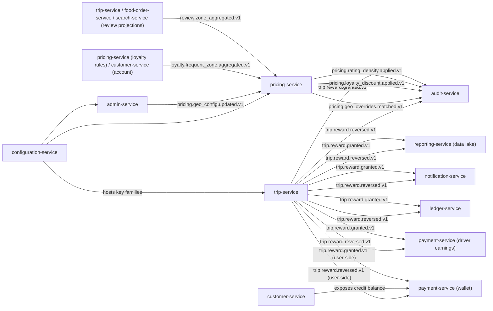

# Master Implementation Plan

> **Purpose:** Single source of truth for **what** is being built, **in what
> order**, and **where the per-service plan lives**. The 21 per-service
> `PLAN.md` files linked from this document are the per-service source of
> truth for **how** each active service is built.
>
> **Updated:** 2026-08-14 (post-customer-service graduate; Phase 8
> appended covering the 11 remaining stub services in tier order;
> see [`DEPLOYMENT_ORDER.md`](DEPLOYMENT_ORDER.md) §8)
> **Total active services:** 21 (20 per
> [ADR-0017](architecture/adrs/0017-20-service-architecture.md) +
> `chat-service` per Phase 7.7 / [ADR-0021](architecture/adrs/0021-21-service-architecture-with-chat.md))
> **Timeline:** 44 weeks for Phases 1–7.7 + 5 weeks for Phase 8
> (Tier 1 → Tier 3 graduation of the 11 remaining stubs) = ~49 weeks total
> **Status:** All 21 per-service PLAN.md files exist; this master plan binds
> them to the locked implementation order. 9 of 21 services have graduated;
> `customer-service` graduated 2026-08-14; the other 11 are stub scaffolds
> covered by Phase 8 below.

---

## How to read this document

| Question | Answer |
|----------|--------|
| _What is the order of implementation?_ | The "Implementation Order" tables below, one per phase. |
| _How do I build a specific service?_ | The per-service `PLAN.md` linked from the "Per-service Plans" section. |
| _What cross-cutting changes ship later?_ | Phase 7 (Guaranteed Rewards + Rating-Based Pricing) and Phase 7.5 (Make-a-Deal kernel). |
| _What events are produced and consumed?_ | `services/<svc>/INTEGRATION.md` is authoritative; the per-service `PLAN.md` summarizes. |
| _Which tier is a service in?_ | `SERVICE_INTEGRATION_MATRIX.md` (Tier 0–6 column). |
| _What is the **runtime deployment order**? (Tier 0 → Tier 3 sequence with hard / soft service deps)_ | [`DEPLOYMENT_ORDER.md`](DEPLOYMENT_ORDER.md) — distinct from the implementation order above; every per-service `PLAN.md` carries a `Hard service-to-service dependencies` callout that references this doc. |

The order is **locked** to `IMPLEMENTATION_PHASES.md`. Do not re-order
without updating this file, `IMPLEMENTATION_PHASES.md`, and notifying
all teams.

---

## Implementation Order (locked)

### Phase 1 — Platform Foundation (Weeks 1–4)

| # | Service | Tier | Tech | Plan |
|---|---------|------|------|------|
| 1 | `configuration-service` | 0 | Kotlin/Spring | [PLAN](services/configuration-service/PLAN.md) |
| 2 | ``configuration-service` (flags)` | 0 | Kotlin/Spring | [PLAN](services/configuration-service/PLAN.md) |
| 3 | `identity-service` | 1 | Node/TS | [PLAN](services/identity-service/PLAN.md) |
| 4 | `geolocation-service` | 1 | Go | [PLAN](services/geolocation-service/PLAN.md) |
| 5 | `api-gateway` | 1 | Go/Envoy | [PLAN](services/api-gateway/PLAN.md) |
| 6 | ``notification-service` (provider ACL)` | 1 | Go | [PLAN](services/notification-service/PLAN.md) |
| 7 | `file-service` | 1 | Go | [PLAN](services/file-service/PLAN.md) |
| 8 | `audit-service` | 1 | Go | [PLAN](services/audit-service/PLAN.md) |
| 9 | ``geolocation-service` (zones)` | 1 | Kotlin/Spring | [PLAN](services/geolocation-service/PLAN.md) |
| 10 | `ledger-service` | 1 | Node/TS | [PLAN](services/ledger-service/PLAN.md) |

**Block on:** nothing. Start in order; items 5–7 can move in parallel
with 1–4 once their first dependency is green.

### Phase 2 — Core Business & Identity (Weeks 5–12)

| # | Service | Tier | Tech | Plan |
|---|---------|------|------|------|
| 11 | `customer-service` (absorbs ``customer-service` (cross-persona profile)`, ``customer-service` (addresses)`) | 2 | Kotlin/Spring | [PLAN](services/customer-service/PLAN.md) |
| 12 | `driver-service` (absorbs ``driver-service` (availability)`, ``driver-service` (location)`, ``driver-service` (dispatch)`, ``driver-service` (incentives)`, ``driver-service` (vehicles)`) | 2 | Kotlin/Spring | [PLAN](services/driver-service/PLAN.md) |
| 13 | `courier-service` (absorbs ``courier-service` (dispatch)`, ``courier-service` (tracking)`, ``courier-service` (delivery)`) | 2 | Kotlin/Spring | [PLAN](services/courier-service/PLAN.md) |
| 14 | `notification-service` (absorbs ``notification-service` (provider ACL)`) | 2 | Kotlin/Spring | [PLAN](services/notification-service/PLAN.md) |
| 15 | `admin-service` (absorbs ``admin-service` (support module)`) | 2 | Kotlin/Spring | [PLAN](services/admin-service/PLAN.md) |
| 16 | `payment-service` (absorbs ``payment-service` (wallet)`, ``payment-service` (ride saga)`, ``payment-service` (food saga)`, ``payment-service` (driver earnings)`, ``payment-service` (courier earnings)`, ``payment-service` (merchant settlement)`) | 3 | Kotlin/Spring | [PLAN](services/payment-service/PLAN.md) |
| 17 | `fraud-risk-service` | 2 | Python/FastAPI | [PLAN](services/fraud-risk-service/PLAN.md) |
| 18 | `pricing-service` (absorbs ``pricing-service` (tax)`, ``pricing-service` (promotion)`, loyalty-rules from ``pricing-service` (loyalty rules) / `customer-service` (account)`) | 3 | Kotlin/Spring | [PLAN](services/pricing-service/PLAN.md) |

### Phase 3 — Ride-Hailing Domain (Weeks 13–20)

| # | Service | Tier | Tech | Plan |
|---|---------|------|------|------|
| 19 | `trip-service` (absorbs ``trip-service` (ride-request)`, ``trip-service` (scheduled)`, ``trip-service` (safety)`, ``trip-service` (history)`, trip-review projection of ``trip-service` / `food-order-service` / `search-service` (review projections)`) | 4 | Kotlin/Spring | [PLAN](services/trip-service/PLAN.md) |
| 20 | `geolocation-service` (absorbs ``geolocation-service` (ETA/routing)`, ``geolocation-service` (zones)`) | 3 | Go | [PLAN](services/geolocation-service/PLAN.md) |

### Phase 4 — Food Marketplace (Weeks 21–28)

| # | Service | Tier | Tech | Plan |
|---|---------|------|------|------|
| 21 | `restaurant-service` (absorbs ``restaurant-service` (merchant)`, ``restaurant-service` (branch)`, ``restaurant-service` (menu)`, ``restaurant-service` (inventory)`, ``restaurant-service` (staff)`) | 3 | Kotlin/Spring | [PLAN](services/restaurant-service/PLAN.md) |
| 22 | `food-order-service` (absorbs ``food-order-service` (cart)`, ``food-order-service` (checkout)`, ``food-order-service` (queue)`, food-review projection of ``trip-service` / `food-order-service` / `search-service` (review projections)`) | 5 | Kotlin/Spring | [PLAN](services/food-order-service/PLAN.md) |
| 23 | `search-service` (absorbs search-review projection of ``trip-service` / `food-order-service` / `search-service` (review projections)`) | 6 | Kotlin/Spring | [PLAN](services/search-service/PLAN.md) |

### Phase 5 — Food Delivery & Financial (Weeks 29–34)

| # | Service | Tier | Tech | Plan |
|---|---------|------|------|------|
| 24 | `payment-service` — financial aggregation already in Phase 2; Phase 5 hardens ride + food + driver + courier + restaurant settlement end-to-end | 3 | Kotlin/Spring | [PLAN](services/payment-service/PLAN.md) |

### Phase 6 — Analytics & Enhancements (Weeks 35–40)

| # | Service | Tier | Tech | Plan |
|---|---------|------|------|------|
| 25 | `reporting-service` (absorbs ``reporting-service` (data lake)`) | 6 | Kotlin/Spring | [PLAN](services/reporting-service/PLAN.md) |

### Phase 7 — Cross-cutting: Guaranteed Rewards & Rating-Based Pricing (Weeks 41–44)

Participating services (each ships a `Phase 7.0` block in its PLAN.md):

| Service | Role in Phase 7 |
|---------|-----------------|
| [`trip-service`](services/trip-service/PLAN.md) | Producer — `trip.reward.granted.v1`, `trip.reward.reversed.v1`; append-only `trip.trip_reward` + `trip.trip_reward_reversal` (REVOKE UPDATE/DELETE) |
| [`pricing-service`](services/pricing-service/PLAN.md) | Consumer — rating-density (`review.zone_aggregated.v1`), frequent-rider (`loyalty.frequent_zone.aggregated.v1`), geo-config (`pricing.geo_config.updated.v1`) |
| [`admin-service`](services/admin-service/PLAN.md) | Producer — `/v1/admin/pricing/geo-config[...]` (create/read/patch/disable/rollback/list) |
| `trip-service` / `food-order-service` / `search-service` (review projections) | Producer — `review.zone_aggregated.v1` (debounced per zone) — see [`trip-service`](services/trip-service/PLAN.md), [`food-order-service`](services/food-order-service/PLAN.md), [`search-service`](services/search-service/PLAN.md) |
| `pricing-service` (loyalty rules) / `customer-service` (account) | Producer — `loyalty.frequent_zone.aggregated.v1` (debounced daily) — see [`pricing-service`](services/pricing-service/PLAN.md), [`customer-service`](services/customer-service/PLAN.md) |
| [`payment-service`](services/payment-service/PLAN.md) (driver earnings worker) | Consumer — `type=guaranteed_topup` on grant, `type=correction` on reversal |
| [`payment-service`](services/payment-service/PLAN.md) (wallet worker) | Consumer — user-side grant; idempotency `request:{request_id}:reward:user:grant` |
| [`customer-service`](services/customer-service/PLAN.md) | Mirror — exposes user-side credit balance |
| [`ledger-service`](services/ledger-service/PLAN.md) | Informational consumer — chart-of-account sub-accounts `6302_guaranteed_minimum` and `2100_customer_credit_liability` |
| [`notification-service`](services/notification-service/PLAN.md) | Consumer — `trip.reward.granted`, `trip.reward.reversed` templates |
| [`audit-service`](services/audit-service/PLAN.md) | Consumer — `audit.trip_reward.v1` rows |
| [`reporting-service`](services/reporting-service/PLAN.md) (data lake worker) | Mirror — rewards fact table |
| [`configuration-service`](services/configuration-service/PLAN.md) | Hosts key families `trip.reward.*`, `pricing.rating_density.*`, `pricing.loyalty.frequent_rider.*`, `pricing.geo_overrides.*` |

Cross-doc consistency: the canonical 17-service accounting-impact list lives
in `workflows/ACCOUNTING_WORKFLOWS.md` "Guaranteed Rewards — Driver Top-Up +
Customer Credit".

### Phase 7.5 — Make-a-Deal Kernel (Weeks 41–42, parallel with Phase 7)

Single source of truth: `docs/shared/DEAL_FEATURE.md`. Each participating
service ships a `Phase 7.5` block in its PLAN.md and owns its own deal rows
and event production. **No central binary** — the kernel is a Markdown
contract, not a JAR.

| # | Service | Role | Week |
|---|---------|------|------|
| 59 | [`pricing-service`](services/pricing-service/PLAN.md) | Helper — `GET /v1/quotes/{id}/fairness-band`, `max_fare_override` rule kind | 41 |
| 60 | [`configuration-service`](services/configuration-service/PLAN.md) | Helper — `deal.*` key family `{min, max, currency}` (422 `INVALID_BAND`) | 41 |
| 61 | [`notification-service`](services/notification-service/PLAN.md) | Helper — 5 deal templates, audit-bound to `template_version_snapshot_id` | 41 |
| 62 | [`configuration-service`](services/configuration-service/PLAN.md) (flags worker) | Helper — `deal.enabled.{city_id}.{ride_type}` | 41 |
| 63 | [`audit-service`](services/audit-service/PLAN.md) | Helper — consume all 12 `*.deal.*.v1` events, write `audit.deal_transition.v1` | 41 |
| 64 | [`trip-service`](services/trip-service/PLAN.md) (ride-request worker) | Rider boundary — ride-side endpoints + 5 ride events | 42 |
| 65 | [`driver-service`](services/driver-service/PLAN.md) (dispatch worker) | Driver boundary — dispatch-side endpoints + 4 dispatch events | 42 |
| 66 | [`food-order-service`](services/food-order-service/PLAN.md) | Customer boundary — food-side endpoints + 5 food events | 42 |
| 67 | [`courier-service`](services/courier-service/PLAN.md) (dispatch worker) | Courier boundary — mirrors dispatch for the food vertical | 42 |

Rollout: `deal.enabled.{city_id}.{ride_type}` = OFF in production. Smoke
test 1 city × 1 ride_type → 1 city × all ride_types → all cities × all
ride_types per `docs/shared/DEAL_FEATURE.md` 9.

### Phase 7.7 — Communication Kernel (chat-service, cross-cutting)

Added 2026-08-12. Single new service: `chat-service`. The kernel
implements 1:1 in-app chat threads between the two participants of a
service context (rider ↔ driver, customer ↔ restaurant, customer ↔
courier). Threads, messages, attachments, read state, typing,
moderation; WebSocket fan-out via Redis Pub/Sub; offline push
fallback via `notification-service`.

| # | Service | Tier | Tech | Plan |
|---|---------|------|------|------|
| 68 | `chat-service` | 1 | Go/chi + coder/websocket | [PLAN](services/chat-service/PLAN.md) |

Participating services (consumers / producers; chat is NOT a
Conductor workflow — it is an in-service saga):

| Service | Role |
|---------|------|
| [`api-gateway`](services/api-gateway/PLAN.md) | Terminates `WSS://api.<region>.trips-enjoy.com/v1/chat/ws` |
| [`trip-service`](services/trip-service/PLAN.md) | Producer of `ride.request.matched.v1` (creates trip_chat thread) |
| [`food-order-service`](services/food-order-service/PLAN.md) | Producer of `food.order.accepted.v1` (creates food_order_chat thread) |
| [`courier-service`](services/courier-service/PLAN.md) | Producer of `delivery.courier.assigned.v1` (creates delivery_chat thread) |
| [`notification-service`](services/notification-service/PLAN.md) | Consumer of `chat.message.offline_delivery_required.v1` (push fallback) |
| [`admin-service`](services/admin-service/PLAN.md) | Consumer of `chat.message.reported.v1` (opens support ticket) |
| [`fraud-risk-service`](services/fraud-risk-service/PLAN.md) | Consumer of `chat.message.reported.v1` (abuse signal feature) |
| [`reporting-service`](services/reporting-service/PLAN.md) | Consumer of every `chat.*.v1` (analytics + retention) |
| [`restaurant-service`](services/restaurant-service/PLAN.md) | Passive (read its own threads via chat-service REST) |

Single source of truth: `docs/services/chat-service/`.

---

### Phase 8 — Tier 1 → Tier 3 graduation (post-customer-service)

> **Purpose.** Phase 1–7 of the platform build are
> **substantially complete**: 9 of 21 active services have
> graduated (configuration, identity, audit, ledger,
> notification, api-gateway, file, geolocation, reporting) plus
> `customer-service` as the 10th graduate on 2026-08-14. Phase
> 8 covers the remaining **11 stub services** and is ordered by
> the **runtime deployment tier** (per
> [`DEPLOYMENT_ORDER.md` §2](DEPLOYMENT_ORDER.md)) — not the
> original implementation week — because the Tier 2 services
> (`trip-service`, `food-order-service`) cannot reach a green
> `/ready` until every Tier 1 service they hard-dep on is live.
>
> **Ordering rationale.** Phase 8 walks the tier table in
> ascending tier/position so that each service starts only
> after its hard deps graduate. Within a tier, the order
> matches DEPLOYMENT_ORDER.md §2 (greenfield install sequence).
> Phase 8.0 below is the smallest unblock for the Tier 2
> services (`trip-service` + `food-order-service`), which
> hard-dep on **every** Tier 1 service except
> `restaurant-service` (food only), `search-service` (Tier 2
> soft), and `reporting-service` (Tier 2).

| Phase | Sub-phase | Services | Goal |
|---|---|---|---|
| 8.0 | Tier 1 unblock (foundations) | `payment-service` | The longest single-service build on the platform (46-gateway registry + 17 Conductor sagas + wallet + earnings + merchant settlement + COD). Unblocks the Tier 2 services' hard-deps on payment. |
| 8.1 | Tier 1 dispatch surface | `driver-service`, `courier-service` | Two near-clones of customer-service (KYC contract + identity + state machine). Both feed dispatch for `trip-service` and `food-order-service`. |
| 8.2 | Tier 1 quote surface | `restaurant-service`, `pricing-service` | `restaurant-service` provides menu/KYC for `food-order-service`; `pricing-service` provides quote-with-tax for both `trip-service` and `food-order-service`. |
| 8.3 | Tier 1 risk + RBAC surface | `fraud-risk-service`, `admin-service` | `fraud-risk-service` provides scoring + device fingerprinting; `admin-service` provides the BFF aggregator + super-admin preset + 60+ BFF wrappers (per the recent Phase A expansion). |
| 8.4 | Tier 2 (business logic) | `trip-service`, `food-order-service`, `search-service` | The two domain-logic services + the OpenSearch indexer. `trip-service` and `food-order-service` are the only two services that hard-dep on every other Tier 1 service. |
| 8.5 | Tier 3 (cross-cutting) | `chat-service` | The 21st service — WebSocket chat kernel + 9 consumer wirings (per Phase 7.7 / [ADR-0021](architecture/adrs/0021-21-service-architecture-with-chat.md)). Largest blast radius; canary required per `DEPLOYMENT_ORDER.md` §4.2. |

#### Phase 8.0 — payment-service (Tier 1, position 16)

- **Tech**: Kotlin + Spring Boot 4 (per its own `PLAN.md`).
- **Why first**: it is the longest single-service build on the
  platform (46-gateway registry, 17 Conductor sagas, wallet,
  driver/courier earnings, merchant settlement, COD, ride
  saga, food saga). Starting it earliest maximises the runway
  before Tier 2 needs it. Per
  [`DEPLOYMENT_ORDER.md` §8.4](DEPLOYMENT_ORDER.md) it is the
  first Tier 1 unblock target.
- **Hard deps** that must be live by the time `payment-service`
  starts `/ready`: `configuration-service`, `ledger-service`,
  `pricing-service`. (`ledger-service` already graduated;
  `pricing-service` lands in Phase 8.2; `configuration-service`
  already graduated.) Plan the build so that `payment-service`
  uses a **stub pricing-service** via the test profile until
  Phase 8.2 lands.
- **Lift-forward patterns** (per `DEPLOYMENT_ORDER.md` §8.3):
  `Uuid.generateV7().toJavaUuid()` (Kotlin 2.4.10), `kotlin.uuid`
  stdlib, 5-layer outbound isolation (semaphore +
  `sony/gobreaker` + bulkhead + timeout + retry), multi-provider
  chain resolver (lifted from `geolocation-service` for the
  46-gateway registry), `ApplicationRunner` seeder,
  multi-stage Dockerfile, kustomize flat overlays, PrometheusRule
  with 8 alerts + 10 recording rules.
- **Conductor workers** (per
  [`shared/CONDUCTOR_WORKFLOWS.md`](shared/CONDUCTOR_WORKFLOWS.md)):
  `wf.refund.standard.v1`, `wf.refund.partial.v1`,
  `wf.payment.capture.v1`, `wf.payment.ride_saga.v1`,
  `wf.payment.food_saga.v1`, `wf.merchant.settlement.v1` (6 of
  17 workflow IDs).
- **Acceptance**: ≥40 unit tests + ≥5 integration tests
  covering the 46-gateway registry adapter pattern + each Conductor
  saga step + ledger double-entry validation.

#### Phase 8.1 — driver-service + courier-service (Tier 1, positions 10–11)

- **Tech**: Kotlin + Spring Boot 4 for both.
- **Why these two together**: they are structural near-clones
  of `customer-service` (the just-graduated reference): KYC
  contract, identity-service hard dep, notification-service soft
  dep, customer-service hard dep (KYC contract). Lift the
  customer-service patterns wholesale.
- **Hard deps** by the time they start `/ready`:
  `customer-service` + `identity-service` + `configuration-service`.
  All three already graduated.
- **Lift-forward patterns** (per `customer-service` memory
  `uber-customer-service-implementation-2026-08-14.md`):
  Jackson 2/3, Hibernate 7 JSONB, Testcontainers Keycloak,
  append-only triggers, partition maintenance,
  inbox/outbox with idempotency, RFC 7807 envelope,
  idempotency-key middleware on every mutating route, Flyway seed
  with `uuid_generate_v7` helper, `application-test.yml` with
  `jdbc:postgresql://.../trips_enjoy?currentSchema=<schema>`.
- **Domain-specific adds**:
  - `driver-service`: driver state machine
    (`pending_review` → `approved` → `suspended` →
    `inactive` → `erased`), vehicle sub-aggregate, online-state
    Kafka topic, dispatch surface consumed by `trip-service`.
  - `courier-service`: courier state machine (same shape but
    with `shift` entity), availability + dispatch, delivery
    sub-aggregate. Pattern lifted from `delivery-service` /
    `courier-dispatch-service` per the 2026-08-05 consolidation.
- **Acceptance**: ≥30 unit tests per service + ≥3 integration
  tests per service (KYC happy path, state-machine transition
  negative test, identity-service stub).

#### Phase 8.2 — restaurant-service + pricing-service (Tier 1, positions 12 + 15)

- **restaurant-service** (Kotlin/Spring, Tier 1 position 12):
  the merchant KYC + menu + branch + inventory + staff
  consolidated service. Hard deps: `customer-service`,
  `identity-service`, `configuration-service` (all graduated).
  Soft dep: `notification-service` (graduated).
  - Lift `restaurant-merchant`, `restaurant-branch`,
    `restaurant-menu`, `restaurant-inventory`,
    `restaurant-staff` patterns from the 2026-08-05
    consolidation; add the per-restaurant loyalty
    opt-in + `restaurant.tax_id_encrypted` JSONB column.
  - ≥35 unit tests + ≥4 integration tests.

- **pricing-service** (Kotlin/Spring, Tier 1 position 15):
  the quote engine. Hard deps: `configuration-service`,
  `customer-service` (loyalty-account exposure). Soft dep:
  `trip-service` (will graduate in Phase 8.4; pricing can ship
  without it because the soft-dep fallback is documented
  circuit-breaker). Wait for Phase 8.0 (`payment-service`) for
  the tax line items contract.
  - Absorb the Phase 7.0 / 7.5 contracts already documented in
    `pricing-service/PLAN.md` (rating-density surge,
    frequent-rider loyalty discount, geo-config overrides,
    fairness band for Make-a-Deal).
  - ≥40 unit tests + ≥5 integration tests (tariff hierarchy,
    loyalty discount pipeline, geo-config resolution,
    Make-a-Deal fairness band, tax line items).

#### Phase 8.3 — fraud-risk-service + admin-service (Tier 1, positions 13–14)

- **fraud-risk-service** (Python/FastAPI, Tier 1 position 14):
  the risk-scoring engine. Hard dep: `configuration-service`.
  Soft dep: `customer-service` (user history). Pattern lift:
  `reporting-service` is the reference Python graduate.
  - ≥25 unit tests + ≥3 integration tests (scoring threshold
    update, device-fingerprint cache TTL, chargeback signal
    feature).

- **admin-service** (Kotlin/Spring, Tier 1 position 13):
  the BFF aggregator + super-admin console. Hard deps:
  `configuration-service`, `identity-service`. Soft deps: every
  other service (admin starts; serves cached BFF responses
  until upstreams come up). Pattern lift: configuration-service
  seeder + audit emit pattern.
  - 60+ BFF wrappers across the graduated services; 20 BFF
    wrappers to be added after each Phase 8 graduate per the
    admin BFF expansion (`§1.22` in `INTEGRATION.md`).
  - Super-admin preset (1 × `platform.super_admin` + 20 ×
    `<service>.admin`) per
    [`shared/TIME_BOUNDED_ALIASES.md`](shared/TIME_BOUNDED_ALIASES.md).
  - ≥35 unit tests + ≥5 integration tests (RBAC matrix,
    break-glass co-signature, BFF cache TTL, SUPER_ADMIN
    grant/revoke).

#### Phase 8.4 — trip-service, food-order-service, search-service (Tier 2, positions 17–19)

- **trip-service** (Kotlin/Spring, Tier 2 position 17): the
  ride aggregator. Hard deps: customer, driver, pricing,
  payment, geolocation, notification, configuration. By Phase
  8.4 start, all 7 are graduated. The biggest Tier 2 service
  in surface area; absorbs trip-ride-request, trip-scheduled,
  trip-safety, trip-history, trip-review. Phase 7.0
  guaranteed-rewards block already documented; absorb the
  Conductor workers `wf.ride.dispatch.v1`,
  `wf.ride.match.v1`, `wf.trip.reward_grant.v1`,
  `wf.trip.reward_reversal.v1`. ≥50 unit tests + ≥6
  integration tests (ride-request happy path, no-driver-found
  fallback, scheduled-ride pickup window, safety incident
  trigger, reward grant + reversal, review submission).

- **food-order-service** (Kotlin/Spring, Tier 2 position 18):
  the food aggregator. Hard deps: customer, restaurant,
  pricing, payment, courier, notification, configuration.
  Absorbs food-order-cart, food-order-checkout,
  food-order-queue, food-review. ≥45 unit tests + ≥5
  integration tests (cart happy path, checkout with tax +
  loyalty discount, courier dispatch, courier handoff,
  review submission).

- **search-service** (Kotlin/Spring, Tier 2 position 19):
  the OpenSearch indexer. Hard dep: `configuration-service`.
  Soft deps: `restaurant-service`, `trip-service` (both
  graduated by Phase 8.4 start). Index bootstraps from
  upstream events. Pattern lift: configuration-service Kafka
  consumer + projection handler. ≥30 unit tests + ≥3
  integration tests (restaurant menu index rebuild, trip
  review projection, OpenSearch bulk refresh).

#### Phase 8.5 — chat-service (Tier 3, position 21)

- **chat-service** (Go + chi + `coder/websocket`, Tier 3
  position 21): the WebSocket chat kernel. Hard deps:
  `configuration-service`, `identity-service`. Soft deps:
  `trip-service`, `food-order-service`, `courier-service`,
  `notification-service`, `admin-service`,
  `fraud-risk-service`, `restaurant-service` — all of which
  are graduated by the time Phase 8.5 starts. Pattern lift:
  `api-gateway` Go patterns (RequestID middleware, RFC 7807
  envelope, `sony/gobreaker` isolation, Redis Pub/Sub fan-out).
- **9 consumer wirings** (per Phase 7.7 / [ADR-0021](architecture/adrs/0021-21-service-architecture-with-chat.md)):
  api-gateway WS upgrade, trip-service match event,
  food-order-service accept event, courier-service assign
  event, notification-service offline push, admin-service
  moderation, fraud-risk-service abuse signal,
  restaurant-service passive read, reporting-service
  analytics + retention.
- **Acceptance**: ≥35 unit tests + ≥5 integration tests
  (WebSocket handshake + JWT, Redis Pub/Sub fan-out,
  thread-create-on-match, thread-create-on-accept,
  thread-create-on-assign, offline push fallback, GDPR
  sweep).

#### Cross-cutting concerns for Phase 8

- **Partition maintenance**: every new Kotlin service inherits
  `partman.ensure_partitions` + `drop_expired_partitions` +
  `partition_health` from
  [`shared/PARTITION_FUNCTIONS.md`](shared/PARTITION_FUNCTIONS.md)
  (already used by audit, ledger, notification, configuration,
  identity). `payment-service`, `pricing-service`,
  `trip-service`, `food-order-service`, `restaurant-service`
  need time-partitioned parents per
  [`architecture/DATABASE_ARCHITECTURE.md`](architecture/DATABASE_ARCHITECTURE.md)
  §"RANGE-by-time only".
- **Append-only triggers**: `ledger` (financial immutability)
  + `audit` (already done). `payment-service`'s postings
  table must adopt the same trigger pattern.
- **Conductor workers**: 17 workflow IDs total across the
  platform; payment-service + notification-service + 4
  others own the bulk. `trip-service`, `food-order-service`,
  `pricing-service` add theirs in Phase 8.
- **Kafka bootstrap**: every new service must default
  `http://81.208.166.110:9092` per
  [`shared/PLATFORM_BASELINE.md`](shared/PLATFORM_BASELINE.md) —
  no service-specific env names without a new ADR.
- **DB schema naming**: every service gets its own snake_case
  schema in `trips_enjoy` DB per
  [`services/README.md`](README.md) env table. New schemas in
  Phase 8: `payment`, `driver`, `courier`, `restaurant`,
  `pricing`, `admin`, `fraud_risk`, `trip`, `food_order`,
  `search`, `chat`. (11 new schemas — bring the platform
  total to 21 active schemas.)
- **Migrations**: each new service's starter is built from
  `apps/<svc>/` via the Spring Initializr scaffold documented
  in [`services/SPRING_INITIALIZR.md`](services/SPRING_INITIALIZR.md)
  (Go services use `go.mod` + `internal/`; Python services use
  `pyproject.toml` + `app/`).
- **Immutability pattern** (memory entry
  `uber-docs-append-not-renumber.md`): all Phase 8 sections
  append. Existing Phase 1–7 section numbers stay. The 12
  per-service `PLAN.md` files are the per-service source of
  truth; this master section is the cross-service ordering.

#### Phase 8 timeline (target: 2026-08-21 → 2026-09-21)

> **Scope.** Indicative 5-week horizon. Each sub-phase
> produces a running graduate (apps/<svc>/ + tests + K8s +
> monitoring + implementation memory entry). A graduate does
> not block the next sub-phase; intra-phase parallelism is
> allowed where independent (e.g., driver + courier are
> near-clones and can run on two parallel branches).

| Sub-phase | Week | Graduate | New graduates |
|---|---|---|---|
| 8.0 | W1 | `payment-service` | 1 |
| 8.1 | W2 | `driver-service`, `courier-service` | 2 |
| 8.2 | W3 | `restaurant-service`, `pricing-service` | 2 |
| 8.3 | W4 | `fraud-risk-service`, `admin-service` | 2 |
| 8.4 | W4–W5 | `trip-service`, `food-order-service`, `search-service` | 3 |
| 8.5 | W5 | `chat-service` | 1 |

**End-state graduation count: 9 + 1 (customer) + 11 (Phase 8)
= 21 / 21.** After Phase 8 ships, the greenfield install can
deploy the entire 21-service catalog per
[`DEPLOYMENT_ORDER.md`](DEPLOYMENT_ORDER.md) §2 in full.

#### Post-Phase-8 follow-ups (out of scope here)

- Phase 8.6: Conductor workflow end-to-end smoke in dev (17
  workflows × 15 worker services).
- Phase 8.7: Cross-region failover rehearsal (Tokyo ↔
  Singapore ↔ Frankfurt) using the full 21-service stack.
- Phase 8.8: production rollout ring 1 (1 region, 1 vendor)
  with the Phase 7 + 7.5 + 7.7 addenda enabled.

---

Every service has a PLAN.md. The 10-phase structure is identical across
all 20 active services; only the per-service body, events, and Phase 7 / 7.5
participation blocks differ.

| Service | Tier | Tech | Criticality | PLAN.md |
|---------|------|------|-------------|---------|
| ``customer-service` (addresses)` | 2 | Kotlin/Spring | T2 (99.9%) | [PLAN](services/customer-service/PLAN.md) |
| `admin-service` | 2 | Kotlin/Spring | T2 (99.9%) | [PLAN](services/admin-service/PLAN.md) |
| ``reporting-service` (data lake)` | 6 | Kotlin/Spring | T3 (99.5%) | [PLAN](services/reporting-service/PLAN.md) |
| `api-gateway` | 1 | Go/Envoy | T0 (99.99%) | [PLAN](services/api-gateway/PLAN.md) |
| `audit-service` | 1 | Go | T1 (99.95%) | [PLAN](services/audit-service/PLAN.md) |
| ``restaurant-service` (branch)` | 3 | Kotlin/Spring | T2 (99.9%) | [PLAN](services/restaurant-service/PLAN.md) |
| ``food-order-service` (cart)` | 4 | Kotlin/Spring | T2 (99.9%) | [PLAN](services/food-order-service/PLAN.md) |
| ``food-order-service` (checkout)` | 5 | Kotlin/Spring | T1 (99.95%) | [PLAN](services/food-order-service/PLAN.md) |
| ``notification-service` (provider ACL)` | 1 | Go | T2 (99.9%) | [PLAN](services/notification-service/PLAN.md) |
| `configuration-service` | 0 | Kotlin/Spring | T1 (99.95%) | [PLAN](services/configuration-service/PLAN.md) |
| ``courier-service` (dispatch)` | 5 | Python/FastAPI | T1 (99.95%) | [PLAN](services/courier-service/PLAN.md) |
| ``payment-service` (courier earnings)` | 5 | Kotlin/Spring | T2 (99.9%) | [PLAN](services/payment-service/PLAN.md) |
| `courier-service` | 2 | Kotlin/Spring | T2 (99.9%) | [PLAN](services/courier-service/PLAN.md) |
| ``courier-service` (tracking)` | 3 | Go | T1 (99.95%) | [PLAN](services/courier-service/PLAN.md) |
| `customer-service` | 2 | Kotlin/Spring | T1 (99.95%) | [PLAN](services/customer-service/PLAN.md) |
| ``courier-service` (delivery)` | 5 | Kotlin/Spring | T1 (99.95%) | [PLAN](services/courier-service/PLAN.md) |
| ``driver-service` (dispatch)` | 4 | Kotlin/Spring | T1 (99.95%) | [PLAN](services/driver-service/PLAN.md) |
| ``driver-service` (availability)` | 3 | Go | T1 (99.95%) | [PLAN](services/driver-service/PLAN.md) |
| ``payment-service` (driver earnings)` | 4 | Kotlin/Spring | T2 (99.9%) | [PLAN](services/payment-service/PLAN.md) |
| ``driver-service` (incentives)` | 5 | Python/FastAPI | T3 (99.5%) | [PLAN](services/driver-service/PLAN.md) |
| ``driver-service` (location)` | 3 | Go | T1 (99.95%) | [PLAN](services/driver-service/PLAN.md) |
| `driver-service` | 2 | Kotlin/Spring | T1 (99.95%) | [PLAN](services/driver-service/PLAN.md) |
| ``geolocation-service` (ETA/routing)` | 3 | Go | T2 (99.9%) | [PLAN](services/geolocation-service/PLAN.md) |
| ``configuration-service` (flags)` | 0 | Kotlin/Spring | T0 (99.99%) | [PLAN](services/configuration-service/PLAN.md) |
| `file-service` | 1 | Go | T2 (99.9%) | [PLAN](services/file-service/PLAN.md) |
| `food-order-service` | 5 | Kotlin/Spring | T1 (99.95%) | [PLAN](services/food-order-service/PLAN.md) |
| ``payment-service` (food saga)` | 5 | Kotlin/Spring | T1 (99.95%) | [PLAN](services/payment-service/PLAN.md) |
| `fraud-risk-service` | 2 | Python/FastAPI | T2 (99.9%) | [PLAN](services/fraud-risk-service/PLAN.md) |
| `geolocation-service` | 1 | Go | T1 (99.95%) | [PLAN](services/geolocation-service/PLAN.md) |
| `identity-service` | 1 | Node/TS | T0 (99.99%) | [PLAN](services/identity-service/PLAN.md) |
| ``restaurant-service` (inventory)` | 4 | Kotlin/Spring | T2 (99.9%) | [PLAN](services/restaurant-service/PLAN.md) |
| `ledger-service` | 1 | Node/TS | T0 (99.99%) | [PLAN](services/ledger-service/PLAN.md) |
| ``pricing-service` (loyalty rules) / `customer-service` (account)` | 4 | Kotlin/Spring | T2 (99.9%) | [PLAN — pricing](services/pricing-service/PLAN.md) · [PLAN — customer](services/customer-service/PLAN.md) |
| ``restaurant-service` (menu)` | 4 | Kotlin/Spring | T2 (99.9%) | [PLAN](services/restaurant-service/PLAN.md) |
| ``restaurant-service` (merchant)` | 3 | Kotlin/Spring | T2 (99.9%) | [PLAN](services/restaurant-service/PLAN.md) |
| `notification-service` | 2 | Kotlin/Spring | T2 (99.9%) | [PLAN](services/notification-service/PLAN.md) |
| `payment-service` | 3 | Kotlin/Spring | T0 (99.99%) | [PLAN](services/payment-service/PLAN.md) |
| `pricing-service` | 3 | Kotlin/Spring | T1 (99.95%) | [PLAN](services/pricing-service/PLAN.md) |
| ``pricing-service` (promotion)` | 2 | Kotlin/Spring | T2 (99.9%) | [PLAN](services/pricing-service/PLAN.md) |
| `reporting-service` | 6 | Python/FastAPI | T3 (99.5%) | [PLAN](services/reporting-service/PLAN.md) |
| ``food-order-service` (queue)` | 5 | Kotlin/Spring | T2 (99.9%) | [PLAN](services/food-order-service/PLAN.md) |
| `restaurant-service` | 3 | Kotlin/Spring | T2 (99.9%) | [PLAN](services/restaurant-service/PLAN.md) |
| ``payment-service` (merchant settlement)` | 5 | Kotlin/Spring | T1 (99.95%) | [PLAN](services/payment-service/PLAN.md) |
| ``restaurant-service` (staff)` | 4 | Kotlin/Spring | T3 (99.5%) | [PLAN](services/restaurant-service/PLAN.md) |
| ``trip-service` / `food-order-service` / `search-service` (review projections)` | 4 | Kotlin/Spring | T2 (99.9%) | [PLAN — trip](services/trip-service/PLAN.md) · [PLAN — food](services/food-order-service/PLAN.md) · [PLAN — search](services/search-service/PLAN.md) |
| ``trip-service` (history)` | 6 | Kotlin/Spring | T3 (99.5%) | [PLAN](services/trip-service/PLAN.md) |
| ``payment-service` (ride saga)` | 5 | Kotlin/Spring | T1 (99.95%) | [PLAN](services/payment-service/PLAN.md) |
| ``trip-service` (ride-request)` | 4 | Kotlin/Spring | T1 (99.95%) | [PLAN](services/trip-service/PLAN.md) |
| ``trip-service` (safety)` | 4 | Kotlin/Spring | T1 (99.95%) | [PLAN](services/trip-service/PLAN.md) |
| ``trip-service` (scheduled)` | 4 | Kotlin/Spring | T2 (99.9%) | [PLAN](services/trip-service/PLAN.md) |
| `search-service` | 6 | Kotlin/Spring | T2 (99.9%) | [PLAN](services/search-service/PLAN.md) |
| ``admin-service` (support module)` | 2 | Kotlin/Spring | T2 (99.9%) | [PLAN](services/admin-service/PLAN.md) |
| ``pricing-service` (tax)` | 2 | Kotlin/Spring | T2 (99.9%) | [PLAN](services/pricing-service/PLAN.md) |
| `trip-service` | 4 | Kotlin/Spring | T0 (99.99%) | [PLAN](services/trip-service/PLAN.md) |
| ``customer-service` (cross-persona profile)` | 2 | Kotlin/Spring | T2 (99.9%) | [PLAN](services/customer-service/PLAN.md) |
| ``driver-service` (vehicles)` | 2 | Kotlin/Spring | T2 (99.9%) | [PLAN](services/driver-service/PLAN.md) |
| ``payment-service` (wallet)` | 3 | Kotlin/Spring | T1 (99.95%) | [PLAN](services/payment-service/PLAN.md) |
| ``geolocation-service` (zones)` | 1 | Kotlin/Spring | T1 (99.95%) | [PLAN](services/geolocation-service/PLAN.md) |

---

## Domain × Phase matrix

| Domain | Phase 1 | Phase 2 | Phase 3 | Phase 4 | Phase 5 | Phase 6 |
|--------|---------|---------|---------|---------|---------|---------|
| Platform Foundation | 10 | – | – | – | – | – |
| Identity & User | – | 7 | – | – | – | – |
| Financial Core | 1 (ledger) | 3 | 1 | – | – | – |
| Platform Support | – | 4 | – | – | – | – |
| Ride-Hailing | – | – | 13 | – | – | – |
| Food Marketplace | – | – | – | 11 | – | – |
| Food Delivery | – | – | – | – | 6 | – |
| Analytics | – | – | 1 (ride-history) | 1 (search) | – | 4 |

Phase 7 modifies 13 services (cross-cutting); Phase 7.5 modifies 9 of them
(Make-a-Deal kernel). See the per-service `PLAN.md` for the exact
participation block.

---

## Implementation rules (apply to every service)

1. **Outbox pattern** for every published event. **Inbox pattern** for
   every consumed event. Idempotency-Key on every mutating REST route.
2. **Ci / CD** — every PR runs unit tests + contract tests + lint + OpenAPI
   diff. Merging to `main` deploys to staging automatically; production is
   gated by the release manager.
3. **SLO** — T0=99.99%, T1=99.95%, T2=99.9%, T3=99.5% per
   `SERVICE_INTEGRATION_MATRIX.md`.
4. **Schema migrations** — forward-only; pre-upgrade Job before deploy.
5. **No cross-service direct DB access.** Every cross-service read is a
   REST call or an event consumer.
6. **Every `PLAN.md` is owned** by the service's tech lead. Any change to
   the per-service plan must also reopen the master plan row.

---

## Cross-cutting reference docs

- `IMPLEMENTATION_PHASES.md` — week-by-week roadmap
- `PLAN_INDEX.md` — short index that links to this master plan
- `DEPLOYMENT_ORDER.md` — runtime deployment order (Tier 0 → Tier 3, with hard/soft deps per service)
- `SERVICE_INTEGRATION_MATRIX.md` — tier, tech, deps, events
- `workflows/ACCOUNTING_WORKFLOWS.md` — cross-service accounting view
- `docs/shared/DEAL_FEATURE.md` — Phase 7.5 kernel contract
- `shared/PARTITION_FUNCTIONS.md` — canonical PL/pgSQL `partman.ensure_partitions` + `drop_expired_partitions` + `partition_health`
- `shared/PLATFORM_BASELINE.md` — runtime stack baseline (PostgreSQL 19, Kafka bootstrap default `http://81.208.166.110:9092`, Keycloak, Redis, OpenTelemetry, Vault, mTLS, DR)
- `shared/TIME_BOUNDED_ALIASES.md` — time-bounded alias super-admin preset
- `shared/CONDUCTOR_WORKFLOWS.md` — canonical Conductor workflow definitions, IDs, compensation steps, Kafka signals
- `shared/LOOKUPS.md` / `shared/TYPE_CATALOG.md` — shared lookup + type catalog hub-and-spoke
- `architecture/EVENT_ARCHITECTURE.md` — canonical event catalog
- `architecture/DATABASE_ARCHITECTURE.md` — partitioning rules + per-service schema ownership
- `architecture/KEYCLOAK_ARCHITECTURE.md` — identity bridge
- `MASTER_TASK.md` — cross-service master task registry (every T-<SVC>-NN task across the 21 active services, Phase 7 / 7.5 / 7.6, plus the Conductor workflow registry)
- `architecture/adrs/0018-workflow-engine-conductor.md` — Netflix Conductor adoption for the four new cross-cutting flows
- `architecture/adrs/0021-21-service-architecture-with-chat.md` — chat-service addition per Phase 7.7

---

## Status

- [x] All 21 active services have a `PLAN.md`
- [x] All 21 active PLAN.md files are linked from this master plan
- [x] Implementation order is locked to `IMPLEMENTATION_PHASES.md`
- [x] Phase 7 cross-cutting participation is documented per service
- [x] Phase 7.5 Make-a-Deal participation is documented per service
- [x] Phase 7.7 chat-service participation is documented per service
- [x] The 17-service accounting-impact list is preserved across docs
- [x] Phase 8 — Tier 1 → Tier 3 graduation roadmap (post-customer-service) is documented (11 remaining stubs in tier order; 6 sub-phases 8.0 → 8.5)
