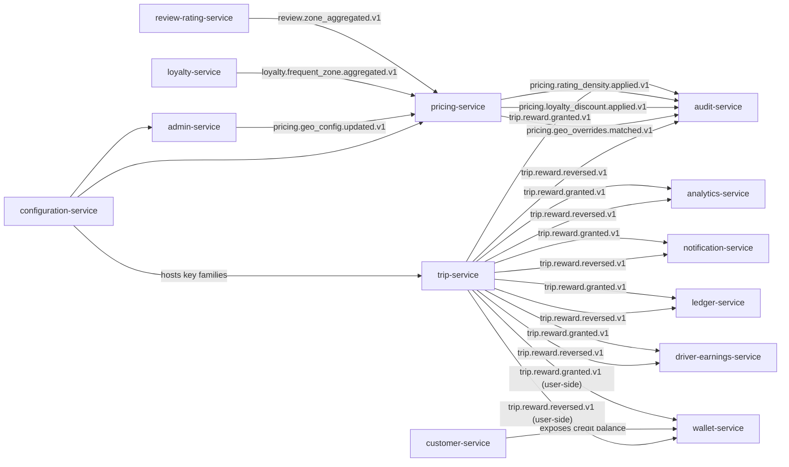

# Master Implementation Plan

> **Purpose:** Single source of truth for **what** is being built, **in what
> order**, and **where the per-service plan lives**. The 58 per-service
> `PLAN.md` files linked from this document are the per-service source of
> truth for **how** each service is built.
>
> **Updated:** 2026-08-05
> **Total services:** 58 (46 Kotlin/Spring + 8 Go + 4 Python/FastAPI)
> **Timeline:** 44 weeks (Phase 1-6 = 40 weeks, Phase 7 = 4 weeks, Phase 7.5 = 2 weeks)
> **Status:** All 58 per-service PLAN.md files exist; this master plan binds
> them to the locked implementation order.

---

## How to read this document

| Question | Answer |
|----------|--------|
| _What is the order of implementation?_ | The "Implementation Order" tables below, one per phase. |
| _How do I build a specific service?_ | The per-service `PLAN.md` linked from the "Per-service Plans" section. |
| _What cross-cutting changes ship later?_ | Phase 7 (Guaranteed Rewards + Rating-Based Pricing) and Phase 7.5 (Make-a-Deal kernel). |
| _What events are produced and consumed?_ | `services/<svc>/INTEGRATION.md` is authoritative; the per-service `PLAN.md` summarizes. |
| _Which tier is a service in?_ | `SERVICE_INTEGRATION_MATRIX.md` (Tier 0–6 column). |

The order is **locked** to `IMPLEMENTATION_PHASES.md`. Do not re-order
without updating this file, `IMPLEMENTATION_PHASES.md`, and notifying
all teams.

---

## Implementation Order (locked)

### Phase 1 — Platform Foundation (Weeks 1–4)

| # | Service | Tier | Tech | Plan |
|---|---------|------|------|------|
| 1 | `configuration-service` | 0 | Kotlin/Spring | [PLAN](services/configuration-service/PLAN.md) |
| 2 | `feature-flag-service` | 0 | Kotlin/Spring | [PLAN](services/feature-flag-service/PLAN.md) |
| 3 | `identity-service` | 1 | Node/TS | [PLAN](services/identity-service/PLAN.md) |
| 4 | `geolocation-service` | 1 | Go | [PLAN](services/geolocation-service/PLAN.md) |
| 5 | `api-gateway` | 1 | Go/Envoy | [PLAN](services/api-gateway/PLAN.md) |
| 6 | `communication-gateway-service` | 1 | Go | [PLAN](services/communication-gateway-service/PLAN.md) |
| 7 | `file-service` | 1 | Go | [PLAN](services/file-service/PLAN.md) |
| 8 | `audit-service` | 1 | Go | [PLAN](services/audit-service/PLAN.md) |
| 9 | `zone-service` | 1 | Kotlin/Spring | [PLAN](services/zone-service/PLAN.md) |
| 10 | `ledger-service` | 1 | Node/TS | [PLAN](services/ledger-service/PLAN.md) |

**Block on:** nothing. Start in order; items 5–7 can move in parallel
with 1–4 once their first dependency is green.

### Phase 2 — Core Business & Identity (Weeks 5–12)

| # | Service | Tier | Tech | Plan |
|---|---------|------|------|------|
| 11 | `user-profile-service` | 2 | Kotlin/Spring | [PLAN](services/user-profile-service/PLAN.md) |
| 12 | `customer-service` | 2 | Kotlin/Spring | [PLAN](services/customer-service/PLAN.md) |
| 13 | `driver-service` | 2 | Kotlin/Spring | [PLAN](services/driver-service/PLAN.md) |
| 14 | `courier-service` | 2 | Kotlin/Spring | [PLAN](services/courier-service/PLAN.md) |
| 15 | `vehicle-service` | 2 | Kotlin/Spring | [PLAN](services/vehicle-service/PLAN.md) |
| 16 | `address-service` | 2 | Kotlin/Spring | [PLAN](services/address-service/PLAN.md) |
| 17 | `notification-service` | 2 | Kotlin/Spring | [PLAN](services/notification-service/PLAN.md) |
| 18 | `admin-service` | 2 | Kotlin/Spring | [PLAN](services/admin-service/PLAN.md) |
| 19 | `payment-service` | 3 | Kotlin/Spring | [PLAN](services/payment-service/PLAN.md) |
| 20 | `wallet-service` | 3 | Kotlin/Spring | [PLAN](services/wallet-service/PLAN.md) |
| 21 | `tax-service` | 2 | Kotlin/Spring | [PLAN](services/tax-service/PLAN.md) |
| 22 | `support-service` | 2 | Kotlin/Spring | [PLAN](services/support-service/PLAN.md) |
| 23 | `fraud-risk-service` | 2 | Python/FastAPI | [PLAN](services/fraud-risk-service/PLAN.md) |
| 24 | `promotion-service` | 2 | Kotlin/Spring | [PLAN](services/promotion-service/PLAN.md) |

### Phase 3 — Ride-Hailing Domain (Weeks 13–20)

| # | Service | Tier | Tech | Plan |
|---|---------|------|------|------|
| 25 | `pricing-service` | 3 | Kotlin/Spring | [PLAN](services/pricing-service/PLAN.md) |
| 26 | `driver-availability-service` | 3 | Go | [PLAN](services/driver-availability-service/PLAN.md) |
| 27 | `driver-location-service` | 3 | Go | [PLAN](services/driver-location-service/PLAN.md) |
| 28 | `eta-routing-service` | 3 | Go | [PLAN](services/eta-routing-service/PLAN.md) |
| 29 | `ride-request-service` | 4 | Kotlin/Spring | [PLAN](services/ride-request-service/PLAN.md) |
| 30 | `dispatch-service` | 4 | Kotlin/Spring | [PLAN](services/dispatch-service/PLAN.md) |
| 31 | `trip-service` | 4 | Kotlin/Spring | [PLAN](services/trip-service/PLAN.md) |
| 32 | `ride-payment-integration-service` | 5 | Kotlin/Spring | [PLAN](services/ride-payment-integration-service/PLAN.md) |
| 33 | `driver-earnings-service` | 4 | Kotlin/Spring | [PLAN](services/driver-earnings-service/PLAN.md) |
| 34 | `scheduled-ride-service` | 4 | Kotlin/Spring | [PLAN](services/scheduled-ride-service/PLAN.md) |
| 35 | `ride-safety-service` | 4 | Kotlin/Spring | [PLAN](services/ride-safety-service/PLAN.md) |
| 36 | `ride-history-service` | 6 | Kotlin/Spring | [PLAN](services/ride-history-service/PLAN.md) |
| 37 | `driver-incentive-service` | 5 | Python/FastAPI | [PLAN](services/driver-incentive-service/PLAN.md) |

### Phase 4 — Food Marketplace (Weeks 21–28)

| # | Service | Tier | Tech | Plan |
|---|---------|------|------|------|
| 38 | `merchant-service` | 3 | Kotlin/Spring | [PLAN](services/merchant-service/PLAN.md) |
| 39 | `restaurant-service` | 3 | Kotlin/Spring | [PLAN](services/restaurant-service/PLAN.md) |
| 40 | `branch-service` | 3 | Kotlin/Spring | [PLAN](services/branch-service/PLAN.md) |
| 41 | `restaurant-staff-service` | 4 | Kotlin/Spring | [PLAN](services/restaurant-staff-service/PLAN.md) |
| 42 | `menu-service` | 4 | Kotlin/Spring | [PLAN](services/menu-service/PLAN.md) |
| 43 | `inventory-service` | 4 | Kotlin/Spring | [PLAN](services/inventory-service/PLAN.md) |
| 44 | `cart-service` | 4 | Kotlin/Spring | [PLAN](services/cart-service/PLAN.md) |
| 45 | `search-service` | 6 | Kotlin/Spring | [PLAN](services/search-service/PLAN.md) |
| 46 | `checkout-service` | 5 | Kotlin/Spring | [PLAN](services/checkout-service/PLAN.md) |
| 47 | `food-order-service` | 5 | Kotlin/Spring | [PLAN](services/food-order-service/PLAN.md) |
| 48 | `restaurant-order-mgmt-service` | 5 | Kotlin/Spring | [PLAN](services/restaurant-order-mgmt-service/PLAN.md) |

### Phase 5 — Food Delivery & Financial (Weeks 29–34)

| # | Service | Tier | Tech | Plan |
|---|---------|------|------|------|
| 49 | `courier-dispatch-service` | 5 | Python/FastAPI | [PLAN](services/courier-dispatch-service/PLAN.md) |
| 50 | `courier-tracking-service` | 3 | Go | [PLAN](services/courier-tracking-service/PLAN.md) |
| 51 | `delivery-service` | 5 | Kotlin/Spring | [PLAN](services/delivery-service/PLAN.md) |
| 52 | `food-payment-integration-service` | 5 | Kotlin/Spring | [PLAN](services/food-payment-integration-service/PLAN.md) |
| 53 | `restaurant-settlement-service` | 5 | Kotlin/Spring | [PLAN](services/restaurant-settlement-service/PLAN.md) |
| 54 | `courier-earnings-service` | 5 | Kotlin/Spring | [PLAN](services/courier-earnings-service/PLAN.md) |

### Phase 6 — Analytics & Enhancements (Weeks 35–40)

| # | Service | Tier | Tech | Plan |
|---|---------|------|------|------|
| 55 | `analytics-service` | 6 | Kotlin/Spring | [PLAN](services/analytics-service/PLAN.md) |
| 56 | `reporting-service` | 6 | Python/FastAPI | [PLAN](services/reporting-service/PLAN.md) |
| 57 | `loyalty-service` | 4 | Kotlin/Spring | [PLAN](services/loyalty-service/PLAN.md) |
| 58 | `review-rating-service` | 4 | Kotlin/Spring | [PLAN](services/review-rating-service/PLAN.md) |

### Phase 7 — Cross-cutting: Guaranteed Rewards & Rating-Based Pricing (Weeks 41–44)

Participating services (each ships a `Phase 7.0` block in its PLAN.md):

| Service | Role in Phase 7 |
|---------|-----------------|
| [`trip-service`](services/trip-service/PLAN.md) | Producer — `trip.reward.granted.v1`, `trip.reward.reversed.v1`; append-only `trip.trip_reward` + `trip.trip_reward_reversal` (REVOKE UPDATE/DELETE) |
| [`pricing-service`](services/pricing-service/PLAN.md) | Consumer — rating-density (`review.zone_aggregated.v1`), frequent-rider (`loyalty.frequent_zone.aggregated.v1`), geo-config (`pricing.geo_config.updated.v1`) |
| [`admin-service`](services/admin-service/PLAN.md) | Producer — `/v1/admin/pricing/geo-config[...]` (create/read/patch/disable/rollback/list) |
| [`review-rating-service`](services/review-rating-service/PLAN.md) | Producer — `review.zone_aggregated.v1` (debounced per zone) |
| [`loyalty-service`](services/loyalty-service/PLAN.md) | Producer — `loyalty.frequent_zone.aggregated.v1` (debounced daily) |
| [`driver-earnings-service`](services/driver-earnings-service/PLAN.md) | Consumer — `type=guaranteed_topup` on grant, `type=correction` on reversal |
| [`wallet-service`](services/wallet-service/PLAN.md) | Consumer — user-side grant; idempotency `trip:{trip_id}:reward:user:grant` |
| [`customer-service`](services/customer-service/PLAN.md) | Mirror — exposes user-side credit balance |
| [`ledger-service`](services/ledger-service/PLAN.md) | Informational consumer — chart-of-account sub-accounts `6302_guaranteed_minimum` and `2100_customer_credit_liability` |
| [`notification-service`](services/notification-service/PLAN.md) | Consumer — `trip.reward.granted`, `trip.reward.reversed` templates |
| [`audit-service`](services/audit-service/PLAN.md) | Consumer — `audit.trip_reward.v1` rows |
| [`analytics-service`](services/analytics-service/PLAN.md) | Mirror — rewards fact table |
| [`configuration-service`](services/configuration-service/PLAN.md) | Hosts key families `trip.reward.*`, `pricing.rating_density.*`, `pricing.loyalty.frequent_rider.*`, `pricing.geo_overrides.*` |

Cross-doc consistency: the canonical 17-service accounting-impact list lives
in `workflows/ACCOUNTING_WORKFLOWS.md` §"Guaranteed Rewards — Driver Top-Up +
Customer Credit".

### Phase 7.5 — Make-a-Deal Kernel (Weeks 41–42, parallel with Phase 7)

Single source of truth: `docs/shared/DEAL_FEATURE.md`. Each participating
service ships a `Phase 7.5` block in its PLAN.md and owns its own deal rows
and event production. **No central binary** — the kernel is a Markdown
contract, not a JAR.

| # | Service | Role | Week |
|---|---------|------|------|
| 59 | [`pricing-service`](services/pricing-service/PLAN.md) | Helper — `GET /v1/quotes/{id}/fairness-band`, `max_fare_override` rule kind | 41 |
| 60 | [`configuration-service`](services/configuration-service/PLAN.md) | Helper — `deal.*` key family `{min, max, currency}` (422 `INVALID_BAND`) | 41 |
| 61 | [`notification-service`](services/notification-service/PLAN.md) | Helper — 5 deal templates, audit-bound to `template_version_snapshot_id` | 41 |
| 62 | [`feature-flag-service`](services/feature-flag-service/PLAN.md) | Helper — `deal.enabled.{city_id}.{ride_type}` | 41 |
| 63 | [`audit-service`](services/audit-service/PLAN.md) | Helper — consume all 12 `*.deal.*.v1` events, write `audit.deal_transition.v1` | 41 |
| 64 | [`ride-request-service`](services/ride-request-service/PLAN.md) | Rider boundary — ride-side endpoints + 5 ride events | 42 |
| 65 | [`dispatch-service`](services/dispatch-service/PLAN.md) | Driver boundary — dispatch-side endpoints + 4 dispatch events | 42 |
| 66 | [`food-order-service`](services/food-order-service/PLAN.md) | Customer boundary — food-side endpoints + 5 food events | 42 |
| 67 | [`courier-dispatch-service`](services/courier-dispatch-service/PLAN.md) | Courier boundary — mirrors dispatch for the food vertical | 42 |

Rollout: `deal.enabled.{city_id}.{ride_type}` = OFF in production. Smoke
test 1 city × 1 ride_type → 1 city × all ride_types → all cities × all
ride_types per `docs/shared/DEAL_FEATURE.md` §9.

---

## Per-service Plans (alphabetical)

Every service has a PLAN.md. The 10-phase structure is identical across
all 58 services; only the per-service body, events, and Phase 7 / 7.5
participation blocks differ.

| Service | Tier | Tech | Criticality | PLAN.md |
|---------|------|------|-------------|---------|
| `address-service` | 2 | Kotlin/Spring | T2 (99.9%) | [PLAN](services/address-service/PLAN.md) |
| `admin-service` | 2 | Kotlin/Spring | T2 (99.9%) | [PLAN](services/admin-service/PLAN.md) |
| `analytics-service` | 6 | Kotlin/Spring | T3 (99.5%) | [PLAN](services/analytics-service/PLAN.md) |
| `api-gateway` | 1 | Go/Envoy | T0 (99.99%) | [PLAN](services/api-gateway/PLAN.md) |
| `audit-service` | 1 | Go | T1 (99.95%) | [PLAN](services/audit-service/PLAN.md) |
| `branch-service` | 3 | Kotlin/Spring | T2 (99.9%) | [PLAN](services/branch-service/PLAN.md) |
| `cart-service` | 4 | Kotlin/Spring | T2 (99.9%) | [PLAN](services/cart-service/PLAN.md) |
| `checkout-service` | 5 | Kotlin/Spring | T1 (99.95%) | [PLAN](services/checkout-service/PLAN.md) |
| `communication-gateway-service` | 1 | Go | T2 (99.9%) | [PLAN](services/communication-gateway-service/PLAN.md) |
| `configuration-service` | 0 | Kotlin/Spring | T1 (99.95%) | [PLAN](services/configuration-service/PLAN.md) |
| `courier-dispatch-service` | 5 | Python/FastAPI | T1 (99.95%) | [PLAN](services/courier-dispatch-service/PLAN.md) |
| `courier-earnings-service` | 5 | Kotlin/Spring | T2 (99.9%) | [PLAN](services/courier-earnings-service/PLAN.md) |
| `courier-service` | 2 | Kotlin/Spring | T2 (99.9%) | [PLAN](services/courier-service/PLAN.md) |
| `courier-tracking-service` | 3 | Go | T1 (99.95%) | [PLAN](services/courier-tracking-service/PLAN.md) |
| `customer-service` | 2 | Kotlin/Spring | T1 (99.95%) | [PLAN](services/customer-service/PLAN.md) |
| `delivery-service` | 5 | Kotlin/Spring | T1 (99.95%) | [PLAN](services/delivery-service/PLAN.md) |
| `dispatch-service` | 4 | Kotlin/Spring | T1 (99.95%) | [PLAN](services/dispatch-service/PLAN.md) |
| `driver-availability-service` | 3 | Go | T1 (99.95%) | [PLAN](services/driver-availability-service/PLAN.md) |
| `driver-earnings-service` | 4 | Kotlin/Spring | T2 (99.9%) | [PLAN](services/driver-earnings-service/PLAN.md) |
| `driver-incentive-service` | 5 | Python/FastAPI | T3 (99.5%) | [PLAN](services/driver-incentive-service/PLAN.md) |
| `driver-location-service` | 3 | Go | T1 (99.95%) | [PLAN](services/driver-location-service/PLAN.md) |
| `driver-service` | 2 | Kotlin/Spring | T1 (99.95%) | [PLAN](services/driver-service/PLAN.md) |
| `eta-routing-service` | 3 | Go | T2 (99.9%) | [PLAN](services/eta-routing-service/PLAN.md) |
| `feature-flag-service` | 0 | Kotlin/Spring | T0 (99.99%) | [PLAN](services/feature-flag-service/PLAN.md) |
| `file-service` | 1 | Go | T2 (99.9%) | [PLAN](services/file-service/PLAN.md) |
| `food-order-service` | 5 | Kotlin/Spring | T1 (99.95%) | [PLAN](services/food-order-service/PLAN.md) |
| `food-payment-integration-service` | 5 | Kotlin/Spring | T1 (99.95%) | [PLAN](services/food-payment-integration-service/PLAN.md) |
| `fraud-risk-service` | 2 | Python/FastAPI | T2 (99.9%) | [PLAN](services/fraud-risk-service/PLAN.md) |
| `geolocation-service` | 1 | Go | T1 (99.95%) | [PLAN](services/geolocation-service/PLAN.md) |
| `identity-service` | 1 | Node/TS | T0 (99.99%) | [PLAN](services/identity-service/PLAN.md) |
| `inventory-service` | 4 | Kotlin/Spring | T2 (99.9%) | [PLAN](services/inventory-service/PLAN.md) |
| `ledger-service` | 1 | Node/TS | T0 (99.99%) | [PLAN](services/ledger-service/PLAN.md) |
| `loyalty-service` | 4 | Kotlin/Spring | T2 (99.9%) | [PLAN](services/loyalty-service/PLAN.md) |
| `menu-service` | 4 | Kotlin/Spring | T2 (99.9%) | [PLAN](services/menu-service/PLAN.md) |
| `merchant-service` | 3 | Kotlin/Spring | T2 (99.9%) | [PLAN](services/merchant-service/PLAN.md) |
| `notification-service` | 2 | Kotlin/Spring | T2 (99.9%) | [PLAN](services/notification-service/PLAN.md) |
| `payment-service` | 3 | Kotlin/Spring | T0 (99.99%) | [PLAN](services/payment-service/PLAN.md) |
| `pricing-service` | 3 | Kotlin/Spring | T1 (99.95%) | [PLAN](services/pricing-service/PLAN.md) |
| `promotion-service` | 2 | Kotlin/Spring | T2 (99.9%) | [PLAN](services/promotion-service/PLAN.md) |
| `reporting-service` | 6 | Python/FastAPI | T3 (99.5%) | [PLAN](services/reporting-service/PLAN.md) |
| `restaurant-order-mgmt-service` | 5 | Kotlin/Spring | T2 (99.9%) | [PLAN](services/restaurant-order-mgmt-service/PLAN.md) |
| `restaurant-service` | 3 | Kotlin/Spring | T2 (99.9%) | [PLAN](services/restaurant-service/PLAN.md) |
| `restaurant-settlement-service` | 5 | Kotlin/Spring | T1 (99.95%) | [PLAN](services/restaurant-settlement-service/PLAN.md) |
| `restaurant-staff-service` | 4 | Kotlin/Spring | T3 (99.5%) | [PLAN](services/restaurant-staff-service/PLAN.md) |
| `review-rating-service` | 4 | Kotlin/Spring | T2 (99.9%) | [PLAN](services/review-rating-service/PLAN.md) |
| `ride-history-service` | 6 | Kotlin/Spring | T3 (99.5%) | [PLAN](services/ride-history-service/PLAN.md) |
| `ride-payment-integration-service` | 5 | Kotlin/Spring | T1 (99.95%) | [PLAN](services/ride-payment-integration-service/PLAN.md) |
| `ride-request-service` | 4 | Kotlin/Spring | T1 (99.95%) | [PLAN](services/ride-request-service/PLAN.md) |
| `ride-safety-service` | 4 | Kotlin/Spring | T1 (99.95%) | [PLAN](services/ride-safety-service/PLAN.md) |
| `scheduled-ride-service` | 4 | Kotlin/Spring | T2 (99.9%) | [PLAN](services/scheduled-ride-service/PLAN.md) |
| `search-service` | 6 | Kotlin/Spring | T2 (99.9%) | [PLAN](services/search-service/PLAN.md) |
| `support-service` | 2 | Kotlin/Spring | T2 (99.9%) | [PLAN](services/support-service/PLAN.md) |
| `tax-service` | 2 | Kotlin/Spring | T2 (99.9%) | [PLAN](services/tax-service/PLAN.md) |
| `trip-service` | 4 | Kotlin/Spring | T0 (99.99%) | [PLAN](services/trip-service/PLAN.md) |
| `user-profile-service` | 2 | Kotlin/Spring | T2 (99.9%) | [PLAN](services/user-profile-service/PLAN.md) |
| `vehicle-service` | 2 | Kotlin/Spring | T2 (99.9%) | [PLAN](services/vehicle-service/PLAN.md) |
| `wallet-service` | 3 | Kotlin/Spring | T1 (99.95%) | [PLAN](services/wallet-service/PLAN.md) |
| `zone-service` | 1 | Kotlin/Spring | T1 (99.95%) | [PLAN](services/zone-service/PLAN.md) |

---

## Domain × Phase matrix

| Domain | Phase 1 | Phase 2 | Phase 3 | Phase 4 | Phase 5 | Phase 6 |
|--------|---------|---------|---------|---------|---------|---------|
| Platform Foundation | 10 | – | – | – | – | – |
| Identity & User | – | 7 | – | – | – | – |
| Financial Core | 1 (ledger) | 3 | 1 | – | – | – |
| Platform Support | – | 4 | – | – | – | – |
| Ride-Hailing | – | – | 13 | – | – | – |
| Food Marketplace | – | – | – | 11 | – | – |
| Food Delivery | – | – | – | – | 6 | – |
| Analytics | – | – | 1 (ride-history) | 1 (search) | – | 4 |

Phase 7 modifies 13 services (cross-cutting); Phase 7.5 modifies 9 of them
(Make-a-Deal kernel). See the per-service `PLAN.md` for the exact
participation block.

---

## Implementation rules (apply to every service)

1. **Outbox pattern** for every published event. **Inbox pattern** for
   every consumed event. Idempotency-Key on every mutating REST route.
2. **Ci / CD** — every PR runs unit tests + contract tests + lint + OpenAPI
   diff. Merging to `main` deploys to staging automatically; production is
   gated by the release manager.
3. **SLO** — T0=99.99%, T1=99.95%, T2=99.9%, T3=99.5% per
   `SERVICE_INTEGRATION_MATRIX.md`.
4. **Schema migrations** — forward-only; pre-upgrade Job before deploy.
5. **No cross-service direct DB access.** Every cross-service read is a
   REST call or an event consumer.
6. **Every `PLAN.md` is owned** by the service's tech lead. Any change to
   the per-service plan must also reopen the master plan row.

---

## Cross-cutting reference docs

- `IMPLEMENTATION_PHASES.md` — week-by-week roadmap
- `PLAN_INDEX.md` — short index that links to this master plan
- `SERVICE_INTEGRATION_MATRIX.md` — tier, tech, deps, events
- `MASTER_SERVICE_PLAN.md` — legacy pre-Phase-7 detailed plan (kept for history)
- `MASTER_PLAN_SUMMARY.md` — legacy executive summary
- `workflows/ACCOUNTING_WORKFLOWS.md` — cross-service accounting view
- `docs/shared/DEAL_FEATURE.md` — Phase 7.5 kernel contract
- `architecture/EVENT_ARCHITECTURE.md` — canonical event catalog
- `architecture/DATABASE_ARCHITECTURE.md` — partitioning rules
- `architecture/KEYCLOAK_ARCHITECTURE.md` — identity bridge

---

## Status

- [x] All 58 services have a `PLAN.md`
- [x] All 58 PLAN.md files are linked from this master plan
- [x] Implementation order is locked to `IMPLEMENTATION_PHASES.md`
- [x] Phase 7 cross-cutting participation is documented per service
- [x] Phase 7.5 Make-a-Deal participation is documented per service
- [x] The 17-service accounting-impact list is preserved across docs
