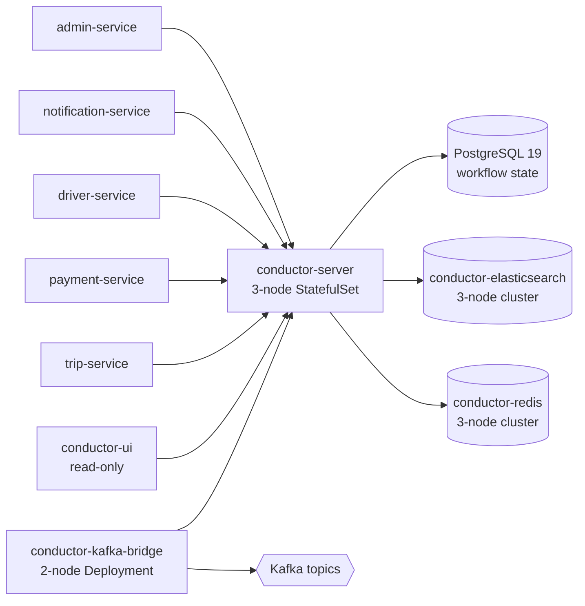

# Master Task Manager

> **Created:** 2026-08-06  
> **Updated:** 2026-08-12 (Phase 7.7 cross-cutting — added `chat-service` as the 21st active service; registered T-CHAT-* tasks; registered Phase 7.7 blocks in trip / food-order / courier / restaurant / notification / admin / fraud-risk services)  
> **Owner:** Platform Architecture  
> **Source of truth:** [`MASTER_PLAN.md`](MASTER_PLAN.md) (canonical order) + each `services/<svc>/PLAN.md` (per-service tasks)  
> **Format:** `T-<SVC>-NN` IDs are stable cross-references; never reused.  
> **Status legend:** `pending` | `in-progress` | `done` | `blocked`  

---

## 1. Rollup Dashboard

Total registered tasks: **912** across 21 active services (47 new
tasks for `chat-service` Phase 7.7).

| # | Service | Tier | Phase | Tech | Criticality | Total | Done | In-Progress | Pending | Blocked |
|---|---------|------|-------|------|-------------|-------|------|-------------|---------|---------|
| 1 | `admin-service` | 2 | 2 | Kotlin/Spring | T2 (99.9%) | 65 | 0 | 0 | 65 | 0 |
| 2 | `api-gateway` | 1 | 1 | Go/Envoy | T0 (99.99%) | 47 | 0 | 0 | 47 | 0 |
| 3 | `audit-service` | 1 | 1 | Go | T1 (99.95%) | 53 | 0 | 0 | 53 | 0 |
| 4 | `configuration-service` | 0 | 1 | Kotlin/Spring | T1 (99.95%) | 49 | 0 | 0 | 49 | 0 |
| 5 | `courier-service` | 2 | 2 | Kotlin/Spring | T2 (99.9%) | 59 | 0 | 0 | 59 | 0 |
| 6 | `customer-service` | 2 | 2 | Kotlin/Spring | T1 (99.95%) | 39 | 0 | 0 | 39 | 0 |
| 7 | `driver-service` | 2 | 2 | Kotlin/Spring | T1 (99.95%) | 39 | 0 | 0 | 39 | 0 |
| 8 | `file-service` | 1 | 1 | Go | T2 (99.9%) | 37 | 0 | 0 | 37 | 0 |
| 9 | `food-order-service` | 5 | 4 | Kotlin/Spring | T1 (99.95%) | 38 | 0 | 0 | 38 | 0 |
| 10 | `fraud-risk-service` | 2 | 2 | Python/FastAPI | T2 (99.9%) | 39 | 0 | 0 | 39 | 0 |
| 11 | `geolocation-service` | 1 | 3 | Go | T1 (99.95%) | 37 | 0 | 0 | 37 | 0 |
| 12 | `identity-service` | 1 | 1 | Node/TS | T0 (99.99%) | 39 | 0 | 0 | 39 | 0 |
| 13 | `ledger-service` | 1 | 1 | Node/TS | T0 (99.99%) | 45 | 0 | 0 | 45 | 0 |
| 14 | `notification-service` | 2 | 2 | Kotlin/Spring | T2 (99.9%) | 40 | 0 | 0 | 40 | 0 |
| 15 | `payment-service` | 3 | 2 | Kotlin/Spring | T0 (99.99%) | 46 | 0 | 0 | 46 | 0 |
| 16 | `pricing-service` | 3 | 3 | Kotlin/Spring | T1 (99.95%) | 39 | 0 | 0 | 39 | 0 |
| 17 | `reporting-service` | 6 | 6 | Kotlin/Spring | T3 (99.5%) | 39 | 0 | 0 | 39 | 0 |
| 18 | `restaurant-service` | 3 | 4 | Kotlin/Spring | T2 (99.9%) | 38 | 0 | 0 | 38 | 0 |
| 19 | `search-service` | 6 | 6 | Kotlin/Spring | T2 (99.9%) | 37 | 0 | 0 | 37 | 0 |
| 20 | `trip-service` | 4 | 3 | Kotlin/Spring | T0 (99.99%) | 40 | 0 | 0 | 40 | 0 |
| 21 | **`chat-service`** *(Phase 7.7)* | **2** | **7.7** | **Go** | **T1 (99.95%)** | **47** | 0 | 0 | 47 | 0 |

---

## 2. Critical-Path Tasks (cross-service dependencies)

Hand-curated list of tasks whose completion blocks another service
from starting or whose absence triggers a tier-1 incident. Each row:
`From Task | To Task | Type | Required Role(s) | Notes`.

| From Task | To Task | Type | Required Role(s) | Notes |
|-----------|---------|------|------------------|-------|
| `T-CFG-P70-01` | `T-LED-Phase-1` | data-flow | `configuration.admin` | configuration-service must publish `trip.reward.*` key family before `ledger-service` Phase 7.0 consumer can bind |
| `T-PRC-Phase-3` | `T-TRP-Phase-1` | data-flow | `pricing.admin` | pricing-service must publish fair-price matrix before `trip-service` trip lifecycle can compute fares |
| `T-PAY-Phase-1` | `T-TRP-Phase-7` | compensation | `payment.admin` | payment-service ride-saga state table must be live before `trip-service` reversal flow can fire |
| `T-IDN-Phase-1` | `T-DRV-P76-XX` | auth-flow | `identity.admin` | identity-service token validation must be live before `driver-service` onboarding KYC can attach |
| `T-FRD-Phase-1` | `T-DRV-P76-XX` | scoring-flow | `fraud_risk.admin` | fraud-risk-service scoring API must be live before `driver-service` onboarding can compute risk score |
| `T-PAY-P70-XX` | `T-TRP-P76-01` | reward-flow | `payment.admin` | payment-service wallet grant consumer must be live before `trip-service` Phase 7 reward grant worker can publish reward events |
| `T-AUD-Phase-1` | `T-AUD-P76-XX` | audit-flow | `audit.admin` | audit-service baseline sink must be live before any `*.P76-XX` Conductor worker can write audit rows |
| `T-ADM-P76-XX` (onboarding) | `T-DRV-P76-XX` | human-approval | `platform.admin` | admin-service manual-approval HUMAN TASK must be live before driver/courier onboarding Conductor workflows can advance |
| `T-GW-Phase-8a-01..07` | `T-<SVC>-Phase-1` (every service) | contract | `platform.engineering` | API-gateway must accept or generate the request id (`X-Request-Id`, alias `X-Correlation-Id`) before any other Phase 1 work; every service inherits the value (ADR-0019) |

---

## 3. Tasks by Service (full registry)

Mirrors the per-service `PLAN.md` `## Tasks` section. Use `<details>`
blocks to expand each service. Status, role columns mirror the
source `PLAN.md` at regeneration time.

<details>
<summary><b>admin-service</b> — Tier 2 — Phase 2 — Kotlin/Spring — T2 (99.9%) — 65 tasks</summary>

### Phase 1 — Database & Domain Model

| ID | Task | Status | Depends-On | Required Role(s) | Approver Role | Co-Signer Role | Break-Glass? |
|---|---|---|---|---|---|---|---|
| T-ADM-01 | Create schema `admin`: tables `action_log` (partitioned by month, append-only), `permission_cache`, `outbox`, `inbox` | pending | — | platform.admin | platform.admin | — | — |
| T-ADM-02 | Key columns: `action_log(id UUID, actor_id UUID, target_service TEXT, action TEXT, target_resource_id UUID, target_user_id UUID, result TEXT, reason TEXT, signature TEXT, break_glass BOOL, created_at TIMESTAMPTZ)` | pending | T-ADM-01 | platform.admin | platform.admin | — | yes |
| T-ADM-03 | Add `super_admin_grant` (partitioned by month, append-only, REVOKE UPDATE/DELETE): one row per `POST/DELETE /v1/admin/identity/(grant | revoke)-super-admin` call; tracks the 21-role fan-out via `source_request_id` (joined with `identity-service.role_assignment_history`) | pending | platform.admin | platform.admin | — | — | platform.admin | platform.admin | — | — |
| T-ADM-04 | Write Flyway migrations (forward-only) | pending | T-ADM-03 | platform.admin | platform.admin | — | — |
| T-ADM-05 | Implement `AdminAction` aggregate and `ActionLogRepository` | pending | T-ADM-04 | platform.admin | platform.admin | — | — |
| T-ADM-06 | Implement `SuperAdminGrant` aggregate and `SuperAdminGrantRepository` | pending | T-ADM-05 | platform.admin | platform.admin | — | — |

### Phase 10 — Deployment

| ID | Task | Status | Depends-On | Required Role(s) | Approver Role | Co-Signer Role | Break-Glass? |
|---|---|---|---|---|---|---|---|
| T-ADM-01 | Kubernetes manifests: Deployment, Service, HPA (CPU 60%, 2–5 replicas), PDB | pending | — | platform.admin | platform.admin | — | — |
| T-ADM-02 | Pre-upgrade Job for database migrations | pending | T-ADM-01 | platform.admin | platform.admin | — | — |
| T-ADM-03 | Resource limits per DEPLOYMENT_ARCHITECTURE.md | pending | T-ADM-02 | platform.admin | platform.admin | — | — |

### Phase 2 — REST API

| ID | Task | Status | Depends-On | Required Role(s) | Approver Role | Co-Signer Role | Break-Glass? |
|---|---|---|---|---|---|---|---|
| T-ADM-01 | `POST /v1/admin/{service}/{action}` — dispatch action to target service (requires `X-Audit-Reason`, `Idempotency-Key`) | pending | — | platform.admin | platform.admin | — | — |
| T-ADM-02 | `GET /v1/admin/actions` — search action log (paged, cursor-based) | pending | T-ADM-01 | platform.admin | platform.admin | — | — |
| T-ADM-03 | `GET /v1/admin/actions/{id}` — read action detail | pending | T-ADM-02 | platform.admin | platform.admin | — | — |
| T-ADM-04 | `POST /v1/admin/actions/{id}/break-glass` — co-sign a pending break-glass request | pending | T-ADM-03 | platform.admin | platform.admin | — | yes |
| T-ADM-05 | `GET /v1/admin/permissions` — list current user's scopes | pending | T-ADM-04 | platform.admin | platform.admin | — | — |
| T-ADM-06 | `GET /v1/admin/services` — service catalog: 20 services × accepted admin scopes × `SUPER_ADMIN` preset membership (see `admin-service/INTEGRATION.md` 1.12) | pending | T-ADM-05 | platform.admin | platform.admin | — | — |
| T-ADM-07 | `GET /v1/admin/presets` — list permission presets (currently `SUPER_ADMIN`) | pending | T-ADM-06 | platform.admin | platform.admin | — | — |
| T-ADM-08 | `GET /v1/admin/identity/permissions/{user_id}` — read a user's roles + preset membership (forwards to `identity-service`) | pending | T-ADM-07 | platform.admin | platform.admin | — | — |
| T-ADM-09 | `POST /v1/admin/identity/grant-super-admin` — grant the `SUPER_ADMIN` preset (requires break-glass + signature + MFA + super-admin IP allowlist; emits `admin.super_admin.granted.v1`; pages security) | pending | T-ADM-08 | platform.admin | platform.admin | — | yes |
| T-ADM-10 | `DELETE /v1/admin/identity/revoke-super-admin` — revoke the `SUPER_ADMIN` preset (same gates as grant) | pending | T-ADM-09 | platform.admin | platform.admin | — | — |

### Phase 3 — Event Publishing

| ID | Task | Status | Depends-On | Required Role(s) | Approver Role | Co-Signer Role | Break-Glass? |
|---|---|---|---|---|---|---|---|
| T-ADM-01 | Implement transactional outbox table | pending | — | platform.admin | platform.admin | — | — |
| T-ADM-02 | Publish `admin.action.performed.v1` → topic `admin.action.performed` (every action, success or failed) | pending | T-ADM-01 | admin.action.performed | admin.action.performed | — | — |
| T-ADM-03 | Publish `admin.action.dispatched.v1` → topic `admin.action.dispatched` (before target service responds) | pending | T-ADM-02 | admin.action.dispatched | admin.action.dispatched | — | — |
| T-ADM-04 | Publish `admin.action.failed.v1` → topic `admin.action.failed` (on 4xx/5xx from target) | pending | T-ADM-03 | admin.action.failed | admin.action.failed | — | — |
| T-ADM-05 | Publish `admin.user.suspended.v1` → topic `platform.admin` | pending | T-ADM-04 | platform.admin | platform.admin | — | — |
| T-ADM-06 | Publish `admin.user.disabled.v1` → topic `platform.admin` | pending | T-ADM-05 | platform.admin | platform.admin | — | — |
| T-ADM-07 | Publish `admin.user.reinstated.v1` → topic `platform.admin` | pending | T-ADM-06 | platform.admin | platform.admin | — | — |
| T-ADM-08 | Publish `admin.configuration.changed.v1` → topic `platform.admin` | pending | T-ADM-07 | platform.admin | platform.admin | — | — |
| T-ADM-09 | Publish `admin.super_admin.granted.v1` → topic `admin.super_admin.granted` (every successful SUPER_ADMIN preset grant; consumers: `audit-service`, `notification-service` for paging security, ``reporting-service` (data lake)`) | pending | T-ADM-08 | admin.super_admin.granted | admin.super_admin.granted | — | — |
| T-ADM-10 | Publish `admin.super_admin.revoked.v1` → topic `admin.super_admin.revoked` (same consumers) | pending | T-ADM-09 | admin.super_admin.revoked | admin.super_admin.revoked | — | — |
| T-ADM-11 | Outbox poller (200ms interval, DLQ) | pending | T-ADM-10 | platform.admin | platform.admin | — | — |

### Phase 4 — Event Consumption

| ID | Task | Status | Depends-On | Required Role(s) | Approver Role | Co-Signer Role | Break-Glass? |
|---|---|---|---|---|---|---|---|
| T-ADM-01 | Implement inbox table for deduplication | pending | — | platform.admin | platform.admin | — | — |
| T-ADM-02 | Consume `identity.session.revoked.v1` → invalidate operator's in-memory permission cache | pending | T-ADM-01 | platform.admin | platform.admin | — | — |
| T-ADM-03 | Consume `identity.role.granted.v1` → upsert the `super_admin_grant` view keyed by `source_request_id`; invalidate operator-UI permission cache for any operator whose visible role set changed | pending | T-ADM-02 | platform.admin | platform.admin | — | — |
| T-ADM-04 | Consume `identity.role.revoked.v1` → same as grant | pending | T-ADM-03 | platform.admin | platform.admin | — | — |
| T-ADM-05 | Consume `customer.suspended.v1` → render in support console timeline; add `customer_id` to Redis `blocked_targets` | pending | T-ADM-04 | platform.admin | platform.admin | — | — |
| T-ADM-06 | Consume `driver.suspended.v1` → render in timeline | pending | T-ADM-05 | platform.admin | platform.admin | — | — |
| T-ADM-07 | Consume `courier.suspended.v1` → render in timeline | pending | T-ADM-06 | platform.admin | platform.admin | — | — |
| T-ADM-08 | Consume `configuration.updated.v1` → invalidate admin permission cache; reload config | pending | T-ADM-07 | platform.admin | platform.admin | — | — |
| T-ADM-09 | Consume `trip.completed.v1` → upsert `admin.trip_cache` | pending | T-ADM-08 | admin.trip_cache | admin.trip_cache | — | — |
| T-ADM-10 | Consume `payment.failed.v1` → upsert `admin.payment_failure_cache` | pending | T-ADM-09 | admin.payment_failure_cache | admin.payment_failure_cache | — | — |

### Phase 5 — Caching

| ID | Task | Status | Depends-On | Required Role(s) | Approver Role | Co-Signer Role | Break-Glass? |
|---|---|---|---|---|---|---|---|
| T-ADM-01 | Cache operator permission sets with short TTL, event-invalidated on `identity.session.revoked.v1` | pending | — | platform.admin | platform.admin | — | — |
| T-ADM-02 | Cache invalidation on `configuration.updated.v1` and `identity.session.revoked.v1` | pending | T-ADM-01 | platform.admin | platform.admin | — | — |
| T-ADM-03 | Cache `GET /v1/admin/services` response (TTL 5m; push-invalidate on `configuration.updated.v1`) | pending | T-ADM-02 | platform.admin | platform.admin | — | — |

### Phase 6 — External Integrations

| ID | Task | Status | Depends-On | Required Role(s) | Approver Role | Co-Signer Role | Break-Glass? |
|---|---|---|---|---|---|---|---|
| T-ADM-01 | Integrate with every target service via REST (dynamic dispatch based on `{service}/{action}`) | pending | — | platform.admin | platform.admin | — | — |
| T-ADM-02 | HashiCorp Vault — DB credentials, HMAC-SHA256 signing keys for high-value actions | pending | T-ADM-01 | platform.admin | platform.admin | — | — |
| T-ADM-03 | Keycloak admin realm (`platform-internal`) for admin token validation | pending | T-ADM-02 | platform.admin | platform.admin | — | — |
| T-ADM-04 | Circuit breakers on all outbound calls (one bulkhead pool per target service) | pending | T-ADM-03 | platform.admin | platform.admin | — | — |
| T-ADM-05 | `identity-service` — new outbound calls (3): `GET /admin/v1/identities/{id}/roles`, `POST /admin/v1/identities/{id}/roles/{role}` (fanned 21× per grant), `DELETE /admin/v1/identities/{id}/roles/{role}` (fanned 21× per revoke) | pending | T-ADM-04 | platform.admin | platform.admin | — | — |

### Phase 7 — Security

| ID | Task | Status | Depends-On | Required Role(s) | Approver Role | Co-Signer Role | Break-Glass? |
|---|---|---|---|---|---|---|---|
| T-ADM-01 | JWT bearer auth via Keycloak (Spring Security 7), realm `platform-internal`, MFA mandatory | pending | — | platform.admin | platform.admin | — | — |
| T-ADM-02 | Required scopes/roles: per-action RBAC (`payment.refund`, `configuration.write`, etc.), `admin.read`, `admin.break_glass`, `admin.super_admin.grant`, `admin.super_admin.revoke` | pending | T-ADM-01 | payment.refund, admin.read, admin.break_glass, admin.super_admin.grant, admin.super_admin.revoke | admin.super_admin.grant | — | yes |
| T-ADM-03 | HMAC-SHA256 request signing for high-value actions (`X-Signature`) | pending | T-ADM-02 | platform.admin | platform.admin | — | — |
| T-ADM-04 | Step-up MFA for super-admin / off-hours actions | pending | T-ADM-03 | platform.admin | platform.admin | — | — |
| T-ADM-05 | IP allowlist enforcement for super-admin (regular and SUPER_ADMIN preset grants) | pending | T-ADM-04 | platform.admin | platform.admin | — | — |
| T-ADM-06 | Super-admin IP allowlist (separate): `IP_ALLOWLIST_SUPER_ADMIN` env, distinct from the regular admin allowlist | pending | T-ADM-05 | platform.admin | platform.admin | — | — |
| T-ADM-07 | Break-glass co-signature requirement (`X-Break-Glass-Cosigner`) — **never optional** for `SUPER_ADMIN` preset grants/revokes | pending | T-ADM-06 | platform.admin | platform.admin | platform.super_admin | yes |
| T-ADM-08 | Secrets via HashiCorp Vault | pending | T-ADM-07 | platform.admin | platform.admin | — | — |

### Phase 7.6 — Conductor Workers

| ID | Task | Status | Depends-On | Required Role(s) | Approver Role | Co-Signer Role | Break-Glass? |
|---|---|---|---|---|---|---|---|
| T-ADM-P76-01 | Register Conductor worker for `wf.onboarding.driver.v1` — Worker — admin_service_manual_approval (HUMAN TASK, 24h SLA) | pending | — | platform.admin | platform.admin | — | — |
| T-ADM-P76-02 | Register Conductor worker for `wf.onboarding.courier.v1` — Worker — admin_service_manual_approval (HUMAN TASK, 24h SLA) | pending | — | platform.admin | platform.admin | — | — |

### Phase 8 — Observability

| ID | Task | Status | Depends-On | Required Role(s) | Approver Role | Co-Signer Role | Break-Glass? |
|---|---|---|---|---|---|---|---|
| T-ADM-01 | Structured JSON logs with `correlation_id`, `actor_id`, `action`, `target_service`, `target_resource_id`, `result` | pending | — | platform.admin | platform.admin | — | — |
| T-ADM-02 | Metrics: RED per route + `admin_actions_total{service,action,result}` | pending | T-ADM-01 | platform.admin | platform.admin | — | — |
| T-ADM-03 | OpenTelemetry traces with child spans per downstream call (one root span per action) | pending | T-ADM-02 | platform.admin | platform.admin | — | — |
| T-ADM-04 | Health endpoints: `/actuator/health`, `/ready`, `/started` | pending | T-ADM-03 | platform.admin | platform.admin | — | — |

### Phase 9 — Testing

| ID | Task | Status | Depends-On | Required Role(s) | Approver Role | Co-Signer Role | Break-Glass? |
|---|---|---|---|---|---|---|---|
| T-ADM-01 | Unit tests: domain model, RBAC rules, action routing, break-glass logic | pending | — | platform.admin | platform.admin | — | yes |
| T-ADM-02 | Integration tests: Testcontainers (PostgreSQL, Kafka, Redis) | pending | T-ADM-01 | platform.admin | platform.admin | — | — |
| T-ADM-03 | E2E tests: dispatch action happy path, break-glass flow, off-hours restriction | pending | T-ADM-02 | platform.admin | platform.admin | — | yes |

</details>

<details>
<summary><b>api-gateway</b> — Tier 1 — Phase 1 — Go/Envoy — T0 (99.99%) — 47 tasks</summary>

### Phase 1 — Database & Domain Model

| ID | Task | Status | Depends-On | Required Role(s) | Approver Role | Co-Signer Role | Break-Glass? |
|---|---|---|---|---|---|---|---|
| T-GW-01 | No database schema (stateless service) | pending | — | platform.engineering | platform.engineering | — | — |
| T-GW-02 | Define in-process config snapshot struct (routes, rate limits, CORS, JWKS settings) | pending | T-GW-01 | platform.engineering | platform.engineering | — | — |
| T-GW-03 | Implement atomic in-memory config swap for hot-reload | pending | T-GW-02 | platform.engineering | platform.engineering | — | — |

### Phase 10 — Deployment

| ID | Task | Status | Depends-On | Required Role(s) | Approver Role | Co-Signer Role | Break-Glass? |
|---|---|---|---|---|---|---|---|
| T-GW-01 | Kubernetes manifests: Deployment, Service, HPA (RPS, 5–100 replicas), PDB (`minAvailable: 3`) | pending | — | platform.engineering | platform.engineering | — | — |
| T-GW-02 | No database migration job (stateless) | pending | T-GW-01 | platform.engineering | platform.engineering | — | — |
| T-GW-03 | Resource limits per DEPLOYMENT_ARCHITECTURE.md (1 vCPU / 1 GiB per pod) | pending | T-GW-02 | platform.engineering | platform.engineering | — | — |
| T-GW-04 | Network policy: ingress from public LB only; egress to upstreams, Keycloak, Redis, Kafka | pending | T-GW-03 | platform.engineering | platform.engineering | — | — |

### Phase 2 — REST API

| ID | Task | Status | Depends-On | Required Role(s) | Approver Role | Co-Signer Role | Break-Glass? |
|---|---|---|---|---|---|---|---|
| T-GW-01 | `ANY /v1/{service}/{resource}` — forward to matched downstream service with JWT validation, rate-limit, correlation ID | pending | — | platform.engineering | platform.engineering | — | — |
| T-GW-02 | `GET /openapi.json` — serve aggregate OpenAPI 3.1 document | pending | T-GW-01 | platform.engineering | platform.engineering | — | — |
| T-GW-03 | `GET /docs` — serve Swagger UI | pending | T-GW-02 | platform.engineering | platform.engineering | — | — |
| T-GW-04 | `GET /health` — liveness probe | pending | T-GW-03 | platform.engineering | platform.engineering | — | — |
| T-GW-05 | `GET /ready` — readiness (checks JWKS cached, Redis reachable, at least one upstream reachable) | pending | T-GW-04 | platform.engineering | platform.engineering | — | — |
| T-GW-06 | `GET /started` — startup probe (initial config loaded, route table built) | pending | T-GW-05 | platform.engineering | platform.engineering | — | — |
| T-GW-07 | `POST /admin/reload` — hot-reload in-process config (internal, `127.0.0.1` only, mTLS) | pending | T-GW-06 | platform.engineering | platform.engineering | — | — |

### Phase 3 — Event Publishing

| ID | Task | Status | Depends-On | Required Role(s) | Approver Role | Co-Signer Role | Break-Glass? |
|---|---|---|---|---|---|---|---|
| T-GW-01 | Implement in-process Kafka producer (no outbox — stateless) | pending | — | platform.engineering | platform.engineering | — | — |
| T-GW-02 | Publish `audit.api.request.v1` → topic `audit.api.request` (every authenticated request) | pending | T-GW-01 | audit.api.request | audit.api.request | — | — |
| T-GW-03 | Publish `gateway.config.reloaded.v1` → topic `platform.gateway.config.reloaded` (on successful hot-reload) | pending | T-GW-02 | platform.engineering | platform.engineering | — | — |
| T-GW-04 | Publish `gateway.rate_limit.exceeded.v1` → topic `platform.gateway.rate_limit.exceeded` (on 429 rejection) | pending | T-GW-03 | platform.engineering | platform.engineering | — | — |
| T-GW-05 | Publish `gateway.circuit_breaker.opened.v1` → topic `platform.gateway.circuit_breaker` (on CB state transition) | pending | T-GW-04 | platform.gateway.circuit_breaker | platform.gateway.circuit_breaker | — | — |
| T-GW-06 | Producer retry: 3 attempts with exponential backoff; DLQ per topic | pending | T-GW-05 | platform.engineering | platform.engineering | — | — |

### Phase 4 — Event Consumption

| ID | Task | Status | Depends-On | Required Role(s) | Approver Role | Co-Signer Role | Break-Glass? |
|---|---|---|---|---|---|---|---|
| T-GW-01 | Implement in-process inbox (keyed by `event_id`, TTL 24h) | pending | — | platform.engineering | platform.engineering | — | — |
| T-GW-02 | Consume `identity.session.revoked.v1` → write `jti` to Redis revoked set with TTL = remaining access-token lifetime | pending | T-GW-01 | platform.engineering | platform.engineering | — | — |
| T-GW-03 | Consume `identity.user.suspended.v1` → write `kc_sub` to Redis suspended-sub set (TTL 30d) | pending | T-GW-02 | platform.engineering | platform.engineering | — | — |
| T-GW-04 | Consume `identity.user.disabled.v1` → write `kc_sub` to Redis disabled set (no expiry) | pending | T-GW-03 | platform.engineering | platform.engineering | — | — |
| T-GW-05 | Consume `configuration.updated.v1` → hot-reload routes, rate limits, CORS, JWKS refresh interval | pending | T-GW-04 | platform.engineering | platform.engineering | — | — |

### Phase 5 — Caching

| ID | Task | Status | Depends-On | Required Role(s) | Approver Role | Co-Signer Role | Break-Glass? |
|---|---|---|---|---|---|---|---|
| T-GW-01 | Redis rate-limit counters: per-token, per-IP, per-route (sliding window) | pending | — | platform.engineering | platform.engineering | — | — |
| T-GW-02 | Redis JWKS cache (TTL configurable, default 5 min) | pending | T-GW-01 | platform.engineering | platform.engineering | — | — |
| T-GW-03 | Redis revocation set: `gateway:revoked:jti:<jti>` and `gateway:revoked:sub:<kc_sub>` | pending | T-GW-02 | platform.engineering | platform.engineering | — | — |
| T-GW-04 | Cache invalidation on `identity.session.revoked.v1` and `identity.user.suspended/disabled.v1` | pending | T-GW-03 | platform.engineering | platform.engineering | — | — |

### Phase 6 — External Integrations

| ID | Task | Status | Depends-On | Required Role(s) | Approver Role | Co-Signer Role | Break-Glass? |
|---|---|---|---|---|---|---|---|
| T-GW-01 | Keycloak JWKS (`/realms/{realm}/protocol/openid-connect/certs`) — periodic refresh + event-driven rotation | pending | — | platform.engineering | platform.engineering | — | — |
| T-GW-02 | Keycloak OIDC discovery — `/.well-known/openid-configuration` | pending | T-GW-01 | platform.engineering | platform.engineering | — | — |
| T-GW-03 | Keycloak token introspection for partner B2B (cache-miss path) | pending | T-GW-02 | platform.engineering | platform.engineering | — | — |
| T-GW-04 | `identity-service` — internal introspection helper | pending | T-GW-03 | platform.engineering | platform.engineering | — | — |
| T-GW-05 | Circuit breakers on all upstreams (default: open after 5 failures in 10s, reset after 30s) | pending | T-GW-04 | platform.engineering | platform.engineering | — | — |

### Phase 7 — Security

| ID | Task | Status | Depends-On | Required Role(s) | Approver Role | Co-Signer Role | Break-Glass? |
|---|---|---|---|---|---|---|---|
| T-GW-01 | JWT bearer auth via `coreos/go-oidc v3` (RS256, `iss` + `aud` + `exp` + `nbf` + revocation set) | pending | — | platform.engineering | platform.engineering | — | — |
| T-GW-02 | Required scopes/roles: coarse role check per route at gateway; fine-grained check in downstream | pending | T-GW-01 | platform.engineering | platform.engineering | — | — |
| T-GW-03 | WAF-style pattern blocking (SQLi, XXE, path traversal) | pending | T-GW-02 | platform.engineering | platform.engineering | — | — |
| T-GW-04 | mTLS for in-cluster traffic (Istio/Linkerd sidecar) | pending | T-GW-03 | platform.engineering | platform.engineering | — | — |
| T-GW-05 | No request body logging in production (SHA-256 body hash only) | pending | T-GW-04 | platform.engineering | platform.engineering | — | — |
| T-GW-06 | Secrets via HashiCorp Vault | pending | T-GW-05 | platform.engineering | platform.engineering | — | — |

### Phase 8 — Observability

| ID | Task | Status | Depends-On | Required Role(s) | Approver Role | Co-Signer Role | Break-Glass? |
|---|---|---|---|---|---|---|---|
| T-GW-01 | Structured JSON logs with `correlation_id`, `request_id`, `trace_id`, `user_id`, `route`, `method`, `status`, `latency_ms`, `upstream`, `client_ip` | pending | — | platform.engineering | platform.engineering | — | — |
| T-GW-02 | Metrics: `gateway_requests_total{route,method,status}`, `gateway_request_duration_seconds`, `gateway_upstream_duration_seconds`, `gateway_rate_limit_rejections_total`, `gateway_jwt_verification_failures_total`, `gateway_revocation_set_size`, `gateway_circuit_breaker_state`, `gateway_audit_events_emitted_total` | pending | T-GW-01 | platform.engineering | platform.engineering | — | — |
| T-GW-03 | OpenTelemetry traces with child spans for JWT verify, Redis lookups, upstream call, Kafka publish | pending | T-GW-02 | platform.engineering | platform.engineering | — | — |
| T-GW-04 | Health endpoints: `/health`, `/ready`, `/started` | pending | T-GW-03 | platform.engineering | platform.engineering | — | — |

### Phase 9 — Testing

| ID | Task | Status | Depends-On | Required Role(s) | Approver Role | Co-Signer Role | Break-Glass? |
|---|---|---|---|---|---|---|---|
| T-GW-01 | Unit tests: JWT validation, rate-limit logic, route matching, claim-to-header translation | pending | — | platform.engineering | platform.engineering | — | — |
| T-GW-02 | Integration tests: Testcontainers (Redis, Kafka); mock Keycloak and upstreams | pending | T-GW-01 | platform.engineering | platform.engineering | — | — |
| T-GW-03 | E2E tests: full request flow, revocation, rate-limit rejection, circuit breaker opening | pending | T-GW-02 | platform.engineering | platform.engineering | — | — |

</details>

<details>
<summary><b>audit-service</b> — Tier 1 — Phase 1 — Go — T1 (99.95%) — 53 tasks</summary>

### Phase 1 — Database & Domain Model

| ID | Task | Status | Depends-On | Required Role(s) | Approver Role | Co-Signer Role | Break-Glass? |
|---|---|---|---|---|---|---|---|
| T-AUD-01 | Create schema `audit`: tables `events` (append-only, partitioned by month), `litigation_holds`, `outbox`, `inbox` | pending | — | audit.admin | audit.admin | — | — |
| T-AUD-02 | Key columns: `events(id UUID, event_id UUID UNIQUE, event_name TEXT, occurred_at TIMESTAMPTZ, producer TEXT, tenant_id TEXT, aggregate_type TEXT, aggregate_id UUID, subject_type TEXT, subject_id UUID, hash TEXT, prev_hash TEXT, data JSONB)` | pending | T-AUD-01 | audit.admin | audit.admin | — | — |
| T-AUD-03 | Write Flyway migrations (forward-only); DB grants: no UPDATE/DELETE on `audit.events` | pending | T-AUD-02 | audit.events | audit.events | — | — |
| T-AUD-04 | Implement `AuditEvent` aggregate (append-only), hash chain computation | pending | T-AUD-03 | audit.admin | audit.admin | — | — |

### Phase 10 — Deployment

| ID | Task | Status | Depends-On | Required Role(s) | Approver Role | Co-Signer Role | Break-Glass? |
|---|---|---|---|---|---|---|---|
| T-AUD-01 | Kubernetes manifests: Deployment, Service, HPA (Kafka consumer lag, 2–8 replicas), PDB | pending | — | audit.admin | audit.admin | — | — |
| T-AUD-02 | Pre-upgrade Job for database migrations | pending | T-AUD-01 | audit.admin | audit.admin | — | — |
| T-AUD-03 | Resource limits per DEPLOYMENT_ARCHITECTURE.md | pending | T-AUD-02 | audit.admin | audit.admin | — | — |

### Phase 2 — REST API

| ID | Task | Status | Depends-On | Required Role(s) | Approver Role | Co-Signer Role | Break-Glass? |
|---|---|---|---|---|---|---|---|
| T-AUD-01 | `POST /v1/audit/search` — search audit log (requires `audit.read`, `reason` param) | pending | — | audit.read | audit.read | — | — |
| T-AUD-02 | `GET /v1/audit/events/{id}` — read single event including hash and prev_hash | pending | T-AUD-01 | audit.admin | audit.admin | — | — |
| T-AUD-03 | `GET /v1/audit/verify/{id}` — verify hash chain up to event (requires `audit.admin`) | pending | T-AUD-02 | audit.admin | audit.admin | — | — |
| T-AUD-04 | `POST /v1/audit/litigation-hold` — create litigation hold (requires `audit.admin`, `Idempotency-Key`) | pending | T-AUD-03 | audit.admin | audit.admin | — | — |

### Phase 3 — Event Publishing

| ID | Task | Status | Depends-On | Required Role(s) | Approver Role | Co-Signer Role | Break-Glass? |
|---|---|---|---|---|---|---|---|
| T-AUD-01 | Implement transactional outbox table | pending | — | audit.admin | audit.admin | — | — |
| T-AUD-02 | Publish `audit.export.completed.v1` → topic `audit.export.completed` (nightly export success) | pending | T-AUD-01 | audit.export.completed | audit.export.completed | — | — |
| T-AUD-03 | Publish `audit.consumer.lag.v1` → topic `audit.consumer.lag` (periodic, every minute) | pending | T-AUD-02 | audit.consumer.lag | audit.consumer.lag | — | — |
| T-AUD-04 | Publish `audit.hash_chain.verified.v1` → topic `audit.hash_chain.verified` (daily verification job) | pending | T-AUD-03 | audit.hash_chain.verified | audit.hash_chain.verified | — | — |
| T-AUD-05 | Publish `audit.security.compliance_violation.v1` → topic `platform.audit.security` | pending | T-AUD-04 | platform.audit.security | platform.audit.security | — | — |
| T-AUD-06 | Publish `audit.security.break_glass_used.v1` → topic `platform.audit.security` | pending | T-AUD-05 | platform.audit.security | platform.audit.security | — | yes |
| T-AUD-07 | Publish `audit.retention.purge_completed.v1` → topic `platform.audit.retention` | pending | T-AUD-06 | platform.audit.retention | platform.audit.retention | — | — |
| T-AUD-08 | Outbox poller (200ms interval, DLQ) | pending | T-AUD-07 | audit.admin | audit.admin | — | — |

### Phase 4 — Event Consumption

| ID | Task | Status | Depends-On | Required Role(s) | Approver Role | Co-Signer Role | Break-Glass? |
|---|---|---|---|---|---|---|---|
| T-AUD-01 | Implement inbox table for deduplication (keyed by `event_id`) | pending | — | audit.admin | audit.admin | — | — |
| T-AUD-02 | Consume `admin.action.performed.v1` → append immutable row | pending | T-AUD-01 | audit.admin | audit.admin | — | — |
| T-AUD-03 | Consume `payment.*` events → append immutable rows (7-year retention) | pending | T-AUD-02 | audit.admin | audit.admin | — | — |
| T-AUD-04 | Consume `wallet.*`, `ledger.posted.v1` → append immutable rows (7-year retention) | pending | T-AUD-03 | audit.admin | audit.admin | — | — |
| T-AUD-05 | Consume `trip.*`, `ride.request.*`, `dispatch.*` → append immutable rows | pending | T-AUD-04 | audit.admin | audit.admin | — | — |
| T-AUD-06 | Consume `food.order.*`, `delivery.*` → append immutable rows | pending | T-AUD-05 | audit.admin | audit.admin | — | — |
| T-AUD-07 | Consume `identity.user.*`, `customer.*`, `driver.*`, `courier.*` → append immutable rows | pending | T-AUD-06 | audit.admin | audit.admin | — | — |
| T-AUD-08 | Consume `merchant.*`, `restaurant.*`, `configuration.updated.v1`, `feature_flag.updated.v1` → append | pending | T-AUD-07 | audit.admin | audit.admin | — | — |
| T-AUD-09 | Consume `promotion.*`, `loyalty.*`, `review.*`, `tax.*`, `pricing.quote.created.v1` → append | pending | T-AUD-08 | audit.admin | audit.admin | — | — |
| T-AUD-10 | Consume `notification.*`, `comms.*`, `support.ticket.*`, `fraud.*`, `file.*`, `zone.*` → append | pending | T-AUD-09 | audit.admin | audit.admin | — | — |

### Phase 5 — Caching

| ID | Task | Status | Depends-On | Required Role(s) | Approver Role | Co-Signer Role | Break-Glass? |
|---|---|---|---|---|---|---|---|
| T-AUD-01 | No caching (read path is direct from DB) | pending | — | audit.admin | audit.admin | — | — |
| T-AUD-02 | In-process daily verification result cache | pending | T-AUD-01 | audit.admin | audit.admin | — | — |

### Phase 6 — External Integrations

| ID | Task | Status | Depends-On | Required Role(s) | Approver Role | Co-Signer Role | Break-Glass? |
|---|---|---|---|---|---|---|---|
| T-AUD-01 | AWS S3 — nightly export to `s3://trips-enjoy-platform-audit/audit/exports/<yyyy>/<mm>/<dd>/` | pending | — | audit.admin | audit.admin | — | — |
| T-AUD-02 | HashiCorp Vault — DB credentials | pending | T-AUD-01 | audit.admin | audit.admin | — | — |
| T-AUD-03 | Circuit breakers not required (no synchronous outbound) | pending | T-AUD-02 | audit.admin | audit.admin | — | — |

### Phase 7 — Security

| ID | Task | Status | Depends-On | Required Role(s) | Approver Role | Co-Signer Role | Break-Glass? |
|---|---|---|---|---|---|---|---|
| T-AUD-01 | JWT bearer auth via Keycloak (Spring Security 7), realm `platform-internal` | pending | — | audit.admin | audit.admin | — | — |
| T-AUD-02 | Required scopes/roles: `audit.read` for compliance, `audit.admin` for security | pending | T-AUD-01 | audit.read, audit.admin | audit.admin | — | — |
| T-AUD-03 | Column-level encryption for sensitive PII fields (`pgcrypto`) | pending | T-AUD-02 | audit.admin | audit.admin | — | — |
| T-AUD-04 | No UPDATE/DELETE grants on `audit.events` table at DB level | pending | T-AUD-03 | audit.events | audit.events | — | — |
| T-AUD-05 | Secrets via HashiCorp Vault | pending | T-AUD-04 | audit.admin | audit.admin | — | — |

### Phase 7.6 — Conductor Workers

| ID | Task | Status | Depends-On | Required Role(s) | Approver Role | Co-Signer Role | Break-Glass? |
|---|---|---|---|---|---|---|---|
| T-AUD-P76-01 | Register Conductor worker for `wf.phase7.reward_grant.v1` — Read-only consumer (worker — audit_service_reward_row) | pending | — | audit.admin | audit.admin | — | — |
| T-AUD-P76-02 | Register Conductor worker for `wf.phase7.reward_reversal.v1` — Read-only consumer (worker — audit_service_reward_reversal_row) | pending | — | audit.admin | audit.admin | — | — |
| T-AUD-P76-03 | Register Conductor worker for `wf.onboarding.driver.v1` — Read-only consumer | pending | — | audit.admin | audit.admin | — | — |
| T-AUD-P76-04 | Register Conductor worker for `wf.onboarding.courier.v1` — Read-only consumer | pending | — | audit.admin | audit.admin | — | — |
| T-AUD-P76-05 | Register Conductor worker for `wf.phase75.deal_rider.v1` — Worker — audit_service_deal_transition (audit.deal_transition.v1) | pending | — | audit.admin | audit.admin | — | — |
| T-AUD-P76-06 | Register Conductor worker for `wf.phase75.deal_driver.v1` — Worker — audit_service_deal_transition | pending | — | audit.admin | audit.admin | — | — |
| T-AUD-P76-07 | Register Conductor worker for `wf.phase75.deal_food.v1` — Worker — audit_service_deal_transition | pending | — | audit.admin | audit.admin | — | — |

### Phase 8 — Observability

| ID | Task | Status | Depends-On | Required Role(s) | Approver Role | Co-Signer Role | Break-Glass? |
|---|---|---|---|---|---|---|---|
| T-AUD-01 | Structured JSON logs with `correlation_id` | pending | — | audit.admin | audit.admin | — | — |
| T-AUD-02 | Metrics: RED per route + `audit_events_ingested_total{topic}`, `audit_consumer_lag{topic,partition}`, `audit_export_seconds`, `audit_hash_chain_status` | pending | T-AUD-01 | audit.admin | audit.admin | — | — |
| T-AUD-03 | OpenTelemetry traces with child spans per event for DB insert, hash computation | pending | T-AUD-02 | audit.admin | audit.admin | — | — |
| T-AUD-04 | Health endpoints: `/actuator/health`, `/ready`, `/started` | pending | T-AUD-03 | audit.admin | audit.admin | — | — |

### Phase 9 — Testing

| ID | Task | Status | Depends-On | Required Role(s) | Approver Role | Co-Signer Role | Break-Glass? |
|---|---|---|---|---|---|---|---|
| T-AUD-01 | Unit tests: hash chain computation, inbox deduplication, retention policy | pending | — | audit.admin | audit.admin | — | — |
| T-AUD-02 | Integration tests: Testcontainers (PostgreSQL, Kafka) | pending | T-AUD-01 | audit.admin | audit.admin | — | — |
| T-AUD-03 | E2E tests: ingest event, search, verify hash chain, litigation hold | pending | T-AUD-02 | audit.admin | audit.admin | — | — |

</details>

<details>
<summary><b>configuration-service</b> — Tier 0 — Phase 1 — Kotlin/Spring — T1 (99.95%) — 49 tasks</summary>

### Phase 1 — Database & Domain Model

| ID | Task | Status | Depends-On | Required Role(s) | Approver Role | Co-Signer Role | Break-Glass? |
|---|---|---|---|---|---|---|---|
| T-CFG-01 | Create schema `configuration`: tables `documents` (partitioned by scope_type hash), `history` (partitioned by month), `snapshots`, `outbox`, `inbox` | pending | — | config.admin | config.admin | — | — |
| T-CFG-02 | Key columns: `documents(id UUID, key TEXT, scope_type TEXT, scope_id TEXT, value JSONB, version INT, active BOOL, created_by UUID, created_at TIMESTAMPTZ)` | pending | T-CFG-01 | config.admin | config.admin | — | — |
| T-CFG-03 | Write Flyway migrations (forward-only) | pending | T-CFG-02 | config.admin | config.admin | — | — |
| T-CFG-04 | Implement `ConfigDocument` aggregate, hierarchical scope resolution, version immutability | pending | T-CFG-03 | config.admin | config.admin | — | — |

### Phase 10 — Deployment

| ID | Task | Status | Depends-On | Required Role(s) | Approver Role | Co-Signer Role | Break-Glass? |
|---|---|---|---|---|---|---|---|
| T-CFG-01 | Kubernetes manifests: Deployment, Service, HPA (CPU 60% + long-poll connections > 1000, 2–5 replicas), PDB | pending | — | config.admin | config.admin | — | — |
| T-CFG-02 | Pre-upgrade Job for database migrations | pending | T-CFG-01 | config.admin | config.admin | — | — |
| T-CFG-03 | Resource limits per DEPLOYMENT_ARCHITECTURE.md | pending | T-CFG-02 | config.admin | config.admin | — | — |

### Phase 2 — REST API

| ID | Task | Status | Depends-On | Required Role(s) | Approver Role | Co-Signer Role | Break-Glass? |
|---|---|---|---|---|---|---|---|
| T-CFG-01 | `GET /v1/configurations` — list keys (paged, filtered) | pending | — | config.admin | config.admin | — | — |
| T-CFG-02 | `GET /v1/configurations/{key}` — read latest resolved value | pending | T-CFG-01 | config.admin | config.admin | — | — |
| T-CFG-03 | `GET /v1/configurations/{key}/versions` — read version history | pending | T-CFG-02 | config.admin | config.admin | — | — |
| T-CFG-04 | `GET /v1/configurations/{key}/versions/{version}` — read specific version | pending | T-CFG-03 | config.admin | config.admin | — | — |
| T-CFG-05 | `POST /v1/configurations` — create new key (admin, `X-Audit-Reason`) | pending | T-CFG-04 | config.admin | config.admin | — | — |
| T-CFG-06 | `PUT /v1/configurations/{key}/versions` — create new version (admin, `X-Audit-Reason`) | pending | T-CFG-05 | config.admin | config.admin | — | — |
| T-CFG-07 | `POST /v1/configurations/{key}/rollback` — revert to prior version (admin) | pending | T-CFG-06 | config.admin | config.admin | — | — |
| T-CFG-08 | `GET /v1/configurations/stream` — long-poll update stream | pending | T-CFG-07 | config.admin | config.admin | — | — |
| T-CFG-09 | `GET /v1/configurations/snapshot` — bulk read of a service's known keys | pending | T-CFG-08 | config.admin | config.admin | — | — |
| T-CFG-10 | `GET /v1/channels/{channel}/configurations` — filtered client subset (mobile) | pending | T-CFG-09 | config.admin | config.admin | — | — |

### Phase 3 — Event Publishing

| ID | Task | Status | Depends-On | Required Role(s) | Approver Role | Co-Signer Role | Break-Glass? |
|---|---|---|---|---|---|---|---|
| T-CFG-01 | Implement transactional outbox table | pending | — | config.admin | config.admin | — | — |
| T-CFG-02 | Publish `configuration.updated.v1` → every service (cache invalidation) | pending | T-CFG-01 | config.admin | config.admin | — | — |
| T-CFG-03 | Publish `configuration.rolled_back.v1` → every service | pending | T-CFG-02 | config.admin | config.admin | — | — |
| T-CFG-04 | Publish `configuration.key.deprecated.v1` → consumer services depending on deprecated key | pending | T-CFG-03 | config.admin | config.admin | — | — |
| T-CFG-05 | Publish `configuration.snapshot.exported.v1` → `reporting-service`, `audit-service` | pending | T-CFG-04 | config.admin | config.admin | — | — |
| T-CFG-06 | Outbox poller (200ms interval, DLQ) | pending | T-CFG-05 | config.admin | config.admin | — | — |

### Phase 4 — Event Consumption

| ID | Task | Status | Depends-On | Required Role(s) | Approver Role | Co-Signer Role | Break-Glass? |
|---|---|---|---|---|---|---|---|
| T-CFG-01 | No domain events consumed (source of truth) | pending | — | config.admin | config.admin | — | — |
| T-CFG-02 | Optionally consume `customer.segment.changed.v1` → invalidate per-user override caches | pending | T-CFG-01 | config.admin | config.admin | — | — |

### Phase 5 — Caching

| ID | Task | Status | Depends-On | Required Role(s) | Approver Role | Co-Signer Role | Break-Glass? |
|---|---|---|---|---|---|---|---|
| T-CFG-01 | Redis: `config:{key}` hot cache (TTL 5min, push-invalidate on every write) | pending | — | config.admin | config.admin | — | — |
| T-CFG-02 | Long-poll connection registry (in-process) | pending | T-CFG-01 | config.admin | config.admin | — | — |
| T-CFG-03 | Atomic in-memory config swap for hot-reload in consumers | pending | T-CFG-02 | config.admin | config.admin | — | — |

### Phase 6 — External Integrations

| ID | Task | Status | Depends-On | Required Role(s) | Approver Role | Co-Signer Role | Break-Glass? |
|---|---|---|---|---|---|---|---|
| T-CFG-01 | `identity-service` — validate admin token for write endpoints | pending | — | config.admin | config.admin | — | — |
| T-CFG-02 | HashiCorp Vault — DB credentials, JWT signing key | pending | T-CFG-01 | config.admin | config.admin | — | — |
| T-CFG-03 | AWS S3 — version snapshots (`s3://trips-enjoy-platform-audit/configuration/snapshots/...`) | pending | T-CFG-02 | config.admin | config.admin | — | — |
| T-CFG-04 | Circuit breakers on `identity-service` outbound call | pending | T-CFG-03 | config.admin | config.admin | — | — |

### Phase 7 — Security

| ID | Task | Status | Depends-On | Required Role(s) | Approver Role | Co-Signer Role | Break-Glass? |
|---|---|---|---|---|---|---|---|
| T-CFG-01 | JWT bearer auth via Keycloak (Spring Security 7), realm `platform-internal` | pending | — | config.admin | config.admin | — | — |
| T-CFG-02 | Required scopes/roles: `config.admin` for writes; `bearer` for reads | pending | T-CFG-01 | config.admin | config.admin | — | — |
| T-CFG-03 | `X-Audit-Reason` header required on all mutations | pending | T-CFG-02 | config.admin | config.admin | — | — |
| T-CFG-04 | HMAC-SHA256 request signing for production rollouts and mass rollbacks | pending | T-CFG-03 | config.admin | config.admin | — | — |
| T-CFG-05 | Secrets via HashiCorp Vault | pending | T-CFG-04 | config.admin | config.admin | — | — |

### Phase 7.0 — Cross-cutting: Guaranteed Rewards & Rating-Based Pricing

| ID | Task | Status | Depends-On | Required Role(s) | Approver Role | Co-Signer Role | Break-Glass? |
|---|---|---|---|---|---|---|---|
| T-CFG-P70-01 | Implement Phase 7.0 hooks per [MASTER_PLAN.md](../../MASTER_PLAN.md) Phase 7 table for this service | pending | — | config.admin | config.admin | — | — |
| T-CFG-P70-02 | Wire Kafka signal adapter → Conductor signal per [shared/CONDUCTOR_WORKFLOWS.md](../../shared/CONDUCTOR_WORKFLOWS.md) 6 | pending | T-CFG-P70-01 | config.admin | config.admin | — | — |
| T-CFG-P70-03 | Verify idempotency-key namespace matches the per-flow convention in [shared/CONDUCTOR_WORKFLOWS.md](../../shared/CONDUCTOR_WORKFLOWS.md) 4 | pending | T-CFG-P70-02 | config.admin | config.admin | — | — |

### Phase 7.5 — Make-a-Deal Kernel

| ID | Task | Status | Depends-On | Required Role(s) | Approver Role | Co-Signer Role | Break-Glass? |
|---|---|---|---|---|---|---|---|
| T-CFG-P75-01 | Implement Phase 7.5 deal state machine hooks per [`shared/DEAL_FEATURE.md`](../../shared/DEAL_FEATURE.md) | pending | — | config.admin | config.admin | — | — |
| T-CFG-P75-02 | Wire TTL-driven timer transitions via Conductor worker (per [shared/CONDUCTOR_WORKFLOWS.md](../../shared/CONDUCTOR_WORKFLOWS.md) 3.2) | pending | T-CFG-P75-01 | config.admin | config.admin | — | — |

### Phase 8 — Observability

| ID | Task | Status | Depends-On | Required Role(s) | Approver Role | Co-Signer Role | Break-Glass? |
|---|---|---|---|---|---|---|---|
| T-CFG-01 | Structured JSON logs with `correlation_id`, `user_id`, `key`, `version` | pending | — | config.admin | config.admin | — | — |
| T-CFG-02 | Metrics: RED per route + `config_writes_total{key,scope_type}`, `config_reads_total{key,cache_hit}`, `config_longpoll_connections` | pending | T-CFG-01 | config.admin | config.admin | — | — |
| T-CFG-03 | OpenTelemetry traces with child spans; long-poll spans open until response or timeout | pending | T-CFG-02 | config.admin | config.admin | — | — |
| T-CFG-04 | Health endpoints: `/actuator/health`, `/ready`, `/started` | pending | T-CFG-03 | config.admin | config.admin | — | — |

### Phase 9 — Testing

| ID | Task | Status | Depends-On | Required Role(s) | Approver Role | Co-Signer Role | Break-Glass? |
|---|---|---|---|---|---|---|---|
| T-CFG-01 | Unit tests: scope resolution hierarchy, version immutability, rollback logic | pending | — | config.admin | config.admin | — | — |
| T-CFG-02 | Integration tests: Testcontainers (PostgreSQL, Kafka, Redis) | pending | T-CFG-01 | config.admin | config.admin | — | — |
| T-CFG-03 | E2E tests: create version, long-poll update stream, rollback, snapshot export | pending | T-CFG-02 | config.admin | config.admin | — | — |

</details>

<details>
<summary><b>courier-service</b> — Tier 2 — Phase 2 — Kotlin/Spring — T2 (99.9%) — 59 tasks</summary>

### Phase 1 — Database & Domain Model

| ID | Task | Status | Depends-On | Required Role(s) | Approver Role | Co-Signer Role | Break-Glass? |
|---|---|---|---|---|---|---|---|
| T-COUR-01 | Create schema `courier`: tables `couriers`, `courier_documents`, `courier_eligibility`, `courier_shifts`, `courier_rating_history` (monthly partition), `outbox`, `inbox` | pending | — | courier.admin | courier.admin | — | — |
| T-COUR-02 | Key columns: `couriers(id UUID, identity_id UUID UNIQUE, state TEXT, vehicle_type TEXT, rating DECIMAL, city_id TEXT, deleted_at TIMESTAMPTZ)`, `courier_documents(id UUID, courier_id UUID, type TEXT, expires_at DATE, status TEXT)` | pending | T-COUR-01 | courier.admin | courier.admin | — | — |
| T-COUR-03 | Write Flyway migrations (forward-only); column-level encryption for PII fields | pending | T-COUR-02 | courier.admin | courier.admin | — | — |
| T-COUR-04 | Implement `Courier` aggregate state machine (`pending_review → approved/rejected, approved → suspended/inactive, suspended → reinstated/disabled`) | pending | T-COUR-03 | courier.admin | courier.admin | — | — |

### Phase 10 — Deployment

| ID | Task | Status | Depends-On | Required Role(s) | Approver Role | Co-Signer Role | Break-Glass? |
|---|---|---|---|---|---|---|---|
| T-COUR-01 | Kubernetes manifests: Deployment, Service, HPA (CPU 60%, 2–5 replicas), PDB | pending | — | courier.admin | courier.admin | — | — |
| T-COUR-02 | Pre-upgrade Job for database migrations | pending | T-COUR-01 | courier.admin | courier.admin | — | — |
| T-COUR-03 | Resource limits per DEPLOYMENT_ARCHITECTURE.md | pending | T-COUR-02 | courier.admin | courier.admin | — | — |

### Phase 2 — REST API

| ID | Task | Status | Depends-On | Required Role(s) | Approver Role | Co-Signer Role | Break-Glass? |
|---|---|---|---|---|---|---|---|
| T-COUR-01 | `GET /v1/couriers/{courier_id}` — get courier profile | pending | — | courier.admin | courier.admin | — | — |
| T-COUR-02 | `POST /v1/couriers` — create courier (idempotent on `identity_id`) | pending | T-COUR-01 | courier.admin | courier.admin | — | — |
| T-COUR-03 | `PATCH /v1/couriers/{courier_id}` — update profile (self or admin) | pending | T-COUR-02 | courier.admin | courier.admin | — | — |
| T-COUR-04 | `GET /v1/couriers/{courier_id}/documents` — list documents | pending | T-COUR-03 | courier.admin | courier.admin | — | — |
| T-COUR-05 | `POST /v1/couriers/{courier_id}/documents` — upload document | pending | T-COUR-04 | courier.admin | courier.admin | — | — |
| T-COUR-06 | `PUT /v1/couriers/{courier_id}/vehicle-type` — set vehicle type | pending | T-COUR-05 | courier.admin | courier.admin | — | — |
| T-COUR-07 | `GET /v1/couriers/{courier_id}/eligibility` — per-city eligibility | pending | T-COUR-06 | courier.admin | courier.admin | — | — |
| T-COUR-08 | `POST /v1/couriers/{courier_id}/eligibility/cities/{city_id}` — request city eligibility | pending | T-COUR-07 | courier.admin | courier.admin | — | — |
| T-COUR-09 | `GET/POST/DELETE /v1/couriers/{courier_id}/shifts` — manage shift schedule | pending | T-COUR-08 | courier.admin | courier.admin | — | — |
| T-COUR-10 | `POST /v1/couriers/{courier_id}/approve` — approve (admin) | pending | T-COUR-09 | courier.admin | courier.admin | — | — |
| T-COUR-11 | `POST /v1/couriers/{courier_id}/suspend` — suspend (admin) | pending | T-COUR-10 | courier.admin | courier.admin | — | — |
| T-COUR-12 | `POST /v1/couriers/{courier_id}/reinstate` — reinstate (admin) | pending | T-COUR-11 | courier.admin | courier.admin | — | — |
| T-COUR-13 | `POST /v1/couriers/{courier_id}/disable` — disable (admin) | pending | T-COUR-12 | courier.admin | courier.admin | — | — |
| T-COUR-14 | `POST /v1/couriers/{courier_id}/erase` — GDPR erasure (admin) | pending | T-COUR-13 | courier.admin | courier.admin | — | — |

### Phase 3 — Event Publishing

| ID | Task | Status | Depends-On | Required Role(s) | Approver Role | Co-Signer Role | Break-Glass? |
|---|---|---|---|---|---|---|---|
| T-COUR-01 | Implement transactional outbox table | pending | — | courier.admin | courier.admin | — | — |
| T-COUR-02 | Publish `courier.created.v1`, `courier.approved.v1`, `courier.rejected.v1` | pending | T-COUR-01 | courier.admin | courier.admin | — | — |
| T-COUR-03 | Publish `courier.suspended.v1`, `courier.reinstated.v1`, `courier.disabled.v1`, `courier.erased.v1` | pending | T-COUR-02 | courier.admin | courier.admin | — | — |
| T-COUR-04 | Publish `courier.shift.scheduled.v1`, `courier.shift.started.v1`, `courier.shift.ended.v1` | pending | T-COUR-03 | courier.admin | courier.admin | — | — |
| T-COUR-05 | Publish `courier.document.expiring.v1`, `courier.document.expired.v1` | pending | T-COUR-04 | courier.admin | courier.admin | — | — |
| T-COUR-06 | Outbox poller (200ms interval, DLQ) | pending | T-COUR-05 | courier.admin | courier.admin | — | — |

### Phase 4 — Event Consumption

| ID | Task | Status | Depends-On | Required Role(s) | Approver Role | Co-Signer Role | Break-Glass? |
|---|---|---|---|---|---|---|---|
| T-COUR-01 | Implement inbox table for deduplication | pending | — | courier.admin | courier.admin | — | — |
| T-COUR-02 | Consume `identity.user.created.v1` → ensure courier row exists | pending | T-COUR-01 | courier.admin | courier.admin | — | — |
| T-COUR-03 | Consume `identity.user.suspended.v1` → mark courier suspended | pending | T-COUR-02 | courier.admin | courier.admin | — | — |
| T-COUR-04 | Consume `identity.user.disabled.v1` → mark courier disabled | pending | T-COUR-03 | courier.admin | courier.admin | — | — |
| T-COUR-05 | Consume `identity.user.reinstated.v1` → clear suspension | pending | T-COUR-04 | courier.admin | courier.admin | — | — |
| T-COUR-06 | Consume `identity.user.erased.v1` → GDPR erasure | pending | T-COUR-05 | courier.admin | courier.admin | — | — |
| T-COUR-07 | Consume `vehicle.registered.v1` → link to primary vehicle | pending | T-COUR-06 | courier.admin | courier.admin | — | — |
| T-COUR-08 | Consume `vehicle.insurance.expired.v1` → auto-suspend if no replacement | pending | T-COUR-07 | courier.admin | courier.admin | — | — |
| T-COUR-09 | Consume `review.aggregated.v1` → update courier rating snapshot | pending | T-COUR-08 | courier.admin | courier.admin | — | — |
| T-COUR-10 | Consume `configuration.updated.v1` → reload KYC rules, document expiry windows | pending | T-COUR-09 | courier.admin | courier.admin | — | — |

### Phase 5 — Caching

| ID | Task | Status | Depends-On | Required Role(s) | Approver Role | Co-Signer Role | Break-Glass? |
|---|---|---|---|---|---|---|---|
| T-COUR-01 | Redis: courier profile cache (TTL 5m, event-invalidated) | pending | — | courier.admin | courier.admin | — | — |
| T-COUR-02 | Redis: eligibility projection per city | pending | T-COUR-01 | courier.admin | courier.admin | — | — |
| T-COUR-03 | Nightly cron: scan documents for expiring soon (30, 7, 1 day warnings) | pending | T-COUR-02 | courier.admin | courier.admin | — | — |

### Phase 6 — External Integrations

| ID | Task | Status | Depends-On | Required Role(s) | Approver Role | Co-Signer Role | Break-Glass? |
|---|---|---|---|---|---|---|---|
| T-COUR-01 | `identity-service` — read claims on creation | pending | — | courier.admin | courier.admin | — | — |
| T-COUR-02 | ``driver-service` (vehicles)` — read vehicle metadata | pending | T-COUR-01 | courier.admin | courier.admin | — | — |
| T-COUR-03 | `geolocation-service` / ``geolocation-service` (zones)` — city lookup for eligibility | pending | T-COUR-02 | courier.admin | courier.admin | — | — |
| T-COUR-04 | KYC provider (e.g. Onfido) — document verification; credentials in Vault | pending | T-COUR-03 | courier.admin | courier.admin | — | — |
| T-COUR-05 | Background-check provider (e.g. Checkr) — credentials in Vault | pending | T-COUR-04 | courier.admin | courier.admin | — | — |
| T-COUR-06 | Circuit breakers on all outbound calls | pending | T-COUR-05 | courier.admin | courier.admin | — | — |

### Phase 7 — Security

| ID | Task | Status | Depends-On | Required Role(s) | Approver Role | Co-Signer Role | Break-Glass? |
|---|---|---|---|---|---|---|---|
| T-COUR-01 | JWT bearer auth via Keycloak (Spring Security 7) | pending | — | courier.admin | courier.admin | — | — |
| T-COUR-02 | Required scopes/roles: self-service with `courier.read/write`; cross-courier reads require `courier.read.any` | pending | T-COUR-01 | courier.read.any | courier.read.any | — | — |
| T-COUR-03 | Column-level PII encryption (`pgcrypto`) | pending | T-COUR-02 | courier.admin | courier.admin | — | — |
| T-COUR-04 | GDPR erasure: anonymize PII, preserve `courier_id` | pending | T-COUR-03 | courier.admin | courier.admin | — | — |
| T-COUR-05 | Secrets via HashiCorp Vault | pending | T-COUR-04 | courier.admin | courier.admin | — | — |

### Phase 7.6 — Conductor Workers

| ID | Task | Status | Depends-On | Required Role(s) | Approver Role | Co-Signer Role | Break-Glass? |
|---|---|---|---|---|---|---|---|
| T-COUR-P76-01 | Register Conductor worker for `wf.onboarding.courier.v1` — Orchestrator + activation worker | pending | — | courier.admin | courier.admin | — | — |

### Phase 8 — Observability

| ID | Task | Status | Depends-On | Required Role(s) | Approver Role | Co-Signer Role | Break-Glass? |
|---|---|---|---|---|---|---|---|
| T-COUR-01 | Structured JSON logs with `correlation_id`, `courier_id` | pending | — | courier.admin | courier.admin | — | — |
| T-COUR-02 | Metrics: RED per endpoint + `courier_state_distribution{state}`, `courier_kyc_documents_expiring_total{type,days}`, `courier_suspension_reasons_total{reason}` | pending | T-COUR-01 | courier.admin | courier.admin | — | — |
| T-COUR-03 | OpenTelemetry traces with child spans per downstream call | pending | T-COUR-02 | courier.admin | courier.admin | — | — |
| T-COUR-04 | Health endpoints: `/actuator/health`, `/ready`, `/started` | pending | T-COUR-03 | courier.admin | courier.admin | — | — |

### Phase 9 — Testing

| ID | Task | Status | Depends-On | Required Role(s) | Approver Role | Co-Signer Role | Break-Glass? |
|---|---|---|---|---|---|---|---|
| T-COUR-01 | Unit tests: state machine transitions, KYC expiry cron, GDPR erasure | pending | — | courier.admin | courier.admin | — | — |
| T-COUR-02 | Integration tests: Testcontainers (PostgreSQL, Kafka, Redis) | pending | T-COUR-01 | courier.admin | courier.admin | — | — |
| T-COUR-03 | E2E tests: full onboarding flow, document expiry auto-suspension, GDPR erasure | pending | T-COUR-02 | courier.admin | courier.admin | — | — |

</details>

<details>
<summary><b>customer-service</b> — Tier 2 — Phase 2 — Kotlin/Spring — T1 (99.95%) — 39 tasks</summary>

### Phase 1 — Database & Domain Model

| ID | Task | Status | Depends-On | Required Role(s) | Approver Role | Co-Signer Role | Break-Glass? |
|---|---|---|---|---|---|---|---|
| T-CUS-01 | Create schema `customer`: tables per `ERD.md` (partitioned by time/zone/hash per data shape) | pending | — | customer.admin | customer.admin | — | — |
| T-CUS-02 | Write Flyway/migrations (forward-only); install `pg_partman` if the parent table is time-partitioned | pending | T-CUS-01 | customer.admin | customer.admin | — | — |
| T-CUS-03 | Implement the aggregate root, immutability invariants, and append-only audit constraints | pending | T-CUS-02 | customer.admin | customer.admin | — | — |
| T-CUS-04 | Add `customer.outbox` and `customer.inbox` for reliable eventing | pending | T-CUS-03 | customer.outbox, customer.inbox | customer.outbox | — | — |

### Phase 10 — Deployment

| ID | Task | Status | Depends-On | Required Role(s) | Approver Role | Co-Signer Role | Break-Glass? |
|---|---|---|---|---|---|---|---|
| T-CUS-01 | Kubernetes manifests: Deployment, Service, HPA, PDB | pending | — | customer.admin | customer.admin | — | — |
| T-CUS-02 | Pre-upgrade Job for migrations | pending | T-CUS-01 | customer.admin | customer.admin | — | — |
| T-CUS-03 | Resource limits per `DEPLOYMENT_ARCHITECTURE.md` | pending | T-CUS-02 | customer.admin | customer.admin | — | — |
| T-CUS-04 | Smoke test in staging before production rollout | pending | T-CUS-03 | customer.admin | customer.admin | — | — |

### Phase 2 — REST API

| ID | Task | Status | Depends-On | Required Role(s) | Approver Role | Co-Signer Role | Break-Glass? |
|---|---|---|---|---|---|---|---|
| T-CUS-01 | CRUD endpoints per `INTEGRATION.md` (versioned `/v1/...`) | pending | — | customer.admin | customer.admin | — | — |
| T-CUS-02 | Idempotency-Key middleware on every mutating route | pending | T-CUS-01 | customer.admin | customer.admin | — | — |
| T-CUS-03 | Pagination + filtering on every list endpoint | pending | T-CUS-02 | customer.admin | customer.admin | — | — |
| T-CUS-04 | Health endpoints: `/actuator/health`, `/ready`, `/started` | pending | T-CUS-03 | customer.admin | customer.admin | — | — |

### Phase 3 — Event Publishing

| ID | Task | Status | Depends-On | Required Role(s) | Approver Role | Co-Signer Role | Break-Glass? |
|---|---|---|---|---|---|---|---|
| T-CUS-01 | Transactional outbox + poller (200 ms interval, DLQ) | pending | — | customer.admin | customer.admin | — | — |
| T-CUS-02 | Publish events per the integration map below | pending | T-CUS-01 | customer.admin | customer.admin | — | — |
| T-CUS-03 | Avro schema registered in Schema Registry on first publish | pending | T-CUS-02 | customer.admin | customer.admin | — | — |

### Phase 4 — Event Consumption

| ID | Task | Status | Depends-On | Required Role(s) | Approver Role | Co-Signer Role | Break-Glass? |
|---|---|---|---|---|---|---|---|
| T-CUS-01 | Idempotent inbox; LSN/offset dedup window 7 days | pending | — | customer.admin | customer.admin | — | — |
| T-CUS-02 | Single consumer per partition; pause-on-error with backoff | pending | T-CUS-01 | customer.admin | customer.admin | — | — |
| T-CUS-03 | Dead-letter topic after N retries | pending | T-CUS-02 | customer.admin | customer.admin | — | — |

### Phase 5 — Caching

| ID | Task | Status | Depends-On | Required Role(s) | Approver Role | Co-Signer Role | Break-Glass? |
|---|---|---|---|---|---|---|---|
| T-CUS-01 | Redis — customer + segment | pending | — | customer.admin | customer.admin | — | — |
| T-CUS-02 | Push-invalidate on every write that affects the cache key | pending | T-CUS-01 | customer.admin | customer.admin | — | — |
| T-CUS-03 | Stampede protection on hot keys (single-flight) | pending | T-CUS-02 | customer.admin | customer.admin | — | — |

### Phase 6 — External Integrations

| ID | Task | Status | Depends-On | Required Role(s) | Approver Role | Co-Signer Role | Break-Glass? |
|---|---|---|---|---|---|---|---|
| T-CUS-01 | Sync dependencies: identity-service, payment-service | pending | — | customer.admin | customer.admin | — | — |
| T-CUS-02 | Circuit breakers on every outbound call (Resilience4j / polly) | pending | T-CUS-01 | customer.admin | customer.admin | — | — |
| T-CUS-03 | OAuth2 client credentials + mTLS for service-to-service | pending | T-CUS-02 | customer.admin | customer.admin | — | — |
| T-CUS-04 | HashiCorp Vault for DB credentials and signing keys | pending | T-CUS-03 | customer.admin | customer.admin | — | — |

### Phase 7 — Security

| ID | Task | Status | Depends-On | Required Role(s) | Approver Role | Co-Signer Role | Break-Glass? |
|---|---|---|---|---|---|---|---|
| T-CUS-01 | JWT bearer auth via Keycloak, realm `platform-internal` | pending | — | customer.admin | customer.admin | — | — |
| T-CUS-02 | Required scopes/roles per `INTEGRATION.md` | pending | T-CUS-01 | customer.admin | customer.admin | — | — |
| T-CUS-03 | `X-Audit-Reason` header required on admin mutations | pending | T-CUS-02 | customer.admin | customer.admin | — | — |
| T-CUS-04 | Field-level encryption for PII (driver license, payment method) | pending | T-CUS-03 | customer.admin | customer.admin | — | — |

### Phase 7.6 — Conductor Workers

| ID | Task | Status | Depends-On | Required Role(s) | Approver Role | Co-Signer Role | Break-Glass? |
|---|---|---|---|---|---|---|---|
| T-CUS-P76-01 | Register Conductor worker for `wf.refund.standard.v1` — Worker — customer-notification side-effect | pending | — | customer.admin | customer.admin | — | — |
| T-CUS-P76-02 | Register Conductor worker for `wf.refund.partial.v1` — Worker — customer-notification side-effect | pending | — | customer.admin | customer.admin | — | — |

### Phase 8 — Observability

| ID | Task | Status | Depends-On | Required Role(s) | Approver Role | Co-Signer Role | Break-Glass? |
|---|---|---|---|---|---|---|---|
| T-CUS-01 | Structured JSON logs with `correlation_id`, `user_id`, `tenant_id` | pending | — | customer.admin | customer.admin | — | — |
| T-CUS-02 | Metrics: RED per route + business counters specific to this service | pending | T-CUS-01 | customer.admin | customer.admin | — | — |
| T-CUS-03 | OpenTelemetry traces with child spans; long-poll spans open until response | pending | T-CUS-02 | customer.admin | customer.admin | — | — |
| T-CUS-04 | Alerts in Grafana: p99 latency, error rate, consumer lag | pending | T-CUS-03 | customer.admin | customer.admin | — | — |

### Phase 9 — Testing

| ID | Task | Status | Depends-On | Required Role(s) | Approver Role | Co-Signer Role | Break-Glass? |
|---|---|---|---|---|---|---|---|
| T-CUS-01 | Unit tests: 80%+ branch coverage on the aggregate | pending | — | customer.admin | customer.admin | — | — |
| T-CUS-02 | Integration tests: Testcontainers (PostgreSQL, Kafka, Redis) | pending | T-CUS-01 | customer.admin | customer.admin | — | — |
| T-CUS-03 | Contract tests: Producer Avro schemas pinned in CI | pending | T-CUS-02 | customer.admin | customer.admin | — | — |
| T-CUS-04 | E2E test per major user journey in `WORKFLOWS.md` | pending | T-CUS-03 | customer.admin | customer.admin | — | — |

</details>

<details>
<summary><b>driver-service</b> — Tier 2 — Phase 2 — Kotlin/Spring — T1 (99.95%) — 39 tasks</summary>

### Phase 1 — Database & Domain Model

| ID | Task | Status | Depends-On | Required Role(s) | Approver Role | Co-Signer Role | Break-Glass? |
|---|---|---|---|---|---|---|---|
| T-DRV-01 | Create schema `driver`: tables per `ERD.md` (partitioned by time/zone/hash per data shape) | pending | — | driver.admin | driver.admin | — | — |
| T-DRV-02 | Write Flyway/migrations (forward-only); install `pg_partman` if the parent table is time-partitioned | pending | T-DRV-01 | driver.admin | driver.admin | — | — |
| T-DRV-03 | Implement the aggregate root, immutability invariants, and append-only audit constraints | pending | T-DRV-02 | driver.admin | driver.admin | — | — |
| T-DRV-04 | Add `driver.outbox` and `driver.inbox` for reliable eventing | pending | T-DRV-03 | driver.outbox, driver.inbox | driver.outbox | — | — |

### Phase 10 — Deployment

| ID | Task | Status | Depends-On | Required Role(s) | Approver Role | Co-Signer Role | Break-Glass? |
|---|---|---|---|---|---|---|---|
| T-DRV-01 | Kubernetes manifests: Deployment, Service, HPA, PDB | pending | — | driver.admin | driver.admin | — | — |
| T-DRV-02 | Pre-upgrade Job for migrations | pending | T-DRV-01 | driver.admin | driver.admin | — | — |
| T-DRV-03 | Resource limits per `DEPLOYMENT_ARCHITECTURE.md` | pending | T-DRV-02 | driver.admin | driver.admin | — | — |
| T-DRV-04 | Smoke test in staging before production rollout | pending | T-DRV-03 | driver.admin | driver.admin | — | — |

### Phase 2 — REST API

| ID | Task | Status | Depends-On | Required Role(s) | Approver Role | Co-Signer Role | Break-Glass? |
|---|---|---|---|---|---|---|---|
| T-DRV-01 | CRUD endpoints per `INTEGRATION.md` (versioned `/v1/...`) | pending | — | driver.admin | driver.admin | — | — |
| T-DRV-02 | Idempotency-Key middleware on every mutating route | pending | T-DRV-01 | driver.admin | driver.admin | — | — |
| T-DRV-03 | Pagination + filtering on every list endpoint | pending | T-DRV-02 | driver.admin | driver.admin | — | — |
| T-DRV-04 | Health endpoints: `/actuator/health`, `/ready`, `/started` | pending | T-DRV-03 | driver.admin | driver.admin | — | — |

### Phase 3 — Event Publishing

| ID | Task | Status | Depends-On | Required Role(s) | Approver Role | Co-Signer Role | Break-Glass? |
|---|---|---|---|---|---|---|---|
| T-DRV-01 | Transactional outbox + poller (200 ms interval, DLQ) | pending | — | driver.admin | driver.admin | — | — |
| T-DRV-02 | Publish events per the integration map below | pending | T-DRV-01 | driver.admin | driver.admin | — | — |
| T-DRV-03 | Avro schema registered in Schema Registry on first publish | pending | T-DRV-02 | driver.admin | driver.admin | — | — |

### Phase 4 — Event Consumption

| ID | Task | Status | Depends-On | Required Role(s) | Approver Role | Co-Signer Role | Break-Glass? |
|---|---|---|---|---|---|---|---|
| T-DRV-01 | Idempotent inbox; LSN/offset dedup window 7 days | pending | — | driver.admin | driver.admin | — | — |
| T-DRV-02 | Single consumer per partition; pause-on-error with backoff | pending | T-DRV-01 | driver.admin | driver.admin | — | — |
| T-DRV-03 | Dead-letter topic after N retries | pending | T-DRV-02 | driver.admin | driver.admin | — | — |

### Phase 5 — Caching

| ID | Task | Status | Depends-On | Required Role(s) | Approver Role | Co-Signer Role | Break-Glass? |
|---|---|---|---|---|---|---|---|
| T-DRV-01 | Redis — driver profile | pending | — | driver.admin | driver.admin | — | — |
| T-DRV-02 | Push-invalidate on every write that affects the cache key | pending | T-DRV-01 | driver.admin | driver.admin | — | — |
| T-DRV-03 | Stampede protection on hot keys (single-flight) | pending | T-DRV-02 | driver.admin | driver.admin | — | — |

### Phase 6 — External Integrations

| ID | Task | Status | Depends-On | Required Role(s) | Approver Role | Co-Signer Role | Break-Glass? |
|---|---|---|---|---|---|---|---|
| T-DRV-01 | Sync dependencies: identity-service, `driver-service` (vehicles), geolocation-service | pending | — | driver.admin | driver.admin | — | — |
| T-DRV-02 | Circuit breakers on every outbound call (Resilience4j / polly) | pending | T-DRV-01 | driver.admin | driver.admin | — | — |
| T-DRV-03 | OAuth2 client credentials + mTLS for service-to-service | pending | T-DRV-02 | driver.admin | driver.admin | — | — |
| T-DRV-04 | HashiCorp Vault for DB credentials and signing keys | pending | T-DRV-03 | driver.admin | driver.admin | — | — |

### Phase 7 — Security

| ID | Task | Status | Depends-On | Required Role(s) | Approver Role | Co-Signer Role | Break-Glass? |
|---|---|---|---|---|---|---|---|
| T-DRV-01 | JWT bearer auth via Keycloak, realm `platform-internal` | pending | — | driver.admin | driver.admin | — | — |
| T-DRV-02 | Required scopes/roles per `INTEGRATION.md` | pending | T-DRV-01 | driver.admin | driver.admin | — | — |
| T-DRV-03 | `X-Audit-Reason` header required on admin mutations | pending | T-DRV-02 | driver.admin | driver.admin | — | — |
| T-DRV-04 | Field-level encryption for PII (driver license, payment method) | pending | T-DRV-03 | driver.admin | driver.admin | — | — |

### Phase 7.6 — Conductor Workers

| ID | Task | Status | Depends-On | Required Role(s) | Approver Role | Co-Signer Role | Break-Glass? |
|---|---|---|---|---|---|---|---|
| T-DRV-P76-01 | Register Conductor worker for `wf.phase75.deal_driver.v1` — Producer — driver-side endpoint + 4 dispatch events | pending | — | driver.admin | driver.admin | — | — |
| T-DRV-P76-02 | Register Conductor worker for `wf.onboarding.driver.v1` — Orchestrator + activation worker | pending | — | driver.admin | driver.admin | — | — |

### Phase 8 — Observability

| ID | Task | Status | Depends-On | Required Role(s) | Approver Role | Co-Signer Role | Break-Glass? |
|---|---|---|---|---|---|---|---|
| T-DRV-01 | Structured JSON logs with `correlation_id`, `user_id`, `tenant_id` | pending | — | driver.admin | driver.admin | — | — |
| T-DRV-02 | Metrics: RED per route + business counters specific to this service | pending | T-DRV-01 | driver.admin | driver.admin | — | — |
| T-DRV-03 | OpenTelemetry traces with child spans; long-poll spans open until response | pending | T-DRV-02 | driver.admin | driver.admin | — | — |
| T-DRV-04 | Alerts in Grafana: p99 latency, error rate, consumer lag | pending | T-DRV-03 | driver.admin | driver.admin | — | — |

### Phase 9 — Testing

| ID | Task | Status | Depends-On | Required Role(s) | Approver Role | Co-Signer Role | Break-Glass? |
|---|---|---|---|---|---|---|---|
| T-DRV-01 | Unit tests: 80%+ branch coverage on the aggregate | pending | — | driver.admin | driver.admin | — | — |
| T-DRV-02 | Integration tests: Testcontainers (PostgreSQL, Kafka, Redis) | pending | T-DRV-01 | driver.admin | driver.admin | — | — |
| T-DRV-03 | Contract tests: Producer Avro schemas pinned in CI | pending | T-DRV-02 | driver.admin | driver.admin | — | — |
| T-DRV-04 | E2E test per major user journey in `WORKFLOWS.md` | pending | T-DRV-03 | driver.admin | driver.admin | — | — |

</details>

<details>
<summary><b>file-service</b> — Tier 1 — Phase 1 — Go — T2 (99.9%) — 37 tasks</summary>

### Phase 1 — Database & Domain Model

| ID | Task | Status | Depends-On | Required Role(s) | Approver Role | Co-Signer Role | Break-Glass? |
|---|---|---|---|---|---|---|---|
| T-FILE-01 | Create schema `file`: tables per `ERD.md` (partitioned by time/zone/hash per data shape) | pending | — | file.admin | file.admin | — | — |
| T-FILE-02 | Write Flyway/migrations (forward-only); install `pg_partman` if the parent table is time-partitioned | pending | T-FILE-01 | file.admin | file.admin | — | — |
| T-FILE-03 | Implement the aggregate root, immutability invariants, and append-only audit constraints | pending | T-FILE-02 | file.admin | file.admin | — | — |
| T-FILE-04 | Add `file.outbox` and `file.inbox` for reliable eventing | pending | T-FILE-03 | file.outbox, file.inbox | file.outbox | — | — |

### Phase 10 — Deployment

| ID | Task | Status | Depends-On | Required Role(s) | Approver Role | Co-Signer Role | Break-Glass? |
|---|---|---|---|---|---|---|---|
| T-FILE-01 | Kubernetes manifests: Deployment, Service, HPA, PDB | pending | — | file.admin | file.admin | — | — |
| T-FILE-02 | Pre-upgrade Job for migrations | pending | T-FILE-01 | file.admin | file.admin | — | — |
| T-FILE-03 | Resource limits per `DEPLOYMENT_ARCHITECTURE.md` | pending | T-FILE-02 | file.admin | file.admin | — | — |
| T-FILE-04 | Smoke test in staging before production rollout | pending | T-FILE-03 | file.admin | file.admin | — | — |

### Phase 2 — REST API

| ID | Task | Status | Depends-On | Required Role(s) | Approver Role | Co-Signer Role | Break-Glass? |
|---|---|---|---|---|---|---|---|
| T-FILE-01 | CRUD endpoints per `INTEGRATION.md` (versioned `/v1/...`) | pending | — | file.admin | file.admin | — | — |
| T-FILE-02 | Idempotency-Key middleware on every mutating route | pending | T-FILE-01 | file.admin | file.admin | — | — |
| T-FILE-03 | Pagination + filtering on every list endpoint | pending | T-FILE-02 | file.admin | file.admin | — | — |
| T-FILE-04 | Health endpoints: `/actuator/health`, `/ready`, `/started` | pending | T-FILE-03 | file.admin | file.admin | — | — |

### Phase 3 — Event Publishing

| ID | Task | Status | Depends-On | Required Role(s) | Approver Role | Co-Signer Role | Break-Glass? |
|---|---|---|---|---|---|---|---|
| T-FILE-01 | Transactional outbox + poller (200 ms interval, DLQ) | pending | — | file.admin | file.admin | — | — |
| T-FILE-02 | Publish events per the integration map below | pending | T-FILE-01 | file.admin | file.admin | — | — |
| T-FILE-03 | Avro schema registered in Schema Registry on first publish | pending | T-FILE-02 | file.admin | file.admin | — | — |

### Phase 4 — Event Consumption

| ID | Task | Status | Depends-On | Required Role(s) | Approver Role | Co-Signer Role | Break-Glass? |
|---|---|---|---|---|---|---|---|
| T-FILE-01 | Idempotent inbox; LSN/offset dedup window 7 days | pending | — | file.admin | file.admin | — | — |
| T-FILE-02 | Single consumer per partition; pause-on-error with backoff | pending | T-FILE-01 | file.admin | file.admin | — | — |
| T-FILE-03 | Dead-letter topic after N retries | pending | T-FILE-02 | file.admin | file.admin | — | — |

### Phase 5 — Caching

| ID | Task | Status | Depends-On | Required Role(s) | Approver Role | Co-Signer Role | Break-Glass? |
|---|---|---|---|---|---|---|---|
| T-FILE-01 | Redis — presigned URL cache | pending | — | file.admin | file.admin | — | — |
| T-FILE-02 | Push-invalidate on every write that affects the cache key | pending | T-FILE-01 | file.admin | file.admin | — | — |
| T-FILE-03 | Stampede protection on hot keys (single-flight) | pending | T-FILE-02 | file.admin | file.admin | — | — |

### Phase 6 — External Integrations

| ID | Task | Status | Depends-On | Required Role(s) | Approver Role | Co-Signer Role | Break-Glass? |
|---|---|---|---|---|---|---|---|
| T-FILE-01 | Sync dependencies: S3, ClamAV | pending | — | file.admin | file.admin | — | — |
| T-FILE-02 | Circuit breakers on every outbound call (Resilience4j / polly) | pending | T-FILE-01 | file.admin | file.admin | — | — |
| T-FILE-03 | OAuth2 client credentials + mTLS for service-to-service | pending | T-FILE-02 | file.admin | file.admin | — | — |
| T-FILE-04 | HashiCorp Vault for DB credentials and signing keys | pending | T-FILE-03 | file.admin | file.admin | — | — |

### Phase 7 — Security

| ID | Task | Status | Depends-On | Required Role(s) | Approver Role | Co-Signer Role | Break-Glass? |
|---|---|---|---|---|---|---|---|
| T-FILE-01 | JWT bearer auth via Keycloak, realm `platform-internal` | pending | — | file.admin | file.admin | — | — |
| T-FILE-02 | Required scopes/roles per `INTEGRATION.md` | pending | T-FILE-01 | file.admin | file.admin | — | — |
| T-FILE-03 | `X-Audit-Reason` header required on admin mutations | pending | T-FILE-02 | file.admin | file.admin | — | — |
| T-FILE-04 | Field-level encryption for PII (driver license, payment method) | pending | T-FILE-03 | file.admin | file.admin | — | — |

### Phase 8 — Observability

| ID | Task | Status | Depends-On | Required Role(s) | Approver Role | Co-Signer Role | Break-Glass? |
|---|---|---|---|---|---|---|---|
| T-FILE-01 | Structured JSON logs with `correlation_id`, `user_id`, `tenant_id` | pending | — | file.admin | file.admin | — | — |
| T-FILE-02 | Metrics: RED per route + business counters specific to this service | pending | T-FILE-01 | file.admin | file.admin | — | — |
| T-FILE-03 | OpenTelemetry traces with child spans; long-poll spans open until response | pending | T-FILE-02 | file.admin | file.admin | — | — |
| T-FILE-04 | Alerts in Grafana: p99 latency, error rate, consumer lag | pending | T-FILE-03 | file.admin | file.admin | — | — |

### Phase 9 — Testing

| ID | Task | Status | Depends-On | Required Role(s) | Approver Role | Co-Signer Role | Break-Glass? |
|---|---|---|---|---|---|---|---|
| T-FILE-01 | Unit tests: 80%+ branch coverage on the aggregate | pending | — | file.admin | file.admin | — | — |
| T-FILE-02 | Integration tests: Testcontainers (PostgreSQL, Kafka, Redis) | pending | T-FILE-01 | file.admin | file.admin | — | — |
| T-FILE-03 | Contract tests: Producer Avro schemas pinned in CI | pending | T-FILE-02 | file.admin | file.admin | — | — |
| T-FILE-04 | E2E test per major user journey in `WORKFLOWS.md` | pending | T-FILE-03 | file.admin | file.admin | — | — |

</details>

<details>
<summary><b>food-order-service</b> — Tier 5 — Phase 4 — Kotlin/Spring — T1 (99.95%) — 38 tasks</summary>

### Phase 1 — Database & Domain Model

| ID | Task | Status | Depends-On | Required Role(s) | Approver Role | Co-Signer Role | Break-Glass? |
|---|---|---|---|---|---|---|---|
| T-ORD-01 | Create schema `food_order`: tables per `ERD.md` (partitioned by time/zone/hash per data shape) | pending | — | food_order.admin | food_order.admin | — | — |
| T-ORD-02 | Write Flyway/migrations (forward-only); install `pg_partman` if the parent table is time-partitioned | pending | T-ORD-01 | food_order.admin | food_order.admin | — | — |
| T-ORD-03 | Implement the aggregate root, immutability invariants, and append-only audit constraints | pending | T-ORD-02 | food_order.admin | food_order.admin | — | — |
| T-ORD-04 | Add `food_order.outbox` and `food_order.inbox` for reliable eventing | pending | T-ORD-03 | food_order.outbox, food_order.inbox | food_order.outbox | — | — |

### Phase 10 — Deployment

| ID | Task | Status | Depends-On | Required Role(s) | Approver Role | Co-Signer Role | Break-Glass? |
|---|---|---|---|---|---|---|---|
| T-ORD-01 | Kubernetes manifests: Deployment, Service, HPA, PDB | pending | — | food_order.admin | food_order.admin | — | — |
| T-ORD-02 | Pre-upgrade Job for migrations | pending | T-ORD-01 | food_order.admin | food_order.admin | — | — |
| T-ORD-03 | Resource limits per `DEPLOYMENT_ARCHITECTURE.md` | pending | T-ORD-02 | food_order.admin | food_order.admin | — | — |
| T-ORD-04 | Smoke test in staging before production rollout | pending | T-ORD-03 | food_order.admin | food_order.admin | — | — |

### Phase 2 — REST API

| ID | Task | Status | Depends-On | Required Role(s) | Approver Role | Co-Signer Role | Break-Glass? |
|---|---|---|---|---|---|---|---|
| T-ORD-01 | CRUD endpoints per `INTEGRATION.md` (versioned `/v1/...`) | pending | — | food_order.admin | food_order.admin | — | — |
| T-ORD-02 | Idempotency-Key middleware on every mutating route | pending | T-ORD-01 | food_order.admin | food_order.admin | — | — |
| T-ORD-03 | Pagination + filtering on every list endpoint | pending | T-ORD-02 | food_order.admin | food_order.admin | — | — |
| T-ORD-04 | Health endpoints: `/actuator/health`, `/ready`, `/started` | pending | T-ORD-03 | food_order.admin | food_order.admin | — | — |

### Phase 3 — Event Publishing

| ID | Task | Status | Depends-On | Required Role(s) | Approver Role | Co-Signer Role | Break-Glass? |
|---|---|---|---|---|---|---|---|
| T-ORD-01 | Transactional outbox + poller (200 ms interval, DLQ) | pending | — | food_order.admin | food_order.admin | — | — |
| T-ORD-02 | Publish events per the integration map below | pending | T-ORD-01 | food_order.admin | food_order.admin | — | — |
| T-ORD-03 | Avro schema registered in Schema Registry on first publish | pending | T-ORD-02 | food_order.admin | food_order.admin | — | — |

### Phase 4 — Event Consumption

| ID | Task | Status | Depends-On | Required Role(s) | Approver Role | Co-Signer Role | Break-Glass? |
|---|---|---|---|---|---|---|---|
| T-ORD-01 | Idempotent inbox; LSN/offset dedup window 7 days | pending | — | food_order.admin | food_order.admin | — | — |
| T-ORD-02 | Single consumer per partition; pause-on-error with backoff | pending | T-ORD-01 | food_order.admin | food_order.admin | — | — |
| T-ORD-03 | Dead-letter topic after N retries | pending | T-ORD-02 | food_order.admin | food_order.admin | — | — |

### Phase 5 — Caching

| ID | Task | Status | Depends-On | Required Role(s) | Approver Role | Co-Signer Role | Break-Glass? |
|---|---|---|---|---|---|---|---|
| T-ORD-01 | Redis — active order | pending | — | food_order.admin | food_order.admin | — | — |
| T-ORD-02 | Push-invalidate on every write that affects the cache key | pending | T-ORD-01 | food_order.admin | food_order.admin | — | — |
| T-ORD-03 | Stampede protection on hot keys (single-flight) | pending | T-ORD-02 | food_order.admin | food_order.admin | — | — |

### Phase 6 — External Integrations

| ID | Task | Status | Depends-On | Required Role(s) | Approver Role | Co-Signer Role | Break-Glass? |
|---|---|---|---|---|---|---|---|
| T-ORD-01 | Sync dependencies: restaurant-service, `restaurant-service` (branch), customer-service, pricing-service | pending | — | food_order.admin | food_order.admin | — | — |
| T-ORD-02 | Circuit breakers on every outbound call (Resilience4j / polly) | pending | T-ORD-01 | food_order.admin | food_order.admin | — | — |
| T-ORD-03 | OAuth2 client credentials + mTLS for service-to-service | pending | T-ORD-02 | food_order.admin | food_order.admin | — | — |
| T-ORD-04 | HashiCorp Vault for DB credentials and signing keys | pending | T-ORD-03 | food_order.admin | food_order.admin | — | — |

### Phase 7 — Security

| ID | Task | Status | Depends-On | Required Role(s) | Approver Role | Co-Signer Role | Break-Glass? |
|---|---|---|---|---|---|---|---|
| T-ORD-01 | JWT bearer auth via Keycloak, realm `platform-internal` | pending | — | food_order.admin | food_order.admin | — | — |
| T-ORD-02 | Required scopes/roles per `INTEGRATION.md` | pending | T-ORD-01 | food_order.admin | food_order.admin | — | — |
| T-ORD-03 | `X-Audit-Reason` header required on admin mutations | pending | T-ORD-02 | food_order.admin | food_order.admin | — | — |
| T-ORD-04 | Field-level encryption for PII (driver license, payment method) | pending | T-ORD-03 | food_order.admin | food_order.admin | — | — |

### Phase 7.6 — Conductor Workers

| ID | Task | Status | Depends-On | Required Role(s) | Approver Role | Co-Signer Role | Break-Glass? |
|---|---|---|---|---|---|---|---|
| T-ORD-P76-01 | Register Conductor worker for `wf.phase75.deal_food.v1` — Producer — customer-side endpoint + 5 food events | pending | — | food_order.admin | food_order.admin | — | — |

### Phase 8 — Observability

| ID | Task | Status | Depends-On | Required Role(s) | Approver Role | Co-Signer Role | Break-Glass? |
|---|---|---|---|---|---|---|---|
| T-ORD-01 | Structured JSON logs with `correlation_id`, `user_id`, `tenant_id` | pending | — | food_order.admin | food_order.admin | — | — |
| T-ORD-02 | Metrics: RED per route + business counters specific to this service | pending | T-ORD-01 | food_order.admin | food_order.admin | — | — |
| T-ORD-03 | OpenTelemetry traces with child spans; long-poll spans open until response | pending | T-ORD-02 | food_order.admin | food_order.admin | — | — |
| T-ORD-04 | Alerts in Grafana: p99 latency, error rate, consumer lag | pending | T-ORD-03 | food_order.admin | food_order.admin | — | — |

### Phase 9 — Testing

| ID | Task | Status | Depends-On | Required Role(s) | Approver Role | Co-Signer Role | Break-Glass? |
|---|---|---|---|---|---|---|---|
| T-ORD-01 | Unit tests: 80%+ branch coverage on the aggregate | pending | — | food_order.admin | food_order.admin | — | — |
| T-ORD-02 | Integration tests: Testcontainers (PostgreSQL, Kafka, Redis) | pending | T-ORD-01 | food_order.admin | food_order.admin | — | — |
| T-ORD-03 | Contract tests: Producer Avro schemas pinned in CI | pending | T-ORD-02 | food_order.admin | food_order.admin | — | — |
| T-ORD-04 | E2E test per major user journey in `WORKFLOWS.md` | pending | T-ORD-03 | food_order.admin | food_order.admin | — | — |

</details>

<details>
<summary><b>fraud-risk-service</b> — Tier 2 — Phase 2 — Python/FastAPI — T2 (99.9%) — 39 tasks</summary>

### Phase 1 — Database & Domain Model

| ID | Task | Status | Depends-On | Required Role(s) | Approver Role | Co-Signer Role | Break-Glass? |
|---|---|---|---|---|---|---|---|
| T-FRD-01 | Create schema `fraud_risk`: tables per `ERD.md` (partitioned by time/zone/hash per data shape) | pending | — | fraud_risk.admin | fraud_risk.admin | — | — |
| T-FRD-02 | Write Flyway/migrations (forward-only); install `pg_partman` if the parent table is time-partitioned | pending | T-FRD-01 | fraud_risk.admin | fraud_risk.admin | — | — |
| T-FRD-03 | Implement the aggregate root, immutability invariants, and append-only audit constraints | pending | T-FRD-02 | fraud_risk.admin | fraud_risk.admin | — | — |
| T-FRD-04 | Add `fraud_risk.outbox` and `fraud_risk.inbox` for reliable eventing | pending | T-FRD-03 | fraud_risk.outbox, fraud_risk.inbox | fraud_risk.outbox | — | — |

### Phase 10 — Deployment

| ID | Task | Status | Depends-On | Required Role(s) | Approver Role | Co-Signer Role | Break-Glass? |
|---|---|---|---|---|---|---|---|
| T-FRD-01 | Kubernetes manifests: Deployment, Service, HPA, PDB | pending | — | fraud_risk.admin | fraud_risk.admin | — | — |
| T-FRD-02 | Pre-upgrade Job for migrations | pending | T-FRD-01 | fraud_risk.admin | fraud_risk.admin | — | — |
| T-FRD-03 | Resource limits per `DEPLOYMENT_ARCHITECTURE.md` | pending | T-FRD-02 | fraud_risk.admin | fraud_risk.admin | — | — |
| T-FRD-04 | Smoke test in staging before production rollout | pending | T-FRD-03 | fraud_risk.admin | fraud_risk.admin | — | — |

### Phase 2 — REST API

| ID | Task | Status | Depends-On | Required Role(s) | Approver Role | Co-Signer Role | Break-Glass? |
|---|---|---|---|---|---|---|---|
| T-FRD-01 | CRUD endpoints per `INTEGRATION.md` (versioned `/v1/...`) | pending | — | fraud_risk.admin | fraud_risk.admin | — | — |
| T-FRD-02 | Idempotency-Key middleware on every mutating route | pending | T-FRD-01 | fraud_risk.admin | fraud_risk.admin | — | — |
| T-FRD-03 | Pagination + filtering on every list endpoint | pending | T-FRD-02 | fraud_risk.admin | fraud_risk.admin | — | — |
| T-FRD-04 | Health endpoints: `/actuator/health`, `/ready`, `/started` | pending | T-FRD-03 | fraud_risk.admin | fraud_risk.admin | — | — |

### Phase 3 — Event Publishing

| ID | Task | Status | Depends-On | Required Role(s) | Approver Role | Co-Signer Role | Break-Glass? |
|---|---|---|---|---|---|---|---|
| T-FRD-01 | Transactional outbox + poller (200 ms interval, DLQ) | pending | — | fraud_risk.admin | fraud_risk.admin | — | — |
| T-FRD-02 | Publish events per the integration map below | pending | T-FRD-01 | fraud_risk.admin | fraud_risk.admin | — | — |
| T-FRD-03 | Avro schema registered in Schema Registry on first publish | pending | T-FRD-02 | fraud_risk.admin | fraud_risk.admin | — | — |

### Phase 4 — Event Consumption

| ID | Task | Status | Depends-On | Required Role(s) | Approver Role | Co-Signer Role | Break-Glass? |
|---|---|---|---|---|---|---|---|
| T-FRD-01 | Idempotent inbox; LSN/offset dedup window 7 days | pending | — | fraud_risk.admin | fraud_risk.admin | — | — |
| T-FRD-02 | Single consumer per partition; pause-on-error with backoff | pending | T-FRD-01 | fraud_risk.admin | fraud_risk.admin | — | — |
| T-FRD-03 | Dead-letter topic after N retries | pending | T-FRD-02 | fraud_risk.admin | fraud_risk.admin | — | — |

### Phase 5 — Caching

| ID | Task | Status | Depends-On | Required Role(s) | Approver Role | Co-Signer Role | Break-Glass? |
|---|---|---|---|---|---|---|---|
| T-FRD-01 | Redis — feature cache | pending | — | fraud_risk.admin | fraud_risk.admin | — | — |
| T-FRD-02 | Push-invalidate on every write that affects the cache key | pending | T-FRD-01 | fraud_risk.admin | fraud_risk.admin | — | — |
| T-FRD-03 | Stampede protection on hot keys (single-flight) | pending | T-FRD-02 | fraud_risk.admin | fraud_risk.admin | — | — |

### Phase 6 — External Integrations

| ID | Task | Status | Depends-On | Required Role(s) | Approver Role | Co-Signer Role | Break-Glass? |
|---|---|---|---|---|---|---|---|
| T-FRD-01 | Sync dependencies: identity-service | pending | — | fraud_risk.admin | fraud_risk.admin | — | — |
| T-FRD-02 | Circuit breakers on every outbound call (Resilience4j / polly) | pending | T-FRD-01 | fraud_risk.admin | fraud_risk.admin | — | — |
| T-FRD-03 | OAuth2 client credentials + mTLS for service-to-service | pending | T-FRD-02 | fraud_risk.admin | fraud_risk.admin | — | — |
| T-FRD-04 | HashiCorp Vault for DB credentials and signing keys | pending | T-FRD-03 | fraud_risk.admin | fraud_risk.admin | — | — |

### Phase 7 — Security

| ID | Task | Status | Depends-On | Required Role(s) | Approver Role | Co-Signer Role | Break-Glass? |
|---|---|---|---|---|---|---|---|
| T-FRD-01 | JWT bearer auth via Keycloak, realm `platform-internal` | pending | — | fraud_risk.admin | fraud_risk.admin | — | — |
| T-FRD-02 | Required scopes/roles per `INTEGRATION.md` | pending | T-FRD-01 | fraud_risk.admin | fraud_risk.admin | — | — |
| T-FRD-03 | `X-Audit-Reason` header required on admin mutations | pending | T-FRD-02 | fraud_risk.admin | fraud_risk.admin | — | — |
| T-FRD-04 | Field-level encryption for PII (driver license, payment method) | pending | T-FRD-03 | fraud_risk.admin | fraud_risk.admin | — | — |

### Phase 7.6 — Conductor Workers

| ID | Task | Status | Depends-On | Required Role(s) | Approver Role | Co-Signer Role | Break-Glass? |
|---|---|---|---|---|---|---|---|
| T-FRD-P76-01 | Register Conductor worker for `wf.onboarding.driver.v1` — Worker — fraud_risk_service_risk_score | pending | — | fraud_risk.admin | fraud_risk.admin | — | — |
| T-FRD-P76-02 | Register Conductor worker for `wf.onboarding.courier.v1` — Worker — fraud_risk_service_risk_score | pending | — | fraud_risk.admin | fraud_risk.admin | — | — |

### Phase 8 — Observability

| ID | Task | Status | Depends-On | Required Role(s) | Approver Role | Co-Signer Role | Break-Glass? |
|---|---|---|---|---|---|---|---|
| T-FRD-01 | Structured JSON logs with `correlation_id`, `user_id`, `tenant_id` | pending | — | fraud_risk.admin | fraud_risk.admin | — | — |
| T-FRD-02 | Metrics: RED per route + business counters specific to this service | pending | T-FRD-01 | fraud_risk.admin | fraud_risk.admin | — | — |
| T-FRD-03 | OpenTelemetry traces with child spans; long-poll spans open until response | pending | T-FRD-02 | fraud_risk.admin | fraud_risk.admin | — | — |
| T-FRD-04 | Alerts in Grafana: p99 latency, error rate, consumer lag | pending | T-FRD-03 | fraud_risk.admin | fraud_risk.admin | — | — |

### Phase 9 — Testing

| ID | Task | Status | Depends-On | Required Role(s) | Approver Role | Co-Signer Role | Break-Glass? |
|---|---|---|---|---|---|---|---|
| T-FRD-01 | Unit tests: 80%+ branch coverage on the aggregate | pending | — | fraud_risk.admin | fraud_risk.admin | — | — |
| T-FRD-02 | Integration tests: Testcontainers (PostgreSQL, Kafka, Redis) | pending | T-FRD-01 | fraud_risk.admin | fraud_risk.admin | — | — |
| T-FRD-03 | Contract tests: Producer Avro schemas pinned in CI | pending | T-FRD-02 | fraud_risk.admin | fraud_risk.admin | — | — |
| T-FRD-04 | E2E test per major user journey in `WORKFLOWS.md` | pending | T-FRD-03 | fraud_risk.admin | fraud_risk.admin | — | — |

</details>

<details>
<summary><b>geolocation-service</b> — Tier 1 — Phase 3 — Go — T1 (99.95%) — 37 tasks</summary>

### Phase 1 — Database & Domain Model

| ID | Task | Status | Depends-On | Required Role(s) | Approver Role | Co-Signer Role | Break-Glass? |
|---|---|---|---|---|---|---|---|
| T-GEO-01 | Create schema `geolocation`: tables per `ERD.md` (partitioned by time/zone/hash per data shape) | pending | — | geolocation.admin | geolocation.admin | — | — |
| T-GEO-02 | Write Flyway/migrations (forward-only); install `pg_partman` if the parent table is time-partitioned | pending | T-GEO-01 | geolocation.admin | geolocation.admin | — | — |
| T-GEO-03 | Implement the aggregate root, immutability invariants, and append-only audit constraints | pending | T-GEO-02 | geolocation.admin | geolocation.admin | — | — |
| T-GEO-04 | Add `geolocation.outbox` and `geolocation.inbox` for reliable eventing | pending | T-GEO-03 | geolocation.outbox, geolocation.inbox | geolocation.outbox | — | — |

### Phase 10 — Deployment

| ID | Task | Status | Depends-On | Required Role(s) | Approver Role | Co-Signer Role | Break-Glass? |
|---|---|---|---|---|---|---|---|
| T-GEO-01 | Kubernetes manifests: Deployment, Service, HPA, PDB | pending | — | geolocation.admin | geolocation.admin | — | — |
| T-GEO-02 | Pre-upgrade Job for migrations | pending | T-GEO-01 | geolocation.admin | geolocation.admin | — | — |
| T-GEO-03 | Resource limits per `DEPLOYMENT_ARCHITECTURE.md` | pending | T-GEO-02 | geolocation.admin | geolocation.admin | — | — |
| T-GEO-04 | Smoke test in staging before production rollout | pending | T-GEO-03 | geolocation.admin | geolocation.admin | — | — |

### Phase 2 — REST API

| ID | Task | Status | Depends-On | Required Role(s) | Approver Role | Co-Signer Role | Break-Glass? |
|---|---|---|---|---|---|---|---|
| T-GEO-01 | CRUD endpoints per `INTEGRATION.md` (versioned `/v1/...`) | pending | — | geolocation.admin | geolocation.admin | — | — |
| T-GEO-02 | Idempotency-Key middleware on every mutating route | pending | T-GEO-01 | geolocation.admin | geolocation.admin | — | — |
| T-GEO-03 | Pagination + filtering on every list endpoint | pending | T-GEO-02 | geolocation.admin | geolocation.admin | — | — |
| T-GEO-04 | Health endpoints: `/actuator/health`, `/ready`, `/started` | pending | T-GEO-03 | geolocation.admin | geolocation.admin | — | — |

### Phase 3 — Event Publishing

| ID | Task | Status | Depends-On | Required Role(s) | Approver Role | Co-Signer Role | Break-Glass? |
|---|---|---|---|---|---|---|---|
| T-GEO-01 | Transactional outbox + poller (200 ms interval, DLQ) | pending | — | geolocation.admin | geolocation.admin | — | — |
| T-GEO-02 | Publish events per the integration map below | pending | T-GEO-01 | geolocation.admin | geolocation.admin | — | — |
| T-GEO-03 | Avro schema registered in Schema Registry on first publish | pending | T-GEO-02 | geolocation.admin | geolocation.admin | — | — |

### Phase 4 — Event Consumption

| ID | Task | Status | Depends-On | Required Role(s) | Approver Role | Co-Signer Role | Break-Glass? |
|---|---|---|---|---|---|---|---|
| T-GEO-01 | Idempotent inbox; LSN/offset dedup window 7 days | pending | — | geolocation.admin | geolocation.admin | — | — |
| T-GEO-02 | Single consumer per partition; pause-on-error with backoff | pending | T-GEO-01 | geolocation.admin | geolocation.admin | — | — |
| T-GEO-03 | Dead-letter topic after N retries | pending | T-GEO-02 | geolocation.admin | geolocation.admin | — | — |

### Phase 5 — Caching

| ID | Task | Status | Depends-On | Required Role(s) | Approver Role | Co-Signer Role | Break-Glass? |
|---|---|---|---|---|---|---|---|
| T-GEO-01 | Redis — geocode+place cache | pending | — | geolocation.admin | geolocation.admin | — | — |
| T-GEO-02 | Push-invalidate on every write that affects the cache key | pending | T-GEO-01 | geolocation.admin | geolocation.admin | — | — |
| T-GEO-03 | Stampede protection on hot keys (single-flight) | pending | T-GEO-02 | geolocation.admin | geolocation.admin | — | — |

### Phase 6 — External Integrations

| ID | Task | Status | Depends-On | Required Role(s) | Approver Role | Co-Signer Role | Break-Glass? |
|---|---|---|---|---|---|---|---|
| T-GEO-01 | Sync dependencies: Map Provider | pending | — | geolocation.admin | geolocation.admin | — | — |
| T-GEO-02 | Circuit breakers on every outbound call (Resilience4j / polly) | pending | T-GEO-01 | geolocation.admin | geolocation.admin | — | — |
| T-GEO-03 | OAuth2 client credentials + mTLS for service-to-service | pending | T-GEO-02 | geolocation.admin | geolocation.admin | — | — |
| T-GEO-04 | HashiCorp Vault for DB credentials and signing keys | pending | T-GEO-03 | geolocation.admin | geolocation.admin | — | — |

### Phase 7 — Security

| ID | Task | Status | Depends-On | Required Role(s) | Approver Role | Co-Signer Role | Break-Glass? |
|---|---|---|---|---|---|---|---|
| T-GEO-01 | JWT bearer auth via Keycloak, realm `platform-internal` | pending | — | geolocation.admin | geolocation.admin | — | — |
| T-GEO-02 | Required scopes/roles per `INTEGRATION.md` | pending | T-GEO-01 | geolocation.admin | geolocation.admin | — | — |
| T-GEO-03 | `X-Audit-Reason` header required on admin mutations | pending | T-GEO-02 | geolocation.admin | geolocation.admin | — | — |
| T-GEO-04 | Field-level encryption for PII (driver license, payment method) | pending | T-GEO-03 | geolocation.admin | geolocation.admin | — | — |

### Phase 8 — Observability

| ID | Task | Status | Depends-On | Required Role(s) | Approver Role | Co-Signer Role | Break-Glass? |
|---|---|---|---|---|---|---|---|
| T-GEO-01 | Structured JSON logs with `correlation_id`, `user_id`, `tenant_id` | pending | — | geolocation.admin | geolocation.admin | — | — |
| T-GEO-02 | Metrics: RED per route + business counters specific to this service | pending | T-GEO-01 | geolocation.admin | geolocation.admin | — | — |
| T-GEO-03 | OpenTelemetry traces with child spans; long-poll spans open until response | pending | T-GEO-02 | geolocation.admin | geolocation.admin | — | — |
| T-GEO-04 | Alerts in Grafana: p99 latency, error rate, consumer lag | pending | T-GEO-03 | geolocation.admin | geolocation.admin | — | — |

### Phase 9 — Testing

| ID | Task | Status | Depends-On | Required Role(s) | Approver Role | Co-Signer Role | Break-Glass? |
|---|---|---|---|---|---|---|---|
| T-GEO-01 | Unit tests: 80%+ branch coverage on the aggregate | pending | — | geolocation.admin | geolocation.admin | — | — |
| T-GEO-02 | Integration tests: Testcontainers (PostgreSQL, Kafka, Redis) | pending | T-GEO-01 | geolocation.admin | geolocation.admin | — | — |
| T-GEO-03 | Contract tests: Producer Avro schemas pinned in CI | pending | T-GEO-02 | geolocation.admin | geolocation.admin | — | — |
| T-GEO-04 | E2E test per major user journey in `WORKFLOWS.md` | pending | T-GEO-03 | geolocation.admin | geolocation.admin | — | — |

</details>

<details>
<summary><b>identity-service</b> — Tier 1 — Phase 1 — Node/TS — T0 (99.99%) — 39 tasks</summary>

### Phase 1 — Database & Domain Model

| ID | Task | Status | Depends-On | Required Role(s) | Approver Role | Co-Signer Role | Break-Glass? |
|---|---|---|---|---|---|---|---|
| T-IDN-01 | Create schema `identity`: tables per `ERD.md` (partitioned by time/zone/hash per data shape) | pending | — | identity.admin | identity.admin | — | — |
| T-IDN-02 | Write Flyway/migrations (forward-only); install `pg_partman` if the parent table is time-partitioned | pending | T-IDN-01 | identity.admin | identity.admin | — | — |
| T-IDN-03 | Implement the aggregate root, immutability invariants, and append-only audit constraints | pending | T-IDN-02 | identity.admin | identity.admin | — | — |
| T-IDN-04 | Add `identity.outbox` and `identity.inbox` for reliable eventing | pending | T-IDN-03 | identity.outbox, identity.inbox | identity.outbox | — | — |

### Phase 10 — Deployment

| ID | Task | Status | Depends-On | Required Role(s) | Approver Role | Co-Signer Role | Break-Glass? |
|---|---|---|---|---|---|---|---|
| T-IDN-01 | Kubernetes manifests: Deployment, Service, HPA, PDB | pending | — | identity.admin | identity.admin | — | — |
| T-IDN-02 | Pre-upgrade Job for migrations | pending | T-IDN-01 | identity.admin | identity.admin | — | — |
| T-IDN-03 | Resource limits per `DEPLOYMENT_ARCHITECTURE.md` | pending | T-IDN-02 | identity.admin | identity.admin | — | — |
| T-IDN-04 | Smoke test in staging before production rollout | pending | T-IDN-03 | identity.admin | identity.admin | — | — |

### Phase 2 — REST API

| ID | Task | Status | Depends-On | Required Role(s) | Approver Role | Co-Signer Role | Break-Glass? |
|---|---|---|---|---|---|---|---|
| T-IDN-01 | CRUD endpoints per `INTEGRATION.md` (versioned `/v1/...`) | pending | — | identity.admin | identity.admin | — | — |
| T-IDN-02 | Idempotency-Key middleware on every mutating route | pending | T-IDN-01 | identity.admin | identity.admin | — | — |
| T-IDN-03 | Pagination + filtering on every list endpoint | pending | T-IDN-02 | identity.admin | identity.admin | — | — |
| T-IDN-04 | Health endpoints: `/actuator/health`, `/ready`, `/started` | pending | T-IDN-03 | identity.admin | identity.admin | — | — |

### Phase 3 — Event Publishing

| ID | Task | Status | Depends-On | Required Role(s) | Approver Role | Co-Signer Role | Break-Glass? |
|---|---|---|---|---|---|---|---|
| T-IDN-01 | Transactional outbox + poller (200 ms interval, DLQ) | pending | — | identity.admin | identity.admin | — | — |
| T-IDN-02 | Publish events per the integration map below | pending | T-IDN-01 | identity.admin | identity.admin | — | — |
| T-IDN-03 | Avro schema registered in Schema Registry on first publish | pending | T-IDN-02 | identity.admin | identity.admin | — | — |

### Phase 4 — Event Consumption

| ID | Task | Status | Depends-On | Required Role(s) | Approver Role | Co-Signer Role | Break-Glass? |
|---|---|---|---|---|---|---|---|
| T-IDN-01 | Idempotent inbox; LSN/offset dedup window 7 days | pending | — | identity.admin | identity.admin | — | — |
| T-IDN-02 | Single consumer per partition; pause-on-error with backoff | pending | T-IDN-01 | identity.admin | identity.admin | — | — |
| T-IDN-03 | Dead-letter topic after N retries | pending | T-IDN-02 | identity.admin | identity.admin | — | — |

### Phase 5 — Caching

| ID | Task | Status | Depends-On | Required Role(s) | Approver Role | Co-Signer Role | Break-Glass? |
|---|---|---|---|---|---|---|---|
| T-IDN-01 | Redis — session+token | pending | — | identity.admin | identity.admin | — | — |
| T-IDN-02 | Push-invalidate on every write that affects the cache key | pending | T-IDN-01 | identity.admin | identity.admin | — | — |
| T-IDN-03 | Stampede protection on hot keys (single-flight) | pending | T-IDN-02 | identity.admin | identity.admin | — | — |

### Phase 6 — External Integrations

| ID | Task | Status | Depends-On | Required Role(s) | Approver Role | Co-Signer Role | Break-Glass? |
|---|---|---|---|---|---|---|---|
| T-IDN-01 | Sync dependencies: Keycloak | pending | — | identity.admin | identity.admin | — | — |
| T-IDN-02 | Circuit breakers on every outbound call (Resilience4j / polly) | pending | T-IDN-01 | identity.admin | identity.admin | — | — |
| T-IDN-03 | OAuth2 client credentials + mTLS for service-to-service | pending | T-IDN-02 | identity.admin | identity.admin | — | — |
| T-IDN-04 | HashiCorp Vault for DB credentials and signing keys | pending | T-IDN-03 | identity.admin | identity.admin | — | — |

### Phase 7 — Security

| ID | Task | Status | Depends-On | Required Role(s) | Approver Role | Co-Signer Role | Break-Glass? |
|---|---|---|---|---|---|---|---|
| T-IDN-01 | JWT bearer auth via Keycloak, realm `platform-internal` | pending | — | identity.admin | identity.admin | — | — |
| T-IDN-02 | Required scopes/roles per `INTEGRATION.md` | pending | T-IDN-01 | identity.admin | identity.admin | — | — |
| T-IDN-03 | `X-Audit-Reason` header required on admin mutations | pending | T-IDN-02 | identity.admin | identity.admin | — | — |
| T-IDN-04 | Field-level encryption for PII (driver license, payment method) | pending | T-IDN-03 | identity.admin | identity.admin | — | — |

### Phase 7.6 — Conductor Workers

| ID | Task | Status | Depends-On | Required Role(s) | Approver Role | Co-Signer Role | Break-Glass? |
|---|---|---|---|---|---|---|---|
| T-IDN-P76-01 | Register Conductor worker for `wf.onboarding.driver.v1` — Worker — identity_service_kyc_start + document_verify | pending | — | identity.admin | identity.admin | — | — |
| T-IDN-P76-02 | Register Conductor worker for `wf.onboarding.courier.v1` — Worker — identity_service_kyc_start + document_verify | pending | — | identity.admin | identity.admin | — | — |

### Phase 8 — Observability

| ID | Task | Status | Depends-On | Required Role(s) | Approver Role | Co-Signer Role | Break-Glass? |
|---|---|---|---|---|---|---|---|
| T-IDN-01 | Structured JSON logs with `correlation_id`, `user_id`, `tenant_id` | pending | — | identity.admin | identity.admin | — | — |
| T-IDN-02 | Metrics: RED per route + business counters specific to this service | pending | T-IDN-01 | identity.admin | identity.admin | — | — |
| T-IDN-03 | OpenTelemetry traces with child spans; long-poll spans open until response | pending | T-IDN-02 | identity.admin | identity.admin | — | — |
| T-IDN-04 | Alerts in Grafana: p99 latency, error rate, consumer lag | pending | T-IDN-03 | identity.admin | identity.admin | — | — |

### Phase 9 — Testing

| ID | Task | Status | Depends-On | Required Role(s) | Approver Role | Co-Signer Role | Break-Glass? |
|---|---|---|---|---|---|---|---|
| T-IDN-01 | Unit tests: 80%+ branch coverage on the aggregate | pending | — | identity.admin | identity.admin | — | — |
| T-IDN-02 | Integration tests: Testcontainers (PostgreSQL, Kafka, Redis) | pending | T-IDN-01 | identity.admin | identity.admin | — | — |
| T-IDN-03 | Contract tests: Producer Avro schemas pinned in CI | pending | T-IDN-02 | identity.admin | identity.admin | — | — |
| T-IDN-04 | E2E test per major user journey in `WORKFLOWS.md` | pending | T-IDN-03 | identity.admin | identity.admin | — | — |

</details>

<details>
<summary><b>ledger-service</b> — Tier 1 — Phase 1 — Node/TS — T0 (99.99%) — 45 tasks</summary>

### Phase 1 — Database & Domain Model

| ID | Task | Status | Depends-On | Required Role(s) | Approver Role | Co-Signer Role | Break-Glass? |
|---|---|---|---|---|---|---|---|
| T-LED-01 | Create schema `ledger`: tables per `ERD.md` (partitioned by time/zone/hash per data shape) | pending | — | ledger.admin | ledger.admin | — | — |
| T-LED-02 | Write Flyway/migrations (forward-only); install `pg_partman` if the parent table is time-partitioned | pending | T-LED-01 | ledger.admin | ledger.admin | — | — |
| T-LED-03 | Implement the aggregate root, immutability invariants, and append-only audit constraints | pending | T-LED-02 | ledger.admin | ledger.admin | — | — |
| T-LED-04 | Add `ledger.outbox` and `ledger.inbox` for reliable eventing | pending | T-LED-03 | ledger.outbox, ledger.inbox | ledger.outbox | — | — |

### Phase 10 — Deployment

| ID | Task | Status | Depends-On | Required Role(s) | Approver Role | Co-Signer Role | Break-Glass? |
|---|---|---|---|---|---|---|---|
| T-LED-01 | Kubernetes manifests: Deployment, Service, HPA, PDB | pending | — | ledger.admin | ledger.admin | — | — |
| T-LED-02 | Pre-upgrade Job for migrations | pending | T-LED-01 | ledger.admin | ledger.admin | — | — |
| T-LED-03 | Resource limits per `DEPLOYMENT_ARCHITECTURE.md` | pending | T-LED-02 | ledger.admin | ledger.admin | — | — |
| T-LED-04 | Smoke test in staging before production rollout | pending | T-LED-03 | ledger.admin | ledger.admin | — | — |

### Phase 2 — REST API

| ID | Task | Status | Depends-On | Required Role(s) | Approver Role | Co-Signer Role | Break-Glass? |
|---|---|---|---|---|---|---|---|
| T-LED-01 | CRUD endpoints per `INTEGRATION.md` (versioned `/v1/...`) | pending | — | ledger.admin | ledger.admin | — | — |
| T-LED-02 | Idempotency-Key middleware on every mutating route | pending | T-LED-01 | ledger.admin | ledger.admin | — | — |
| T-LED-03 | Pagination + filtering on every list endpoint | pending | T-LED-02 | ledger.admin | ledger.admin | — | — |
| T-LED-04 | Health endpoints: `/actuator/health`, `/ready`, `/started` | pending | T-LED-03 | ledger.admin | ledger.admin | — | — |

### Phase 3 — Event Publishing

| ID | Task | Status | Depends-On | Required Role(s) | Approver Role | Co-Signer Role | Break-Glass? |
|---|---|---|---|---|---|---|---|
| T-LED-01 | Transactional outbox + poller (200 ms interval, DLQ) | pending | — | ledger.admin | ledger.admin | — | — |
| T-LED-02 | Publish events per the integration map below | pending | T-LED-01 | ledger.admin | ledger.admin | — | — |
| T-LED-03 | Avro schema registered in Schema Registry on first publish | pending | T-LED-02 | ledger.admin | ledger.admin | — | — |

### Phase 4 — Event Consumption

| ID | Task | Status | Depends-On | Required Role(s) | Approver Role | Co-Signer Role | Break-Glass? |
|---|---|---|---|---|---|---|---|
| T-LED-01 | Idempotent inbox; LSN/offset dedup window 7 days | pending | — | ledger.admin | ledger.admin | — | — |
| T-LED-02 | Single consumer per partition; pause-on-error with backoff | pending | T-LED-01 | ledger.admin | ledger.admin | — | — |
| T-LED-03 | Dead-letter topic after N retries | pending | T-LED-02 | ledger.admin | ledger.admin | — | — |

### Phase 5 — Caching

| ID | Task | Status | Depends-On | Required Role(s) | Approver Role | Co-Signer Role | Break-Glass? |
|---|---|---|---|---|---|---|---|
| T-LED-01 | Redis — period balance cursor | pending | — | ledger.admin | ledger.admin | — | — |
| T-LED-02 | Push-invalidate on every write that affects the cache key | pending | T-LED-01 | ledger.admin | ledger.admin | — | — |
| T-LED-03 | Stampede protection on hot keys (single-flight) | pending | T-LED-02 | ledger.admin | ledger.admin | — | — |

### Phase 6 — External Integrations

| ID | Task | Status | Depends-On | Required Role(s) | Approver Role | Co-Signer Role | Break-Glass? |
|---|---|---|---|---|---|---|---|
| T-LED-01 | Sync dependencies: _(none — source-of-truth tier)_ | pending | — | ledger.admin | ledger.admin | — | — |
| T-LED-02 | Circuit breakers on every outbound call (Resilience4j / polly) | pending | T-LED-01 | ledger.admin | ledger.admin | — | — |
| T-LED-03 | OAuth2 client credentials + mTLS for service-to-service | pending | T-LED-02 | ledger.admin | ledger.admin | — | — |
| T-LED-04 | HashiCorp Vault for DB credentials and signing keys | pending | T-LED-03 | ledger.admin | ledger.admin | — | — |

### Phase 7 — Security

| ID | Task | Status | Depends-On | Required Role(s) | Approver Role | Co-Signer Role | Break-Glass? |
|---|---|---|---|---|---|---|---|
| T-LED-01 | JWT bearer auth via Keycloak, realm `platform-internal` | pending | — | ledger.admin | ledger.admin | — | — |
| T-LED-02 | Required scopes/roles per `INTEGRATION.md` | pending | T-LED-01 | ledger.admin | ledger.admin | — | — |
| T-LED-03 | `X-Audit-Reason` header required on admin mutations | pending | T-LED-02 | ledger.admin | ledger.admin | — | — |
| T-LED-04 | Field-level encryption for PII (driver license, payment method) | pending | T-LED-03 | ledger.admin | ledger.admin | — | — |

### Phase 7.6 — Conductor Workers

| ID | Task | Status | Depends-On | Required Role(s) | Approver Role | Co-Signer Role | Break-Glass? |
|---|---|---|---|---|---|---|---|
| T-LED-P76-01 | Register Conductor worker for `wf.phase7.reward_grant.v1` — Read-only consumer (worker — ledger_service_posting) | pending | — | ledger.admin | ledger.admin | — | — |
| T-LED-P76-02 | Register Conductor worker for `wf.phase7.reward_reversal.v1` — Read-only consumer (worker — ledger_service_reverse_posting) | pending | — | ledger.admin | ledger.admin | — | — |
| T-LED-P76-03 | Register Conductor worker for `wf.refund.standard.v1` — Worker — ledger_service_debit_posting | pending | — | ledger.admin | ledger.admin | — | — |
| T-LED-P76-04 | Register Conductor worker for `wf.refund.partial.v1` — Worker — ledger_service_debit_posting | pending | — | ledger.admin | ledger.admin | — | — |
| T-LED-P76-05 | Register Conductor worker for `wf.refund.food_reject.v1` — Worker — ledger_service_debit_posting | pending | — | ledger.admin | ledger.admin | — | — |
| T-LED-P76-06 | Register Conductor worker for `wf.refund.cancellation.v1` — Worker — ledger_service_debit_posting | pending | — | ledger.admin | ledger.admin | — | — |
| T-LED-P76-07 | Register Conductor worker for `wf.refund.dispute.v1` — Worker — ledger_service_debit_posting | pending | — | ledger.admin | ledger.admin | — | — |
| T-LED-P76-08 | Register Conductor worker for `wf.refund.cod_failed.v1` — Worker — ledger_service_debit_posting | pending | — | ledger.admin | ledger.admin | — | — |

### Phase 8 — Observability

| ID | Task | Status | Depends-On | Required Role(s) | Approver Role | Co-Signer Role | Break-Glass? |
|---|---|---|---|---|---|---|---|
| T-LED-01 | Structured JSON logs with `correlation_id`, `user_id`, `tenant_id` | pending | — | ledger.admin | ledger.admin | — | — |
| T-LED-02 | Metrics: RED per route + business counters specific to this service | pending | T-LED-01 | ledger.admin | ledger.admin | — | — |
| T-LED-03 | OpenTelemetry traces with child spans; long-poll spans open until response | pending | T-LED-02 | ledger.admin | ledger.admin | — | — |
| T-LED-04 | Alerts in Grafana: p99 latency, error rate, consumer lag | pending | T-LED-03 | ledger.admin | ledger.admin | — | — |

### Phase 9 — Testing

| ID | Task | Status | Depends-On | Required Role(s) | Approver Role | Co-Signer Role | Break-Glass? |
|---|---|---|---|---|---|---|---|
| T-LED-01 | Unit tests: 80%+ branch coverage on the aggregate | pending | — | ledger.admin | ledger.admin | — | — |
| T-LED-02 | Integration tests: Testcontainers (PostgreSQL, Kafka, Redis) | pending | T-LED-01 | ledger.admin | ledger.admin | — | — |
| T-LED-03 | Contract tests: Producer Avro schemas pinned in CI | pending | T-LED-02 | ledger.admin | ledger.admin | — | — |
| T-LED-04 | E2E test per major user journey in `WORKFLOWS.md` | pending | T-LED-03 | ledger.admin | ledger.admin | — | — |

</details>

<details>
<summary><b>notification-service</b> — Tier 2 — Phase 2 — Kotlin/Spring — T2 (99.9%) — 40 tasks</summary>

### Phase 0 — Pre-requisites

| ID | Task | Status | Depends-On | Required Role(s) | Approver Role | Co-Signer Role | Break-Glass? |
|---|---|---|---|---|---|---|---|
| T-NTF-P0-01 | Confirm multi-region / multi-language matrix | pending | — | notification.admin | notification.admin | — | — |

### Phase 1 — Schema (v1.1 forward-only migration)

| ID | Task | Status | Depends-On | Required Role(s) | Approver Role | Co-Signer Role | Break-Glass? |
|---|---|---|---|---|---|---|---|
| T-NTF-P1-01 | Run the migration in [`ERD.md`](./ERD.md) 12 | pending | — | notification.admin | notification.admin | — | — |

### Phase 10 — Backfill (production, once)

| ID | Task | Status | Depends-On | Required Role(s) | Approver Role | Co-Signer Role | Break-Glass? |
|---|---|---|---|---|---|---|---|
| T-NTF-P10-01 | One-time `notification-ops` job: iterate every active | pending | — | notification.admin | notification.admin | — | — |

### Phase 11 — Deployment

| ID | Task | Status | Depends-On | Required Role(s) | Approver Role | Co-Signer Role | Break-Glass? |
|---|---|---|---|---|---|---|---|
| T-NTF-P11-01 | Run the migration as a Kubernetes Job. | pending | — | notification.admin | notification.admin | — | — |
| T-NTF-P11-02 | Roll the service in 2 stages (canary → full) per | pending | T-NTF-P11-01 | notification.admin | notification.admin | — | — |

### Phase 2 — Admin endpoints

| ID | Task | Status | Depends-On | Required Role(s) | Approver Role | Co-Signer Role | Break-Glass? |
|---|---|---|---|---|---|---|---|
| T-NTF-P2-01 | `POST /v1/admin/templates/{id}/submit-for-approval` | pending | — | notification.admin | notification.admin | — | — |

### Phase 3 — Outbound WhatsApp lifecycle

| ID | Task | Status | Depends-On | Required Role(s) | Approver Role | Co-Signer Role | Break-Glass? |
|---|---|---|---|---|---|---|---|
| T-NTF-P3-01 | `POST /v1/templates/submit` to the gateway. | pending | — | notification.admin | notification.admin | — | — |
| T-NTF-P3-02 | `GET  /v1/templates/{id}/status` to the gateway. | pending | T-NTF-P3-01 | notification.admin | notification.admin | — | — |
| T-NTF-P3-03 | `DELETE /v1/templates/{id}` to the gateway. | pending | T-NTF-P3-02 | notification.admin | notification.admin | — | — |
| T-NTF-P3-04 | Plumb the response back into `templates.provider_template_*` | pending | T-NTF-P3-03 | notification.admin | notification.admin | — | — |

### Phase 4 — Inbound WhatsApp events

| ID | Task | Status | Depends-On | Required Role(s) | Approver Role | Co-Signer Role | Break-Glass? |
|---|---|---|---|---|---|---|---|
| T-NTF-P4-01 | Consume `comms.whatsapp.template_status_update.v1`. | pending | — | notification.admin | notification.admin | — | — |
| T-NTF-P4-02 | Consume `comms.whatsapp.delivered.v1`. | pending | T-NTF-P4-01 | notification.admin | notification.admin | — | — |
| T-NTF-P4-03 | Consume `comms.whatsapp.read.v1`. | pending | T-NTF-P4-02 | notification.admin | notification.admin | — | — |
| T-NTF-P4-04 | Consume `comms.whatsapp.failed.v1`. | pending | T-NTF-P4-03 | notification.admin | notification.admin | — | — |
| T-NTF-P4-05 | All consumers are idempotent on `event_id`. | pending | T-NTF-P4-04 | notification.admin | notification.admin | — | — |
| T-NTF-P4-06 | All consumers write to the outbox in the same DB | pending | T-NTF-P4-05 | notification.admin | notification.admin | — | — |

### Phase 5 — Render pipeline

| ID | Task | Status | Depends-On | Required Role(s) | Approver Role | Co-Signer Role | Break-Glass? |
|---|---|---|---|---|---|---|---|
| T-NTF-P5-01 | Extend template renderer to support `template_type='whatsapp_structured'`. | pending | — | notification.admin | notification.admin | — | — |
| T-NTF-P5-02 | Substitute `whatsapp_variables["{index}"]` into | pending | T-NTF-P5-01 | notification.admin | notification.admin | — | — |

### Phase 6 — Channel-selection + 24h window

| ID | Task | Status | Depends-On | Required Role(s) | Approver Role | Co-Signer Role | Break-Glass? |
|---|---|---|---|---|---|---|---|
| T-NTF-P6-01 | Extend channel priority config default to | pending | — | notification.admin | notification.admin | — | — |

### Phase 7 — Right-to-erasure interplay

| ID | Task | Status | Depends-On | Required Role(s) | Approver Role | Co-Signer Role | Break-Glass? |
|---|---|---|---|---|---|---|---|
| T-NTF-P7-01 | Update `POST /v1/admin/erasure/{user_id}` to NULL | pending | — | notification.admin | notification.admin | — | — |

### Phase 7.0 — Cross-cutting: Guaranteed Rewards & Rating-Based Pricing

| ID | Task | Status | Depends-On | Required Role(s) | Approver Role | Co-Signer Role | Break-Glass? |
|---|---|---|---|---|---|---|---|
| T-NTF-P70-01 | Implement Phase 7.0 hooks per [MASTER_PLAN.md](../../MASTER_PLAN.md) Phase 7 table for this service | pending | — | notification.admin | notification.admin | — | — |
| T-NTF-P70-02 | Wire Kafka signal adapter → Conductor signal per [shared/CONDUCTOR_WORKFLOWS.md](../../shared/CONDUCTOR_WORKFLOWS.md) 6 | pending | T-NTF-P70-01 | notification.admin | notification.admin | — | — |
| T-NTF-P70-03 | Verify idempotency-key namespace matches the per-flow convention in [shared/CONDUCTOR_WORKFLOWS.md](../../shared/CONDUCTOR_WORKFLOWS.md) 4 | pending | T-NTF-P70-02 | notification.admin | notification.admin | — | — |

### Phase 7.5 — Make-a-Deal Kernel

| ID | Task | Status | Depends-On | Required Role(s) | Approver Role | Co-Signer Role | Break-Glass? |
|---|---|---|---|---|---|---|---|
| T-NTF-P75-01 | Implement Phase 7.5 deal state machine hooks per [`shared/DEAL_FEATURE.md`](../../shared/DEAL_FEATURE.md) | pending | — | notification.admin | notification.admin | — | — |
| T-NTF-P75-02 | Wire TTL-driven timer transitions via Conductor worker (per [shared/CONDUCTOR_WORKFLOWS.md](../../shared/CONDUCTOR_WORKFLOWS.md) 3.2) | pending | T-NTF-P75-01 | notification.admin | notification.admin | — | — |

### Phase 7.6 — Conductor Workers

| ID | Task | Status | Depends-On | Required Role(s) | Approver Role | Co-Signer Role | Break-Glass? |
|---|---|---|---|---|---|---|---|
| T-NTF-P76-01 | Register Conductor worker for `wf.phase7.reward_grant.v1` — Worker — notification_service_grant_template | pending | — | notification.admin | notification.admin | — | — |
| T-NTF-P76-02 | Register Conductor worker for `wf.phase7.reward_reversal.v1` — Worker — notification_service_reversal_template | pending | — | notification.admin | notification.admin | — | — |
| T-NTF-P76-03 | Register Conductor worker for `wf.refund.standard.v1` — Worker — notification_service_refund_template | pending | — | notification.admin | notification.admin | — | — |
| T-NTF-P76-04 | Register Conductor worker for `wf.refund.partial.v1` — Worker — notification_service_refund_template | pending | — | notification.admin | notification.admin | — | — |
| T-NTF-P76-05 | Register Conductor worker for `wf.refund.food_reject.v1` — Worker — notification_service_refund_template | pending | — | notification.admin | notification.admin | — | — |
| T-NTF-P76-06 | Register Conductor worker for `wf.refund.cancellation.v1` — Worker — notification_service_refund_template | pending | — | notification.admin | notification.admin | — | — |
| T-NTF-P76-07 | Register Conductor worker for `wf.refund.dispute.v1` — Worker — notification_service_refund_template | pending | — | notification.admin | notification.admin | — | — |
| T-NTF-P76-08 | Register Conductor worker for `wf.refund.cod_failed.v1` — Worker — notification_service_refund_template | pending | — | notification.admin | notification.admin | — | — |
| T-NTF-P76-09 | Register Conductor worker for `wf.onboarding.driver.v1` — Worker — approval_template | pending | — | notification.admin | notification.admin | — | — |
| T-NTF-P76-10 | Register Conductor worker for `wf.onboarding.courier.v1` — Worker — approval_template | pending | — | notification.admin | notification.admin | — | — |
| T-NTF-P76-11 | Register Conductor worker for `wf.phase75.deal_rider.v1` — 5 deal templates | pending | — | notification.admin | notification.admin | — | — |
| T-NTF-P76-12 | Register Conductor worker for `wf.phase75.deal_driver.v1` — 5 deal templates | pending | — | notification.admin | notification.admin | — | — |
| T-NTF-P76-13 | Register Conductor worker for `wf.phase75.deal_food.v1` — 5 deal templates | pending | — | notification.admin | notification.admin | — | — |

### Phase 8 — Observability

| ID | Task | Status | Depends-On | Required Role(s) | Approver Role | Co-Signer Role | Break-Glass? |
|---|---|---|---|---|---|---|---|
| T-NTF-P8-01 | RED metrics per route, including the new admin endpoints. | pending | — | notification.admin | notification.admin | — | — |
| T-NTF-P8-02 | Business metrics: | pending | T-NTF-P8-01 | notification.admin | notification.admin | — | — |

</details>

<details>
<summary><b>payment-service</b> — Tier 3 — Phase 2 — Kotlin/Spring — T0 (99.99%) — 46 tasks</summary>

### Phase 1 — Database & Domain Model

| ID | Task | Status | Depends-On | Required Role(s) | Approver Role | Co-Signer Role | Break-Glass? |
|---|---|---|---|---|---|---|---|
| T-PAY-01 | Create schema `payment`: tables per `ERD.md` (partitioned by time/zone/hash per data shape) | pending | — | payment.admin | payment.admin | — | — |
| T-PAY-02 | Write Flyway/migrations (forward-only); install `pg_partman` if the parent table is time-partitioned | pending | T-PAY-01 | payment.admin | payment.admin | — | — |
| T-PAY-03 | Implement the aggregate root, immutability invariants, and append-only audit constraints | pending | T-PAY-02 | payment.admin | payment.admin | — | — |
| T-PAY-04 | Add `payment.outbox` and `payment.inbox` for reliable eventing | pending | T-PAY-03 | payment.outbox, payment.inbox | payment.outbox | — | — |

### Phase 10 — Deployment

| ID | Task | Status | Depends-On | Required Role(s) | Approver Role | Co-Signer Role | Break-Glass? |
|---|---|---|---|---|---|---|---|
| T-PAY-01 | Kubernetes manifests: Deployment, Service, HPA, PDB | pending | — | payment.admin | payment.admin | — | — |
| T-PAY-02 | Pre-upgrade Job for migrations | pending | T-PAY-01 | payment.admin | payment.admin | — | — |
| T-PAY-03 | Resource limits per `DEPLOYMENT_ARCHITECTURE.md` | pending | T-PAY-02 | payment.admin | payment.admin | — | — |
| T-PAY-04 | Smoke test in staging before production rollout | pending | T-PAY-03 | payment.admin | payment.admin | — | — |

### Phase 2 — REST API

| ID | Task | Status | Depends-On | Required Role(s) | Approver Role | Co-Signer Role | Break-Glass? |
|---|---|---|---|---|---|---|---|
| T-PAY-01 | CRUD endpoints per `INTEGRATION.md` (versioned `/v1/...`) | pending | — | payment.admin | payment.admin | — | — |
| T-PAY-02 | Idempotency-Key middleware on every mutating route | pending | T-PAY-01 | payment.admin | payment.admin | — | — |
| T-PAY-03 | Pagination + filtering on every list endpoint | pending | T-PAY-02 | payment.admin | payment.admin | — | — |
| T-PAY-04 | Health endpoints: `/actuator/health`, `/ready`, `/started` | pending | T-PAY-03 | payment.admin | payment.admin | — | — |

### Phase 3 — Event Publishing

| ID | Task | Status | Depends-On | Required Role(s) | Approver Role | Co-Signer Role | Break-Glass? |
|---|---|---|---|---|---|---|---|
| T-PAY-01 | Transactional outbox + poller (200 ms interval, DLQ) | pending | — | payment.admin | payment.admin | — | — |
| T-PAY-02 | Publish events per the integration map below | pending | T-PAY-01 | payment.admin | payment.admin | — | — |
| T-PAY-03 | Avro schema registered in Schema Registry on first publish | pending | T-PAY-02 | payment.admin | payment.admin | — | — |

### Phase 4 — Event Consumption

| ID | Task | Status | Depends-On | Required Role(s) | Approver Role | Co-Signer Role | Break-Glass? |
|---|---|---|---|---|---|---|---|
| T-PAY-01 | Idempotent inbox; LSN/offset dedup window 7 days | pending | — | payment.admin | payment.admin | — | — |
| T-PAY-02 | Single consumer per partition; pause-on-error with backoff | pending | T-PAY-01 | payment.admin | payment.admin | — | — |
| T-PAY-03 | Dead-letter topic after N retries | pending | T-PAY-02 | payment.admin | payment.admin | — | — |

### Phase 5 — Caching

| ID | Task | Status | Depends-On | Required Role(s) | Approver Role | Co-Signer Role | Break-Glass? |
|---|---|---|---|---|---|---|---|
| T-PAY-01 | Redis — idempotency + risk throttle | pending | — | payment.admin | payment.admin | — | — |
| T-PAY-02 | Push-invalidate on every write that affects the cache key | pending | T-PAY-01 | payment.admin | payment.admin | — | — |
| T-PAY-03 | Stampede protection on hot keys (single-flight) | pending | T-PAY-02 | payment.admin | payment.admin | — | — |

### Phase 6 — External Integrations

| ID | Task | Status | Depends-On | Required Role(s) | Approver Role | Co-Signer Role | Break-Glass? |
|---|---|---|---|---|---|---|---|
| T-PAY-01 | Sync dependencies: Payment Provider | pending | — | payment.admin | payment.admin | — | — |
| T-PAY-02 | Circuit breakers on every outbound call (Resilience4j / polly) | pending | T-PAY-01 | payment.admin | payment.admin | — | — |
| T-PAY-03 | OAuth2 client credentials + mTLS for service-to-service | pending | T-PAY-02 | payment.admin | payment.admin | — | — |
| T-PAY-04 | HashiCorp Vault for DB credentials and signing keys | pending | T-PAY-03 | payment.admin | payment.admin | — | — |

### Phase 7 — Security

| ID | Task | Status | Depends-On | Required Role(s) | Approver Role | Co-Signer Role | Break-Glass? |
|---|---|---|---|---|---|---|---|
| T-PAY-01 | JWT bearer auth via Keycloak, realm `platform-internal` | pending | — | payment.admin | payment.admin | — | — |
| T-PAY-02 | Required scopes/roles per `INTEGRATION.md` | pending | T-PAY-01 | payment.admin | payment.admin | — | — |
| T-PAY-03 | `X-Audit-Reason` header required on admin mutations | pending | T-PAY-02 | payment.admin | payment.admin | — | — |
| T-PAY-04 | Field-level encryption for PII (driver license, payment method) | pending | T-PAY-03 | payment.admin | payment.admin | — | — |

### Phase 7.0 — Cross-cutting: Guaranteed Rewards & Rating-Based Pricing

| ID | Task | Status | Depends-On | Required Role(s) | Approver Role | Co-Signer Role | Break-Glass? |
|---|---|---|---|---|---|---|---|
| T-PAY-P70-01 | Implement Phase 7.0 hooks per [MASTER_PLAN.md](../../MASTER_PLAN.md) Phase 7 table for this service | pending | — | payment.admin | payment.admin | — | — |
| T-PAY-P70-02 | Wire Kafka signal adapter → Conductor signal per [shared/CONDUCTOR_WORKFLOWS.md](../../shared/CONDUCTOR_WORKFLOWS.md) 6 | pending | T-PAY-P70-01 | payment.admin | payment.admin | — | — |
| T-PAY-P70-03 | Verify idempotency-key namespace matches the per-flow convention in [shared/CONDUCTOR_WORKFLOWS.md](../../shared/CONDUCTOR_WORKFLOWS.md) 4 | pending | T-PAY-P70-02 | payment.admin | payment.admin | — | — |

### Phase 7.6 — Conductor Workers

| ID | Task | Status | Depends-On | Required Role(s) | Approver Role | Co-Signer Role | Break-Glass? |
|---|---|---|---|---|---|---|---|
| T-PAY-P76-01 | Register Conductor worker for `wf.refund.standard.v1` — Orchestrator + capture_reversal worker | pending | — | payment.admin | payment.admin | — | — |
| T-PAY-P76-02 | Register Conductor worker for `wf.refund.partial.v1` — Orchestrator + capture_reversal worker | pending | — | payment.admin | payment.admin | — | — |
| T-PAY-P76-03 | Register Conductor worker for `wf.refund.food_reject.v1` — Orchestrator + capture_reversal worker | pending | — | payment.admin | payment.admin | — | — |
| T-PAY-P76-04 | Register Conductor worker for `wf.refund.cancellation.v1` — Orchestrator + capture_reversal worker | pending | — | payment.admin | payment.admin | — | — |
| T-PAY-P76-05 | Register Conductor worker for `wf.refund.dispute.v1` — Orchestrator + capture_reversal + chargeback worker | pending | — | payment.admin | payment.admin | — | — |
| T-PAY-P76-06 | Register Conductor worker for `wf.refund.cod_failed.v1` — Orchestrator + capture_reversal worker | pending | — | payment.admin | payment.admin | — | — |

### Phase 8 — Observability

| ID | Task | Status | Depends-On | Required Role(s) | Approver Role | Co-Signer Role | Break-Glass? |
|---|---|---|---|---|---|---|---|
| T-PAY-01 | Structured JSON logs with `correlation_id`, `user_id`, `tenant_id` | pending | — | payment.admin | payment.admin | — | — |
| T-PAY-02 | Metrics: RED per route + business counters specific to this service | pending | T-PAY-01 | payment.admin | payment.admin | — | — |
| T-PAY-03 | OpenTelemetry traces with child spans; long-poll spans open until response | pending | T-PAY-02 | payment.admin | payment.admin | — | — |
| T-PAY-04 | Alerts in Grafana: p99 latency, error rate, consumer lag | pending | T-PAY-03 | payment.admin | payment.admin | — | — |

### Phase 9 — Testing

| ID | Task | Status | Depends-On | Required Role(s) | Approver Role | Co-Signer Role | Break-Glass? |
|---|---|---|---|---|---|---|---|
| T-PAY-01 | Unit tests: 80%+ branch coverage on the aggregate | pending | — | payment.admin | payment.admin | — | — |
| T-PAY-02 | Integration tests: Testcontainers (PostgreSQL, Kafka, Redis) | pending | T-PAY-01 | payment.admin | payment.admin | — | — |
| T-PAY-03 | Contract tests: Producer Avro schemas pinned in CI | pending | T-PAY-02 | payment.admin | payment.admin | — | — |
| T-PAY-04 | E2E test per major user journey in `WORKFLOWS.md` | pending | T-PAY-03 | payment.admin | payment.admin | — | — |

</details>

<details>
<summary><b>pricing-service</b> — Tier 3 — Phase 3 — Kotlin/Spring — T1 (99.95%) — 39 tasks</summary>

### Phase 1 — Database & Domain Model

| ID | Task | Status | Depends-On | Required Role(s) | Approver Role | Co-Signer Role | Break-Glass? |
|---|---|---|---|---|---|---|---|
| T-PRC-01 | Create schema `pricing`: tables per `ERD.md` (partitioned by time/zone/hash per data shape) | pending | — | pricing.admin | pricing.admin | — | — |
| T-PRC-02 | Write Flyway/migrations (forward-only); install `pg_partman` if the parent table is time-partitioned | pending | T-PRC-01 | pricing.admin | pricing.admin | — | — |
| T-PRC-03 | Implement the aggregate root, immutability invariants, and append-only audit constraints | pending | T-PRC-02 | pricing.admin | pricing.admin | — | — |
| T-PRC-04 | Add `pricing.outbox` and `pricing.inbox` for reliable eventing | pending | T-PRC-03 | pricing.outbox, pricing.inbox | pricing.outbox | — | — |

### Phase 10 — Deployment

| ID | Task | Status | Depends-On | Required Role(s) | Approver Role | Co-Signer Role | Break-Glass? |
|---|---|---|---|---|---|---|---|
| T-PRC-01 | Kubernetes manifests: Deployment, Service, HPA, PDB | pending | — | pricing.admin | pricing.admin | — | — |
| T-PRC-02 | Pre-upgrade Job for migrations | pending | T-PRC-01 | pricing.admin | pricing.admin | — | — |
| T-PRC-03 | Resource limits per `DEPLOYMENT_ARCHITECTURE.md` | pending | T-PRC-02 | pricing.admin | pricing.admin | — | — |
| T-PRC-04 | Smoke test in staging before production rollout | pending | T-PRC-03 | pricing.admin | pricing.admin | — | — |

### Phase 2 — REST API

| ID | Task | Status | Depends-On | Required Role(s) | Approver Role | Co-Signer Role | Break-Glass? |
|---|---|---|---|---|---|---|---|
| T-PRC-01 | CRUD endpoints per `INTEGRATION.md` (versioned `/v1/...`) | pending | — | pricing.admin | pricing.admin | — | — |
| T-PRC-02 | Idempotency-Key middleware on every mutating route | pending | T-PRC-01 | pricing.admin | pricing.admin | — | — |
| T-PRC-03 | Pagination + filtering on every list endpoint | pending | T-PRC-02 | pricing.admin | pricing.admin | — | — |
| T-PRC-04 | Health endpoints: `/actuator/health`, `/ready`, `/started` | pending | T-PRC-03 | pricing.admin | pricing.admin | — | — |

### Phase 3 — Event Publishing

| ID | Task | Status | Depends-On | Required Role(s) | Approver Role | Co-Signer Role | Break-Glass? |
|---|---|---|---|---|---|---|---|
| T-PRC-01 | Transactional outbox + poller (200 ms interval, DLQ) | pending | — | pricing.admin | pricing.admin | — | — |
| T-PRC-02 | Publish events per the integration map below | pending | T-PRC-01 | pricing.admin | pricing.admin | — | — |
| T-PRC-03 | Avro schema registered in Schema Registry on first publish | pending | T-PRC-02 | pricing.admin | pricing.admin | — | — |

### Phase 4 — Event Consumption

| ID | Task | Status | Depends-On | Required Role(s) | Approver Role | Co-Signer Role | Break-Glass? |
|---|---|---|---|---|---|---|---|
| T-PRC-01 | Idempotent inbox; LSN/offset dedup window 7 days | pending | — | pricing.admin | pricing.admin | — | — |
| T-PRC-02 | Single consumer per partition; pause-on-error with backoff | pending | T-PRC-01 | pricing.admin | pricing.admin | — | — |
| T-PRC-03 | Dead-letter topic after N retries | pending | T-PRC-02 | pricing.admin | pricing.admin | — | — |

### Phase 5 — Caching

| ID | Task | Status | Depends-On | Required Role(s) | Approver Role | Co-Signer Role | Break-Glass? |
|---|---|---|---|---|---|---|---|
| T-PRC-01 | Redis — quote cache + rule snapshot | pending | — | pricing.admin | pricing.admin | — | — |
| T-PRC-02 | Push-invalidate on every write that affects the cache key | pending | T-PRC-01 | pricing.admin | pricing.admin | — | — |
| T-PRC-03 | Stampede protection on hot keys (single-flight) | pending | T-PRC-02 | pricing.admin | pricing.admin | — | — |

### Phase 6 — External Integrations

| ID | Task | Status | Depends-On | Required Role(s) | Approver Role | Co-Signer Role | Break-Glass? |
|---|---|---|---|---|---|---|---|
| T-PRC-01 | Sync dependencies: configuration-service, `pricing-service` (tax), `pricing-service` (promotion) | pending | — | pricing.admin | pricing.admin | — | — |
| T-PRC-02 | Circuit breakers on every outbound call (Resilience4j / polly) | pending | T-PRC-01 | pricing.admin | pricing.admin | — | — |
| T-PRC-03 | OAuth2 client credentials + mTLS for service-to-service | pending | T-PRC-02 | pricing.admin | pricing.admin | — | — |
| T-PRC-04 | HashiCorp Vault for DB credentials and signing keys | pending | T-PRC-03 | pricing.admin | pricing.admin | — | — |

### Phase 7 — Security

| ID | Task | Status | Depends-On | Required Role(s) | Approver Role | Co-Signer Role | Break-Glass? |
|---|---|---|---|---|---|---|---|
| T-PRC-01 | JWT bearer auth via Keycloak, realm `platform-internal` | pending | — | pricing.admin | pricing.admin | — | — |
| T-PRC-02 | Required scopes/roles per `INTEGRATION.md` | pending | T-PRC-01 | pricing.admin | pricing.admin | — | — |
| T-PRC-03 | `X-Audit-Reason` header required on admin mutations | pending | T-PRC-02 | pricing.admin | pricing.admin | — | — |
| T-PRC-04 | Field-level encryption for PII (driver license, payment method) | pending | T-PRC-03 | pricing.admin | pricing.admin | — | — |

### Phase 7.6 — Conductor Workers

| ID | Task | Status | Depends-On | Required Role(s) | Approver Role | Co-Signer Role | Break-Glass? |
|---|---|---|---|---|---|---|---|
| T-PRC-P76-01 | Register Conductor worker for `wf.phase7.reward_grant.v1` — Read-only consumer of completion events | pending | — | pricing.admin | pricing.admin | — | — |
| T-PRC-P76-02 | Register Conductor worker for `wf.phase75.deal_rider.v1` — Worker — pricing_service_fairness_check (GET /v1/quotes/{id}/fairness-band) | pending | — | pricing.admin | pricing.admin | — | — |

### Phase 8 — Observability

| ID | Task | Status | Depends-On | Required Role(s) | Approver Role | Co-Signer Role | Break-Glass? |
|---|---|---|---|---|---|---|---|
| T-PRC-01 | Structured JSON logs with `correlation_id`, `user_id`, `tenant_id` | pending | — | pricing.admin | pricing.admin | — | — |
| T-PRC-02 | Metrics: RED per route + business counters specific to this service | pending | T-PRC-01 | pricing.admin | pricing.admin | — | — |
| T-PRC-03 | OpenTelemetry traces with child spans; long-poll spans open until response | pending | T-PRC-02 | pricing.admin | pricing.admin | — | — |
| T-PRC-04 | Alerts in Grafana: p99 latency, error rate, consumer lag | pending | T-PRC-03 | pricing.admin | pricing.admin | — | — |

### Phase 9 — Testing

| ID | Task | Status | Depends-On | Required Role(s) | Approver Role | Co-Signer Role | Break-Glass? |
|---|---|---|---|---|---|---|---|
| T-PRC-01 | Unit tests: 80%+ branch coverage on the aggregate | pending | — | pricing.admin | pricing.admin | — | — |
| T-PRC-02 | Integration tests: Testcontainers (PostgreSQL, Kafka, Redis) | pending | T-PRC-01 | pricing.admin | pricing.admin | — | — |
| T-PRC-03 | Contract tests: Producer Avro schemas pinned in CI | pending | T-PRC-02 | pricing.admin | pricing.admin | — | — |
| T-PRC-04 | E2E test per major user journey in `WORKFLOWS.md` | pending | T-PRC-03 | pricing.admin | pricing.admin | — | — |

</details>

<details>
<summary><b>reporting-service</b> — Tier 6 — Phase 6 — Kotlin/Spring — T3 (99.5%) — 39 tasks</summary>

### Phase 1 — Database & Domain Model

| ID | Task | Status | Depends-On | Required Role(s) | Approver Role | Co-Signer Role | Break-Glass? |
|---|---|---|---|---|---|---|---|
| T-RPT-01 | Create schema `reporting`: tables per `ERD.md` (partitioned by time/zone/hash per data shape) | pending | — | reporting.admin | reporting.admin | — | — |
| T-RPT-02 | Write Flyway/migrations (forward-only); install `pg_partman` if the parent table is time-partitioned | pending | T-RPT-01 | reporting.admin | reporting.admin | — | — |
| T-RPT-03 | Implement the aggregate root, immutability invariants, and append-only audit constraints | pending | T-RPT-02 | reporting.admin | reporting.admin | — | — |
| T-RPT-04 | Add `reporting.outbox` and `reporting.inbox` for reliable eventing | pending | T-RPT-03 | reporting.outbox, reporting.inbox | reporting.outbox | — | — |

### Phase 10 — Deployment

| ID | Task | Status | Depends-On | Required Role(s) | Approver Role | Co-Signer Role | Break-Glass? |
|---|---|---|---|---|---|---|---|
| T-RPT-01 | Kubernetes manifests: Deployment, Service, HPA, PDB | pending | — | reporting.admin | reporting.admin | — | — |
| T-RPT-02 | Pre-upgrade Job for migrations | pending | T-RPT-01 | reporting.admin | reporting.admin | — | — |
| T-RPT-03 | Resource limits per `DEPLOYMENT_ARCHITECTURE.md` | pending | T-RPT-02 | reporting.admin | reporting.admin | — | — |
| T-RPT-04 | Smoke test in staging before production rollout | pending | T-RPT-03 | reporting.admin | reporting.admin | — | — |

### Phase 2 — REST API

| ID | Task | Status | Depends-On | Required Role(s) | Approver Role | Co-Signer Role | Break-Glass? |
|---|---|---|---|---|---|---|---|
| T-RPT-01 | CRUD endpoints per `INTEGRATION.md` (versioned `/v1/...`) | pending | — | reporting.admin | reporting.admin | — | — |
| T-RPT-02 | Idempotency-Key middleware on every mutating route | pending | T-RPT-01 | reporting.admin | reporting.admin | — | — |
| T-RPT-03 | Pagination + filtering on every list endpoint | pending | T-RPT-02 | reporting.admin | reporting.admin | — | — |
| T-RPT-04 | Health endpoints: `/actuator/health`, `/ready`, `/started` | pending | T-RPT-03 | reporting.admin | reporting.admin | — | — |

### Phase 3 — Event Publishing

| ID | Task | Status | Depends-On | Required Role(s) | Approver Role | Co-Signer Role | Break-Glass? |
|---|---|---|---|---|---|---|---|
| T-RPT-01 | Transactional outbox + poller (200 ms interval, DLQ) | pending | — | reporting.admin | reporting.admin | — | — |
| T-RPT-02 | Publish events per the integration map below | pending | T-RPT-01 | reporting.admin | reporting.admin | — | — |
| T-RPT-03 | Avro schema registered in Schema Registry on first publish | pending | T-RPT-02 | reporting.admin | reporting.admin | — | — |

### Phase 4 — Event Consumption

| ID | Task | Status | Depends-On | Required Role(s) | Approver Role | Co-Signer Role | Break-Glass? |
|---|---|---|---|---|---|---|---|
| T-RPT-01 | Idempotent inbox; LSN/offset dedup window 7 days | pending | — | reporting.admin | reporting.admin | — | — |
| T-RPT-02 | Single consumer per partition; pause-on-error with backoff | pending | T-RPT-01 | reporting.admin | reporting.admin | — | — |
| T-RPT-03 | Dead-letter topic after N retries | pending | T-RPT-02 | reporting.admin | reporting.admin | — | — |

### Phase 5 — Caching

| ID | Task | Status | Depends-On | Required Role(s) | Approver Role | Co-Signer Role | Break-Glass? |
|---|---|---|---|---|---|---|---|
| T-RPT-01 | Redis — query cache | pending | — | reporting.admin | reporting.admin | — | — |
| T-RPT-02 | Push-invalidate on every write that affects the cache key | pending | T-RPT-01 | reporting.admin | reporting.admin | — | — |
| T-RPT-03 | Stampede protection on hot keys (single-flight) | pending | T-RPT-02 | reporting.admin | reporting.admin | — | — |

### Phase 6 — External Integrations

| ID | Task | Status | Depends-On | Required Role(s) | Approver Role | Co-Signer Role | Break-Glass? |
|---|---|---|---|---|---|---|---|
| T-RPT-01 | Sync dependencies: all services | pending | — | reporting.admin | reporting.admin | — | — |
| T-RPT-02 | Circuit breakers on every outbound call (Resilience4j / polly) | pending | T-RPT-01 | reporting.admin | reporting.admin | — | — |
| T-RPT-03 | OAuth2 client credentials + mTLS for service-to-service | pending | T-RPT-02 | reporting.admin | reporting.admin | — | — |
| T-RPT-04 | HashiCorp Vault for DB credentials and signing keys | pending | T-RPT-03 | reporting.admin | reporting.admin | — | — |

### Phase 7 — Security

| ID | Task | Status | Depends-On | Required Role(s) | Approver Role | Co-Signer Role | Break-Glass? |
|---|---|---|---|---|---|---|---|
| T-RPT-01 | JWT bearer auth via Keycloak, realm `platform-internal` | pending | — | reporting.admin | reporting.admin | — | — |
| T-RPT-02 | Required scopes/roles per `INTEGRATION.md` | pending | T-RPT-01 | reporting.admin | reporting.admin | — | — |
| T-RPT-03 | `X-Audit-Reason` header required on admin mutations | pending | T-RPT-02 | reporting.admin | reporting.admin | — | — |
| T-RPT-04 | Field-level encryption for PII (driver license, payment method) | pending | T-RPT-03 | reporting.admin | reporting.admin | — | — |

### Phase 7.6 — Conductor Workers

| ID | Task | Status | Depends-On | Required Role(s) | Approver Role | Co-Signer Role | Break-Glass? |
|---|---|---|---|---|---|---|---|
| T-RPT-P76-01 | Register Conductor worker for `wf.phase7.reward_grant.v1` — Read-only consumer (worker — reporting_service_reward_fact) | pending | — | reporting.admin | reporting.admin | — | — |
| T-RPT-P76-02 | Register Conductor worker for `wf.phase7.reward_reversal.v1` — Read-only consumer (worker — reporting_service_reward_reversal_fact) | pending | — | reporting.admin | reporting.admin | — | — |

### Phase 8 — Observability

| ID | Task | Status | Depends-On | Required Role(s) | Approver Role | Co-Signer Role | Break-Glass? |
|---|---|---|---|---|---|---|---|
| T-RPT-01 | Structured JSON logs with `correlation_id`, `user_id`, `tenant_id` | pending | — | reporting.admin | reporting.admin | — | — |
| T-RPT-02 | Metrics: RED per route + business counters specific to this service | pending | T-RPT-01 | reporting.admin | reporting.admin | — | — |
| T-RPT-03 | OpenTelemetry traces with child spans; long-poll spans open until response | pending | T-RPT-02 | reporting.admin | reporting.admin | — | — |
| T-RPT-04 | Alerts in Grafana: p99 latency, error rate, consumer lag | pending | T-RPT-03 | reporting.admin | reporting.admin | — | — |

### Phase 9 — Testing

| ID | Task | Status | Depends-On | Required Role(s) | Approver Role | Co-Signer Role | Break-Glass? |
|---|---|---|---|---|---|---|---|
| T-RPT-01 | Unit tests: 80%+ branch coverage on the aggregate | pending | — | reporting.admin | reporting.admin | — | — |
| T-RPT-02 | Integration tests: Testcontainers (PostgreSQL, Kafka, Redis) | pending | T-RPT-01 | reporting.admin | reporting.admin | — | — |
| T-RPT-03 | Contract tests: Producer Avro schemas pinned in CI | pending | T-RPT-02 | reporting.admin | reporting.admin | — | — |
| T-RPT-04 | E2E test per major user journey in `WORKFLOWS.md` | pending | T-RPT-03 | reporting.admin | reporting.admin | — | — |

</details>

<details>
<summary><b>restaurant-service</b> — Tier 3 — Phase 4 — Kotlin/Spring — T2 (99.9%) — 38 tasks</summary>

### Phase 1 — Database & Domain Model

| ID | Task | Status | Depends-On | Required Role(s) | Approver Role | Co-Signer Role | Break-Glass? |
|---|---|---|---|---|---|---|---|
| T-RES-01 | Create schema `restaurant`: tables per `ERD.md` (partitioned by time/zone/hash per data shape) | pending | — | restaurant.admin | restaurant.admin | — | — |
| T-RES-02 | Write Flyway/migrations (forward-only); install `pg_partman` if the parent table is time-partitioned | pending | T-RES-01 | restaurant.admin | restaurant.admin | — | — |
| T-RES-03 | Implement the aggregate root, immutability invariants, and append-only audit constraints | pending | T-RES-02 | restaurant.admin | restaurant.admin | — | — |
| T-RES-04 | Add `restaurant.outbox` and `restaurant.inbox` for reliable eventing | pending | T-RES-03 | restaurant.outbox, restaurant.inbox | restaurant.outbox | — | — |

### Phase 10 — Deployment

| ID | Task | Status | Depends-On | Required Role(s) | Approver Role | Co-Signer Role | Break-Glass? |
|---|---|---|---|---|---|---|---|
| T-RES-01 | Kubernetes manifests: Deployment, Service, HPA, PDB | pending | — | restaurant.admin | restaurant.admin | — | — |
| T-RES-02 | Pre-upgrade Job for migrations | pending | T-RES-01 | restaurant.admin | restaurant.admin | — | — |
| T-RES-03 | Resource limits per `DEPLOYMENT_ARCHITECTURE.md` | pending | T-RES-02 | restaurant.admin | restaurant.admin | — | — |
| T-RES-04 | Smoke test in staging before production rollout | pending | T-RES-03 | restaurant.admin | restaurant.admin | — | — |

### Phase 2 — REST API

| ID | Task | Status | Depends-On | Required Role(s) | Approver Role | Co-Signer Role | Break-Glass? |
|---|---|---|---|---|---|---|---|
| T-RES-01 | CRUD endpoints per `INTEGRATION.md` (versioned `/v1/...`) | pending | — | restaurant.admin | restaurant.admin | — | — |
| T-RES-02 | Idempotency-Key middleware on every mutating route | pending | T-RES-01 | restaurant.admin | restaurant.admin | — | — |
| T-RES-03 | Pagination + filtering on every list endpoint | pending | T-RES-02 | restaurant.admin | restaurant.admin | — | — |
| T-RES-04 | Health endpoints: `/actuator/health`, `/ready`, `/started` | pending | T-RES-03 | restaurant.admin | restaurant.admin | — | — |

### Phase 3 — Event Publishing

| ID | Task | Status | Depends-On | Required Role(s) | Approver Role | Co-Signer Role | Break-Glass? |
|---|---|---|---|---|---|---|---|
| T-RES-01 | Transactional outbox + poller (200 ms interval, DLQ) | pending | — | restaurant.admin | restaurant.admin | — | — |
| T-RES-02 | Publish events per the integration map below | pending | T-RES-01 | restaurant.admin | restaurant.admin | — | — |
| T-RES-03 | Avro schema registered in Schema Registry on first publish | pending | T-RES-02 | restaurant.admin | restaurant.admin | — | — |

### Phase 4 — Event Consumption

| ID | Task | Status | Depends-On | Required Role(s) | Approver Role | Co-Signer Role | Break-Glass? |
|---|---|---|---|---|---|---|---|
| T-RES-01 | Idempotent inbox; LSN/offset dedup window 7 days | pending | — | restaurant.admin | restaurant.admin | — | — |
| T-RES-02 | Single consumer per partition; pause-on-error with backoff | pending | T-RES-01 | restaurant.admin | restaurant.admin | — | — |
| T-RES-03 | Dead-letter topic after N retries | pending | T-RES-02 | restaurant.admin | restaurant.admin | — | — |

### Phase 5 — Caching

| ID | Task | Status | Depends-On | Required Role(s) | Approver Role | Co-Signer Role | Break-Glass? |
|---|---|---|---|---|---|---|---|
| T-RES-01 | Redis — restaurant profile | pending | — | restaurant.admin | restaurant.admin | — | — |
| T-RES-02 | Push-invalidate on every write that affects the cache key | pending | T-RES-01 | restaurant.admin | restaurant.admin | — | — |
| T-RES-03 | Stampede protection on hot keys (single-flight) | pending | T-RES-02 | restaurant.admin | restaurant.admin | — | — |

### Phase 6 — External Integrations

| ID | Task | Status | Depends-On | Required Role(s) | Approver Role | Co-Signer Role | Break-Glass? |
|---|---|---|---|---|---|---|---|
| T-RES-01 | Sync dependencies: `restaurant-service` (merchant), geolocation-service | pending | — | restaurant.admin | restaurant.admin | — | — |
| T-RES-02 | Circuit breakers on every outbound call (Resilience4j / polly) | pending | T-RES-01 | restaurant.admin | restaurant.admin | — | — |
| T-RES-03 | OAuth2 client credentials + mTLS for service-to-service | pending | T-RES-02 | restaurant.admin | restaurant.admin | — | — |
| T-RES-04 | HashiCorp Vault for DB credentials and signing keys | pending | T-RES-03 | restaurant.admin | restaurant.admin | — | — |

### Phase 7 — Security

| ID | Task | Status | Depends-On | Required Role(s) | Approver Role | Co-Signer Role | Break-Glass? |
|---|---|---|---|---|---|---|---|
| T-RES-01 | JWT bearer auth via Keycloak, realm `platform-internal` | pending | — | restaurant.admin | restaurant.admin | — | — |
| T-RES-02 | Required scopes/roles per `INTEGRATION.md` | pending | T-RES-01 | restaurant.admin | restaurant.admin | — | — |
| T-RES-03 | `X-Audit-Reason` header required on admin mutations | pending | T-RES-02 | restaurant.admin | restaurant.admin | — | — |
| T-RES-04 | Field-level encryption for PII (driver license, payment method) | pending | T-RES-03 | restaurant.admin | restaurant.admin | — | — |

### Phase 7.6 — Conductor Workers

| ID | Task | Status | Depends-On | Required Role(s) | Approver Role | Co-Signer Role | Break-Glass? |
|---|---|---|---|---|---|---|---|
| T-RES-P76-01 | Register Conductor worker for `wf.refund.food_reject.v1` — Read-only consumer | pending | — | restaurant.admin | restaurant.admin | — | — |

### Phase 8 — Observability

| ID | Task | Status | Depends-On | Required Role(s) | Approver Role | Co-Signer Role | Break-Glass? |
|---|---|---|---|---|---|---|---|
| T-RES-01 | Structured JSON logs with `correlation_id`, `user_id`, `tenant_id` | pending | — | restaurant.admin | restaurant.admin | — | — |
| T-RES-02 | Metrics: RED per route + business counters specific to this service | pending | T-RES-01 | restaurant.admin | restaurant.admin | — | — |
| T-RES-03 | OpenTelemetry traces with child spans; long-poll spans open until response | pending | T-RES-02 | restaurant.admin | restaurant.admin | — | — |
| T-RES-04 | Alerts in Grafana: p99 latency, error rate, consumer lag | pending | T-RES-03 | restaurant.admin | restaurant.admin | — | — |

### Phase 9 — Testing

| ID | Task | Status | Depends-On | Required Role(s) | Approver Role | Co-Signer Role | Break-Glass? |
|---|---|---|---|---|---|---|---|
| T-RES-01 | Unit tests: 80%+ branch coverage on the aggregate | pending | — | restaurant.admin | restaurant.admin | — | — |
| T-RES-02 | Integration tests: Testcontainers (PostgreSQL, Kafka, Redis) | pending | T-RES-01 | restaurant.admin | restaurant.admin | — | — |
| T-RES-03 | Contract tests: Producer Avro schemas pinned in CI | pending | T-RES-02 | restaurant.admin | restaurant.admin | — | — |
| T-RES-04 | E2E test per major user journey in `WORKFLOWS.md` | pending | T-RES-03 | restaurant.admin | restaurant.admin | — | — |

</details>

<details>
<summary><b>search-service</b> — Tier 6 — Phase 6 — Kotlin/Spring — T2 (99.9%) — 37 tasks</summary>

### Phase 1 — Database & Domain Model

| ID | Task | Status | Depends-On | Required Role(s) | Approver Role | Co-Signer Role | Break-Glass? |
|---|---|---|---|---|---|---|---|
| T-SRH-01 | Create schema `search`: tables per `ERD.md` (partitioned by time/zone/hash per data shape) | pending | — | search.admin | search.admin | — | — |
| T-SRH-02 | Write Flyway/migrations (forward-only); install `pg_partman` if the parent table is time-partitioned | pending | T-SRH-01 | search.admin | search.admin | — | — |
| T-SRH-03 | Implement the aggregate root, immutability invariants, and append-only audit constraints | pending | T-SRH-02 | search.admin | search.admin | — | — |
| T-SRH-04 | Add `search.outbox` and `search.inbox` for reliable eventing | pending | T-SRH-03 | search.outbox, search.inbox | search.outbox | — | — |

### Phase 10 — Deployment

| ID | Task | Status | Depends-On | Required Role(s) | Approver Role | Co-Signer Role | Break-Glass? |
|---|---|---|---|---|---|---|---|
| T-SRH-01 | Kubernetes manifests: Deployment, Service, HPA, PDB | pending | — | search.admin | search.admin | — | — |
| T-SRH-02 | Pre-upgrade Job for migrations | pending | T-SRH-01 | search.admin | search.admin | — | — |
| T-SRH-03 | Resource limits per `DEPLOYMENT_ARCHITECTURE.md` | pending | T-SRH-02 | search.admin | search.admin | — | — |
| T-SRH-04 | Smoke test in staging before production rollout | pending | T-SRH-03 | search.admin | search.admin | — | — |

### Phase 2 — REST API

| ID | Task | Status | Depends-On | Required Role(s) | Approver Role | Co-Signer Role | Break-Glass? |
|---|---|---|---|---|---|---|---|
| T-SRH-01 | CRUD endpoints per `INTEGRATION.md` (versioned `/v1/...`) | pending | — | search.admin | search.admin | — | — |
| T-SRH-02 | Idempotency-Key middleware on every mutating route | pending | T-SRH-01 | search.admin | search.admin | — | — |
| T-SRH-03 | Pagination + filtering on every list endpoint | pending | T-SRH-02 | search.admin | search.admin | — | — |
| T-SRH-04 | Health endpoints: `/actuator/health`, `/ready`, `/started` | pending | T-SRH-03 | search.admin | search.admin | — | — |

### Phase 3 — Event Publishing

| ID | Task | Status | Depends-On | Required Role(s) | Approver Role | Co-Signer Role | Break-Glass? |
|---|---|---|---|---|---|---|---|
| T-SRH-01 | Transactional outbox + poller (200 ms interval, DLQ) | pending | — | search.admin | search.admin | — | — |
| T-SRH-02 | Publish events per the integration map below | pending | T-SRH-01 | search.admin | search.admin | — | — |
| T-SRH-03 | Avro schema registered in Schema Registry on first publish | pending | T-SRH-02 | search.admin | search.admin | — | — |

### Phase 4 — Event Consumption

| ID | Task | Status | Depends-On | Required Role(s) | Approver Role | Co-Signer Role | Break-Glass? |
|---|---|---|---|---|---|---|---|
| T-SRH-01 | Idempotent inbox; LSN/offset dedup window 7 days | pending | — | search.admin | search.admin | — | — |
| T-SRH-02 | Single consumer per partition; pause-on-error with backoff | pending | T-SRH-01 | search.admin | search.admin | — | — |
| T-SRH-03 | Dead-letter topic after N retries | pending | T-SRH-02 | search.admin | search.admin | — | — |

### Phase 5 — Caching

| ID | Task | Status | Depends-On | Required Role(s) | Approver Role | Co-Signer Role | Break-Glass? |
|---|---|---|---|---|---|---|---|
| T-SRH-01 | Redis — query cache | pending | — | search.admin | search.admin | — | — |
| T-SRH-02 | Push-invalidate on every write that affects the cache key | pending | T-SRH-01 | search.admin | search.admin | — | — |
| T-SRH-03 | Stampede protection on hot keys (single-flight) | pending | T-SRH-02 | search.admin | search.admin | — | — |

### Phase 6 — External Integrations

| ID | Task | Status | Depends-On | Required Role(s) | Approver Role | Co-Signer Role | Break-Glass? |
|---|---|---|---|---|---|---|---|
| T-SRH-01 | Sync dependencies: restaurant-service, `restaurant-service` (menu), OpenSearch | pending | — | search.admin | search.admin | — | — |
| T-SRH-02 | Circuit breakers on every outbound call (Resilience4j / polly) | pending | T-SRH-01 | search.admin | search.admin | — | — |
| T-SRH-03 | OAuth2 client credentials + mTLS for service-to-service | pending | T-SRH-02 | search.admin | search.admin | — | — |
| T-SRH-04 | HashiCorp Vault for DB credentials and signing keys | pending | T-SRH-03 | search.admin | search.admin | — | — |

### Phase 7 — Security

| ID | Task | Status | Depends-On | Required Role(s) | Approver Role | Co-Signer Role | Break-Glass? |
|---|---|---|---|---|---|---|---|
| T-SRH-01 | JWT bearer auth via Keycloak, realm `platform-internal` | pending | — | search.admin | search.admin | — | — |
| T-SRH-02 | Required scopes/roles per `INTEGRATION.md` | pending | T-SRH-01 | search.admin | search.admin | — | — |
| T-SRH-03 | `X-Audit-Reason` header required on admin mutations | pending | T-SRH-02 | search.admin | search.admin | — | — |
| T-SRH-04 | Field-level encryption for PII (driver license, payment method) | pending | T-SRH-03 | search.admin | search.admin | — | — |

### Phase 8 — Observability

| ID | Task | Status | Depends-On | Required Role(s) | Approver Role | Co-Signer Role | Break-Glass? |
|---|---|---|---|---|---|---|---|
| T-SRH-01 | Structured JSON logs with `correlation_id`, `user_id`, `tenant_id` | pending | — | search.admin | search.admin | — | — |
| T-SRH-02 | Metrics: RED per route + business counters specific to this service | pending | T-SRH-01 | search.admin | search.admin | — | — |
| T-SRH-03 | OpenTelemetry traces with child spans; long-poll spans open until response | pending | T-SRH-02 | search.admin | search.admin | — | — |
| T-SRH-04 | Alerts in Grafana: p99 latency, error rate, consumer lag | pending | T-SRH-03 | search.admin | search.admin | — | — |

### Phase 9 — Testing

| ID | Task | Status | Depends-On | Required Role(s) | Approver Role | Co-Signer Role | Break-Glass? |
|---|---|---|---|---|---|---|---|
| T-SRH-01 | Unit tests: 80%+ branch coverage on the aggregate | pending | — | search.admin | search.admin | — | — |
| T-SRH-02 | Integration tests: Testcontainers (PostgreSQL, Kafka, Redis) | pending | T-SRH-01 | search.admin | search.admin | — | — |
| T-SRH-03 | Contract tests: Producer Avro schemas pinned in CI | pending | T-SRH-02 | search.admin | search.admin | — | — |
| T-SRH-04 | E2E test per major user journey in `WORKFLOWS.md` | pending | T-SRH-03 | search.admin | search.admin | — | — |

</details>

<details>
<summary><b>trip-service</b> — Tier 4 — Phase 3 — Kotlin/Spring — T0 (99.99%) — 40 tasks</summary>

### Phase 1 — Database & Domain Model

| ID | Task | Status | Depends-On | Required Role(s) | Approver Role | Co-Signer Role | Break-Glass? |
|---|---|---|---|---|---|---|---|
| T-TRP-01 | Create schema `trip`: tables per `ERD.md` (partitioned by time/zone/hash per data shape) | pending | — | trip.admin | trip.admin | — | — |
| T-TRP-02 | Write Flyway/migrations (forward-only); install `pg_partman` if the parent table is time-partitioned | pending | T-TRP-01 | trip.admin | trip.admin | — | — |
| T-TRP-03 | Implement the aggregate root, immutability invariants, and append-only audit constraints | pending | T-TRP-02 | trip.admin | trip.admin | — | — |
| T-TRP-04 | Add `trip.outbox` and `trip.inbox` for reliable eventing | pending | T-TRP-03 | trip.outbox, trip.inbox | trip.outbox | — | — |

### Phase 10 — Deployment

| ID | Task | Status | Depends-On | Required Role(s) | Approver Role | Co-Signer Role | Break-Glass? |
|---|---|---|---|---|---|---|---|
| T-TRP-01 | Kubernetes manifests: Deployment, Service, HPA, PDB | pending | — | trip.admin | trip.admin | — | — |
| T-TRP-02 | Pre-upgrade Job for migrations | pending | T-TRP-01 | trip.admin | trip.admin | — | — |
| T-TRP-03 | Resource limits per `DEPLOYMENT_ARCHITECTURE.md` | pending | T-TRP-02 | trip.admin | trip.admin | — | — |
| T-TRP-04 | Smoke test in staging before production rollout | pending | T-TRP-03 | trip.admin | trip.admin | — | — |

### Phase 2 — REST API

| ID | Task | Status | Depends-On | Required Role(s) | Approver Role | Co-Signer Role | Break-Glass? |
|---|---|---|---|---|---|---|---|
| T-TRP-01 | CRUD endpoints per `INTEGRATION.md` (versioned `/v1/...`) | pending | — | trip.admin | trip.admin | — | — |
| T-TRP-02 | Idempotency-Key middleware on every mutating route | pending | T-TRP-01 | trip.admin | trip.admin | — | — |
| T-TRP-03 | Pagination + filtering on every list endpoint | pending | T-TRP-02 | trip.admin | trip.admin | — | — |
| T-TRP-04 | Health endpoints: `/actuator/health`, `/ready`, `/started` | pending | T-TRP-03 | trip.admin | trip.admin | — | — |

### Phase 3 — Event Publishing

| ID | Task | Status | Depends-On | Required Role(s) | Approver Role | Co-Signer Role | Break-Glass? |
|---|---|---|---|---|---|---|---|
| T-TRP-01 | Transactional outbox + poller (200 ms interval, DLQ) | pending | — | trip.admin | trip.admin | — | — |
| T-TRP-02 | Publish events per the integration map below | pending | T-TRP-01 | trip.admin | trip.admin | — | — |
| T-TRP-03 | Avro schema registered in Schema Registry on first publish | pending | T-TRP-02 | trip.admin | trip.admin | — | — |

### Phase 4 — Event Consumption

| ID | Task | Status | Depends-On | Required Role(s) | Approver Role | Co-Signer Role | Break-Glass? |
|---|---|---|---|---|---|---|---|
| T-TRP-01 | Idempotent inbox; LSN/offset dedup window 7 days | pending | — | trip.admin | trip.admin | — | — |
| T-TRP-02 | Single consumer per partition; pause-on-error with backoff | pending | T-TRP-01 | trip.admin | trip.admin | — | — |
| T-TRP-03 | Dead-letter topic after N retries | pending | T-TRP-02 | trip.admin | trip.admin | — | — |

### Phase 5 — Caching

| ID | Task | Status | Depends-On | Required Role(s) | Approver Role | Co-Signer Role | Break-Glass? |
|---|---|---|---|---|---|---|---|
| T-TRP-01 | Redis — active trip state | pending | — | trip.admin | trip.admin | — | — |
| T-TRP-02 | Push-invalidate on every write that affects the cache key | pending | T-TRP-01 | trip.admin | trip.admin | — | — |
| T-TRP-03 | Stampede protection on hot keys (single-flight) | pending | T-TRP-02 | trip.admin | trip.admin | — | — |

### Phase 6 — External Integrations

| ID | Task | Status | Depends-On | Required Role(s) | Approver Role | Co-Signer Role | Break-Glass? |
|---|---|---|---|---|---|---|---|
| T-TRP-01 | Sync dependencies: driver-service, courier-service, `trip-service` (ride-request), `geolocation-service` (ETA/routing) | pending | — | trip.admin | trip.admin | — | — |
| T-TRP-02 | Circuit breakers on every outbound call (Resilience4j / polly) | pending | T-TRP-01 | trip.admin | trip.admin | — | — |
| T-TRP-03 | OAuth2 client credentials + mTLS for service-to-service | pending | T-TRP-02 | trip.admin | trip.admin | — | — |
| T-TRP-04 | HashiCorp Vault for DB credentials and signing keys | pending | T-TRP-03 | trip.admin | trip.admin | — | — |

### Phase 7 — Security

| ID | Task | Status | Depends-On | Required Role(s) | Approver Role | Co-Signer Role | Break-Glass? |
|---|---|---|---|---|---|---|---|
| T-TRP-01 | JWT bearer auth via Keycloak, realm `platform-internal` | pending | — | trip.admin | trip.admin | — | — |
| T-TRP-02 | Required scopes/roles per `INTEGRATION.md` | pending | T-TRP-01 | trip.admin | trip.admin | — | — |
| T-TRP-03 | `X-Audit-Reason` header required on admin mutations | pending | T-TRP-02 | trip.admin | trip.admin | — | — |
| T-TRP-04 | Field-level encryption for PII (driver license, payment method) | pending | T-TRP-03 | trip.admin | trip.admin | — | — |

### Phase 7.6 — Conductor Workers

| ID | Task | Status | Depends-On | Required Role(s) | Approver Role | Co-Signer Role | Break-Glass? |
|---|---|---|---|---|---|---|---|
| T-TRP-P76-01 | Register Conductor worker for `wf.phase7.reward_grant.v1` — Producer — emits trip.reward.granted.v1 via outbox; Conductor worker registers the trip reward state | pending | — | trip.admin | trip.admin | — | — |
| T-TRP-P76-02 | Register Conductor worker for `wf.phase7.reward_reversal.v1` — Producer — emits trip.reward.reversed.v1; Conductor worker handles reversal fan-out | pending | — | trip.admin | trip.admin | — | — |
| T-TRP-P76-03 | Register Conductor worker for `wf.phase75.deal_rider.v1` — Producer — rider-side endpoint POST /v1/deals + 5 ride events | pending | — | trip.admin | trip.admin | — | — |

### Phase 8 — Observability

| ID | Task | Status | Depends-On | Required Role(s) | Approver Role | Co-Signer Role | Break-Glass? |
|---|---|---|---|---|---|---|---|
| T-TRP-01 | Structured JSON logs with `correlation_id`, `user_id`, `tenant_id` | pending | — | trip.admin | trip.admin | — | — |
| T-TRP-02 | Metrics: RED per route + business counters specific to this service | pending | T-TRP-01 | trip.admin | trip.admin | — | — |
| T-TRP-03 | OpenTelemetry traces with child spans; long-poll spans open until response | pending | T-TRP-02 | trip.admin | trip.admin | — | — |
| T-TRP-04 | Alerts in Grafana: p99 latency, error rate, consumer lag | pending | T-TRP-03 | trip.admin | trip.admin | — | — |

### Phase 9 — Testing

| ID | Task | Status | Depends-On | Required Role(s) | Approver Role | Co-Signer Role | Break-Glass? |
|---|---|---|---|---|---|---|---|
| T-TRP-01 | Unit tests: 80%+ branch coverage on the aggregate | pending | — | trip.admin | trip.admin | — | — |
| T-TRP-02 | Integration tests: Testcontainers (PostgreSQL, Kafka, Redis) | pending | T-TRP-01 | trip.admin | trip.admin | — | — |
| T-TRP-03 | Contract tests: Producer Avro schemas pinned in CI | pending | T-TRP-02 | trip.admin | trip.admin | — | — |
| T-TRP-04 | E2E test per major user journey in `WORKFLOWS.md` | pending | T-TRP-03 | trip.admin | trip.admin | — | — |

</details>

---

## 4. Tasks by Phase (reverse index)

### Phase 0 — Pre-requisites (1 tasks across 1 services)

| ID | Service | Task | Status | Required Role(s) | Approver Role | Co-Signer Role | Break-Glass? |
|---|---|---|---|---|---|---|---|
| T-NTF-P0-01 | `notification-service` | Confirm multi-region / multi-language matrix | pending | notification.admin | notification.admin | — | — |

### Phase 1 — Database & Domain Model (77 tasks across 19 services)

| ID | Service | Task | Status | Required Role(s) | Approver Role | Co-Signer Role | Break-Glass? |
|---|---|---|---|---|---|---|---|
| T-ADM-01 | `admin-service` | Create schema `admin`: tables `action_log` (partitioned by month, append-only), `permission_cache`, `outbox`, `inbox` | pending | platform.admin | platform.admin | — | — |
| T-ADM-02 | `admin-service` | Key columns: `action_log(id UUID, actor_id UUID, target_service TEXT, action TEXT, target_resource_id UUID, target_user_id UUID, result TEXT, reason TEXT, signature TEXT, break_glass BOOL, created_at TIMESTAMPTZ)` | pending | platform.admin | platform.admin | — | yes |
| T-ADM-03 | `admin-service` | Add `super_admin_grant` (partitioned by month, append-only, REVOKE UPDATE/DELETE): one row per `POST/DELETE /v1/admin/identity/(grant | revoke)-super-admin` call; tracks the 21-role fan-out via `source_request_id` (joined with `identity-service.role_assignment_history`) | pending | platform.admin | — | — | platform.admin | platform.admin | — | — |
| T-ADM-04 | `admin-service` | Write Flyway migrations (forward-only) | pending | platform.admin | platform.admin | — | — |
| T-ADM-05 | `admin-service` | Implement `AdminAction` aggregate and `ActionLogRepository` | pending | platform.admin | platform.admin | — | — |
| T-ADM-06 | `admin-service` | Implement `SuperAdminGrant` aggregate and `SuperAdminGrantRepository` | pending | platform.admin | platform.admin | — | — |
| T-AUD-01 | `audit-service` | Create schema `audit`: tables `events` (append-only, partitioned by month), `litigation_holds`, `outbox`, `inbox` | pending | audit.admin | audit.admin | — | — |
| T-AUD-02 | `audit-service` | Key columns: `events(id UUID, event_id UUID UNIQUE, event_name TEXT, occurred_at TIMESTAMPTZ, producer TEXT, tenant_id TEXT, aggregate_type TEXT, aggregate_id UUID, subject_type TEXT, subject_id UUID, hash TEXT, prev_hash TEXT, data JSONB)` | pending | audit.admin | audit.admin | — | — |
| T-AUD-03 | `audit-service` | Write Flyway migrations (forward-only); DB grants: no UPDATE/DELETE on `audit.events` | pending | audit.events | audit.events | — | — |
| T-AUD-04 | `audit-service` | Implement `AuditEvent` aggregate (append-only), hash chain computation | pending | audit.admin | audit.admin | — | — |
| T-CFG-01 | `configuration-service` | Create schema `configuration`: tables `documents` (partitioned by scope_type hash), `history` (partitioned by month), `snapshots`, `outbox`, `inbox` | pending | config.admin | config.admin | — | — |
| T-CFG-02 | `configuration-service` | Key columns: `documents(id UUID, key TEXT, scope_type TEXT, scope_id TEXT, value JSONB, version INT, active BOOL, created_by UUID, created_at TIMESTAMPTZ)` | pending | config.admin | config.admin | — | — |
| T-CFG-03 | `configuration-service` | Write Flyway migrations (forward-only) | pending | config.admin | config.admin | — | — |
| T-CFG-04 | `configuration-service` | Implement `ConfigDocument` aggregate, hierarchical scope resolution, version immutability | pending | config.admin | config.admin | — | — |
| T-COUR-01 | `courier-service` | Create schema `courier`: tables `couriers`, `courier_documents`, `courier_eligibility`, `courier_shifts`, `courier_rating_history` (monthly partition), `outbox`, `inbox` | pending | courier.admin | courier.admin | — | — |
| T-COUR-02 | `courier-service` | Key columns: `couriers(id UUID, identity_id UUID UNIQUE, state TEXT, vehicle_type TEXT, rating DECIMAL, city_id TEXT, deleted_at TIMESTAMPTZ)`, `courier_documents(id UUID, courier_id UUID, type TEXT, expires_at DATE, status TEXT)` | pending | courier.admin | courier.admin | — | — |
| T-COUR-03 | `courier-service` | Write Flyway migrations (forward-only); column-level encryption for PII fields | pending | courier.admin | courier.admin | — | — |
| T-COUR-04 | `courier-service` | Implement `Courier` aggregate state machine (`pending_review → approved/rejected, approved → suspended/inactive, suspended → reinstated/disabled`) | pending | courier.admin | courier.admin | — | — |
| T-CUS-01 | `customer-service` | Create schema `customer`: tables per `ERD.md` (partitioned by time/zone/hash per data shape) | pending | customer.admin | customer.admin | — | — |
| T-CUS-02 | `customer-service` | Write Flyway/migrations (forward-only); install `pg_partman` if the parent table is time-partitioned | pending | customer.admin | customer.admin | — | — |
| T-CUS-03 | `customer-service` | Implement the aggregate root, immutability invariants, and append-only audit constraints | pending | customer.admin | customer.admin | — | — |
| T-CUS-04 | `customer-service` | Add `customer.outbox` and `customer.inbox` for reliable eventing | pending | customer.outbox, customer.inbox | customer.outbox | — | — |
| T-DRV-01 | `driver-service` | Create schema `driver`: tables per `ERD.md` (partitioned by time/zone/hash per data shape) | pending | driver.admin | driver.admin | — | — |
| T-DRV-02 | `driver-service` | Write Flyway/migrations (forward-only); install `pg_partman` if the parent table is time-partitioned | pending | driver.admin | driver.admin | — | — |
| T-DRV-03 | `driver-service` | Implement the aggregate root, immutability invariants, and append-only audit constraints | pending | driver.admin | driver.admin | — | — |
| T-DRV-04 | `driver-service` | Add `driver.outbox` and `driver.inbox` for reliable eventing | pending | driver.outbox, driver.inbox | driver.outbox | — | — |
| T-FILE-01 | `file-service` | Create schema `file`: tables per `ERD.md` (partitioned by time/zone/hash per data shape) | pending | file.admin | file.admin | — | — |
| T-FILE-02 | `file-service` | Write Flyway/migrations (forward-only); install `pg_partman` if the parent table is time-partitioned | pending | file.admin | file.admin | — | — |
| T-FILE-03 | `file-service` | Implement the aggregate root, immutability invariants, and append-only audit constraints | pending | file.admin | file.admin | — | — |
| T-FILE-04 | `file-service` | Add `file.outbox` and `file.inbox` for reliable eventing | pending | file.outbox, file.inbox | file.outbox | — | — |
| T-FRD-01 | `fraud-risk-service` | Create schema `fraud_risk`: tables per `ERD.md` (partitioned by time/zone/hash per data shape) | pending | fraud_risk.admin | fraud_risk.admin | — | — |
| T-FRD-02 | `fraud-risk-service` | Write Flyway/migrations (forward-only); install `pg_partman` if the parent table is time-partitioned | pending | fraud_risk.admin | fraud_risk.admin | — | — |
| T-FRD-03 | `fraud-risk-service` | Implement the aggregate root, immutability invariants, and append-only audit constraints | pending | fraud_risk.admin | fraud_risk.admin | — | — |
| T-FRD-04 | `fraud-risk-service` | Add `fraud_risk.outbox` and `fraud_risk.inbox` for reliable eventing | pending | fraud_risk.outbox, fraud_risk.inbox | fraud_risk.outbox | — | — |
| T-GEO-01 | `geolocation-service` | Create schema `geolocation`: tables per `ERD.md` (partitioned by time/zone/hash per data shape) | pending | geolocation.admin | geolocation.admin | — | — |
| T-GEO-02 | `geolocation-service` | Write Flyway/migrations (forward-only); install `pg_partman` if the parent table is time-partitioned | pending | geolocation.admin | geolocation.admin | — | — |
| T-GEO-03 | `geolocation-service` | Implement the aggregate root, immutability invariants, and append-only audit constraints | pending | geolocation.admin | geolocation.admin | — | — |
| T-GEO-04 | `geolocation-service` | Add `geolocation.outbox` and `geolocation.inbox` for reliable eventing | pending | geolocation.outbox, geolocation.inbox | geolocation.outbox | — | — |
| T-GW-01 | `api-gateway` | No database schema (stateless service) | pending | platform.engineering | platform.engineering | — | — |
| T-GW-02 | `api-gateway` | Define in-process config snapshot struct (routes, rate limits, CORS, JWKS settings) | pending | platform.engineering | platform.engineering | — | — |
| T-GW-03 | `api-gateway` | Implement atomic in-memory config swap for hot-reload | pending | platform.engineering | platform.engineering | — | — |
| T-IDN-01 | `identity-service` | Create schema `identity`: tables per `ERD.md` (partitioned by time/zone/hash per data shape) | pending | identity.admin | identity.admin | — | — |
| T-IDN-02 | `identity-service` | Write Flyway/migrations (forward-only); install `pg_partman` if the parent table is time-partitioned | pending | identity.admin | identity.admin | — | — |
| T-IDN-03 | `identity-service` | Implement the aggregate root, immutability invariants, and append-only audit constraints | pending | identity.admin | identity.admin | — | — |
| T-IDN-04 | `identity-service` | Add `identity.outbox` and `identity.inbox` for reliable eventing | pending | identity.outbox, identity.inbox | identity.outbox | — | — |
| T-LED-01 | `ledger-service` | Create schema `ledger`: tables per `ERD.md` (partitioned by time/zone/hash per data shape) | pending | ledger.admin | ledger.admin | — | — |
| T-LED-02 | `ledger-service` | Write Flyway/migrations (forward-only); install `pg_partman` if the parent table is time-partitioned | pending | ledger.admin | ledger.admin | — | — |
| T-LED-03 | `ledger-service` | Implement the aggregate root, immutability invariants, and append-only audit constraints | pending | ledger.admin | ledger.admin | — | — |
| T-LED-04 | `ledger-service` | Add `ledger.outbox` and `ledger.inbox` for reliable eventing | pending | ledger.outbox, ledger.inbox | ledger.outbox | — | — |
| T-ORD-01 | `food-order-service` | Create schema `food_order`: tables per `ERD.md` (partitioned by time/zone/hash per data shape) | pending | food_order.admin | food_order.admin | — | — |
| T-ORD-02 | `food-order-service` | Write Flyway/migrations (forward-only); install `pg_partman` if the parent table is time-partitioned | pending | food_order.admin | food_order.admin | — | — |
| T-ORD-03 | `food-order-service` | Implement the aggregate root, immutability invariants, and append-only audit constraints | pending | food_order.admin | food_order.admin | — | — |
| T-ORD-04 | `food-order-service` | Add `food_order.outbox` and `food_order.inbox` for reliable eventing | pending | food_order.outbox, food_order.inbox | food_order.outbox | — | — |
| T-PAY-01 | `payment-service` | Create schema `payment`: tables per `ERD.md` (partitioned by time/zone/hash per data shape) | pending | payment.admin | payment.admin | — | — |
| T-PAY-02 | `payment-service` | Write Flyway/migrations (forward-only); install `pg_partman` if the parent table is time-partitioned | pending | payment.admin | payment.admin | — | — |
| T-PAY-03 | `payment-service` | Implement the aggregate root, immutability invariants, and append-only audit constraints | pending | payment.admin | payment.admin | — | — |
| T-PAY-04 | `payment-service` | Add `payment.outbox` and `payment.inbox` for reliable eventing | pending | payment.outbox, payment.inbox | payment.outbox | — | — |
| T-PRC-01 | `pricing-service` | Create schema `pricing`: tables per `ERD.md` (partitioned by time/zone/hash per data shape) | pending | pricing.admin | pricing.admin | — | — |
| T-PRC-02 | `pricing-service` | Write Flyway/migrations (forward-only); install `pg_partman` if the parent table is time-partitioned | pending | pricing.admin | pricing.admin | — | — |
| T-PRC-03 | `pricing-service` | Implement the aggregate root, immutability invariants, and append-only audit constraints | pending | pricing.admin | pricing.admin | — | — |
| T-PRC-04 | `pricing-service` | Add `pricing.outbox` and `pricing.inbox` for reliable eventing | pending | pricing.outbox, pricing.inbox | pricing.outbox | — | — |
| T-RES-01 | `restaurant-service` | Create schema `restaurant`: tables per `ERD.md` (partitioned by time/zone/hash per data shape) | pending | restaurant.admin | restaurant.admin | — | — |
| T-RES-02 | `restaurant-service` | Write Flyway/migrations (forward-only); install `pg_partman` if the parent table is time-partitioned | pending | restaurant.admin | restaurant.admin | — | — |
| T-RES-03 | `restaurant-service` | Implement the aggregate root, immutability invariants, and append-only audit constraints | pending | restaurant.admin | restaurant.admin | — | — |
| T-RES-04 | `restaurant-service` | Add `restaurant.outbox` and `restaurant.inbox` for reliable eventing | pending | restaurant.outbox, restaurant.inbox | restaurant.outbox | — | — |
| T-RPT-01 | `reporting-service` | Create schema `reporting`: tables per `ERD.md` (partitioned by time/zone/hash per data shape) | pending | reporting.admin | reporting.admin | — | — |
| T-RPT-02 | `reporting-service` | Write Flyway/migrations (forward-only); install `pg_partman` if the parent table is time-partitioned | pending | reporting.admin | reporting.admin | — | — |
| T-RPT-03 | `reporting-service` | Implement the aggregate root, immutability invariants, and append-only audit constraints | pending | reporting.admin | reporting.admin | — | — |
| T-RPT-04 | `reporting-service` | Add `reporting.outbox` and `reporting.inbox` for reliable eventing | pending | reporting.outbox, reporting.inbox | reporting.outbox | — | — |
| T-SRH-01 | `search-service` | Create schema `search`: tables per `ERD.md` (partitioned by time/zone/hash per data shape) | pending | search.admin | search.admin | — | — |
| T-SRH-02 | `search-service` | Write Flyway/migrations (forward-only); install `pg_partman` if the parent table is time-partitioned | pending | search.admin | search.admin | — | — |
| T-SRH-03 | `search-service` | Implement the aggregate root, immutability invariants, and append-only audit constraints | pending | search.admin | search.admin | — | — |
| T-SRH-04 | `search-service` | Add `search.outbox` and `search.inbox` for reliable eventing | pending | search.outbox, search.inbox | search.outbox | — | — |
| T-TRP-01 | `trip-service` | Create schema `trip`: tables per `ERD.md` (partitioned by time/zone/hash per data shape) | pending | trip.admin | trip.admin | — | — |
| T-TRP-02 | `trip-service` | Write Flyway/migrations (forward-only); install `pg_partman` if the parent table is time-partitioned | pending | trip.admin | trip.admin | — | — |
| T-TRP-03 | `trip-service` | Implement the aggregate root, immutability invariants, and append-only audit constraints | pending | trip.admin | trip.admin | — | — |
| T-TRP-04 | `trip-service` | Add `trip.outbox` and `trip.inbox` for reliable eventing | pending | trip.outbox, trip.inbox | trip.outbox | — | — |

### Phase 1 — Schema (v1.1 forward-only migration) (1 tasks across 1 services)

| ID | Service | Task | Status | Required Role(s) | Approver Role | Co-Signer Role | Break-Glass? |
|---|---|---|---|---|---|---|---|
| T-NTF-P1-01 | `notification-service` | Run the migration in [`ERD.md`](./ERD.md) 12 | pending | notification.admin | notification.admin | — | — |

### Phase 10 — Backfill (production, once) (1 tasks across 1 services)

| ID | Service | Task | Status | Required Role(s) | Approver Role | Co-Signer Role | Break-Glass? |
|---|---|---|---|---|---|---|---|
| T-NTF-P10-01 | `notification-service` | One-time `notification-ops` job: iterate every active | pending | notification.admin | notification.admin | — | — |

### Phase 10 — Deployment (72 tasks across 19 services)

| ID | Service | Task | Status | Required Role(s) | Approver Role | Co-Signer Role | Break-Glass? |
|---|---|---|---|---|---|---|---|
| T-ADM-01 | `admin-service` | Kubernetes manifests: Deployment, Service, HPA (CPU 60%, 2–5 replicas), PDB | pending | platform.admin | platform.admin | — | — |
| T-ADM-02 | `admin-service` | Pre-upgrade Job for database migrations | pending | platform.admin | platform.admin | — | — |
| T-ADM-03 | `admin-service` | Resource limits per DEPLOYMENT_ARCHITECTURE.md | pending | platform.admin | platform.admin | — | — |
| T-AUD-01 | `audit-service` | Kubernetes manifests: Deployment, Service, HPA (Kafka consumer lag, 2–8 replicas), PDB | pending | audit.admin | audit.admin | — | — |
| T-AUD-02 | `audit-service` | Pre-upgrade Job for database migrations | pending | audit.admin | audit.admin | — | — |
| T-AUD-03 | `audit-service` | Resource limits per DEPLOYMENT_ARCHITECTURE.md | pending | audit.admin | audit.admin | — | — |
| T-CFG-01 | `configuration-service` | Kubernetes manifests: Deployment, Service, HPA (CPU 60% + long-poll connections > 1000, 2–5 replicas), PDB | pending | config.admin | config.admin | — | — |
| T-CFG-02 | `configuration-service` | Pre-upgrade Job for database migrations | pending | config.admin | config.admin | — | — |
| T-CFG-03 | `configuration-service` | Resource limits per DEPLOYMENT_ARCHITECTURE.md | pending | config.admin | config.admin | — | — |
| T-COUR-01 | `courier-service` | Kubernetes manifests: Deployment, Service, HPA (CPU 60%, 2–5 replicas), PDB | pending | courier.admin | courier.admin | — | — |
| T-COUR-02 | `courier-service` | Pre-upgrade Job for database migrations | pending | courier.admin | courier.admin | — | — |
| T-COUR-03 | `courier-service` | Resource limits per DEPLOYMENT_ARCHITECTURE.md | pending | courier.admin | courier.admin | — | — |
| T-CUS-01 | `customer-service` | Kubernetes manifests: Deployment, Service, HPA, PDB | pending | customer.admin | customer.admin | — | — |
| T-CUS-02 | `customer-service` | Pre-upgrade Job for migrations | pending | customer.admin | customer.admin | — | — |
| T-CUS-03 | `customer-service` | Resource limits per `DEPLOYMENT_ARCHITECTURE.md` | pending | customer.admin | customer.admin | — | — |
| T-CUS-04 | `customer-service` | Smoke test in staging before production rollout | pending | customer.admin | customer.admin | — | — |
| T-DRV-01 | `driver-service` | Kubernetes manifests: Deployment, Service, HPA, PDB | pending | driver.admin | driver.admin | — | — |
| T-DRV-02 | `driver-service` | Pre-upgrade Job for migrations | pending | driver.admin | driver.admin | — | — |
| T-DRV-03 | `driver-service` | Resource limits per `DEPLOYMENT_ARCHITECTURE.md` | pending | driver.admin | driver.admin | — | — |
| T-DRV-04 | `driver-service` | Smoke test in staging before production rollout | pending | driver.admin | driver.admin | — | — |
| T-FILE-01 | `file-service` | Kubernetes manifests: Deployment, Service, HPA, PDB | pending | file.admin | file.admin | — | — |
| T-FILE-02 | `file-service` | Pre-upgrade Job for migrations | pending | file.admin | file.admin | — | — |
| T-FILE-03 | `file-service` | Resource limits per `DEPLOYMENT_ARCHITECTURE.md` | pending | file.admin | file.admin | — | — |
| T-FILE-04 | `file-service` | Smoke test in staging before production rollout | pending | file.admin | file.admin | — | — |
| T-FRD-01 | `fraud-risk-service` | Kubernetes manifests: Deployment, Service, HPA, PDB | pending | fraud_risk.admin | fraud_risk.admin | — | — |
| T-FRD-02 | `fraud-risk-service` | Pre-upgrade Job for migrations | pending | fraud_risk.admin | fraud_risk.admin | — | — |
| T-FRD-03 | `fraud-risk-service` | Resource limits per `DEPLOYMENT_ARCHITECTURE.md` | pending | fraud_risk.admin | fraud_risk.admin | — | — |
| T-FRD-04 | `fraud-risk-service` | Smoke test in staging before production rollout | pending | fraud_risk.admin | fraud_risk.admin | — | — |
| T-GEO-01 | `geolocation-service` | Kubernetes manifests: Deployment, Service, HPA, PDB | pending | geolocation.admin | geolocation.admin | — | — |
| T-GEO-02 | `geolocation-service` | Pre-upgrade Job for migrations | pending | geolocation.admin | geolocation.admin | — | — |
| T-GEO-03 | `geolocation-service` | Resource limits per `DEPLOYMENT_ARCHITECTURE.md` | pending | geolocation.admin | geolocation.admin | — | — |
| T-GEO-04 | `geolocation-service` | Smoke test in staging before production rollout | pending | geolocation.admin | geolocation.admin | — | — |
| T-GW-01 | `api-gateway` | Kubernetes manifests: Deployment, Service, HPA (RPS, 5–100 replicas), PDB (`minAvailable: 3`) | pending | platform.engineering | platform.engineering | — | — |
| T-GW-02 | `api-gateway` | No database migration job (stateless) | pending | platform.engineering | platform.engineering | — | — |
| T-GW-03 | `api-gateway` | Resource limits per DEPLOYMENT_ARCHITECTURE.md (1 vCPU / 1 GiB per pod) | pending | platform.engineering | platform.engineering | — | — |
| T-GW-04 | `api-gateway` | Network policy: ingress from public LB only; egress to upstreams, Keycloak, Redis, Kafka | pending | platform.engineering | platform.engineering | — | — |
| T-IDN-01 | `identity-service` | Kubernetes manifests: Deployment, Service, HPA, PDB | pending | identity.admin | identity.admin | — | — |
| T-IDN-02 | `identity-service` | Pre-upgrade Job for migrations | pending | identity.admin | identity.admin | — | — |
| T-IDN-03 | `identity-service` | Resource limits per `DEPLOYMENT_ARCHITECTURE.md` | pending | identity.admin | identity.admin | — | — |
| T-IDN-04 | `identity-service` | Smoke test in staging before production rollout | pending | identity.admin | identity.admin | — | — |
| T-LED-01 | `ledger-service` | Kubernetes manifests: Deployment, Service, HPA, PDB | pending | ledger.admin | ledger.admin | — | — |
| T-LED-02 | `ledger-service` | Pre-upgrade Job for migrations | pending | ledger.admin | ledger.admin | — | — |
| T-LED-03 | `ledger-service` | Resource limits per `DEPLOYMENT_ARCHITECTURE.md` | pending | ledger.admin | ledger.admin | — | — |
| T-LED-04 | `ledger-service` | Smoke test in staging before production rollout | pending | ledger.admin | ledger.admin | — | — |
| T-ORD-01 | `food-order-service` | Kubernetes manifests: Deployment, Service, HPA, PDB | pending | food_order.admin | food_order.admin | — | — |
| T-ORD-02 | `food-order-service` | Pre-upgrade Job for migrations | pending | food_order.admin | food_order.admin | — | — |
| T-ORD-03 | `food-order-service` | Resource limits per `DEPLOYMENT_ARCHITECTURE.md` | pending | food_order.admin | food_order.admin | — | — |
| T-ORD-04 | `food-order-service` | Smoke test in staging before production rollout | pending | food_order.admin | food_order.admin | — | — |
| T-PAY-01 | `payment-service` | Kubernetes manifests: Deployment, Service, HPA, PDB | pending | payment.admin | payment.admin | — | — |
| T-PAY-02 | `payment-service` | Pre-upgrade Job for migrations | pending | payment.admin | payment.admin | — | — |
| T-PAY-03 | `payment-service` | Resource limits per `DEPLOYMENT_ARCHITECTURE.md` | pending | payment.admin | payment.admin | — | — |
| T-PAY-04 | `payment-service` | Smoke test in staging before production rollout | pending | payment.admin | payment.admin | — | — |
| T-PRC-01 | `pricing-service` | Kubernetes manifests: Deployment, Service, HPA, PDB | pending | pricing.admin | pricing.admin | — | — |
| T-PRC-02 | `pricing-service` | Pre-upgrade Job for migrations | pending | pricing.admin | pricing.admin | — | — |
| T-PRC-03 | `pricing-service` | Resource limits per `DEPLOYMENT_ARCHITECTURE.md` | pending | pricing.admin | pricing.admin | — | — |
| T-PRC-04 | `pricing-service` | Smoke test in staging before production rollout | pending | pricing.admin | pricing.admin | — | — |
| T-RES-01 | `restaurant-service` | Kubernetes manifests: Deployment, Service, HPA, PDB | pending | restaurant.admin | restaurant.admin | — | — |
| T-RES-02 | `restaurant-service` | Pre-upgrade Job for migrations | pending | restaurant.admin | restaurant.admin | — | — |
| T-RES-03 | `restaurant-service` | Resource limits per `DEPLOYMENT_ARCHITECTURE.md` | pending | restaurant.admin | restaurant.admin | — | — |
| T-RES-04 | `restaurant-service` | Smoke test in staging before production rollout | pending | restaurant.admin | restaurant.admin | — | — |
| T-RPT-01 | `reporting-service` | Kubernetes manifests: Deployment, Service, HPA, PDB | pending | reporting.admin | reporting.admin | — | — |
| T-RPT-02 | `reporting-service` | Pre-upgrade Job for migrations | pending | reporting.admin | reporting.admin | — | — |
| T-RPT-03 | `reporting-service` | Resource limits per `DEPLOYMENT_ARCHITECTURE.md` | pending | reporting.admin | reporting.admin | — | — |
| T-RPT-04 | `reporting-service` | Smoke test in staging before production rollout | pending | reporting.admin | reporting.admin | — | — |
| T-SRH-01 | `search-service` | Kubernetes manifests: Deployment, Service, HPA, PDB | pending | search.admin | search.admin | — | — |
| T-SRH-02 | `search-service` | Pre-upgrade Job for migrations | pending | search.admin | search.admin | — | — |
| T-SRH-03 | `search-service` | Resource limits per `DEPLOYMENT_ARCHITECTURE.md` | pending | search.admin | search.admin | — | — |
| T-SRH-04 | `search-service` | Smoke test in staging before production rollout | pending | search.admin | search.admin | — | — |
| T-TRP-01 | `trip-service` | Kubernetes manifests: Deployment, Service, HPA, PDB | pending | trip.admin | trip.admin | — | — |
| T-TRP-02 | `trip-service` | Pre-upgrade Job for migrations | pending | trip.admin | trip.admin | — | — |
| T-TRP-03 | `trip-service` | Resource limits per `DEPLOYMENT_ARCHITECTURE.md` | pending | trip.admin | trip.admin | — | — |
| T-TRP-04 | `trip-service` | Smoke test in staging before production rollout | pending | trip.admin | trip.admin | — | — |

### Phase 11 — Deployment (2 tasks across 1 services)

| ID | Service | Task | Status | Required Role(s) | Approver Role | Co-Signer Role | Break-Glass? |
|---|---|---|---|---|---|---|---|
| T-NTF-P11-01 | `notification-service` | Run the migration as a Kubernetes Job. | pending | notification.admin | notification.admin | — | — |
| T-NTF-P11-02 | `notification-service` | Roll the service in 2 stages (canary → full) per | pending | notification.admin | notification.admin | — | — |

### Phase 2 — Admin endpoints (1 tasks across 1 services)

| ID | Service | Task | Status | Required Role(s) | Approver Role | Co-Signer Role | Break-Glass? |
|---|---|---|---|---|---|---|---|
| T-NTF-P2-01 | `notification-service` | `POST /v1/admin/templates/{id}/submit-for-approval` | pending | notification.admin | notification.admin | — | — |

### Phase 2 — REST API (101 tasks across 19 services)

| ID | Service | Task | Status | Required Role(s) | Approver Role | Co-Signer Role | Break-Glass? |
|---|---|---|---|---|---|---|---|
| T-ADM-01 | `admin-service` | `POST /v1/admin/{service}/{action}` — dispatch action to target service (requires `X-Audit-Reason`, `Idempotency-Key`) | pending | platform.admin | platform.admin | — | — |
| T-ADM-02 | `admin-service` | `GET /v1/admin/actions` — search action log (paged, cursor-based) | pending | platform.admin | platform.admin | — | — |
| T-ADM-03 | `admin-service` | `GET /v1/admin/actions/{id}` — read action detail | pending | platform.admin | platform.admin | — | — |
| T-ADM-04 | `admin-service` | `POST /v1/admin/actions/{id}/break-glass` — co-sign a pending break-glass request | pending | platform.admin | platform.admin | — | yes |
| T-ADM-05 | `admin-service` | `GET /v1/admin/permissions` — list current user's scopes | pending | platform.admin | platform.admin | — | — |
| T-ADM-06 | `admin-service` | `GET /v1/admin/services` — service catalog: 20 services × accepted admin scopes × `SUPER_ADMIN` preset membership (see `admin-service/INTEGRATION.md` 1.12) | pending | platform.admin | platform.admin | — | — |
| T-ADM-07 | `admin-service` | `GET /v1/admin/presets` — list permission presets (currently `SUPER_ADMIN`) | pending | platform.admin | platform.admin | — | — |
| T-ADM-08 | `admin-service` | `GET /v1/admin/identity/permissions/{user_id}` — read a user's roles + preset membership (forwards to `identity-service`) | pending | platform.admin | platform.admin | — | — |
| T-ADM-09 | `admin-service` | `POST /v1/admin/identity/grant-super-admin` — grant the `SUPER_ADMIN` preset (requires break-glass + signature + MFA + super-admin IP allowlist; emits `admin.super_admin.granted.v1`; pages security) | pending | platform.admin | platform.admin | — | yes |
| T-ADM-10 | `admin-service` | `DELETE /v1/admin/identity/revoke-super-admin` — revoke the `SUPER_ADMIN` preset (same gates as grant) | pending | platform.admin | platform.admin | — | — |
| T-AUD-01 | `audit-service` | `POST /v1/audit/search` — search audit log (requires `audit.read`, `reason` param) | pending | audit.read | audit.read | — | — |
| T-AUD-02 | `audit-service` | `GET /v1/audit/events/{id}` — read single event including hash and prev_hash | pending | audit.admin | audit.admin | — | — |
| T-AUD-03 | `audit-service` | `GET /v1/audit/verify/{id}` — verify hash chain up to event (requires `audit.admin`) | pending | audit.admin | audit.admin | — | — |
| T-AUD-04 | `audit-service` | `POST /v1/audit/litigation-hold` — create litigation hold (requires `audit.admin`, `Idempotency-Key`) | pending | audit.admin | audit.admin | — | — |
| T-CFG-01 | `configuration-service` | `GET /v1/configurations` — list keys (paged, filtered) | pending | config.admin | config.admin | — | — |
| T-CFG-02 | `configuration-service` | `GET /v1/configurations/{key}` — read latest resolved value | pending | config.admin | config.admin | — | — |
| T-CFG-03 | `configuration-service` | `GET /v1/configurations/{key}/versions` — read version history | pending | config.admin | config.admin | — | — |
| T-CFG-04 | `configuration-service` | `GET /v1/configurations/{key}/versions/{version}` — read specific version | pending | config.admin | config.admin | — | — |
| T-CFG-05 | `configuration-service` | `POST /v1/configurations` — create new key (admin, `X-Audit-Reason`) | pending | config.admin | config.admin | — | — |
| T-CFG-06 | `configuration-service` | `PUT /v1/configurations/{key}/versions` — create new version (admin, `X-Audit-Reason`) | pending | config.admin | config.admin | — | — |
| T-CFG-07 | `configuration-service` | `POST /v1/configurations/{key}/rollback` — revert to prior version (admin) | pending | config.admin | config.admin | — | — |
| T-CFG-08 | `configuration-service` | `GET /v1/configurations/stream` — long-poll update stream | pending | config.admin | config.admin | — | — |
| T-CFG-09 | `configuration-service` | `GET /v1/configurations/snapshot` — bulk read of a service's known keys | pending | config.admin | config.admin | — | — |
| T-CFG-10 | `configuration-service` | `GET /v1/channels/{channel}/configurations` — filtered client subset (mobile) | pending | config.admin | config.admin | — | — |
| T-COUR-01 | `courier-service` | `GET /v1/couriers/{courier_id}` — get courier profile | pending | courier.admin | courier.admin | — | — |
| T-COUR-02 | `courier-service` | `POST /v1/couriers` — create courier (idempotent on `identity_id`) | pending | courier.admin | courier.admin | — | — |
| T-COUR-03 | `courier-service` | `PATCH /v1/couriers/{courier_id}` — update profile (self or admin) | pending | courier.admin | courier.admin | — | — |
| T-COUR-04 | `courier-service` | `GET /v1/couriers/{courier_id}/documents` — list documents | pending | courier.admin | courier.admin | — | — |
| T-COUR-05 | `courier-service` | `POST /v1/couriers/{courier_id}/documents` — upload document | pending | courier.admin | courier.admin | — | — |
| T-COUR-06 | `courier-service` | `PUT /v1/couriers/{courier_id}/vehicle-type` — set vehicle type | pending | courier.admin | courier.admin | — | — |
| T-COUR-07 | `courier-service` | `GET /v1/couriers/{courier_id}/eligibility` — per-city eligibility | pending | courier.admin | courier.admin | — | — |
| T-COUR-08 | `courier-service` | `POST /v1/couriers/{courier_id}/eligibility/cities/{city_id}` — request city eligibility | pending | courier.admin | courier.admin | — | — |
| T-COUR-09 | `courier-service` | `GET/POST/DELETE /v1/couriers/{courier_id}/shifts` — manage shift schedule | pending | courier.admin | courier.admin | — | — |
| T-COUR-10 | `courier-service` | `POST /v1/couriers/{courier_id}/approve` — approve (admin) | pending | courier.admin | courier.admin | — | — |
| T-COUR-11 | `courier-service` | `POST /v1/couriers/{courier_id}/suspend` — suspend (admin) | pending | courier.admin | courier.admin | — | — |
| T-COUR-12 | `courier-service` | `POST /v1/couriers/{courier_id}/reinstate` — reinstate (admin) | pending | courier.admin | courier.admin | — | — |
| T-COUR-13 | `courier-service` | `POST /v1/couriers/{courier_id}/disable` — disable (admin) | pending | courier.admin | courier.admin | — | — |
| T-COUR-14 | `courier-service` | `POST /v1/couriers/{courier_id}/erase` — GDPR erasure (admin) | pending | courier.admin | courier.admin | — | — |
| T-CUS-01 | `customer-service` | CRUD endpoints per `INTEGRATION.md` (versioned `/v1/...`) | pending | customer.admin | customer.admin | — | — |
| T-CUS-02 | `customer-service` | Idempotency-Key middleware on every mutating route | pending | customer.admin | customer.admin | — | — |
| T-CUS-03 | `customer-service` | Pagination + filtering on every list endpoint | pending | customer.admin | customer.admin | — | — |
| T-CUS-04 | `customer-service` | Health endpoints: `/actuator/health`, `/ready`, `/started` | pending | customer.admin | customer.admin | — | — |
| T-DRV-01 | `driver-service` | CRUD endpoints per `INTEGRATION.md` (versioned `/v1/...`) | pending | driver.admin | driver.admin | — | — |
| T-DRV-02 | `driver-service` | Idempotency-Key middleware on every mutating route | pending | driver.admin | driver.admin | — | — |
| T-DRV-03 | `driver-service` | Pagination + filtering on every list endpoint | pending | driver.admin | driver.admin | — | — |
| T-DRV-04 | `driver-service` | Health endpoints: `/actuator/health`, `/ready`, `/started` | pending | driver.admin | driver.admin | — | — |
| T-FILE-01 | `file-service` | CRUD endpoints per `INTEGRATION.md` (versioned `/v1/...`) | pending | file.admin | file.admin | — | — |
| T-FILE-02 | `file-service` | Idempotency-Key middleware on every mutating route | pending | file.admin | file.admin | — | — |
| T-FILE-03 | `file-service` | Pagination + filtering on every list endpoint | pending | file.admin | file.admin | — | — |
| T-FILE-04 | `file-service` | Health endpoints: `/actuator/health`, `/ready`, `/started` | pending | file.admin | file.admin | — | — |
| T-FRD-01 | `fraud-risk-service` | CRUD endpoints per `INTEGRATION.md` (versioned `/v1/...`) | pending | fraud_risk.admin | fraud_risk.admin | — | — |
| T-FRD-02 | `fraud-risk-service` | Idempotency-Key middleware on every mutating route | pending | fraud_risk.admin | fraud_risk.admin | — | — |
| T-FRD-03 | `fraud-risk-service` | Pagination + filtering on every list endpoint | pending | fraud_risk.admin | fraud_risk.admin | — | — |
| T-FRD-04 | `fraud-risk-service` | Health endpoints: `/actuator/health`, `/ready`, `/started` | pending | fraud_risk.admin | fraud_risk.admin | — | — |
| T-GEO-01 | `geolocation-service` | CRUD endpoints per `INTEGRATION.md` (versioned `/v1/...`) | pending | geolocation.admin | geolocation.admin | — | — |
| T-GEO-02 | `geolocation-service` | Idempotency-Key middleware on every mutating route | pending | geolocation.admin | geolocation.admin | — | — |
| T-GEO-03 | `geolocation-service` | Pagination + filtering on every list endpoint | pending | geolocation.admin | geolocation.admin | — | — |
| T-GEO-04 | `geolocation-service` | Health endpoints: `/actuator/health`, `/ready`, `/started` | pending | geolocation.admin | geolocation.admin | — | — |
| T-GW-01 | `api-gateway` | `ANY /v1/{service}/{resource}` — forward to matched downstream service with JWT validation, rate-limit, correlation ID | pending | platform.engineering | platform.engineering | — | — |
| T-GW-02 | `api-gateway` | `GET /openapi.json` — serve aggregate OpenAPI 3.1 document | pending | platform.engineering | platform.engineering | — | — |
| T-GW-03 | `api-gateway` | `GET /docs` — serve Swagger UI | pending | platform.engineering | platform.engineering | — | — |
| T-GW-04 | `api-gateway` | `GET /health` — liveness probe | pending | platform.engineering | platform.engineering | — | — |
| T-GW-05 | `api-gateway` | `GET /ready` — readiness (checks JWKS cached, Redis reachable, at least one upstream reachable) | pending | platform.engineering | platform.engineering | — | — |
| T-GW-06 | `api-gateway` | `GET /started` — startup probe (initial config loaded, route table built) | pending | platform.engineering | platform.engineering | — | — |
| T-GW-07 | `api-gateway` | `POST /admin/reload` — hot-reload in-process config (internal, `127.0.0.1` only, mTLS) | pending | platform.engineering | platform.engineering | — | — |
| T-IDN-01 | `identity-service` | CRUD endpoints per `INTEGRATION.md` (versioned `/v1/...`) | pending | identity.admin | identity.admin | — | — |
| T-IDN-02 | `identity-service` | Idempotency-Key middleware on every mutating route | pending | identity.admin | identity.admin | — | — |
| T-IDN-03 | `identity-service` | Pagination + filtering on every list endpoint | pending | identity.admin | identity.admin | — | — |
| T-IDN-04 | `identity-service` | Health endpoints: `/actuator/health`, `/ready`, `/started` | pending | identity.admin | identity.admin | — | — |
| T-LED-01 | `ledger-service` | CRUD endpoints per `INTEGRATION.md` (versioned `/v1/...`) | pending | ledger.admin | ledger.admin | — | — |
| T-LED-02 | `ledger-service` | Idempotency-Key middleware on every mutating route | pending | ledger.admin | ledger.admin | — | — |
| T-LED-03 | `ledger-service` | Pagination + filtering on every list endpoint | pending | ledger.admin | ledger.admin | — | — |
| T-LED-04 | `ledger-service` | Health endpoints: `/actuator/health`, `/ready`, `/started` | pending | ledger.admin | ledger.admin | — | — |
| T-ORD-01 | `food-order-service` | CRUD endpoints per `INTEGRATION.md` (versioned `/v1/...`) | pending | food_order.admin | food_order.admin | — | — |
| T-ORD-02 | `food-order-service` | Idempotency-Key middleware on every mutating route | pending | food_order.admin | food_order.admin | — | — |
| T-ORD-03 | `food-order-service` | Pagination + filtering on every list endpoint | pending | food_order.admin | food_order.admin | — | — |
| T-ORD-04 | `food-order-service` | Health endpoints: `/actuator/health`, `/ready`, `/started` | pending | food_order.admin | food_order.admin | — | — |
| T-PAY-01 | `payment-service` | CRUD endpoints per `INTEGRATION.md` (versioned `/v1/...`) | pending | payment.admin | payment.admin | — | — |
| T-PAY-02 | `payment-service` | Idempotency-Key middleware on every mutating route | pending | payment.admin | payment.admin | — | — |
| T-PAY-03 | `payment-service` | Pagination + filtering on every list endpoint | pending | payment.admin | payment.admin | — | — |
| T-PAY-04 | `payment-service` | Health endpoints: `/actuator/health`, `/ready`, `/started` | pending | payment.admin | payment.admin | — | — |
| T-PRC-01 | `pricing-service` | CRUD endpoints per `INTEGRATION.md` (versioned `/v1/...`) | pending | pricing.admin | pricing.admin | — | — |
| T-PRC-02 | `pricing-service` | Idempotency-Key middleware on every mutating route | pending | pricing.admin | pricing.admin | — | — |
| T-PRC-03 | `pricing-service` | Pagination + filtering on every list endpoint | pending | pricing.admin | pricing.admin | — | — |
| T-PRC-04 | `pricing-service` | Health endpoints: `/actuator/health`, `/ready`, `/started` | pending | pricing.admin | pricing.admin | — | — |
| T-RES-01 | `restaurant-service` | CRUD endpoints per `INTEGRATION.md` (versioned `/v1/...`) | pending | restaurant.admin | restaurant.admin | — | — |
| T-RES-02 | `restaurant-service` | Idempotency-Key middleware on every mutating route | pending | restaurant.admin | restaurant.admin | — | — |
| T-RES-03 | `restaurant-service` | Pagination + filtering on every list endpoint | pending | restaurant.admin | restaurant.admin | — | — |
| T-RES-04 | `restaurant-service` | Health endpoints: `/actuator/health`, `/ready`, `/started` | pending | restaurant.admin | restaurant.admin | — | — |
| T-RPT-01 | `reporting-service` | CRUD endpoints per `INTEGRATION.md` (versioned `/v1/...`) | pending | reporting.admin | reporting.admin | — | — |
| T-RPT-02 | `reporting-service` | Idempotency-Key middleware on every mutating route | pending | reporting.admin | reporting.admin | — | — |
| T-RPT-03 | `reporting-service` | Pagination + filtering on every list endpoint | pending | reporting.admin | reporting.admin | — | — |
| T-RPT-04 | `reporting-service` | Health endpoints: `/actuator/health`, `/ready`, `/started` | pending | reporting.admin | reporting.admin | — | — |
| T-SRH-01 | `search-service` | CRUD endpoints per `INTEGRATION.md` (versioned `/v1/...`) | pending | search.admin | search.admin | — | — |
| T-SRH-02 | `search-service` | Idempotency-Key middleware on every mutating route | pending | search.admin | search.admin | — | — |
| T-SRH-03 | `search-service` | Pagination + filtering on every list endpoint | pending | search.admin | search.admin | — | — |
| T-SRH-04 | `search-service` | Health endpoints: `/actuator/health`, `/ready`, `/started` | pending | search.admin | search.admin | — | — |
| T-TRP-01 | `trip-service` | CRUD endpoints per `INTEGRATION.md` (versioned `/v1/...`) | pending | trip.admin | trip.admin | — | — |
| T-TRP-02 | `trip-service` | Idempotency-Key middleware on every mutating route | pending | trip.admin | trip.admin | — | — |
| T-TRP-03 | `trip-service` | Pagination + filtering on every list endpoint | pending | trip.admin | trip.admin | — | — |
| T-TRP-04 | `trip-service` | Health endpoints: `/actuator/health`, `/ready`, `/started` | pending | trip.admin | trip.admin | — | — |

### Phase 3 — Event Publishing (79 tasks across 19 services)

| ID | Service | Task | Status | Required Role(s) | Approver Role | Co-Signer Role | Break-Glass? |
|---|---|---|---|---|---|---|---|
| T-ADM-01 | `admin-service` | Implement transactional outbox table | pending | platform.admin | platform.admin | — | — |
| T-ADM-02 | `admin-service` | Publish `admin.action.performed.v1` → topic `admin.action.performed` (every action, success or failed) | pending | admin.action.performed | admin.action.performed | — | — |
| T-ADM-03 | `admin-service` | Publish `admin.action.dispatched.v1` → topic `admin.action.dispatched` (before target service responds) | pending | admin.action.dispatched | admin.action.dispatched | — | — |
| T-ADM-04 | `admin-service` | Publish `admin.action.failed.v1` → topic `admin.action.failed` (on 4xx/5xx from target) | pending | admin.action.failed | admin.action.failed | — | — |
| T-ADM-05 | `admin-service` | Publish `admin.user.suspended.v1` → topic `platform.admin` | pending | platform.admin | platform.admin | — | — |
| T-ADM-06 | `admin-service` | Publish `admin.user.disabled.v1` → topic `platform.admin` | pending | platform.admin | platform.admin | — | — |
| T-ADM-07 | `admin-service` | Publish `admin.user.reinstated.v1` → topic `platform.admin` | pending | platform.admin | platform.admin | — | — |
| T-ADM-08 | `admin-service` | Publish `admin.configuration.changed.v1` → topic `platform.admin` | pending | platform.admin | platform.admin | — | — |
| T-ADM-09 | `admin-service` | Publish `admin.super_admin.granted.v1` → topic `admin.super_admin.granted` (every successful SUPER_ADMIN preset grant; consumers: `audit-service`, `notification-service` for paging security, ``reporting-service` (data lake)`) | pending | admin.super_admin.granted | admin.super_admin.granted | — | — |
| T-ADM-10 | `admin-service` | Publish `admin.super_admin.revoked.v1` → topic `admin.super_admin.revoked` (same consumers) | pending | admin.super_admin.revoked | admin.super_admin.revoked | — | — |
| T-ADM-11 | `admin-service` | Outbox poller (200ms interval, DLQ) | pending | platform.admin | platform.admin | — | — |
| T-AUD-01 | `audit-service` | Implement transactional outbox table | pending | audit.admin | audit.admin | — | — |
| T-AUD-02 | `audit-service` | Publish `audit.export.completed.v1` → topic `audit.export.completed` (nightly export success) | pending | audit.export.completed | audit.export.completed | — | — |
| T-AUD-03 | `audit-service` | Publish `audit.consumer.lag.v1` → topic `audit.consumer.lag` (periodic, every minute) | pending | audit.consumer.lag | audit.consumer.lag | — | — |
| T-AUD-04 | `audit-service` | Publish `audit.hash_chain.verified.v1` → topic `audit.hash_chain.verified` (daily verification job) | pending | audit.hash_chain.verified | audit.hash_chain.verified | — | — |
| T-AUD-05 | `audit-service` | Publish `audit.security.compliance_violation.v1` → topic `platform.audit.security` | pending | platform.audit.security | platform.audit.security | — | — |
| T-AUD-06 | `audit-service` | Publish `audit.security.break_glass_used.v1` → topic `platform.audit.security` | pending | platform.audit.security | platform.audit.security | — | yes |
| T-AUD-07 | `audit-service` | Publish `audit.retention.purge_completed.v1` → topic `platform.audit.retention` | pending | platform.audit.retention | platform.audit.retention | — | — |
| T-AUD-08 | `audit-service` | Outbox poller (200ms interval, DLQ) | pending | audit.admin | audit.admin | — | — |
| T-CFG-01 | `configuration-service` | Implement transactional outbox table | pending | config.admin | config.admin | — | — |
| T-CFG-02 | `configuration-service` | Publish `configuration.updated.v1` → every service (cache invalidation) | pending | config.admin | config.admin | — | — |
| T-CFG-03 | `configuration-service` | Publish `configuration.rolled_back.v1` → every service | pending | config.admin | config.admin | — | — |
| T-CFG-04 | `configuration-service` | Publish `configuration.key.deprecated.v1` → consumer services depending on deprecated key | pending | config.admin | config.admin | — | — |
| T-CFG-05 | `configuration-service` | Publish `configuration.snapshot.exported.v1` → `reporting-service`, `audit-service` | pending | config.admin | config.admin | — | — |
| T-CFG-06 | `configuration-service` | Outbox poller (200ms interval, DLQ) | pending | config.admin | config.admin | — | — |
| T-COUR-01 | `courier-service` | Implement transactional outbox table | pending | courier.admin | courier.admin | — | — |
| T-COUR-02 | `courier-service` | Publish `courier.created.v1`, `courier.approved.v1`, `courier.rejected.v1` | pending | courier.admin | courier.admin | — | — |
| T-COUR-03 | `courier-service` | Publish `courier.suspended.v1`, `courier.reinstated.v1`, `courier.disabled.v1`, `courier.erased.v1` | pending | courier.admin | courier.admin | — | — |
| T-COUR-04 | `courier-service` | Publish `courier.shift.scheduled.v1`, `courier.shift.started.v1`, `courier.shift.ended.v1` | pending | courier.admin | courier.admin | — | — |
| T-COUR-05 | `courier-service` | Publish `courier.document.expiring.v1`, `courier.document.expired.v1` | pending | courier.admin | courier.admin | — | — |
| T-COUR-06 | `courier-service` | Outbox poller (200ms interval, DLQ) | pending | courier.admin | courier.admin | — | — |
| T-CUS-01 | `customer-service` | Transactional outbox + poller (200 ms interval, DLQ) | pending | customer.admin | customer.admin | — | — |
| T-CUS-02 | `customer-service` | Publish events per the integration map below | pending | customer.admin | customer.admin | — | — |
| T-CUS-03 | `customer-service` | Avro schema registered in Schema Registry on first publish | pending | customer.admin | customer.admin | — | — |
| T-DRV-01 | `driver-service` | Transactional outbox + poller (200 ms interval, DLQ) | pending | driver.admin | driver.admin | — | — |
| T-DRV-02 | `driver-service` | Publish events per the integration map below | pending | driver.admin | driver.admin | — | — |
| T-DRV-03 | `driver-service` | Avro schema registered in Schema Registry on first publish | pending | driver.admin | driver.admin | — | — |
| T-FILE-01 | `file-service` | Transactional outbox + poller (200 ms interval, DLQ) | pending | file.admin | file.admin | — | — |
| T-FILE-02 | `file-service` | Publish events per the integration map below | pending | file.admin | file.admin | — | — |
| T-FILE-03 | `file-service` | Avro schema registered in Schema Registry on first publish | pending | file.admin | file.admin | — | — |
| T-FRD-01 | `fraud-risk-service` | Transactional outbox + poller (200 ms interval, DLQ) | pending | fraud_risk.admin | fraud_risk.admin | — | — |
| T-FRD-02 | `fraud-risk-service` | Publish events per the integration map below | pending | fraud_risk.admin | fraud_risk.admin | — | — |
| T-FRD-03 | `fraud-risk-service` | Avro schema registered in Schema Registry on first publish | pending | fraud_risk.admin | fraud_risk.admin | — | — |
| T-GEO-01 | `geolocation-service` | Transactional outbox + poller (200 ms interval, DLQ) | pending | geolocation.admin | geolocation.admin | — | — |
| T-GEO-02 | `geolocation-service` | Publish events per the integration map below | pending | geolocation.admin | geolocation.admin | — | — |
| T-GEO-03 | `geolocation-service` | Avro schema registered in Schema Registry on first publish | pending | geolocation.admin | geolocation.admin | — | — |
| T-GW-01 | `api-gateway` | Implement in-process Kafka producer (no outbox — stateless) | pending | platform.engineering | platform.engineering | — | — |
| T-GW-02 | `api-gateway` | Publish `audit.api.request.v1` → topic `audit.api.request` (every authenticated request) | pending | audit.api.request | audit.api.request | — | — |
| T-GW-03 | `api-gateway` | Publish `gateway.config.reloaded.v1` → topic `platform.gateway.config.reloaded` (on successful hot-reload) | pending | platform.engineering | platform.engineering | — | — |
| T-GW-04 | `api-gateway` | Publish `gateway.rate_limit.exceeded.v1` → topic `platform.gateway.rate_limit.exceeded` (on 429 rejection) | pending | platform.engineering | platform.engineering | — | — |
| T-GW-05 | `api-gateway` | Publish `gateway.circuit_breaker.opened.v1` → topic `platform.gateway.circuit_breaker` (on CB state transition) | pending | platform.gateway.circuit_breaker | platform.gateway.circuit_breaker | — | — |
| T-GW-06 | `api-gateway` | Producer retry: 3 attempts with exponential backoff; DLQ per topic | pending | platform.engineering | platform.engineering | — | — |
| T-IDN-01 | `identity-service` | Transactional outbox + poller (200 ms interval, DLQ) | pending | identity.admin | identity.admin | — | — |
| T-IDN-02 | `identity-service` | Publish events per the integration map below | pending | identity.admin | identity.admin | — | — |
| T-IDN-03 | `identity-service` | Avro schema registered in Schema Registry on first publish | pending | identity.admin | identity.admin | — | — |
| T-LED-01 | `ledger-service` | Transactional outbox + poller (200 ms interval, DLQ) | pending | ledger.admin | ledger.admin | — | — |
| T-LED-02 | `ledger-service` | Publish events per the integration map below | pending | ledger.admin | ledger.admin | — | — |
| T-LED-03 | `ledger-service` | Avro schema registered in Schema Registry on first publish | pending | ledger.admin | ledger.admin | — | — |
| T-ORD-01 | `food-order-service` | Transactional outbox + poller (200 ms interval, DLQ) | pending | food_order.admin | food_order.admin | — | — |
| T-ORD-02 | `food-order-service` | Publish events per the integration map below | pending | food_order.admin | food_order.admin | — | — |
| T-ORD-03 | `food-order-service` | Avro schema registered in Schema Registry on first publish | pending | food_order.admin | food_order.admin | — | — |
| T-PAY-01 | `payment-service` | Transactional outbox + poller (200 ms interval, DLQ) | pending | payment.admin | payment.admin | — | — |
| T-PAY-02 | `payment-service` | Publish events per the integration map below | pending | payment.admin | payment.admin | — | — |
| T-PAY-03 | `payment-service` | Avro schema registered in Schema Registry on first publish | pending | payment.admin | payment.admin | — | — |
| T-PRC-01 | `pricing-service` | Transactional outbox + poller (200 ms interval, DLQ) | pending | pricing.admin | pricing.admin | — | — |
| T-PRC-02 | `pricing-service` | Publish events per the integration map below | pending | pricing.admin | pricing.admin | — | — |
| T-PRC-03 | `pricing-service` | Avro schema registered in Schema Registry on first publish | pending | pricing.admin | pricing.admin | — | — |
| T-RES-01 | `restaurant-service` | Transactional outbox + poller (200 ms interval, DLQ) | pending | restaurant.admin | restaurant.admin | — | — |
| T-RES-02 | `restaurant-service` | Publish events per the integration map below | pending | restaurant.admin | restaurant.admin | — | — |
| T-RES-03 | `restaurant-service` | Avro schema registered in Schema Registry on first publish | pending | restaurant.admin | restaurant.admin | — | — |
| T-RPT-01 | `reporting-service` | Transactional outbox + poller (200 ms interval, DLQ) | pending | reporting.admin | reporting.admin | — | — |
| T-RPT-02 | `reporting-service` | Publish events per the integration map below | pending | reporting.admin | reporting.admin | — | — |
| T-RPT-03 | `reporting-service` | Avro schema registered in Schema Registry on first publish | pending | reporting.admin | reporting.admin | — | — |
| T-SRH-01 | `search-service` | Transactional outbox + poller (200 ms interval, DLQ) | pending | search.admin | search.admin | — | — |
| T-SRH-02 | `search-service` | Publish events per the integration map below | pending | search.admin | search.admin | — | — |
| T-SRH-03 | `search-service` | Avro schema registered in Schema Registry on first publish | pending | search.admin | search.admin | — | — |
| T-TRP-01 | `trip-service` | Transactional outbox + poller (200 ms interval, DLQ) | pending | trip.admin | trip.admin | — | — |
| T-TRP-02 | `trip-service` | Publish events per the integration map below | pending | trip.admin | trip.admin | — | — |
| T-TRP-03 | `trip-service` | Avro schema registered in Schema Registry on first publish | pending | trip.admin | trip.admin | — | — |

### Phase 3 — Outbound WhatsApp lifecycle (4 tasks across 1 services)

| ID | Service | Task | Status | Required Role(s) | Approver Role | Co-Signer Role | Break-Glass? |
|---|---|---|---|---|---|---|---|
| T-NTF-P3-01 | `notification-service` | `POST /v1/templates/submit` to the gateway. | pending | notification.admin | notification.admin | — | — |
| T-NTF-P3-02 | `notification-service` | `GET  /v1/templates/{id}/status` to the gateway. | pending | notification.admin | notification.admin | — | — |
| T-NTF-P3-03 | `notification-service` | `DELETE /v1/templates/{id}` to the gateway. | pending | notification.admin | notification.admin | — | — |
| T-NTF-P3-04 | `notification-service` | Plumb the response back into `templates.provider_template_*` | pending | notification.admin | notification.admin | — | — |

### Phase 4 — Event Consumption (79 tasks across 19 services)

| ID | Service | Task | Status | Required Role(s) | Approver Role | Co-Signer Role | Break-Glass? |
|---|---|---|---|---|---|---|---|
| T-ADM-01 | `admin-service` | Implement inbox table for deduplication | pending | platform.admin | platform.admin | — | — |
| T-ADM-02 | `admin-service` | Consume `identity.session.revoked.v1` → invalidate operator's in-memory permission cache | pending | platform.admin | platform.admin | — | — |
| T-ADM-03 | `admin-service` | Consume `identity.role.granted.v1` → upsert the `super_admin_grant` view keyed by `source_request_id`; invalidate operator-UI permission cache for any operator whose visible role set changed | pending | platform.admin | platform.admin | — | — |
| T-ADM-04 | `admin-service` | Consume `identity.role.revoked.v1` → same as grant | pending | platform.admin | platform.admin | — | — |
| T-ADM-05 | `admin-service` | Consume `customer.suspended.v1` → render in support console timeline; add `customer_id` to Redis `blocked_targets` | pending | platform.admin | platform.admin | — | — |
| T-ADM-06 | `admin-service` | Consume `driver.suspended.v1` → render in timeline | pending | platform.admin | platform.admin | — | — |
| T-ADM-07 | `admin-service` | Consume `courier.suspended.v1` → render in timeline | pending | platform.admin | platform.admin | — | — |
| T-ADM-08 | `admin-service` | Consume `configuration.updated.v1` → invalidate admin permission cache; reload config | pending | platform.admin | platform.admin | — | — |
| T-ADM-09 | `admin-service` | Consume `trip.completed.v1` → upsert `admin.trip_cache` | pending | admin.trip_cache | admin.trip_cache | — | — |
| T-ADM-10 | `admin-service` | Consume `payment.failed.v1` → upsert `admin.payment_failure_cache` | pending | admin.payment_failure_cache | admin.payment_failure_cache | — | — |
| T-AUD-01 | `audit-service` | Implement inbox table for deduplication (keyed by `event_id`) | pending | audit.admin | audit.admin | — | — |
| T-AUD-02 | `audit-service` | Consume `admin.action.performed.v1` → append immutable row | pending | audit.admin | audit.admin | — | — |
| T-AUD-03 | `audit-service` | Consume `payment.*` events → append immutable rows (7-year retention) | pending | audit.admin | audit.admin | — | — |
| T-AUD-04 | `audit-service` | Consume `wallet.*`, `ledger.posted.v1` → append immutable rows (7-year retention) | pending | audit.admin | audit.admin | — | — |
| T-AUD-05 | `audit-service` | Consume `trip.*`, `ride.request.*`, `dispatch.*` → append immutable rows | pending | audit.admin | audit.admin | — | — |
| T-AUD-06 | `audit-service` | Consume `food.order.*`, `delivery.*` → append immutable rows | pending | audit.admin | audit.admin | — | — |
| T-AUD-07 | `audit-service` | Consume `identity.user.*`, `customer.*`, `driver.*`, `courier.*` → append immutable rows | pending | audit.admin | audit.admin | — | — |
| T-AUD-08 | `audit-service` | Consume `merchant.*`, `restaurant.*`, `configuration.updated.v1`, `feature_flag.updated.v1` → append | pending | audit.admin | audit.admin | — | — |
| T-AUD-09 | `audit-service` | Consume `promotion.*`, `loyalty.*`, `review.*`, `tax.*`, `pricing.quote.created.v1` → append | pending | audit.admin | audit.admin | — | — |
| T-AUD-10 | `audit-service` | Consume `notification.*`, `comms.*`, `support.ticket.*`, `fraud.*`, `file.*`, `zone.*` → append | pending | audit.admin | audit.admin | — | — |
| T-CFG-01 | `configuration-service` | No domain events consumed (source of truth) | pending | config.admin | config.admin | — | — |
| T-CFG-02 | `configuration-service` | Optionally consume `customer.segment.changed.v1` → invalidate per-user override caches | pending | config.admin | config.admin | — | — |
| T-COUR-01 | `courier-service` | Implement inbox table for deduplication | pending | courier.admin | courier.admin | — | — |
| T-COUR-02 | `courier-service` | Consume `identity.user.created.v1` → ensure courier row exists | pending | courier.admin | courier.admin | — | — |
| T-COUR-03 | `courier-service` | Consume `identity.user.suspended.v1` → mark courier suspended | pending | courier.admin | courier.admin | — | — |
| T-COUR-04 | `courier-service` | Consume `identity.user.disabled.v1` → mark courier disabled | pending | courier.admin | courier.admin | — | — |
| T-COUR-05 | `courier-service` | Consume `identity.user.reinstated.v1` → clear suspension | pending | courier.admin | courier.admin | — | — |
| T-COUR-06 | `courier-service` | Consume `identity.user.erased.v1` → GDPR erasure | pending | courier.admin | courier.admin | — | — |
| T-COUR-07 | `courier-service` | Consume `vehicle.registered.v1` → link to primary vehicle | pending | courier.admin | courier.admin | — | — |
| T-COUR-08 | `courier-service` | Consume `vehicle.insurance.expired.v1` → auto-suspend if no replacement | pending | courier.admin | courier.admin | — | — |
| T-COUR-09 | `courier-service` | Consume `review.aggregated.v1` → update courier rating snapshot | pending | courier.admin | courier.admin | — | — |
| T-COUR-10 | `courier-service` | Consume `configuration.updated.v1` → reload KYC rules, document expiry windows | pending | courier.admin | courier.admin | — | — |
| T-CUS-01 | `customer-service` | Idempotent inbox; LSN/offset dedup window 7 days | pending | customer.admin | customer.admin | — | — |
| T-CUS-02 | `customer-service` | Single consumer per partition; pause-on-error with backoff | pending | customer.admin | customer.admin | — | — |
| T-CUS-03 | `customer-service` | Dead-letter topic after N retries | pending | customer.admin | customer.admin | — | — |
| T-DRV-01 | `driver-service` | Idempotent inbox; LSN/offset dedup window 7 days | pending | driver.admin | driver.admin | — | — |
| T-DRV-02 | `driver-service` | Single consumer per partition; pause-on-error with backoff | pending | driver.admin | driver.admin | — | — |
| T-DRV-03 | `driver-service` | Dead-letter topic after N retries | pending | driver.admin | driver.admin | — | — |
| T-FILE-01 | `file-service` | Idempotent inbox; LSN/offset dedup window 7 days | pending | file.admin | file.admin | — | — |
| T-FILE-02 | `file-service` | Single consumer per partition; pause-on-error with backoff | pending | file.admin | file.admin | — | — |
| T-FILE-03 | `file-service` | Dead-letter topic after N retries | pending | file.admin | file.admin | — | — |
| T-FRD-01 | `fraud-risk-service` | Idempotent inbox; LSN/offset dedup window 7 days | pending | fraud_risk.admin | fraud_risk.admin | — | — |
| T-FRD-02 | `fraud-risk-service` | Single consumer per partition; pause-on-error with backoff | pending | fraud_risk.admin | fraud_risk.admin | — | — |
| T-FRD-03 | `fraud-risk-service` | Dead-letter topic after N retries | pending | fraud_risk.admin | fraud_risk.admin | — | — |
| T-GEO-01 | `geolocation-service` | Idempotent inbox; LSN/offset dedup window 7 days | pending | geolocation.admin | geolocation.admin | — | — |
| T-GEO-02 | `geolocation-service` | Single consumer per partition; pause-on-error with backoff | pending | geolocation.admin | geolocation.admin | — | — |
| T-GEO-03 | `geolocation-service` | Dead-letter topic after N retries | pending | geolocation.admin | geolocation.admin | — | — |
| T-GW-01 | `api-gateway` | Implement in-process inbox (keyed by `event_id`, TTL 24h) | pending | platform.engineering | platform.engineering | — | — |
| T-GW-02 | `api-gateway` | Consume `identity.session.revoked.v1` → write `jti` to Redis revoked set with TTL = remaining access-token lifetime | pending | platform.engineering | platform.engineering | — | — |
| T-GW-03 | `api-gateway` | Consume `identity.user.suspended.v1` → write `kc_sub` to Redis suspended-sub set (TTL 30d) | pending | platform.engineering | platform.engineering | — | — |
| T-GW-04 | `api-gateway` | Consume `identity.user.disabled.v1` → write `kc_sub` to Redis disabled set (no expiry) | pending | platform.engineering | platform.engineering | — | — |
| T-GW-05 | `api-gateway` | Consume `configuration.updated.v1` → hot-reload routes, rate limits, CORS, JWKS refresh interval | pending | platform.engineering | platform.engineering | — | — |
| T-IDN-01 | `identity-service` | Idempotent inbox; LSN/offset dedup window 7 days | pending | identity.admin | identity.admin | — | — |
| T-IDN-02 | `identity-service` | Single consumer per partition; pause-on-error with backoff | pending | identity.admin | identity.admin | — | — |
| T-IDN-03 | `identity-service` | Dead-letter topic after N retries | pending | identity.admin | identity.admin | — | — |
| T-LED-01 | `ledger-service` | Idempotent inbox; LSN/offset dedup window 7 days | pending | ledger.admin | ledger.admin | — | — |
| T-LED-02 | `ledger-service` | Single consumer per partition; pause-on-error with backoff | pending | ledger.admin | ledger.admin | — | — |
| T-LED-03 | `ledger-service` | Dead-letter topic after N retries | pending | ledger.admin | ledger.admin | — | — |
| T-ORD-01 | `food-order-service` | Idempotent inbox; LSN/offset dedup window 7 days | pending | food_order.admin | food_order.admin | — | — |
| T-ORD-02 | `food-order-service` | Single consumer per partition; pause-on-error with backoff | pending | food_order.admin | food_order.admin | — | — |
| T-ORD-03 | `food-order-service` | Dead-letter topic after N retries | pending | food_order.admin | food_order.admin | — | — |
| T-PAY-01 | `payment-service` | Idempotent inbox; LSN/offset dedup window 7 days | pending | payment.admin | payment.admin | — | — |
| T-PAY-02 | `payment-service` | Single consumer per partition; pause-on-error with backoff | pending | payment.admin | payment.admin | — | — |
| T-PAY-03 | `payment-service` | Dead-letter topic after N retries | pending | payment.admin | payment.admin | — | — |
| T-PRC-01 | `pricing-service` | Idempotent inbox; LSN/offset dedup window 7 days | pending | pricing.admin | pricing.admin | — | — |
| T-PRC-02 | `pricing-service` | Single consumer per partition; pause-on-error with backoff | pending | pricing.admin | pricing.admin | — | — |
| T-PRC-03 | `pricing-service` | Dead-letter topic after N retries | pending | pricing.admin | pricing.admin | — | — |
| T-RES-01 | `restaurant-service` | Idempotent inbox; LSN/offset dedup window 7 days | pending | restaurant.admin | restaurant.admin | — | — |
| T-RES-02 | `restaurant-service` | Single consumer per partition; pause-on-error with backoff | pending | restaurant.admin | restaurant.admin | — | — |
| T-RES-03 | `restaurant-service` | Dead-letter topic after N retries | pending | restaurant.admin | restaurant.admin | — | — |
| T-RPT-01 | `reporting-service` | Idempotent inbox; LSN/offset dedup window 7 days | pending | reporting.admin | reporting.admin | — | — |
| T-RPT-02 | `reporting-service` | Single consumer per partition; pause-on-error with backoff | pending | reporting.admin | reporting.admin | — | — |
| T-RPT-03 | `reporting-service` | Dead-letter topic after N retries | pending | reporting.admin | reporting.admin | — | — |
| T-SRH-01 | `search-service` | Idempotent inbox; LSN/offset dedup window 7 days | pending | search.admin | search.admin | — | — |
| T-SRH-02 | `search-service` | Single consumer per partition; pause-on-error with backoff | pending | search.admin | search.admin | — | — |
| T-SRH-03 | `search-service` | Dead-letter topic after N retries | pending | search.admin | search.admin | — | — |
| T-TRP-01 | `trip-service` | Idempotent inbox; LSN/offset dedup window 7 days | pending | trip.admin | trip.admin | — | — |
| T-TRP-02 | `trip-service` | Single consumer per partition; pause-on-error with backoff | pending | trip.admin | trip.admin | — | — |
| T-TRP-03 | `trip-service` | Dead-letter topic after N retries | pending | trip.admin | trip.admin | — | — |

### Phase 4 — Inbound WhatsApp events (6 tasks across 1 services)

| ID | Service | Task | Status | Required Role(s) | Approver Role | Co-Signer Role | Break-Glass? |
|---|---|---|---|---|---|---|---|
| T-NTF-P4-01 | `notification-service` | Consume `comms.whatsapp.template_status_update.v1`. | pending | notification.admin | notification.admin | — | — |
| T-NTF-P4-02 | `notification-service` | Consume `comms.whatsapp.delivered.v1`. | pending | notification.admin | notification.admin | — | — |
| T-NTF-P4-03 | `notification-service` | Consume `comms.whatsapp.read.v1`. | pending | notification.admin | notification.admin | — | — |
| T-NTF-P4-04 | `notification-service` | Consume `comms.whatsapp.failed.v1`. | pending | notification.admin | notification.admin | — | — |
| T-NTF-P4-05 | `notification-service` | All consumers are idempotent on `event_id`. | pending | notification.admin | notification.admin | — | — |
| T-NTF-P4-06 | `notification-service` | All consumers write to the outbox in the same DB | pending | notification.admin | notification.admin | — | — |

### Phase 5 — Caching (57 tasks across 19 services)

| ID | Service | Task | Status | Required Role(s) | Approver Role | Co-Signer Role | Break-Glass? |
|---|---|---|---|---|---|---|---|
| T-ADM-01 | `admin-service` | Cache operator permission sets with short TTL, event-invalidated on `identity.session.revoked.v1` | pending | platform.admin | platform.admin | — | — |
| T-ADM-02 | `admin-service` | Cache invalidation on `configuration.updated.v1` and `identity.session.revoked.v1` | pending | platform.admin | platform.admin | — | — |
| T-ADM-03 | `admin-service` | Cache `GET /v1/admin/services` response (TTL 5m; push-invalidate on `configuration.updated.v1`) | pending | platform.admin | platform.admin | — | — |
| T-AUD-01 | `audit-service` | No caching (read path is direct from DB) | pending | audit.admin | audit.admin | — | — |
| T-AUD-02 | `audit-service` | In-process daily verification result cache | pending | audit.admin | audit.admin | — | — |
| T-CFG-01 | `configuration-service` | Redis: `config:{key}` hot cache (TTL 5min, push-invalidate on every write) | pending | config.admin | config.admin | — | — |
| T-CFG-02 | `configuration-service` | Long-poll connection registry (in-process) | pending | config.admin | config.admin | — | — |
| T-CFG-03 | `configuration-service` | Atomic in-memory config swap for hot-reload in consumers | pending | config.admin | config.admin | — | — |
| T-COUR-01 | `courier-service` | Redis: courier profile cache (TTL 5m, event-invalidated) | pending | courier.admin | courier.admin | — | — |
| T-COUR-02 | `courier-service` | Redis: eligibility projection per city | pending | courier.admin | courier.admin | — | — |
| T-COUR-03 | `courier-service` | Nightly cron: scan documents for expiring soon (30, 7, 1 day warnings) | pending | courier.admin | courier.admin | — | — |
| T-CUS-01 | `customer-service` | Redis — customer + segment | pending | customer.admin | customer.admin | — | — |
| T-CUS-02 | `customer-service` | Push-invalidate on every write that affects the cache key | pending | customer.admin | customer.admin | — | — |
| T-CUS-03 | `customer-service` | Stampede protection on hot keys (single-flight) | pending | customer.admin | customer.admin | — | — |
| T-DRV-01 | `driver-service` | Redis — driver profile | pending | driver.admin | driver.admin | — | — |
| T-DRV-02 | `driver-service` | Push-invalidate on every write that affects the cache key | pending | driver.admin | driver.admin | — | — |
| T-DRV-03 | `driver-service` | Stampede protection on hot keys (single-flight) | pending | driver.admin | driver.admin | — | — |
| T-FILE-01 | `file-service` | Redis — presigned URL cache | pending | file.admin | file.admin | — | — |
| T-FILE-02 | `file-service` | Push-invalidate on every write that affects the cache key | pending | file.admin | file.admin | — | — |
| T-FILE-03 | `file-service` | Stampede protection on hot keys (single-flight) | pending | file.admin | file.admin | — | — |
| T-FRD-01 | `fraud-risk-service` | Redis — feature cache | pending | fraud_risk.admin | fraud_risk.admin | — | — |
| T-FRD-02 | `fraud-risk-service` | Push-invalidate on every write that affects the cache key | pending | fraud_risk.admin | fraud_risk.admin | — | — |
| T-FRD-03 | `fraud-risk-service` | Stampede protection on hot keys (single-flight) | pending | fraud_risk.admin | fraud_risk.admin | — | — |
| T-GEO-01 | `geolocation-service` | Redis — geocode+place cache | pending | geolocation.admin | geolocation.admin | — | — |
| T-GEO-02 | `geolocation-service` | Push-invalidate on every write that affects the cache key | pending | geolocation.admin | geolocation.admin | — | — |
| T-GEO-03 | `geolocation-service` | Stampede protection on hot keys (single-flight) | pending | geolocation.admin | geolocation.admin | — | — |
| T-GW-01 | `api-gateway` | Redis rate-limit counters: per-token, per-IP, per-route (sliding window) | pending | platform.engineering | platform.engineering | — | — |
| T-GW-02 | `api-gateway` | Redis JWKS cache (TTL configurable, default 5 min) | pending | platform.engineering | platform.engineering | — | — |
| T-GW-03 | `api-gateway` | Redis revocation set: `gateway:revoked:jti:<jti>` and `gateway:revoked:sub:<kc_sub>` | pending | platform.engineering | platform.engineering | — | — |
| T-GW-04 | `api-gateway` | Cache invalidation on `identity.session.revoked.v1` and `identity.user.suspended/disabled.v1` | pending | platform.engineering | platform.engineering | — | — |
| T-IDN-01 | `identity-service` | Redis — session+token | pending | identity.admin | identity.admin | — | — |
| T-IDN-02 | `identity-service` | Push-invalidate on every write that affects the cache key | pending | identity.admin | identity.admin | — | — |
| T-IDN-03 | `identity-service` | Stampede protection on hot keys (single-flight) | pending | identity.admin | identity.admin | — | — |
| T-LED-01 | `ledger-service` | Redis — period balance cursor | pending | ledger.admin | ledger.admin | — | — |
| T-LED-02 | `ledger-service` | Push-invalidate on every write that affects the cache key | pending | ledger.admin | ledger.admin | — | — |
| T-LED-03 | `ledger-service` | Stampede protection on hot keys (single-flight) | pending | ledger.admin | ledger.admin | — | — |
| T-ORD-01 | `food-order-service` | Redis — active order | pending | food_order.admin | food_order.admin | — | — |
| T-ORD-02 | `food-order-service` | Push-invalidate on every write that affects the cache key | pending | food_order.admin | food_order.admin | — | — |
| T-ORD-03 | `food-order-service` | Stampede protection on hot keys (single-flight) | pending | food_order.admin | food_order.admin | — | — |
| T-PAY-01 | `payment-service` | Redis — idempotency + risk throttle | pending | payment.admin | payment.admin | — | — |
| T-PAY-02 | `payment-service` | Push-invalidate on every write that affects the cache key | pending | payment.admin | payment.admin | — | — |
| T-PAY-03 | `payment-service` | Stampede protection on hot keys (single-flight) | pending | payment.admin | payment.admin | — | — |
| T-PRC-01 | `pricing-service` | Redis — quote cache + rule snapshot | pending | pricing.admin | pricing.admin | — | — |
| T-PRC-02 | `pricing-service` | Push-invalidate on every write that affects the cache key | pending | pricing.admin | pricing.admin | — | — |
| T-PRC-03 | `pricing-service` | Stampede protection on hot keys (single-flight) | pending | pricing.admin | pricing.admin | — | — |
| T-RES-01 | `restaurant-service` | Redis — restaurant profile | pending | restaurant.admin | restaurant.admin | — | — |
| T-RES-02 | `restaurant-service` | Push-invalidate on every write that affects the cache key | pending | restaurant.admin | restaurant.admin | — | — |
| T-RES-03 | `restaurant-service` | Stampede protection on hot keys (single-flight) | pending | restaurant.admin | restaurant.admin | — | — |
| T-RPT-01 | `reporting-service` | Redis — query cache | pending | reporting.admin | reporting.admin | — | — |
| T-RPT-02 | `reporting-service` | Push-invalidate on every write that affects the cache key | pending | reporting.admin | reporting.admin | — | — |
| T-RPT-03 | `reporting-service` | Stampede protection on hot keys (single-flight) | pending | reporting.admin | reporting.admin | — | — |
| T-SRH-01 | `search-service` | Redis — query cache | pending | search.admin | search.admin | — | — |
| T-SRH-02 | `search-service` | Push-invalidate on every write that affects the cache key | pending | search.admin | search.admin | — | — |
| T-SRH-03 | `search-service` | Stampede protection on hot keys (single-flight) | pending | search.admin | search.admin | — | — |
| T-TRP-01 | `trip-service` | Redis — active trip state | pending | trip.admin | trip.admin | — | — |
| T-TRP-02 | `trip-service` | Push-invalidate on every write that affects the cache key | pending | trip.admin | trip.admin | — | — |
| T-TRP-03 | `trip-service` | Stampede protection on hot keys (single-flight) | pending | trip.admin | trip.admin | — | — |

### Phase 5 — Render pipeline (2 tasks across 1 services)

| ID | Service | Task | Status | Required Role(s) | Approver Role | Co-Signer Role | Break-Glass? |
|---|---|---|---|---|---|---|---|
| T-NTF-P5-01 | `notification-service` | Extend template renderer to support `template_type='whatsapp_structured'`. | pending | notification.admin | notification.admin | — | — |
| T-NTF-P5-02 | `notification-service` | Substitute `whatsapp_variables["{index}"]` into | pending | notification.admin | notification.admin | — | — |

### Phase 6 — Channel-selection + 24h window (1 tasks across 1 services)

| ID | Service | Task | Status | Required Role(s) | Approver Role | Co-Signer Role | Break-Glass? |
|---|---|---|---|---|---|---|---|
| T-NTF-P6-01 | `notification-service` | Extend channel priority config default to | pending | notification.admin | notification.admin | — | — |

### Phase 6 — External Integrations (79 tasks across 19 services)

| ID | Service | Task | Status | Required Role(s) | Approver Role | Co-Signer Role | Break-Glass? |
|---|---|---|---|---|---|---|---|
| T-ADM-01 | `admin-service` | Integrate with every target service via REST (dynamic dispatch based on `{service}/{action}`) | pending | platform.admin | platform.admin | — | — |
| T-ADM-02 | `admin-service` | HashiCorp Vault — DB credentials, HMAC-SHA256 signing keys for high-value actions | pending | platform.admin | platform.admin | — | — |
| T-ADM-03 | `admin-service` | Keycloak admin realm (`platform-internal`) for admin token validation | pending | platform.admin | platform.admin | — | — |
| T-ADM-04 | `admin-service` | Circuit breakers on all outbound calls (one bulkhead pool per target service) | pending | platform.admin | platform.admin | — | — |
| T-ADM-05 | `admin-service` | `identity-service` — new outbound calls (3): `GET /admin/v1/identities/{id}/roles`, `POST /admin/v1/identities/{id}/roles/{role}` (fanned 21× per grant), `DELETE /admin/v1/identities/{id}/roles/{role}` (fanned 21× per revoke) | pending | platform.admin | platform.admin | — | — |
| T-AUD-01 | `audit-service` | AWS S3 — nightly export to `s3://trips-enjoy-platform-audit/audit/exports/<yyyy>/<mm>/<dd>/` | pending | audit.admin | audit.admin | — | — |
| T-AUD-02 | `audit-service` | HashiCorp Vault — DB credentials | pending | audit.admin | audit.admin | — | — |
| T-AUD-03 | `audit-service` | Circuit breakers not required (no synchronous outbound) | pending | audit.admin | audit.admin | — | — |
| T-CFG-01 | `configuration-service` | `identity-service` — validate admin token for write endpoints | pending | config.admin | config.admin | — | — |
| T-CFG-02 | `configuration-service` | HashiCorp Vault — DB credentials, JWT signing key | pending | config.admin | config.admin | — | — |
| T-CFG-03 | `configuration-service` | AWS S3 — version snapshots (`s3://trips-enjoy-platform-audit/configuration/snapshots/...`) | pending | config.admin | config.admin | — | — |
| T-CFG-04 | `configuration-service` | Circuit breakers on `identity-service` outbound call | pending | config.admin | config.admin | — | — |
| T-COUR-01 | `courier-service` | `identity-service` — read claims on creation | pending | courier.admin | courier.admin | — | — |
| T-COUR-02 | `courier-service` | ``driver-service` (vehicles)` — read vehicle metadata | pending | courier.admin | courier.admin | — | — |
| T-COUR-03 | `courier-service` | `geolocation-service` / ``geolocation-service` (zones)` — city lookup for eligibility | pending | courier.admin | courier.admin | — | — |
| T-COUR-04 | `courier-service` | KYC provider (e.g. Onfido) — document verification; credentials in Vault | pending | courier.admin | courier.admin | — | — |
| T-COUR-05 | `courier-service` | Background-check provider (e.g. Checkr) — credentials in Vault | pending | courier.admin | courier.admin | — | — |
| T-COUR-06 | `courier-service` | Circuit breakers on all outbound calls | pending | courier.admin | courier.admin | — | — |
| T-CUS-01 | `customer-service` | Sync dependencies: identity-service, payment-service | pending | customer.admin | customer.admin | — | — |
| T-CUS-02 | `customer-service` | Circuit breakers on every outbound call (Resilience4j / polly) | pending | customer.admin | customer.admin | — | — |
| T-CUS-03 | `customer-service` | OAuth2 client credentials + mTLS for service-to-service | pending | customer.admin | customer.admin | — | — |
| T-CUS-04 | `customer-service` | HashiCorp Vault for DB credentials and signing keys | pending | customer.admin | customer.admin | — | — |
| T-DRV-01 | `driver-service` | Sync dependencies: identity-service, `driver-service` (vehicles), geolocation-service | pending | driver.admin | driver.admin | — | — |
| T-DRV-02 | `driver-service` | Circuit breakers on every outbound call (Resilience4j / polly) | pending | driver.admin | driver.admin | — | — |
| T-DRV-03 | `driver-service` | OAuth2 client credentials + mTLS for service-to-service | pending | driver.admin | driver.admin | — | — |
| T-DRV-04 | `driver-service` | HashiCorp Vault for DB credentials and signing keys | pending | driver.admin | driver.admin | — | — |
| T-FILE-01 | `file-service` | Sync dependencies: S3, ClamAV | pending | file.admin | file.admin | — | — |
| T-FILE-02 | `file-service` | Circuit breakers on every outbound call (Resilience4j / polly) | pending | file.admin | file.admin | — | — |
| T-FILE-03 | `file-service` | OAuth2 client credentials + mTLS for service-to-service | pending | file.admin | file.admin | — | — |
| T-FILE-04 | `file-service` | HashiCorp Vault for DB credentials and signing keys | pending | file.admin | file.admin | — | — |
| T-FRD-01 | `fraud-risk-service` | Sync dependencies: identity-service | pending | fraud_risk.admin | fraud_risk.admin | — | — |
| T-FRD-02 | `fraud-risk-service` | Circuit breakers on every outbound call (Resilience4j / polly) | pending | fraud_risk.admin | fraud_risk.admin | — | — |
| T-FRD-03 | `fraud-risk-service` | OAuth2 client credentials + mTLS for service-to-service | pending | fraud_risk.admin | fraud_risk.admin | — | — |
| T-FRD-04 | `fraud-risk-service` | HashiCorp Vault for DB credentials and signing keys | pending | fraud_risk.admin | fraud_risk.admin | — | — |
| T-GEO-01 | `geolocation-service` | Sync dependencies: Map Provider | pending | geolocation.admin | geolocation.admin | — | — |
| T-GEO-02 | `geolocation-service` | Circuit breakers on every outbound call (Resilience4j / polly) | pending | geolocation.admin | geolocation.admin | — | — |
| T-GEO-03 | `geolocation-service` | OAuth2 client credentials + mTLS for service-to-service | pending | geolocation.admin | geolocation.admin | — | — |
| T-GEO-04 | `geolocation-service` | HashiCorp Vault for DB credentials and signing keys | pending | geolocation.admin | geolocation.admin | — | — |
| T-GW-01 | `api-gateway` | Keycloak JWKS (`/realms/{realm}/protocol/openid-connect/certs`) — periodic refresh + event-driven rotation | pending | platform.engineering | platform.engineering | — | — |
| T-GW-02 | `api-gateway` | Keycloak OIDC discovery — `/.well-known/openid-configuration` | pending | platform.engineering | platform.engineering | — | — |
| T-GW-03 | `api-gateway` | Keycloak token introspection for partner B2B (cache-miss path) | pending | platform.engineering | platform.engineering | — | — |
| T-GW-04 | `api-gateway` | `identity-service` — internal introspection helper | pending | platform.engineering | platform.engineering | — | — |
| T-GW-05 | `api-gateway` | Circuit breakers on all upstreams (default: open after 5 failures in 10s, reset after 30s) | pending | platform.engineering | platform.engineering | — | — |
| T-IDN-01 | `identity-service` | Sync dependencies: Keycloak | pending | identity.admin | identity.admin | — | — |
| T-IDN-02 | `identity-service` | Circuit breakers on every outbound call (Resilience4j / polly) | pending | identity.admin | identity.admin | — | — |
| T-IDN-03 | `identity-service` | OAuth2 client credentials + mTLS for service-to-service | pending | identity.admin | identity.admin | — | — |
| T-IDN-04 | `identity-service` | HashiCorp Vault for DB credentials and signing keys | pending | identity.admin | identity.admin | — | — |
| T-LED-01 | `ledger-service` | Sync dependencies: _(none — source-of-truth tier)_ | pending | ledger.admin | ledger.admin | — | — |
| T-LED-02 | `ledger-service` | Circuit breakers on every outbound call (Resilience4j / polly) | pending | ledger.admin | ledger.admin | — | — |
| T-LED-03 | `ledger-service` | OAuth2 client credentials + mTLS for service-to-service | pending | ledger.admin | ledger.admin | — | — |
| T-LED-04 | `ledger-service` | HashiCorp Vault for DB credentials and signing keys | pending | ledger.admin | ledger.admin | — | — |
| T-ORD-01 | `food-order-service` | Sync dependencies: restaurant-service, `restaurant-service` (branch), customer-service, pricing-service | pending | food_order.admin | food_order.admin | — | — |
| T-ORD-02 | `food-order-service` | Circuit breakers on every outbound call (Resilience4j / polly) | pending | food_order.admin | food_order.admin | — | — |
| T-ORD-03 | `food-order-service` | OAuth2 client credentials + mTLS for service-to-service | pending | food_order.admin | food_order.admin | — | — |
| T-ORD-04 | `food-order-service` | HashiCorp Vault for DB credentials and signing keys | pending | food_order.admin | food_order.admin | — | — |
| T-PAY-01 | `payment-service` | Sync dependencies: Payment Provider | pending | payment.admin | payment.admin | — | — |
| T-PAY-02 | `payment-service` | Circuit breakers on every outbound call (Resilience4j / polly) | pending | payment.admin | payment.admin | — | — |
| T-PAY-03 | `payment-service` | OAuth2 client credentials + mTLS for service-to-service | pending | payment.admin | payment.admin | — | — |
| T-PAY-04 | `payment-service` | HashiCorp Vault for DB credentials and signing keys | pending | payment.admin | payment.admin | — | — |
| T-PRC-01 | `pricing-service` | Sync dependencies: configuration-service, `pricing-service` (tax), `pricing-service` (promotion) | pending | pricing.admin | pricing.admin | — | — |
| T-PRC-02 | `pricing-service` | Circuit breakers on every outbound call (Resilience4j / polly) | pending | pricing.admin | pricing.admin | — | — |
| T-PRC-03 | `pricing-service` | OAuth2 client credentials + mTLS for service-to-service | pending | pricing.admin | pricing.admin | — | — |
| T-PRC-04 | `pricing-service` | HashiCorp Vault for DB credentials and signing keys | pending | pricing.admin | pricing.admin | — | — |
| T-RES-01 | `restaurant-service` | Sync dependencies: `restaurant-service` (merchant), geolocation-service | pending | restaurant.admin | restaurant.admin | — | — |
| T-RES-02 | `restaurant-service` | Circuit breakers on every outbound call (Resilience4j / polly) | pending | restaurant.admin | restaurant.admin | — | — |
| T-RES-03 | `restaurant-service` | OAuth2 client credentials + mTLS for service-to-service | pending | restaurant.admin | restaurant.admin | — | — |
| T-RES-04 | `restaurant-service` | HashiCorp Vault for DB credentials and signing keys | pending | restaurant.admin | restaurant.admin | — | — |
| T-RPT-01 | `reporting-service` | Sync dependencies: all services | pending | reporting.admin | reporting.admin | — | — |
| T-RPT-02 | `reporting-service` | Circuit breakers on every outbound call (Resilience4j / polly) | pending | reporting.admin | reporting.admin | — | — |
| T-RPT-03 | `reporting-service` | OAuth2 client credentials + mTLS for service-to-service | pending | reporting.admin | reporting.admin | — | — |
| T-RPT-04 | `reporting-service` | HashiCorp Vault for DB credentials and signing keys | pending | reporting.admin | reporting.admin | — | — |
| T-SRH-01 | `search-service` | Sync dependencies: restaurant-service, `restaurant-service` (menu), OpenSearch | pending | search.admin | search.admin | — | — |
| T-SRH-02 | `search-service` | Circuit breakers on every outbound call (Resilience4j / polly) | pending | search.admin | search.admin | — | — |
| T-SRH-03 | `search-service` | OAuth2 client credentials + mTLS for service-to-service | pending | search.admin | search.admin | — | — |
| T-SRH-04 | `search-service` | HashiCorp Vault for DB credentials and signing keys | pending | search.admin | search.admin | — | — |
| T-TRP-01 | `trip-service` | Sync dependencies: driver-service, courier-service, `trip-service` (ride-request), `geolocation-service` (ETA/routing) | pending | trip.admin | trip.admin | — | — |
| T-TRP-02 | `trip-service` | Circuit breakers on every outbound call (Resilience4j / polly) | pending | trip.admin | trip.admin | — | — |
| T-TRP-03 | `trip-service` | OAuth2 client credentials + mTLS for service-to-service | pending | trip.admin | trip.admin | — | — |
| T-TRP-04 | `trip-service` | HashiCorp Vault for DB credentials and signing keys | pending | trip.admin | trip.admin | — | — |

### Phase 7 — Right-to-erasure interplay (1 tasks across 1 services)

| ID | Service | Task | Status | Required Role(s) | Approver Role | Co-Signer Role | Break-Glass? |
|---|---|---|---|---|---|---|---|
| T-NTF-P7-01 | `notification-service` | Update `POST /v1/admin/erasure/{user_id}` to NULL | pending | notification.admin | notification.admin | — | — |

### Phase 7 — Security (85 tasks across 19 services)

| ID | Service | Task | Status | Required Role(s) | Approver Role | Co-Signer Role | Break-Glass? |
|---|---|---|---|---|---|---|---|
| T-ADM-01 | `admin-service` | JWT bearer auth via Keycloak (Spring Security 7), realm `platform-internal`, MFA mandatory | pending | platform.admin | platform.admin | — | — |
| T-ADM-02 | `admin-service` | Required scopes/roles: per-action RBAC (`payment.refund`, `configuration.write`, etc.), `admin.read`, `admin.break_glass`, `admin.super_admin.grant`, `admin.super_admin.revoke` | pending | payment.refund, admin.read, admin.break_glass, admin.super_admin.grant, admin.super_admin.revoke | admin.super_admin.grant | — | yes |
| T-ADM-03 | `admin-service` | HMAC-SHA256 request signing for high-value actions (`X-Signature`) | pending | platform.admin | platform.admin | — | — |
| T-ADM-04 | `admin-service` | Step-up MFA for super-admin / off-hours actions | pending | platform.admin | platform.admin | — | — |
| T-ADM-05 | `admin-service` | IP allowlist enforcement for super-admin (regular and SUPER_ADMIN preset grants) | pending | platform.admin | platform.admin | — | — |
| T-ADM-06 | `admin-service` | Super-admin IP allowlist (separate): `IP_ALLOWLIST_SUPER_ADMIN` env, distinct from the regular admin allowlist | pending | platform.admin | platform.admin | — | — |
| T-ADM-07 | `admin-service` | Break-glass co-signature requirement (`X-Break-Glass-Cosigner`) — **never optional** for `SUPER_ADMIN` preset grants/revokes | pending | platform.admin | platform.admin | platform.super_admin | yes |
| T-ADM-08 | `admin-service` | Secrets via HashiCorp Vault | pending | platform.admin | platform.admin | — | — |
| T-AUD-01 | `audit-service` | JWT bearer auth via Keycloak (Spring Security 7), realm `platform-internal` | pending | audit.admin | audit.admin | — | — |
| T-AUD-02 | `audit-service` | Required scopes/roles: `audit.read` for compliance, `audit.admin` for security | pending | audit.read, audit.admin | audit.admin | — | — |
| T-AUD-03 | `audit-service` | Column-level encryption for sensitive PII fields (`pgcrypto`) | pending | audit.admin | audit.admin | — | — |
| T-AUD-04 | `audit-service` | No UPDATE/DELETE grants on `audit.events` table at DB level | pending | audit.events | audit.events | — | — |
| T-AUD-05 | `audit-service` | Secrets via HashiCorp Vault | pending | audit.admin | audit.admin | — | — |
| T-CFG-01 | `configuration-service` | JWT bearer auth via Keycloak (Spring Security 7), realm `platform-internal` | pending | config.admin | config.admin | — | — |
| T-CFG-02 | `configuration-service` | Required scopes/roles: `config.admin` for writes; `bearer` for reads | pending | config.admin | config.admin | — | — |
| T-CFG-03 | `configuration-service` | `X-Audit-Reason` header required on all mutations | pending | config.admin | config.admin | — | — |
| T-CFG-04 | `configuration-service` | HMAC-SHA256 request signing for production rollouts and mass rollbacks | pending | config.admin | config.admin | — | — |
| T-CFG-05 | `configuration-service` | Secrets via HashiCorp Vault | pending | config.admin | config.admin | — | — |
| T-COUR-01 | `courier-service` | JWT bearer auth via Keycloak (Spring Security 7) | pending | courier.admin | courier.admin | — | — |
| T-COUR-02 | `courier-service` | Required scopes/roles: self-service with `courier.read/write`; cross-courier reads require `courier.read.any` | pending | courier.read.any | courier.read.any | — | — |
| T-COUR-03 | `courier-service` | Column-level PII encryption (`pgcrypto`) | pending | courier.admin | courier.admin | — | — |
| T-COUR-04 | `courier-service` | GDPR erasure: anonymize PII, preserve `courier_id` | pending | courier.admin | courier.admin | — | — |
| T-COUR-05 | `courier-service` | Secrets via HashiCorp Vault | pending | courier.admin | courier.admin | — | — |
| T-CUS-01 | `customer-service` | JWT bearer auth via Keycloak, realm `platform-internal` | pending | customer.admin | customer.admin | — | — |
| T-CUS-02 | `customer-service` | Required scopes/roles per `INTEGRATION.md` | pending | customer.admin | customer.admin | — | — |
| T-CUS-03 | `customer-service` | `X-Audit-Reason` header required on admin mutations | pending | customer.admin | customer.admin | — | — |
| T-CUS-04 | `customer-service` | Field-level encryption for PII (driver license, payment method) | pending | customer.admin | customer.admin | — | — |
| T-DRV-01 | `driver-service` | JWT bearer auth via Keycloak, realm `platform-internal` | pending | driver.admin | driver.admin | — | — |
| T-DRV-02 | `driver-service` | Required scopes/roles per `INTEGRATION.md` | pending | driver.admin | driver.admin | — | — |
| T-DRV-03 | `driver-service` | `X-Audit-Reason` header required on admin mutations | pending | driver.admin | driver.admin | — | — |
| T-DRV-04 | `driver-service` | Field-level encryption for PII (driver license, payment method) | pending | driver.admin | driver.admin | — | — |
| T-FILE-01 | `file-service` | JWT bearer auth via Keycloak, realm `platform-internal` | pending | file.admin | file.admin | — | — |
| T-FILE-02 | `file-service` | Required scopes/roles per `INTEGRATION.md` | pending | file.admin | file.admin | — | — |
| T-FILE-03 | `file-service` | `X-Audit-Reason` header required on admin mutations | pending | file.admin | file.admin | — | — |
| T-FILE-04 | `file-service` | Field-level encryption for PII (driver license, payment method) | pending | file.admin | file.admin | — | — |
| T-FRD-01 | `fraud-risk-service` | JWT bearer auth via Keycloak, realm `platform-internal` | pending | fraud_risk.admin | fraud_risk.admin | — | — |
| T-FRD-02 | `fraud-risk-service` | Required scopes/roles per `INTEGRATION.md` | pending | fraud_risk.admin | fraud_risk.admin | — | — |
| T-FRD-03 | `fraud-risk-service` | `X-Audit-Reason` header required on admin mutations | pending | fraud_risk.admin | fraud_risk.admin | — | — |
| T-FRD-04 | `fraud-risk-service` | Field-level encryption for PII (driver license, payment method) | pending | fraud_risk.admin | fraud_risk.admin | — | — |
| T-GEO-01 | `geolocation-service` | JWT bearer auth via Keycloak, realm `platform-internal` | pending | geolocation.admin | geolocation.admin | — | — |
| T-GEO-02 | `geolocation-service` | Required scopes/roles per `INTEGRATION.md` | pending | geolocation.admin | geolocation.admin | — | — |
| T-GEO-03 | `geolocation-service` | `X-Audit-Reason` header required on admin mutations | pending | geolocation.admin | geolocation.admin | — | — |
| T-GEO-04 | `geolocation-service` | Field-level encryption for PII (driver license, payment method) | pending | geolocation.admin | geolocation.admin | — | — |
| T-GW-01 | `api-gateway` | JWT bearer auth via `coreos/go-oidc v3` (RS256, `iss` + `aud` + `exp` + `nbf` + revocation set) | pending | platform.engineering | platform.engineering | — | — |
| T-GW-02 | `api-gateway` | Required scopes/roles: coarse role check per route at gateway; fine-grained check in downstream | pending | platform.engineering | platform.engineering | — | — |
| T-GW-03 | `api-gateway` | WAF-style pattern blocking (SQLi, XXE, path traversal) | pending | platform.engineering | platform.engineering | — | — |
| T-GW-04 | `api-gateway` | mTLS for in-cluster traffic (Istio/Linkerd sidecar) | pending | platform.engineering | platform.engineering | — | — |
| T-GW-05 | `api-gateway` | No request body logging in production (SHA-256 body hash only) | pending | platform.engineering | platform.engineering | — | — |
| T-GW-06 | `api-gateway` | Secrets via HashiCorp Vault | pending | platform.engineering | platform.engineering | — | — |
| T-IDN-01 | `identity-service` | JWT bearer auth via Keycloak, realm `platform-internal` | pending | identity.admin | identity.admin | — | — |
| T-IDN-02 | `identity-service` | Required scopes/roles per `INTEGRATION.md` | pending | identity.admin | identity.admin | — | — |
| T-IDN-03 | `identity-service` | `X-Audit-Reason` header required on admin mutations | pending | identity.admin | identity.admin | — | — |
| T-IDN-04 | `identity-service` | Field-level encryption for PII (driver license, payment method) | pending | identity.admin | identity.admin | — | — |
| T-LED-01 | `ledger-service` | JWT bearer auth via Keycloak, realm `platform-internal` | pending | ledger.admin | ledger.admin | — | — |
| T-LED-02 | `ledger-service` | Required scopes/roles per `INTEGRATION.md` | pending | ledger.admin | ledger.admin | — | — |
| T-LED-03 | `ledger-service` | `X-Audit-Reason` header required on admin mutations | pending | ledger.admin | ledger.admin | — | — |
| T-LED-04 | `ledger-service` | Field-level encryption for PII (driver license, payment method) | pending | ledger.admin | ledger.admin | — | — |
| T-ORD-01 | `food-order-service` | JWT bearer auth via Keycloak, realm `platform-internal` | pending | food_order.admin | food_order.admin | — | — |
| T-ORD-02 | `food-order-service` | Required scopes/roles per `INTEGRATION.md` | pending | food_order.admin | food_order.admin | — | — |
| T-ORD-03 | `food-order-service` | `X-Audit-Reason` header required on admin mutations | pending | food_order.admin | food_order.admin | — | — |
| T-ORD-04 | `food-order-service` | Field-level encryption for PII (driver license, payment method) | pending | food_order.admin | food_order.admin | — | — |
| T-PAY-01 | `payment-service` | JWT bearer auth via Keycloak, realm `platform-internal` | pending | payment.admin | payment.admin | — | — |
| T-PAY-02 | `payment-service` | Required scopes/roles per `INTEGRATION.md` | pending | payment.admin | payment.admin | — | — |
| T-PAY-03 | `payment-service` | `X-Audit-Reason` header required on admin mutations | pending | payment.admin | payment.admin | — | — |
| T-PAY-04 | `payment-service` | Field-level encryption for PII (driver license, payment method) | pending | payment.admin | payment.admin | — | — |
| T-PRC-01 | `pricing-service` | JWT bearer auth via Keycloak, realm `platform-internal` | pending | pricing.admin | pricing.admin | — | — |
| T-PRC-02 | `pricing-service` | Required scopes/roles per `INTEGRATION.md` | pending | pricing.admin | pricing.admin | — | — |
| T-PRC-03 | `pricing-service` | `X-Audit-Reason` header required on admin mutations | pending | pricing.admin | pricing.admin | — | — |
| T-PRC-04 | `pricing-service` | Field-level encryption for PII (driver license, payment method) | pending | pricing.admin | pricing.admin | — | — |
| T-RES-01 | `restaurant-service` | JWT bearer auth via Keycloak, realm `platform-internal` | pending | restaurant.admin | restaurant.admin | — | — |
| T-RES-02 | `restaurant-service` | Required scopes/roles per `INTEGRATION.md` | pending | restaurant.admin | restaurant.admin | — | — |
| T-RES-03 | `restaurant-service` | `X-Audit-Reason` header required on admin mutations | pending | restaurant.admin | restaurant.admin | — | — |
| T-RES-04 | `restaurant-service` | Field-level encryption for PII (driver license, payment method) | pending | restaurant.admin | restaurant.admin | — | — |
| T-RPT-01 | `reporting-service` | JWT bearer auth via Keycloak, realm `platform-internal` | pending | reporting.admin | reporting.admin | — | — |
| T-RPT-02 | `reporting-service` | Required scopes/roles per `INTEGRATION.md` | pending | reporting.admin | reporting.admin | — | — |
| T-RPT-03 | `reporting-service` | `X-Audit-Reason` header required on admin mutations | pending | reporting.admin | reporting.admin | — | — |
| T-RPT-04 | `reporting-service` | Field-level encryption for PII (driver license, payment method) | pending | reporting.admin | reporting.admin | — | — |
| T-SRH-01 | `search-service` | JWT bearer auth via Keycloak, realm `platform-internal` | pending | search.admin | search.admin | — | — |
| T-SRH-02 | `search-service` | Required scopes/roles per `INTEGRATION.md` | pending | search.admin | search.admin | — | — |
| T-SRH-03 | `search-service` | `X-Audit-Reason` header required on admin mutations | pending | search.admin | search.admin | — | — |
| T-SRH-04 | `search-service` | Field-level encryption for PII (driver license, payment method) | pending | search.admin | search.admin | — | — |
| T-TRP-01 | `trip-service` | JWT bearer auth via Keycloak, realm `platform-internal` | pending | trip.admin | trip.admin | — | — |
| T-TRP-02 | `trip-service` | Required scopes/roles per `INTEGRATION.md` | pending | trip.admin | trip.admin | — | — |
| T-TRP-03 | `trip-service` | `X-Audit-Reason` header required on admin mutations | pending | trip.admin | trip.admin | — | — |
| T-TRP-04 | `trip-service` | Field-level encryption for PII (driver license, payment method) | pending | trip.admin | trip.admin | — | — |

### Phase 7.0 — Cross-cutting: Guaranteed Rewards & Rating-Based Pricing (9 tasks across 3 services)

| ID | Service | Task | Status | Required Role(s) | Approver Role | Co-Signer Role | Break-Glass? |
|---|---|---|---|---|---|---|---|
| T-CFG-P70-01 | `configuration-service` | Implement Phase 7.0 hooks per [MASTER_PLAN.md](../../MASTER_PLAN.md) Phase 7 table for this service | pending | config.admin | config.admin | — | — |
| T-CFG-P70-02 | `configuration-service` | Wire Kafka signal adapter → Conductor signal per [shared/CONDUCTOR_WORKFLOWS.md](../../shared/CONDUCTOR_WORKFLOWS.md) 6 | pending | config.admin | config.admin | — | — |
| T-CFG-P70-03 | `configuration-service` | Verify idempotency-key namespace matches the per-flow convention in [shared/CONDUCTOR_WORKFLOWS.md](../../shared/CONDUCTOR_WORKFLOWS.md) 4 | pending | config.admin | config.admin | — | — |
| T-NTF-P70-01 | `notification-service` | Implement Phase 7.0 hooks per [MASTER_PLAN.md](../../MASTER_PLAN.md) Phase 7 table for this service | pending | notification.admin | notification.admin | — | — |
| T-NTF-P70-02 | `notification-service` | Wire Kafka signal adapter → Conductor signal per [shared/CONDUCTOR_WORKFLOWS.md](../../shared/CONDUCTOR_WORKFLOWS.md) 6 | pending | notification.admin | notification.admin | — | — |
| T-NTF-P70-03 | `notification-service` | Verify idempotency-key namespace matches the per-flow convention in [shared/CONDUCTOR_WORKFLOWS.md](../../shared/CONDUCTOR_WORKFLOWS.md) 4 | pending | notification.admin | notification.admin | — | — |
| T-PAY-P70-01 | `payment-service` | Implement Phase 7.0 hooks per [MASTER_PLAN.md](../../MASTER_PLAN.md) Phase 7 table for this service | pending | payment.admin | payment.admin | — | — |
| T-PAY-P70-02 | `payment-service` | Wire Kafka signal adapter → Conductor signal per [shared/CONDUCTOR_WORKFLOWS.md](../../shared/CONDUCTOR_WORKFLOWS.md) 6 | pending | payment.admin | payment.admin | — | — |
| T-PAY-P70-03 | `payment-service` | Verify idempotency-key namespace matches the per-flow convention in [shared/CONDUCTOR_WORKFLOWS.md](../../shared/CONDUCTOR_WORKFLOWS.md) 4 | pending | payment.admin | payment.admin | — | — |

### Phase 7.5 — Make-a-Deal Kernel (4 tasks across 2 services)

| ID | Service | Task | Status | Required Role(s) | Approver Role | Co-Signer Role | Break-Glass? |
|---|---|---|---|---|---|---|---|
| T-CFG-P75-01 | `configuration-service` | Implement Phase 7.5 deal state machine hooks per [`shared/DEAL_FEATURE.md`](../../shared/DEAL_FEATURE.md) | pending | config.admin | config.admin | — | — |
| T-CFG-P75-02 | `configuration-service` | Wire TTL-driven timer transitions via Conductor worker (per [shared/CONDUCTOR_WORKFLOWS.md](../../shared/CONDUCTOR_WORKFLOWS.md) 3.2) | pending | config.admin | config.admin | — | — |
| T-NTF-P75-01 | `notification-service` | Implement Phase 7.5 deal state machine hooks per [`shared/DEAL_FEATURE.md`](../../shared/DEAL_FEATURE.md) | pending | notification.admin | notification.admin | — | — |
| T-NTF-P75-02 | `notification-service` | Wire TTL-driven timer transitions via Conductor worker (per [shared/CONDUCTOR_WORKFLOWS.md](../../shared/CONDUCTOR_WORKFLOWS.md) 3.2) | pending | notification.admin | notification.admin | — | — |

### Phase 7.6 — Conductor Workers (54 tasks across 15 services)

| ID | Service | Task | Status | Required Role(s) | Approver Role | Co-Signer Role | Break-Glass? |
|---|---|---|---|---|---|---|---|
| T-ADM-P76-01 | `admin-service` | Register Conductor worker for `wf.onboarding.driver.v1` — Worker — admin_service_manual_approval (HUMAN TASK, 24h SLA) | pending | platform.admin | platform.admin | — | — |
| T-ADM-P76-02 | `admin-service` | Register Conductor worker for `wf.onboarding.courier.v1` — Worker — admin_service_manual_approval (HUMAN TASK, 24h SLA) | pending | platform.admin | platform.admin | — | — |
| T-AUD-P76-01 | `audit-service` | Register Conductor worker for `wf.phase7.reward_grant.v1` — Read-only consumer (worker — audit_service_reward_row) | pending | audit.admin | audit.admin | — | — |
| T-AUD-P76-02 | `audit-service` | Register Conductor worker for `wf.phase7.reward_reversal.v1` — Read-only consumer (worker — audit_service_reward_reversal_row) | pending | audit.admin | audit.admin | — | — |
| T-AUD-P76-03 | `audit-service` | Register Conductor worker for `wf.onboarding.driver.v1` — Read-only consumer | pending | audit.admin | audit.admin | — | — |
| T-AUD-P76-04 | `audit-service` | Register Conductor worker for `wf.onboarding.courier.v1` — Read-only consumer | pending | audit.admin | audit.admin | — | — |
| T-AUD-P76-05 | `audit-service` | Register Conductor worker for `wf.phase75.deal_rider.v1` — Worker — audit_service_deal_transition (audit.deal_transition.v1) | pending | audit.admin | audit.admin | — | — |
| T-AUD-P76-06 | `audit-service` | Register Conductor worker for `wf.phase75.deal_driver.v1` — Worker — audit_service_deal_transition | pending | audit.admin | audit.admin | — | — |
| T-AUD-P76-07 | `audit-service` | Register Conductor worker for `wf.phase75.deal_food.v1` — Worker — audit_service_deal_transition | pending | audit.admin | audit.admin | — | — |
| T-COUR-P76-01 | `courier-service` | Register Conductor worker for `wf.onboarding.courier.v1` — Orchestrator + activation worker | pending | courier.admin | courier.admin | — | — |
| T-CUS-P76-01 | `customer-service` | Register Conductor worker for `wf.refund.standard.v1` — Worker — customer-notification side-effect | pending | customer.admin | customer.admin | — | — |
| T-CUS-P76-02 | `customer-service` | Register Conductor worker for `wf.refund.partial.v1` — Worker — customer-notification side-effect | pending | customer.admin | customer.admin | — | — |
| T-DRV-P76-01 | `driver-service` | Register Conductor worker for `wf.phase75.deal_driver.v1` — Producer — driver-side endpoint + 4 dispatch events | pending | driver.admin | driver.admin | — | — |
| T-DRV-P76-02 | `driver-service` | Register Conductor worker for `wf.onboarding.driver.v1` — Orchestrator + activation worker | pending | driver.admin | driver.admin | — | — |
| T-FRD-P76-01 | `fraud-risk-service` | Register Conductor worker for `wf.onboarding.driver.v1` — Worker — fraud_risk_service_risk_score | pending | fraud_risk.admin | fraud_risk.admin | — | — |
| T-FRD-P76-02 | `fraud-risk-service` | Register Conductor worker for `wf.onboarding.courier.v1` — Worker — fraud_risk_service_risk_score | pending | fraud_risk.admin | fraud_risk.admin | — | — |
| T-IDN-P76-01 | `identity-service` | Register Conductor worker for `wf.onboarding.driver.v1` — Worker — identity_service_kyc_start + document_verify | pending | identity.admin | identity.admin | — | — |
| T-IDN-P76-02 | `identity-service` | Register Conductor worker for `wf.onboarding.courier.v1` — Worker — identity_service_kyc_start + document_verify | pending | identity.admin | identity.admin | — | — |
| T-LED-P76-01 | `ledger-service` | Register Conductor worker for `wf.phase7.reward_grant.v1` — Read-only consumer (worker — ledger_service_posting) | pending | ledger.admin | ledger.admin | — | — |
| T-LED-P76-02 | `ledger-service` | Register Conductor worker for `wf.phase7.reward_reversal.v1` — Read-only consumer (worker — ledger_service_reverse_posting) | pending | ledger.admin | ledger.admin | — | — |
| T-LED-P76-03 | `ledger-service` | Register Conductor worker for `wf.refund.standard.v1` — Worker — ledger_service_debit_posting | pending | ledger.admin | ledger.admin | — | — |
| T-LED-P76-04 | `ledger-service` | Register Conductor worker for `wf.refund.partial.v1` — Worker — ledger_service_debit_posting | pending | ledger.admin | ledger.admin | — | — |
| T-LED-P76-05 | `ledger-service` | Register Conductor worker for `wf.refund.food_reject.v1` — Worker — ledger_service_debit_posting | pending | ledger.admin | ledger.admin | — | — |
| T-LED-P76-06 | `ledger-service` | Register Conductor worker for `wf.refund.cancellation.v1` — Worker — ledger_service_debit_posting | pending | ledger.admin | ledger.admin | — | — |
| T-LED-P76-07 | `ledger-service` | Register Conductor worker for `wf.refund.dispute.v1` — Worker — ledger_service_debit_posting | pending | ledger.admin | ledger.admin | — | — |
| T-LED-P76-08 | `ledger-service` | Register Conductor worker for `wf.refund.cod_failed.v1` — Worker — ledger_service_debit_posting | pending | ledger.admin | ledger.admin | — | — |
| T-NTF-P76-01 | `notification-service` | Register Conductor worker for `wf.phase7.reward_grant.v1` — Worker — notification_service_grant_template | pending | notification.admin | notification.admin | — | — |
| T-NTF-P76-02 | `notification-service` | Register Conductor worker for `wf.phase7.reward_reversal.v1` — Worker — notification_service_reversal_template | pending | notification.admin | notification.admin | — | — |
| T-NTF-P76-03 | `notification-service` | Register Conductor worker for `wf.refund.standard.v1` — Worker — notification_service_refund_template | pending | notification.admin | notification.admin | — | — |
| T-NTF-P76-04 | `notification-service` | Register Conductor worker for `wf.refund.partial.v1` — Worker — notification_service_refund_template | pending | notification.admin | notification.admin | — | — |
| T-NTF-P76-05 | `notification-service` | Register Conductor worker for `wf.refund.food_reject.v1` — Worker — notification_service_refund_template | pending | notification.admin | notification.admin | — | — |
| T-NTF-P76-06 | `notification-service` | Register Conductor worker for `wf.refund.cancellation.v1` — Worker — notification_service_refund_template | pending | notification.admin | notification.admin | — | — |
| T-NTF-P76-07 | `notification-service` | Register Conductor worker for `wf.refund.dispute.v1` — Worker — notification_service_refund_template | pending | notification.admin | notification.admin | — | — |
| T-NTF-P76-08 | `notification-service` | Register Conductor worker for `wf.refund.cod_failed.v1` — Worker — notification_service_refund_template | pending | notification.admin | notification.admin | — | — |
| T-NTF-P76-09 | `notification-service` | Register Conductor worker for `wf.onboarding.driver.v1` — Worker — approval_template | pending | notification.admin | notification.admin | — | — |
| T-NTF-P76-10 | `notification-service` | Register Conductor worker for `wf.onboarding.courier.v1` — Worker — approval_template | pending | notification.admin | notification.admin | — | — |
| T-NTF-P76-11 | `notification-service` | Register Conductor worker for `wf.phase75.deal_rider.v1` — 5 deal templates | pending | notification.admin | notification.admin | — | — |
| T-NTF-P76-12 | `notification-service` | Register Conductor worker for `wf.phase75.deal_driver.v1` — 5 deal templates | pending | notification.admin | notification.admin | — | — |
| T-NTF-P76-13 | `notification-service` | Register Conductor worker for `wf.phase75.deal_food.v1` — 5 deal templates | pending | notification.admin | notification.admin | — | — |
| T-ORD-P76-01 | `food-order-service` | Register Conductor worker for `wf.phase75.deal_food.v1` — Producer — customer-side endpoint + 5 food events | pending | food_order.admin | food_order.admin | — | — |
| T-PAY-P76-01 | `payment-service` | Register Conductor worker for `wf.refund.standard.v1` — Orchestrator + capture_reversal worker | pending | payment.admin | payment.admin | — | — |
| T-PAY-P76-02 | `payment-service` | Register Conductor worker for `wf.refund.partial.v1` — Orchestrator + capture_reversal worker | pending | payment.admin | payment.admin | — | — |
| T-PAY-P76-03 | `payment-service` | Register Conductor worker for `wf.refund.food_reject.v1` — Orchestrator + capture_reversal worker | pending | payment.admin | payment.admin | — | — |
| T-PAY-P76-04 | `payment-service` | Register Conductor worker for `wf.refund.cancellation.v1` — Orchestrator + capture_reversal worker | pending | payment.admin | payment.admin | — | — |
| T-PAY-P76-05 | `payment-service` | Register Conductor worker for `wf.refund.dispute.v1` — Orchestrator + capture_reversal + chargeback worker | pending | payment.admin | payment.admin | — | — |
| T-PAY-P76-06 | `payment-service` | Register Conductor worker for `wf.refund.cod_failed.v1` — Orchestrator + capture_reversal worker | pending | payment.admin | payment.admin | — | — |
| T-PRC-P76-01 | `pricing-service` | Register Conductor worker for `wf.phase7.reward_grant.v1` — Read-only consumer of completion events | pending | pricing.admin | pricing.admin | — | — |
| T-PRC-P76-02 | `pricing-service` | Register Conductor worker for `wf.phase75.deal_rider.v1` — Worker — pricing_service_fairness_check (GET /v1/quotes/{id}/fairness-band) | pending | pricing.admin | pricing.admin | — | — |
| T-RES-P76-01 | `restaurant-service` | Register Conductor worker for `wf.refund.food_reject.v1` — Read-only consumer | pending | restaurant.admin | restaurant.admin | — | — |
| T-RPT-P76-01 | `reporting-service` | Register Conductor worker for `wf.phase7.reward_grant.v1` — Read-only consumer (worker — reporting_service_reward_fact) | pending | reporting.admin | reporting.admin | — | — |
| T-RPT-P76-02 | `reporting-service` | Register Conductor worker for `wf.phase7.reward_reversal.v1` — Read-only consumer (worker — reporting_service_reward_reversal_fact) | pending | reporting.admin | reporting.admin | — | — |
| T-TRP-P76-01 | `trip-service` | Register Conductor worker for `wf.phase7.reward_grant.v1` — Producer — emits trip.reward.granted.v1 via outbox; Conductor worker registers the trip reward state | pending | trip.admin | trip.admin | — | — |
| T-TRP-P76-02 | `trip-service` | Register Conductor worker for `wf.phase7.reward_reversal.v1` — Producer — emits trip.reward.reversed.v1; Conductor worker handles reversal fan-out | pending | trip.admin | trip.admin | — | — |
| T-TRP-P76-03 | `trip-service` | Register Conductor worker for `wf.phase75.deal_rider.v1` — Producer — rider-side endpoint POST /v1/deals + 5 ride events | pending | trip.admin | trip.admin | — | — |

### Phase 8 — Observability (78 tasks across 20 services)

| ID | Service | Task | Status | Required Role(s) | Approver Role | Co-Signer Role | Break-Glass? |
|---|---|---|---|---|---|---|---|
| T-ADM-01 | `admin-service` | Structured JSON logs with `correlation_id`, `actor_id`, `action`, `target_service`, `target_resource_id`, `result` | pending | platform.admin | platform.admin | — | — |
| T-ADM-02 | `admin-service` | Metrics: RED per route + `admin_actions_total{service,action,result}` | pending | platform.admin | platform.admin | — | — |
| T-ADM-03 | `admin-service` | OpenTelemetry traces with child spans per downstream call (one root span per action) | pending | platform.admin | platform.admin | — | — |
| T-ADM-04 | `admin-service` | Health endpoints: `/actuator/health`, `/ready`, `/started` | pending | platform.admin | platform.admin | — | — |
| T-AUD-01 | `audit-service` | Structured JSON logs with `correlation_id` | pending | audit.admin | audit.admin | — | — |
| T-AUD-02 | `audit-service` | Metrics: RED per route + `audit_events_ingested_total{topic}`, `audit_consumer_lag{topic,partition}`, `audit_export_seconds`, `audit_hash_chain_status` | pending | audit.admin | audit.admin | — | — |
| T-AUD-03 | `audit-service` | OpenTelemetry traces with child spans per event for DB insert, hash computation | pending | audit.admin | audit.admin | — | — |
| T-AUD-04 | `audit-service` | Health endpoints: `/actuator/health`, `/ready`, `/started` | pending | audit.admin | audit.admin | — | — |
| T-CFG-01 | `configuration-service` | Structured JSON logs with `correlation_id`, `user_id`, `key`, `version` | pending | config.admin | config.admin | — | — |
| T-CFG-02 | `configuration-service` | Metrics: RED per route + `config_writes_total{key,scope_type}`, `config_reads_total{key,cache_hit}`, `config_longpoll_connections` | pending | config.admin | config.admin | — | — |
| T-CFG-03 | `configuration-service` | OpenTelemetry traces with child spans; long-poll spans open until response or timeout | pending | config.admin | config.admin | — | — |
| T-CFG-04 | `configuration-service` | Health endpoints: `/actuator/health`, `/ready`, `/started` | pending | config.admin | config.admin | — | — |
| T-COUR-01 | `courier-service` | Structured JSON logs with `correlation_id`, `courier_id` | pending | courier.admin | courier.admin | — | — |
| T-COUR-02 | `courier-service` | Metrics: RED per endpoint + `courier_state_distribution{state}`, `courier_kyc_documents_expiring_total{type,days}`, `courier_suspension_reasons_total{reason}` | pending | courier.admin | courier.admin | — | — |
| T-COUR-03 | `courier-service` | OpenTelemetry traces with child spans per downstream call | pending | courier.admin | courier.admin | — | — |
| T-COUR-04 | `courier-service` | Health endpoints: `/actuator/health`, `/ready`, `/started` | pending | courier.admin | courier.admin | — | — |
| T-CUS-01 | `customer-service` | Structured JSON logs with `correlation_id`, `user_id`, `tenant_id` | pending | customer.admin | customer.admin | — | — |
| T-CUS-02 | `customer-service` | Metrics: RED per route + business counters specific to this service | pending | customer.admin | customer.admin | — | — |
| T-CUS-03 | `customer-service` | OpenTelemetry traces with child spans; long-poll spans open until response | pending | customer.admin | customer.admin | — | — |
| T-CUS-04 | `customer-service` | Alerts in Grafana: p99 latency, error rate, consumer lag | pending | customer.admin | customer.admin | — | — |
| T-DRV-01 | `driver-service` | Structured JSON logs with `correlation_id`, `user_id`, `tenant_id` | pending | driver.admin | driver.admin | — | — |
| T-DRV-02 | `driver-service` | Metrics: RED per route + business counters specific to this service | pending | driver.admin | driver.admin | — | — |
| T-DRV-03 | `driver-service` | OpenTelemetry traces with child spans; long-poll spans open until response | pending | driver.admin | driver.admin | — | — |
| T-DRV-04 | `driver-service` | Alerts in Grafana: p99 latency, error rate, consumer lag | pending | driver.admin | driver.admin | — | — |
| T-FILE-01 | `file-service` | Structured JSON logs with `correlation_id`, `user_id`, `tenant_id` | pending | file.admin | file.admin | — | — |
| T-FILE-02 | `file-service` | Metrics: RED per route + business counters specific to this service | pending | file.admin | file.admin | — | — |
| T-FILE-03 | `file-service` | OpenTelemetry traces with child spans; long-poll spans open until response | pending | file.admin | file.admin | — | — |
| T-FILE-04 | `file-service` | Alerts in Grafana: p99 latency, error rate, consumer lag | pending | file.admin | file.admin | — | — |
| T-FRD-01 | `fraud-risk-service` | Structured JSON logs with `correlation_id`, `user_id`, `tenant_id` | pending | fraud_risk.admin | fraud_risk.admin | — | — |
| T-FRD-02 | `fraud-risk-service` | Metrics: RED per route + business counters specific to this service | pending | fraud_risk.admin | fraud_risk.admin | — | — |
| T-FRD-03 | `fraud-risk-service` | OpenTelemetry traces with child spans; long-poll spans open until response | pending | fraud_risk.admin | fraud_risk.admin | — | — |
| T-FRD-04 | `fraud-risk-service` | Alerts in Grafana: p99 latency, error rate, consumer lag | pending | fraud_risk.admin | fraud_risk.admin | — | — |
| T-GEO-01 | `geolocation-service` | Structured JSON logs with `correlation_id`, `user_id`, `tenant_id` | pending | geolocation.admin | geolocation.admin | — | — |
| T-GEO-02 | `geolocation-service` | Metrics: RED per route + business counters specific to this service | pending | geolocation.admin | geolocation.admin | — | — |
| T-GEO-03 | `geolocation-service` | OpenTelemetry traces with child spans; long-poll spans open until response | pending | geolocation.admin | geolocation.admin | — | — |
| T-GEO-04 | `geolocation-service` | Alerts in Grafana: p99 latency, error rate, consumer lag | pending | geolocation.admin | geolocation.admin | — | — |
| T-GW-01 | `api-gateway` | Structured JSON logs with `correlation_id`, `request_id`, `trace_id`, `user_id`, `route`, `method`, `status`, `latency_ms`, `upstream`, `client_ip` | pending | platform.engineering | platform.engineering | — | — |
| T-GW-02 | `api-gateway` | Metrics: `gateway_requests_total{route,method,status}`, `gateway_request_duration_seconds`, `gateway_upstream_duration_seconds`, `gateway_rate_limit_rejections_total`, `gateway_jwt_verification_failures_total`, `gateway_revocation_set_size`, `gateway_circuit_breaker_state`, `gateway_audit_events_emitted_total` | pending | platform.engineering | platform.engineering | — | — |
| T-GW-03 | `api-gateway` | OpenTelemetry traces with child spans for JWT verify, Redis lookups, upstream call, Kafka publish | pending | platform.engineering | platform.engineering | — | — |
| T-GW-04 | `api-gateway` | Health endpoints: `/health`, `/ready`, `/started` | pending | platform.engineering | platform.engineering | — | — |
| T-IDN-01 | `identity-service` | Structured JSON logs with `correlation_id`, `user_id`, `tenant_id` | pending | identity.admin | identity.admin | — | — |
| T-IDN-02 | `identity-service` | Metrics: RED per route + business counters specific to this service | pending | identity.admin | identity.admin | — | — |
| T-IDN-03 | `identity-service` | OpenTelemetry traces with child spans; long-poll spans open until response | pending | identity.admin | identity.admin | — | — |
| T-IDN-04 | `identity-service` | Alerts in Grafana: p99 latency, error rate, consumer lag | pending | identity.admin | identity.admin | — | — |
| T-LED-01 | `ledger-service` | Structured JSON logs with `correlation_id`, `user_id`, `tenant_id` | pending | ledger.admin | ledger.admin | — | — |
| T-LED-02 | `ledger-service` | Metrics: RED per route + business counters specific to this service | pending | ledger.admin | ledger.admin | — | — |
| T-LED-03 | `ledger-service` | OpenTelemetry traces with child spans; long-poll spans open until response | pending | ledger.admin | ledger.admin | — | — |
| T-LED-04 | `ledger-service` | Alerts in Grafana: p99 latency, error rate, consumer lag | pending | ledger.admin | ledger.admin | — | — |
| T-NTF-P8-01 | `notification-service` | RED metrics per route, including the new admin endpoints. | pending | notification.admin | notification.admin | — | — |
| T-NTF-P8-02 | `notification-service` | Business metrics: | pending | notification.admin | notification.admin | — | — |
| T-ORD-01 | `food-order-service` | Structured JSON logs with `correlation_id`, `user_id`, `tenant_id` | pending | food_order.admin | food_order.admin | — | — |
| T-ORD-02 | `food-order-service` | Metrics: RED per route + business counters specific to this service | pending | food_order.admin | food_order.admin | — | — |
| T-ORD-03 | `food-order-service` | OpenTelemetry traces with child spans; long-poll spans open until response | pending | food_order.admin | food_order.admin | — | — |
| T-ORD-04 | `food-order-service` | Alerts in Grafana: p99 latency, error rate, consumer lag | pending | food_order.admin | food_order.admin | — | — |
| T-PAY-01 | `payment-service` | Structured JSON logs with `correlation_id`, `user_id`, `tenant_id` | pending | payment.admin | payment.admin | — | — |
| T-PAY-02 | `payment-service` | Metrics: RED per route + business counters specific to this service | pending | payment.admin | payment.admin | — | — |
| T-PAY-03 | `payment-service` | OpenTelemetry traces with child spans; long-poll spans open until response | pending | payment.admin | payment.admin | — | — |
| T-PAY-04 | `payment-service` | Alerts in Grafana: p99 latency, error rate, consumer lag | pending | payment.admin | payment.admin | — | — |
| T-PRC-01 | `pricing-service` | Structured JSON logs with `correlation_id`, `user_id`, `tenant_id` | pending | pricing.admin | pricing.admin | — | — |
| T-PRC-02 | `pricing-service` | Metrics: RED per route + business counters specific to this service | pending | pricing.admin | pricing.admin | — | — |
| T-PRC-03 | `pricing-service` | OpenTelemetry traces with child spans; long-poll spans open until response | pending | pricing.admin | pricing.admin | — | — |
| T-PRC-04 | `pricing-service` | Alerts in Grafana: p99 latency, error rate, consumer lag | pending | pricing.admin | pricing.admin | — | — |
| T-RES-01 | `restaurant-service` | Structured JSON logs with `correlation_id`, `user_id`, `tenant_id` | pending | restaurant.admin | restaurant.admin | — | — |
| T-RES-02 | `restaurant-service` | Metrics: RED per route + business counters specific to this service | pending | restaurant.admin | restaurant.admin | — | — |
| T-RES-03 | `restaurant-service` | OpenTelemetry traces with child spans; long-poll spans open until response | pending | restaurant.admin | restaurant.admin | — | — |
| T-RES-04 | `restaurant-service` | Alerts in Grafana: p99 latency, error rate, consumer lag | pending | restaurant.admin | restaurant.admin | — | — |
| T-RPT-01 | `reporting-service` | Structured JSON logs with `correlation_id`, `user_id`, `tenant_id` | pending | reporting.admin | reporting.admin | — | — |
| T-RPT-02 | `reporting-service` | Metrics: RED per route + business counters specific to this service | pending | reporting.admin | reporting.admin | — | — |
| T-RPT-03 | `reporting-service` | OpenTelemetry traces with child spans; long-poll spans open until response | pending | reporting.admin | reporting.admin | — | — |
| T-RPT-04 | `reporting-service` | Alerts in Grafana: p99 latency, error rate, consumer lag | pending | reporting.admin | reporting.admin | — | — |
| T-SRH-01 | `search-service` | Structured JSON logs with `correlation_id`, `user_id`, `tenant_id` | pending | search.admin | search.admin | — | — |
| T-SRH-02 | `search-service` | Metrics: RED per route + business counters specific to this service | pending | search.admin | search.admin | — | — |
| T-SRH-03 | `search-service` | OpenTelemetry traces with child spans; long-poll spans open until response | pending | search.admin | search.admin | — | — |
| T-SRH-04 | `search-service` | Alerts in Grafana: p99 latency, error rate, consumer lag | pending | search.admin | search.admin | — | — |
| T-TRP-01 | `trip-service` | Structured JSON logs with `correlation_id`, `user_id`, `tenant_id` | pending | trip.admin | trip.admin | — | — |
| T-TRP-02 | `trip-service` | Metrics: RED per route + business counters specific to this service | pending | trip.admin | trip.admin | — | — |
| T-TRP-03 | `trip-service` | OpenTelemetry traces with child spans; long-poll spans open until response | pending | trip.admin | trip.admin | — | — |
| T-TRP-04 | `trip-service` | Alerts in Grafana: p99 latency, error rate, consumer lag | pending | trip.admin | trip.admin | — | — |

### Phase 9 — Testing (71 tasks across 19 services)

| ID | Service | Task | Status | Required Role(s) | Approver Role | Co-Signer Role | Break-Glass? |
|---|---|---|---|---|---|---|---|
| T-ADM-01 | `admin-service` | Unit tests: domain model, RBAC rules, action routing, break-glass logic | pending | platform.admin | platform.admin | — | yes |
| T-ADM-02 | `admin-service` | Integration tests: Testcontainers (PostgreSQL, Kafka, Redis) | pending | platform.admin | platform.admin | — | — |
| T-ADM-03 | `admin-service` | E2E tests: dispatch action happy path, break-glass flow, off-hours restriction | pending | platform.admin | platform.admin | — | yes |
| T-AUD-01 | `audit-service` | Unit tests: hash chain computation, inbox deduplication, retention policy | pending | audit.admin | audit.admin | — | — |
| T-AUD-02 | `audit-service` | Integration tests: Testcontainers (PostgreSQL, Kafka) | pending | audit.admin | audit.admin | — | — |
| T-AUD-03 | `audit-service` | E2E tests: ingest event, search, verify hash chain, litigation hold | pending | audit.admin | audit.admin | — | — |
| T-CFG-01 | `configuration-service` | Unit tests: scope resolution hierarchy, version immutability, rollback logic | pending | config.admin | config.admin | — | — |
| T-CFG-02 | `configuration-service` | Integration tests: Testcontainers (PostgreSQL, Kafka, Redis) | pending | config.admin | config.admin | — | — |
| T-CFG-03 | `configuration-service` | E2E tests: create version, long-poll update stream, rollback, snapshot export | pending | config.admin | config.admin | — | — |
| T-COUR-01 | `courier-service` | Unit tests: state machine transitions, KYC expiry cron, GDPR erasure | pending | courier.admin | courier.admin | — | — |
| T-COUR-02 | `courier-service` | Integration tests: Testcontainers (PostgreSQL, Kafka, Redis) | pending | courier.admin | courier.admin | — | — |
| T-COUR-03 | `courier-service` | E2E tests: full onboarding flow, document expiry auto-suspension, GDPR erasure | pending | courier.admin | courier.admin | — | — |
| T-CUS-01 | `customer-service` | Unit tests: 80%+ branch coverage on the aggregate | pending | customer.admin | customer.admin | — | — |
| T-CUS-02 | `customer-service` | Integration tests: Testcontainers (PostgreSQL, Kafka, Redis) | pending | customer.admin | customer.admin | — | — |
| T-CUS-03 | `customer-service` | Contract tests: Producer Avro schemas pinned in CI | pending | customer.admin | customer.admin | — | — |
| T-CUS-04 | `customer-service` | E2E test per major user journey in `WORKFLOWS.md` | pending | customer.admin | customer.admin | — | — |
| T-DRV-01 | `driver-service` | Unit tests: 80%+ branch coverage on the aggregate | pending | driver.admin | driver.admin | — | — |
| T-DRV-02 | `driver-service` | Integration tests: Testcontainers (PostgreSQL, Kafka, Redis) | pending | driver.admin | driver.admin | — | — |
| T-DRV-03 | `driver-service` | Contract tests: Producer Avro schemas pinned in CI | pending | driver.admin | driver.admin | — | — |
| T-DRV-04 | `driver-service` | E2E test per major user journey in `WORKFLOWS.md` | pending | driver.admin | driver.admin | — | — |
| T-FILE-01 | `file-service` | Unit tests: 80%+ branch coverage on the aggregate | pending | file.admin | file.admin | — | — |
| T-FILE-02 | `file-service` | Integration tests: Testcontainers (PostgreSQL, Kafka, Redis) | pending | file.admin | file.admin | — | — |
| T-FILE-03 | `file-service` | Contract tests: Producer Avro schemas pinned in CI | pending | file.admin | file.admin | — | — |
| T-FILE-04 | `file-service` | E2E test per major user journey in `WORKFLOWS.md` | pending | file.admin | file.admin | — | — |
| T-FRD-01 | `fraud-risk-service` | Unit tests: 80%+ branch coverage on the aggregate | pending | fraud_risk.admin | fraud_risk.admin | — | — |
| T-FRD-02 | `fraud-risk-service` | Integration tests: Testcontainers (PostgreSQL, Kafka, Redis) | pending | fraud_risk.admin | fraud_risk.admin | — | — |
| T-FRD-03 | `fraud-risk-service` | Contract tests: Producer Avro schemas pinned in CI | pending | fraud_risk.admin | fraud_risk.admin | — | — |
| T-FRD-04 | `fraud-risk-service` | E2E test per major user journey in `WORKFLOWS.md` | pending | fraud_risk.admin | fraud_risk.admin | — | — |
| T-GEO-01 | `geolocation-service` | Unit tests: 80%+ branch coverage on the aggregate | pending | geolocation.admin | geolocation.admin | — | — |
| T-GEO-02 | `geolocation-service` | Integration tests: Testcontainers (PostgreSQL, Kafka, Redis) | pending | geolocation.admin | geolocation.admin | — | — |
| T-GEO-03 | `geolocation-service` | Contract tests: Producer Avro schemas pinned in CI | pending | geolocation.admin | geolocation.admin | — | — |
| T-GEO-04 | `geolocation-service` | E2E test per major user journey in `WORKFLOWS.md` | pending | geolocation.admin | geolocation.admin | — | — |
| T-GW-01 | `api-gateway` | Unit tests: JWT validation, rate-limit logic, route matching, claim-to-header translation | pending | platform.engineering | platform.engineering | — | — |
| T-GW-02 | `api-gateway` | Integration tests: Testcontainers (Redis, Kafka); mock Keycloak and upstreams | pending | platform.engineering | platform.engineering | — | — |
| T-GW-03 | `api-gateway` | E2E tests: full request flow, revocation, rate-limit rejection, circuit breaker opening | pending | platform.engineering | platform.engineering | — | — |
| T-IDN-01 | `identity-service` | Unit tests: 80%+ branch coverage on the aggregate | pending | identity.admin | identity.admin | — | — |
| T-IDN-02 | `identity-service` | Integration tests: Testcontainers (PostgreSQL, Kafka, Redis) | pending | identity.admin | identity.admin | — | — |
| T-IDN-03 | `identity-service` | Contract tests: Producer Avro schemas pinned in CI | pending | identity.admin | identity.admin | — | — |
| T-IDN-04 | `identity-service` | E2E test per major user journey in `WORKFLOWS.md` | pending | identity.admin | identity.admin | — | — |
| T-LED-01 | `ledger-service` | Unit tests: 80%+ branch coverage on the aggregate | pending | ledger.admin | ledger.admin | — | — |
| T-LED-02 | `ledger-service` | Integration tests: Testcontainers (PostgreSQL, Kafka, Redis) | pending | ledger.admin | ledger.admin | — | — |
| T-LED-03 | `ledger-service` | Contract tests: Producer Avro schemas pinned in CI | pending | ledger.admin | ledger.admin | — | — |
| T-LED-04 | `ledger-service` | E2E test per major user journey in `WORKFLOWS.md` | pending | ledger.admin | ledger.admin | — | — |
| T-ORD-01 | `food-order-service` | Unit tests: 80%+ branch coverage on the aggregate | pending | food_order.admin | food_order.admin | — | — |
| T-ORD-02 | `food-order-service` | Integration tests: Testcontainers (PostgreSQL, Kafka, Redis) | pending | food_order.admin | food_order.admin | — | — |
| T-ORD-03 | `food-order-service` | Contract tests: Producer Avro schemas pinned in CI | pending | food_order.admin | food_order.admin | — | — |
| T-ORD-04 | `food-order-service` | E2E test per major user journey in `WORKFLOWS.md` | pending | food_order.admin | food_order.admin | — | — |
| T-PAY-01 | `payment-service` | Unit tests: 80%+ branch coverage on the aggregate | pending | payment.admin | payment.admin | — | — |
| T-PAY-02 | `payment-service` | Integration tests: Testcontainers (PostgreSQL, Kafka, Redis) | pending | payment.admin | payment.admin | — | — |
| T-PAY-03 | `payment-service` | Contract tests: Producer Avro schemas pinned in CI | pending | payment.admin | payment.admin | — | — |
| T-PAY-04 | `payment-service` | E2E test per major user journey in `WORKFLOWS.md` | pending | payment.admin | payment.admin | — | — |
| T-PRC-01 | `pricing-service` | Unit tests: 80%+ branch coverage on the aggregate | pending | pricing.admin | pricing.admin | — | — |
| T-PRC-02 | `pricing-service` | Integration tests: Testcontainers (PostgreSQL, Kafka, Redis) | pending | pricing.admin | pricing.admin | — | — |
| T-PRC-03 | `pricing-service` | Contract tests: Producer Avro schemas pinned in CI | pending | pricing.admin | pricing.admin | — | — |
| T-PRC-04 | `pricing-service` | E2E test per major user journey in `WORKFLOWS.md` | pending | pricing.admin | pricing.admin | — | — |
| T-RES-01 | `restaurant-service` | Unit tests: 80%+ branch coverage on the aggregate | pending | restaurant.admin | restaurant.admin | — | — |
| T-RES-02 | `restaurant-service` | Integration tests: Testcontainers (PostgreSQL, Kafka, Redis) | pending | restaurant.admin | restaurant.admin | — | — |
| T-RES-03 | `restaurant-service` | Contract tests: Producer Avro schemas pinned in CI | pending | restaurant.admin | restaurant.admin | — | — |
| T-RES-04 | `restaurant-service` | E2E test per major user journey in `WORKFLOWS.md` | pending | restaurant.admin | restaurant.admin | — | — |
| T-RPT-01 | `reporting-service` | Unit tests: 80%+ branch coverage on the aggregate | pending | reporting.admin | reporting.admin | — | — |
| T-RPT-02 | `reporting-service` | Integration tests: Testcontainers (PostgreSQL, Kafka, Redis) | pending | reporting.admin | reporting.admin | — | — |
| T-RPT-03 | `reporting-service` | Contract tests: Producer Avro schemas pinned in CI | pending | reporting.admin | reporting.admin | — | — |
| T-RPT-04 | `reporting-service` | E2E test per major user journey in `WORKFLOWS.md` | pending | reporting.admin | reporting.admin | — | — |
| T-SRH-01 | `search-service` | Unit tests: 80%+ branch coverage on the aggregate | pending | search.admin | search.admin | — | — |
| T-SRH-02 | `search-service` | Integration tests: Testcontainers (PostgreSQL, Kafka, Redis) | pending | search.admin | search.admin | — | — |
| T-SRH-03 | `search-service` | Contract tests: Producer Avro schemas pinned in CI | pending | search.admin | search.admin | — | — |
| T-SRH-04 | `search-service` | E2E test per major user journey in `WORKFLOWS.md` | pending | search.admin | search.admin | — | — |
| T-TRP-01 | `trip-service` | Unit tests: 80%+ branch coverage on the aggregate | pending | trip.admin | trip.admin | — | — |
| T-TRP-02 | `trip-service` | Integration tests: Testcontainers (PostgreSQL, Kafka, Redis) | pending | trip.admin | trip.admin | — | — |
| T-TRP-03 | `trip-service` | Contract tests: Producer Avro schemas pinned in CI | pending | trip.admin | trip.admin | — | — |
| T-TRP-04 | `trip-service` | E2E test per major user journey in `WORKFLOWS.md` | pending | trip.admin | trip.admin | — | — |

---

## 5. Phase 7 — Cross-cutting Registry

**Total Phase 7 participation tasks: 153**

| ID | Service | Task | Status | Required Role(s) | Approver Role | Co-Signer Role | Break-Glass? |
|---|---|---|---|---|---|---|---|
| T-ADM-01 | `admin-service` | JWT bearer auth via Keycloak (Spring Security 7), realm `platform-internal`, MFA mandatory | pending | platform.admin | platform.admin | — | — |
| T-ADM-02 | `admin-service` | Required scopes/roles: per-action RBAC (`payment.refund`, `configuration.write`, etc.), `admin.read`, `admin.break_glass`, `admin.super_admin.grant`, `admin.super_admin.revoke` | pending | payment.refund, admin.read, admin.break_glass, admin.super_admin.grant, admin.super_admin.revoke | admin.super_admin.grant | — | yes |
| T-ADM-03 | `admin-service` | HMAC-SHA256 request signing for high-value actions (`X-Signature`) | pending | platform.admin | platform.admin | — | — |
| T-ADM-04 | `admin-service` | Step-up MFA for super-admin / off-hours actions | pending | platform.admin | platform.admin | — | — |
| T-ADM-05 | `admin-service` | IP allowlist enforcement for super-admin (regular and SUPER_ADMIN preset grants) | pending | platform.admin | platform.admin | — | — |
| T-ADM-06 | `admin-service` | Super-admin IP allowlist (separate): `IP_ALLOWLIST_SUPER_ADMIN` env, distinct from the regular admin allowlist | pending | platform.admin | platform.admin | — | — |
| T-ADM-07 | `admin-service` | Break-glass co-signature requirement (`X-Break-Glass-Cosigner`) — **never optional** for `SUPER_ADMIN` preset grants/revokes | pending | platform.admin | platform.admin | platform.super_admin | yes |
| T-ADM-08 | `admin-service` | Secrets via HashiCorp Vault | pending | platform.admin | platform.admin | — | — |
| T-ADM-P76-01 | `admin-service` | Register Conductor worker for `wf.onboarding.driver.v1` — Worker — admin_service_manual_approval (HUMAN TASK, 24h SLA) | pending | platform.admin | platform.admin | — | — |
| T-ADM-P76-02 | `admin-service` | Register Conductor worker for `wf.onboarding.courier.v1` — Worker — admin_service_manual_approval (HUMAN TASK, 24h SLA) | pending | platform.admin | platform.admin | — | — |
| T-AUD-01 | `audit-service` | JWT bearer auth via Keycloak (Spring Security 7), realm `platform-internal` | pending | audit.admin | audit.admin | — | — |
| T-AUD-02 | `audit-service` | Required scopes/roles: `audit.read` for compliance, `audit.admin` for security | pending | audit.read, audit.admin | audit.admin | — | — |
| T-AUD-03 | `audit-service` | Column-level encryption for sensitive PII fields (`pgcrypto`) | pending | audit.admin | audit.admin | — | — |
| T-AUD-04 | `audit-service` | No UPDATE/DELETE grants on `audit.events` table at DB level | pending | audit.events | audit.events | — | — |
| T-AUD-05 | `audit-service` | Secrets via HashiCorp Vault | pending | audit.admin | audit.admin | — | — |
| T-AUD-P76-01 | `audit-service` | Register Conductor worker for `wf.phase7.reward_grant.v1` — Read-only consumer (worker — audit_service_reward_row) | pending | audit.admin | audit.admin | — | — |
| T-AUD-P76-02 | `audit-service` | Register Conductor worker for `wf.phase7.reward_reversal.v1` — Read-only consumer (worker — audit_service_reward_reversal_row) | pending | audit.admin | audit.admin | — | — |
| T-AUD-P76-03 | `audit-service` | Register Conductor worker for `wf.onboarding.driver.v1` — Read-only consumer | pending | audit.admin | audit.admin | — | — |
| T-AUD-P76-04 | `audit-service` | Register Conductor worker for `wf.onboarding.courier.v1` — Read-only consumer | pending | audit.admin | audit.admin | — | — |
| T-AUD-P76-05 | `audit-service` | Register Conductor worker for `wf.phase75.deal_rider.v1` — Worker — audit_service_deal_transition (audit.deal_transition.v1) | pending | audit.admin | audit.admin | — | — |
| T-AUD-P76-06 | `audit-service` | Register Conductor worker for `wf.phase75.deal_driver.v1` — Worker — audit_service_deal_transition | pending | audit.admin | audit.admin | — | — |
| T-AUD-P76-07 | `audit-service` | Register Conductor worker for `wf.phase75.deal_food.v1` — Worker — audit_service_deal_transition | pending | audit.admin | audit.admin | — | — |
| T-CFG-01 | `configuration-service` | JWT bearer auth via Keycloak (Spring Security 7), realm `platform-internal` | pending | config.admin | config.admin | — | — |
| T-CFG-02 | `configuration-service` | Required scopes/roles: `config.admin` for writes; `bearer` for reads | pending | config.admin | config.admin | — | — |
| T-CFG-03 | `configuration-service` | `X-Audit-Reason` header required on all mutations | pending | config.admin | config.admin | — | — |
| T-CFG-04 | `configuration-service` | HMAC-SHA256 request signing for production rollouts and mass rollbacks | pending | config.admin | config.admin | — | — |
| T-CFG-05 | `configuration-service` | Secrets via HashiCorp Vault | pending | config.admin | config.admin | — | — |
| T-CFG-P70-01 | `configuration-service` | Implement Phase 7.0 hooks per [MASTER_PLAN.md](../../MASTER_PLAN.md) Phase 7 table for this service | pending | config.admin | config.admin | — | — |
| T-CFG-P70-02 | `configuration-service` | Wire Kafka signal adapter → Conductor signal per [shared/CONDUCTOR_WORKFLOWS.md](../../shared/CONDUCTOR_WORKFLOWS.md) 6 | pending | config.admin | config.admin | — | — |
| T-CFG-P70-03 | `configuration-service` | Verify idempotency-key namespace matches the per-flow convention in [shared/CONDUCTOR_WORKFLOWS.md](../../shared/CONDUCTOR_WORKFLOWS.md) 4 | pending | config.admin | config.admin | — | — |
| T-CFG-P75-01 | `configuration-service` | Implement Phase 7.5 deal state machine hooks per [`shared/DEAL_FEATURE.md`](../../shared/DEAL_FEATURE.md) | pending | config.admin | config.admin | — | — |
| T-CFG-P75-02 | `configuration-service` | Wire TTL-driven timer transitions via Conductor worker (per [shared/CONDUCTOR_WORKFLOWS.md](../../shared/CONDUCTOR_WORKFLOWS.md) 3.2) | pending | config.admin | config.admin | — | — |
| T-COUR-01 | `courier-service` | JWT bearer auth via Keycloak (Spring Security 7) | pending | courier.admin | courier.admin | — | — |
| T-COUR-02 | `courier-service` | Required scopes/roles: self-service with `courier.read/write`; cross-courier reads require `courier.read.any` | pending | courier.read.any | courier.read.any | — | — |
| T-COUR-03 | `courier-service` | Column-level PII encryption (`pgcrypto`) | pending | courier.admin | courier.admin | — | — |
| T-COUR-04 | `courier-service` | GDPR erasure: anonymize PII, preserve `courier_id` | pending | courier.admin | courier.admin | — | — |
| T-COUR-05 | `courier-service` | Secrets via HashiCorp Vault | pending | courier.admin | courier.admin | — | — |
| T-COUR-P76-01 | `courier-service` | Register Conductor worker for `wf.onboarding.courier.v1` — Orchestrator + activation worker | pending | courier.admin | courier.admin | — | — |
| T-CUS-01 | `customer-service` | JWT bearer auth via Keycloak, realm `platform-internal` | pending | customer.admin | customer.admin | — | — |
| T-CUS-02 | `customer-service` | Required scopes/roles per `INTEGRATION.md` | pending | customer.admin | customer.admin | — | — |
| T-CUS-03 | `customer-service` | `X-Audit-Reason` header required on admin mutations | pending | customer.admin | customer.admin | — | — |
| T-CUS-04 | `customer-service` | Field-level encryption for PII (driver license, payment method) | pending | customer.admin | customer.admin | — | — |
| T-CUS-P76-01 | `customer-service` | Register Conductor worker for `wf.refund.standard.v1` — Worker — customer-notification side-effect | pending | customer.admin | customer.admin | — | — |
| T-CUS-P76-02 | `customer-service` | Register Conductor worker for `wf.refund.partial.v1` — Worker — customer-notification side-effect | pending | customer.admin | customer.admin | — | — |
| T-DRV-01 | `driver-service` | JWT bearer auth via Keycloak, realm `platform-internal` | pending | driver.admin | driver.admin | — | — |
| T-DRV-02 | `driver-service` | Required scopes/roles per `INTEGRATION.md` | pending | driver.admin | driver.admin | — | — |
| T-DRV-03 | `driver-service` | `X-Audit-Reason` header required on admin mutations | pending | driver.admin | driver.admin | — | — |
| T-DRV-04 | `driver-service` | Field-level encryption for PII (driver license, payment method) | pending | driver.admin | driver.admin | — | — |
| T-DRV-P76-01 | `driver-service` | Register Conductor worker for `wf.phase75.deal_driver.v1` — Producer — driver-side endpoint + 4 dispatch events | pending | driver.admin | driver.admin | — | — |
| T-DRV-P76-02 | `driver-service` | Register Conductor worker for `wf.onboarding.driver.v1` — Orchestrator + activation worker | pending | driver.admin | driver.admin | — | — |
| T-FILE-01 | `file-service` | JWT bearer auth via Keycloak, realm `platform-internal` | pending | file.admin | file.admin | — | — |
| T-FILE-02 | `file-service` | Required scopes/roles per `INTEGRATION.md` | pending | file.admin | file.admin | — | — |
| T-FILE-03 | `file-service` | `X-Audit-Reason` header required on admin mutations | pending | file.admin | file.admin | — | — |
| T-FILE-04 | `file-service` | Field-level encryption for PII (driver license, payment method) | pending | file.admin | file.admin | — | — |
| T-FRD-01 | `fraud-risk-service` | JWT bearer auth via Keycloak, realm `platform-internal` | pending | fraud_risk.admin | fraud_risk.admin | — | — |
| T-FRD-02 | `fraud-risk-service` | Required scopes/roles per `INTEGRATION.md` | pending | fraud_risk.admin | fraud_risk.admin | — | — |
| T-FRD-03 | `fraud-risk-service` | `X-Audit-Reason` header required on admin mutations | pending | fraud_risk.admin | fraud_risk.admin | — | — |
| T-FRD-04 | `fraud-risk-service` | Field-level encryption for PII (driver license, payment method) | pending | fraud_risk.admin | fraud_risk.admin | — | — |
| T-FRD-P76-01 | `fraud-risk-service` | Register Conductor worker for `wf.onboarding.driver.v1` — Worker — fraud_risk_service_risk_score | pending | fraud_risk.admin | fraud_risk.admin | — | — |
| T-FRD-P76-02 | `fraud-risk-service` | Register Conductor worker for `wf.onboarding.courier.v1` — Worker — fraud_risk_service_risk_score | pending | fraud_risk.admin | fraud_risk.admin | — | — |
| T-GEO-01 | `geolocation-service` | JWT bearer auth via Keycloak, realm `platform-internal` | pending | geolocation.admin | geolocation.admin | — | — |
| T-GEO-02 | `geolocation-service` | Required scopes/roles per `INTEGRATION.md` | pending | geolocation.admin | geolocation.admin | — | — |
| T-GEO-03 | `geolocation-service` | `X-Audit-Reason` header required on admin mutations | pending | geolocation.admin | geolocation.admin | — | — |
| T-GEO-04 | `geolocation-service` | Field-level encryption for PII (driver license, payment method) | pending | geolocation.admin | geolocation.admin | — | — |
| T-GW-01 | `api-gateway` | JWT bearer auth via `coreos/go-oidc v3` (RS256, `iss` + `aud` + `exp` + `nbf` + revocation set) | pending | platform.engineering | platform.engineering | — | — |
| T-GW-02 | `api-gateway` | Required scopes/roles: coarse role check per route at gateway; fine-grained check in downstream | pending | platform.engineering | platform.engineering | — | — |
| T-GW-03 | `api-gateway` | WAF-style pattern blocking (SQLi, XXE, path traversal) | pending | platform.engineering | platform.engineering | — | — |
| T-GW-04 | `api-gateway` | mTLS for in-cluster traffic (Istio/Linkerd sidecar) | pending | platform.engineering | platform.engineering | — | — |
| T-GW-05 | `api-gateway` | No request body logging in production (SHA-256 body hash only) | pending | platform.engineering | platform.engineering | — | — |
| T-GW-06 | `api-gateway` | Secrets via HashiCorp Vault | pending | platform.engineering | platform.engineering | — | — |
| T-IDN-01 | `identity-service` | JWT bearer auth via Keycloak, realm `platform-internal` | pending | identity.admin | identity.admin | — | — |
| T-IDN-02 | `identity-service` | Required scopes/roles per `INTEGRATION.md` | pending | identity.admin | identity.admin | — | — |
| T-IDN-03 | `identity-service` | `X-Audit-Reason` header required on admin mutations | pending | identity.admin | identity.admin | — | — |
| T-IDN-04 | `identity-service` | Field-level encryption for PII (driver license, payment method) | pending | identity.admin | identity.admin | — | — |
| T-IDN-P76-01 | `identity-service` | Register Conductor worker for `wf.onboarding.driver.v1` — Worker — identity_service_kyc_start + document_verify | pending | identity.admin | identity.admin | — | — |
| T-IDN-P76-02 | `identity-service` | Register Conductor worker for `wf.onboarding.courier.v1` — Worker — identity_service_kyc_start + document_verify | pending | identity.admin | identity.admin | — | — |
| T-LED-01 | `ledger-service` | JWT bearer auth via Keycloak, realm `platform-internal` | pending | ledger.admin | ledger.admin | — | — |
| T-LED-02 | `ledger-service` | Required scopes/roles per `INTEGRATION.md` | pending | ledger.admin | ledger.admin | — | — |
| T-LED-03 | `ledger-service` | `X-Audit-Reason` header required on admin mutations | pending | ledger.admin | ledger.admin | — | — |
| T-LED-04 | `ledger-service` | Field-level encryption for PII (driver license, payment method) | pending | ledger.admin | ledger.admin | — | — |
| T-LED-P76-01 | `ledger-service` | Register Conductor worker for `wf.phase7.reward_grant.v1` — Read-only consumer (worker — ledger_service_posting) | pending | ledger.admin | ledger.admin | — | — |
| T-LED-P76-02 | `ledger-service` | Register Conductor worker for `wf.phase7.reward_reversal.v1` — Read-only consumer (worker — ledger_service_reverse_posting) | pending | ledger.admin | ledger.admin | — | — |
| T-LED-P76-03 | `ledger-service` | Register Conductor worker for `wf.refund.standard.v1` — Worker — ledger_service_debit_posting | pending | ledger.admin | ledger.admin | — | — |
| T-LED-P76-04 | `ledger-service` | Register Conductor worker for `wf.refund.partial.v1` — Worker — ledger_service_debit_posting | pending | ledger.admin | ledger.admin | — | — |
| T-LED-P76-05 | `ledger-service` | Register Conductor worker for `wf.refund.food_reject.v1` — Worker — ledger_service_debit_posting | pending | ledger.admin | ledger.admin | — | — |
| T-LED-P76-06 | `ledger-service` | Register Conductor worker for `wf.refund.cancellation.v1` — Worker — ledger_service_debit_posting | pending | ledger.admin | ledger.admin | — | — |
| T-LED-P76-07 | `ledger-service` | Register Conductor worker for `wf.refund.dispute.v1` — Worker — ledger_service_debit_posting | pending | ledger.admin | ledger.admin | — | — |
| T-LED-P76-08 | `ledger-service` | Register Conductor worker for `wf.refund.cod_failed.v1` — Worker — ledger_service_debit_posting | pending | ledger.admin | ledger.admin | — | — |
| T-NTF-P7-01 | `notification-service` | Update `POST /v1/admin/erasure/{user_id}` to NULL | pending | notification.admin | notification.admin | — | — |
| T-NTF-P70-01 | `notification-service` | Implement Phase 7.0 hooks per [MASTER_PLAN.md](../../MASTER_PLAN.md) Phase 7 table for this service | pending | notification.admin | notification.admin | — | — |
| T-NTF-P70-02 | `notification-service` | Wire Kafka signal adapter → Conductor signal per [shared/CONDUCTOR_WORKFLOWS.md](../../shared/CONDUCTOR_WORKFLOWS.md) 6 | pending | notification.admin | notification.admin | — | — |
| T-NTF-P70-03 | `notification-service` | Verify idempotency-key namespace matches the per-flow convention in [shared/CONDUCTOR_WORKFLOWS.md](../../shared/CONDUCTOR_WORKFLOWS.md) 4 | pending | notification.admin | notification.admin | — | — |
| T-NTF-P75-01 | `notification-service` | Implement Phase 7.5 deal state machine hooks per [`shared/DEAL_FEATURE.md`](../../shared/DEAL_FEATURE.md) | pending | notification.admin | notification.admin | — | — |
| T-NTF-P75-02 | `notification-service` | Wire TTL-driven timer transitions via Conductor worker (per [shared/CONDUCTOR_WORKFLOWS.md](../../shared/CONDUCTOR_WORKFLOWS.md) 3.2) | pending | notification.admin | notification.admin | — | — |
| T-NTF-P76-01 | `notification-service` | Register Conductor worker for `wf.phase7.reward_grant.v1` — Worker — notification_service_grant_template | pending | notification.admin | notification.admin | — | — |
| T-NTF-P76-02 | `notification-service` | Register Conductor worker for `wf.phase7.reward_reversal.v1` — Worker — notification_service_reversal_template | pending | notification.admin | notification.admin | — | — |
| T-NTF-P76-03 | `notification-service` | Register Conductor worker for `wf.refund.standard.v1` — Worker — notification_service_refund_template | pending | notification.admin | notification.admin | — | — |
| T-NTF-P76-04 | `notification-service` | Register Conductor worker for `wf.refund.partial.v1` — Worker — notification_service_refund_template | pending | notification.admin | notification.admin | — | — |
| T-NTF-P76-05 | `notification-service` | Register Conductor worker for `wf.refund.food_reject.v1` — Worker — notification_service_refund_template | pending | notification.admin | notification.admin | — | — |
| T-NTF-P76-06 | `notification-service` | Register Conductor worker for `wf.refund.cancellation.v1` — Worker — notification_service_refund_template | pending | notification.admin | notification.admin | — | — |
| T-NTF-P76-07 | `notification-service` | Register Conductor worker for `wf.refund.dispute.v1` — Worker — notification_service_refund_template | pending | notification.admin | notification.admin | — | — |
| T-NTF-P76-08 | `notification-service` | Register Conductor worker for `wf.refund.cod_failed.v1` — Worker — notification_service_refund_template | pending | notification.admin | notification.admin | — | — |
| T-NTF-P76-09 | `notification-service` | Register Conductor worker for `wf.onboarding.driver.v1` — Worker — approval_template | pending | notification.admin | notification.admin | — | — |
| T-NTF-P76-10 | `notification-service` | Register Conductor worker for `wf.onboarding.courier.v1` — Worker — approval_template | pending | notification.admin | notification.admin | — | — |
| T-NTF-P76-11 | `notification-service` | Register Conductor worker for `wf.phase75.deal_rider.v1` — 5 deal templates | pending | notification.admin | notification.admin | — | — |
| T-NTF-P76-12 | `notification-service` | Register Conductor worker for `wf.phase75.deal_driver.v1` — 5 deal templates | pending | notification.admin | notification.admin | — | — |
| T-NTF-P76-13 | `notification-service` | Register Conductor worker for `wf.phase75.deal_food.v1` — 5 deal templates | pending | notification.admin | notification.admin | — | — |
| T-ORD-01 | `food-order-service` | JWT bearer auth via Keycloak, realm `platform-internal` | pending | food_order.admin | food_order.admin | — | — |
| T-ORD-02 | `food-order-service` | Required scopes/roles per `INTEGRATION.md` | pending | food_order.admin | food_order.admin | — | — |
| T-ORD-03 | `food-order-service` | `X-Audit-Reason` header required on admin mutations | pending | food_order.admin | food_order.admin | — | — |
| T-ORD-04 | `food-order-service` | Field-level encryption for PII (driver license, payment method) | pending | food_order.admin | food_order.admin | — | — |
| T-ORD-P76-01 | `food-order-service` | Register Conductor worker for `wf.phase75.deal_food.v1` — Producer — customer-side endpoint + 5 food events | pending | food_order.admin | food_order.admin | — | — |
| T-PAY-01 | `payment-service` | JWT bearer auth via Keycloak, realm `platform-internal` | pending | payment.admin | payment.admin | — | — |
| T-PAY-02 | `payment-service` | Required scopes/roles per `INTEGRATION.md` | pending | payment.admin | payment.admin | — | — |
| T-PAY-03 | `payment-service` | `X-Audit-Reason` header required on admin mutations | pending | payment.admin | payment.admin | — | — |
| T-PAY-04 | `payment-service` | Field-level encryption for PII (driver license, payment method) | pending | payment.admin | payment.admin | — | — |
| T-PAY-P70-01 | `payment-service` | Implement Phase 7.0 hooks per [MASTER_PLAN.md](../../MASTER_PLAN.md) Phase 7 table for this service | pending | payment.admin | payment.admin | — | — |
| T-PAY-P70-02 | `payment-service` | Wire Kafka signal adapter → Conductor signal per [shared/CONDUCTOR_WORKFLOWS.md](../../shared/CONDUCTOR_WORKFLOWS.md) 6 | pending | payment.admin | payment.admin | — | — |
| T-PAY-P70-03 | `payment-service` | Verify idempotency-key namespace matches the per-flow convention in [shared/CONDUCTOR_WORKFLOWS.md](../../shared/CONDUCTOR_WORKFLOWS.md) 4 | pending | payment.admin | payment.admin | — | — |
| T-PAY-P76-01 | `payment-service` | Register Conductor worker for `wf.refund.standard.v1` — Orchestrator + capture_reversal worker | pending | payment.admin | payment.admin | — | — |
| T-PAY-P76-02 | `payment-service` | Register Conductor worker for `wf.refund.partial.v1` — Orchestrator + capture_reversal worker | pending | payment.admin | payment.admin | — | — |
| T-PAY-P76-03 | `payment-service` | Register Conductor worker for `wf.refund.food_reject.v1` — Orchestrator + capture_reversal worker | pending | payment.admin | payment.admin | — | — |
| T-PAY-P76-04 | `payment-service` | Register Conductor worker for `wf.refund.cancellation.v1` — Orchestrator + capture_reversal worker | pending | payment.admin | payment.admin | — | — |
| T-PAY-P76-05 | `payment-service` | Register Conductor worker for `wf.refund.dispute.v1` — Orchestrator + capture_reversal + chargeback worker | pending | payment.admin | payment.admin | — | — |
| T-PAY-P76-06 | `payment-service` | Register Conductor worker for `wf.refund.cod_failed.v1` — Orchestrator + capture_reversal worker | pending | payment.admin | payment.admin | — | — |
| T-PRC-01 | `pricing-service` | JWT bearer auth via Keycloak, realm `platform-internal` | pending | pricing.admin | pricing.admin | — | — |
| T-PRC-02 | `pricing-service` | Required scopes/roles per `INTEGRATION.md` | pending | pricing.admin | pricing.admin | — | — |
| T-PRC-03 | `pricing-service` | `X-Audit-Reason` header required on admin mutations | pending | pricing.admin | pricing.admin | — | — |
| T-PRC-04 | `pricing-service` | Field-level encryption for PII (driver license, payment method) | pending | pricing.admin | pricing.admin | — | — |
| T-PRC-P76-01 | `pricing-service` | Register Conductor worker for `wf.phase7.reward_grant.v1` — Read-only consumer of completion events | pending | pricing.admin | pricing.admin | — | — |
| T-PRC-P76-02 | `pricing-service` | Register Conductor worker for `wf.phase75.deal_rider.v1` — Worker — pricing_service_fairness_check (GET /v1/quotes/{id}/fairness-band) | pending | pricing.admin | pricing.admin | — | — |
| T-RES-01 | `restaurant-service` | JWT bearer auth via Keycloak, realm `platform-internal` | pending | restaurant.admin | restaurant.admin | — | — |
| T-RES-02 | `restaurant-service` | Required scopes/roles per `INTEGRATION.md` | pending | restaurant.admin | restaurant.admin | — | — |
| T-RES-03 | `restaurant-service` | `X-Audit-Reason` header required on admin mutations | pending | restaurant.admin | restaurant.admin | — | — |
| T-RES-04 | `restaurant-service` | Field-level encryption for PII (driver license, payment method) | pending | restaurant.admin | restaurant.admin | — | — |
| T-RES-P76-01 | `restaurant-service` | Register Conductor worker for `wf.refund.food_reject.v1` — Read-only consumer | pending | restaurant.admin | restaurant.admin | — | — |
| T-RPT-01 | `reporting-service` | JWT bearer auth via Keycloak, realm `platform-internal` | pending | reporting.admin | reporting.admin | — | — |
| T-RPT-02 | `reporting-service` | Required scopes/roles per `INTEGRATION.md` | pending | reporting.admin | reporting.admin | — | — |
| T-RPT-03 | `reporting-service` | `X-Audit-Reason` header required on admin mutations | pending | reporting.admin | reporting.admin | — | — |
| T-RPT-04 | `reporting-service` | Field-level encryption for PII (driver license, payment method) | pending | reporting.admin | reporting.admin | — | — |
| T-RPT-P76-01 | `reporting-service` | Register Conductor worker for `wf.phase7.reward_grant.v1` — Read-only consumer (worker — reporting_service_reward_fact) | pending | reporting.admin | reporting.admin | — | — |
| T-RPT-P76-02 | `reporting-service` | Register Conductor worker for `wf.phase7.reward_reversal.v1` — Read-only consumer (worker — reporting_service_reward_reversal_fact) | pending | reporting.admin | reporting.admin | — | — |
| T-SRH-01 | `search-service` | JWT bearer auth via Keycloak, realm `platform-internal` | pending | search.admin | search.admin | — | — |
| T-SRH-02 | `search-service` | Required scopes/roles per `INTEGRATION.md` | pending | search.admin | search.admin | — | — |
| T-SRH-03 | `search-service` | `X-Audit-Reason` header required on admin mutations | pending | search.admin | search.admin | — | — |
| T-SRH-04 | `search-service` | Field-level encryption for PII (driver license, payment method) | pending | search.admin | search.admin | — | — |
| T-TRP-01 | `trip-service` | JWT bearer auth via Keycloak, realm `platform-internal` | pending | trip.admin | trip.admin | — | — |
| T-TRP-02 | `trip-service` | Required scopes/roles per `INTEGRATION.md` | pending | trip.admin | trip.admin | — | — |
| T-TRP-03 | `trip-service` | `X-Audit-Reason` header required on admin mutations | pending | trip.admin | trip.admin | — | — |
| T-TRP-04 | `trip-service` | Field-level encryption for PII (driver license, payment method) | pending | trip.admin | trip.admin | — | — |
| T-TRP-P76-01 | `trip-service` | Register Conductor worker for `wf.phase7.reward_grant.v1` — Producer — emits trip.reward.granted.v1 via outbox; Conductor worker registers the trip reward state | pending | trip.admin | trip.admin | — | — |
| T-TRP-P76-02 | `trip-service` | Register Conductor worker for `wf.phase7.reward_reversal.v1` — Producer — emits trip.reward.reversed.v1; Conductor worker handles reversal fan-out | pending | trip.admin | trip.admin | — | — |
| T-TRP-P76-03 | `trip-service` | Register Conductor worker for `wf.phase75.deal_rider.v1` — Producer — rider-side endpoint POST /v1/deals + 5 ride events | pending | trip.admin | trip.admin | — | — |

---

## 6. Phase 7.5 — Make-a-Deal Registry

**Total Phase 7.5 participation tasks: 4**

| ID | Service | Task | Status | Required Role(s) | Approver Role | Co-Signer Role | Break-Glass? |
|---|---|---|---|---|---|---|---|
| T-CFG-P75-01 | `configuration-service` | Implement Phase 7.5 deal state machine hooks per [`shared/DEAL_FEATURE.md`](../../shared/DEAL_FEATURE.md) | pending | config.admin | config.admin | — | — |
| T-CFG-P75-02 | `configuration-service` | Wire TTL-driven timer transitions via Conductor worker (per [shared/CONDUCTOR_WORKFLOWS.md](../../shared/CONDUCTOR_WORKFLOWS.md) 3.2) | pending | config.admin | config.admin | — | — |
| T-NTF-P75-01 | `notification-service` | Implement Phase 7.5 deal state machine hooks per [`shared/DEAL_FEATURE.md`](../../shared/DEAL_FEATURE.md) | pending | notification.admin | notification.admin | — | — |
| T-NTF-P75-02 | `notification-service` | Wire TTL-driven timer transitions via Conductor worker (per [shared/CONDUCTOR_WORKFLOWS.md](../../shared/CONDUCTOR_WORKFLOWS.md) 3.2) | pending | notification.admin | notification.admin | — | — |

---

## 7. Phase 7.6 — Conductor Workers Registry

**Total Phase 7.6 Conductor worker tasks: 54**

| ID | Service | Task | Status | Required Role(s) | Approver Role | Co-Signer Role | Break-Glass? |
|---|---|---|---|---|---|---|---|
| T-ADM-P76-01 | `admin-service` | Register Conductor worker for `wf.onboarding.driver.v1` — Worker — admin_service_manual_approval (HUMAN TASK, 24h SLA) | pending | platform.admin | platform.admin | — | — |
| T-ADM-P76-02 | `admin-service` | Register Conductor worker for `wf.onboarding.courier.v1` — Worker — admin_service_manual_approval (HUMAN TASK, 24h SLA) | pending | platform.admin | platform.admin | — | — |
| T-AUD-P76-01 | `audit-service` | Register Conductor worker for `wf.phase7.reward_grant.v1` — Read-only consumer (worker — audit_service_reward_row) | pending | audit.admin | audit.admin | — | — |
| T-AUD-P76-02 | `audit-service` | Register Conductor worker for `wf.phase7.reward_reversal.v1` — Read-only consumer (worker — audit_service_reward_reversal_row) | pending | audit.admin | audit.admin | — | — |
| T-AUD-P76-03 | `audit-service` | Register Conductor worker for `wf.onboarding.driver.v1` — Read-only consumer | pending | audit.admin | audit.admin | — | — |
| T-AUD-P76-04 | `audit-service` | Register Conductor worker for `wf.onboarding.courier.v1` — Read-only consumer | pending | audit.admin | audit.admin | — | — |
| T-AUD-P76-05 | `audit-service` | Register Conductor worker for `wf.phase75.deal_rider.v1` — Worker — audit_service_deal_transition (audit.deal_transition.v1) | pending | audit.admin | audit.admin | — | — |
| T-AUD-P76-06 | `audit-service` | Register Conductor worker for `wf.phase75.deal_driver.v1` — Worker — audit_service_deal_transition | pending | audit.admin | audit.admin | — | — |
| T-AUD-P76-07 | `audit-service` | Register Conductor worker for `wf.phase75.deal_food.v1` — Worker — audit_service_deal_transition | pending | audit.admin | audit.admin | — | — |
| T-COUR-P76-01 | `courier-service` | Register Conductor worker for `wf.onboarding.courier.v1` — Orchestrator + activation worker | pending | courier.admin | courier.admin | — | — |
| T-CUS-P76-01 | `customer-service` | Register Conductor worker for `wf.refund.standard.v1` — Worker — customer-notification side-effect | pending | customer.admin | customer.admin | — | — |
| T-CUS-P76-02 | `customer-service` | Register Conductor worker for `wf.refund.partial.v1` — Worker — customer-notification side-effect | pending | customer.admin | customer.admin | — | — |
| T-DRV-P76-01 | `driver-service` | Register Conductor worker for `wf.phase75.deal_driver.v1` — Producer — driver-side endpoint + 4 dispatch events | pending | driver.admin | driver.admin | — | — |
| T-DRV-P76-02 | `driver-service` | Register Conductor worker for `wf.onboarding.driver.v1` — Orchestrator + activation worker | pending | driver.admin | driver.admin | — | — |
| T-FRD-P76-01 | `fraud-risk-service` | Register Conductor worker for `wf.onboarding.driver.v1` — Worker — fraud_risk_service_risk_score | pending | fraud_risk.admin | fraud_risk.admin | — | — |
| T-FRD-P76-02 | `fraud-risk-service` | Register Conductor worker for `wf.onboarding.courier.v1` — Worker — fraud_risk_service_risk_score | pending | fraud_risk.admin | fraud_risk.admin | — | — |
| T-IDN-P76-01 | `identity-service` | Register Conductor worker for `wf.onboarding.driver.v1` — Worker — identity_service_kyc_start + document_verify | pending | identity.admin | identity.admin | — | — |
| T-IDN-P76-02 | `identity-service` | Register Conductor worker for `wf.onboarding.courier.v1` — Worker — identity_service_kyc_start + document_verify | pending | identity.admin | identity.admin | — | — |
| T-LED-P76-01 | `ledger-service` | Register Conductor worker for `wf.phase7.reward_grant.v1` — Read-only consumer (worker — ledger_service_posting) | pending | ledger.admin | ledger.admin | — | — |
| T-LED-P76-02 | `ledger-service` | Register Conductor worker for `wf.phase7.reward_reversal.v1` — Read-only consumer (worker — ledger_service_reverse_posting) | pending | ledger.admin | ledger.admin | — | — |
| T-LED-P76-03 | `ledger-service` | Register Conductor worker for `wf.refund.standard.v1` — Worker — ledger_service_debit_posting | pending | ledger.admin | ledger.admin | — | — |
| T-LED-P76-04 | `ledger-service` | Register Conductor worker for `wf.refund.partial.v1` — Worker — ledger_service_debit_posting | pending | ledger.admin | ledger.admin | — | — |
| T-LED-P76-05 | `ledger-service` | Register Conductor worker for `wf.refund.food_reject.v1` — Worker — ledger_service_debit_posting | pending | ledger.admin | ledger.admin | — | — |
| T-LED-P76-06 | `ledger-service` | Register Conductor worker for `wf.refund.cancellation.v1` — Worker — ledger_service_debit_posting | pending | ledger.admin | ledger.admin | — | — |
| T-LED-P76-07 | `ledger-service` | Register Conductor worker for `wf.refund.dispute.v1` — Worker — ledger_service_debit_posting | pending | ledger.admin | ledger.admin | — | — |
| T-LED-P76-08 | `ledger-service` | Register Conductor worker for `wf.refund.cod_failed.v1` — Worker — ledger_service_debit_posting | pending | ledger.admin | ledger.admin | — | — |
| T-NTF-P76-01 | `notification-service` | Register Conductor worker for `wf.phase7.reward_grant.v1` — Worker — notification_service_grant_template | pending | notification.admin | notification.admin | — | — |
| T-NTF-P76-02 | `notification-service` | Register Conductor worker for `wf.phase7.reward_reversal.v1` — Worker — notification_service_reversal_template | pending | notification.admin | notification.admin | — | — |
| T-NTF-P76-03 | `notification-service` | Register Conductor worker for `wf.refund.standard.v1` — Worker — notification_service_refund_template | pending | notification.admin | notification.admin | — | — |
| T-NTF-P76-04 | `notification-service` | Register Conductor worker for `wf.refund.partial.v1` — Worker — notification_service_refund_template | pending | notification.admin | notification.admin | — | — |
| T-NTF-P76-05 | `notification-service` | Register Conductor worker for `wf.refund.food_reject.v1` — Worker — notification_service_refund_template | pending | notification.admin | notification.admin | — | — |
| T-NTF-P76-06 | `notification-service` | Register Conductor worker for `wf.refund.cancellation.v1` — Worker — notification_service_refund_template | pending | notification.admin | notification.admin | — | — |
| T-NTF-P76-07 | `notification-service` | Register Conductor worker for `wf.refund.dispute.v1` — Worker — notification_service_refund_template | pending | notification.admin | notification.admin | — | — |
| T-NTF-P76-08 | `notification-service` | Register Conductor worker for `wf.refund.cod_failed.v1` — Worker — notification_service_refund_template | pending | notification.admin | notification.admin | — | — |
| T-NTF-P76-09 | `notification-service` | Register Conductor worker for `wf.onboarding.driver.v1` — Worker — approval_template | pending | notification.admin | notification.admin | — | — |
| T-NTF-P76-10 | `notification-service` | Register Conductor worker for `wf.onboarding.courier.v1` — Worker — approval_template | pending | notification.admin | notification.admin | — | — |
| T-NTF-P76-11 | `notification-service` | Register Conductor worker for `wf.phase75.deal_rider.v1` — 5 deal templates | pending | notification.admin | notification.admin | — | — |
| T-NTF-P76-12 | `notification-service` | Register Conductor worker for `wf.phase75.deal_driver.v1` — 5 deal templates | pending | notification.admin | notification.admin | — | — |
| T-NTF-P76-13 | `notification-service` | Register Conductor worker for `wf.phase75.deal_food.v1` — 5 deal templates | pending | notification.admin | notification.admin | — | — |
| T-ORD-P76-01 | `food-order-service` | Register Conductor worker for `wf.phase75.deal_food.v1` — Producer — customer-side endpoint + 5 food events | pending | food_order.admin | food_order.admin | — | — |
| T-PAY-P76-01 | `payment-service` | Register Conductor worker for `wf.refund.standard.v1` — Orchestrator + capture_reversal worker | pending | payment.admin | payment.admin | — | — |
| T-PAY-P76-02 | `payment-service` | Register Conductor worker for `wf.refund.partial.v1` — Orchestrator + capture_reversal worker | pending | payment.admin | payment.admin | — | — |
| T-PAY-P76-03 | `payment-service` | Register Conductor worker for `wf.refund.food_reject.v1` — Orchestrator + capture_reversal worker | pending | payment.admin | payment.admin | — | — |
| T-PAY-P76-04 | `payment-service` | Register Conductor worker for `wf.refund.cancellation.v1` — Orchestrator + capture_reversal worker | pending | payment.admin | payment.admin | — | — |
| T-PAY-P76-05 | `payment-service` | Register Conductor worker for `wf.refund.dispute.v1` — Orchestrator + capture_reversal + chargeback worker | pending | payment.admin | payment.admin | — | — |
| T-PAY-P76-06 | `payment-service` | Register Conductor worker for `wf.refund.cod_failed.v1` — Orchestrator + capture_reversal worker | pending | payment.admin | payment.admin | — | — |
| T-PRC-P76-01 | `pricing-service` | Register Conductor worker for `wf.phase7.reward_grant.v1` — Read-only consumer of completion events | pending | pricing.admin | pricing.admin | — | — |
| T-PRC-P76-02 | `pricing-service` | Register Conductor worker for `wf.phase75.deal_rider.v1` — Worker — pricing_service_fairness_check (GET /v1/quotes/{id}/fairness-band) | pending | pricing.admin | pricing.admin | — | — |
| T-RES-P76-01 | `restaurant-service` | Register Conductor worker for `wf.refund.food_reject.v1` — Read-only consumer | pending | restaurant.admin | restaurant.admin | — | — |
| T-RPT-P76-01 | `reporting-service` | Register Conductor worker for `wf.phase7.reward_grant.v1` — Read-only consumer (worker — reporting_service_reward_fact) | pending | reporting.admin | reporting.admin | — | — |
| T-RPT-P76-02 | `reporting-service` | Register Conductor worker for `wf.phase7.reward_reversal.v1` — Read-only consumer (worker — reporting_service_reward_reversal_fact) | pending | reporting.admin | reporting.admin | — | — |
| T-TRP-P76-01 | `trip-service` | Register Conductor worker for `wf.phase7.reward_grant.v1` — Producer — emits trip.reward.granted.v1 via outbox; Conductor worker registers the trip reward state | pending | trip.admin | trip.admin | — | — |
| T-TRP-P76-02 | `trip-service` | Register Conductor worker for `wf.phase7.reward_reversal.v1` — Producer — emits trip.reward.reversed.v1; Conductor worker handles reversal fan-out | pending | trip.admin | trip.admin | — | — |
| T-TRP-P76-03 | `trip-service` | Register Conductor worker for `wf.phase75.deal_rider.v1` — Producer — rider-side endpoint POST /v1/deals + 5 ride events | pending | trip.admin | trip.admin | — | — |

---

## 8. Conductor Workflow Registry

| # | Workflow ID | Phase | Owner service | Participating services | Conductor tasks | Compensation steps | Kafka signals (in) | Required Role (orchestrator) | Approver Role (HUMAN TASK) |
|---|-------------|-------|---------------|------------------------|-----------------|--------------------|---------------------|-------------------------------|-----------------------------|
| 1 | `wf.phase7.reward_grant.v1` | Phase 7 | `trip-service` | payment, pricing, customer, ledger, notification, audit, reporting, configuration | 6 | 6 (reverse) | `trip.reward.granted.v1` | `platform.admin` | — |
| 2 | `wf.phase7.reward_reversal.v1` | Phase 7 | `trip-service` | payment, pricing, customer, ledger, notification, audit, reporting, configuration | 6 | 6 (reverse) | `trip.reward.reversed.v1` | `platform.admin` | — |
| 3 | `wf.phase75.deal_rider.v1` | Phase 7.5 | `trip-service` | pricing, configuration, notification, audit | 5 | 0 | (REST trigger) | `platform.admin` | — |
| 4 | `wf.phase75.deal_driver.v1` | Phase 7.5 | `driver-service` | pricing, configuration, notification, audit | 5 | 0 | (REST trigger) | `platform.admin` | `driver.admin` (driver app) |
| 5 | `wf.phase75.deal_food.v1` | Phase 7.5 | `food-order-service` | pricing, configuration, notification, audit | 5 | 0 | (REST trigger) | `platform.admin` | — |
| 6 | `wf.refund.standard.v1` | Phase 5 | `payment-service` | ledger, notification, customer | 5 | 5 (reverse) | (REST trigger) | `payment.admin` | — |
| 7 | `wf.refund.partial.v1` | Phase 5 | `payment-service` | ledger, notification, customer | 5 | 5 (reverse) | (REST trigger) | `payment.admin` | — |
| 8 | `wf.refund.food_reject.v1` | Phase 5 | `payment-service` | ledger, notification, customer, restaurant | 6 | 6 (reverse) | `food.order.rejected.v1` | `payment.admin` | — |
| 9 | `wf.refund.cancellation.v1` | Phase 5 | `payment-service` | ledger, notification, customer | 5 | 5 (reverse) | (REST trigger) | `payment.admin` | — |
| 10 | `wf.refund.dispute.v1` | Phase 5 | `payment-service` | ledger, notification, customer | 7 | 7 (reverse) | (REST trigger) | `payment.admin` | `platform.admin` (dispute review) |
| 11 | `wf.refund.cod_failed.v1` | Phase 5 | `payment-service` | ledger, notification, customer | 4 | 4 (reverse) | (REST trigger) | `payment.admin` | — |
| 12 | `wf.onboarding.driver.v1` | Phase 2 | `driver-service` | identity, admin, fraud-risk, notification, audit | 8 | 0 | `driver.onboarding.*.v1` | `platform.admin` | `platform.admin` (admin approves); `driver.admin` (driver self-service for training/inspection) |
| 13 | `wf.onboarding.courier.v1` | Phase 2 | `courier-service` | identity, admin, fraud-risk, notification, audit | 8 | 0 | `courier.onboarding.*.v1` | `platform.admin` | `platform.admin` (admin approves); `courier.admin` (courier self-service) |
| 14 | `wf.service_request.access.v1` | Phase 5 | `admin-service` | identity, audit, notification | 5 | 5 (reverse) | (REST trigger) | `platform.admin` | `platform.admin` (admin approves request) |
| 15 | `wf.service_request.change.v1` | Phase 5 | `admin-service` | audit, notification, configuration | 7 | 7 (reverse) | (REST trigger) | `platform.super_admin` | `platform.super_admin` (change-review board approves) |
| 16 | `wf.service_request.service_onboarding.v1` | Phase 5 | `admin-service` | audit, configuration, notification, identity | 8 | 8 (reverse) | (REST trigger) | `platform.super_admin` | `platform.super_admin` (platform-review board) |
| 17 | `wf.service_request.time_bounded_alias.v1` | Phase 5 | `admin-service` | identity, audit, notification | 6 | 6 (reverse) | (REST trigger) | `platform.super_admin` | `platform.super_admin` (co-signs per [shared/TIME_BOUNDED_ALIASES.md](../shared/TIME_BOUNDED_ALIASES.md)) |

See [`shared/CONDUCTOR_WORKFLOWS.md`](../shared/CONDUCTOR_WORKFLOWS.md) 3 for full per-workflow spec.

---

## 9. Conductor Deployment Topology



See [`shared/CONDUCTOR_WORKFLOWS.md`](../shared/CONDUCTOR_WORKFLOWS.md) 1 for the full topology.

---

## 10. Cross-cutting reference docs

- [`MASTER_PLAN.md`](MASTER_PLAN.md) — canonical implementation order
- [`IMPLEMENTATION_PHASES.md`](IMPLEMENTATION_PHASES.md) — week-by-week roadmap
- [`MASTER_SERVICE_PLAN.md`](MASTER_SERVICE_PLAN.md) — legacy pre-Phase-7 detailed plan
- [`MASTER_PLAN_SUMMARY.md`](MASTER_PLAN_SUMMARY.md) — executive summary
- [`PLAN_INDEX.md`](PLAN_INDEX.md) — short index
- [`SERVICE_INTEGRATION_MATRIX.md`](SERVICE_INTEGRATION_MATRIX.md) — tier, tech, deps, events
- [`MIGRATION_HUB.md`](MIGRATION_HUB.md) — 58→20 consolidation map (canonical)
- [`workflows/ACCOUNTING_WORKFLOWS.md`](workflows/ACCOUNTING_WORKFLOWS.md) — cross-service accounting view
- [`shared/DEAL_FEATURE.md`](shared/DEAL_FEATURE.md) — Phase 7.5 kernel contract
- [`shared/CONDUCTOR_WORKFLOWS.md`](shared/CONDUCTOR_WORKFLOWS.md) — Conductor workflow definitions (17 total post-R3)
- [`shared/TIME_BOUNDED_ALIASES.md`](shared/TIME_BOUNDED_ALIASES.md) — time-bounded SUPER_ADMIN alias contract (NEW, 2026-08-06)
- [`architecture/EVENT_ARCHITECTURE.md`](architecture/EVENT_ARCHITECTURE.md) — canonical event catalog
- [`architecture/FAILURE_HANDLING.md`](architecture/FAILURE_HANDLING.md) — compensation matrix
- [`architecture/SECURITY_ARCHITECTURE.md`](architecture/SECURITY_ARCHITECTURE.md) — time-bounded aliases section
- [`architecture/DATABASE_ARCHITECTURE.md`](architecture/DATABASE_ARCHITECTURE.md) — partitioning rules
- [`architecture/KEYCLOAK_ARCHITECTURE.md`](architecture/KEYCLOAK_ARCHITECTURE.md) — identity bridge
- [`architecture/ADR_INDEX.md`](architecture/ADR_INDEX.md) — ADR index
- [`architecture/adrs/0010-saga-pattern.md`](architecture/adrs/0010-saga-pattern.md) — in-service saga (status quo for non-named flows)
- [`architecture/adrs/0018-workflow-engine-conductor.md`](architecture/adrs/0018-workflow-engine-conductor.md) — Conductor adoption decision
- [`OSS_DEPENDENCIES.md`](shared/OSS_DEPENDENCIES.md) — OSS policy

---

## 11. Role Mapping (back-reference)

Every `T-<SVC>-NN` task → required role(s) → approver role → co-signer role → break-glass?
For the canonical SUPER_ADMIN preset (1 × `platform.super_admin` + 20 × `<service>.admin`),
see [`admin-service/INTEGRATION.md`](../services/admin-service/INTEGRATION.md) 1.13.
For time-bounded aliases, see [`shared/TIME_BOUNDED_ALIASES.md`](../shared/TIME_BOUNDED_ALIASES.md).

This section is a back-reference: per-service PLAN.md "Role Mapping" appendix points here.
Update path: edit the per-service PLAN.md, then regenerate this file via the script in Appendix B.

### 11.1 Per-service role assignments

| ID | Service | Required Role(s) | Approver Role | Co-Signer Role | Break-Glass? |
|----|---------|------------------|---------------|----------------|--------------|
| T-ADM-01 | `admin-service` | platform.admin | platform.admin | — | — |
| T-ADM-02 | `admin-service` | platform.admin | platform.admin | — | yes |
| T-ADM-03 | `admin-service` | platform.admin | — | — | platform.admin | platform.admin | — | — |
| T-ADM-04 | `admin-service` | platform.admin | platform.admin | — | — |
| T-ADM-05 | `admin-service` | platform.admin | platform.admin | — | — |
| T-ADM-06 | `admin-service` | platform.admin | platform.admin | — | — |
| T-ADM-01 | `admin-service` | platform.admin | platform.admin | — | — |
| T-ADM-02 | `admin-service` | platform.admin | platform.admin | — | — |
| T-ADM-03 | `admin-service` | platform.admin | platform.admin | — | — |
| T-ADM-04 | `admin-service` | platform.admin | platform.admin | — | yes |
| T-ADM-05 | `admin-service` | platform.admin | platform.admin | — | — |
| T-ADM-06 | `admin-service` | platform.admin | platform.admin | — | — |
| T-ADM-07 | `admin-service` | platform.admin | platform.admin | — | — |
| T-ADM-08 | `admin-service` | platform.admin | platform.admin | — | — |
| T-ADM-09 | `admin-service` | platform.admin | platform.admin | — | yes |
| T-ADM-10 | `admin-service` | platform.admin | platform.admin | — | — |
| T-ADM-01 | `admin-service` | platform.admin | platform.admin | — | — |
| T-ADM-02 | `admin-service` | admin.action.performed | admin.action.performed | — | — |
| T-ADM-03 | `admin-service` | admin.action.dispatched | admin.action.dispatched | — | — |
| T-ADM-04 | `admin-service` | admin.action.failed | admin.action.failed | — | — |
| T-ADM-05 | `admin-service` | platform.admin | platform.admin | — | — |
| T-ADM-06 | `admin-service` | platform.admin | platform.admin | — | — |
| T-ADM-07 | `admin-service` | platform.admin | platform.admin | — | — |
| T-ADM-08 | `admin-service` | platform.admin | platform.admin | — | — |
| T-ADM-09 | `admin-service` | admin.super_admin.granted | admin.super_admin.granted | — | — |
| T-ADM-10 | `admin-service` | admin.super_admin.revoked | admin.super_admin.revoked | — | — |
| T-ADM-11 | `admin-service` | platform.admin | platform.admin | — | — |
| T-ADM-01 | `admin-service` | platform.admin | platform.admin | — | — |
| T-ADM-02 | `admin-service` | platform.admin | platform.admin | — | — |
| T-ADM-03 | `admin-service` | platform.admin | platform.admin | — | — |
| T-ADM-04 | `admin-service` | platform.admin | platform.admin | — | — |
| T-ADM-05 | `admin-service` | platform.admin | platform.admin | — | — |
| T-ADM-06 | `admin-service` | platform.admin | platform.admin | — | — |
| T-ADM-07 | `admin-service` | platform.admin | platform.admin | — | — |
| T-ADM-08 | `admin-service` | platform.admin | platform.admin | — | — |
| T-ADM-09 | `admin-service` | admin.trip_cache | admin.trip_cache | — | — |
| T-ADM-10 | `admin-service` | admin.payment_failure_cache | admin.payment_failure_cache | — | — |
| T-ADM-01 | `admin-service` | platform.admin | platform.admin | — | — |
| T-ADM-02 | `admin-service` | platform.admin | platform.admin | — | — |
| T-ADM-03 | `admin-service` | platform.admin | platform.admin | — | — |
| T-ADM-01 | `admin-service` | platform.admin | platform.admin | — | — |
| T-ADM-02 | `admin-service` | platform.admin | platform.admin | — | — |
| T-ADM-03 | `admin-service` | platform.admin | platform.admin | — | — |
| T-ADM-04 | `admin-service` | platform.admin | platform.admin | — | — |
| T-ADM-05 | `admin-service` | platform.admin | platform.admin | — | — |
| T-ADM-01 | `admin-service` | platform.admin | platform.admin | — | — |
| T-ADM-02 | `admin-service` | payment.refund, admin.read, admin.break_glass, admin.super_admin.grant, admin.super_admin.revoke | admin.super_admin.grant | — | yes |
| T-ADM-03 | `admin-service` | platform.admin | platform.admin | — | — |
| T-ADM-04 | `admin-service` | platform.admin | platform.admin | — | — |
| T-ADM-05 | `admin-service` | platform.admin | platform.admin | — | — |
| T-ADM-06 | `admin-service` | platform.admin | platform.admin | — | — |
| T-ADM-07 | `admin-service` | platform.admin | platform.admin | platform.super_admin | yes |
| T-ADM-08 | `admin-service` | platform.admin | platform.admin | — | — |
| T-ADM-01 | `admin-service` | platform.admin | platform.admin | — | — |
| T-ADM-02 | `admin-service` | platform.admin | platform.admin | — | — |
| T-ADM-03 | `admin-service` | platform.admin | platform.admin | — | — |
| T-ADM-04 | `admin-service` | platform.admin | platform.admin | — | — |
| T-ADM-01 | `admin-service` | platform.admin | platform.admin | — | yes |
| T-ADM-02 | `admin-service` | platform.admin | platform.admin | — | — |
| T-ADM-03 | `admin-service` | platform.admin | platform.admin | — | yes |
| T-ADM-01 | `admin-service` | platform.admin | platform.admin | — | — |
| T-ADM-02 | `admin-service` | platform.admin | platform.admin | — | — |
| T-ADM-03 | `admin-service` | platform.admin | platform.admin | — | — |
| T-ADM-P76-01 | `admin-service` | platform.admin | platform.admin | — | — |
| T-ADM-P76-02 | `admin-service` | platform.admin | platform.admin | — | — |
| T-GW-01 | `api-gateway` | platform.engineering | platform.engineering | — | — |
| T-GW-02 | `api-gateway` | platform.engineering | platform.engineering | — | — |
| T-GW-03 | `api-gateway` | platform.engineering | platform.engineering | — | — |
| T-GW-01 | `api-gateway` | platform.engineering | platform.engineering | — | — |
| T-GW-02 | `api-gateway` | platform.engineering | platform.engineering | — | — |
| T-GW-03 | `api-gateway` | platform.engineering | platform.engineering | — | — |
| T-GW-04 | `api-gateway` | platform.engineering | platform.engineering | — | — |
| T-GW-05 | `api-gateway` | platform.engineering | platform.engineering | — | — |
| T-GW-06 | `api-gateway` | platform.engineering | platform.engineering | — | — |
| T-GW-07 | `api-gateway` | platform.engineering | platform.engineering | — | — |
| T-GW-01 | `api-gateway` | platform.engineering | platform.engineering | — | — |
| T-GW-02 | `api-gateway` | audit.api.request | audit.api.request | — | — |
| T-GW-03 | `api-gateway` | platform.engineering | platform.engineering | — | — |
| T-GW-04 | `api-gateway` | platform.engineering | platform.engineering | — | — |
| T-GW-05 | `api-gateway` | platform.gateway.circuit_breaker | platform.gateway.circuit_breaker | — | — |
| T-GW-06 | `api-gateway` | platform.engineering | platform.engineering | — | — |
| T-GW-01 | `api-gateway` | platform.engineering | platform.engineering | — | — |
| T-GW-02 | `api-gateway` | platform.engineering | platform.engineering | — | — |
| T-GW-03 | `api-gateway` | platform.engineering | platform.engineering | — | — |
| T-GW-04 | `api-gateway` | platform.engineering | platform.engineering | — | — |
| T-GW-05 | `api-gateway` | platform.engineering | platform.engineering | — | — |
| T-GW-01 | `api-gateway` | platform.engineering | platform.engineering | — | — |
| T-GW-02 | `api-gateway` | platform.engineering | platform.engineering | — | — |
| T-GW-03 | `api-gateway` | platform.engineering | platform.engineering | — | — |
| T-GW-04 | `api-gateway` | platform.engineering | platform.engineering | — | — |
| T-GW-01 | `api-gateway` | platform.engineering | platform.engineering | — | — |
| T-GW-02 | `api-gateway` | platform.engineering | platform.engineering | — | — |
| T-GW-03 | `api-gateway` | platform.engineering | platform.engineering | — | — |
| T-GW-04 | `api-gateway` | platform.engineering | platform.engineering | — | — |
| T-GW-05 | `api-gateway` | platform.engineering | platform.engineering | — | — |
| T-GW-01 | `api-gateway` | platform.engineering | platform.engineering | — | — |
| T-GW-02 | `api-gateway` | platform.engineering | platform.engineering | — | — |
| T-GW-03 | `api-gateway` | platform.engineering | platform.engineering | — | — |
| T-GW-04 | `api-gateway` | platform.engineering | platform.engineering | — | — |
| T-GW-05 | `api-gateway` | platform.engineering | platform.engineering | — | — |
| T-GW-06 | `api-gateway` | platform.engineering | platform.engineering | — | — |
| T-GW-01 | `api-gateway` | platform.engineering | platform.engineering | — | — |
| T-GW-02 | `api-gateway` | platform.engineering | platform.engineering | — | — |
| T-GW-03 | `api-gateway` | platform.engineering | platform.engineering | — | — |
| T-GW-04 | `api-gateway` | platform.engineering | platform.engineering | — | — |
| T-GW-01 | `api-gateway` | platform.engineering | platform.engineering | — | — |
| T-GW-02 | `api-gateway` | platform.engineering | platform.engineering | — | — |
| T-GW-03 | `api-gateway` | platform.engineering | platform.engineering | — | — |
| T-GW-01 | `api-gateway` | platform.engineering | platform.engineering | — | — |
| T-GW-02 | `api-gateway` | platform.engineering | platform.engineering | — | — |
| T-GW-03 | `api-gateway` | platform.engineering | platform.engineering | — | — |
| T-GW-04 | `api-gateway` | platform.engineering | platform.engineering | — | — |
| T-AUD-01 | `audit-service` | audit.admin | audit.admin | — | — |
| T-AUD-02 | `audit-service` | audit.admin | audit.admin | — | — |
| T-AUD-03 | `audit-service` | audit.events | audit.events | — | — |
| T-AUD-04 | `audit-service` | audit.admin | audit.admin | — | — |
| T-AUD-01 | `audit-service` | audit.read | audit.read | — | — |
| T-AUD-02 | `audit-service` | audit.admin | audit.admin | — | — |
| T-AUD-03 | `audit-service` | audit.admin | audit.admin | — | — |
| T-AUD-04 | `audit-service` | audit.admin | audit.admin | — | — |
| T-AUD-01 | `audit-service` | audit.admin | audit.admin | — | — |
| T-AUD-02 | `audit-service` | audit.export.completed | audit.export.completed | — | — |
| T-AUD-03 | `audit-service` | audit.consumer.lag | audit.consumer.lag | — | — |
| T-AUD-04 | `audit-service` | audit.hash_chain.verified | audit.hash_chain.verified | — | — |
| T-AUD-05 | `audit-service` | platform.audit.security | platform.audit.security | — | — |
| T-AUD-06 | `audit-service` | platform.audit.security | platform.audit.security | — | yes |
| T-AUD-07 | `audit-service` | platform.audit.retention | platform.audit.retention | — | — |
| T-AUD-08 | `audit-service` | audit.admin | audit.admin | — | — |
| T-AUD-01 | `audit-service` | audit.admin | audit.admin | — | — |
| T-AUD-02 | `audit-service` | audit.admin | audit.admin | — | — |
| T-AUD-03 | `audit-service` | audit.admin | audit.admin | — | — |
| T-AUD-04 | `audit-service` | audit.admin | audit.admin | — | — |
| T-AUD-05 | `audit-service` | audit.admin | audit.admin | — | — |
| T-AUD-06 | `audit-service` | audit.admin | audit.admin | — | — |
| T-AUD-07 | `audit-service` | audit.admin | audit.admin | — | — |
| T-AUD-08 | `audit-service` | audit.admin | audit.admin | — | — |
| T-AUD-09 | `audit-service` | audit.admin | audit.admin | — | — |
| T-AUD-10 | `audit-service` | audit.admin | audit.admin | — | — |
| T-AUD-01 | `audit-service` | audit.admin | audit.admin | — | — |
| T-AUD-02 | `audit-service` | audit.admin | audit.admin | — | — |
| T-AUD-01 | `audit-service` | audit.admin | audit.admin | — | — |
| T-AUD-02 | `audit-service` | audit.admin | audit.admin | — | — |
| T-AUD-03 | `audit-service` | audit.admin | audit.admin | — | — |
| T-AUD-01 | `audit-service` | audit.admin | audit.admin | — | — |
| T-AUD-02 | `audit-service` | audit.read, audit.admin | audit.admin | — | — |
| T-AUD-03 | `audit-service` | audit.admin | audit.admin | — | — |
| T-AUD-04 | `audit-service` | audit.events | audit.events | — | — |
| T-AUD-05 | `audit-service` | audit.admin | audit.admin | — | — |
| T-AUD-01 | `audit-service` | audit.admin | audit.admin | — | — |
| T-AUD-02 | `audit-service` | audit.admin | audit.admin | — | — |
| T-AUD-03 | `audit-service` | audit.admin | audit.admin | — | — |
| T-AUD-04 | `audit-service` | audit.admin | audit.admin | — | — |
| T-AUD-01 | `audit-service` | audit.admin | audit.admin | — | — |
| T-AUD-02 | `audit-service` | audit.admin | audit.admin | — | — |
| T-AUD-03 | `audit-service` | audit.admin | audit.admin | — | — |
| T-AUD-01 | `audit-service` | audit.admin | audit.admin | — | — |
| T-AUD-02 | `audit-service` | audit.admin | audit.admin | — | — |
| T-AUD-03 | `audit-service` | audit.admin | audit.admin | — | — |
| T-AUD-P76-01 | `audit-service` | audit.admin | audit.admin | — | — |
| T-AUD-P76-02 | `audit-service` | audit.admin | audit.admin | — | — |
| T-AUD-P76-03 | `audit-service` | audit.admin | audit.admin | — | — |
| T-AUD-P76-04 | `audit-service` | audit.admin | audit.admin | — | — |
| T-AUD-P76-05 | `audit-service` | audit.admin | audit.admin | — | — |
| T-AUD-P76-06 | `audit-service` | audit.admin | audit.admin | — | — |
| T-AUD-P76-07 | `audit-service` | audit.admin | audit.admin | — | — |
| T-CFG-01 | `configuration-service` | config.admin | config.admin | — | — |
| T-CFG-02 | `configuration-service` | config.admin | config.admin | — | — |
| T-CFG-03 | `configuration-service` | config.admin | config.admin | — | — |
| T-CFG-04 | `configuration-service` | config.admin | config.admin | — | — |
| T-CFG-01 | `configuration-service` | config.admin | config.admin | — | — |
| T-CFG-02 | `configuration-service` | config.admin | config.admin | — | — |
| T-CFG-03 | `configuration-service` | config.admin | config.admin | — | — |
| T-CFG-04 | `configuration-service` | config.admin | config.admin | — | — |
| T-CFG-05 | `configuration-service` | config.admin | config.admin | — | — |
| T-CFG-06 | `configuration-service` | config.admin | config.admin | — | — |
| T-CFG-07 | `configuration-service` | config.admin | config.admin | — | — |
| T-CFG-08 | `configuration-service` | config.admin | config.admin | — | — |
| T-CFG-09 | `configuration-service` | config.admin | config.admin | — | — |
| T-CFG-10 | `configuration-service` | config.admin | config.admin | — | — |
| T-CFG-01 | `configuration-service` | config.admin | config.admin | — | — |
| T-CFG-02 | `configuration-service` | config.admin | config.admin | — | — |
| T-CFG-03 | `configuration-service` | config.admin | config.admin | — | — |
| T-CFG-04 | `configuration-service` | config.admin | config.admin | — | — |
| T-CFG-05 | `configuration-service` | config.admin | config.admin | — | — |
| T-CFG-06 | `configuration-service` | config.admin | config.admin | — | — |
| T-CFG-01 | `configuration-service` | config.admin | config.admin | — | — |
| T-CFG-02 | `configuration-service` | config.admin | config.admin | — | — |
| T-CFG-01 | `configuration-service` | config.admin | config.admin | — | — |
| T-CFG-02 | `configuration-service` | config.admin | config.admin | — | — |
| T-CFG-03 | `configuration-service` | config.admin | config.admin | — | — |
| T-CFG-01 | `configuration-service` | config.admin | config.admin | — | — |
| T-CFG-02 | `configuration-service` | config.admin | config.admin | — | — |
| T-CFG-03 | `configuration-service` | config.admin | config.admin | — | — |
| T-CFG-04 | `configuration-service` | config.admin | config.admin | — | — |
| T-CFG-01 | `configuration-service` | config.admin | config.admin | — | — |
| T-CFG-02 | `configuration-service` | config.admin | config.admin | — | — |
| T-CFG-03 | `configuration-service` | config.admin | config.admin | — | — |
| T-CFG-04 | `configuration-service` | config.admin | config.admin | — | — |
| T-CFG-05 | `configuration-service` | config.admin | config.admin | — | — |
| T-CFG-01 | `configuration-service` | config.admin | config.admin | — | — |
| T-CFG-02 | `configuration-service` | config.admin | config.admin | — | — |
| T-CFG-03 | `configuration-service` | config.admin | config.admin | — | — |
| T-CFG-04 | `configuration-service` | config.admin | config.admin | — | — |
| T-CFG-01 | `configuration-service` | config.admin | config.admin | — | — |
| T-CFG-02 | `configuration-service` | config.admin | config.admin | — | — |
| T-CFG-03 | `configuration-service` | config.admin | config.admin | — | — |
| T-CFG-01 | `configuration-service` | config.admin | config.admin | — | — |
| T-CFG-02 | `configuration-service` | config.admin | config.admin | — | — |
| T-CFG-03 | `configuration-service` | config.admin | config.admin | — | — |
| T-CFG-P70-01 | `configuration-service` | config.admin | config.admin | — | — |
| T-CFG-P70-02 | `configuration-service` | config.admin | config.admin | — | — |
| T-CFG-P70-03 | `configuration-service` | config.admin | config.admin | — | — |
| T-CFG-P75-01 | `configuration-service` | config.admin | config.admin | — | — |
| T-CFG-P75-02 | `configuration-service` | config.admin | config.admin | — | — |
| T-COUR-01 | `courier-service` | courier.admin | courier.admin | — | — |
| T-COUR-02 | `courier-service` | courier.admin | courier.admin | — | — |
| T-COUR-03 | `courier-service` | courier.admin | courier.admin | — | — |
| T-COUR-04 | `courier-service` | courier.admin | courier.admin | — | — |
| T-COUR-01 | `courier-service` | courier.admin | courier.admin | — | — |
| T-COUR-02 | `courier-service` | courier.admin | courier.admin | — | — |
| T-COUR-03 | `courier-service` | courier.admin | courier.admin | — | — |
| T-COUR-04 | `courier-service` | courier.admin | courier.admin | — | — |
| T-COUR-05 | `courier-service` | courier.admin | courier.admin | — | — |
| T-COUR-06 | `courier-service` | courier.admin | courier.admin | — | — |
| T-COUR-07 | `courier-service` | courier.admin | courier.admin | — | — |
| T-COUR-08 | `courier-service` | courier.admin | courier.admin | — | — |
| T-COUR-09 | `courier-service` | courier.admin | courier.admin | — | — |
| T-COUR-10 | `courier-service` | courier.admin | courier.admin | — | — |
| T-COUR-11 | `courier-service` | courier.admin | courier.admin | — | — |
| T-COUR-12 | `courier-service` | courier.admin | courier.admin | — | — |
| T-COUR-13 | `courier-service` | courier.admin | courier.admin | — | — |
| T-COUR-14 | `courier-service` | courier.admin | courier.admin | — | — |
| T-COUR-01 | `courier-service` | courier.admin | courier.admin | — | — |
| T-COUR-02 | `courier-service` | courier.admin | courier.admin | — | — |
| T-COUR-03 | `courier-service` | courier.admin | courier.admin | — | — |
| T-COUR-04 | `courier-service` | courier.admin | courier.admin | — | — |
| T-COUR-05 | `courier-service` | courier.admin | courier.admin | — | — |
| T-COUR-06 | `courier-service` | courier.admin | courier.admin | — | — |
| T-COUR-01 | `courier-service` | courier.admin | courier.admin | — | — |
| T-COUR-02 | `courier-service` | courier.admin | courier.admin | — | — |
| T-COUR-03 | `courier-service` | courier.admin | courier.admin | — | — |
| T-COUR-04 | `courier-service` | courier.admin | courier.admin | — | — |
| T-COUR-05 | `courier-service` | courier.admin | courier.admin | — | — |
| T-COUR-06 | `courier-service` | courier.admin | courier.admin | — | — |
| T-COUR-07 | `courier-service` | courier.admin | courier.admin | — | — |
| T-COUR-08 | `courier-service` | courier.admin | courier.admin | — | — |
| T-COUR-09 | `courier-service` | courier.admin | courier.admin | — | — |
| T-COUR-10 | `courier-service` | courier.admin | courier.admin | — | — |
| T-COUR-01 | `courier-service` | courier.admin | courier.admin | — | — |
| T-COUR-02 | `courier-service` | courier.admin | courier.admin | — | — |
| T-COUR-03 | `courier-service` | courier.admin | courier.admin | — | — |
| T-COUR-01 | `courier-service` | courier.admin | courier.admin | — | — |
| T-COUR-02 | `courier-service` | courier.admin | courier.admin | — | — |
| T-COUR-03 | `courier-service` | courier.admin | courier.admin | — | — |
| T-COUR-04 | `courier-service` | courier.admin | courier.admin | — | — |
| T-COUR-05 | `courier-service` | courier.admin | courier.admin | — | — |
| T-COUR-06 | `courier-service` | courier.admin | courier.admin | — | — |
| T-COUR-01 | `courier-service` | courier.admin | courier.admin | — | — |
| T-COUR-02 | `courier-service` | courier.read.any | courier.read.any | — | — |
| T-COUR-03 | `courier-service` | courier.admin | courier.admin | — | — |
| T-COUR-04 | `courier-service` | courier.admin | courier.admin | — | — |
| T-COUR-05 | `courier-service` | courier.admin | courier.admin | — | — |
| T-COUR-01 | `courier-service` | courier.admin | courier.admin | — | — |
| T-COUR-02 | `courier-service` | courier.admin | courier.admin | — | — |
| T-COUR-03 | `courier-service` | courier.admin | courier.admin | — | — |
| T-COUR-04 | `courier-service` | courier.admin | courier.admin | — | — |
| T-COUR-01 | `courier-service` | courier.admin | courier.admin | — | — |
| T-COUR-02 | `courier-service` | courier.admin | courier.admin | — | — |
| T-COUR-03 | `courier-service` | courier.admin | courier.admin | — | — |
| T-COUR-01 | `courier-service` | courier.admin | courier.admin | — | — |
| T-COUR-02 | `courier-service` | courier.admin | courier.admin | — | — |
| T-COUR-03 | `courier-service` | courier.admin | courier.admin | — | — |
| T-COUR-P76-01 | `courier-service` | courier.admin | courier.admin | — | — |
| T-CUS-01 | `customer-service` | customer.admin | customer.admin | — | — |
| T-CUS-02 | `customer-service` | customer.admin | customer.admin | — | — |
| T-CUS-03 | `customer-service` | customer.admin | customer.admin | — | — |
| T-CUS-04 | `customer-service` | customer.outbox, customer.inbox | customer.outbox | — | — |
| T-CUS-01 | `customer-service` | customer.admin | customer.admin | — | — |
| T-CUS-02 | `customer-service` | customer.admin | customer.admin | — | — |
| T-CUS-03 | `customer-service` | customer.admin | customer.admin | — | — |
| T-CUS-04 | `customer-service` | customer.admin | customer.admin | — | — |
| T-CUS-01 | `customer-service` | customer.admin | customer.admin | — | — |
| T-CUS-02 | `customer-service` | customer.admin | customer.admin | — | — |
| T-CUS-03 | `customer-service` | customer.admin | customer.admin | — | — |
| T-CUS-01 | `customer-service` | customer.admin | customer.admin | — | — |
| T-CUS-02 | `customer-service` | customer.admin | customer.admin | — | — |
| T-CUS-03 | `customer-service` | customer.admin | customer.admin | — | — |
| T-CUS-01 | `customer-service` | customer.admin | customer.admin | — | — |
| T-CUS-02 | `customer-service` | customer.admin | customer.admin | — | — |
| T-CUS-03 | `customer-service` | customer.admin | customer.admin | — | — |
| T-CUS-01 | `customer-service` | customer.admin | customer.admin | — | — |
| T-CUS-02 | `customer-service` | customer.admin | customer.admin | — | — |
| T-CUS-03 | `customer-service` | customer.admin | customer.admin | — | — |
| T-CUS-04 | `customer-service` | customer.admin | customer.admin | — | — |
| T-CUS-01 | `customer-service` | customer.admin | customer.admin | — | — |
| T-CUS-02 | `customer-service` | customer.admin | customer.admin | — | — |
| T-CUS-03 | `customer-service` | customer.admin | customer.admin | — | — |
| T-CUS-04 | `customer-service` | customer.admin | customer.admin | — | — |
| T-CUS-01 | `customer-service` | customer.admin | customer.admin | — | — |
| T-CUS-02 | `customer-service` | customer.admin | customer.admin | — | — |
| T-CUS-03 | `customer-service` | customer.admin | customer.admin | — | — |
| T-CUS-04 | `customer-service` | customer.admin | customer.admin | — | — |
| T-CUS-01 | `customer-service` | customer.admin | customer.admin | — | — |
| T-CUS-02 | `customer-service` | customer.admin | customer.admin | — | — |
| T-CUS-03 | `customer-service` | customer.admin | customer.admin | — | — |
| T-CUS-04 | `customer-service` | customer.admin | customer.admin | — | — |
| T-CUS-01 | `customer-service` | customer.admin | customer.admin | — | — |
| T-CUS-02 | `customer-service` | customer.admin | customer.admin | — | — |
| T-CUS-03 | `customer-service` | customer.admin | customer.admin | — | — |
| T-CUS-04 | `customer-service` | customer.admin | customer.admin | — | — |
| T-CUS-P76-01 | `customer-service` | customer.admin | customer.admin | — | — |
| T-CUS-P76-02 | `customer-service` | customer.admin | customer.admin | — | — |
| T-DRV-01 | `driver-service` | driver.admin | driver.admin | — | — |
| T-DRV-02 | `driver-service` | driver.admin | driver.admin | — | — |
| T-DRV-03 | `driver-service` | driver.admin | driver.admin | — | — |
| T-DRV-04 | `driver-service` | driver.outbox, driver.inbox | driver.outbox | — | — |
| T-DRV-01 | `driver-service` | driver.admin | driver.admin | — | — |
| T-DRV-02 | `driver-service` | driver.admin | driver.admin | — | — |
| T-DRV-03 | `driver-service` | driver.admin | driver.admin | — | — |
| T-DRV-04 | `driver-service` | driver.admin | driver.admin | — | — |
| T-DRV-01 | `driver-service` | driver.admin | driver.admin | — | — |
| T-DRV-02 | `driver-service` | driver.admin | driver.admin | — | — |
| T-DRV-03 | `driver-service` | driver.admin | driver.admin | — | — |
| T-DRV-01 | `driver-service` | driver.admin | driver.admin | — | — |
| T-DRV-02 | `driver-service` | driver.admin | driver.admin | — | — |
| T-DRV-03 | `driver-service` | driver.admin | driver.admin | — | — |
| T-DRV-01 | `driver-service` | driver.admin | driver.admin | — | — |
| T-DRV-02 | `driver-service` | driver.admin | driver.admin | — | — |
| T-DRV-03 | `driver-service` | driver.admin | driver.admin | — | — |
| T-DRV-01 | `driver-service` | driver.admin | driver.admin | — | — |
| T-DRV-02 | `driver-service` | driver.admin | driver.admin | — | — |
| T-DRV-03 | `driver-service` | driver.admin | driver.admin | — | — |
| T-DRV-04 | `driver-service` | driver.admin | driver.admin | — | — |
| T-DRV-01 | `driver-service` | driver.admin | driver.admin | — | — |
| T-DRV-02 | `driver-service` | driver.admin | driver.admin | — | — |
| T-DRV-03 | `driver-service` | driver.admin | driver.admin | — | — |
| T-DRV-04 | `driver-service` | driver.admin | driver.admin | — | — |
| T-DRV-01 | `driver-service` | driver.admin | driver.admin | — | — |
| T-DRV-02 | `driver-service` | driver.admin | driver.admin | — | — |
| T-DRV-03 | `driver-service` | driver.admin | driver.admin | — | — |
| T-DRV-04 | `driver-service` | driver.admin | driver.admin | — | — |
| T-DRV-01 | `driver-service` | driver.admin | driver.admin | — | — |
| T-DRV-02 | `driver-service` | driver.admin | driver.admin | — | — |
| T-DRV-03 | `driver-service` | driver.admin | driver.admin | — | — |
| T-DRV-04 | `driver-service` | driver.admin | driver.admin | — | — |
| T-DRV-01 | `driver-service` | driver.admin | driver.admin | — | — |
| T-DRV-02 | `driver-service` | driver.admin | driver.admin | — | — |
| T-DRV-03 | `driver-service` | driver.admin | driver.admin | — | — |
| T-DRV-04 | `driver-service` | driver.admin | driver.admin | — | — |
| T-DRV-P76-01 | `driver-service` | driver.admin | driver.admin | — | — |
| T-DRV-P76-02 | `driver-service` | driver.admin | driver.admin | — | — |
| T-FILE-01 | `file-service` | file.admin | file.admin | — | — |
| T-FILE-02 | `file-service` | file.admin | file.admin | — | — |
| T-FILE-03 | `file-service` | file.admin | file.admin | — | — |
| T-FILE-04 | `file-service` | file.outbox, file.inbox | file.outbox | — | — |
| T-FILE-01 | `file-service` | file.admin | file.admin | — | — |
| T-FILE-02 | `file-service` | file.admin | file.admin | — | — |
| T-FILE-03 | `file-service` | file.admin | file.admin | — | — |
| T-FILE-04 | `file-service` | file.admin | file.admin | — | — |
| T-FILE-01 | `file-service` | file.admin | file.admin | — | — |
| T-FILE-02 | `file-service` | file.admin | file.admin | — | — |
| T-FILE-03 | `file-service` | file.admin | file.admin | — | — |
| T-FILE-01 | `file-service` | file.admin | file.admin | — | — |
| T-FILE-02 | `file-service` | file.admin | file.admin | — | — |
| T-FILE-03 | `file-service` | file.admin | file.admin | — | — |
| T-FILE-01 | `file-service` | file.admin | file.admin | — | — |
| T-FILE-02 | `file-service` | file.admin | file.admin | — | — |
| T-FILE-03 | `file-service` | file.admin | file.admin | — | — |
| T-FILE-01 | `file-service` | file.admin | file.admin | — | — |
| T-FILE-02 | `file-service` | file.admin | file.admin | — | — |
| T-FILE-03 | `file-service` | file.admin | file.admin | — | — |
| T-FILE-04 | `file-service` | file.admin | file.admin | — | — |
| T-FILE-01 | `file-service` | file.admin | file.admin | — | — |
| T-FILE-02 | `file-service` | file.admin | file.admin | — | — |
| T-FILE-03 | `file-service` | file.admin | file.admin | — | — |
| T-FILE-04 | `file-service` | file.admin | file.admin | — | — |
| T-FILE-01 | `file-service` | file.admin | file.admin | — | — |
| T-FILE-02 | `file-service` | file.admin | file.admin | — | — |
| T-FILE-03 | `file-service` | file.admin | file.admin | — | — |
| T-FILE-04 | `file-service` | file.admin | file.admin | — | — |
| T-FILE-01 | `file-service` | file.admin | file.admin | — | — |
| T-FILE-02 | `file-service` | file.admin | file.admin | — | — |
| T-FILE-03 | `file-service` | file.admin | file.admin | — | — |
| T-FILE-04 | `file-service` | file.admin | file.admin | — | — |
| T-FILE-01 | `file-service` | file.admin | file.admin | — | — |
| T-FILE-02 | `file-service` | file.admin | file.admin | — | — |
| T-FILE-03 | `file-service` | file.admin | file.admin | — | — |
| T-FILE-04 | `file-service` | file.admin | file.admin | — | — |
| T-ORD-01 | `food-order-service` | food_order.admin | food_order.admin | — | — |
| T-ORD-02 | `food-order-service` | food_order.admin | food_order.admin | — | — |
| T-ORD-03 | `food-order-service` | food_order.admin | food_order.admin | — | — |
| T-ORD-04 | `food-order-service` | food_order.outbox, food_order.inbox | food_order.outbox | — | — |
| T-ORD-01 | `food-order-service` | food_order.admin | food_order.admin | — | — |
| T-ORD-02 | `food-order-service` | food_order.admin | food_order.admin | — | — |
| T-ORD-03 | `food-order-service` | food_order.admin | food_order.admin | — | — |
| T-ORD-04 | `food-order-service` | food_order.admin | food_order.admin | — | — |
| T-ORD-01 | `food-order-service` | food_order.admin | food_order.admin | — | — |
| T-ORD-02 | `food-order-service` | food_order.admin | food_order.admin | — | — |
| T-ORD-03 | `food-order-service` | food_order.admin | food_order.admin | — | — |
| T-ORD-01 | `food-order-service` | food_order.admin | food_order.admin | — | — |
| T-ORD-02 | `food-order-service` | food_order.admin | food_order.admin | — | — |
| T-ORD-03 | `food-order-service` | food_order.admin | food_order.admin | — | — |
| T-ORD-01 | `food-order-service` | food_order.admin | food_order.admin | — | — |
| T-ORD-02 | `food-order-service` | food_order.admin | food_order.admin | — | — |
| T-ORD-03 | `food-order-service` | food_order.admin | food_order.admin | — | — |
| T-ORD-01 | `food-order-service` | food_order.admin | food_order.admin | — | — |
| T-ORD-02 | `food-order-service` | food_order.admin | food_order.admin | — | — |
| T-ORD-03 | `food-order-service` | food_order.admin | food_order.admin | — | — |
| T-ORD-04 | `food-order-service` | food_order.admin | food_order.admin | — | — |
| T-ORD-01 | `food-order-service` | food_order.admin | food_order.admin | — | — |
| T-ORD-02 | `food-order-service` | food_order.admin | food_order.admin | — | — |
| T-ORD-03 | `food-order-service` | food_order.admin | food_order.admin | — | — |
| T-ORD-04 | `food-order-service` | food_order.admin | food_order.admin | — | — |
| T-ORD-01 | `food-order-service` | food_order.admin | food_order.admin | — | — |
| T-ORD-02 | `food-order-service` | food_order.admin | food_order.admin | — | — |
| T-ORD-03 | `food-order-service` | food_order.admin | food_order.admin | — | — |
| T-ORD-04 | `food-order-service` | food_order.admin | food_order.admin | — | — |
| T-ORD-01 | `food-order-service` | food_order.admin | food_order.admin | — | — |
| T-ORD-02 | `food-order-service` | food_order.admin | food_order.admin | — | — |
| T-ORD-03 | `food-order-service` | food_order.admin | food_order.admin | — | — |
| T-ORD-04 | `food-order-service` | food_order.admin | food_order.admin | — | — |
| T-ORD-01 | `food-order-service` | food_order.admin | food_order.admin | — | — |
| T-ORD-02 | `food-order-service` | food_order.admin | food_order.admin | — | — |
| T-ORD-03 | `food-order-service` | food_order.admin | food_order.admin | — | — |
| T-ORD-04 | `food-order-service` | food_order.admin | food_order.admin | — | — |
| T-ORD-P76-01 | `food-order-service` | food_order.admin | food_order.admin | — | — |
| T-FRD-01 | `fraud-risk-service` | fraud_risk.admin | fraud_risk.admin | — | — |
| T-FRD-02 | `fraud-risk-service` | fraud_risk.admin | fraud_risk.admin | — | — |
| T-FRD-03 | `fraud-risk-service` | fraud_risk.admin | fraud_risk.admin | — | — |
| T-FRD-04 | `fraud-risk-service` | fraud_risk.outbox, fraud_risk.inbox | fraud_risk.outbox | — | — |
| T-FRD-01 | `fraud-risk-service` | fraud_risk.admin | fraud_risk.admin | — | — |
| T-FRD-02 | `fraud-risk-service` | fraud_risk.admin | fraud_risk.admin | — | — |
| T-FRD-03 | `fraud-risk-service` | fraud_risk.admin | fraud_risk.admin | — | — |
| T-FRD-04 | `fraud-risk-service` | fraud_risk.admin | fraud_risk.admin | — | — |
| T-FRD-01 | `fraud-risk-service` | fraud_risk.admin | fraud_risk.admin | — | — |
| T-FRD-02 | `fraud-risk-service` | fraud_risk.admin | fraud_risk.admin | — | — |
| T-FRD-03 | `fraud-risk-service` | fraud_risk.admin | fraud_risk.admin | — | — |
| T-FRD-01 | `fraud-risk-service` | fraud_risk.admin | fraud_risk.admin | — | — |
| T-FRD-02 | `fraud-risk-service` | fraud_risk.admin | fraud_risk.admin | — | — |
| T-FRD-03 | `fraud-risk-service` | fraud_risk.admin | fraud_risk.admin | — | — |
| T-FRD-01 | `fraud-risk-service` | fraud_risk.admin | fraud_risk.admin | — | — |
| T-FRD-02 | `fraud-risk-service` | fraud_risk.admin | fraud_risk.admin | — | — |
| T-FRD-03 | `fraud-risk-service` | fraud_risk.admin | fraud_risk.admin | — | — |
| T-FRD-01 | `fraud-risk-service` | fraud_risk.admin | fraud_risk.admin | — | — |
| T-FRD-02 | `fraud-risk-service` | fraud_risk.admin | fraud_risk.admin | — | — |
| T-FRD-03 | `fraud-risk-service` | fraud_risk.admin | fraud_risk.admin | — | — |
| T-FRD-04 | `fraud-risk-service` | fraud_risk.admin | fraud_risk.admin | — | — |
| T-FRD-01 | `fraud-risk-service` | fraud_risk.admin | fraud_risk.admin | — | — |
| T-FRD-02 | `fraud-risk-service` | fraud_risk.admin | fraud_risk.admin | — | — |
| T-FRD-03 | `fraud-risk-service` | fraud_risk.admin | fraud_risk.admin | — | — |
| T-FRD-04 | `fraud-risk-service` | fraud_risk.admin | fraud_risk.admin | — | — |
| T-FRD-01 | `fraud-risk-service` | fraud_risk.admin | fraud_risk.admin | — | — |
| T-FRD-02 | `fraud-risk-service` | fraud_risk.admin | fraud_risk.admin | — | — |
| T-FRD-03 | `fraud-risk-service` | fraud_risk.admin | fraud_risk.admin | — | — |
| T-FRD-04 | `fraud-risk-service` | fraud_risk.admin | fraud_risk.admin | — | — |
| T-FRD-01 | `fraud-risk-service` | fraud_risk.admin | fraud_risk.admin | — | — |
| T-FRD-02 | `fraud-risk-service` | fraud_risk.admin | fraud_risk.admin | — | — |
| T-FRD-03 | `fraud-risk-service` | fraud_risk.admin | fraud_risk.admin | — | — |
| T-FRD-04 | `fraud-risk-service` | fraud_risk.admin | fraud_risk.admin | — | — |
| T-FRD-01 | `fraud-risk-service` | fraud_risk.admin | fraud_risk.admin | — | — |
| T-FRD-02 | `fraud-risk-service` | fraud_risk.admin | fraud_risk.admin | — | — |
| T-FRD-03 | `fraud-risk-service` | fraud_risk.admin | fraud_risk.admin | — | — |
| T-FRD-04 | `fraud-risk-service` | fraud_risk.admin | fraud_risk.admin | — | — |
| T-FRD-P76-01 | `fraud-risk-service` | fraud_risk.admin | fraud_risk.admin | — | — |
| T-FRD-P76-02 | `fraud-risk-service` | fraud_risk.admin | fraud_risk.admin | — | — |
| T-GEO-01 | `geolocation-service` | geolocation.admin | geolocation.admin | — | — |
| T-GEO-02 | `geolocation-service` | geolocation.admin | geolocation.admin | — | — |
| T-GEO-03 | `geolocation-service` | geolocation.admin | geolocation.admin | — | — |
| T-GEO-04 | `geolocation-service` | geolocation.outbox, geolocation.inbox | geolocation.outbox | — | — |
| T-GEO-01 | `geolocation-service` | geolocation.admin | geolocation.admin | — | — |
| T-GEO-02 | `geolocation-service` | geolocation.admin | geolocation.admin | — | — |
| T-GEO-03 | `geolocation-service` | geolocation.admin | geolocation.admin | — | — |
| T-GEO-04 | `geolocation-service` | geolocation.admin | geolocation.admin | — | — |
| T-GEO-01 | `geolocation-service` | geolocation.admin | geolocation.admin | — | — |
| T-GEO-02 | `geolocation-service` | geolocation.admin | geolocation.admin | — | — |
| T-GEO-03 | `geolocation-service` | geolocation.admin | geolocation.admin | — | — |
| T-GEO-01 | `geolocation-service` | geolocation.admin | geolocation.admin | — | — |
| T-GEO-02 | `geolocation-service` | geolocation.admin | geolocation.admin | — | — |
| T-GEO-03 | `geolocation-service` | geolocation.admin | geolocation.admin | — | — |
| T-GEO-01 | `geolocation-service` | geolocation.admin | geolocation.admin | — | — |
| T-GEO-02 | `geolocation-service` | geolocation.admin | geolocation.admin | — | — |
| T-GEO-03 | `geolocation-service` | geolocation.admin | geolocation.admin | — | — |
| T-GEO-01 | `geolocation-service` | geolocation.admin | geolocation.admin | — | — |
| T-GEO-02 | `geolocation-service` | geolocation.admin | geolocation.admin | — | — |
| T-GEO-03 | `geolocation-service` | geolocation.admin | geolocation.admin | — | — |
| T-GEO-04 | `geolocation-service` | geolocation.admin | geolocation.admin | — | — |
| T-GEO-01 | `geolocation-service` | geolocation.admin | geolocation.admin | — | — |
| T-GEO-02 | `geolocation-service` | geolocation.admin | geolocation.admin | — | — |
| T-GEO-03 | `geolocation-service` | geolocation.admin | geolocation.admin | — | — |
| T-GEO-04 | `geolocation-service` | geolocation.admin | geolocation.admin | — | — |
| T-GEO-01 | `geolocation-service` | geolocation.admin | geolocation.admin | — | — |
| T-GEO-02 | `geolocation-service` | geolocation.admin | geolocation.admin | — | — |
| T-GEO-03 | `geolocation-service` | geolocation.admin | geolocation.admin | — | — |
| T-GEO-04 | `geolocation-service` | geolocation.admin | geolocation.admin | — | — |
| T-GEO-01 | `geolocation-service` | geolocation.admin | geolocation.admin | — | — |
| T-GEO-02 | `geolocation-service` | geolocation.admin | geolocation.admin | — | — |
| T-GEO-03 | `geolocation-service` | geolocation.admin | geolocation.admin | — | — |
| T-GEO-04 | `geolocation-service` | geolocation.admin | geolocation.admin | — | — |
| T-GEO-01 | `geolocation-service` | geolocation.admin | geolocation.admin | — | — |
| T-GEO-02 | `geolocation-service` | geolocation.admin | geolocation.admin | — | — |
| T-GEO-03 | `geolocation-service` | geolocation.admin | geolocation.admin | — | — |
| T-GEO-04 | `geolocation-service` | geolocation.admin | geolocation.admin | — | — |
| T-IDN-01 | `identity-service` | identity.admin | identity.admin | — | — |
| T-IDN-02 | `identity-service` | identity.admin | identity.admin | — | — |
| T-IDN-03 | `identity-service` | identity.admin | identity.admin | — | — |
| T-IDN-04 | `identity-service` | identity.outbox, identity.inbox | identity.outbox | — | — |
| T-IDN-01 | `identity-service` | identity.admin | identity.admin | — | — |
| T-IDN-02 | `identity-service` | identity.admin | identity.admin | — | — |
| T-IDN-03 | `identity-service` | identity.admin | identity.admin | — | — |
| T-IDN-04 | `identity-service` | identity.admin | identity.admin | — | — |
| T-IDN-01 | `identity-service` | identity.admin | identity.admin | — | — |
| T-IDN-02 | `identity-service` | identity.admin | identity.admin | — | — |
| T-IDN-03 | `identity-service` | identity.admin | identity.admin | — | — |
| T-IDN-01 | `identity-service` | identity.admin | identity.admin | — | — |
| T-IDN-02 | `identity-service` | identity.admin | identity.admin | — | — |
| T-IDN-03 | `identity-service` | identity.admin | identity.admin | — | — |
| T-IDN-01 | `identity-service` | identity.admin | identity.admin | — | — |
| T-IDN-02 | `identity-service` | identity.admin | identity.admin | — | — |
| T-IDN-03 | `identity-service` | identity.admin | identity.admin | — | — |
| T-IDN-01 | `identity-service` | identity.admin | identity.admin | — | — |
| T-IDN-02 | `identity-service` | identity.admin | identity.admin | — | — |
| T-IDN-03 | `identity-service` | identity.admin | identity.admin | — | — |
| T-IDN-04 | `identity-service` | identity.admin | identity.admin | — | — |
| T-IDN-01 | `identity-service` | identity.admin | identity.admin | — | — |
| T-IDN-02 | `identity-service` | identity.admin | identity.admin | — | — |
| T-IDN-03 | `identity-service` | identity.admin | identity.admin | — | — |
| T-IDN-04 | `identity-service` | identity.admin | identity.admin | — | — |
| T-IDN-01 | `identity-service` | identity.admin | identity.admin | — | — |
| T-IDN-02 | `identity-service` | identity.admin | identity.admin | — | — |
| T-IDN-03 | `identity-service` | identity.admin | identity.admin | — | — |
| T-IDN-04 | `identity-service` | identity.admin | identity.admin | — | — |
| T-IDN-01 | `identity-service` | identity.admin | identity.admin | — | — |
| T-IDN-02 | `identity-service` | identity.admin | identity.admin | — | — |
| T-IDN-03 | `identity-service` | identity.admin | identity.admin | — | — |
| T-IDN-04 | `identity-service` | identity.admin | identity.admin | — | — |
| T-IDN-01 | `identity-service` | identity.admin | identity.admin | — | — |
| T-IDN-02 | `identity-service` | identity.admin | identity.admin | — | — |
| T-IDN-03 | `identity-service` | identity.admin | identity.admin | — | — |
| T-IDN-04 | `identity-service` | identity.admin | identity.admin | — | — |
| T-IDN-P76-01 | `identity-service` | identity.admin | identity.admin | — | — |
| T-IDN-P76-02 | `identity-service` | identity.admin | identity.admin | — | — |
| T-LED-01 | `ledger-service` | ledger.admin | ledger.admin | — | — |
| T-LED-02 | `ledger-service` | ledger.admin | ledger.admin | — | — |
| T-LED-03 | `ledger-service` | ledger.admin | ledger.admin | — | — |
| T-LED-04 | `ledger-service` | ledger.outbox, ledger.inbox | ledger.outbox | — | — |
| T-LED-01 | `ledger-service` | ledger.admin | ledger.admin | — | — |
| T-LED-02 | `ledger-service` | ledger.admin | ledger.admin | — | — |
| T-LED-03 | `ledger-service` | ledger.admin | ledger.admin | — | — |
| T-LED-04 | `ledger-service` | ledger.admin | ledger.admin | — | — |
| T-LED-01 | `ledger-service` | ledger.admin | ledger.admin | — | — |
| T-LED-02 | `ledger-service` | ledger.admin | ledger.admin | — | — |
| T-LED-03 | `ledger-service` | ledger.admin | ledger.admin | — | — |
| T-LED-01 | `ledger-service` | ledger.admin | ledger.admin | — | — |
| T-LED-02 | `ledger-service` | ledger.admin | ledger.admin | — | — |
| T-LED-03 | `ledger-service` | ledger.admin | ledger.admin | — | — |
| T-LED-01 | `ledger-service` | ledger.admin | ledger.admin | — | — |
| T-LED-02 | `ledger-service` | ledger.admin | ledger.admin | — | — |
| T-LED-03 | `ledger-service` | ledger.admin | ledger.admin | — | — |
| T-LED-01 | `ledger-service` | ledger.admin | ledger.admin | — | — |
| T-LED-02 | `ledger-service` | ledger.admin | ledger.admin | — | — |
| T-LED-03 | `ledger-service` | ledger.admin | ledger.admin | — | — |
| T-LED-04 | `ledger-service` | ledger.admin | ledger.admin | — | — |
| T-LED-01 | `ledger-service` | ledger.admin | ledger.admin | — | — |
| T-LED-02 | `ledger-service` | ledger.admin | ledger.admin | — | — |
| T-LED-03 | `ledger-service` | ledger.admin | ledger.admin | — | — |
| T-LED-04 | `ledger-service` | ledger.admin | ledger.admin | — | — |
| T-LED-01 | `ledger-service` | ledger.admin | ledger.admin | — | — |
| T-LED-02 | `ledger-service` | ledger.admin | ledger.admin | — | — |
| T-LED-03 | `ledger-service` | ledger.admin | ledger.admin | — | — |
| T-LED-04 | `ledger-service` | ledger.admin | ledger.admin | — | — |
| T-LED-01 | `ledger-service` | ledger.admin | ledger.admin | — | — |
| T-LED-02 | `ledger-service` | ledger.admin | ledger.admin | — | — |
| T-LED-03 | `ledger-service` | ledger.admin | ledger.admin | — | — |
| T-LED-04 | `ledger-service` | ledger.admin | ledger.admin | — | — |
| T-LED-01 | `ledger-service` | ledger.admin | ledger.admin | — | — |
| T-LED-02 | `ledger-service` | ledger.admin | ledger.admin | — | — |
| T-LED-03 | `ledger-service` | ledger.admin | ledger.admin | — | — |
| T-LED-04 | `ledger-service` | ledger.admin | ledger.admin | — | — |
| T-LED-P76-01 | `ledger-service` | ledger.admin | ledger.admin | — | — |
| T-LED-P76-02 | `ledger-service` | ledger.admin | ledger.admin | — | — |
| T-LED-P76-03 | `ledger-service` | ledger.admin | ledger.admin | — | — |
| T-LED-P76-04 | `ledger-service` | ledger.admin | ledger.admin | — | — |
| T-LED-P76-05 | `ledger-service` | ledger.admin | ledger.admin | — | — |
| T-LED-P76-06 | `ledger-service` | ledger.admin | ledger.admin | — | — |
| T-LED-P76-07 | `ledger-service` | ledger.admin | ledger.admin | — | — |
| T-LED-P76-08 | `ledger-service` | ledger.admin | ledger.admin | — | — |
| T-NTF-P0-01 | `notification-service` | notification.admin | notification.admin | — | — |
| T-NTF-P1-01 | `notification-service` | notification.admin | notification.admin | — | — |
| T-NTF-P2-01 | `notification-service` | notification.admin | notification.admin | — | — |
| T-NTF-P3-01 | `notification-service` | notification.admin | notification.admin | — | — |
| T-NTF-P3-02 | `notification-service` | notification.admin | notification.admin | — | — |
| T-NTF-P3-03 | `notification-service` | notification.admin | notification.admin | — | — |
| T-NTF-P3-04 | `notification-service` | notification.admin | notification.admin | — | — |
| T-NTF-P4-01 | `notification-service` | notification.admin | notification.admin | — | — |
| T-NTF-P4-02 | `notification-service` | notification.admin | notification.admin | — | — |
| T-NTF-P4-03 | `notification-service` | notification.admin | notification.admin | — | — |
| T-NTF-P4-04 | `notification-service` | notification.admin | notification.admin | — | — |
| T-NTF-P4-05 | `notification-service` | notification.admin | notification.admin | — | — |
| T-NTF-P4-06 | `notification-service` | notification.admin | notification.admin | — | — |
| T-NTF-P5-01 | `notification-service` | notification.admin | notification.admin | — | — |
| T-NTF-P5-02 | `notification-service` | notification.admin | notification.admin | — | — |
| T-NTF-P6-01 | `notification-service` | notification.admin | notification.admin | — | — |
| T-NTF-P7-01 | `notification-service` | notification.admin | notification.admin | — | — |
| T-NTF-P8-01 | `notification-service` | notification.admin | notification.admin | — | — |
| T-NTF-P8-02 | `notification-service` | notification.admin | notification.admin | — | — |
| T-NTF-P10-01 | `notification-service` | notification.admin | notification.admin | — | — |
| T-NTF-P11-01 | `notification-service` | notification.admin | notification.admin | — | — |
| T-NTF-P11-02 | `notification-service` | notification.admin | notification.admin | — | — |
| T-NTF-P70-01 | `notification-service` | notification.admin | notification.admin | — | — |
| T-NTF-P70-02 | `notification-service` | notification.admin | notification.admin | — | — |
| T-NTF-P70-03 | `notification-service` | notification.admin | notification.admin | — | — |
| T-NTF-P75-01 | `notification-service` | notification.admin | notification.admin | — | — |
| T-NTF-P75-02 | `notification-service` | notification.admin | notification.admin | — | — |
| T-NTF-P76-01 | `notification-service` | notification.admin | notification.admin | — | — |
| T-NTF-P76-02 | `notification-service` | notification.admin | notification.admin | — | — |
| T-NTF-P76-03 | `notification-service` | notification.admin | notification.admin | — | — |
| T-NTF-P76-04 | `notification-service` | notification.admin | notification.admin | — | — |
| T-NTF-P76-05 | `notification-service` | notification.admin | notification.admin | — | — |
| T-NTF-P76-06 | `notification-service` | notification.admin | notification.admin | — | — |
| T-NTF-P76-07 | `notification-service` | notification.admin | notification.admin | — | — |
| T-NTF-P76-08 | `notification-service` | notification.admin | notification.admin | — | — |
| T-NTF-P76-09 | `notification-service` | notification.admin | notification.admin | — | — |
| T-NTF-P76-10 | `notification-service` | notification.admin | notification.admin | — | — |
| T-NTF-P76-11 | `notification-service` | notification.admin | notification.admin | — | — |
| T-NTF-P76-12 | `notification-service` | notification.admin | notification.admin | — | — |
| T-NTF-P76-13 | `notification-service` | notification.admin | notification.admin | — | — |
| T-PAY-01 | `payment-service` | payment.admin | payment.admin | — | — |
| T-PAY-02 | `payment-service` | payment.admin | payment.admin | — | — |
| T-PAY-03 | `payment-service` | payment.admin | payment.admin | — | — |
| T-PAY-04 | `payment-service` | payment.outbox, payment.inbox | payment.outbox | — | — |
| T-PAY-01 | `payment-service` | payment.admin | payment.admin | — | — |
| T-PAY-02 | `payment-service` | payment.admin | payment.admin | — | — |
| T-PAY-03 | `payment-service` | payment.admin | payment.admin | — | — |
| T-PAY-04 | `payment-service` | payment.admin | payment.admin | — | — |
| T-PAY-01 | `payment-service` | payment.admin | payment.admin | — | — |
| T-PAY-02 | `payment-service` | payment.admin | payment.admin | — | — |
| T-PAY-03 | `payment-service` | payment.admin | payment.admin | — | — |
| T-PAY-01 | `payment-service` | payment.admin | payment.admin | — | — |
| T-PAY-02 | `payment-service` | payment.admin | payment.admin | — | — |
| T-PAY-03 | `payment-service` | payment.admin | payment.admin | — | — |
| T-PAY-01 | `payment-service` | payment.admin | payment.admin | — | — |
| T-PAY-02 | `payment-service` | payment.admin | payment.admin | — | — |
| T-PAY-03 | `payment-service` | payment.admin | payment.admin | — | — |
| T-PAY-01 | `payment-service` | payment.admin | payment.admin | — | — |
| T-PAY-02 | `payment-service` | payment.admin | payment.admin | — | — |
| T-PAY-03 | `payment-service` | payment.admin | payment.admin | — | — |
| T-PAY-04 | `payment-service` | payment.admin | payment.admin | — | — |
| T-PAY-01 | `payment-service` | payment.admin | payment.admin | — | — |
| T-PAY-02 | `payment-service` | payment.admin | payment.admin | — | — |
| T-PAY-03 | `payment-service` | payment.admin | payment.admin | — | — |
| T-PAY-04 | `payment-service` | payment.admin | payment.admin | — | — |
| T-PAY-01 | `payment-service` | payment.admin | payment.admin | — | — |
| T-PAY-02 | `payment-service` | payment.admin | payment.admin | — | — |
| T-PAY-03 | `payment-service` | payment.admin | payment.admin | — | — |
| T-PAY-04 | `payment-service` | payment.admin | payment.admin | — | — |
| T-PAY-01 | `payment-service` | payment.admin | payment.admin | — | — |
| T-PAY-02 | `payment-service` | payment.admin | payment.admin | — | — |
| T-PAY-03 | `payment-service` | payment.admin | payment.admin | — | — |
| T-PAY-04 | `payment-service` | payment.admin | payment.admin | — | — |
| T-PAY-01 | `payment-service` | payment.admin | payment.admin | — | — |
| T-PAY-02 | `payment-service` | payment.admin | payment.admin | — | — |
| T-PAY-03 | `payment-service` | payment.admin | payment.admin | — | — |
| T-PAY-04 | `payment-service` | payment.admin | payment.admin | — | — |
| T-PAY-P70-01 | `payment-service` | payment.admin | payment.admin | — | — |
| T-PAY-P70-02 | `payment-service` | payment.admin | payment.admin | — | — |
| T-PAY-P70-03 | `payment-service` | payment.admin | payment.admin | — | — |
| T-PAY-P76-01 | `payment-service` | payment.admin | payment.admin | — | — |
| T-PAY-P76-02 | `payment-service` | payment.admin | payment.admin | — | — |
| T-PAY-P76-03 | `payment-service` | payment.admin | payment.admin | — | — |
| T-PAY-P76-04 | `payment-service` | payment.admin | payment.admin | — | — |
| T-PAY-P76-05 | `payment-service` | payment.admin | payment.admin | — | — |
| T-PAY-P76-06 | `payment-service` | payment.admin | payment.admin | — | — |
| T-PRC-01 | `pricing-service` | pricing.admin | pricing.admin | — | — |
| T-PRC-02 | `pricing-service` | pricing.admin | pricing.admin | — | — |
| T-PRC-03 | `pricing-service` | pricing.admin | pricing.admin | — | — |
| T-PRC-04 | `pricing-service` | pricing.outbox, pricing.inbox | pricing.outbox | — | — |
| T-PRC-01 | `pricing-service` | pricing.admin | pricing.admin | — | — |
| T-PRC-02 | `pricing-service` | pricing.admin | pricing.admin | — | — |
| T-PRC-03 | `pricing-service` | pricing.admin | pricing.admin | — | — |
| T-PRC-04 | `pricing-service` | pricing.admin | pricing.admin | — | — |
| T-PRC-01 | `pricing-service` | pricing.admin | pricing.admin | — | — |
| T-PRC-02 | `pricing-service` | pricing.admin | pricing.admin | — | — |
| T-PRC-03 | `pricing-service` | pricing.admin | pricing.admin | — | — |
| T-PRC-01 | `pricing-service` | pricing.admin | pricing.admin | — | — |
| T-PRC-02 | `pricing-service` | pricing.admin | pricing.admin | — | — |
| T-PRC-03 | `pricing-service` | pricing.admin | pricing.admin | — | — |
| T-PRC-01 | `pricing-service` | pricing.admin | pricing.admin | — | — |
| T-PRC-02 | `pricing-service` | pricing.admin | pricing.admin | — | — |
| T-PRC-03 | `pricing-service` | pricing.admin | pricing.admin | — | — |
| T-PRC-01 | `pricing-service` | pricing.admin | pricing.admin | — | — |
| T-PRC-02 | `pricing-service` | pricing.admin | pricing.admin | — | — |
| T-PRC-03 | `pricing-service` | pricing.admin | pricing.admin | — | — |
| T-PRC-04 | `pricing-service` | pricing.admin | pricing.admin | — | — |
| T-PRC-01 | `pricing-service` | pricing.admin | pricing.admin | — | — |
| T-PRC-02 | `pricing-service` | pricing.admin | pricing.admin | — | — |
| T-PRC-03 | `pricing-service` | pricing.admin | pricing.admin | — | — |
| T-PRC-04 | `pricing-service` | pricing.admin | pricing.admin | — | — |
| T-PRC-01 | `pricing-service` | pricing.admin | pricing.admin | — | — |
| T-PRC-02 | `pricing-service` | pricing.admin | pricing.admin | — | — |
| T-PRC-03 | `pricing-service` | pricing.admin | pricing.admin | — | — |
| T-PRC-04 | `pricing-service` | pricing.admin | pricing.admin | — | — |
| T-PRC-01 | `pricing-service` | pricing.admin | pricing.admin | — | — |
| T-PRC-02 | `pricing-service` | pricing.admin | pricing.admin | — | — |
| T-PRC-03 | `pricing-service` | pricing.admin | pricing.admin | — | — |
| T-PRC-04 | `pricing-service` | pricing.admin | pricing.admin | — | — |
| T-PRC-01 | `pricing-service` | pricing.admin | pricing.admin | — | — |
| T-PRC-02 | `pricing-service` | pricing.admin | pricing.admin | — | — |
| T-PRC-03 | `pricing-service` | pricing.admin | pricing.admin | — | — |
| T-PRC-04 | `pricing-service` | pricing.admin | pricing.admin | — | — |
| T-PRC-P76-01 | `pricing-service` | pricing.admin | pricing.admin | — | — |
| T-PRC-P76-02 | `pricing-service` | pricing.admin | pricing.admin | — | — |
| T-RPT-01 | `reporting-service` | reporting.admin | reporting.admin | — | — |
| T-RPT-02 | `reporting-service` | reporting.admin | reporting.admin | — | — |
| T-RPT-03 | `reporting-service` | reporting.admin | reporting.admin | — | — |
| T-RPT-04 | `reporting-service` | reporting.outbox, reporting.inbox | reporting.outbox | — | — |
| T-RPT-01 | `reporting-service` | reporting.admin | reporting.admin | — | — |
| T-RPT-02 | `reporting-service` | reporting.admin | reporting.admin | — | — |
| T-RPT-03 | `reporting-service` | reporting.admin | reporting.admin | — | — |
| T-RPT-04 | `reporting-service` | reporting.admin | reporting.admin | — | — |
| T-RPT-01 | `reporting-service` | reporting.admin | reporting.admin | — | — |
| T-RPT-02 | `reporting-service` | reporting.admin | reporting.admin | — | — |
| T-RPT-03 | `reporting-service` | reporting.admin | reporting.admin | — | — |
| T-RPT-01 | `reporting-service` | reporting.admin | reporting.admin | — | — |
| T-RPT-02 | `reporting-service` | reporting.admin | reporting.admin | — | — |
| T-RPT-03 | `reporting-service` | reporting.admin | reporting.admin | — | — |
| T-RPT-01 | `reporting-service` | reporting.admin | reporting.admin | — | — |
| T-RPT-02 | `reporting-service` | reporting.admin | reporting.admin | — | — |
| T-RPT-03 | `reporting-service` | reporting.admin | reporting.admin | — | — |
| T-RPT-01 | `reporting-service` | reporting.admin | reporting.admin | — | — |
| T-RPT-02 | `reporting-service` | reporting.admin | reporting.admin | — | — |
| T-RPT-03 | `reporting-service` | reporting.admin | reporting.admin | — | — |
| T-RPT-04 | `reporting-service` | reporting.admin | reporting.admin | — | — |
| T-RPT-01 | `reporting-service` | reporting.admin | reporting.admin | — | — |
| T-RPT-02 | `reporting-service` | reporting.admin | reporting.admin | — | — |
| T-RPT-03 | `reporting-service` | reporting.admin | reporting.admin | — | — |
| T-RPT-04 | `reporting-service` | reporting.admin | reporting.admin | — | — |
| T-RPT-01 | `reporting-service` | reporting.admin | reporting.admin | — | — |
| T-RPT-02 | `reporting-service` | reporting.admin | reporting.admin | — | — |
| T-RPT-03 | `reporting-service` | reporting.admin | reporting.admin | — | — |
| T-RPT-04 | `reporting-service` | reporting.admin | reporting.admin | — | — |
| T-RPT-01 | `reporting-service` | reporting.admin | reporting.admin | — | — |
| T-RPT-02 | `reporting-service` | reporting.admin | reporting.admin | — | — |
| T-RPT-03 | `reporting-service` | reporting.admin | reporting.admin | — | — |
| T-RPT-04 | `reporting-service` | reporting.admin | reporting.admin | — | — |
| T-RPT-01 | `reporting-service` | reporting.admin | reporting.admin | — | — |
| T-RPT-02 | `reporting-service` | reporting.admin | reporting.admin | — | — |
| T-RPT-03 | `reporting-service` | reporting.admin | reporting.admin | — | — |
| T-RPT-04 | `reporting-service` | reporting.admin | reporting.admin | — | — |
| T-RPT-P76-01 | `reporting-service` | reporting.admin | reporting.admin | — | — |
| T-RPT-P76-02 | `reporting-service` | reporting.admin | reporting.admin | — | — |
| T-RES-01 | `restaurant-service` | restaurant.admin | restaurant.admin | — | — |
| T-RES-02 | `restaurant-service` | restaurant.admin | restaurant.admin | — | — |
| T-RES-03 | `restaurant-service` | restaurant.admin | restaurant.admin | — | — |
| T-RES-04 | `restaurant-service` | restaurant.outbox, restaurant.inbox | restaurant.outbox | — | — |
| T-RES-01 | `restaurant-service` | restaurant.admin | restaurant.admin | — | — |
| T-RES-02 | `restaurant-service` | restaurant.admin | restaurant.admin | — | — |
| T-RES-03 | `restaurant-service` | restaurant.admin | restaurant.admin | — | — |
| T-RES-04 | `restaurant-service` | restaurant.admin | restaurant.admin | — | — |
| T-RES-01 | `restaurant-service` | restaurant.admin | restaurant.admin | — | — |
| T-RES-02 | `restaurant-service` | restaurant.admin | restaurant.admin | — | — |
| T-RES-03 | `restaurant-service` | restaurant.admin | restaurant.admin | — | — |
| T-RES-01 | `restaurant-service` | restaurant.admin | restaurant.admin | — | — |
| T-RES-02 | `restaurant-service` | restaurant.admin | restaurant.admin | — | — |
| T-RES-03 | `restaurant-service` | restaurant.admin | restaurant.admin | — | — |
| T-RES-01 | `restaurant-service` | restaurant.admin | restaurant.admin | — | — |
| T-RES-02 | `restaurant-service` | restaurant.admin | restaurant.admin | — | — |
| T-RES-03 | `restaurant-service` | restaurant.admin | restaurant.admin | — | — |
| T-RES-01 | `restaurant-service` | restaurant.admin | restaurant.admin | — | — |
| T-RES-02 | `restaurant-service` | restaurant.admin | restaurant.admin | — | — |
| T-RES-03 | `restaurant-service` | restaurant.admin | restaurant.admin | — | — |
| T-RES-04 | `restaurant-service` | restaurant.admin | restaurant.admin | — | — |
| T-RES-01 | `restaurant-service` | restaurant.admin | restaurant.admin | — | — |
| T-RES-02 | `restaurant-service` | restaurant.admin | restaurant.admin | — | — |
| T-RES-03 | `restaurant-service` | restaurant.admin | restaurant.admin | — | — |
| T-RES-04 | `restaurant-service` | restaurant.admin | restaurant.admin | — | — |
| T-RES-01 | `restaurant-service` | restaurant.admin | restaurant.admin | — | — |
| T-RES-02 | `restaurant-service` | restaurant.admin | restaurant.admin | — | — |
| T-RES-03 | `restaurant-service` | restaurant.admin | restaurant.admin | — | — |
| T-RES-04 | `restaurant-service` | restaurant.admin | restaurant.admin | — | — |
| T-RES-01 | `restaurant-service` | restaurant.admin | restaurant.admin | — | — |
| T-RES-02 | `restaurant-service` | restaurant.admin | restaurant.admin | — | — |
| T-RES-03 | `restaurant-service` | restaurant.admin | restaurant.admin | — | — |
| T-RES-04 | `restaurant-service` | restaurant.admin | restaurant.admin | — | — |
| T-RES-01 | `restaurant-service` | restaurant.admin | restaurant.admin | — | — |
| T-RES-02 | `restaurant-service` | restaurant.admin | restaurant.admin | — | — |
| T-RES-03 | `restaurant-service` | restaurant.admin | restaurant.admin | — | — |
| T-RES-04 | `restaurant-service` | restaurant.admin | restaurant.admin | — | — |
| T-RES-P76-01 | `restaurant-service` | restaurant.admin | restaurant.admin | — | — |
| T-SRH-01 | `search-service` | search.admin | search.admin | — | — |
| T-SRH-02 | `search-service` | search.admin | search.admin | — | — |
| T-SRH-03 | `search-service` | search.admin | search.admin | — | — |
| T-SRH-04 | `search-service` | search.outbox, search.inbox | search.outbox | — | — |
| T-SRH-01 | `search-service` | search.admin | search.admin | — | — |
| T-SRH-02 | `search-service` | search.admin | search.admin | — | — |
| T-SRH-03 | `search-service` | search.admin | search.admin | — | — |
| T-SRH-04 | `search-service` | search.admin | search.admin | — | — |
| T-SRH-01 | `search-service` | search.admin | search.admin | — | — |
| T-SRH-02 | `search-service` | search.admin | search.admin | — | — |
| T-SRH-03 | `search-service` | search.admin | search.admin | — | — |
| T-SRH-01 | `search-service` | search.admin | search.admin | — | — |
| T-SRH-02 | `search-service` | search.admin | search.admin | — | — |
| T-SRH-03 | `search-service` | search.admin | search.admin | — | — |
| T-SRH-01 | `search-service` | search.admin | search.admin | — | — |
| T-SRH-02 | `search-service` | search.admin | search.admin | — | — |
| T-SRH-03 | `search-service` | search.admin | search.admin | — | — |
| T-SRH-01 | `search-service` | search.admin | search.admin | — | — |
| T-SRH-02 | `search-service` | search.admin | search.admin | — | — |
| T-SRH-03 | `search-service` | search.admin | search.admin | — | — |
| T-SRH-04 | `search-service` | search.admin | search.admin | — | — |
| T-SRH-01 | `search-service` | search.admin | search.admin | — | — |
| T-SRH-02 | `search-service` | search.admin | search.admin | — | — |
| T-SRH-03 | `search-service` | search.admin | search.admin | — | — |
| T-SRH-04 | `search-service` | search.admin | search.admin | — | — |
| T-SRH-01 | `search-service` | search.admin | search.admin | — | — |
| T-SRH-02 | `search-service` | search.admin | search.admin | — | — |
| T-SRH-03 | `search-service` | search.admin | search.admin | — | — |
| T-SRH-04 | `search-service` | search.admin | search.admin | — | — |
| T-SRH-01 | `search-service` | search.admin | search.admin | — | — |
| T-SRH-02 | `search-service` | search.admin | search.admin | — | — |
| T-SRH-03 | `search-service` | search.admin | search.admin | — | — |
| T-SRH-04 | `search-service` | search.admin | search.admin | — | — |
| T-SRH-01 | `search-service` | search.admin | search.admin | — | — |
| T-SRH-02 | `search-service` | search.admin | search.admin | — | — |
| T-SRH-03 | `search-service` | search.admin | search.admin | — | — |
| T-SRH-04 | `search-service` | search.admin | search.admin | — | — |
| T-TRP-01 | `trip-service` | trip.admin | trip.admin | — | — |
| T-TRP-02 | `trip-service` | trip.admin | trip.admin | — | — |
| T-TRP-03 | `trip-service` | trip.admin | trip.admin | — | — |
| T-TRP-04 | `trip-service` | trip.outbox, trip.inbox | trip.outbox | — | — |
| T-TRP-01 | `trip-service` | trip.admin | trip.admin | — | — |
| T-TRP-02 | `trip-service` | trip.admin | trip.admin | — | — |
| T-TRP-03 | `trip-service` | trip.admin | trip.admin | — | — |
| T-TRP-04 | `trip-service` | trip.admin | trip.admin | — | — |
| T-TRP-01 | `trip-service` | trip.admin | trip.admin | — | — |
| T-TRP-02 | `trip-service` | trip.admin | trip.admin | — | — |
| T-TRP-03 | `trip-service` | trip.admin | trip.admin | — | — |
| T-TRP-01 | `trip-service` | trip.admin | trip.admin | — | — |
| T-TRP-02 | `trip-service` | trip.admin | trip.admin | — | — |
| T-TRP-03 | `trip-service` | trip.admin | trip.admin | — | — |
| T-TRP-01 | `trip-service` | trip.admin | trip.admin | — | — |
| T-TRP-02 | `trip-service` | trip.admin | trip.admin | — | — |
| T-TRP-03 | `trip-service` | trip.admin | trip.admin | — | — |
| T-TRP-01 | `trip-service` | trip.admin | trip.admin | — | — |
| T-TRP-02 | `trip-service` | trip.admin | trip.admin | — | — |
| T-TRP-03 | `trip-service` | trip.admin | trip.admin | — | — |
| T-TRP-04 | `trip-service` | trip.admin | trip.admin | — | — |
| T-TRP-01 | `trip-service` | trip.admin | trip.admin | — | — |
| T-TRP-02 | `trip-service` | trip.admin | trip.admin | — | — |
| T-TRP-03 | `trip-service` | trip.admin | trip.admin | — | — |
| T-TRP-04 | `trip-service` | trip.admin | trip.admin | — | — |
| T-TRP-01 | `trip-service` | trip.admin | trip.admin | — | — |
| T-TRP-02 | `trip-service` | trip.admin | trip.admin | — | — |
| T-TRP-03 | `trip-service` | trip.admin | trip.admin | — | — |
| T-TRP-04 | `trip-service` | trip.admin | trip.admin | — | — |
| T-TRP-01 | `trip-service` | trip.admin | trip.admin | — | — |
| T-TRP-02 | `trip-service` | trip.admin | trip.admin | — | — |
| T-TRP-03 | `trip-service` | trip.admin | trip.admin | — | — |
| T-TRP-04 | `trip-service` | trip.admin | trip.admin | — | — |
| T-TRP-01 | `trip-service` | trip.admin | trip.admin | — | — |
| T-TRP-02 | `trip-service` | trip.admin | trip.admin | — | — |
| T-TRP-03 | `trip-service` | trip.admin | trip.admin | — | — |
| T-TRP-04 | `trip-service` | trip.admin | trip.admin | — | — |
| T-TRP-P76-01 | `trip-service` | trip.admin | trip.admin | — | — |
| T-TRP-P76-02 | `trip-service` | trip.admin | trip.admin | — | — |
| T-TRP-P76-03 | `trip-service` | trip.admin | trip.admin | — | — |

### 11.2 Role catalog (canonical)

Post-ADR-0017 consolidation (per [`MIGRATION_HUB.md`](../MIGRATION_HUB.md) 2.13 and [`services/RECOMMENDATIONS.md`](../services/RECOMMENDATIONS.md) 6.2a):

| Tier | Role pattern | Example | Used by |
|------|--------------|---------|---------|
| T0 | `platform.super_admin` | `platform.super_admin` | All 20 services via SUPER_ADMIN preset (1 + 20 = 21 entries) |
| T0 | `platform.admin` | `platform.admin` | All 20 services (deprecated for per-service ops; transition window per VERSIONING.md) |
| T1 | `<service>.admin` | `trip.admin` | Per-service (20 active services) |
| T1 | `platform.engineering` | `platform.engineering` | Meta-only (health, metrics, logs, config) |
| T2 | `platform.ops` / `platform.support` / `platform.finance` / `platform.data_eng` | (per-service) | Cross-service operational roles |
| T3 | `<service>.support` / `<service>.finance` | `payment.support` / `payment.finance` | Per-service scoped (financial + read-with-reason) |

For the break-glass SUPER_ADMIN grant endpoint, see `admin-service/INTEGRATION.md` 1.14.
For time-bounded aliases, see [`shared/TIME_BOUNDED_ALIASES.md`](../shared/TIME_BOUNDED_ALIASES.md).

### 11.3 Edge request id (ADR-0019) — tasks

Per
[ADR-0019](../architecture/adrs/0019-request-id-at-the-edge.md), the
API gateway is the canonical root generator of the platform's
per-request id. `X-Request-Id` and `X-Correlation-Id` are aliases;
the gateway prefers `X-Request-Id` if both are sent, generates a
UUIDv7 if neither is sent, and sets **both** as response headers,
outbound HTTP headers, Kafka headers, the `correlation_id` event
envelope field, the MDC `requestId`, and the OTel root-span
attribute `platform.request_id`.

The seven tasks that implement this contract on the gateway are in
[`api-gateway/PLAN.md` Phase 8a](../services/api-gateway/PLAN.md#phase-8a--edge-request-id-correlation-at-the-edge)
(`T-GW-Phase-8a-01..07`). The corresponding cross-service contract
row in 2 above points every service's `T-<SVC>-Phase-1` at these
seven tasks: every downstream service inherits the value
automatically because the shared library's
`correlationIdFilter` (Kotlin/Spring, in
`platform-spring-boot-starter`) already implements the alias rule
— read either header inbound, set both outbound, write to the MDC
and OTel span. The Go and Python stacks do the same via the
`shared/INTEGRATION.md` per-stack table.

No per-service task is required in this change; the alias rule
rolls out platform-wide the moment Phase 8a lands on the gateway.
A follow-up sweep can re-word each per-service `INTEGRATION.md` 6
to the alias form, but is not required for correctness — the
`X-Correlation-Id` wording already in 19 of 20 services is
explicitly correct under ADR-0019.

---

## 12. Workflow Live State (doc-side projection)

Per [ADR-0018](../architecture/adrs/0018-workflow-engine-conductor.md), this section
projects Conductor runtime state into the docs for ad-hoc audit visibility.
The runtime source of truth is the Conductor UI at `https://conductor.<env>.uber.io`
and the new endpoint `GET /v1/admin/conductor/workflows/{id}/state` on `admin-service`
(see `admin-service/INTEGRATION.md` 1.17).

For each of the 17 Conductor workflows (13 original + 4 service-request workflows from 3.5 of CONDUCTOR_WORKFLOWS.md), the table below documents:
`Owner | Current Step (typical) | Available Actions | SLA Timer | Actor Role | Workflow Run Lookup URL`.

| # | Workflow ID | Owner Service | Current Step (typical) | Available Actions | SLA Timer | Actor Role | Workflow Run Lookup URL |
|---|-------------|---------------|------------------------|------------------|-----------|------------|--------------------------|
| 1 | `wf.phase7.reward_grant.v1` | `trip-service` | `payment_service_driver_earnings_grant` | (none — workers complete tasks) | 1s p95 | (worker tasks) | `https://conductor.<env>.uber.io/workflow/wf.phase7.reward_grant.v1/{run_id}` |
| 2 | `wf.phase7.reward_reversal.v1` | `trip-service` | `payment_service_driver_earnings_reversal` | (none — workers complete tasks) | 300ms p95 | (worker tasks) | `…/wf.phase7.reward_reversal.v1/{run_id}` |
| 3 | `wf.phase75.deal_rider.v1` | `trip-service` | `decision_branch` (matched/countered/expired/rejected) | `[accept]`, `[counter]`, `[expire]`, `[reject]` | 60s window | `driver.admin` (driver-side) | `…/wf.phase75.deal_rider.v1/{run_id}` |
| 4 | `wf.phase75.deal_driver.v1` | `driver-service` | `decision_branch` | `[accept]`, `[counter]`, `[expire]`, `[reject]` | 60s window | `driver.admin` | `…/wf.phase75.deal_driver.v1/{run_id}` |
| 5 | `wf.phase75.deal_food.v1` | `food-order-service` | `decision_branch` | `[accept]`, `[counter]`, `[expire]`, `[reject]` | 60s window | `customer.admin` | `…/wf.phase75.deal_food.v1/{run_id}` |
| 6 | `wf.refund.standard.v1` | `payment-service` | `payment_service_capture_reversal` | `[cancel]`, `[await-receipt]` | 5 minutes | (worker tasks) | `…/wf.refund.standard.v1/{run_id}` |
| 7 | `wf.refund.partial.v1` | `payment-service` | `payment_service_capture_reversal` | `[cancel]` | 5 minutes | (worker tasks) | `…/wf.refund.partial.v1/{run_id}` |
| 8 | `wf.refund.food_reject.v1` | `payment-service` | `payment_service_capture_reversal` | `[cancel]` | 5 minutes | (worker tasks) | `…/wf.refund.food_reject.v1/{run_id}` |
| 9 | `wf.refund.cancellation.v1` | `payment-service` | `payment_service_capture_reversal` | `[cancel]` | 5 minutes | (worker tasks) | `…/wf.refund.cancellation.v1/{run_id}` |
| 10 | `wf.refund.dispute.v1` | `payment-service` | `admin_service_dispute_review` (HUMAN TASK) | `[approve-dispute]`, `[deny-dispute]` | 48h | `platform.admin` | `…/wf.refund.dispute.v1/{run_id}` |
| 11 | `wf.refund.cod_failed.v1` | `payment-service` | `payment_service_capture_reversal` | `[cancel]` | 5 minutes | (worker tasks) | `…/wf.refund.cod_failed.v1/{run_id}` |
| 12 | `wf.onboarding.driver.v1` | `driver-service` | `admin_service_manual_approval` (HUMAN TASK) | `[approve]`, `[reject]` | 24h | `platform.admin` | `…/wf.onboarding.driver.v1/{run_id}` |
| 13 | `wf.onboarding.courier.v1` | `courier-service` | `admin_service_manual_approval` (HUMAN TASK) | `[approve]`, `[reject]` | 24h | `platform.admin` | `…/wf.onboarding.courier.v1/{run_id}` |
| 14 | `wf.service_request.access.v1` | `admin-service` | `admin_service_manual_approval` (HUMAN TASK) | `[approve]`, `[deny]` | 24h | `platform.admin` | `…/wf.service_request.access.v1/{run_id}` |
| 15 | `wf.service_request.change.v1` | `admin-service` | `platform_review_board_approval` (HUMAN TASK) | `[approve]`, `[reject]`, `[request-modifications]` | 48h | `platform.super_admin` | `…/wf.service_request.change.v1/{run_id}` |
| 16 | `wf.service_request.service_onboarding.v1` | `admin-service` | `platform_review_board_approval` (HUMAN TASK) | `[approve]`, `[reject]` | 72h | `platform.super_admin` | `…/wf.service_request.service_onboarding.v1/{run_id}` |
| 17 | `wf.service_request.time_bounded_alias.v1` | `admin-service` | `co_signer_approval` (HUMAN TASK) | `[co-sign]`, `[reject]` | 24h | `platform.super_admin` (co-signer) | `…/wf.service_request.time_bounded_alias.v1/{run_id}` |

For the live-state API: `GET /v1/admin/conductor/workflows/{id}/state` (auth: `platform.admin` minimum). Returns `workflow_id`, `run_id`, `owner_service`, `current_step`, `available_actions[]`, `sla_timer_status`, `actor_role_required`, `started_at`, `last_updated_at`, `run_history_summary`. Pagination by 100. Filters: by owner service, by date range, by SLA timer breached.

This section is regenerated weekly from Conductor + the endpoint above. If a row is stale, the canonical source is `admin-service/INTEGRATION.md` 1.17.

---

## 13. Phase 7.7 — In-App Chat Registry *(added 2026-08-12)*

Phase 7.7 introduces `chat-service` as the 21st active service and
wires it into the trip / food-order / courier / restaurant /
notification / admin / fraud-risk services. The chat-service is **not**
a Conductor workflow participant; it runs its own in-service saga for
thread lifecycle and offline fan-out (eventually consistent).

### 13.1 `chat-service` tasks (47 total — see `services/chat-service/PLAN.md` 2)

| Task | Description | Sprint |
|------|-------------|--------|
| `T-CHAT-001` | Bootstrap chat-service repo (Go 1.25 + chi + coder/websocket + pgx) | 7.7.1 |
| `T-CHAT-002` | Provision PostgreSQL 19 schema `chat` + first 3 monthly partitions | 7.7.1 |
| `T-CHAT-003` | Implement `chat.threads` / `chat.participants` / `chat.messages` / `chat.message_attachments` / `chat.read_states` / `chat.moderation_reports` / `chat.blocked_users` / `chat.outbox` / `chat.inbox` DDL | 7.7.1 |
| `T-CHAT-004` | Implement `pgcrypto` encryption on `chat.messages.body` | 7.7.1 |
| `T-CHAT-005` | Implement outbox dispatcher (transactional Kafka producer) | 7.7.1 |
| `T-CHAT-006` | Implement inbox + dedup | 7.7.1 |
| `T-CHAT-007` | Implement REST endpoints (read / send / read receipt / typing / attachment / report / block) | 7.7.1 |
| `T-CHAT-008` | Implement WebSocket endpoint `WS /v1/chat/ws` | 7.7.1 |
| `T-CHAT-009` | Implement Redis Pub/Sub fan-out | 7.7.1 |
| `T-CHAT-010` | Implement offline fallback → `chat.message.offline_delivery_required.v1` | 7.7.1 |
| `T-CHAT-011` | Implement thread bootstrap consumers (`ride.request.matched.v1` → trip_chat, `food.order.accepted.v1` → food_order_chat, `delivery.courier.assigned.v1` → delivery_chat) | 7.7.2 |
| `T-CHAT-012` | Implement system-message consumers | 7.7.2 |
| `T-CHAT-013` | Implement close consumers | 7.7.2 |
| `T-CHAT-014` | Implement i18n (en + ar + fr + ur) | 7.7.2 |
| `T-CHAT-015` | Implement rate limit (per user + per thread) | 7.7.2 |
| `T-CHAT-016` | Implement profanity filter | 7.7.3 |
| `T-CHAT-017` | Implement attachments (file-service delegation + scan-status webhook) | 7.7.3 |
| `T-CHAT-018` | Implement report (`POST /v1/chat/threads/{id}/report`) | 7.7.3 |
| `T-CHAT-019` | Implement block (`POST /v1/chat/users/{user_id}/block`) | 7.7.3 |
| `T-CHAT-020` | Implement admin endpoints (read / force-close / hide / remove / mute / ban / GDPR) | 7.7.4 |
| `T-CHAT-021` | Implement GDPR sweep job | 7.7.4 |
| `T-CHAT-022` | Implement retention sweep job (drop monthly partitions) | 7.7.4 |
| `T-CHAT-023` | Wire chat-service to api-gateway (`wss://api.<region>.uber.io/v1/chat/ws`) | 7.7.4 |
| `T-CHAT-024` | Update `SUPER_ADMIN` preset to include `chat.admin` | 7.7.4 |
| `T-CHAT-025` | Wire chat into `trip-service` (rider ↔ driver) | 7.7.5 |
| `T-CHAT-026` | Wire chat into `food-order-service` (customer ↔ restaurant) | 7.7.5 |
| `T-CHAT-027` | Wire chat into `courier-service` (customer ↔ courier) | 7.7.5 |
| `T-CHAT-028` | Wire chat into `restaurant-service` (passive reference) | 7.7.5 |
| `T-CHAT-029` | Wire chat into `notification-service` (offline push consumer) | 7.7.5 |
| `T-CHAT-030` | Wire chat into `admin-service` (moderation → support ticket) | 7.7.5 |
| `T-CHAT-031` | Wire chat into `fraud-risk-service` (abuse signal) | 7.7.5 |
| `T-CHAT-032` | Update architecture docs (SYSTEM_OVERVIEW, MICROSERVICES_MAP, SERVICE_ISOLATION, DATABASE_ARCHITECTURE) | 7.7.6 |
| `T-CHAT-033` | Update master indexes (services/README, RECOMMENDATIONS, PLAN_INDEX, MASTER_PLAN_SUMMARY, MASTER_TASK) | 7.7.6 |
| `T-CHAT-034` | Add chat event flows to CONDUCTOR_WORKFLOWS.md | 7.7.6 |
| `T-CHAT-035` | Update workflows/RIDE_WORKFLOWS, FOOD_ORDER_WORKFLOWS, COURIER_WORKFLOWS | 7.7.6 |
| `T-CHAT-036` | Add ADR `adrs/0019-chat-service-cross-cutting.md` | 7.7.6 |
| `T-CHAT-037` | Add per-service TECH.md 12 (Deal Kernel) reference | 7.7.6 |
| `T-CHAT-038` | Mobile client integration (rider / driver / customer / courier / restaurant SDKs) | 7.7.7 |
| `T-CHAT-039` | E2E test: trip end-to-end with chat | 7.7.7 |
| `T-CHAT-040` | E2E test: food order end-to-end with chat | 7.7.7 |
| `T-CHAT-041` | E2E test: delivery end-to-end with chat | 7.7.7 |
| `T-CHAT-042` | E2E test: offline fallback → push delivery | 7.7.7 |
| `T-CHAT-043` | Load test: 200k concurrent WebSocket connections per region | 7.7.7 |
| `T-CHAT-044` | Load test: 20k messages/sec sustained per region | 7.7.7 |
| `T-CHAT-045` | GDPR compliance review + sign-off | 7.7.8 |
| `T-CHAT-046` | Trust & Safety review + sign-off | 7.7.8 |
| `T-CHAT-047` | Rollout: 10% canary → 50% → 100% per region | 7.7.8 |

### 13.2 Phase 7.7 participation in existing services

Each of these services ships a `### Phase 7.7 — In-App Chat` block
in its `PLAN.md` (and updates its `INTEGRATION.md` to reference
`chat-service`):

| Service | Phase 7.7 task | Description |
|---------|----------------|-------------|
| `trip-service` | `T-TRP-P77-01` | Emit `chat.thread_id` reference in `trip.*.v1` (carry in metadata); consume `chat.message.reported.v1` for SOS safety escalation |
| `food-order-service` | `T-ORD-P77-01` | Same — food-order-side reference; consume `chat.message.reported.v1` |
| `courier-service` | `T-COUR-P77-01` | Same — delivery-side reference; consume `chat.message.reported.v1` |
| `restaurant-service` | `T-RES-P77-01` | Reference in `restaurant.staff.profile` so the operator is identifiable in chat |
| `notification-service` | `T-NTF-P77-01` | Consumer of `chat.message.offline_delivery_required.v1` (add 1 push template per locale) |
| `admin-service` | `T-ADM-P77-01` | Consumer of `chat.message.reported.v1` (support ticket); admin API to manage `chat.*` |
| `fraud-risk-service` | `T-FRD-P77-01` | Consumer of `chat.message.reported.v1` (abuse signal feature in scoring) |
| `api-gateway` | `T-GW-P77-01` | Add `wss://…/v1/chat/ws` route → chat-service |

### 13.3 Phase 7.7 critical-path tasks

| From Task | To Task | Type | Required Role(s) | Notes |
|-----------|---------|------|------------------|-------|
| `T-CHAT-001` | `T-TRP-P77-01`, `T-ORD-P77-01`, `T-COUR-P77-01` | foundation | `chat.admin` | chat-service binary + DDL must be live before any integrating service can wire its consumers |
| `T-CHAT-009` | `T-CHAT-010` | reliability | `chat.admin` | Redis Pub/Sub fan-out must work before offline fallback can fan out |
| `T-CHAT-029` | `T-CHAT-010` | fallback | `notification.admin` | notification-service must consume `chat.message.offline_delivery_required.v1` before offline delivery is live |
| `T-CHAT-030` | `T-CHAT-018` | moderation | `admin.admin` | admin-service support module must consume `chat.message.reported.v1` before report → ticket flow works |

---

## Appendix A — Task ID conventions

| Pattern | Meaning | Example |
|---------|---------|---------|
| `T-<SVC>-NN` | Per-service task, NN = sequence within phase (zero-padded) | `T-CFG-01` |
| `T-<SVC>-P<phase>-NN` | Service using non-standard phase numbering (notification-service) | `T-NTF-P7-03` |
| `T-<SVC>-P70-NN` | Phase 7.0 cross-cutting participation (per-service) | `T-PAY-P70-01` |
| `T-<SVC>-P75-NN` | Phase 7.5 Make-a-Deal participation (per-service) | `T-NTF-P75-01` |
| `T-<SVC>-P76-NN` | Phase 7.6 Conductor worker registration (per-service) | `T-TRP-P76-01` |
| `T-CHAT-NN` | chat-service per-service task (Phase 7.7) | `T-CHAT-001` |
| `T-<SVC>-P77-NN` | Phase 7.7 chat integration participation (per-service) | `T-TRP-P77-01` |

Where `<SVC>` is a 3-letter service code: `CFG`, `IDN`, `GEO`, `GW`, `FILE`, `AUD`, `LED`, `CUS`, `DRV`, `COUR`, `NTF`, `ADM`, `PAY`, `FRD`, `PRC`, `TRP`, `RES`, `ORD`, `SRH`, `RPT`, `CHAT`.

## Appendix B — Regeneration procedure

To regenerate this file from the per-service `PLAN.md` source of truth:

```bash
python3 /tmp/build_master_task_v2.py  # extended schema with role columns
```

Always regenerate after any per-service `PLAN.md` edit; do not hand-edit this file — it is a derivation.

---

*Last regenerated: 2026-08-12 (v3 — Phase 7.7 In-App Chat Registry; added `chat-service` as 21st active service; registered 47 new T-CHAT-* tasks)*