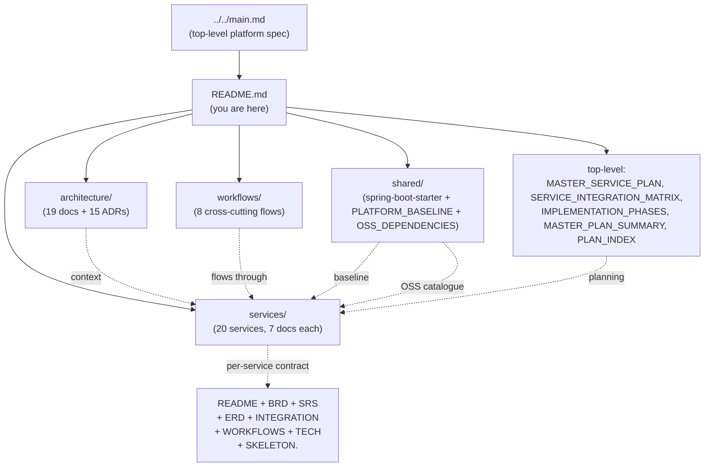

# Platform Documentation

A production-grade, configurable, microservices platform combining ride-hailing,
food delivery, and shared platform capabilities. This repository is the
**architecture and requirements** documentation. It is not application code.

## Scope

The platform supports two consumer-facing products on top of one shared
foundation:

- **Ride-hailing** — driver/customer matching, trip lifecycle, dynamic pricing.
- **Food delivery / marketplace** — merchant onboarding, menu management,
  order lifecycle, courier dispatch.

Both run on the same identity, payment, notification, configuration, and
operations fabric.

## Documentation map at a glance

The diagram maps to the **Reading Order** table below — read top-to-bottom
for a complete tour, or jump straight to a section that answers your
question.

## Reading Order

| # | Document | Purpose |
|---|----------|---------|
| 1 | [`architecture/SYSTEM_OVERVIEW.md`](architecture/SYSTEM_OVERVIEW.md) | Plain-English summary of the platform |
| 2 | [`architecture/ARCHITECTURE.md`](architecture/ARCHITECTURE.md) | Architectural style, principles, and non-negotiables |
| 3 | [`architecture/DOMAIN_MAP.md`](architecture/DOMAIN_MAP.md) | Bounded contexts and how they map to services |
| 4 | [`architecture/MICROSERVICES_MAP.md`](architecture/MICROSERVICES_MAP.md) | Service catalog with ownership, data, and dependencies |
| 5 | [`architecture/CONTEXT_MAP.md`](architecture/CONTEXT_MAP.md) | Context relationships (customer/supplier, conformist, etc.) |
| 6 | [`architecture/DATA_OWNERSHIP.md`](architecture/DATA_OWNERSHIP.md) | Source-of-truth matrix |
| 7 | [`architecture/EVENT_ARCHITECTURE.md`](architecture/EVENT_ARCHITECTURE.md) | Event catalog and delivery semantics |
| 8 | [`architecture/API_STANDARDS.md`](architecture/API_STANDARDS.md) | REST, error format, idempotency, versioning |
| 9 | [`architecture/KEYCLOAK_ARCHITECTURE.md`](architecture/KEYCLOAK_ARCHITECTURE.md) | Identity, realms, clients, token flows |
| 10 | [`architecture/SECURITY_ARCHITECTURE.md`](architecture/SECURITY_ARCHITECTURE.md) | AuthN/Z, secrets, PII, PCI |
| 11 | [`architecture/DATABASE_ARCHITECTURE.md`](architecture/DATABASE_ARCHITECTURE.md) | PostgreSQL-per-service, PostGIS, migrations |
| 12 | [`architecture/CONFIGURATION_ARCHITECTURE.md`](architecture/CONFIGURATION_ARCHITECTURE.md) | Config hierarchy, override rules |
| 13 | [`architecture/OBSERVABILITY.md`](architecture/OBSERVABILITY.md) | Logs, metrics, traces, audit |
| 14 | [`architecture/DEPLOYMENT_ARCHITECTURE.md`](architecture/DEPLOYMENT_ARCHITECTURE.md) | Docker, Kubernetes, environments |
| 15 | [`architecture/SERVICE_ISOLATION.md`](architecture/SERVICE_ISOLATION.md) | **How every service behaves when a downstream is down** — timeout / bulkhead / circuit / retry / fallback, by class (CRITICAL / DEGRADABLE / BEST-EFFORT) |
| 16 | [`architecture/DOWNSTREAM_ERROR_CATALOG.md`](architecture/DOWNSTREAM_ERROR_CATALOG.md) | **Canonical error-code catalog + propagation rules** (the `downstream` block, forward/translate/degrade/reject) |
| 17 | [`architecture/FAILURE_HANDLING.md`](architecture/FAILURE_HANDLING.md) | Saga, retry, circuit breaker, outbox |
| 18 | [`architecture/CONSISTENCY_STRATEGY.md`](architecture/CONSISTENCY_STRATEGY.md) | Where strong vs eventual consistency applies |
| 19 | [`architecture/ADR_INDEX.md`](architecture/ADR_INDEX.md) | Index of architecture decision records |
| 20 | [`workflows/RIDE_WORKFLOWS.md`](workflows/RIDE_WORKFLOWS.md) | End-to-end ride flows |
| 21 | [`workflows/FOOD_ORDER_WORKFLOWS.md`](workflows/FOOD_ORDER_WORKFLOWS.md) | End-to-end order/delivery flows |
| 22 | [`workflows/PAYMENT_WORKFLOWS.md`](workflows/PAYMENT_WORKFLOWS.md) | Authorize/capture/refund/settlement |
| 23 | [`workflows/DRIVER_WORKFLOWS.md`](workflows/DRIVER_WORKFLOWS.md) | Onboarding, shifts, earnings |
| 24 | [`workflows/COURIER_WORKFLOWS.md`](workflows/COURIER_WORKFLOWS.md) | Courier shifts, dispatch, delivery |
| 25 | [`workflows/MERCHANT_WORKFLOWS.md`](workflows/MERCHANT_WORKFLOWS.md) | Merchant onboarding, menu ops |
| 26 | [`workflows/REFUND_WORKFLOWS.md`](workflows/REFUND_WORKFLOWS.md) | Refund orchestration |
| 27 | [`workflows/SAFETY_WORKFLOWS.md`](workflows/SAFETY_WORKFLOWS.md) | SOS, fraud, emergency response |
| 28 | [`workflows/ACCOUNTING_WORKFLOWS.md`](workflows/ACCOUNTING_WORKFLOWS.md) | Accounting view: transactions, taxes, expenses, government costs (tax recognition & remittance; gross-to-net; marketplace VAT; CIT & regulatory fees; expense recognition — incentives, refunds, opex, chargebacks; reconciliation & period close) |
| 28 | [`services/README.md`](services/README.md) | **Service catalog** — all 20 services grouped by bounded context with one-line summaries and cross-cutting views |
| 29 | `services/<service>/{README,BRD,SRS,ERD,INTEGRATION,WORKFLOWS,TECH}.md` | Per-service documentation (every service links to its upstream + downstream services) |
| 30 | [`shared/PLATFORM_BASELINE.md`](shared/PLATFORM_BASELINE.md) | Single source for PostgreSQL 19, Kafka, Keycloak, Redis, OpenTelemetry, Vault, deployment, DR (referenced by every service README) |
| 30a | [`shared/OSS_DEPENDENCIES.md`](shared/OSS_DEPENDENCIES.md) | **Open-source dependencies & license attribution** — platform-wide OSS projects + per-language OSS library catalogue with SPDX license IDs; per-service OSS bundle index; NOTICE / THIRD-PARTY-LICENSES guidance; license compatibility matrix (internal SaaS vs on-prem) |
| 31 | [`shared/README.md`](shared/README.md) | `platform-spring-boot-starter` shared library — the single source of cross-cutting Spring Boot code |
| 32 | [`services/RECOMMENDATIONS.md`](services/RECOMMENDATIONS.md) | Per-service language + framework recommendation (the tech map) |
| 32a | `services/<service>/SKELETON.{gradle.kts,go.mod,pyproject.toml}` | Per-service extractability skeleton — minimum dependency manifest proving the service can run as a standalone project (or as part of the platform unchanged); references [`OSS_DEPENDENCIES.md`](shared/OSS_DEPENDENCIES.md) 7 |

## Per-Service Documentation Contract

Every service in [`architecture/MICROSERVICES_MAP.md`](architecture/MICROSERVICES_MAP.md)
MUST have, under `services/<service-name>/`:

- `README.md` — service purpose, bounded context, actors, dependencies, API/event
  summary, security, observability, scaling.
- `BRD.md` — business context, objectives, stakeholders, capabilities, business
  rules, workflows, KPIs, acceptance criteria. Requirements IDs prefixed `BR--`.
- `SRS.md` — functional/non-functional requirements, API contract, data
  requirements, validation, state transitions, authorization, idempotency,
  performance, availability, security, audit, DR. IDs: `FR--`, `NFR--`,
  `SEC--`, `DATA--`.
- `ERD.md` — service-owned schema, entities, Mermaid ER diagram, table DDL,
  indexes, check constraints, audit columns, soft-delete, JSONB usage,
  partitioning, retention, migration notes. UUIDs for primary keys.
  Cross-service identifiers are stored as UUID columns **without** database FKs.
- `INTEGRATION.md` — inbound APIs (full request/response/error contract),
  outbound APIs, produced events (with schema, partition key, version, DLQ),
  consumed events (with duplicate handling), reliability mechanisms
  (timeout, retry, circuit breaker, outbox, saga, correlation IDs).
- `WORKFLOWS.md` — every important workflow with Mermaid sequence diagrams,
  including happy/alternate/failure paths, state transitions, compensations.
- `TECH.md` — per-service technology profile (language, framework, key
  libraries, data layer, cache, external integrations, admin endpoints,
  RBAC). Links to `../RECOMMENDATIONS.md` for the platform-wide tech map.

Every service README's "See also" section also links to its **related
services** (upstream `Depends on` and downstream `Depended on by`), the
**workflows it participates in**, the **platform baseline** (single source
for PostgreSQL 19, Kafka, Keycloak, etc. — no repetition), and the
[service catalog](services/README.md).

## Conventions (enforced)

- **Service names**: `kebab-case`, suffix `-service`.
- **PostgreSQL**: `snake_case` tables/columns, UUIDv7 primary keys (preferred
  for time-orderable) or UUIDv4 (acceptable).
- **Domain entities**: `PascalCase` (logical names only — not in code).
- **REST URIs**: `/v1/<resource>` (URI versioned). Major breaking changes →
  `/v2`. Minor additive changes stay in `/v1`.
- **Events**: `domain.entity.event.vN` — e.g. `ride.trip.completed.v1`.
- **Errors**: JSON envelope, machine-readable `code`, `message`,
  `correlationId`, `details[]`. See `architecture/API_STANDARDS.md`.
- **Currency**: minor units (e.g. cents) internally; formatting at edges.
- **Times**: stored as `timestamptz` UTC. Display in user timezone at edge.
- **IDs**: cross-service references are UUID columns **without** FKs to other
  services' databases. See `architecture/CONSISTENCY_STRATEGY.md`.

## Phasing of This Repository

| Phase | Status | Output |
|-------|--------|--------|
| 1. Architecture Discovery | ✅ | `architecture/SYSTEM_OVERVIEW`, `MICROSERVICES_MAP`, `DOMAIN_MAP`, `CONTEXT_MAP`, `DATA_OWNERSHIP` |
| 2. Global Architecture | ✅ | All `architecture/*.md` and `workflows/*.md` |
| 3. Shared Platform Services | ✅ | `services/{api-gateway, identity-service, …, admin-service}` |
| 4. Ride-Hailing Services | ✅ | `services/{trip-service, pricing-service, customer-service, driver-service, geolocation-service, notification-service, payment-service}` (post-consolidation per [ADR-0017](architecture/adrs/0017-20-service-architecture.md)) |
| 5+6. Food Marketplace + Delivery | ✅ | `services/{restaurant-service, food-order-service, courier-service}` (post-consolidation) |
| 7. Financial Services | ✅ | `services/{payment-service, ledger-service}` (post-consolidation; payment-service absorbs wallet, earnings, settlement, COD, sagas) |
| 8. Operations | ✅ | `services/{admin-service, fraud-risk-service, audit-service, reporting-service, configuration-service, notification-service, search-service}` (post-consolidation; admin-service absorbs support, configuration-service absorbs `configuration-service` (flags), notification-service absorbs communication-gateway, reporting-service absorbs analytics) |
| 9. Validation | ✅ | `architecture/VALIDATION_REPORT.md` |

## Auditing the Architecture

Read [`architecture/VALIDATION_REPORT.md`](architecture/VALIDATION_REPORT.md)
for the explicit cross-check on duplicated responsibilities, ownership
conflicts, missing failure paths, and other architectural risks.
