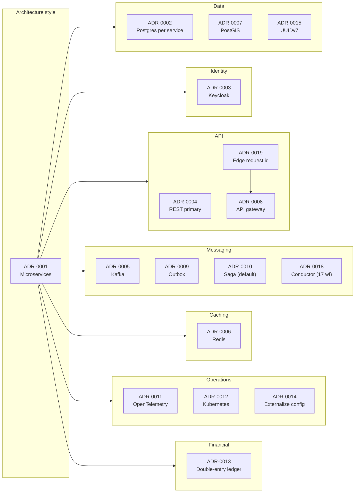

# Architecture Decision Records (ADR) Index

Each ADR captures a significant architectural decision: the context,
the options considered, the decision, and the consequences. ADRs are
immutable once accepted; superseded decisions link to the new ADR.

| # | Title | Status |
|---|-------|--------|
| [ADR-0001](adrs/0001-microservices-architecture.md) | Adopt a microservices architecture | Accepted |
| [ADR-0002](adrs/0002-postgres-per-service.md) | PostgreSQL 19 with one schema per service | Accepted |
| [ADR-0003](adrs/0003-keycloak-for-identity.md) | Use Keycloak as the central identity platform | Accepted |
| [ADR-0004](adrs/0004-rest-as-primary-api.md) | REST as the primary synchronous API style | Accepted |
| [ADR-0005](adrs/0005-kafka-as-event-broker.md) | Apache Kafka as the event broker | Accepted |
| [ADR-0006](adrs/0006-redis-for-cache-and-rate.md) | Redis for cache, sessions, and rate limiting | Accepted |
| [ADR-0007](adrs/0007-postgis-for-geospatial.md) | Use PostGIS for geospatial queries | Accepted |
| [ADR-0008](adrs/0008-api-gateway.md) | API gateway at the edge | Accepted |
| [ADR-0009](adrs/0009-transactional-outbox.md) | Outbox pattern for event publication | Accepted |
| [ADR-0010](adrs/0010-saga-pattern.md) | Saga pattern for distributed workflows | Superseded by ADR-0018 (for the 17 named cross-cutting workflows across 5 flow families — Phase 7 rewards / Phase 7.5 Make-a-Deal / refund orchestration / driver+courier onboarding / service-request) |
| [ADR-0011](adrs/0011-opentelemetry-observability.md) | OpenTelemetry for traces, metrics, and logs | Accepted |
| [ADR-0012](adrs/0012-kubernetes-orchestration.md) | Kubernetes for orchestration | Accepted |
| [ADR-0013](adrs/0013-double-entry-ledger.md) | Double-entry ledger for financial state | Accepted |
| [ADR-0014](adrs/0014-externalize-configuration.md) | Externalize configuration via configuration-service | Accepted |
| [ADR-0015](adrs/0015-uuidv7-for-ids.md) | UUIDv7 for new identifiers | Accepted |
| [ADR-0016](adrs/0016-service-domain-consolidation.md) | Service domain consolidation (58 → 44, intermediate stage) | Superseded by ADR-0017 |
| [ADR-0017](adrs/0017-20-service-architecture.md) | 20-service architecture (58 → 20, supersedes ADR-0016) | Accepted |
| [ADR-0018](adrs/0018-workflow-engine-conductor.md) | Netflix Conductor as external workflow engine for 17 cross-cutting workflows across 5 flow families — Phase 7 / 7.5 / refunds / onboarding / service-request — across 15 participating services (partial supersession of ADR-0010) | Accepted |
| [ADR-0019](adrs/0019-request-id-at-the-edge.md) | Request id at the edge: API gateway accepts or generates `X-Request-Id` (alias `X-Correlation-Id`) and propagates to every downstream call, event, log, and OTel span | Accepted |
| [ADR-0020](adrs/0020-polymorphic-request-id.md) | Polymorphic `request_id` + `workflow_process_id` for cross-service sagas (ride payment, food payment, refunds, rewards fan-out): one canonical id per business request, saga-keyed, applied across payment-service, ledger-service, audit-service, reporting-service, notification-service, trip-service | Accepted |
| [ADR-0021](adrs/0021-21-service-architecture-with-chat.md) | 21-service architecture with `chat-service` (Phase 7.7 cross-cutting addition to the 20-service catalog from ADR-0017) — Go 1.25 + WebSocket fan-out, owns the `chat` schema; 7 consumer services (trip / food-order / courier / restaurant / notification / admin / fraud-risk) ship a `Phase 7.7` block in their PLAN.md | Accepted |
| [ADR-0022](adrs/0022-design-system-shared-library.md) | Cross-stack design system as a first-class shared library — `@trips-enjoy/design-system` (web) + `package:trips_enjoy_ds` (mobile) + W3C design tokens; visual + behavioural + i18n/RTL (EN + AR) + a11y (WCAG 2.2 AA) + theming + white-label; the frontend sibling of `platform-spring-boot-starter`. Full architecture in [`shared/DESIGN_SYSTEM.md`](../shared/DESIGN_SYSTEM.md) | Accepted |
| [ADR-0023](adrs/0023-spring-initializr-scaffolding.md) | Spring Initializr ([start.spring.io](https://start.spring.io/)) as the canonical scaffolder for the 14 Kotlin + Spring Boot 4 backend services — every service is scaffolded from the same recipe (Gradle Kotlin DSL, Kotlin 2.2.x, Spring Boot 4.0.0, Java 21, standard dependency set), then adopts `com.trips-enjoy.platform:spring-boot-starter`; the first commit is the Initializr scaffold + the per-service docs (no business logic). Full recipe in [`services/SPRING_INITIALIZR.md`](../services/SPRING_INITIALIZR.md) | Accepted |
| [ADR-0024](adrs/0024-dlq-topic-naming.md) | Kafka dead-letter queue (DLQ) topic naming: `<topic>.dlq` (Spring Kafka default; 8/8 services) — ratifies the actual de-facto convention, replacing the prior platform default `<topic>.DLQ.v1` which was documented in `shared/MODULES.md` but never enforced | Accepted |
| [ADR-0025](adrs/0025-keycloak-role-claim-shape.md) | Keycloak role claim shape: `ROLE_<UPPER>` (realm roles) and `ROLE_<CLIENT>_<UPPER>` (client roles); OAuth scopes as `SCOPE_<UPPER>`. Matches the `service-claims` protocol mapper output of `identity-service`'s seeder and the `JwtRoleConverter` in `platform-spring-boot-security`. Replaces the 11 service-local `JwtAuthenticationConverter`s with lowercase / inconsistent shapes | Accepted |
| [ADR-0026](adrs/0026-rfc7807-error-envelope.md) | RFC 7807 error envelope fields: every HTTP error response MUST carry `code`, `correlationId`, `traceId`, `spanId`, `timestamp` as required extension fields, plus optional `errors[]` (validation aggregation) and `downstream` (upstream attribution). Replaces the 11 service-local `ApiExceptionHandler.kt`s that produce 3-field envelopes and the local `ErrorEnvelope` in `reporting-service/app/domain/types.py:127-136` that's actively missing 5 of 7 fields | Accepted |
| [ADR-0027](adrs/0027-idempotency-record-schema.md) | Idempotency record schema: canonical `(actor_id, idempotency_key)` unique key + canonical columns `id, actor_id, idempotency_key, request_hash, response_status, response_body, state, created_at, expires_at`. Replaces the 3-variant schema drift across 5 services (`configuration-service` UUID-PK, `payment-service` `(scope, idem_key)`, others `(actor_id, idempotency_key)`) | Accepted |
| [ADR-0028](adrs/0028-outbox-event-schema.md) | OutboxEvent schema: canonical 11-column shape (`id, event_id, topic, partition_key, payload, headers, created_at, published_at, attempts, last_error, next_attempt_at`) + canonical `OutboxPublisher` semantics (1s poll, `FOR UPDATE SKIP LOCKED` LIMIT 100, exponential backoff up to 5 min, DLQ on 6th attempt). Replaces the 6-variant drift across 6 services | Accepted |
| [ADR-0029](adrs/0029-partition-cron-schedule.md) | Partition maintenance cron schedule: canonical `0 0 2 * * *` (02:00 UTC daily) — matches `pg_cron` and `shared/PARTITION_FUNCTIONS.md`. Replaces 9 service-local `PartitionMaintenanceJob.kt`s with 3 distinct crons (`0 0 2 * * *`, `0 0 3 * * *`, `0 0 1 * * *`) | Accepted |
| [ADR-0030](adrs/0030-request-id-mint-and-mdc.md) | Request ID mint: every service MUST mint UUIDv7 (per [ADR-0015](adrs/0015-uuidv7-for-ids.md)) and bind to MDC under the key `requestId` when no upstream id is supplied. Replaces the 9 service-local `RequestCorrelationFilter.kt`s that mint UUIDv4 + request attribute (breaks log correlation and OTel span attributes) | Accepted |
| [ADR-0031](adrs/0031-testcontainers-image-tags.md) | Testcontainers image tags: canonical pinned versions — `confluentinc/cp-kafka:7.5.0`, `postgres:18.0-alpine`, `redis:7.2-alpine`, `quay.io/keycloak/keycloak:24.0`. Replaces the 12 service-local `TestcontainersConfiguration.kt`s with floating `latest` tags (not reproducible; production protocol mismatch for Kafka) | Accepted |




## ADR Template

Each ADR uses this structure (based on the MADR template):

```markdown
# ADR-NNNN: <Title>

- Status: Proposed | Accepted | Deprecated | Superseded by ADR-XXXX
- Date: YYYY-MM-DD
- Authors: <names>
- Deciders: <names>
- Tags: <comma-separated>

## Context and Problem Statement

<What is the context? What problem are we solving? What forces are at play?>

## Decision Drivers

- <driver 1>
- <driver 2>

## Considered Options

- <option 1>
- <option 2>
- <option 3>

## Decision Outcome

Chosen option: "<option>", because <reason>.

### Consequences

- Good: <positive>
- Bad: <negative>
- Neutral: <implication>

### Confirmation

<How will we know this decision was correct? Metrics, follow-ups.>

## Pros and Cons of the Options

### <option 1>

<description>

- Good: …
- Bad: …

### <option 2>

<description>

- Good: …
- Bad: …

## References

- <link>
- <link>
```