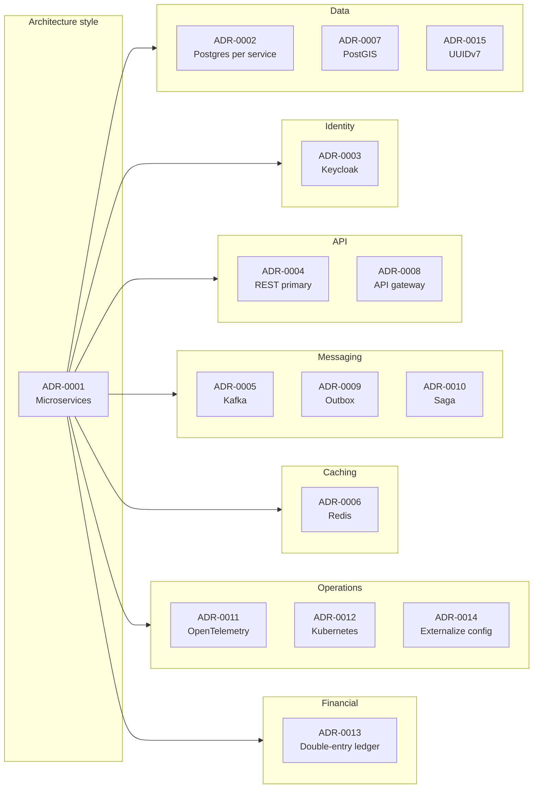

# Architecture Decision Records (ADR) Index

Each ADR captures a significant architectural decision: the context,
the options considered, the decision, and the consequences. ADRs are
immutable once accepted; superseded decisions link to the new ADR.

| # | Title | Status |
|---|-------|--------|
| [ADR-0001](adrs/0001-microservices-architecture.md) | Adopt a microservices architecture | Accepted |
| [ADR-0002](adrs/0002-postgres-per-service.md) | PostgreSQL 18 with one schema per service | Accepted |
| [ADR-0003](adrs/0003-keycloak-for-identity.md) | Use Keycloak as the central identity platform | Accepted |
| [ADR-0004](adrs/0004-rest-as-primary-api.md) | REST as the primary synchronous API style | Accepted |
| [ADR-0005](adrs/0005-kafka-as-event-broker.md) | Apache Kafka as the event broker | Accepted |
| [ADR-0006](adrs/0006-redis-for-cache-and-rate.md) | Redis for cache, sessions, and rate limiting | Accepted |
| [ADR-0007](adrs/0007-postgis-for-geospatial.md) | Use PostGIS for geospatial queries | Accepted |
| [ADR-0008](adrs/0008-api-gateway.md) | API gateway at the edge | Accepted |
| [ADR-0009](adrs/0009-transactional-outbox.md) | Outbox pattern for event publication | Accepted |
| [ADR-0010](adrs/0010-saga-pattern.md) | Saga pattern for distributed workflows | Accepted |
| [ADR-0011](adrs/0011-opentelemetry-observability.md) | OpenTelemetry for traces, metrics, and logs | Accepted |
| [ADR-0012](adrs/0012-kubernetes-orchestration.md) | Kubernetes for orchestration | Accepted |
| [ADR-0013](adrs/0013-double-entry-ledger.md) | Double-entry ledger for financial state | Accepted |
| [ADR-0014](adrs/0014-externalize-configuration.md) | Externalize configuration via configuration-service | Accepted |
| [ADR-0015](adrs/0015-uuidv7-for-ids.md) | UUIDv7 for new identifiers | Accepted |
| [ADR-0016](adrs/0016-service-domain-consolidation.md) | Service domain consolidation (58 → 44) | Accepted |




## ADR Template

Each ADR uses this structure (based on the MADR template):

```markdown
# ADR-NNNN: <Title>

- Status: Proposed | Accepted | Deprecated | Superseded by ADR-XXXX
- Date: YYYY-MM-DD
- Authors: <names>
- Deciders: <names>
- Tags: <comma-separated>

## Context and Problem Statement

<What is the context? What problem are we solving? What forces are at play?>

## Decision Drivers

- <driver 1>
- <driver 2>

## Considered Options

- <option 1>
- <option 2>
- <option 3>

## Decision Outcome

Chosen option: "<option>", because <reason>.

### Consequences

- Good: <positive>
- Bad: <negative>
- Neutral: <implication>

### Confirmation

<How will we know this decision was correct? Metrics, follow-ups.>

## Pros and Cons of the Options

### <option 1>

<description>

- Good: …
- Bad: …

### <option 2>

<description>

- Good: …
- Bad: …

## References

- <link>
- <link>
```