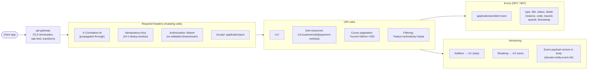

# API Standards

All public REST APIs on this platform MUST follow these standards. Internal
service-to-service calls MUST follow the same standards except where noted
(observability, errors, idempotency).




## 1. Style

- **REST over HTTPS** (TLS 1.3 at the edge, mTLS in cluster).
- **JSON** for request and response bodies.
- **UTF-8** encoding.
- **Content negotiation** via `Accept` header.
- **CORS** configured at the gateway per channel.

## 2. Resource Naming

- Resources are plural nouns, kebab-case: `/v1/rides`, `/v1/trips`,
  `/v1/customers`, `/v1/restaurants`.
- Sub-resources: `/v1/customers/{customer_id}/payment-methods`.
- Actions that don't fit CRUD are POST under a dedicated noun
  (`/v1/rides/{ride_id}/cancellations` rather than `/v1/rides/cancel`).
- No verbs in URIs.
- Trailing slashes are not significant (normalize on the server side).

## 3. Versioning

- **URI versioning** for major versions: `/v1/...`, `/v2/...`.
- Additive changes stay in the same major version.
- Breaking changes (field removal, type change, semantics change) →
  `/v2/...`. The old version is supported for ≥ 6 months with
  `Deprecation` and `Sunset` headers (RFC 8594, RFC 8288).
- A version selector at the gateway routes by header `Api-Version: 2`
  to the corresponding service version if multi-versioned routing is
  used.

## 4. Pagination

- **Cursor pagination** is the default for list endpoints.
- Query params:
  - `cursor=<opaque>` — opaque token returned by the previous response.
  - `limit=<int>` — max items per page (default 20, max 100).
- Response includes:

  ```json
  {
    "items": [ … ],
    "next_cursor": "eyJ…",
    "has_more": true
  }
  ```

- For admin/reporting use cases, **offset pagination** is allowed
  (`?page=1&page_size=50`); document it explicitly per endpoint.

## 5. Filtering, Sorting, Search

- Filter: `?status=active&city_id=eu-west-amsterdam`.
- Sort: `?sort=-created_at` (default) or `?sort=created_at,-name`.
- Search: `?q=…`. For full-text, the endpoint should integrate with
  `search-service` and document the supported query DSL subset.

## 6. Standard Headers

| Header | Direction | Purpose |
|--------|-----------|---------|
| `Authorization: Bearer <jwt>` | request | Access token |
| `Content-Type: application/json` | request | Required for bodies |
| `Accept: application/json` | request | Default |
| `Accept-Language: en-US` | request | i18n |
| `X-Request-Id: <uuid>` | request | Idempotency / dedupe / tracing |
| `Idempotency-Key: <uuid>` | request | For non-idempotent POSTs |
| `X-Correlation-Id: <uuid>` | request | Propagated through logs, events |
| `X-Tenant-Id: <id>` | request | For multi-tenant admin endpoints |
| `Traceparent: <w3c>` | request | OpenTelemetry trace context |
| `Deprecation: true` | response | Indicates deprecated endpoint |
| `Sunset: Wed, 01 Jan 2027 00:00:00 GMT` | response | Sunset date |
| `Link: <…>; rel="next"` | response | Pagination hint |
| `RateLimit-*` | response | Rate limit info |

## 7. Authentication

- All endpoints (except `/health`, `/ready`, public auth) require a
  valid JWT bearer token.
- The gateway validates:
  - Signature (RS256, JWKS from Keycloak).
  - `iss` matches expected Keycloak realm.
  - `aud` matches the service client id.
  - `exp` not in the past; `nbf` not in the future.
  - `sub` present.
- The service receives the validated claims in headers:
  - `X-User-Id` (Keycloak sub).
  - `X-User-Type` (`customer`, `driver`, `courier`, `merchant_staff`,
    `restaurant_staff`, `support_agent`, `admin`, etc.).
  - `X-Roles` (comma-separated).
  - `X-Scopes` (space-separated).
  - `X-Tenant-Id` (if multi-tenant claim present).

## 8. Authorization

- **Coarse**: gateway rejects with 403 if any required role is missing.
- **Fine**: service checks scopes per endpoint.
- **Resource-level**: service enforces ownership
  (`trip.customer_id == sub`).
- Errors: 401 (no token / invalid), 403 (token valid but unauthorized).

## 9. Idempotency

- For non-idempotent operations (`POST` that mutates state), clients
  MUST send `Idempotency-Key: <uuid>`.
- The service stores `(client_id, idempotency_key, request_hash,
  response_status, response_body, expires_at)` for 24h.
- On duplicate `Idempotency-Key`:
  - If `request_hash` matches → return the stored response.
  - If `request_hash` differs → return 422 with
    `code: "IDEMPOTENCY_KEY_REUSED"`.
- For event-driven flows, the outbox + inbox pattern provides the
  same guarantee.

## 10. Correlation IDs and Distributed Tracing

- The gateway generates a `correlation_id` per request (or accepts one
  from the client) and propagates it as:
  - HTTP header `X-Correlation-Id`.
  - Kafka header `correlation_id` on every emitted event.
  - Field `correlation_id` in the event envelope.
- OpenTelemetry `traceparent` is also propagated.
- Every log line in the request scope includes the correlation id.

## 11. Errors

All errors use the same JSON envelope:

```json
{
  "code": "ORDER_NOT_AVAILABLE",
  "message": "The requested order is not available for this action.",
  "correlationId": "01HZX9C7T0XK2P9F0V6E4B1MZA",
  "details": [
    {
      "field": "order_id",
      "issue": "ORDER_NOT_FOUND"
    }
  ]
}
```

| Field | Required | Purpose |
|-------|----------|---------|
| `code` | yes | Stable machine-readable identifier (SCREAMING_SNAKE_CASE) |
| `message` | yes | Human-readable, localized via i18n at the edge |
| `correlationId` | yes | For support / log lookup |
| `details` | no | Structured field-level issues (validation) |
| `stack` | no | Only in non-prod; never in production |

### HTTP Status Code Conventions

| Status | Meaning | Example |
|--------|---------|---------|
| 200 | OK | Successful read or update |
| 201 | Created | Resource created |
| 202 | Accepted | Async work started; result later via webhook or polling |
| 204 | No Content | Successful delete or no-body success |
| 400 | Bad Request | Malformed JSON, schema violation |
| 401 | Unauthorized | Missing/invalid token |
| 403 | Forbidden | Authenticated but not authorized |
| 404 | Not Found | Resource doesn't exist |
| 409 | Conflict | State conflict (e.g. cannot cancel a completed ride) |
| 422 | Unprocessable | Business rule violation; idempotency key reuse with different body |
| 429 | Too Many Requests | Rate limited |
| 500 | Internal Server Error | Unexpected |
| 502 | Bad Gateway | Downstream upstream failure surfaced |
| 503 | Service Unavailable | Capacity / circuit-open |
| 504 | Gateway Timeout | Upstream timeout |

### Common Error Codes (catalog)

The canonical platform-wide catalog of error codes is in
[`DOWNSTREAM_ERROR_CATALOG.md`](./DOWNSTREAM_ERROR_CATALOG.md). Every
service supports at least:

- `VALIDATION_FAILED`
- `UNAUTHENTICATED`
- `FORBIDDEN`
- `NOT_FOUND`
- `CONFLICT`
- `IDEMPOTENCY_KEY_REUSED`
- `RATE_LIMITED`
- `BUSINESS_RULE_VIOLATION`
- `STATE_INVALID`
- `INTERNAL_ERROR`
- `DEPENDENCY_UNAVAILABLE`
- `DEPENDENCY_TIMEOUT`
- `CIRCUIT_OPEN`
- `BULKHEAD_FULL`

When a downstream service returns an error, the caller MUST follow
the propagation rules in
[`SERVICE_ISOLATION.md` §5](./SERVICE_ISOLATION.md) (forward verbatim,
translate, degrade, or reject) and include the `downstream` block as
defined in
[`DOWNSTREAM_ERROR_CATALOG.md` §1.2](./DOWNSTREAM_ERROR_CATALOG.md).

Domain-specific codes are listed in each service's `INTEGRATION.md`.

## 12. Rate Limiting

- Per token, per IP, per route.
- Implemented at the gateway and (defense in depth) at each service.
- Headers: `RateLimit-Limit`, `RateLimit-Remaining`, `RateLimit-Reset`.
- 429 with `code: "RATE_LIMITED"`.

## 13. Request Validation

- All inbound JSON is validated against a JSON Schema (or equivalent).
- Validation errors return 400 with `code: "VALIDATION_FAILED"` and
  field-level `details[]`.
- The service stores the schema as a first-class artifact and
  references it in `INTEGRATION.md`.

## 14. Request Signing (for high-value flows)

- For admin endpoints and certain money-moving flows, the request body
  is signed using HMAC-SHA256 with a per-tenant secret.
- Header: `X-Signature: t=<unix>,v1=<hex>`.
- Required for: payout schedule changes, manual refund issuance,
  feature-flag mutations in production.

## 15. Money and Time Conventions

### Money

- **All money values are integer minor units** (e.g. cents), with a
  separate `currency` field (ISO-4217).
- The wire format:

  ```json
  {
    "amount_minor": 12345,
    "currency": "EUR"
  }
  ```

- Multi-currency: every monetary row carries a `currency` column.
  Conversion (when required) is a separate explicit operation, not
  implicit.
- No floats. Ever.

### Time

- All timestamps are **RFC3339 UTC** at the wire.
- The `timestamptz` type in PostgreSQL stores UTC.
- The edge (gateway, mobile) renders in the user's timezone.

## 16. Id Conventions

- Primary identifiers are **UUIDv7** (preferred; time-ordered) or
  UUIDv4 (acceptable). The platform standardizes on UUIDv7 for new
  services.
- External references (e.g. provider tokens) use provider-specific
  formats and are stored as opaque strings.
- Business identifiers where applicable (driver license number, plate
  number) are stored as strings, never as numbers.

## 17. Deprecation

When deprecating an endpoint:

1. Add `Deprecation: true` and `Sunset: <RFC1123 date>` headers.
2. Document the replacement.
3. Log every call to the deprecated endpoint (with `correlation_id`).
4. Keep the endpoint alive for at least 6 months.
5. After the sunset date, return 410 Gone with a `code:
   "ENDPOINT_RETIRED"`.

## 18. OpenAPI

- Every service publishes an OpenAPI 3.1 spec at
  `/openapi.json` (and `/docs` for Swagger UI when enabled).
- The spec is the source of truth; the implementation MUST match it.
- Specs are validated in CI; a PR that breaks the contract fails the
  build.

## 19. Webhooks (outbound, for partner-facing flows)

- Outbound webhooks are signed (HMAC-SHA256).
- Include `X-Webhook-Id`, `X-Webhook-Timestamp`, `X-Webhook-Signature`.
- Retries: 5 attempts with exponential backoff and jitter; DLQ after.
- Subscribers must respond `2xx` within 5 seconds.

## 20. Anti-Patterns Explicitly Avoided

- Returning 200 with an error envelope inside.
- Using POST as a generic RPC call.
- Stacking business logic in the gateway — the gateway routes and
  authenticates only.
- Putting the user's email in the URL.
- Returning different shapes for the same resource at different
  endpoints — keep `Trip` shape consistent everywhere it's returned.
- Using PUT for partial updates (use PATCH for partial, PUT for full
  replacement).