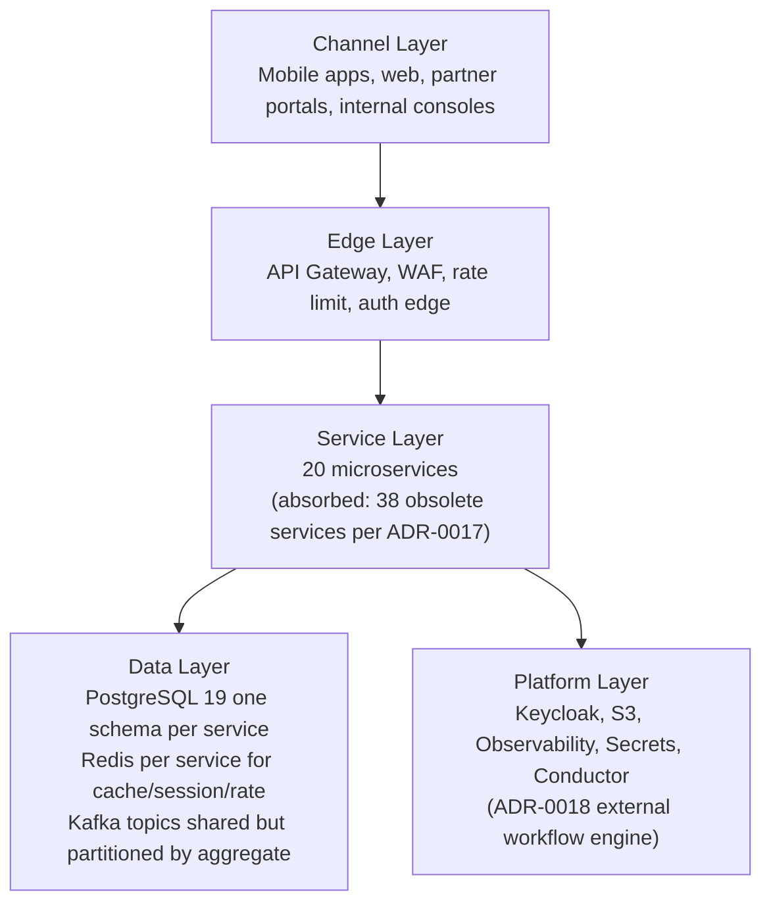

# Architecture

## Style

**Microservices** organized by **bounded context** with **database per
service**, communicating through **REST** (synchronous) and **Kafka
topics** (asynchronous). Strong internal consistency, eventual
consistency across service boundaries. The platform standardizes on
**exactly 20 services** per
[ADR-0017](adrs/0017-20-service-architecture.md).

## Layered View

## Service Categorization

Services are categorized by the role they play in the architecture.
This shapes deployment topology, SLOs, and team ownership. The
"absorbed capability" column calls out the suites that previously
were separate services before the
[58 → 20 consolidation](adrs/0017-20-service-architecture.md).

| Category | Purpose | Services (20) | SLO Hint |
|----------|---------|---------------|----------|
| Edge | Cross-cutting request handling | `api-gateway` | 99.99% availability |
| Identity | Auth, token validation, identity graph | `identity-service` | 99.99% |
| Profile | Domain-specific user data | `customer-service`, `driver-service`, `courier-service` | 99.95% |
| Workflow | Multi-step business orchestration | `trip-service`, `food-order-service` | 99.9% |
| Transactional | Records of business fact | `trip-service`, `payment-service`, `ledger-service`, `food-order-service`, `restaurant-service` | 99.95% |
| Engine | Pure computational capability | `pricing-service` (engine + absorbed tax/promotion/loyalty), `driver-service` (absorbed dispatch + ETA/routing), `geolocation-service` (absorbed ETA/routing + zones) | 99.9% |
| Event-driven sink | Reads events to maintain projections | `reporting-service`, `audit-service`, `search-service` | 99.9% |
| Real-time | High-write, time-bounded data | `driver-service` (location), `courier-service` (location), `trip-service` (live tracking) | 99.9%, P99 write < 100ms |
| External gateway | One adapter per external provider | `notification-service` (provider adapters preserved), `payment-service` (46-gateway registry) | 99.9% |
| Cross-cutting control | Configuration, flags, ops | `configuration-service` (absorbed flags), `fraud-risk-service`, `admin-service` (absorbed support module) | 99.95% |
| Foundation storage | Storage / immutable audit | `file-service`, `audit-service` | 99.95% |

## Cross-Cutting Decisions

### Identity & AuthN

- **Keycloak** is the source of truth for `keycloak_user_id`,
  credentials, MFA, sessions, social login, and federation. See
  [`KEYCLOAK_ARCHITECTURE.md`](KEYCLOAK_ARCHITECTURE.md).
- Every API call carries a **JWT access token** (RS256) issued by
  Keycloak. `api-gateway` validates signature, exp, aud, iss, and the
  required scope/role.
- Service-to-service calls use **client credentials** with a
  dedicated service-account client per service in Keycloak.

### AuthZ

- **RBAC + scopes**. Coarse roles (`customer`, `driver`, `courier`,
  `restaurant_staff`, `merchant_staff`, `support_agent`, `admin`,
  `super_admin`) gate endpoint access at the gateway.
- **Fine-grained scopes** (`trips:read:self`, `payments:write`) gate
  specific operations inside a service.
- **Resource-level checks** are enforced by each service — the gateway
  is not trusted to make ownership decisions.
- **Multi-tenancy** (where applicable — e.g. merchant operator console
  seeing only their merchant) is enforced at the service layer via a
  `tenant_id` claim in the token.

### Data Isolation

- One PostgreSQL database per service (logical schema can be shared
  at the cluster level, but the schema is owned by exactly one
  service).
- No cross-service FKs. Cross-service references are UUID columns
  (`customer_id`, `driver_id`, `restaurant_id`…) without a
  database-level foreign key.
- Cross-service consistency is maintained via:
  - **APIs** (request/response) for read-your-writes within a
    workflow.
  - **Events** for asynchronous propagation.
  - **Reconciliation jobs** for drift detection and repair.

### Communication Patterns

| Need | Pattern | When |
|------|---------|------|
| Read profile / state needed to make a decision now | Sync REST | Sub-200ms target, with circuit breaker |
| Trigger work in another service | Async event | Decoupled timing, eventual consistency acceptable |
| Multi-step cross-service workflow | Saga (in-service) **or** Conductor | In-service for depth 3-7 with simple compensation (ADR-0010); Conductor for multi-consumer fan-out > 6, TTL-driven timers, long-running human tasks, N-step compensation ordering (ADR-0018) |
| Stream of high-frequency state changes (location) | Kafka partitioned by aggregate ID | High throughput, replay possible |
| Notify user | Async event → `notification-service` | Never inline-block on SMS/email/Push |

### State Management

- **Per-aggregate state machines** live inside the service that owns
  the aggregate. See [`EVENT_ARCHITECTURE.md`](EVENT_ARCHITECTURE.md)
  and per-service `WORKFLOWS.md` for state diagrams.
- **State transitions are validated server-side** and emit a `*.vN`
  event recording the new state.
- **Terminal states are immutable** (with narrow exceptions, e.g.
  `payment.captured` after a `refund.completed` reversal entry).

### Failure Handling

- **Timeouts** are explicit per call (default 1s for gateway →
  service, 2s for service → service).
- **Retries** are bounded with exponential backoff and jitter for
  transient failures. Idempotency keys prevent double-application.
- **Circuit breakers** wrap every outbound call. Open state returns
  a fast failure and surfaces a 503.
- **Bulkheads** isolate pools per downstream service.
- **Outbox pattern** ensures a service's state change and emitted
  event land in Kafka atomically.
- **Inbox + deduplication** on consumers to tolerate at-least-once
  delivery.
- **Dead-letter topics** for poison events; replayed via tooling.
- See [`FAILURE_HANDLING.md`](FAILURE_HANDLING.md) and the playbook
  in [`SERVICE_ISOLATION.md`](SERVICE_ISOLATION.md).

### Observability

- **Structured JSON logs** with `requestId` (the API-gateway-issued
  business id; equals the response's `X-Request-Id` / `X-Correlation-Id`
  headers — see [ADR-0019](adrs/0019-request-id-at-the-edge.md)),
  `traceId` (the OTel W3C trace id, **distinct from** `requestId`),
  `spanId`, `user_id` (when authed), `service`, `version`.
- **OpenTelemetry** traces; one root span per API call; propagated
  through Kafka via message headers.
- **Metrics**: RED (rate, errors, duration) per route per service;
  USE (utilization, saturation, errors) per resource; business KPIs
  per service.
- **Audit logs** are a domain event, written to Kafka and persisted
  by `audit-service`.
- See [`OBSERVABILITY.md`](OBSERVABILITY.md).

### Security

- **mTLS** between services inside the cluster.
- **TLS 1.3** at the edge. HSTS.
- **PII at rest encrypted** (column-level or disk-level per
  classification). Cardholder data is **never** stored — only
  provider tokens.
- **Secrets** are externalized (Vault, AWS Secrets Manager, or
  Kubernetes sealed-secrets). No secrets in env files in source
  control.
- **Least privilege**: each service-account client has only the
  scopes it needs.
- **Rate limiting** at gateway per token, per IP, per route.
- **SUPER_ADMIN preset** requires `X-Break-Glass-Cosigner` header
  + SUPER_ADMIN IP allowlist; documented in
  [`SECURITY_ARCHITECTURE.md` 14](SECURITY_ARCHITECTURE.md) and
  the [[trips-enjoy-super-admin-preset-management]] contract.
- See [`SECURITY_ARCHITECTURE.md`](SECURITY_ARCHITECTURE.md).

## Bounded Context Boundaries

The platform is decomposed into 9 strategic bounded contexts,
delivered by the 20 active services:

1. **Identity & Profile** — `identity-service`, `customer-service`
   (cross-persona profile + addresses + loyalty account),
   `driver-service` (vehicles), `courier-service`.
2. **Platform & Operations** — `api-gateway`,
   `notification-service` (provider adapters preserved),
   `configuration-service` (flags absorbed), `file-service`,
   `search-service`, `audit-service`, `reporting-service`,
   `admin-service` (support module), `fraud-risk-service`.
3. **Geospatial & Zones** — `geolocation-service` (zones absorbed;
   ETA/routing read path).
4. **Pricing & Rules** — `pricing-service` (absorbed tax /
   promotion / loyalty pricing / geo overrides); `trip-service` +
   `food-order-service` + `search-service` (review projections).
5. **Ride-hailing** — `trip-service` (ride request / trip /
   scheduled / safety / history / rewards),
   `driver-service` (availability / location / dispatch /
   incentives), `geolocation-service` (ETA/routing read),
   `payment-service` (ride saga + driver earnings), `customer-service`
   (history).
6. **Food Marketplace** — `restaurant-service` (merchant / branch /
   staff / menu / inventory), `food-order-service` (cart / checkout /
   queue / food reviews).
7. **Food Delivery & Couriers** — `courier-service` (dispatch /
   delivery / tracking), `payment-service` (courier earnings).
8. **Financial** — `payment-service` (intents / wallet / ride saga /
   food saga / merchant settlement / COD), `ledger-service`.
9. **Cross-cutting Infrastructure** — PostgreSQL, Redis, Kafka,
   Keycloak, S3, Observability, Secrets, Conductor
   (ADR-0018 external workflow engine). Not services; platform
   components.

The full service-by-service mapping (with absorbed capabilities and
schema names) is in
[`MICROSERVICES_MAP.md`](MICROSERVICES_MAP.md); the source-of-truth
matrix is in [`DATA_OWNERSHIP.md`](DATA_OWNERSHIP.md); the cross-
context interaction style is in
[`CONTEXT_MAP.md`](CONTEXT_MAP.md).

## Anti-Patterns Explicitly Avoided

| Anti-pattern | Why avoided | What we do instead |
|--------------|-------------|--------------------|
| Distributed monolith | Tight coupling, can't deploy independently | Each service has its own DB, deployable in isolation |
| Nano-services | Distributed complexity without benefit | 20 services, each with a meaningful bounded context; 38 absorbed into survivors |
| Shared business database | Coupling, lock contention | DB per service; replicated read models where needed |
| Cross-service FKs | Cross-service consistency coupling | UUIDs without FKs; consistency via API/events |
| Two-phase commit between services | Coordinator-coupled, fragile | Saga + outbox + reconciliation; Conductor `compensationSteps` for cross-cutting flows |
| Eventual consistency for financial state | Audit/compliance risk | Outbox + synchronous ledger entry; reconciliation; double-entry ledger in `ledger-service` |
| Inline calls to SMS/email/Push providers | Tight coupling, slow APIs | `notification-service` (provider adapters) + Kafka |
| Long synchronous chains | Tail latency, fragile | Outsource to async; bounded sync depth (≤3) |
| Hard-coded business rules | Slow iteration, env drift | `configuration-service` (flags absorbed) |
| Magic strings / opaque IDs | Operability, audit | UUIDv7 (preferred), typed identifiers, versioned events |
| Hand-rolled timer/TTL logic for Conductor-shaped flows | Scales linearly with compensation branches | Netflix Conductor `compensationSteps` + timers (ADR-0018) for the 17 named workflows |
| Renumbering sections when adding cross-cutting material | Breaks deep links and established section slots | Append-only per [[trips-enjoy-docs-append-not-renumber]] |

## Workflow Orchestration — Two Patterns

The platform uses two workflow orchestration patterns side-by-side:

1. **In-service saga** (per
   [ADR-0010](adrs/0010-saga-pattern.md), default for most flows) —
   orchestrated state machine inside the service that owns the root
   aggregate. Examples: `payment-service` ride-saga,
   `payment-service` food-saga, per-aggregate state machines in
   `trip-service`, `food-order-service`, `courier-service`,
   `driver-service`.

2. **External workflow engine (Netflix Conductor)** (per
   [ADR-0018](adrs/0018-workflow-engine-conductor.md), targeted
   adoption for 17 cross-cutting workflows across 5 flow families —
   Phase 7 rewards / Phase 7.5 deals / refunds / onboarding /
   service-request — across 15 participating services) — JSON-
   spec-first workflow DSL + typed workers colocated in participating
   service binaries. Examples: `wf.phase7.reward_grant.v1`,
   `wf.refund.*.v1`, `wf.onboarding.{driver,courier}.v1`,
   `wf.service_request.*.v1`. See
   [`shared/CONDUCTOR_WORKFLOWS.md`](../shared/CONDUCTOR_WORKFLOWS.md)
   for the full registry.

Both patterns share the platform baseline:

- **Outbox** for every event published (per
  [ADR-0009](adrs/0009-transactional-outbox.md))
- **Inbox** for every event consumed
- **Idempotency-Key** on every mutating REST call
- **5-layer isolation** (timeout → bulkhead → circuit → retry →
  fallback) for every outbound call — see
  [`SERVICE_ISOLATION.md`](SERVICE_ISOLATION.md)

The patterns are chosen by **character of the flow**, per the
decision drivers in ADR-0010 (depth 3-7, simple compensation) vs.
ADR-0018 (multi-consumer fan-out > 6, TTL-driven timers, long-running
human tasks, N-step compensation ordering). The `payment-service`
ride-saga and food-saga remain on the in-service pattern at 99.99%
SLO; Conductor is **not** introduced into those flows.

The `Master Task Manager` ([`MASTER_TASK.md`](../MASTER_TASK.md))
catalogs every `T-<SVC>-NN` task across both patterns and the
Conductor workflow registry.
