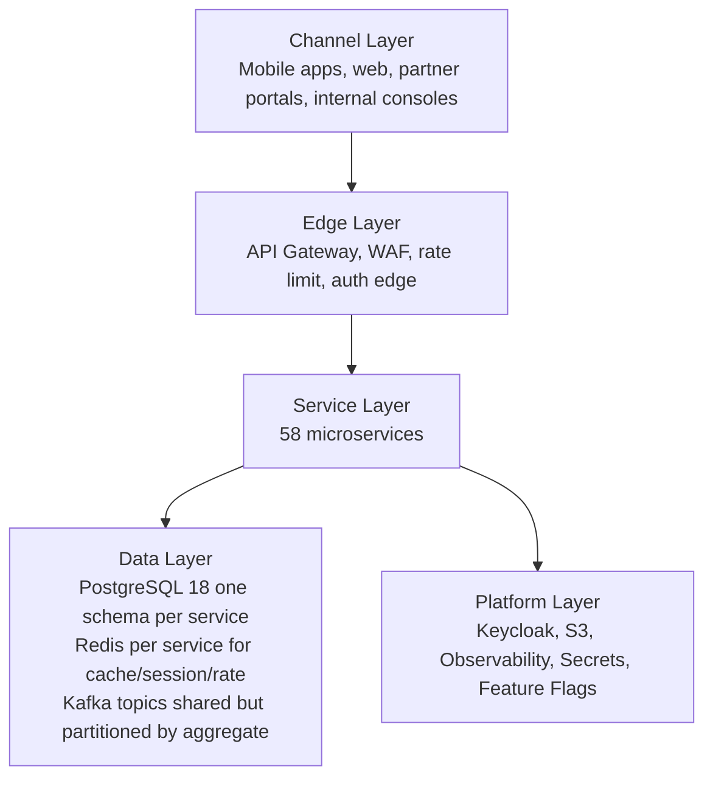

# Architecture

## Style

**Microservices** organized by **bounded context** with **database per
service**, communicating through **REST** (synchronous) and **Kafka topics**
(asynchronous). Strong internal consistency, eventual consistency across
service boundaries.

## Layered View

## Service Categorization

Services are categorized by the role they play in the architecture. This
shapes deployment topology, SLOs, and team ownership.

| Category | Purpose | Examples | SLO Hint |
|----------|---------|----------|----------|
| Edge | Cross-cutting request handling | `api-gateway` | 99.99% availability |
| Identity | Auth, token validation, identity graph | `identity-service` | 99.99% |
| Profile | Domain-specific user data | `customer-service`, `driver-service`, `courier-service` | 99.95% |
| Workflow | Multi-step business orchestration | `ride-request-service`, `food-order-service`, `checkout-service` | 99.9% |
| Transactional | Records of business fact | `trip-service`, `payment-service`, `ledger-service` | 99.95% |
| Engine | Pure computational capability | `pricing-service`, `tax-service`, `dispatch-service`, `eta-routing-service` | 99.9% |
| Event-driven sink | Reads events to maintain projections | `reporting-service`, `analytics-service`, `audit-service`, `search-service` | 99.9% |
| Real-time | High-write, time-bounded data | `driver-location-service`, `courier-tracking-service`, `trip-tracking-service` (part of trip-service) | 99.9%, P99 write < 100ms |
| External gateway | One adapter per external provider | `communication-gateway-service`, `payment-service` (provider adapter) | 99.9% |
| Cross-cutting control | Configuration, flags, ops | `configuration-service`, `feature-flag-service`, `fraud-risk-service` | 99.95% |

## Cross-Cutting Decisions

### Identity & AuthN

- **Keycloak** is the source of truth for `keycloak_user_id`, credentials,
  MFA, sessions, social login, and federation. See
  [`KEYCLOAK_ARCHITECTURE.md`](KEYCLOAK_ARCHITECTURE.md).
- Every API call carries a **JWT access token** (RS256) issued by Keycloak.
  `api-gateway` validates signature, exp, aud, iss, and the required
  scope/role.
- Service-to-service calls use **client credentials** with a dedicated
  service-account client per service in Keycloak.

### AuthZ

- **RBAC + scopes**. Coarse roles (`customer`, `driver`, `courier`,
  `restaurant_staff`, `merchant_staff`, `support_agent`, `admin`, etc.) gate
  endpoint access at the gateway.
- **Fine-grained scopes** (`trips:read:self`, `payments:write`) gate
  specific operations inside a service.
- **Resource-level checks** are enforced by each service — the gateway is
  not trusted to make ownership decisions.
- **Multi-tenancy** (where applicable — e.g. merchant operator console
  seeing only their merchant) is enforced at the service layer via a
  `tenant_id` claim in the token.

### Data Isolation

- One PostgreSQL database per service (logical schema can be shared at the
  cluster level, but the schema is owned by exactly one service).
- No cross-service FKs. Cross-service references are UUID columns
  (`customer_id`, `driver_id`, `restaurant_id`…) without a database-level
  foreign key.
- Cross-service consistency is maintained via:
  - **APIs** (request/response) for read-your-writes within a workflow.
  - **Events** for asynchronous propagation.
  - **Reconciliation jobs** for drift detection and repair.

### Communication Patterns

| Need | Pattern | When |
|------|---------|------|
| Read profile / state needed to make a decision now | Sync REST | Sub-200ms target, with circuit breaker |
| Trigger work in another service | Async event | Decoupled timing, eventual consistency acceptable |
| Multi-step cross-service workflow | Saga (orchestrated or choreographed) | When ordering, compensations matter |
| Stream of high-frequency state changes (location) | Kafka partitioned by aggregate ID | High throughput, replay possible |
| Notify user | Async event → `notification-service` | Never inline-block on SMS/email/Push |

### State Management

- **Per-aggregate state machines** live inside the service that owns the
  aggregate. See `EVENT_ARCHITECTURE.md` and per-service `WORKFLOWS.md` for
  state diagrams.
- **State transitions are validated server-side** and emit a `*.vN` event
  recording the new state.
- **Terminal states are immutable** (with narrow exceptions, e.g.
  `payment.captured` after a `refund.completed` reversal entry).

### Failure Handling

- **Timeouts** are explicit per call (default 1s for gateway → service,
  2s for service → service).
- **Retries** are bounded with exponential backoff and jitter for transient
  failures. Idempotency keys prevent double-application.
- **Circuit breakers** wrap every outbound call. Open state returns a
  fast failure and surfaces a 503.
- **Bulkheads** isolate pools per downstream service.
- **Outbox pattern** ensures a service's state change and emitted event
  land in Kafka atomically.
- **Inbox + deduplication** on consumers to tolerate at-least-once delivery.
- **Dead-letter topics** for poison events; replayed via tooling.
- See [`FAILURE_HANDLING.md`](FAILURE_HANDLING.md).

### Observability

- **Structured JSON logs** with `correlation_id`, `request_id`, `trace_id`,
  `user_id` (when authed), `service`, `version`.
- **OpenTelemetry** traces; one root span per API call; propagated through
  Kafka via message headers.
- **Metrics**: RED (rate, errors, duration) per route per service; USE
  (utilization, saturation, errors) per resource; business KPIs per service.
- **Audit logs** are a domain event, written to Kafka and persisted by
  `audit-service`.
- See [`OBSERVABILITY.md`](OBSERVABILITY.md).

### Security

- **mTLS** between services inside the cluster.
- **TLS 1.3** at the edge. HSTS.
- **PII at rest encrypted** (column-level or disk-level per classification).
  Cardholder data is **never** stored — only provider tokens.
- **Secrets** are externalized (Vault, AWS Secrets Manager, or Kubernetes
  sealed-secrets). No secrets in env files in source control.
- **Least privilege**: each service-account client has only the scopes it
  needs.
- **Rate limiting** at gateway per token, per IP, per route.
- See [`SECURITY_ARCHITECTURE.md`](SECURITY_ARCHITECTURE.md).

## Bounded Context Boundaries

The platform is decomposed into 9 strategic bounded contexts:

1. **Identity & Profile** — `identity-service`, `user-profile-service`,
   `customer-service`, `driver-service`, `courier-service`, `vehicle-service`,
   `address-service`.
2. **Platform & Operations** — `api-gateway`, `notification-service`,
   `communication-gateway-service`, `configuration-service`,
   `feature-flag-service`, `file-service`, `search-service`,
   `audit-service`, `analytics-service`, `admin-service`, `support-service`,
   `fraud-risk-service`, `reporting-service`.
3. **Geospatial & Zones** — `geolocation-service`, `zone-service`.
4. **Pricing & Rules** — `pricing-service`, `promotion-service`,
   `loyalty-service`, `tax-service`, `review-rating-service`.
5. **Ride-hailing** — `ride-request-service`, `trip-service`,
   `driver-availability-service`, `driver-location-service`,
   `dispatch-service`, `eta-routing-service`,
   `ride-payment-integration-service`, `driver-earnings-service`,
   `driver-incentive-service`, `scheduled-ride-service`,
   `ride-safety-service`, `ride-history-service`.
6. **Food Marketplace** — `merchant-service`, `restaurant-service`,
   `branch-service`, `restaurant-staff-service`, `menu-service`,
   `inventory-service`, `cart-service`, `checkout-service`,
   `food-order-service`, `restaurant-order-mgmt-service`.
7. **Food Delivery & Couriers** — `courier-dispatch-service`, `delivery-service`,
   `courier-tracking-service`, `courier-earnings-service`.
8. **Financial** — `payment-service`, `wallet-service`, `ledger-service`,
   `food-payment-integration-service`, `restaurant-settlement-service`.
9. **Cross-cutting Infrastructure** — Postgres, Redis, Kafka, Keycloak, S3,
   Observability, Secrets. Not services; platform components.

The full service-by-service mapping is in
[`MICROSERVICES_MAP.md`](MICROSERVICES_MAP.md).

## Anti-Patterns Explicitly Avoided

| Anti-pattern | Why avoided | What we do instead |
|--------------|-------------|---------------------|
| Distributed monolith | Tight coupling, can't deploy independently | Each service has its own DB, deployable in isolation |
| Nano-services | Distributed complexity without benefit | 58 services, each with a meaningful bounded context |
| Shared business database | Coupling, lock contention | DB per service; replicated read models where needed |
| Cross-service FKs | Cross-service consistency coupling | UUIDs without FKs; consistency via API/events |
| Two-phase commit between services | Coordinator-coupled, fragile | Saga + outbox + reconciliation |
| Eventual consistency for financial state | Audit/compliance risk | Outbox + synchronous ledger entry; reconciliation |
| Inline calls to SMS/email/Push providers | Tight coupling, slow APIs | `communication-gateway-service` + Kafka |
| Long synchronous chains | Tail latency, fragile | Outsource to async; bounded sync depth (≤3) |
| Hard-coded business rules | Slow iteration, env drift | `configuration-service` + `feature-flag-service` |
| Magic strings / opaque IDs | Operability, audit | UUIDv7 (preferred), typed identifiers, versioned events |
