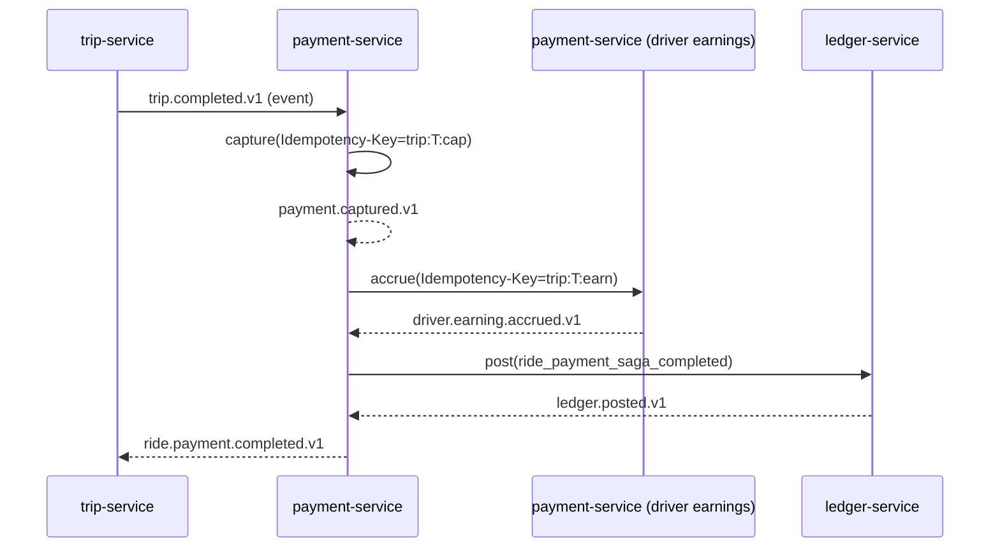
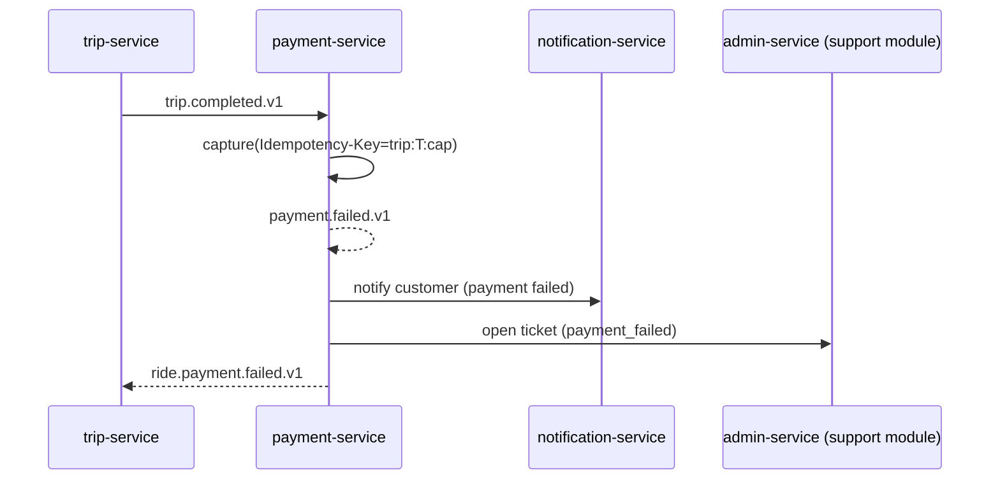
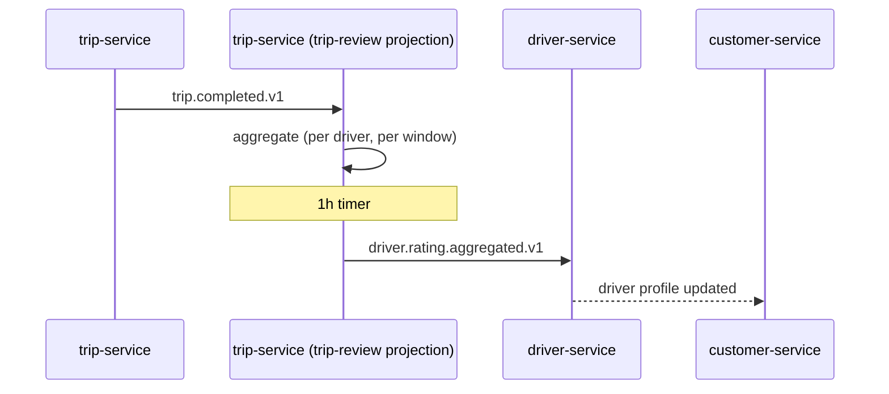
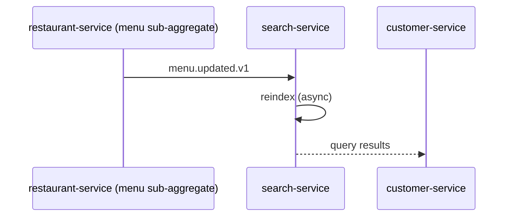
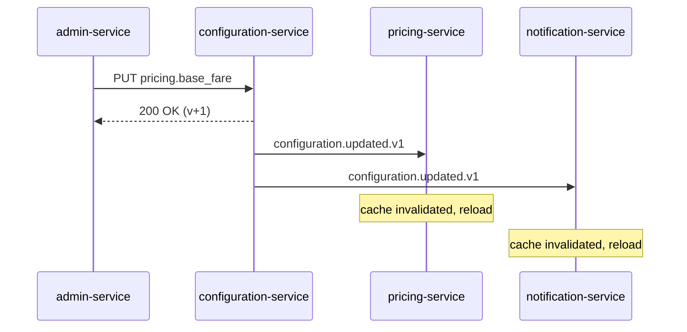

# Consistency Strategy

Distributed systems must choose where they need strong consistency and
where eventual consistency is acceptable. This document is the
platform's answer to that question, by case.

## The Rule of Thumb

- **Inside a single service**: strong consistency via PostgreSQL ACID
  transactions. Anything written in one transaction is durable and
  immediately visible to subsequent reads.
- **Across services**: eventual consistency via events, with explicit
  compensation and reconciliation.

We do NOT use two-phase commit between services. We do NOT share a
transactional database between services. We do NOT use cross-service
foreign keys.

## Where Strong Consistency Is Required

These invariants must hold across the system. They are enforced by
combinations of APIs, sagas, and the ledger.

| Invariant | Enforcement |
|-----------|-------------|
| Money is conserved (no creation, no destruction outside documented flows) | Double-entry ledger in `ledger-service`; every money-movement event is matched by a `ledger.posted.v1`; reversal of any append-only row is a new reversal row, never UPDATE/DELETE (per [[accounting-four-layer-truth-model]]) |
| A payment is captured exactly once | Idempotency key on `payment.capture`; outbox in `payment-service`; inbox + dedup in consumer |
| A wallet's balance equals the sum of its postings | Reconciliation job in `reporting-service` |
| A driver is matched to one ride at a time | Driver state machine (`busy` / `available`); conflict resolved at dispatch time by row-level lock or advisory lock in `driver-service` (dispatch sub-aggregate) |
| A food order has at most one courier assigned at a time | `courier-service` (dispatch sub-aggregate) row-level lock on the delivery aggregate; idempotency key on the assignment |
| A promotion is redeemed at most once per cart | Idempotency key in `pricing-service` (promotion sub-aggregate); reconciliation job in `reporting-service` |
| A customer cannot have two active sessions of the same type | Keycloak session management; gateway checks |

## Where Eventual Consistency Is Acceptable

These are eventually consistent because the cost of stronger
consistency is too high (multi-region, throughput, or coordination
overhead):

| Invariant | Lag | Why eventual is fine |
|-----------|-----|---------------------|
| Driver rating reflects all completed trips | Hours | Aggregate; small lag is fine |
| Restaurant search index reflects menu changes | Seconds to minutes | Acceptable to users |
| `reporting-service` (data lake) reflects business events | Minutes | OLAP; not on the hot path |
| Customer's trip history shows recently completed trips | Seconds to minutes | User just saw the trip complete in the app; the history view can lag |
| Loyalty points balance after a trip | Seconds | Customer sees it "soon" |
| Configuration change reaches all services | Seconds | Documented; long-poll + event |
| Notification is delivered | Seconds to minutes | Always async; outbox + retry |
| Driver location visible to dispatch | Sub-second | Geo-hashing + recent trail; consumer can be a few seconds behind |

## How We Get Eventual Consistency Safely

1. **Outbox** in the producer (atomic state change + event).
2. **Inbox + dedup** in the consumer (at-least-once is safe).
3. **Idempotency keys** on every non-idempotent operation.
4. **Reconciliation jobs** in `reporting-service` (or per-service)
   detect drift and repair.
5. **Observability** on lag (Kafka consumer lag, outbox lag,
   inbox size) — alert on anomalies.

## Case: Trip Completion + Payment + Driver Earning (Strong)

Sequence (orchestrated in-service saga inside the `payment-service`
binary per [ADR-0010](adrs/0010-saga-pattern.md); the in-service
ride-saga is NOT migrated to Conductor and remains at 99.99% SLO):

Strong guarantees:

- The capture is idempotent (same key → same result).
- The accrual is idempotent.
- The ledger posting is idempotent (account + posting-id is
  unique).
- The saga state is keyed by `trip_id`; a re-run is a no-op.

If capture fails:

Reconciliation:

- If `trip.completed.v1` was received but no `payment.captured`
  after 5 minutes, the reconciliation job in `reporting-service`
  opens a ticket and pages the on-call.

## Case: Driver Rating Reflects All Trips (Eventual)

Sequence:

The driver rating in the customer app may lag the actual trip by
up to an hour. This is fine; ratings are a moving average and
small stale data is acceptable.

## Case: Restaurant Search Index (Eventual, Bounded)

Sequence:

Acceptable lag: ≤ 30 seconds. Search-service reindexes within
seconds; in rare backpressure cases, the lag is bounded by a
monitor and alerted.

## Case: Configuration Rollout (Eventual, Bounded)

Sequence:

Acceptable lag: ≤ 5 seconds. Long-poll + event keeps the lag
bounded; consumer-side versioning guarantees a service never applies
a half-loaded config.

## The "No Foreign Keys Across Services" Rule

Cross-service references are stored as UUID columns **without**
database-level foreign keys. This is the single most important rule
for keeping services deployable independently.

Why:

- A drop or rename of a column in service A would otherwise require
  a coordinated change in service B's database — defeating
  independent deploys.
- A backfill in service A would otherwise require service B's
  database to be available.
- Backup/restore of one service is impossible without coordinating
  with the other.

How we maintain referential integrity instead:

- **At write time**: the consumer of the reference validates it via
  API before persisting.
- **At event time**: the producer of the reference emits events
  (`*.suspended.v1`, `*.deleted.v1`) so consumers can react.
- **At reconciliation time**: a job in `reporting-service` detects
  dangling references and opens tickets for repair.

## Workflow process id as saga root

The polymorphic `workflow_process_id` column on every `requests` row is the canonical root for cross-service saga correlation. Sagas that span multiple services (e.g. a ride that crosses payment + ledger + notification) identify their work by the `workflow_process_id`; compensation handlers look up the workflow state and roll back the relevant step.

Specifically: when `trip-service` creates a `trip.requests` row, it stamps `workflow_process_id = 'wf.process.trip.<request_id>.v1'` and starts a Conductor workflow instance with the same ID. Every downstream event emitted by trip-service carries `workflow_process_id` in its payload headers. Consumers (`payment-service`, `ledger-service`, `notification-service`) subscribe to the request topic and process events in `workflow_process_id` order (partitioned by `request_id` for ordering, but logged by `workflow_process_id` for tracing).

Compensation: if any step in the workflow fails, the orchestrator emits `request.failed.v1` with `workflow_process_id`. Downstream services that have already begun work compensate by reversing their local transactions, keyed by `request_id` (the idempotency-key prefix `request:{request_id}:...` ensures they don't double-reverse).

## Anti-Patterns Explicitly Avoided

- Strong-consistency expectations across service boundaries.
- Foreign keys between schemas.
- "Synchronous" event handling that pretends to be eventual.
- Reconciliation jobs that mutate state silently — every fix is audited and notified.
- A single shared "transactional" table that all services write to.
- "Just retry forever" — bounded retries with circuit breakers.
