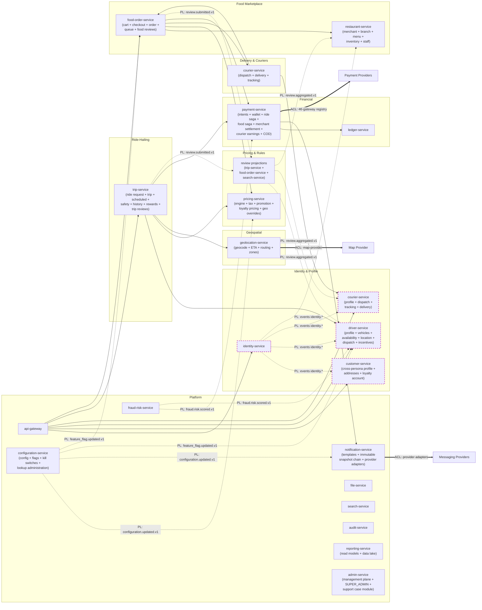

# Context Map

A context map describes the **relationships between bounded contexts**
using the standard DDD patterns: customer/supplier, conformist,
anti-corruption layer (ACL), shared kernel, open-host/PL,
partnership, and so on. It captures **how** contexts interact, not
just whether they do. References to absorbed capabilities
(`user-profile-service`, `address-service`, `driver-availability`,
etc.) are written as inline capability labels under the surviving
service per [[trips-enjoy-service-consolidation-payment-centralization]].

## Relationship Patterns in Use

| Pattern | Meaning | Where used in this platform |
|---------|---------|----------------------------|
| **Customer / Supplier** | Upstream (supplier) provides a service; downstream (customer) depends on it. The supplier's team commits to stability. | All inter-service APIs |
| **Conformist** | Downstream accepts the upstream's model as-is, without translation. | Internal microservices consuming events |
| **Anti-Corruption Layer (ACL)** | Downstream translates the upstream's model into its own model. | Adapter services wrapping external providers (`payment-service` 46-gateway registry; `notification-service` preserved provider adapters; `geolocation-service` map-provider adapter) |
| **Open-Host / Published Language (PL)** | Upstream publishes a stable, documented protocol. | REST APIs, event schema catalog |
| **Partnership** | Two contexts succeed or fail together; teams co-evolve. | `trip-service` ↔ `driver-service` (dispatch); `food-order-service`  `courier-service` (dispatch) |
| **Shared Kernel** | Two contexts share a subset of the model deliberately. | The event envelope (`event_id`, `occurred_at`, `correlation_id`, `causation_id`, `version`, `tenant_id`) — shared by all publishers and consumers, versioned as one schema |
| **Separate Ways** | Two contexts are intentionally not integrated. | Reporting-side caches for OLAP vs OLTP |

## Context Map Diagram

Legend: solid arrows are synchronous calls; dashed arrows are async
event subscriptions; double-line arrows are anti-corruption layers to
external systems. Purple dashed classes are the shared-kernel
"event envelope" set followed by all publishers.

## Upstream / Downstream Stability Contracts

For each customer/supplier relationship, the supplier commits to:

1. **No breaking changes within a major version.** New fields may be
   added to a response; existing fields are not removed or repurposed.
2. **Versioning.** Breaking changes are released as `/v2` URI and
   `event.v2` in parallel; old version supported for ≥ 6 months with
   deprecation headers.
3. **SLO.** Each service declares an availability SLO in its
   `SRS.md`. Critical supplier services commit to 99.95%+.
4. **Runbook.** Every service publishes a runbook in its
   `INTEGRATION.md` with the failure modes and the consumer's
   expected response.
5. **Status page.** Each service reports its health to a central
   status service consumed by `api-gateway` and `admin-service`.

## Anti-Corruption Layers (Where and Why)

| ACL Service | Wraps | What it translates | Why it exists |
|-------------|-------|--------------------|---------------|
| `identity-service` | Keycloak | Keycloak's `UserRepresentation`, group/role model, token introspection | Keycloak's schema is implementation-specific; domain services want a stable, simplified `Identity` aggregate |
| `payment-service` | Payment providers (46 gateways in registry) | Provider-specific authorize/capture/refund/webhook schemas | Provider schema may change; hidden behind `PaymentIntent` aggregate and versioned events |
| `notification-service` | SMS / Email / Push providers (provider adapters preserved from absorbed `comms-gateway-service`) | Each provider's send-status, delivery-status, opt-out semantics | Providers have inconsistent semantics (e.g. push delivery receipts); immutable template snapshot chain binds every publication |
| `geolocation-service` | Map provider | Geocode / ETA / route response | Provider schemas vary; normalized to a stable Geocode/ETA/Route aggregate (zones absorbed) |
| `configuration-service` | (internal flag engine) | Flag resolution rules, segment matching, rollout % | Hides rule-engine complexity from consumers |

## Partnership Relationships

These pairs are tightly coupled and SHOULD be co-owned by the same
team or have explicit joint on-call:

- `trip-service`  `driver-service` — the booking flow cannot
  succeed without a successful match.
- `food-order-service` ↔ `courier-service` — pickup cannot happen
  without a courier.
- `food-order-service` ↔ `restaurant-service` — the order cannot be
  fulfilled without restaurant acceptance (via `food-order-service`
  queue).
- `trip-service` ↔ `payment-service` (ride saga) — trip cannot be
  financially closed without payment capture.
- `food-order-service`  `payment-service` (food saga) — order
  cannot be financially closed without payment.

For each partnership, the teams share:

- A common on-call rotation.
- Joint design reviews for changes on either side.
- A shared "flow health" dashboard in `reporting-service`.

## Published Languages (Stable Schemas)

| Published language | Owner | Format | Versioning rule |
|--------------------|-------|--------|------------------|
| Event envelope | Platform | JSON | Major bump on envelope change; minor bump on optional field addition |
| Error envelope | Platform | JSON (`application/problem+json` RFC 7807 + `downstream` block) | Same as event envelope |
| Audit event | Platform | JSON | Major bump on breaking change to required fields |
| Address (geocoded) | `customer-service` (addresses) | JSON | Bump `v2` on field rename/removal |
| Money | `pricing-service` (shared shape in `shared/CONVENTIONS.md` 5) | JSON `{ amount_minor: int, currency: ISO4217 }` | Stable; new currencies are additive |
| PriceQuote | `pricing-service` | JSON | Additive only within a major; `v2` for model change |
| PaymentIntent | `payment-service` | JSON | Additive only within a major |
| Trip / FoodOrder aggregates | Respective services | JSON | Additive only within a major |

## Where Coupling Is Deliberately Avoided

- `driver-service` does **not** call `trip-service`. It learns trip
  events via Kafka and never reaches into trip state.
- `restaurant-service` does **not** call `pricing-service` for menu
  prices. Menu updates arrive as `menu.updated.v1` events and
  `pricing-service` re-quotes from cached snapshots.
- `payment-service` does **not** know about `trip-service` or
  `food-order-service`. It accepts a generic `PaymentIntent` with
  references and emits generic money events.
- `reporting-service` does **not** mutate any other service. It is a
  read-side projection.

## Where Coupling Is Unavoidable (and How We Manage It)

- The **event envelope** is a shared kernel. Versioned in
  [`EVENT_ARCHITECTURE.md`](EVENT_ARCHITECTURE.md).
- The **`Money` shape** is a shared kernel. Defined in
  [`shared/CONVENTIONS.md` 5](../shared/CONVENTIONS.md) and reused by
  all financial services.
- The **`Address` shape** is a shared kernel. Defined in
  `customer-service/README.md` and reused as `pickup_address` /
  `dropoff_address` / `delivery_address` in ride and food flows.
- The **`Identity` shape** is a shared kernel. Defined in
  `identity-service/README.md` and reused as `customer_id`,
  `driver_id`, `courier_id`, `merchant_id` across services.
- The **Conductor workflow JSON** is a shared kernel between
  participating services (ADR-0018). Workers in 15 services consume
  the same DSL; the canonical registry lives in
  [`shared/CONDUCTOR_WORKFLOWS.md`](../shared/CONDUCTOR_WORKFLOWS.md).
