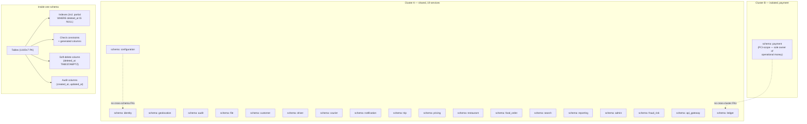

# Database Architecture

> **Updated 2026-08-07** — aligned to the locked 58 → 20 consolidation per
> [ADR-0017](adrs/0017-20-service-architecture.md). All schema names below are
> the **20 surviving services**; the obsolete 58-service schemas
> (`ride_request`, `wallet`, `analytics`, `comms_gateway`, `feature_flag`,
> `support`, `loyalty`, `driver_location`, `courier_tracking`, `delivery`,
> `ride_history`, etc.) are documented in [MIGRATION_HUB.md](../MIGRATION_HUB.md)
> and never appear as live schemas after the cutover. The 38 obsolete suites
> have been deleted from `services/`; their tables now live inside the survivor
> schemas under their own prefix (e.g. `wallet_ledger_entries` →
> `payment.wallet_ledger_entries`).



## Database Per Service

> **Locked 20-service ownership** (per [ADR-0017](adrs/0017-20-service-architecture.md)).
> Each of the 20 surviving services owns exactly one PostgreSQL schema.
> The three locked survivors — `identity-service`, `file-service`,
> `audit-service` — and `payment-service` (sole owner of operational money)
> and `ledger-service` (sole double-entry authority) are the platform
> schema backbones; see [DATA_OWNERSHIP.md](DATA_OWNERSHIP.md) for the
> per-aggregate matrix.

- One PostgreSQL 19 instance per service. A **shared cluster** may host
  many service schemas, but **physical isolation** is reserved for:
  - `payment-service` (PCI scope, sole owner of all operational money
    per [ADR-0017](adrs/0017-20-service-architecture.md))
  - `ledger-service` (sole double-entry journal authority)
  - `audit-service` (7-year retention; regulatory scope)
  - `identity-service` (Keycloak bridge; PII scope)
  - Any Tier-0 service whose measured load demands dedicated
    CPU/memory/IOPS
- Each service has exactly one **owner schema**; it MAY have
  additional **read schemas** owned by the same service for
  materialized views.
- No service may `SELECT` from another service's tables. Cross-service
  data is accessed via the owning service's API or event stream.
- Migration tooling is per-service: each service owns its migration
  set; cross-service migrations are forbidden.
- **Worker partitioning**: a single survivor service may ship
  independently scalable Kubernetes workers (`driver-service` →
  `driver-location-worker`, `driver-dispatch-worker`, etc.). Each
  worker writes to the survivor's owner schema under a stable
  table prefix (e.g. `driver.driver_location_points`,
  `driver.driver_match_attempts`). The schema is one; the workers
  are many.

### Why PostgreSQL 19

- Mature, ACID, JSONB, generated columns.
- PostGIS extension is the platform's geospatial engine.
- Strong logical replication for read replicas and reporting.
- Logical decoding for outbox patterns (Debezium).
- Declarative partitioning for high-volume tables (canonical
  template below).
- Strong tooling ecosystem (pg_dump, pgBackRest, pgaudit).

See ADR-0002.

## Naming Conventions

- **Schemas**: `<service_name_snake>` — exactly one per active
  service. The 20 canonical schemas are:
  - `configuration`, `identity`, `api_gateway`, `file`, `audit`,
    `notification`, `ledger`, `geolocation`, `customer`, `driver`,
    `courier`, `fraud_risk`, `pricing`, `payment`, `restaurant`,
    `trip`, `food_order`, `search`, `reporting`, `admin`.
  - Note: `payment` is **the only** schema that owns operational
    money (wallets, gateway transactions, earnings, COD,
    settlements). `ledger` is the **only** schema that owns
    double-entry postings.
- **Tables**: `snake_case`, plural for collections
  (`trips`, `payments`, `customers`). A survivor service MAY prefix
  tables by absorbed-worker role (e.g. `payment.wallet_balances`,
  `payment.driver_earnings`, `payment.courier_earnings`,
  `payment.merchant_payouts`) for clarity in observability and
  capacity planning.
- **Columns**: `snake_case`.
- **Primary keys**: `id UUID PRIMARY KEY` (UUIDv7 default for new
  tables per [ADR-0015](adrs/0015-uuidv7-for-ids.md); UUIDv4
  acceptable for existing tables). The column is always
  `id`, never `<table>_id`. Other tables referencing it use
  `<table>_id`.
- **Foreign keys (within a service)**: `<referenced_table>_id`
  (e.g. `trip_id`, `customer_id`). Always `REFERENCES` within the
  same schema.
- **Cross-service references**: `<entity>_id UUID NOT NULL` with **no
  database-level FK**. Enforced at the application layer and via the
  inbox / outbox / reconciliation jobs in
  [architecture/FAILURE_HANDLING.md](FAILURE_HANDLING.md).
- **Audit columns**: every mutable table has
  `created_at TIMESTAMPTZ NOT NULL DEFAULT now()`,
  `updated_at TIMESTAMPTZ NOT NULL DEFAULT now()`,
  `created_by UUID`,
  `updated_by UUID`.
- **Soft delete**: `deleted_at TIMESTAMPTZ NULL`. Default queries
  filter `WHERE deleted_at IS NULL`.
- **Money**: `amount_minor BIGINT NOT NULL`, `currency CHAR(3) NOT NULL`
  (ISO 4217). Never `NUMERIC`/`DECIMAL` for new tables — `BIGINT`
  minor units are the canonical money type and are aligned with the
  ledger.
- **Timestamps**: `TIMESTAMPTZ` only; never `TIMESTAMP`.

## Migrations

- Migration tool per service. Recommended: `golang-migrate` /
  `Flyway` / `dbmate` / `prisma migrate` — pick what fits the stack,
  but the migration history MUST be:
  - Versioned.
  - Idempotent (or strictly forward-only).
  - Stored in source control alongside the service code.
  - Reviewed in PRs.
- **No destructive migrations** without a multi-step plan:
  1. Add the new column or table.
  2. Backfill.
  3. Switch reads to the new shape.
  4. Switch writes.
  5. Drop the old column/table.
- **Long-running data migrations** are deployed as background jobs,
  not migrations.

## Indexing

- Every primary key is indexed (default).
- Every foreign key is indexed.
- Every column used in a `WHERE` clause of a hot query is indexed.
- Composite indexes for multi-column filters; column order matters.
- Partial indexes for soft-deleted tables:
  `CREATE INDEX … ON trips(customer_id) WHERE deleted_at IS NULL`.
- For text search, prefer GIN with `pg_trgm` or `tsvector` for small
  data; offload to `search-service` for large data.

## Constraints

- **NOT NULL** on every required column.
- **CHECK constraints** for enum-like values (`status IN (…)`).
- **Unique constraints** for natural keys (e.g. `email`).
- **Foreign keys** within the service.
- **No FKs** across service schemas.
- **No FKs** from a column whose owning service is different.

## Table Partitioning — Canonical Template

> **Single source of truth** for partitioning decisions across the
> platform. Every per-service `ERD.md` `## 9. Partitioning` section,
> `TECH.md` `## 3. Data layer` cadence annotation, and `WORKFLOWS.md`
> partition-maintenance section MUST be consistent with this template.

### 1. When to partition

Partition a table when **all** of the following are true:

- **Append-mostly** — rows are inserted by event/time and never
  updated in place (or only within a short window before being
  frozen). Examples: event/audit logs, location trails, state
  histories, saga steps, financial postings, evaluation logs.
- **Time-filtered hot queries** — the dominant access pattern is
  `WHERE <ts> BETWEEN … AND …`.
- **Finite retention** — there is a known retention window after
  which the data has no value (regulatory window, aggregation
  window, trail window).
- **Drop beats delete** — dropping an entire partition is faster,
  cheaper, and produces less WAL than row-level DELETE.

Do **not** partition when:

- The table is a CRUD aggregate root (`customers`, `drivers`,
  `merchants`, `vehicles`, `addresses`, `menus`, …) — access is
  key-based and updates are common.
- Total volume is bounded by business cardinality (≤ low millions
  per service) and access is identity-based, not time-windowed.
- The table is purged continuously by a poller (e.g. `outbox`,
  `inbox`) and stays small under healthy operation.

### 2. Approved strategies

| Strategy | When | Default cadence |
|----------|------|-----------------|
| `RANGE` by UTC time | The default and only platform strategy for partitioned tables | day / week / month / year (see 3) |
| `LIST` | Only as a sub-strategy when retention/lifecycle truly differs by a low-cardinality class (e.g. `retention_class`); requires an ADR | n/a |
| `HASH` | Not approved as a default. HASH is a distribution tool, not a retention mechanism; requires an ADR with measured rationale | n/a |

**Composite key requirement**: every unique constraint or primary
key on a partitioned parent MUST include the partition-key column.
PostgreSQL enforces this; a single-column PK on a partitioned
parent will fail at table-creation time.

### 3. Cadence decision table

| Cadence | Use for | Pre-create horizon | Retention window |
|---------|---------|--------------------|------------------|
| **Daily** | Hot location/trail tables (`driver.driver_location_points`, `courier.courier_location_points`, `trip.trip_location_points`), short-retention evaluation/provider-health logs (`configuration.evaluation_log`, `notification.provider_health`) | 30 days | 2 hours — 30 days (per service) |
| **Weekly** | High-velocity state histories (`food_order.order_state_history` and `courier.delivery_state_history` at > 1k rows/s) | 8 weeks | 3 years |
| **Monthly** | Event/audit/financial logs (`audit.audit_events`, `audit.read_log`, `ledger.journal_entries`, `ledger.postings`, `payment.payment_attempts`, `payment.wallet_transactions`, `notification.deliveries`, `fraud_risk.scores`, `fraud_risk.actions`, `reporting.export_jobs`, `reporting.drift_findings`, `admin.support_actions`, per-service `audit_log`) | 12 months | 1 — 10 years (per data class) |
| **Yearly** | Long-lived read models (`trip.trip_history_entries` at > 1M rows/year) | 2 years | 7 years |

The "next 30 days" wording is **only** correct for daily cadence.
For monthly/yearly, the horizon is "N complete future periods"
(e.g. "next 12 months") so the next calendar boundary is always
covered.

### 4. Parent DDL template

```sql
CREATE SCHEMA IF NOT EXISTS <schema_name>;

CREATE TABLE <schema_name>.<table_name> (
    id              UUID        NOT NULL,
    -- … domain columns …
    created_at      TIMESTAMPTZ NOT NULL DEFAULT now(),
    PRIMARY KEY (id, created_at)            -- partition key MUST be in PK
) PARTITION BY RANGE (created_at);

-- Indexes are created on the parent; PostgreSQL propagates to children.
CREATE INDEX idx_<table>_<col>
    ON <schema_name>.<table_name> (<col>, created_at DESC);
```

Rules:

- The partition column MUST be `TIMESTAMPTZ` (UTC). Never
  `TIMESTAMP` (without time zone), never `DATE` for sub-day
  cadence.
- The partition column MUST be `NOT NULL`.
- For append-only tables, revoke `UPDATE` and `DELETE` from the
  application role (`REVOKE UPDATE, DELETE ON … FROM <app_role>`).
- Do not create a default partition unless the service explicitly
  documents a drain procedure; a default partition that silently
  accumulates data violates the retention contract.

### 5. Child DDL template (idempotent)

```sql
-- Idempotent: re-running the migration / maintenance job is safe.
CREATE TABLE IF NOT EXISTS <schema_name>.<table>_2026_07
    PARTITION OF <schema_name>.<table>
    FOR VALUES FROM ('2026-07-01 00:00:00+00') TO ('2026-08-01 00:00:00+00');

-- Verify the child is actually attached to the correct parent with
-- the expected bounds. IF NOT EXISTS only guards the name; it does
-- not verify bounds.
DO $$
DECLARE
    v_parent   REGCLASS := '<schema_name>.<table>'::REGCLASS;
    v_child    REGCLASS := '<schema_name>.<table>_2026_07'::REGCLASS;
    v_expected TSTZRANGE := tstzrange('2026-07-01 00:00:00+00',
                                      '2026-08-01 00:00:00+00',
                                      '[)');
BEGIN
    IF (SELECT inhparent FROM pg_inherits WHERE inhrelid = v_child)
       IS DISTINCT FROM v_parent THEN
        RAISE EXCEPTION 'partition % is not attached to %',
            v_child::text, v_parent::text;
    END IF;
    IF NOT (SELECT relpartbound FROM pg_class WHERE oid = v_child)
              = v_expected THEN
        RAISE EXCEPTION 'partition % has unexpected bounds', v_child::text;
    END IF;
END $$;
```

### 6. Naming convention

| Cadence | Child name pattern | Example |
|---------|--------------------|---------|
| Daily | `<table>_YYYY_MM_DD` | `locations_2026_07_29` |
| Weekly | `<table>_YYYY_wNN` | `delivery_state_history_2026_w30` |
| Monthly | `<table>_YYYY_MM` | `audit_events_2026_07` |
| Yearly | `<table>_YYYY` | `trip_history_entries_2026` |

The name is informational only; the **bounds** in `FOR VALUES FROM (…) TO (…)`
are the source of truth. Always emit the verification step after
`CREATE TABLE IF NOT EXISTS`.

### 7. Maintenance-job contract

Every service that owns a partitioned table runs a **service-owned
scheduled job** with these properties:

- **Schedule**: daily at `02:00 UTC` (before peak ingest).
- **Advisory lock**: `pg_try_advisory_xact_lock(<schema_hash>, <table_hash>)`
  to ensure only one instance runs at a time across the replica set.
- **Pre-create loop**: for each missing period in the next N
  complete future periods, run the idempotent child DDL from 5.
- **Verify loop**: after pre-create, assert `now()` falls in an
  existing partition. If not, page on-call.
- **Drop loop**: for each period older than the retention window
  AND with homogeneous retention class AND no legal hold, archive
  the data (e.g. to S3 per 12), then `DETACH PARTITION … CONCURRENTLY`
  followed by `DROP TABLE …`.
- **Retry**: DDL retries with exponential backoff (3 attempts, 1 s /
  4 s / 16 s). Persistent failure pages on-call.
- **Metrics**: `partition_maintenance_runs_total`,
  `partition_maintenance_failures_total`,
  `partition_maintenance_lag_seconds`,
  `partition_count{result="future"}`, `partition_count{result="past"}`.
- **Alert**: critical if today's partition is missing; warning if
  the future-partition count drops below the configured horizon;
  warning if the expired-partition count exceeds the configured
  backlog.
- **Optional event**: emit `audit.partition.maintained.v1` with
  `{schema, table, created, dropped, ts}` for cross-service auditing.

### 8. Retention enforcement and mixed retention

A child partition is droppable only when **all** rows in it have
the same retention class AND none are on legal hold.

- For tables with a single retention class
  (`payment.payment_attempts`, `payment.wallet_transactions`,
  `ledger.journal_entries`, `ledger.postings`): the entire partition
  is droppable when its upper bound is older than the retention
  window.
- For tables with mixed retention classes
  (`audit.audit_events` has `retention_class IN ('financial', 'default')`):
  partitions must NOT mix retention classes across rows. Services
  with mixed retention MUST subpartition by retention class
  (`PARTITION BY LIST (retention_class)` with sub-partitions of
  `PARTITION BY RANGE (created_at)`), OR move rows with the
  shorter retention class into a separate parent
  (`audit.audit_events_default`), OR drop only the rows whose retention
  has expired before dropping the partition.
- For tables with litigation/legal hold: held rows must be moved
  to a separate hold store before any drop; the maintenance job
  checks the `litigation_hold` flag (or equivalent) before issuing
  a drop.

### 9. Outbox policy

- The default is **unpartitioned**. Outbox tables are short-lived:
  rows are purged 24 h after `published_at` by a poller.
- Partition the outbox only when the measured backlog exceeds a
  documented threshold (e.g. > 10 M unpublished rows during a
  Kafka outage). Doing so requires an ADR and the canonical
  template above.
- Retention rows that say "outbox purged by partition drop" while
  the DDL is unpartitioned are incorrect; either remove the
  "partition drop" wording or add the partitioning.

### 10. Reconciliation with per-service docs

The following platform-wide retention statements are the canonical
values; any per-service doc that disagrees MUST reconcile to these:

| Data class | Canonical retention | How enforced |
|------------|---------------------|--------------|
| Driver location trail (`driver.driver_location_points`) | 48 h | partition drop (daily partitions) |
| Courier location trail (`courier.courier_location_points`) | 30 d | partition drop (daily partitions) |
| Audit events (financial, `audit.audit_events`) | 7 y | partition drop (monthly partitions, after legal-hold check) |
| Audit events (default, `audit.audit_events`) | 1 y | partition drop (monthly partitions) |
| Ledger postings (`ledger.journal_entries`, `ledger.postings`) | 10 y | partition drop (monthly partitions, legal-hold aware) |
| Payment attempts (`payment.payment_attempts`) | 7 y | partition drop (monthly partitions) |
| Wallet transactions (`payment.wallet_transactions`) | 7 y | partition drop (monthly partitions) |
| Notification deliveries (`notification.deliveries`) | 1 y | partition drop (monthly partitions; body nulled at 90 d) |

### 11. Testing

Service tests must cover:

- INSERT into a partitioned parent lands in the correct child.
- A timestamp on a partition boundary (`2026-07-31 23:59:59.999+00`
  vs `2026-08-01 00:00:00+00`) routes to the expected child.
- The maintenance job is safe to run twice in the same window
  (`CREATE TABLE IF NOT EXISTS` is a no-op the second time).
- The maintenance job's drop loop respects legal hold.
- Future-partition count recovers after the job runs.
- `EXPLAIN` shows partition pruning for the hot queries.

## JSONB

- Use for **truly schemaless** fields: provider response payloads,
  feature flag evaluation context, configuration payloads.
- **Do NOT** use for fields that are queried in WHERE clauses often
  (use proper columns + indexes).
- For required fields, prefer columns over JSONB.

## Data Retention

| Data class | Retention | Deletion |
|------------|-----------|----------|
| `trip.trips`, `food_order.food_orders` | 7 years (financial) | Soft delete, then hard delete |
| `payment.payments` | 7 years (financial) | Soft delete, then hard delete |
| `ledger.journal_entries`, `ledger.postings` | 10 years | Append-only; never deleted |
| `driver.driver_location_points`, `courier.courier_location_points` | 30 days hot, then aggregated to hourly cells for 1 year | Partition drop |
| `audit.audit_events` | 7 years (financial) / 1 year (default) | Partition drop |
| `notification.deliveries` | 1 year (body nulled at 90 d) | Partition drop |
| `identity.refresh_tokens` | Until expiry + 7 days | Hard delete |
| `driver.kyc_documents`, `courier.kyc_documents`, `restaurant.kyc_documents` | Until account closure + 5 years | Hard delete with audit |
| `audit.failed_login_attempts` | 90 days | Hard delete |
| `food_order.abandoned_carts` | 30 days | Hard delete |

## Soft Delete

- Used for entities with audit/regulatory needs: Customer, Driver,
  Courier, Merchant, Restaurant, Vehicle, Trip, FoodOrder, Payment.
- `deleted_at TIMESTAMPTZ NULL`.
- All read queries include `WHERE deleted_at IS NULL` (enforced by
  repository pattern, not by view).
- Hard delete is a separate, batched, audited operation; used only
  after retention.

## Geospatial (PostGIS)

- Used in:
  - `geolocation` schema — geocoding cache, geofence joins,
    ETA/routing cache, zone polygons (zones worker inside the
    surviving `geolocation-service`).
  - `driver` schema — driver location points and nearest-driver
    queries (with `ST_DWithin` over a recent trail) — managed by the
    `driver-location-worker` inside `driver-service`.
  - `courier` schema — courier location points and nearest-courier
    queries — managed by the `courier-location-worker` inside
    `courier-service`.
  - `customer` schema — normalized point storage for customer
    addresses (the customer-addresses capability inside the surviving
    `customer-service`).
  - `restaurant` schema — restaurant/branch geocodes (the
    restaurant-merchant capability inside `restaurant-service`).
- Schema: `geometry(Point, 4326)` for points,
  `geometry(Polygon, 4326)` for zones.
- Index: `GIST` on geometry columns.
- Distance queries: `ST_DWithin(geog, geog, distance_meters)`.
- Avoid `ST_Distance` for filtering (no index use); use `ST_DWithin`.

## High-Frequency Writes — Driver and Courier Location

- The default schema is wrong for location: a write per second per
  driver × 10k drivers is 10k writes/s. We use a dedicated table layout
  inside the surviving `driver` and `courier` schemas:
  - `driver.driver_location_points` and
    `courier.courier_location_points` are range-partitioned by day
    (see canonical template 1-7).
  - A separate `driver.driver_current_location` and
    `courier.courier_current_location` table holds the last known
    position per driver/courier (UPSERT by `id`, single row per
    actor).
  - The "stream" view joins the two for "where is X right now + last
    5 minutes."
  - Writes are also forwarded to Kafka
    (`driver.location.updated.v1`, `courier.location.updated.v1`)
    for consumers; the database is the source of truth, Kafka is the
    propagation.
  - The producer is the `driver-location-worker` / `courier-location-worker`
    HPA-scaled inside `driver-service` / `courier-service` per
    [ADR-0017](adrs/0017-20-service-architecture.md) "Internal scaling model".

## Read Replicas

- Each Tier-1 service MAY have ≥ 1 read replica in the same region
  for read-heavy queries (e.g. the `trip-history-worker` inside the
  surviving `trip-service`, the `reporting` read models, and
  `search-service` projections).
- Replicas are managed by the platform's DBA; failover is automated.
- The application MUST tolerate read-replica lag (typically < 1s); the
  service code may pin a read to the primary when strong consistency
  is required.

## Backup and Recovery

- Continuous WAL archiving.
- Nightly full snapshot (pgBackRest).
- 7-day PITR for all services.
- 30-day PITR for Tier-1 services.
- Quarterly restore drill in staging.

## Connection Management

- Per-service connection pool sized to the service's concurrency.
- PgBouncer in front of PostgreSQL for connection multiplexing.
- Statement timeout: 30s default; tighter per service where needed.
- Idle-in-transaction timeout: 60s.

## Observability

- `pg_stat_statements` enabled; top-20 slowest queries reviewed weekly.
- Slow query log threshold: 200ms.
- Per-service metric: `db.query.duration`, `db.connections.in_use`,
  `db.transactions.open`.
- Locks and lock waits surfaced via `pg_locks`.

## Anti-Patterns Explicitly Avoided

- `SELECT *` in production code.
- N+1 queries (use eager loading or batched IN queries).
- Cross-service joins (use API composition or denormalized read
  models).
- Long-running transactions (> 5s); split into smaller units.
- Using the DB for messaging — that's what outbox + Kafka are for.
- Storing application-level "is_deleted" booleans instead of
  `deleted_at` timestamps.
- UUIDv4 only because "we always did it" — use UUIDv7 for new services.

## Related architecture docs

- [`SYSTEM_OVERVIEW.md`](SYSTEM_OVERVIEW.md) — plain-English platform summary
- [`MICROSERVICES_MAP.md`](MICROSERVICES_MAP.md) — service catalog
- [`DATA_OWNERSHIP.md`](DATA_OWNERSHIP.md) — source-of-truth matrix
- [`EVENT_ARCHITECTURE.md`](EVENT_ARCHITECTURE.md) — event catalog and delivery semantics
- [`ADR_INDEX.md`](ADR_INDEX.md) — architecture decision records