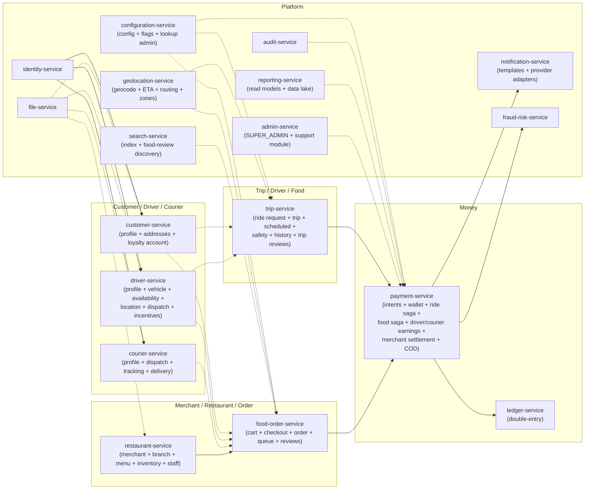

# Data Ownership

This is the **source-of-truth matrix** for the platform. It is the
authoritative answer to "who owns this entity?" If two services
both write a column, this matrix is wrong — file an issue. The
matrix lists the **20 active services** per
[ADR-0017](adrs/0017-20-service-architecture.md); absorbed
capabilities live as sub-aggregates inside the surviving service's
binary per
[[trips-enjoy-service-consolidation-payment-centralization]].

## The Rule

> **Exactly one service writes to each piece of data. Other
> services hold a denormalized view or a reference (ID) only.**

Cross-service references are stored as UUID columns **without**
database foreign keys. Consistency across services is achieved by:

- APIs (synchronous, request/response, with the calling service's
  responsibility to validate the reference exists and is current).
- Events (asynchronous propagation, with the consumer responsible
  for handling out-of-order and duplicate delivery).
- Reconciliation jobs (periodic, idempotent, repairing drift).

## Source-of-Truth Matrix

| Domain Entity | Owning Service | Database / Schema | Source of Truth | Referenced By | Sync Method |
|---------------|----------------|-------------------|------------------|---------------|-------------|
| Keycloak user | Keycloak (managed by `identity-service`) | Keycloak DB | Keycloak | All services with auth | Sync REST (token introspection); JWT for stateless verify |
| Identity reference (`identity_id`) | `identity-service` | `identity.identities` | `identity-service` | `customer-service`, `driver-service`, `courier-service`, `restaurant-service` | Sync REST; events `identity.*.v1` |
| Customer profile (lang, prefs, devices) + addresses + loyalty account | `customer-service` | `customer.profiles`, `customer.addresses`, `customer.loyalty_accounts` | `customer-service` | `trip-service`, `food-order-service`, `payment-service` (default method ref) | Events `customer.*.v1` + REST |
| Driver profile + KYC + vehicle + availability + location + dispatch attempts + incentives | `driver-service` | `driver.drivers`, `driver.vehicles`, `driver.availability`, `driver.locations` (partitioned by day), `driver.dispatch_attempts`, `driver.incentives` | `driver-service` | `trip-service`, `food-order-service` (driver-rating projection), `payment-service` (driver earnings) | Events `driver.*.v1` + REST |
| Courier profile + KYC + availability + location + delivery aggregate | `courier-service` | `courier.couriers`, `courier.courier_state`, `courier.locations` (partitioned by day), `courier.deliveries`, `courier.dispatch_assignments` | `courier-service` | `food-order-service` (delivery read), `payment-service` (courier earnings) | Events `courier.*.v1` + REST |
| Vehicle (plate, model, registration, insurance, inspection) | `driver-service` (vehicle sub-aggregate) | `driver.vehicles` | `driver-service` | `courier-service` (cross-persona read) | Events `vehicle.*.v1` + REST |
| Saved address (geocoded, normalized, tagged) | `customer-service` (address sub-aggregate) | `customer.addresses` | `customer-service` | `food-order-service` (cart + checkout), `trip-service` (pickup / dropoff) | REST + `address.*.v1` |
| Geocode / ETA / route | `geolocation-service` (stateless adapter) | `geolocation.cache` | `geolocation-service` | `trip-service`, `food-order-service` (cart), `courier-service` (delivery) | Sync REST (cached); events on cache invalidation |
| City / zone / surge zone | `geolocation-service` (zones sub-aggregate) | `geolocation.zones` | `geolocation-service` | `pricing-service`, `driver-service` (dispatch), `courier-service` (dispatch) | REST + `zone.*.v1` |
| Ride request | `trip-service` (ride-request sub-aggregate) | `trip.ride_requests` | `trip-service` | `driver-service` (dispatch), `payment-service` (ride saga), `customer-service` (history), `trip-service` (history) | Events `ride.request.*.v1` |
| Trip | `trip-service` | `trip.trips` | `trip-service` | `payment-service` (ride saga + driver earnings), `driver-service` (incentives), `customer-service` (history), review projections (`trip-service` + `food-order-service` + `search-service`), `trip-service` (history + safety) | Events `trip.*.v1` |
| Scheduled ride job | `trip-service` (scheduled sub-aggregate) | `trip.scheduled_rides` | `trip-service` | `trip-service` (ride-request) | Events `scheduled_ride.due.v1` |
| Trip safety state (SOS, incident) | `trip-service` (safety sub-aggregate) | `trip.ride_safety` | `trip-service` | `notification-service`, `admin-service` (support module) | REST + `ride.safety.*.v1` |
| Trip review (write side) | `trip-service` (trip-review projection) | `trip.trip_reviews` | `trip-service` | `driver-service` (rating), `courier-service` (rating), `reporting-service` | Events `review.submitted.v1` |
| Ride history (read model) | `trip-service` (history sub-aggregate) | `trip.ride_history_entries` | `trip-service` | `customer-service` app, `driver-service` app, `admin-service` | Sync REST (read-only) |
| Merchant (legal entity, tax info) | `restaurant-service` (merchant sub-aggregate) | `restaurant.merchants` | `restaurant-service` | `restaurant-service` (branch), `payment-service` (merchant settlement), `admin-service` | REST + `merchant.*.v1` |
| Restaurant | `restaurant-service` | `restaurant.restaurants` | `restaurant-service` | `food-order-service`, `search-service`, `restaurant-service` (branch + menu) | REST + `restaurant.*.v1` |
| Branch (location, hours, prep capacity) | `restaurant-service` (branch sub-aggregate) | `restaurant.branches` | `restaurant-service` | `food-order-service`, `courier-service` (dispatch), `food-order-service` (queue) | REST + `branch.*.v1` |
| Restaurant staff | `restaurant-service` (staff sub-aggregate) | `restaurant.staff` | `restaurant-service` | `food-order-service` (queue, RBAC), `admin-service` | REST + `staff.*.v1` |
| Menu (categories, products, modifiers) | `restaurant-service` (menu sub-aggregate) | `restaurant.menu_categories`, `restaurant.menu_products`, `restaurant.menu_modifiers` | `restaurant-service` | `food-order-service` (cart + checkout), `search-service`, `restaurant-service` (inventory) | REST + `menu.*.v1` |
| Inventory (stock, 86'd items) | `restaurant-service` (inventory sub-aggregate) | `restaurant.inventory_stock`, `restaurant.inventory_unavailability` | `restaurant-service` | `restaurant-service` (menu), `food-order-service` (cart) | REST + `inventory.*.v1` |
| Cart | `food-order-service` (cart sub-aggregate) | `food_order.carts` | `food-order-service` | `food-order-service` (checkout), `customer-service` (recent cart) | REST + `cart.*.v1` |
| Checkout session | `food-order-service` (checkout sub-aggregate) | `food_order.checkout_sessions` | `food-order-service` | `payment-service` (auth), `food-order-service` (order creation) | REST + `checkout.*.v1` |
| Food order | `food-order-service` | `food_order.orders` | `food-order-service` | `food-order-service` (queue), `courier-service` (dispatch + delivery), `payment-service` (food saga), `customer-service` (history), review projections | REST + `food.order.*.v1` |
| Food order queue | `food-order-service` (queue sub-aggregate) | `food_order.queue` | `food-order-service` | `food-order-service` (read), `restaurant-service` (staff UI) | REST + `food.order.*.v1` |
| Food review (write side) | `food-order-service` (food-review projection) | `food_order.food_reviews` | `food-order-service` | `restaurant-service` (rating), `courier-service` (rating), `search-service` (discovery projections), `reporting-service` | Events `review.submitted.v1` |
| Delivery | `courier-service` (delivery sub-aggregate) | `courier.deliveries` | `courier-service` | `food-order-service` (read), `payment-service` (food saga + courier earnings), `customer-service` (history) | REST + `delivery.*.v1` |
| Payment intent | `payment-service` | `payment.intents` | `payment-service` | `payment-service` (ride saga + food saga + wallet), `customer-service` (history) | REST + `payment.*.v1` |
| Wallet | `payment-service` (wallet sub-aggregate) | `payment.wallets`, `payment.holds` | `payment-service` | `customer-service`, `payment-service` (driver + courier earnings), `payment-service` (merchant settlement) | REST + `wallet.*.v1` |
| Driver earnings + withdrawal + statements | `payment-service` (driver earnings sub-aggregate) | `payment.driver_earnings` | `payment-service` | `driver-service` (incentives), `trip-service` (history), `reporting-service` | REST + `driver.earning.*.v1` |
| Courier earnings + withdrawal + statements | `payment-service` (courier earnings sub-aggregate) | `payment.courier_earnings` | `payment-service` | `reporting-service`, `courier-service` (UI) | REST + `courier.earning.*.v1` |
| Ledger posting | `ledger-service` | `ledger.accounts`, `ledger.postings` | `ledger-service` | `reporting-service`, `payment-service` (merchant settlement), `audit-service` | REST + `ledger.posted.v1` |
| Merchant settlement (payable, payouts, disputes) | `payment-service` (merchant settlement sub-aggregate) | `payment.merchant_payables`, `payment.merchant_payouts`, `payment.merchant_disputes` | `payment-service` | `restaurant-service` (merchant UI), `reporting-service` | REST + `merchant.settlement.*.v1` |
| COD reconciliation state | `payment-service` (COD sub-aggregate) | `payment.cod_state` | `payment-service` | `courier-service` (delivery confirmation), `reporting-service` | REST + `cod.*.v1` |
| Promotion | `pricing-service` (promotion sub-aggregate) | `pricing.campaigns`, `pricing.coupons`, `pricing.redemptions` | `pricing-service` | `food-order-service` (cart), `pricing-service` | REST + `promotion.*.v1` |
| Loyalty pricing rules | `pricing-service` (loyalty pricing sub-aggregate) | `pricing.loyalty_rules` | `pricing-service` | `customer-service` (loyalty account), `pricing-service` | REST + `loyalty.*.v1` |
| Loyalty account (balance, history) | `customer-service` (loyalty account sub-aggregate) | `customer.loyalty_accounts`, `customer.loyalty_history` | `customer-service` | `pricing-service` (helper), `customer-service` (UI), `reporting-service` | REST + `loyalty.*.v1` |
| Tax rule | `pricing-service` (tax sub-aggregate) | `pricing.tax_rules`, `pricing.tax_exemptions` | `pricing-service` | `pricing-service`, `restaurant-service` (menu read) | REST + `tax.*.v1` |
| Notification template | `notification-service` | `notification.templates`, `notification.template_versions` | `notification-service` | `notification-service` only (one writer; immutable version-snapshot chain per `shared/DEAL_FEATURE.md` template audit chain) | Internal + `notification.template.published.v1` |
| Notification delivery state | `notification-service` | `notification.deliveries` | `notification-service` | `admin-service` (support module, read) | REST |
| Communication provider send log | `notification-service` (preserved provider ACL) | `notification.provider_sends` | `notification-service` | `notification-service` (state), `admin-service` (support module audit) | REST + `comms.*.sent.v1` |
| Configuration document | `configuration-service` | `configuration.documents` (versioned) | `configuration-service` | Every service | REST + `configuration.updated.v1` |
| Feature flag | `configuration-service` (flags sub-aggregate) | `configuration.feature_flags` | `configuration-service` | Every service | REST + `feature_flag.updated.v1` |
| Lookup type + lookup rows | `configuration-service` (lookup administration) + per-service schema copies | `configuration.lookup_types`, `configuration.lookups`; per-service `<schema>.lookup_types`, `<schema>.lookups` | `configuration-service` (shape) + owning service (rows) | Every service consuming the namespace | REST + `platform.lookup.*.v1` per `shared/LOOKUPS.md` |
| File metadata | `file-service` | `file.files` | `file-service` | `restaurant-service`, `driver-service`, `courier-service`, `customer-service` (KYC) | REST + `file.*.v1` |
| Search index doc | `search-service` | OpenSearch index owned by `search-service` | `search-service` | `customer-service` (UI), `restaurant-service` (UI), `food-order-service` (UI) | Sync REST query |
| Support ticket | `admin-service` (support module) | `admin.support_tickets` | `admin-service` | `customer-service`, `driver-service`, `courier-service` (read), `admin-service` | REST + `support.*.v1` |
| Fraud risk score | `fraud-risk-service` | `fraud_risk.scores`, `fraud_risk.actions`, `fraud_risk.blocklists` | `fraud-risk-service` | `identity-service`, `payment-service`, `driver-service` (dispatch block) | REST + `fraud.*.v1` |
| Audit event | `audit-service` | `audit.events` (immutable, append-only) | `audit-service` (consumer; never producer of business events) | `admin-service`, `admin-service` (support module) | Consumes from Kafka |
| Report / OLAP view | `reporting-service` | `reporting.views`, `reporting.export_jobs`, `reporting.drift_findings` | `reporting-service` | `admin-service` (UI) | REST |
| Conductor workflow definition | `admin-service` (Conductor definitions repo) | `conductor.workflow_defs` (Conductor server-side) | `admin-service` | 15 participating services | REST + `conductor.workflow.*.v1` |
| SUPER_ADMIN alias grant | `admin-service` | `admin.super_admin_grant` | `admin-service` (via `identity-service` for actual Keycloak role-mappings) | `audit-service`, `notification-service` (pages security on-call) | REST + `admin.super_admin.granted.v1` |

## Disallowed Patterns

The following are explicitly disallowed by the platform's data
ownership rules:

| Disallowed | Why | What to do instead |
|------------|-----|--------------------|
| Foreign key from one service's DB to another | Coupling; deploy ordering; outbox-free drift | UUID column without FK; consistency via events |
| Reading another service's DB directly | Hidden coupling; bypasses API contract | Sync REST or curated event |
| Writing to another service's DB | Violates ownership; bypasses service logic | Producer emits an event; the owner service consumes and applies |
| Two services writing the same column | Conflicting truth; race conditions | Pick an owner; the other is a derived read model |
| Storing PAN (raw card number) | PCI scope | Only the provider's tokenized reference |
| Storing the same PII in two services | Audit/GDPR complexity | Store the canonical record in the owner; reference by ID |
| Hard deletion of business records | Audit, support, fraud investigation | Soft delete with retention; purge job after retention window |

## Cross-Service Consistency Strategy Summary

| Cross-service invariant | Strategy | Tolerable lag |
|-------------------------|----------|---------------|
| Customer exists when a ride is requested | Sync API check; reject 404 if missing | Real-time |
| Driver belongs to a city that serves the pickup zone | Sync API check at dispatch time | Real-time |
| Restaurant is online when an order is placed | Sync API check at checkout | Real-time; UI also gates |
| Trip is paid after `trip.completed` | Saga (`payment-service` ride saga, in-service) with outbox + ledger | Minutes |
| Order is paid + restaurant payable + courier earning after delivery | Saga (`payment-service` food saga, in-service) | Minutes |
| Cancellation fee charged to wallet | Saga with outbox | Seconds to minutes |
| Promotion redemption counted once | Idempotency key on `promotion.redeem.v1` consumer | Eventual; reconciliation job catches duplicates |
| Driver location visible to dispatch | Event `driver.location.updated.v1` | Seconds (acceptable for matching) |
| Driver rating updated after trip | `trip-service` (trip-review projection) emits `review.aggregated.v1` | Hours (acceptable) |
| Food rating updated after delivery | `food-order-service` (food-review projection) emits `review.aggregated.v1` | Hours (acceptable) |
| Customer's ride history reflects completed trips | Read model `trip-service` (history sub-aggregate) consumes `trip.completed.v1` and `ride.payment.completed.v1` | Minutes |
| Configuration change picked up by services | Long-poll + `configuration.updated.v1` event | Seconds |
| Phase 7 reward fan-out completes | Conductor `wf.phase7.reward_grant.v1` per `shared/CONDUCTOR_WORKFLOWS.md` 3.1 | Seconds to minutes |
| Make-a-Deal TTL-driven timers | Conductor `wf.phase75.deal_*` timers | Seconds |
| Refund compensation ordering | Conductor `wf.refund.*.v1` `compensationSteps` | Minutes |
| Driver/courier onboarding long-running approval | Conductor `wf.onboarding.{driver,courier}.v1` | Days–weeks (SLA timers) |
| SUPER_ADMIN alias grant auto-revoked at `expires_at` | `identity-service` `identity.alias_revoke_job` (hourly) per `shared/TIME_BOUNDED_ALIASES.md` | Up to 1 hour after `expires_at` |

## Reconciliation Jobs

A scheduled job in `reporting-service` runs daily to detect:

- Wallets whose balance doesn't equal sum of `ledger.postings`
  for the wallet.
- Food orders that are `delivered` without
  `food.payment.completed`.
- Ride trips that are `completed` without
  `ride.payment.completed`.
- Promotion redemptions that are counted twice.
- Stale `*.in_transit` deliveries that have not moved in N
  minutes.

Each drift finding opens a `support.ticket` (severity-tagged)
and emits a `reconciliation.drift.found.v1` event consumed by
`admin-service`.
