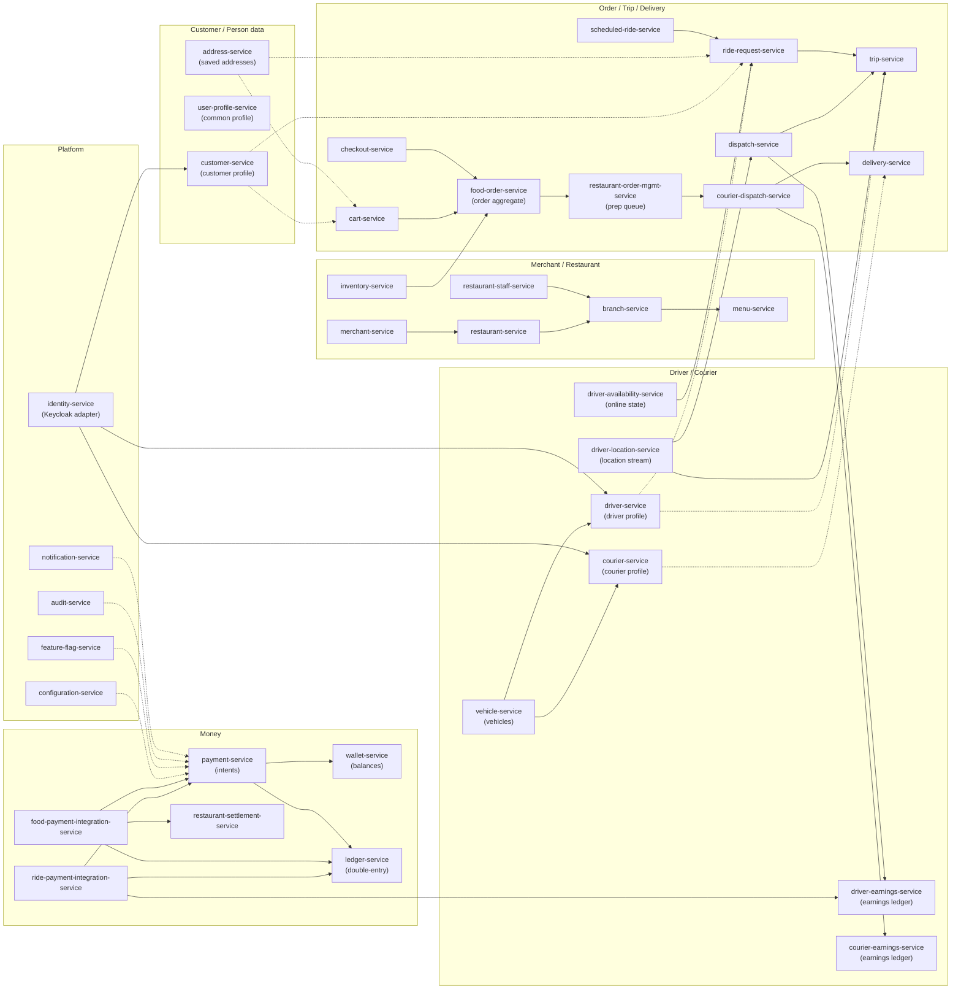

# Data Ownership

This is the **source-of-truth matrix** for the platform. It is the
authoritative answer to "who owns this entity?" If two services both
write a column, this matrix is wrong — file an issue.

## The Rule

> **Exactly one service writes to each piece of data. Other services
> hold a denormalized view or a reference (ID) only.**

Cross-service references are stored as UUID columns **without** database
foreign keys. Consistency across services is achieved by:

- APIs (synchronous, request/response, with the calling service's
  responsibility to validate the reference exists and is current).
- Events (asynchronous propagation, with the consumer responsible for
  handling out-of-order and duplicate delivery).
- Reconciliation jobs (periodic, idempotent, repairing drift).

## Source-of-Truth Matrix

| Domain Entity | Owning Service | Database / Schema | Source of Truth | Referenced By | Sync Method |
|---------------|----------------|-------------------|------------------|---------------|-------------|
| Keycloak user | Keycloak (managed by `identity-service`) | Keycloak DB | Keycloak | All services with auth | Sync REST (token introspection); JWT for stateless verify |
| Identity reference (`identity_id`) | `identity-service` | `identity.identities` | `identity-service` | `customer-service`, `driver-service`, `courier-service`, `merchant-service` | Sync REST; events `identity.*.v1` |
| User profile (lang, prefs) | `user-profile-service` | `user_profile.profiles` | `user-profile-service` | `customer-service`, `notification-service` | Events `user.profile.*.v1` |
| Customer | `customer-service` | `customer.customers` | `customer-service` | `ride-request-service`, `food-order-service`, `cart-service`, `checkout-service`, `payment-service` (default method ref) | Events `customer.*.v1` + REST |
| Driver | `driver-service` | `driver.drivers` | `driver-service` | `ride-request-service`, `trip-service`, `dispatch-service`, `driver-availability-service`, `driver-location-service`, `driver-earnings-service`, `driver-incentive-service` | Events `driver.*.v1` + REST |
| Courier | `courier-service` | `courier.couriers` | `courier-service` | `courier-dispatch-service`, `delivery-service`, `courier-earnings-service`, `courier-tracking-service` | Events `courier.*.v1` + REST |
| Vehicle | `vehicle-service` | `vehicle.vehicles` | `vehicle-service` | `driver-service`, `courier-service` | Events `vehicle.*.v1` + REST |
| Saved address | `address-service` | `address.addresses` | `address-service` | `customer-service` (default), `cart-service`, `checkout-service` | REST + `address.*.v1` |
| Geocode / ETA / route | `geolocation-service` (read) | `geolocation.cache` (cache only) | `geolocation-service` (stateless adapter) | `eta-routing-service`, `address-service`, `trip-service`, `delivery-service`, `ride-request-service` | Sync REST (cached); events on cache invalidation |
| City / zone | `zone-service` | `zone.zones` | `zone-service` | `pricing-service`, `dispatch-service`, `courier-dispatch-service`, `ride-request-service`, `cart-service` | REST + `zone.*.v1` |
| Ride request | `ride-request-service` | `ride_request.requests` | `ride-request-service` | `trip-service`, `dispatch-service`, `ride-payment-integration-service`, `ride-history-service` | Events `ride.request.*.v1` |
| Trip | `trip-service` | `trip.trips` | `trip-service` | `ride-payment-integration-service`, `driver-earnings-service`, `driver-incentive-service`, `review-rating-service`, `ride-history-service`, `ride-safety-service` | Events `trip.*.v1` |
| Driver availability | `driver-availability-service` | `driver_availability.availability` | `driver-availability-service` | `dispatch-service`, `driver-location-service` | Events `driver.availability.*.v1` |
| Driver location (current + recent trail) | `driver-location-service` | `driver_location.locations` (partitioned by day) | `driver-location-service` | `dispatch-service`, `ride-safety-service`, `eta-routing-service` (read) | Events `driver.location.*.v1` (curated stream) |
| Dispatch attempt | `dispatch-service` | `dispatch.attempts` | `dispatch-service` | `ride-request-service` (read) | Events `dispatch.*.v1` |
| ETA / route (cached) | `eta-routing-service` (cache only) | `eta_routing.cache` | `eta-routing-service` (stateless adapter) | `trip-service`, `delivery-service` | Sync REST (cached) |
| Driver earnings | `driver-earnings-service` | `driver_earnings.earnings` | `driver-earnings-service` | `driver-incentive-service`, `ride-history-service`, `reporting-service` | REST + `driver.earning.*.v1` |
| Driver incentive | `driver-incentive-service` | `driver_incentive.incentives` | `driver-incentive-service` | `driver-earnings-service` | Events `driver.incentive.*.v1` |
| Scheduled ride job | `scheduled-ride-service` | `scheduled_ride.jobs` | `scheduled-ride-service` | `ride-request-service` | Events `scheduled_ride.due.v1` |
| Trip safety state | `ride-safety-service` | `ride_safety.trips` | `ride-safety-service` | `notification-service`, `support-service` | REST + `ride.safety.*.v1` |
| Ride history (read model) | `ride-history-service` | `ride_history.entries` | `ride-history-service` | `customer-service` app, `driver-service` app, `admin-service` | Sync REST (read-only) |
| Merchant | `merchant-service` | `merchant.merchants` | `merchant-service` | `restaurant-service`, `restaurant-staff-service`, `restaurant-settlement-service`, `admin-service` | REST + `merchant.*.v1` |
| Restaurant | `restaurant-service` | `restaurant.restaurants` | `restaurant-service` | `branch-service`, `menu-service`, `food-order-service`, `cart-service`, `search-service` | REST + `restaurant.*.v1` |
| Branch | `branch-service` | `branch.branches` | `branch-service` | `food-order-service`, `courier-dispatch-service`, `restaurant-order-mgmt-service` | REST + `branch.*.v1` |
| Restaurant staff | `restaurant-staff-service` | `restaurant_staff.staff` | `restaurant-staff-service` | `restaurant-order-mgmt-service` (RBAC), `admin-service` | REST + `staff.*.v1` |
| Menu (categories, products, modifiers) | `menu-service` | `menu.categories`, `menu.products`, `menu.modifiers` | `menu-service` | `cart-service`, `checkout-service`, `food-order-service`, `search-service`, `inventory-service` | REST + `menu.*.v1` |
| Inventory | `inventory-service` | `inventory.stock`, `inventory.unavailability` | `inventory-service` | `menu-service`, `cart-service`, `food-order-service` | REST + `inventory.*.v1` |
| Cart | `cart-service` | `cart.carts` | `cart-service` | `checkout-service`, `customer-service` (recent cart) | REST + `cart.*.v1` |
| Checkout session | `checkout-service` | `checkout.sessions` | `checkout-service` | `payment-service` (auth), `food-order-service` (creation) | REST + `checkout.*.v1` |
| Food order | `food-order-service` | `food_order.orders` | `food-order-service` | `restaurant-order-mgmt-service`, `courier-dispatch-service`, `delivery-service`, `food-payment-integration-service`, `customer-service` (history), `review-rating-service` | REST + `food.order.*.v1` |
| Restaurant order queue | `restaurant-order-mgmt-service` | `restaurant_order_mgmt.queue` | `restaurant-order-mgmt-service` | `food-order-service` (read), `restaurant-staff-service` (UI) | REST + `food.order.*.v1` |
| Courier availability | `courier-service` (online) + `courier-dispatch-service` (busy) | `courier.courier_state`, `courier_dispatch.assignments` | `courier-service` (online flag), `courier-dispatch-service` (busy/assigned) | `courier-dispatch-service`, `courier-tracking-service` | Events `courier.availability.*.v1` |
| Courier location | `courier-tracking-service` | `courier_tracking.locations` (partitioned by day) | `courier-tracking-service` | `courier-dispatch-service`, `delivery-service`, `ride-safety-service` (read) | Events `courier.location.*.v1` |
| Delivery | `delivery-service` | `delivery.deliveries` | `delivery-service` | `food-order-service` (read), `courier-earnings-service`, `food-payment-integration-service`, `customer-service` (history) | REST + `delivery.*.v1` |
| Courier earnings | `courier-earnings-service` | `courier_earnings.earnings` | `courier-earnings-service` | `reporting-service`, `courier-service` (UI) | REST + `courier.earning.*.v1` |
| Payment intent | `payment-service` | `payment.intents` | `payment-service` | `ride-payment-integration-service`, `food-payment-integration-service`, `wallet-service`, `customer-service` (history) | REST + `payment.*.v1` |
| Wallet | `wallet-service` | `wallet.wallets`, `wallet.holds` | `wallet-service` | `customer-service`, `driver-earnings-service`, `courier-earnings-service` | REST + `wallet.*.v1` |
| Ledger posting | `ledger-service` | `ledger.accounts`, `ledger.postings` | `ledger-service` | `reporting-service`, `restaurant-settlement-service`, audit | REST + `ledger.posted.v1` |
| Restaurant settlement | `restaurant-settlement-service` | `restaurant_settlement.payables`, `restaurant_settlement.payouts` | `restaurant-settlement-service` | `merchant-service` (UI), `reporting-service` | REST + `merchant.settlement.*.v1` |
| Promotion | `promotion-service` | `promotion.campaigns`, `promotion.coupons`, `promotion.redemptions` | `promotion-service` | `cart-service`, `pricing-service` | REST + `promotion.*.v1` |
| Loyalty | `loyalty-service` | `loyalty.accounts`, `loyalty.transactions` | `loyalty-service` | `customer-service` (UI), `pricing-service` (read-only) | REST + `loyalty.*.v1` |
| Tax | `tax-service` | `tax.rules`, `tax.exemptions` | `tax-service` | `pricing-service`, `menu-service` | REST + `tax.*.v1` |
| Review / rating | `review-rating-service` | `review.reviews` | `review-rating-service` | `driver-service` (rating), `courier-service` (rating), `restaurant-service` (rating), `customer-service` (history) | REST + `review.*.v1` |
| Notification template | `notification-service` | `notification.templates` | `notification-service` | `notification-service` only (one writer) | Internal |
| Notification delivery state | `notification-service` | `notification.deliveries` | `notification-service` | `support-service` (read) | REST |
| Communication send log | `communication-gateway-service` | `comms_gateway.sends` | `communication-gateway-service` | `notification-service` (state), `support-service` (audit) | REST + `comms.*.sent.v1` |
| Configuration | `configuration-service` | `configuration.documents` (versioned) | `configuration-service` | Every service | REST + `configuration.updated.v1` |
| Feature flag | `feature-flag-service` | `feature_flag.flags` | `feature-flag-service` | Every service | REST + `feature_flag.updated.v1` |
| File metadata | `file-service` | `file.files` | `file-service` | `restaurant-service`, `driver-service`, `courier-service`, `merchant-service`, `customer-service` (KYC) | REST + `file.*.v1` |
| Search index doc | `search-service` | OpenSearch index owned by `search-service` | `search-service` | `customer-service` (UI), `merchant-service` (UI) | Sync REST query |
| Support ticket | `support-service` | `support.tickets` | `support-service` | `customer-service`, `driver-service`, `courier-service` (read), `admin-service` | REST + `support.*.v1` |
| Fraud risk score | `fraud-risk-service` | `fraud_risk.scores` | `fraud-risk-service` | `identity-service`, `payment-service`, `dispatch-service` (block) | REST + `fraud.*.v1` |
| Audit event | `audit-service` | `audit.events` (immutable, append-only) | `audit-service` (consumer; never producer of business events) | `admin-service`, `support-service` | Consumes from Kafka |
| Report / OLAP view | `reporting-service` | `reporting.views` (read model) | `reporting-service` | `admin-service` (UI) | REST |

## Disallowed Patterns

The following are explicitly disallowed by the platform's data
ownership rules:

| Disallowed | Why | What to do instead |
|------------|-----|--------------------|
| Foreign key from one service's DB to another | Coupling; deploy ordering; outbox-free drift | UUID column without FK; consistency via events |
| Reading another service's DB directly | Hidden coupling; bypasses API contract | Sync REST or curated event |
| Writing to another service's DB | Violates ownership; bypasses service logic | Producer emits an event; the owner service consumes and applies |
| Two services writing the same column | Conflicting truth; race conditions | Pick an owner; the other is a derived read model |
| Storing PAN (raw card number) | PCI scope | Only the provider's tokenized reference |
| Storing the same PII in two services | Audit/GDPR complexity | Store the canonical record in the owner; reference by ID |
| Hard deletion of business records | Audit, support, fraud investigation | Soft delete with retention; purge job after retention window |

## Cross-Service Consistency Strategy Summary

| Cross-service invariant | Strategy | Tolerable lag |
|-------------------------|----------|---------------|
| Customer exists when a ride is requested | Sync API check; reject 404 if missing | Real-time |
| Driver belongs to a city that serves the pickup zone | Sync API check at dispatch time | Real-time |
| Restaurant is online when an order is placed | Sync API check at checkout | Real-time; UI also gates |
| Trip is paid after `trip.completed` | Saga (`ride-payment-integration-service`) with outbox + ledger | Minutes |
| Order is paid + restaurant payable + courier earning after delivery | Saga (`food-payment-integration-service`) | Minutes |
| Cancellation fee charged to wallet | Saga with outbox | Seconds to minutes |
| Promotion redemption counted once | Idempotency key on `promotion.redeem.v1` consumer | Eventual; reconciliation job catches duplicates |
| Driver location visible to dispatch | Event `driver.location.updated.v1` | Seconds (acceptable for matching) |
| Driver rating updated after trip | Event `trip.completed.v1` → `review-rating-service` aggregates | Hours (acceptable) |
| Customer's ride history reflects completed trips | Read model `ride-history-service` consumes `trip.completed.v1` and `ride.payment.completed.v1` | Minutes |
| Configuration change picked up by services | Long-poll + `configuration.updated.v1` event | Seconds |

## Reconciliation Jobs

A scheduled job in `reporting-service` (or a dedicated
`reconciliation-service` if volume justifies) runs daily to detect:

- Wallets whose balance doesn't equal sum of `ledger.postings` for the
  wallet.
- Food orders that are `delivered` without a `food.payment.completed`.
- Ride trips that are `completed` without a `ride.payment.completed`.
- Promotion redemptions that are counted twice.
- Stale `*.in_transit` deliveries that have not moved in N minutes.

Each drift finding opens a `support.ticket` (severity-tagged) and emits
a `reconciliation.drift.found.v1` event consumed by `admin-service`.