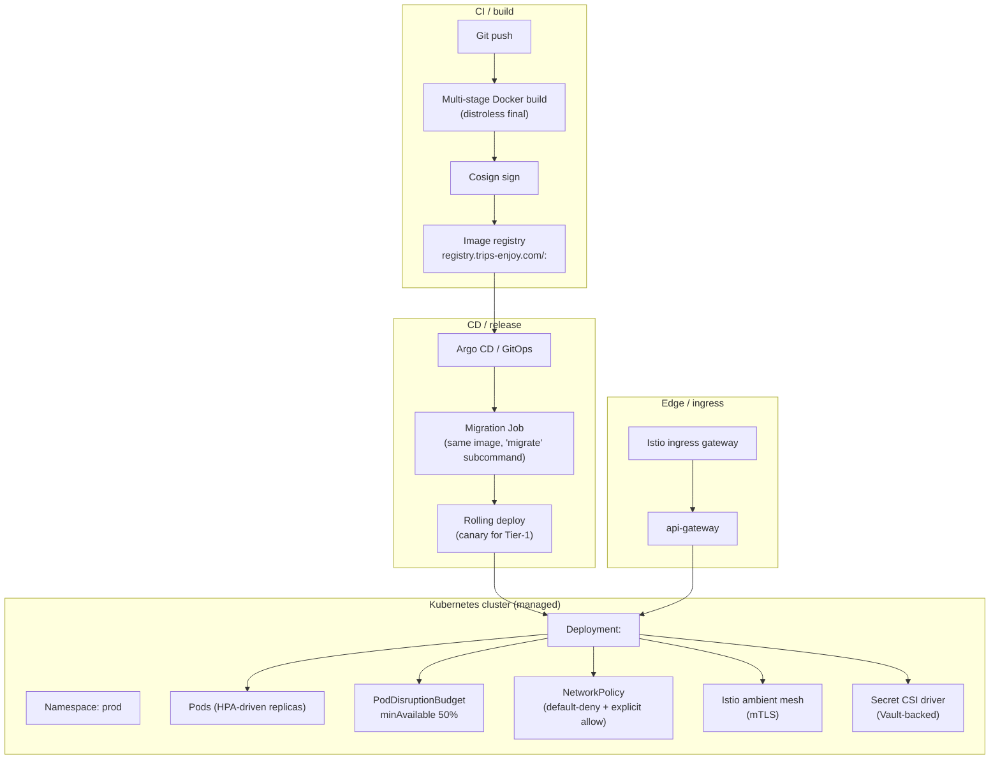

# Deployment Architecture




## Containers

- Each service is a Docker image.
- Multi-stage build; final image is distroless or a minimal runtime
  (no shell, no package manager).
- Image is signed (Cosign) and stored in a private registry.
- Image labels: `service`, `version`, `git_sha`, `build_time`.
- Non-root user.
- Read-only root filesystem where possible.
- Capabilities dropped to the minimum required.

## Kubernetes

- Production runs on Kubernetes (managed: EKS / GKE / AKS).
- One namespace per environment (`prod`, `staging`, `dev`).
- Within a namespace, services share the cluster; logical isolation
  via NetworkPolicy and per-service service accounts.
- Per-service:
  - `Deployment` with N replicas (configurable; default 2 for T2, 3
    for T1).
  - `HorizontalPodAutoscaler` (HPA) on CPU and custom metrics
    (RPS, queue depth, Kafka consumer lag).
  - `PodDisruptionBudget` (PDBs) — `minAvailable: 1` for T2, 2 for T1.
  - `ServiceAccount` per service (used for IRSA / Workload Identity).
  - `NetworkPolicy` per service.
  - `Service` (ClusterIP) and (for external exposure via gateway) no
    public Service.

## Resource Limits

Defaults; tune in `values.yaml` per service.

| Service tier | CPU request | CPU limit | Memory request | Memory limit |
|--------------|-------------|-----------|----------------|--------------|
| T1 | 500m | 2000m | 1Gi | 4Gi |
| T2 | 200m | 1000m | 512Mi | 2Gi |
| T3 | 100m | 500m | 256Mi | 1Gi |

`driver-service` (location sub-aggregate) and `courier-service`
(location sub-aggregate) are over-provisioned relative to T1
defaults (CPU-heavy writes) and ship as independently scalable
internal Kubernetes workers per
[[trips-enjoy-service-consolidation-payment-centralization]].

## Health Probes

See [`OBSERVABILITY.md`](OBSERVABILITY.md). `/health`, `/ready`,
`/started` are the standard.

## Ingress / API Gateway

- A managed API gateway (or NGINX + custom auth filter) terminates
  TLS and routes by host + path.
- The gateway:
  - Validates the JWT.
  - Translates claims to headers.
  - Enforces rate limits.
  - Emits access logs and traces.
- The gateway is **stateless**; all state lives in Redis (rate limit
  counters) and the auth cache.

## Configuration

- Two layers:
  - **Build-time / environment** (cluster name, region, log level):
    passed via env vars from a ConfigMap or external secret.
  - **Runtime business config** (fares, fees, zones, etc.): from
    `configuration-service` over REST or `configuration.updated.v1`.

## Secrets

- Kubernetes secrets are mounted from Vault via the Vault Agent
  Injector or External Secrets Operator.
- Each secret is annotated with `rotation_period`; the operator
  refreshes the mount at the period boundary.
- No env-var secrets in source control.

## Database Connectivity

- Services connect to PostgreSQL via PgBouncer in the same namespace.
- PgBouncer is configured for transaction pooling; service-level
  prepared statements are disabled accordingly.
- TLS is required for all DB connections; certificate pinning at
  the client where the platform supports it.

## Migrations

- Each service ships a `migrate` job (Kubernetes `Job`) that runs
  before the service's deployment.
- The job is idempotent: reruns are no-ops once the schema is current.
- The deployment waits for the job to succeed before rolling.
- Migrations are forward-only. Rollbacks are forward-fix migrations.
- Long-running data migrations (backfill) run as a separate, named
  job; the deployment does not wait for them.

## Rolling Deployments

- Strategy: `RollingUpdate` with `maxUnavailable: 0` and
  `maxSurge: 1`.
- Pre-stop hook: drain in-flight requests, finish in-flight work,
  release DB connections.
- Readiness probe gates the new pod's traffic.
- Old pods are terminated after the new pod is ready (grace period
  30s).

## Zero-Downtime Deployment

- Backward-compatible API and event changes only (see
  [`EVENT_ARCHITECTURE.md`](EVENT_ARCHITECTURE.md)).
- DB migrations are additive or follow the multi-step plan in
  [`DATABASE_ARCHITECTURE.md`](DATABASE_ARCHITECTURE.md).
- Configuration changes that affect the service are loaded at startup
  and reloaded on `configuration.updated.v1`.

## Rollback

- Each deployment is tagged with a Git SHA.
- Rollback is `kubectl rollout undo` (or platform equivalent) and is
  safe when:
  - The previous version's DB schema is compatible (forward and
    backward).
  - The previous version's API contract is honored by the gateway
    and other services.
- Hard rollback of a destructive schema change requires a
  forward-fix migration.

## Environments

| Environment | Purpose | Data | Stability |
|-------------|---------|------|-----------|
| `local` | Developer machine | Seeded; ephemeral | n/a |
| `dev` | Shared dev cluster | Synthetic; per-dev namespace | Pristine daily |
| `testing` | PR validation | Synthetic | Disposable |
| `staging` | Pre-prod | Sanitized prod snapshot (weekly) | Stable; full mirror |
| `prod` | Production | Real | Highest |

Each promotion requires passing the CI gate. Promotion to `prod` is
gated by:

- All checks green.
- Canary deploy (10% traffic for 30 min) clean.
- Approval from the service owner.

## Multi-Region

- Each region is independent for state (its own PostgreSQL cluster,
  Kafka cluster, Redis, Keycloak).
- Cross-region replication for:
  - User identities (Keycloak federation; read-mostly).
  - Configuration (read-only replicas in each region).
- Active-active is not used for transactional state. Active-passive
  is used for some Tier-1 services where the cost of conflict
  resolution is too high.
- Region failover is documented per service in `INTEGRATION.md` (when
  the service is multi-region).

## Disaster Recovery

- RPO ≤ 5 minutes for Tier-1 services.
- RTO ≤ 1 hour for Tier-1 services.
- Achieved via PITR + region failover runbook.
- DR drills are quarterly.

## Related architecture docs

- [`SYSTEM_OVERVIEW.md`](SYSTEM_OVERVIEW.md) — plain-English platform summary
- [`MICROSERVICES_MAP.md`](MICROSERVICES_MAP.md) — service catalog
- [`DATA_OWNERSHIP.md`](DATA_OWNERSHIP.md) — source-of-truth matrix
- [`EVENT_ARCHITECTURE.md`](EVENT_ARCHITECTURE.md) — event catalog and delivery semantics
- [`ADR_INDEX.md`](ADR_INDEX.md) — architecture decision records

---

## Per-Environment DB + Secret Path Convention (added 2026-08-14)

Per the local-development bootstrap described in
[DATABASE_ARCHITECTURE.md](DATABASE_ARCHITECTURE.md) §13, every active service
uses one local Postgres database `trips_enjoy` with one schema per service.
In every environment (dev / stg / prod) and every region, the same contract
holds:

| Environment | DB identifier | Schema | URL pattern |
|---|---|---|---|
| local / dev | `trips_enjoy` (DBA-created via `make db-init`) | `<service_name_snake>` (created on first boot) | `jdbc:postgresql://0.0.0.0:5432/trips_enjoy?currentSchema=<schema>` |
| stg / prod | `trips_enjoy` (DBA-created via Terraform / `kubectl`) | `<service_name_snake>` (managed by Flyway/golang-migrate/alembic) | `jdbc:postgresql://${PG_HOST}:${PG_PORT}/trips_enjoy?currentSchema=<schema>` |

The 20 canonical schema names are
[`docs/architecture/DATABASE_ARCHITECTURE.md:102`](DATABASE_ARCHITECTURE.md#naming-conventions).

### Vault path convention (per service per environment)

Every service expects the following paths (key names match the
`<SVC>_*` env vars its `.env.example` documents):

```
secret/<service>/<env>/db/url
secret/<service>/<env>/db/username
secret/<service>/<env>/db/password
secret/<service>/<env>/redis/host
secret/<service>/<env>/redis/port
secret/<service>/<env>/redis/password
secret/<service>/<env>/kafka/bootstrap-servers
```

`<env>` ∈ {`dev`, `stg`, `prod`, `local`} — Vault path is namespaced per
environment, no cross-env reads. No env-var secrets in source control;
**stg/prod values come from Vault only**, mounted at pod start by Vault Agent
Injector / External Secrets Operator per the §Secrets section above.

### Service-owned migrations

| Stack | Tool | Path in scaffold |
|---|---|---|
| Spring Boot (15) | Flyway 11 | `apps/<svc>/src/main/resources/db/migration/V<n>__<desc>.sql` |
| Go (file-service, geolocation-service only) | golang-migrate | `apps/<svc>/migrations/000NNN_<desc>.up.sql` + `.down.sql` |
| Python (fraud-risk-service, reporting-service) | alembic | `apps/<svc>/migrations/versions/000N_<desc>.py` |
| Go (api-gateway, chat-service) | n/a | stateless — no DB |

Per [DEPLOYMENT_ARCHITECTURE.md §Migrations](#migrations): each migration is
idempotent (`CREATE SCHEMA IF NOT EXISTS`); each is run by a Kubernetes
`Job` with `helm.sh/hook: pre-install,pre-upgrade` before the deployment
rolls; rollback is forward-only.
---

## Reference Tree Implementation Status (added 2026-08-15)

The platform's canonical Kubernetes reference tree lives at
[`platform/k8s/`](../../platform/k8s/README.md). It is the single
source of truth for the dev/CI layout on docker-desktop; stg/prod
overlay it via kustomize components.

**What's wired in the reference tree as of 2026-08-15:**

| Component | Image / version | Status |
|---|---|---|
| Postgres + PostGIS | `postgis/postgis:19-3.5` | Extensions (postgis, pgcrypto, pg_trgm, pg_cron, pg_stat_statements, pgaudit) bootstrapped via init ConfigMap; pg_cron in `shared_preload_libraries`; PVC 25Gi; PriorityClass `postgres-priority` (1M); PDB minAvailable 1. |
| Redis | `redis:8-alpine` | Sentinel sidecar + redis_exporter; AOF + RDB; PVC 5Gi; per-service ACL file; PriorityClass not assigned (defaults via ResourceQuota). |
| Kafka | `apache/kafka:3.7.0` | KRaft single-node; 51-topic catalog (TSV ConfigMap); init Job with `--if-not-exists`; PVC 10Gi; PriorityClass `kafka-priority` (900k); PDB minAvailable 1. |
| Keycloak | `quay.io/keycloak/keycloak:24.0` | Postgres-backed (`KC_DB=postgres`); `KC_SPI_ADMIN_AUTH_ACCESS_TOKEN_LIFESPAN=1800`; realm import via `--import-realm` from `keycloak-realms-configmap.yaml`; PriorityClass `keycloak-priority` (850k); HPA 1-3; PDB minAvailable 1. |
| Elasticsearch | `docker.elastic.co/elasticsearch/elasticsearch:8.13.4` | Single-node dev (`discovery.type=single-node`, `xpack.security.enabled=false`); 10Gi PVC; `vm.max_map_count` sysctl init check; index-init Job. |
| MinIO | `minio/minio:RELEASE.2024-08-29T01-40-52Z` | `minio-bucket-init` Job creates 10 canonical buckets idempotently + applies 30d lifecycle policy; 10Gi PVC. |
| Conductor | `conductor-cinema/conductor-server:3.16.0` + `conductor-ui:3.16.0` + in-house `conductor-kafka-bridge` | Postgres persistence; Elasticsearch index; PriorityClass `conductor-priority` (750k); HPA 1-3; PDB minAvailable 1; preStop `sleep 30`. |
| Prometheus | `prom/prometheus:v3.0.0` | 20Gi PVC for TSDB (replacing emptyDir); `--storage.tsdb.retention.time=15d`; platform-wide recording/alerting rules ConfigMap; ServiceMonitor + PodMonitor compatible; PriorityClass not assigned. |
| Alertmanager | `prom/alertmanager:v0.27.0` | Slack + PagerDuty receivers from `alertmanager-runtime` Secret (optional in dev). |
| Grafana | `grafana/grafana:11.2.0` | 5 starter dashboards (api-gateway-requests, outbox-lag, kafka-consumer-lag, redis-hit-ratio, postgres-partition-health). |
| Loki | `grafana/loki:3.2.0` | Monolithic mode; 5Gi PVC; 7d retention. |
| OTel Collector | `otel/opentelemetry-collector-contrib:0.110.0` | OTLP gRPC/HTTP receivers; loki + prometheusremotewrite + debug exporters; `attributes/platform_request_id` processor preserves ADR-0019 request id across traces. |

**Cross-cutting additions (separate from infra components):**

- **PriorityClasses** for all 21 services + 4 platform components
  (`postgres-priority` 1M, `kafka-priority` 900k, `ledger-service-priority`
  900k, `payment-service-priority` 880k, `keycloak-priority` 850k,
  `configuration-service-priority` 800k, `conductor-priority` 750k,
  `api-gateway-priority` 700k, `service-tier-1` 600k, `service-tier-2`
  500k, `service-tier-3` 300k).
- **ResourceQuota + LimitRange** at the namespace level (`trips-enjoy-quota`).
- **NetworkPolicies** — default-deny ingress + egress; explicit allow matrix:
  api-gateway → every service, admin-service → every service,
  observability → every service, every service → postgres / redis / kafka
  / keycloak / conductor / otel-collector; identity-service → keycloak
  admin REST; Conductor bridge → kafka + conductor; Conductor →
  Elasticsearch; object-storage clients (file-service, audit-service,
  reporting-service, configuration-service) → MinIO.
- **ExternalSecrets** — ClusterSecretStore `vault-backend` + 27
  ExternalSecret templates (21 services + 6 platform components).
- **Per-service companion files** — `services/<name>-policy.yaml` for
  every service, each carrying HPA + PDB + NetworkPolicy + ServiceMonitor
  + PrometheusRule + optional migrate Job.
- **Tier-hardening patch** (`services/patches/tier-hardening.yaml`) —
  uniform security hardening for every Deployment: linkerd + OTel
  annotations, seccompProfile, preStop, readOnlyRootFilesystem,
  capabilities drop ALL, emptyDir /tmp mounts, rolling strategy
  maxUnavailable:0/maxSurge:1, topology spread across hostnames + zones.
- **Stg / prod overlay skeletons** at `overlays/{stg,prod}/kustomization.yaml`
  with the components the operator team needs to fill in
  (`stg-replicas.yaml`, `stg-images.yaml`, `stg-vault-secrets.yaml`,
  `stg-resources.yaml`, `stg-network-policies.yaml`, plus their `prod-*`
  counterparts).
- **Conftest policy** at `policy/conftest.rego` enforcing the documented
  conventions (ClusterIP-only, runAsNonRoot, capabilities drop ALL,
  readOnlyRootFilesystem, seccompProfile, PriorityClass exists, image
  registry prefix, no hardcoded secrets).

**Validation tools** added to the root Makefile:
- `make k8s-lint` — conftest policy check
- `make k8s-build`, `make k8s-build-stg`, `make k8s-build-prod` —
  kustomize build
- `make k8s-validate-platform-rules` — `promtool check rules` on every
  PrometheusRule in the tree

**What stays as an overlay concern** (not in the dev tree):

- Istio ingress gateway exposure (cluster-level concern).
- cert-manager for TLS certificates.
- ArgoCD `ApplicationSet` for GitOps deployment.
- PostgreSQL operator (CloudNativePG, Zalando) for HA + PITR.
- Redis operator for cluster mode + Sentinel quorum.
- Strimzi Kafka operator for topic-as-Code CRDs.
- Long-term storage backend for Prometheus (Thanos/Mimir/Cortex).
- Vault server itself (only the ExternalSecret client-side is in the tree).
- Linkerd control plane (only the sidecar-injection annotations are in the tree).
