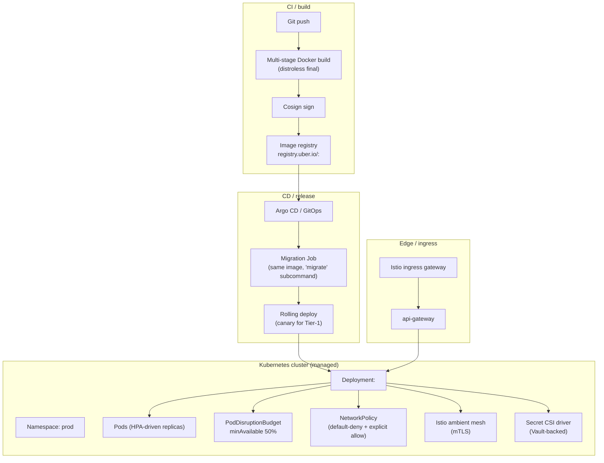

# Deployment Architecture

## Containers

- Each service is a Docker image.
- Multi-stage build; final image is distroless or a minimal runtime
  (no shell, no package manager).
- Image is signed (Cosign) and stored in a private registry.
- Image labels: `service`, `version`, `git_sha`, `build_time`.
- Non-root user.
- Read-only root filesystem where possible.
- Capabilities dropped to the minimum required.

## Kubernetes

- Production runs on Kubernetes (managed: EKS / GKE / AKS).
- One namespace per environment (`prod`, `staging`, `dev`).
- Within a namespace, services share the cluster; logical isolation
  via NetworkPolicy and per-service service accounts.
- Per-service:
  - `Deployment` with N replicas (configurable; default 2 for T2, 3
    for T1).
  - `HorizontalPodAutoscaler` (HPA) on CPU and custom metrics
    (RPS, queue depth, Kafka consumer lag).
  - `PodDisruptionBudget` (PDBs) — `minAvailable: 1` for T2, 2 for T1.
  - `ServiceAccount` per service (used for IRSA / Workload Identity).
  - `NetworkPolicy` per service.
  - `Service` (ClusterIP) and (for external exposure via gateway) no
    public Service.

## Resource Limits

Defaults; tune in `values.yaml` per service.

| Service tier | CPU request | CPU limit | Memory request | Memory limit |
|--------------|-------------|-----------|----------------|--------------|
| T1 | 500m | 2000m | 1Gi | 4Gi |
| T2 | 200m | 1000m | 512Mi | 2Gi |
| T3 | 100m | 500m | 256Mi | 1Gi |

`driver-service` (location sub-aggregate) and `courier-service`
(location sub-aggregate) are over-provisioned relative to T1
defaults (CPU-heavy writes) and ship as independently scalable
internal Kubernetes workers per
[[trips-enjoy-service-consolidation-payment-centralization]].

## Health Probes

See [`OBSERVABILITY.md`](OBSERVABILITY.md). `/health`, `/ready`,
`/started` are the standard.

## Ingress / API Gateway

- A managed API gateway (or NGINX + custom auth filter) terminates
  TLS and routes by host + path.
- The gateway:
  - Validates the JWT.
  - Translates claims to headers.
  - Enforces rate limits.
  - Emits access logs and traces.
- The gateway is **stateless**; all state lives in Redis (rate limit
  counters) and the auth cache.

## Configuration

- Two layers:
  - **Build-time / environment** (cluster name, region, log level):
    passed via env vars from a ConfigMap or external secret.
  - **Runtime business config** (fares, fees, zones, etc.): from
    `configuration-service` over REST or `configuration.updated.v1`.

## Secrets

- Kubernetes secrets are mounted from Vault via the Vault Agent
  Injector or External Secrets Operator.
- Each secret is annotated with `rotation_period`; the operator
  refreshes the mount at the period boundary.
- No env-var secrets in source control.

## Database Connectivity

- Services connect to PostgreSQL via PgBouncer in the same namespace.
- PgBouncer is configured for transaction pooling; service-level
  prepared statements are disabled accordingly.
- TLS is required for all DB connections; certificate pinning at
  the client where the platform supports it.

## Migrations

- Each service ships a `migrate` job (Kubernetes `Job`) that runs
  before the service's deployment.
- The job is idempotent: reruns are no-ops once the schema is current.
- The deployment waits for the job to succeed before rolling.
- Migrations are forward-only. Rollbacks are forward-fix migrations.
- Long-running data migrations (backfill) run as a separate, named
  job; the deployment does not wait for them.

## Rolling Deployments

- Strategy: `RollingUpdate` with `maxUnavailable: 0` and
  `maxSurge: 1`.
- Pre-stop hook: drain in-flight requests, finish in-flight work,
  release DB connections.
- Readiness probe gates the new pod's traffic.
- Old pods are terminated after the new pod is ready (grace period
  30s).

## Zero-Downtime Deployment

- Backward-compatible API and event changes only (see
  [`EVENT_ARCHITECTURE.md`](EVENT_ARCHITECTURE.md)).
- DB migrations are additive or follow the multi-step plan in
  [`DATABASE_ARCHITECTURE.md`](DATABASE_ARCHITECTURE.md).
- Configuration changes that affect the service are loaded at startup
  and reloaded on `configuration.updated.v1`.

## Rollback

- Each deployment is tagged with a Git SHA.
- Rollback is `kubectl rollout undo` (or platform equivalent) and is
  safe when:
  - The previous version's DB schema is compatible (forward and
    backward).
  - The previous version's API contract is honored by the gateway
    and other services.
- Hard rollback of a destructive schema change requires a
  forward-fix migration.

## Environments

| Environment | Purpose | Data | Stability |
|-------------|---------|------|-----------|
| `local` | Developer machine | Seeded; ephemeral | n/a |
| `dev` | Shared dev cluster | Synthetic; per-dev namespace | Pristine daily |
| `testing` | PR validation | Synthetic | Disposable |
| `staging` | Pre-prod | Sanitized prod snapshot (weekly) | Stable; full mirror |
| `prod` | Production | Real | Highest |

Each promotion requires passing the CI gate. Promotion to `prod` is
gated by:

- All checks green.
- Canary deploy (10% traffic for 30 min) clean.
- Approval from the service owner.

## Multi-Region

- Each region is independent for state (its own PostgreSQL cluster,
  Kafka cluster, Redis, Keycloak).
- Cross-region replication for:
  - User identities (Keycloak federation; read-mostly).
  - Configuration (read-only replicas in each region).
- Active-active is not used for transactional state. Active-passive
  is used for some Tier-1 services where the cost of conflict
  resolution is too high.
- Region failover is documented per service in `INTEGRATION.md` (when
  the service is multi-region).

## Disaster Recovery

- RPO ≤ 5 minutes for Tier-1 services.
- RTO ≤ 1 hour for Tier-1 services.
- Achieved via PITR + region failover runbook.
- DR drills are quarterly.

## Related architecture docs

- [`SYSTEM_OVERVIEW.md`](SYSTEM_OVERVIEW.md) — plain-English platform summary
- [`MICROSERVICES_MAP.md`](MICROSERVICES_MAP.md) — service catalog
- [`DATA_OWNERSHIP.md`](DATA_OWNERSHIP.md) — source-of-truth matrix
- [`EVENT_ARCHITECTURE.md`](EVENT_ARCHITECTURE.md) — event catalog and delivery semantics
- [`ADR_INDEX.md`](ADR_INDEX.md) — architecture decision records