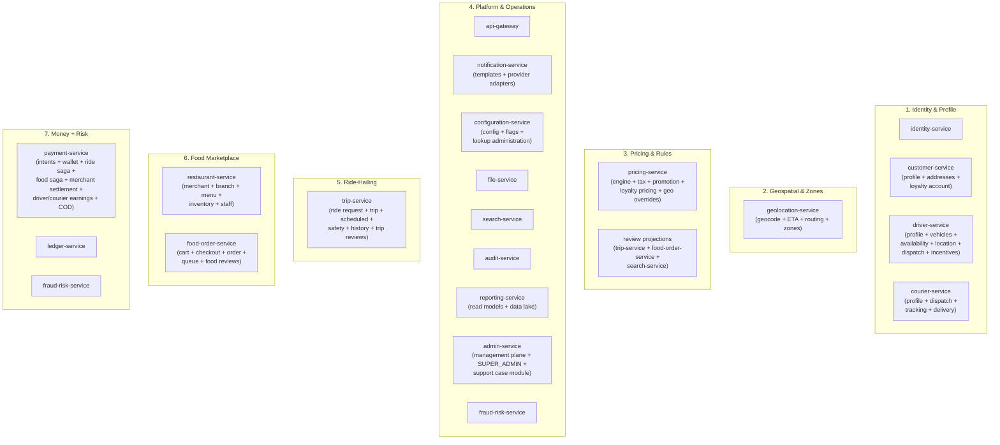

# Domain Map

A **domain map** shows how the business is decomposed into
**bounded contexts** and which team / service owns each. It is the
precursor to choosing microservices. The platform standardizes on
**exactly 20 active services** per
[ADR-0017](adrs/0017-20-service-architecture.md); absorbed
capabilities live as inline sub-aggregates under the surviving
service.

## Strategic Bounded Contexts

## Context → Service Mapping

Each context is delivered by one or more microservices. The
mapping below is the authoritative reference; the same data
appears in tabular form in
[`MICROSERVICES_MAP.md`](MICROSERVICES_MAP.md).

### 1. Identity & Profile

| Sub-domain | Service (owning binary) | Why this boundary |
|------------|-------------------------|-------------------|
| Auth / token issuance | `identity-service` | Keycloak adapter, central token validation cache, realm-specific config |
| Cross-persona user data (lang, notification prefs, device list, loyalty account) | `customer-service` | Shared across customer/driver/courier personas; the loyalty account is exposed here (read side); loyalty *pricing rules* live in `pricing-service` |
| Customer profile + KYC tier + default payment methods | `customer-service` | Customer-specific profile aggregate |
| Driver profile + KYC + vehicle + online state + location + match attempts + incentives + deals | `driver-service` | Driver end-to-end; absorbs availability, location, dispatch, incentives, vehicles; one binary, multiple internal workers |
| Courier profile + KYC + dispatch + tracking + delivery + deals | `courier-service` | Courier end-to-end; absorbs dispatch, tracking, delivery aggregates |
| Saved addresses (geocoded, normalized, tagged home/work/other) | `customer-service` (addresses sub-aggregate) | Same DB as cross-persona profile |

### 2. Geospatial & Zones

| Sub-domain | Service | Why this boundary |
|------------|---------|-------------------|
| Geocoding, ETA, routing, zones, surge zones | `geolocation-service` | Adapter to map/route provider; cache; zones absorbed here for read-heavy trip ETA path scaling |

### 3. Pricing & Rules

| Sub-domain | Service | Why this boundary |
|------------|---------|-------------------|
| Fare / quote / total / rating-density / loyalty pricing | `pricing-service` | Pure computation, high cache hit rate, no domain state; absorbs tax, promotion, loyalty pricing, geo overrides |
| Coupons, promos, campaigns | `pricing-service` (promotion sub-aggregate) | Complex rule engine, redemption history, anti-fraud hooks |
| Loyalty pricing rules (earn/burn rates, tiers, frequent-zone aggregation) | `pricing-service` (loyalty pricing) + `customer-service` (loyalty account) | Pricing-side rule evaluation; account balance and history live with the customer |
| Tax calculation | `pricing-service` (tax sub-aggregate) | Jurisdiction rules, product tax codes, exemptions; immutable tax snapshots are captured per quote |
| Reviews & ratings (ride + food, discovery projections) | `trip-service` (trip reviews) + `food-order-service` (food reviews) + `search-service` (discovery projections) | Aggregates both ride and food reviews with shared schema, each writer in its own service |

### 4. Platform & Operations

| Sub-domain | Service | Why this boundary |
|------------|---------|-------------------|
| Edge | `api-gateway` | Routing, auth edge, rate limit, request transformation |
| Notifications (templates + delivery state + immutable template-version snapshot chain) | `notification-service` | User-visible messages across channels |
| SMS/Email/Push providers (preserved provider anti-corruption layer) | `notification-service` (provider adapters) | One bounded context for "external messaging providers" |
| Configuration distribution | `configuration-service` | Hot-reloadable, hierarchical config |
| Feature flags + kill switches + lookup administration | `configuration-service` (flags + lookup sub-aggregates) | Rollouts, A/B; shared `lookup_types` + `lookups` catalog administration per `shared/LOOKUPS.md` |
| File / media | `file-service` | S3 adapter, virus scan hook, signed URL issuance |
| Search | `search-service` | OpenSearch adapter, indexing, query DSL; absorbs the food-review projection for discovery |
| Audit | `audit-service` | Persists audit events from Kafka; immutable |
| Reporting + data lake ingestion | `reporting-service` | Read models for dashboards, exports, statements; data lake ingest; reconciliation jobs |
| Admin workflows | `admin-service` | Management plane; SUPER_ADMIN preset; service-request workflows (Conductor 3.5) |
| Support case module (separately permissioned as `support.admin` scope) | `admin-service` (support sub-aggregate) | Tickets, conversations, escalations |
| Fraud / risk | `fraud-risk-service` | Risk scoring on key actions (login, payment, dispatch); advises payment |

### 5. Ride-Hailing

| Sub-domain | Service | Why this boundary |
|------------|---------|-------------------|
| Ride booking intent + scheduled + safety + history + trip reviews + Phase 7/7.5 rewards | `trip-service` | Owns "ride request" + trip aggregate; Conductor reward fan-out flows are owned here (`wf.phase7.reward_*.v1`, `wf.phase75.deal_*.v1`) |
| Driver aggregate (availability + location + dispatch + incentives + vehicles) | `driver-service` | One binary, multiple workers; Conductor `wf.onboarding.driver.v1` runs here |
| Ride payment orchestration (ride-saga, in-service) | `payment-service` (ride saga) | Authorize → capture → settle driver earnings → commission; in-service saga (ADR-0010), 99.99% SLO |
| Driver earnings + withdrawal + statements | `payment-service` (driver earnings) | Trip-based earnings, withdrawal, statements |
| ETA / routing read path | `geolocation-service` (ETA/routing sub-aggregate) | Adapter to map provider; cached, idempotent lookups |

### 6. Food Marketplace

| Sub-domain | Service | Why this boundary |
|------------|---------|-------------------|
| Merchant onboarding + restaurant operations + branches + staff + menus + inventory | `restaurant-service` | One product model; one binary, multiple sub-aggregates |
| Cart + checkout + food order + restaurant-side queue + food reviews | `food-order-service` | Order lifecycle; cart + checkout + queue live in one binary with the order aggregate |
| Food payment orchestration (food-saga, in-service) | `payment-service` (food saga) | Authorize → capture → settle merchant → courier earnings; in-service saga (ADR-0010) |

### 7. Food Delivery & Couriers

| Sub-domain | Service | Why this boundary |
|------------|---------|-------------------|
| Courier aggregate (dispatch + tracking + delivery + deals) | `courier-service` | Same scaling profile as driver dispatch; one binary; Conductor `wf.onboarding.courier.v1` runs here |
| Courier earnings | `payment-service` (courier earnings) | Per-delivery pay, tips, bonuses, statements |

### 8. Financial

| Sub-domain | Service | Why this boundary |
|------------|---------|-------------------|
| Payment provider integration (46-gateway registry) + wallet + ride/food sagas + merchant payable/payouts/disputes + COD money | `payment-service` | All operational money; absorbs ride/food sagas, wallet, earnings, merchant settlement, COD reconciliation |
| Double-entry ledger | `ledger-service` | All money flows recorded as double-entry; sole immutable journal authority per `shared/PLATFORM_BASELINE.md` |
| Merchant settlement | `payment-service` (merchant settlement sub-aggregate) | Aggregates merchant payable, payout schedule |
| Refund orchestration (6 categories) | `payment-service` (in-service) + Conductor `wf.refund.*.v1` (named flows) | In-service saga remains default; Conductor `compensationSteps` for N-step refund fan-outs |

## Why These Boundaries (Domain-Driven Design Rationale)

- **Aggregates are the unit of consistency.** A `Trip` aggregate
  cannot span two services; therefore `trip-service` is the only
  owner of `Trip`. Other services may hold a denormalized
  `trip_id` and a snapshot, never the canonical trip state.
- **Sub-domains with distinct languages stay separate.** Driver
  onboarding has terms (`vehicle_class`, `document_type`) that
  don't belong in customer land. Therefore `driver-service` and
  `customer-service` are separate even though they share a "user"
  concept.
- **Hot paths scale differently.** The location workers inside
  `driver-service` and `courier-service` write at 1–5 Hz per
  driver/courier × thousands of drivers/couriers; they cannot
  share a DB schema with the profile sub-aggregate (low write
  rate, relational joins). The internal Kubernetes workers are
  independently scalable per
  [[trips-enjoy-service-consolidation-payment-centralization]].
- **External integrations are isolated.** Map provider, payment
  provider (46 gateways), SMS provider, email provider, push
  provider each have their own adapter. Payment providers sit
  inside the `payment-service` registry; messaging providers sit
  inside `notification-service` (provider adapters preserved from
  the absorbed `comms-gateway-service`). Replacing one should not
  require redeploying others.
- **Read models are separate from write models.** `trip-service`
  (history sub-aggregate) is a read-side projection of
  `trip-service` plus payments and ratings — it's where
  high-cardinality list queries live, with a distinct consumer
  (mobile app), distinct SLO, and distinct retention.

## Bounded Contexts That Were Intentionally NOT Split

| Considered | Decision | Reason |
|------------|----------|--------|
| Menu / Catalog / Category / Product / Modifier | One `restaurant-service` (menu sub-aggregate) | All are attributes of the same product model; separate services would force cross-service joins on every menu read |
| Trip / Trip tracking | One `trip-service` | Tracking is just trip state + telemetry; same aggregate, same DB |
| Ride fare / Delivery fee / Tax / Promotion / Loyalty pricing | One `pricing-service` | All quote computations over the same rule set; splitting creates multiple engines to keep in sync |
| Ride rating / Food rating | `trip-service` (trip reviews) + `food-order-service` (food reviews) + `search-service` (discovery projections) | Same aggregate pattern, same schema, different subject types |
| Order / Order state | One `food-order-service` | State is the order itself; "order state service" is just a rebrand |
| Trip history / Reporting | `trip-service` (history sub-aggregate) separate from generic `reporting-service` | Has distinct consumer (mobile app), distinct SLO, distinct retention; not a generic report |
| Audit logs | One `audit-service` (consumer of events) | Per-service audit tables would be inconsistent; centralized projection is the right model |
| Payment gateway adapters (46 providers) | One `payment-service` (registry) | Provider schema may change; hidden behind `PaymentIntent` aggregate and versioned events; per-gateway isolation per `SERVICE_ISOLATION.md` 2.2 |
| Messaging provider adapters | One `notification-service` (provider adapters) | Same rationale; absorbs the previous `comms-gateway-service` ACL contract |
| Driver availability + location + dispatch + incentives + vehicles | One `driver-service` (multiple internal workers) | Same bounded-context product (driver), independently scalable internal workers |
| Courier dispatch + tracking + delivery | One `courier-service` (multiple internal workers) | Same bounded-context product (courier) |
| Ride-payment-integration, food-payment-integration, wallet, driver earnings, courier earnings, merchant settlement | One `payment-service` (multiple sub-aggregates + in-service sagas) | All operational money; ledger-service remains the only double-entry writer |
| Enumeration catalog (`payment.method`, `trip.status`, `menu.cuisine`, …) | Shared `lookup_types` + `lookups` contract (no dedicated service); see [`../shared/LOOKUPS.md`](../shared/LOOKUPS.md) | Every bounded context already owns one or more enumerations; centralizing the *shape* (table pair, `code` namespace, admin-port contract, event stream) without centralizing the *rows* avoids both duplication and cross-service joins |

## Related architecture docs

- [`SYSTEM_OVERVIEW.md`](SYSTEM_OVERVIEW.md) — plain-English platform summary
- [`MICROSERVICES_MAP.md`](MICROSERVICES_MAP.md) — service catalog
- [`DATA_OWNERSHIP.md`](DATA_OWNERSHIP.md) — source-of-truth matrix
- [`EVENT_ARCHITECTURE.md`](EVENT_ARCHITECTURE.md) — event catalog and delivery semantics
- [`ADR_INDEX.md`](ADR_INDEX.md) — architecture decision records
