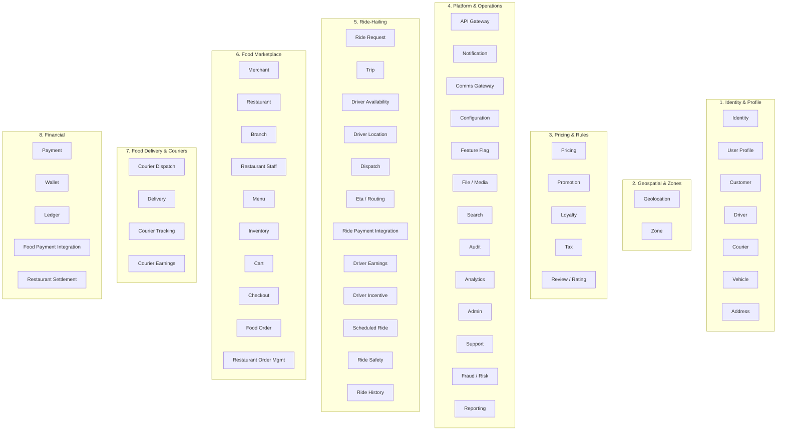

# Domain Map

A **domain map** shows how the business is decomposed into **bounded
contexts** and which team / service owns each. It is the precursor to
choosing microservices.

## Strategic Bounded Contexts

## Context → Service Mapping

Each context is delivered by one or more microservices. The mapping
below is the authoritative reference; the same data appears in tabular
form in [`MICROSERVICES_MAP.md`](MICROSERVICES_MAP.md).

### 1. Identity & Profile

| Sub-domain | Service | Why this boundary |
|------------|---------|-------------------|
| Auth / token issuance | `identity-service` | Keycloak adapter, central token validation cache, realm-specific config |
| Common user data | ``customer-service` (cross-persona profile)` | Languages, notification prefs, device list — shared across all personas |
| Customer profile | `customer-service` | Customer-specific KYC tier, default payment methods, lifetime value |
| Driver profile + KYC | `driver-service` | Driver onboarding, document expiry, ratings, eligibility per city |
| Courier profile + KYC | `courier-service` | Courier onboarding, vehicle type, scheduled shifts |
| Vehicle registry | ``driver-service` (vehicles)` | Plate, model, registration, insurance, inspection — shared by driver and courier |
| Saved addresses | ``customer-service` (addresses)` | Geocoded, normalized, tagged (home/work/other) |

### 2. Geospatial & Zones

| Sub-domain | Service | Why this boundary |
|------------|---------|-------------------|
| Geocoding, ETA, routing | `geolocation-service` | Adapter to map/route provider; cache; quality control |
| Service areas, geofences | ``geolocation-service` (zones)` | City/zone boundaries, surge zones, restricted zones, business hours by zone |

### 3. Pricing & Rules

| Sub-domain | Service | Why this boundary |
|------------|---------|-------------------|
| Fare / quote / total | `pricing-service` | Pure computation, high cache hit rate, no domain state |
| Coupons, promos, campaigns | ``pricing-service` (promotion)` | Complex rule engine, redemption history, anti-fraud hooks |
| Points, tiers | ``pricing-service` (loyalty rules) / `customer-service` (account)` | Distinct lifecycle (earn/burn), separate from wallet |
| Tax calculation | ``pricing-service` (tax)` | Jurisdiction rules, product tax codes, exemptions |
| Reviews & ratings | ``trip-service` / `food-order-service` / `search-service` (review projections)` | Aggregates both ride and food reviews with shared schema |

### 4. Platform & Operations

| Sub-domain | Service | Why this boundary |
|------------|---------|-------------------|
| Edge | `api-gateway` | Routing, auth edge, rate limit, request transformation |
| Notifications | `notification-service` | Orchestrates user-visible messages across channels |
| SMS/Email/Push providers | ``notification-service` (provider ACL)` | One bounded context for "external messaging providers" |
| Configuration distribution | `configuration-service` | Hot-reloadable, hierarchical config |
| Feature flags | ``configuration-service` (flags)` | Rollouts, kill switches, A/B |
| File / media | `file-service` | S3 adapter, virus scan hook, signed URL issuance |
| Search | `search-service` | OpenSearch adapter, indexing, query DSL |
| Audit | `audit-service` | Persists audit events from Kafka |
| Analytics | ``reporting-service` (data lake)` | Event ingestion to data lake / warehouse |
| Admin workflows | `admin-service` | Admin RBAC scopes, audit-eligible ops |
| Support | ``admin-service` (support module)` | Tickets, conversations, escalations |
| Fraud / risk | `fraud-risk-service` | Risk scoring on key actions (login, payment, dispatch) |
| Reporting | `reporting-service` | Read models for dashboards, exports, statements |

### 5. Ride-Hailing

| Sub-domain | Service | Why this boundary |
|------------|---------|-------------------|
| Ride booking intent | ``trip-service` (ride-request)` | Owns "ride request" aggregate, cancellation, scheduled-ride jobs |
| Trip aggregate | `trip-service` | The actual trip, including live tracking (within reason) |
| Driver online state | ``driver-service` (availability)` | Low write rate, drives dispatch eligibility |
| Driver live location | ``driver-service` (location)` | **High write rate**, dedicated DB with time-series-aware schema |
| Matching | ``driver-service` (dispatch)` | Consumes availability + location + ride request, emits assignment |
| ETA / routing | ``geolocation-service` (ETA/routing)` | Adapter to map provider; cached, idempotent lookups |
| Ride payment orchestration | ``payment-service` (ride saga)` | Saga: authorize → capture → settle driver earning → commission |
| Driver earnings | ``payment-service` (driver earnings)` | Trip-based earnings, withdrawal, statements |
| Driver incentives | ``driver-service` (incentives)` | Quests, bonuses, surge guarantees |
| Scheduled rides | ``trip-service` (scheduled)` | Cron-like scheduler; creates ride requests at T-15 |
| Safety / emergency | ``trip-service` (safety)` | SOS, share-trip, audio recording, incident reports |
| Ride history (read model) | ``trip-service` (history)` | Customer/driver/admin read-side, optimized for queries |

### 6. Food Marketplace

| Sub-domain | Service | Why this boundary |
|------------|---------|-------------------|
| Merchant onboarding | ``restaurant-service` (merchant)` | Legal entity, tax info, contacts, status |
| Restaurant operations | `restaurant-service` | Restaurant-level config, status, profile |
| Branches | ``restaurant-service` (branch)` | Physical location, hours, prep capacity |
| Restaurant staff | ``restaurant-service` (staff)` | Employees, roles, device logins |
| Menu | ``restaurant-service` (menu)` | Categories, products, modifiers, add-ons |
| Inventory | ``restaurant-service` (inventory)` | Stock, 86'd items, time-bound availability |
| Cart | ``food-order-service` (cart)` | Active cart, promo application, totals |
| Checkout | ``food-order-service` (checkout)` | Address, slot, payment method, final quote |
| Food order | `food-order-service` | Order aggregate, state machine, lifecycle events |
| Restaurant order console | ``food-order-service` (queue)` | Restaurant operator workflow: accept, reject, ready |

### 7. Food Delivery & Couriers

| Sub-domain | Service | Why this boundary |
|------------|---------|-------------------|
| Courier matching | ``courier-service` (dispatch)` | Same pattern as driver dispatch but for food |
| Delivery aggregate | ``courier-service` (delivery)` | Pickup → dropoff, proof-of-delivery |
| Courier live location | ``courier-service` (tracking)` | Same scaling profile as ``driver-service` (location)` |
| Courier earnings | ``payment-service` (courier earnings)` | Per-delivery pay, tips, bonuses, statements |

### 8. Financial

| Sub-domain | Service | Why this boundary |
|------------|---------|-------------------|
| Payment provider integration | `payment-service` | Provider tokens, authorize/capture, webhooks |
| Wallet | ``payment-service` (wallet)` | Stored balance, top-up, hold, release |
| Double-entry ledger | `ledger-service` | All money flows recorded as double-entry |
| Food payment orchestration | ``payment-service` (food saga)` | Saga: authorize → capture → settle merchant → courier earning |
| Restaurant settlement | ``payment-service` (merchant settlement)` | Aggregates merchant payable, payout schedule |

## Why These Boundaries (Domain-Driven Design Rationale)

- **Aggregates are the unit of consistency.** A `Trip` aggregate cannot
  span two services; therefore `trip-service` is the only owner of
  `Trip`. Other services may hold a denormalized `trip_id` and a snapshot,
  never the canonical trip state.
- **Sub-domains with distinct languages stay separate.** Driver onboarding
  has terms (`vehicle_class`, `document_type`) that don't belong in
  customer land. Therefore `driver-service` and `customer-service` are
  separate even though they share a "user" concept.
- **Hot paths scale differently.** ``driver-service` (location)` writes
  1–5Hz per driver × thousands of drivers; it cannot share a DB schema
  with ``driver-service` (availability)` (low write rate, relational joins).
- **External integrations are isolated.** Map provider, payment provider,
  SMS provider, email provider, push provider each have their own
  adapter service. Replacing one should not require redeploying others.
- **Read models are separate from write models.** ``trip-service` (history)`
  is a read-side projection of `trip-service` plus payments and
  ratings — it's where high-cardinality list queries live.

## Bounded Contexts That Were Intentionally NOT Split

| Considered | Decision | Reason |
|------------|----------|--------|
| Menu / Catalog / Category / Product / Modifier | One ``restaurant-service` (menu)` | All are attributes of the same product model; separate services would force cross-service joins on every menu read |
| Trip / Trip tracking | One `trip-service` | Tracking is just trip state + telemetry; same aggregate, same DB |
| Ride fare / Delivery fee | One `pricing-service` | Both are quote computations over the same rule set; splitting creates two engines to keep in sync |
| Ride rating / Food rating | One ``trip-service` / `food-order-service` / `search-service` (review projections)` | Same aggregate pattern, same schema, just different subject types |
| Order / Order state | One `food-order-service` | State is the order itself; "order state service" is just a rebrand |
| Trip history / Reporting | ``trip-service` (history)` separate from generic `reporting-service` | Has distinct consumer (mobile app), distinct SLO, distinct retention; not a generic report |
| Audit logs | One `audit-service` (consumer of events) | Per-service audit tables would be inconsistent; centralized projection is the right model |
| Enumeration catalog (`payment.method`, `trip.status`, `menu.cuisine`, …) | Shared `lookup_types` + `lookups` contract (no dedicated service); see [`../shared/LOOKUPS.md`](../shared/LOOKUPS.md) | Every bounded context already owns one or more enumerations; centralizing the *shape* (table pair, `code` namespace, admin-port contract, event stream) without centralizing the *rows* avoids both duplication and cross-service joins |
