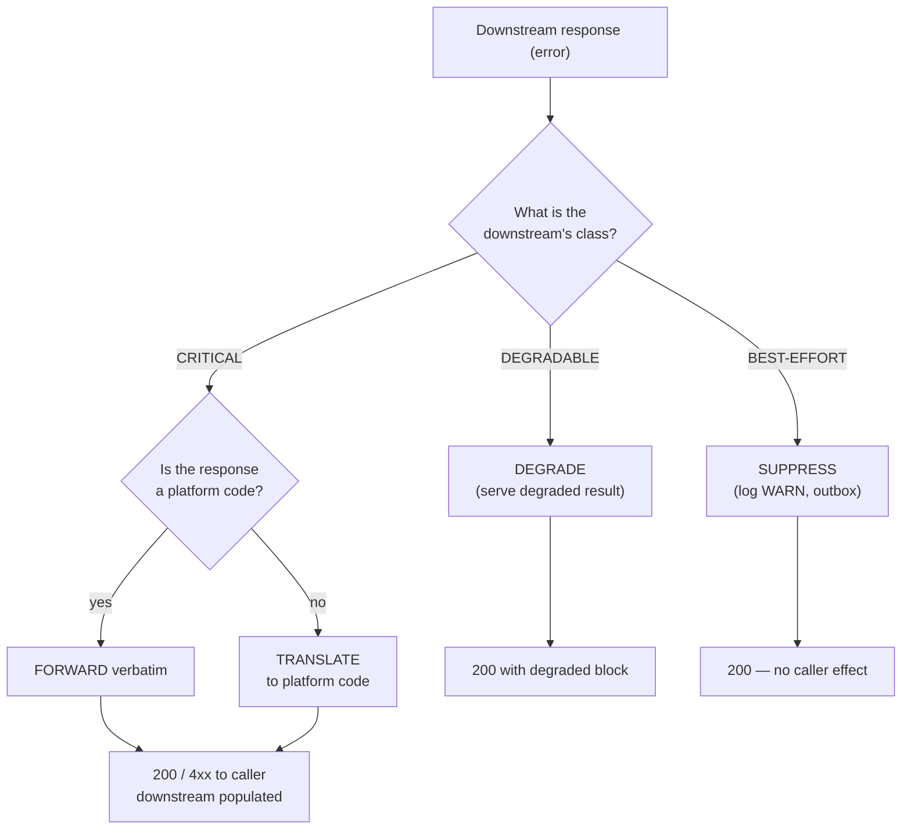

# Downstream Error Catalog

> The canonical catalog of error codes that propagate between services
> when one of them is down or returns an error. Read this alongside
> [`SERVICE_ISOLATION.md`](./SERVICE_ISOLATION.md) (which service fails
> when) and [`FAILURE_HANDLING.md`](./FAILURE_HANDLING.md) (the
> underlying primitives).

This catalog is the **single source** for:

- The error code → HTTP status mapping.
- The list of every code a service may emit, with the standard
  meaning and `code` value.
- The propagation rules — when a service MUST translate a downstream's
  code, when it MUST forward it, when it MUST NOT include it.
- The `downstream` block — the standard envelope that travels with
  every propagated error.

---

## 1. The Error Envelope

Every error response — success path or failure path — uses the RFC 7807
envelope extended with a `downstream` block. The envelope is defined in
[`../shared/CONVENTIONS.md` §1](../shared/CONVENTIONS.md) and the API
contract in [`API_STANDARDS.md` §11](./API_STANDARDS.md).

### 1.1 Full shape

```json
{
  "type": "https://platform.example.com/errors/payment-not-found",
  "title": "Payment not found",
  "status": 404,
  "detail": "No payment exists with id '01HZX…' for this tenant.",
  "instance": "/v1/payments/01HZX…/refund",
  "code": "PAYMENT_NOT_FOUND",
  "correlationId": "01HZX9C7T0XK2P9F0V6E4B1MZA",
  "traceId": "8f4a9b2c1d0e3f5a6b7c8d9e0f1a2b3c",
  "spanId": "1a2b3c4d5e6f7a8b",
  "timestamp": "2026-07-29T07:12:34.567Z",
  "downstream": null,
  "errors": [
    { "field": "paymentId", "message": "must be a UUID", "code": "INVALID_UUID" }
  ]
}
```

### 1.2 The `downstream` block (when present)

When the error is **caused by** a downstream service (i.e. this
service's own code did not fail; the downstream returned the error),
include a `downstream` block with the original source:

```json
{
  "code": "DEPENDENCY_UNAVAILABLE",
  "message": "We can't process your request right now. Please try again.",
  "correlationId": "01HZX9C7T0XK2P9F0V6E4B1MZA",
  "traceId": "8f4a9b2c1d0e3f5a6b7c8d9e0f1a2b3c",
  "downstream": {
    "service": "payment-service",
    "code": "CIRCUIT_OPEN",
    "status": 503,
    "traceId": "8f4a9b2c1d0e3f5a6b7c8d9e0f1a2b3c",
    "spanId": "1a2b3c4d5e6f7a8b",
    "latency_ms": 1,
    "attempt": 3
  }
}
```

| Field | Required | Source |
|---|---|---|
| `downstream.service` | yes | The `spring.application.name` of the service that originated the error |
| `downstream.code` | yes | The `code` field from the downstream's response envelope |
| `downstream.status` | yes | The HTTP status the downstream returned |
| `downstream.traceId` | yes | The OTel trace id propagated from the downstream (joins our trace to theirs) |
| `downstream.spanId` | no | The OTel span id of the failed downstream call |
| `downstream.latency_ms` | no | How long the call took before failing |
| `downstream.attempt` | no | Which retry attempt this was (1 = first attempt) |
| `downstream.message` | no | The downstream's `message`; safe to surface to the user only if `code` is one we whitelist (see §3.3) |

The `traceId` in the outer envelope and `downstream.traceId` are the
**same trace** — they join in the trace UI so an operator can see the
full call graph from the user request through every downstream failure.

### 1.3 What never goes in the envelope

- **No PII**: never include `email`, `phone`, `name`, full address,
  card number, or any other PII in `message` or `detail`. Use the
  redactor in [`../shared/CONVENTIONS.md` §4](../shared/CONVENTIONS.md).
- **No stack traces** in production. Stack traces belong in the logs,
  joined by `traceId`.
- **No credentials**, including `Idempotency-Key`, API keys, or
  internal tokens.
- **No raw SQL** or database row contents.
- **No vendor SDK error messages** verbatim — translate to the
  platform code (see §3).

---

## 2. HTTP Status Conventions

The standard status-code mapping for the platform. See
[`API_STANDARDS.md` §11](./API_STANDARDS.md) for the full table.

| Status | Class | When |
|---|---|---|
| 200 / 201 / 202 / 204 | OK | The request succeeded |
| 400 | VALIDATION_FAILED | Malformed input — fix the request |
| 401 | UNAUTHENTICATED | Re-authenticate |
| 403 | FORBIDDEN | Authenticated but not authorized |
| 404 | NOT_FOUND | Resource doesn't exist |
| 409 | CONFLICT | State conflict (e.g. cannot cancel a completed ride) |
| 422 | UNPROCESSABLE_ENTITY | Business rule violation |
| 429 | RATE_LIMITED | Too many requests |
| 500 | INTERNAL_ERROR | This service's own code failed unexpectedly |
| 502 | BAD_GATEWAY | Downstream returned an unexpected / unparseable response |
| 503 | SERVICE_UNAVAILABLE | This service or a CRITICAL downstream is unavailable |
| 504 | GATEWAY_TIMEOUT | Downstream timed out |

---

## 3. The Error Code Catalog

Every error has a **stable, machine-readable `code`** in
`SCREAMING_SNAKE_CASE`. New codes are added to this catalog; never
invent a new code in a service without registering it here.

### 3.1 Client-error codes (4xx)

| Code | Status | Meaning | Emitter | Notes |
|---|---|---|---|---|
| `VALIDATION_FAILED` | 400 | Request body / params fail schema | any service | `errors[]` populated |
| `UNAUTHENTICATED` | 401 | Missing / invalid bearer | `api-gateway`, any service | |
| `FORBIDDEN` | 403 | Authenticated but not authorized | any service | RBAC denied |
| `NOT_FOUND` | 404 | Generic resource not found | any service | Service-specific codes preferred |
| `CONFLICT` | 409 | State conflict | any service | e.g. cannot cancel a completed ride |
| `IDEMPOTENCY_KEY_REUSED` | 422 | Same key, different body | any service | Idempotency-Key reuse detection |
| `RATE_LIMITED` | 429 | Token bucket exhausted | any service | `Retry-After` header set |
| `BUSINESS_RULE_VIOLATION` | 422 | Domain rule broken | any service | Domain-specific detail in `detail` |
| `STATE_INVALID` | 409 | State machine doesn't allow the transition | any service | e.g. trying to refund a `voided` payment |

### 3.2 Server-error codes (5xx) — **this is the shared catalog**

| Code | Status | Meaning | Emitter | Notes |
|---|---|---|---|---|
| `INTERNAL_ERROR` | 500 | This service's own code failed unexpectedly | any service | Always log + alert |
| `DEPENDENCY_UNAVAILABLE` | 503 | A **CRITICAL** downstream is unreachable or circuit-open | any service | MUST include `downstream.service` |
| `DEPENDENCY_TIMEOUT` | 504 | A downstream timed out after retries | any service | MUST include `downstream.service` |
| `BAD_GATEWAY` | 502 | Downstream returned an unexpected / unparseable response | any service | MUST include `downstream.service` |
| `SERVICE_UNAVAILABLE` | 503 | This service is in a state where it cannot serve traffic (e.g. `/ready` says unready, or no replicas are healthy) | this service | No `downstream` block — the failure is local |
| `CIRCUIT_OPEN` | 503 | This outbound call's circuit breaker is open | any service | This code is used when the failure is **emitted by** the downstream and forwarded; when the local circuit is open and we short-circuit, we use `DEPENDENCY_UNAVAILABLE` instead |
| `BULKHEAD_FULL` | 503 | This outbound call's bulkhead pool is exhausted | any service | Usually triggers retry; if retries exhausted, becomes `DEPENDENCY_UNAVAILABLE` |
| `DEGRADED` | 200 | The response succeeded but with reduced quality (see `SERVICE_ISOLATION.md` §6.2) | any service | Body includes `degraded: { fields, reason, fallback }` |

### 3.3 Codes that propagate to the user as-is

Some downstream codes are **safe to surface to the user** because they
describe the platform's contract, not an internal state. The user sees
the message; the `code` is for client logic.

| Code | Safe to show `message`? | Notes |
|---|---|---|
| `VALIDATION_FAILED` | yes | Show field-level errors |
| `UNAUTHENTICATED` | yes | "Please sign in" |
| `FORBIDDEN` | yes (generic) | "You don't have permission" |
| `NOT_FOUND` | yes (generic) | "We can't find that" |
| `CONFLICT` | yes (generic) | "That action isn't possible right now" |
| `IDEMPOTENCY_KEY_REUSED` | no | Internal detail |
| `RATE_LIMITED` | yes (generic) | "Please try again in a moment" |
| `BUSINESS_RULE_VIOLATION` | yes | The detail is the rule — show it |
| `STATE_INVALID` | yes | The detail explains why |
| `DEPENDENCY_UNAVAILABLE` | yes (generic) | "Please try again" — never say which downstream |
| `DEPENDENCY_TIMEOUT` | yes (generic) | "Please try again" |
| `CIRCUIT_OPEN` | no | Never surface; use `DEPENDENCY_UNAVAILABLE` |
| `BULKHEAD_FULL` | no | Never surface; use `DEPENDENCY_UNAVAILABLE` |
| `INTERNAL_ERROR` | no | "Something went wrong. Reference: <correlationId>" |
| `BAD_GATEWAY` | no | Internal detail |
| `SERVICE_UNAVAILABLE` | yes (generic) | "Service temporarily unavailable" |
| `DEGRADED` | n/a | Not an error — a flag in the response body |

The platform's i18n message catalog (`platform-i18n`) maps the safe
codes to user-facing strings in `en` and `ar`.

---

## 4. Service-Specific Codes

The codes above are **shared** — every service emits them. Service-
specific codes extend the catalog. New codes must be:

1. Added to this catalog (PR against this file) before the service
   ships.
2. Added to `platform-i18n` with default `en` and `ar` messages.
3. Added to the service's own `INTEGRATION.md` "Errors" section.

### 4.1 Conventions for service-specific codes

- **Format**: `<DOMAIN>_<ENTITY>_<REASON>` in `SCREAMING_SNAKE_CASE`.
  E.g. `RIDE_REQUEST_CUSTOMER_SUSPENDED`, `PAYMENT_CARD_DECLINED`,
  `FOOD_ORDER_RESTAURANT_CLOSED`.
- **HTTP status**: pick the closest standard status; do not invent a
  new one.
- **Message**: must be user-safe (no internal jargon, no IDs in the
  user-facing text — the ID belongs in the `downstream` block or in
  the trace).
- **Detail**: free-form, may include the user-facing explanation.

### 4.2 Examples in the catalog

| Code | Status | Service | Meaning |
|---|---|---|---|
| `RIDE_REQUEST_NO_DRIVERS` | 503 | `trip-service` (ride-request) | No drivers in the zone |
| `RIDE_REQUEST_CUSTOMER_SUSPENDED` | 403 | `trip-service` (ride-request) | Customer is suspended |
| `PAYMENT_CARD_DECLINED` | 422 | payment-service | Card declined by issuer |
| `PAYMENT_INSUFFICIENT_FUNDS` | 422 | payment-service | Not enough balance |
| `PAYMENT_PROVIDER_UNAVAILABLE` | 503 | payment-service | Any of the 46 gateways enumerated in [`services/payment-service/GATEWAYS.md`](../services/payment-service/GATEWAYS.md) is unreachable or its per-gateway circuit is open. The per-vendor translation table lives in [`services/payment-service/INTEGRATION.md` §6](../services/payment-service/INTEGRATION.md#6-gateway-error-mapping). |
| `WALLET_INSUFFICIENT_BALANCE` | 422 | `payment-service` (wallet) | Not enough wallet balance |
| `FOOD_ORDER_RESTAURANT_CLOSED` | 422 | food-order-service | Restaurant is closed |
| `FOOD_ORDER_ITEM_UNAVAILABLE` | 422 | food-order-service | Item out of stock |
| `ADDRESS_UNVERIFIED` | 422 | `customer-service` (addresses) | Address could not be verified (geocoder down) |
| `SUPPORT_TICKET_NOT_FOUND` | 404 | `admin-service` (support module) | Ticket doesn't exist |

The catalog is intentionally open — services add their own codes. The
shared codes in §3.1 and §3.2 are the ones every service MUST support.

---

## 5. Propagation Rules

When a downstream returns an error, the caller has four choices:

| Choice | When to use | What the caller returns |
|---|---|---|
| **Forward verbatim** | The downstream's code is one of §3.1 / §3.2 and the caller adds no value by translating it | The downstream's full envelope, with `downstream` populated |
| **Translate** | The downstream's code is a vendor-specific code (e.g. `Stripe.card_declined`) that needs to become a platform code | Caller emits `PAYMENT_CARD_DECLINED` and includes the original in `downstream` |
| **Degrade** | The downstream is DEGRADABLE — the caller can serve a degraded response | 200/201 with `degraded` block |
| **Reject** | The downstream is CRITICAL — the caller cannot serve the request | 503 with `DEPENDENCY_UNAVAILABLE` (and `downstream` populated) |

### 5.1 Forward verbatim

Use when the downstream's code is already a platform code (§3.1 or
§3.2), the caller did not modify the request, and the caller's user
sees the same error as if the downstream had responded directly.

Example: `customer-service` returns `CUSTOMER_NOT_FOUND` to
``trip-service` (ride-request)`. The caller forwards verbatim:

```json
{
  "code": "CUSTOMER_NOT_FOUND",
  "message": "We can't find that customer.",
  "correlationId": "01HZX…",
  "downstream": {
    "service": "customer-service",
    "code": "CUSTOMER_NOT_FOUND",
    "status": 404,
    "traceId": "8f4a9b2c1d0e3f5a6b7c8d9e0f1a2b3c"
  }
}
```

### 5.2 Translate

Use when the downstream's code is **not** a platform code (vendor
error, internal error, etc.). The caller maps it to a platform code
and includes the original in `downstream.code`.

Example: Stripe returns `card_declined` to `payment-service`. The
service translates to `PAYMENT_CARD_DECLINED`:

```json
{
  "code": "PAYMENT_CARD_DECLINED",
  "message": "Your card was declined. Please try another payment method.",
  "correlationId": "01HZX…",
  "downstream": {
    "service": "payment-service",
    "code": "STRIPE_CARD_DECLINED",
    "status": 402,
    "traceId": "8f4a9b2c1d0e3f5a6b7c8d9e0f1a2b3c",
    "original_error_code": "card_declined"
  }
}
```

The translation table is per-vendor and lives in the service's
`INTEGRATION.md` (e.g. `services/payment-service/INTEGRATION.md` §
"Provider error mapping").

### 5.3 Degrade

Use when the downstream is DEGRADABLE. See
[`SERVICE_ISOLATION.md` §6.2](./SERVICE_ISOLATION.md).

### 5.4 Reject

Use when the downstream is CRITICAL and the call cannot succeed.
The caller's response has `code = DEPENDENCY_UNAVAILABLE` and the
`downstream` block identifies which downstream caused the failure.
Never include the downstream's `message` — use the platform's generic
"please try again" copy.

```json
{
  "code": "DEPENDENCY_UNAVAILABLE",
  "message": "We can't process your request right now. Please try again.",
  "correlationId": "01HZX…",
  "downstream": {
    "service": "payment-service",
    "code": "CIRCUIT_OPEN",
    "status": 503,
    "traceId": "8f4a9b2c1d0e3f5a6b7c8d9e0f1a2b3c"
  }
}
```

### 5.5 Decision flow



---

## 6. Observability

Every emitted error MUST be searchable by:

- `code` (the platform code) — what failed.
- `downstream.service` — who failed.
- `downstream.code` — what the downstream said.
- `traceId` — the full call graph.
- `correlationId` — every log line and emitted event.

Standard metrics per service:

| Metric | Labels | Type |
|---|---|---|
| `errors_total` | `service`, `code`, `http_status`, `downstream_service` | counter |
| `errors_by_class_total` | `service`, `class` (`client_4xx` / `server_5xx` / `dependency_5xx` / `degraded`) | counter |
| `error_propagation_total` | `service`, `from_downstream`, `action` (`forward` / `translate` / `degrade` / `reject` / `suppress`) | counter |

The `downstream_service` label is bounded to the platform's known
services — never let an attacker-controlled value land in the metric
labels. The shared library validates the value against the
service catalog before exporting.

---

## 7. The 8 Error Anti-Patterns

| # | Anti-pattern | Why it fails | What to do |
|---|---|---|---|
| 1 | "I'll invent a new code in this service" | The catalog drifts; clients can't pattern-match | Add the code to this file first |
| 2 | "I'll surface the downstream's message to the user" | Leaks internal details, PII, vendor jargon | Map to a platform code; show platform i18n message |
| 3 | "I'll return 500 for everything" | Caller can't tell validation from outage | Use the correct 4xx/5xx from the catalog |
| 4 | "I'll swallow the error and return 200" | The user gets a broken response | Either propagate, degrade, or outbox — never silently swallow |
| 5 | "I'll wrap the downstream's error in a generic message" | The operator can't tell what actually happened | Include `downstream.service` and `downstream.code` |
| 6 | "I'll include the traceId but not the correlationId" | Customer support can't grep logs | Both, always |
| 7 | "I'll include PII in `detail`" | Compliance violation | Redact per `CONVENTIONS.md` §4 |
| 8 | "I'll change the `code` between versions" | Breaks every client | Codes are immutable; bump the URL version instead |

---

## 8. Adding a New Code

1. Add the row to §3.1 / §3.2 (shared) or §4 (service-specific).
2. Open a PR with:
   - This file updated.
   - The emitter service's `INTEGRATION.md` "Errors" section updated.
   - The `platform-i18n` message catalog updated (`en` + `ar`).
   - The OpenAPI spec updated for any service that emits the code.
3. In the PR description, justify why the existing catalog isn't enough.
4. Tag `@platform-arch` for review.

---

## 9. Related

- [`SERVICE_ISOLATION.md`](./SERVICE_ISOLATION.md) — when to forward,
  translate, degrade, or suppress.
- [`API_STANDARDS.md` §11](./API_STANDARDS.md) — the HTTP-status
  conventions.
- [`../shared/CONVENTIONS.md` §1](../shared/CONVENTIONS.md) — the
  RFC 7807 envelope.
- [`FAILURE_HANDLING.md`](./FAILURE_HANDLING.md) — the underlying
  primitives.
- [`OBSERVABILITY.md`](./OBSERVABILITY.md) — the metric names and the
  logging format.