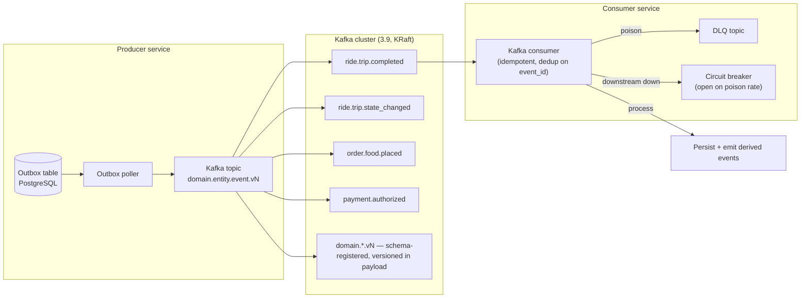

# Event Architecture

The platform is **event-driven** for cross-service integration. Synchronous
REST is used for read-your-writes within a workflow; events are used for
everything else.




## Broker

**Apache Kafka** is the default event broker. See ADR-0005.

Topic creation is managed as code (one topic per event name, with
`vN` baked in). Partition count is set per topic based on the aggregate
throughput target. Replication factor ≥ 3 in production.

Naming convention:

- Topics: `<domain>.<entity>.<event>` (kebab-case segments). No version
  in the topic name. Versioning is in the payload.
- Example: `ride.trip.completed` topic carries `trip.completed.v1`,
  `trip.completed.v2`, etc.

This lets us roll forward consumers without renaming topics.

## Event Envelope (Shared Kernel)

Every event — domain, integration, audit — uses this envelope:

```json
{
  "event_id": "01HZX9C8W6K0G3V2Y5N1Q4R7PB",
  "event_name": "trip.completed.v1",
  "occurred_at": "2026-07-29T10:42:11.183Z",
  "schema_version": 1,
  "producer": "trip-service",
  "tenant_id": "global",
  "correlation_id": "01HZX9C7T0XK2P9F0V6E4B1MZA",
  "causation_id": "01HZX9C8K4D2H1A8N5J7V3R0Q9",
  "aggregate_type": "Trip",
  "aggregate_id": "01HZX9C5S3B1L7K0P2F8V4T6YDA",
  "data": { /* event-specific */ }
}
```

| Field | Type | Required | Purpose |
|-------|------|----------|---------|
| `event_id` | ULID/UUIDv7 string | yes | Unique id; used for deduplication by consumers |
| `event_name` | string | yes | `<domain.entity.event.vN>` — e.g. `trip.completed.v1` |
| `occurred_at` | RFC3339 UTC | yes | When the event was emitted (producer's clock) |
| `schema_version` | int | yes | Major version of the event payload schema |
| `producer` | string | yes | Service that produced the event |
| `tenant_id` | string | yes | For multi-tenancy; `global` is the default |
| `correlation_id` | string | yes | Traces the business request; same across the whole flow |
| `causation_id` | string | no | `event_id` of the event that caused this one (if any) |
| `aggregate_type` | string | yes | Logical aggregate name (e.g. `Trip`, `FoodOrder`) |
| `aggregate_id` | string | yes | Aggregate id; used as the partition key |
| `data` | object | yes | Event-specific payload (see catalog) |

`event_id` MUST be unique per logical event. Producers use ULID or
UUIDv7 to ensure time-orderability within a producer.

## Partitioning

- **Partition key = `aggregate_id`.** This guarantees per-aggregate
  ordering across the topic.
- Producer-side: hash on `aggregate_id` (already a string).
- Consumer-side: one consumer instance per partition, with at-least-once
  delivery. Consumers are responsible for ordering within a partition.

## Delivery Semantics

- **At-least-once** by default. Producers use the **outbox pattern** to
  ensure a state change and its event are committed atomically.
- **Consumers MUST be idempotent.** Use the `event_id` to dedupe (an
  `inbox` table keyed by `event_id` with a TTL).
- **No exactly-once at the platform level.** Where exactly-once is
  required (financial), it is achieved by combining:
  - Outbox in the producer.
  - Inbox + idempotency key in the consumer.
  - Idempotency keys on the downstream API call.
  - Reconciliation job in `reporting-service`.

## Event Catalog (Top-Level)

The full list lives in `EVENT_CATALOG.md` (one row per event). Below is
the high-level grouping.

### Identity & Profile

| Event | Producer | Consumers |
|-------|----------|-----------|
| `identity.user.created.v1` | `identity-service` | `user-profile-service`, `customer-service`, `driver-service`, `courier-service`, `merchant-service`, `audit-service`, `analytics-service` |
| `identity.user.suspended.v1` | `identity-service` | every service that owns a profile, `notification-service` |
| `identity.user.disabled.v1` | `identity-service` | every service that owns a profile, `support-service` |
| `identity.session.revoked.v1` | `identity-service` | `audit-service` |
| `customer.created.v1` | `customer-service` | `audit-service`, `analytics-service` |
| `customer.suspended.v1` | `customer-service` | `ride-request-service`, `food-order-service`, `cart-service`, `payment-service` |
| `customer.segment.changed.v1` | `customer-service` | `promotion-service`, `loyalty-service`, `pricing-service` |
| `driver.created.v1` | `driver-service` | `audit-service`, `analytics-service` |
| `driver.approved.v1` | `driver-service` | `driver-availability-service`, `dispatch-service` |
| `driver.suspended.v1` | `driver-service` | `driver-availability-service`, `dispatch-service`, `ride-request-service` |
| `driver.document.expired.v1` | `driver-service` | `driver-availability-service`, `dispatch-service` |
| `courier.created.v1` | `courier-service` | `audit-service`, `analytics-service` |
| `courier.approved.v1` | `courier-service` | `courier-dispatch-service`, `courier-tracking-service` |
| `courier.suspended.v1` | `courier-service` | `courier-dispatch-service`, `delivery-service` |
| `vehicle.registered.v1` | `vehicle-service` | `driver-service`, `courier-service` |
| `vehicle.approved.v1` | `vehicle-service` | `driver-service`, `courier-service` |
| `vehicle.insurance.expired.v1` | `vehicle-service` | `driver-service`, `courier-service`, `driver-availability-service` |
| `address.created.v1` / `address.updated.v1` | `address-service` | `customer-service` (cache invalidation) |

### Geospatial & Zones

| Event | Producer | Consumers |
|-------|----------|-----------|
| `zone.updated.v1` | `zone-service` | `pricing-service`, `dispatch-service`, `courier-dispatch-service` |
| `zone.surge.updated.v1` | `zone-service` | `pricing-service`, `dispatch-service` |

### Platform

| Event | Producer | Consumers |
|-------|----------|-----------|
| `configuration.updated.v1` | `configuration-service` | every service (cache invalidation) |
| `feature_flag.updated.v1` | `feature-flag-service` | every service |
| `notification.sent.v1` / `notification.failed.v1` | `notification-service` | `support-service`, `audit-service` |
| `comms.sms.sent.v1` / `comms.email.sent.v1` / `comms.push.sent.v1` | `communication-gateway-service` | `notification-service`, `audit-service` |
| `file.uploaded.v1` / `file.scanned.v1` | `file-service` | `customer-service`, `driver-service`, `courier-service`, `merchant-service` |
| `admin.action.performed.v1` | `admin-service` | `audit-service` |
| `fraud.risk.scored.v1` | `fraud-risk-service` | `identity-service`, `payment-service`, `dispatch-service` |
| `fraud.account.blocked.v1` | `fraud-risk-service` | `identity-service` |
| `support.ticket.opened.v1` / `support.ticket.resolved.v1` | `support-service` | `notification-service`, `audit-service` |

### Ride-Hailing

| Event | Producer | Consumers |
|-------|----------|-----------|
| `ride.request.created.v1` | `ride-request-service` | `dispatch-service`, `pricing-service`, `audit-service` |
| `ride.request.matched.v1` | `ride-request-service` (on dispatch match) | `trip-service`, `notification-service`, `audit-service` |
| `ride.request.cancelled.v1` | `ride-request-service` | `notification-service`, `audit-service`, `pricing-service` (fee calc) |
| `ride.request.expired.v1` | `ride-request-service` | `dispatch-service`, `audit-service` |
| `driver.availability.online.v1` / `driver.availability.offline.v1` | `driver-availability-service` | `dispatch-service`, `driver-location-service` |
| `driver.availability.busy.v1` | `driver-availability-service` | `dispatch-service` |
| `driver.location.updated.v1` | `driver-location-service` | `dispatch-service`, `ride-safety-service`, `eta-routing-service` (curated) |
| `dispatch.matched.v1` | `dispatch-service` | `ride-request-service`, `trip-service`, `notification-service` |
| `dispatch.no_driver.v1` | `dispatch-service` | `ride-request-service`, `notification-service` |
| `dispatch.offer.expired.v1` | `dispatch-service` | `ride-request-service`, `dispatch-service` (next attempt) |
| `trip.started.v1` | `trip-service` | `ride-payment-integration-service`, `loyalty-service`, `ride-safety-service`, `notification-service`, `ride-history-service` |
| `trip.arrived.v1` | `trip-service` | `notification-service` |
| `trip.completed.v1` | `trip-service` | `ride-payment-integration-service`, `driver-earnings-service`, `driver-incentive-service`, `loyalty-service`, `review-rating-service`, `ride-history-service`, `notification-service`, `audit-service` |
| `trip.cancelled.v1` | `trip-service` | `ride-payment-integration-service`, `notification-service`, `audit-service` |
| `ride.payment.completed.v1` | `ride-payment-integration-service` | `driver-earnings-service`, `ride-history-service`, `audit-service`, `customer-service` (history) |
| `ride.payment.failed.v1` | `ride-payment-integration-service` | `support-service`, `notification-service`, `audit-service` |
| `driver.earning.accrued.v1` | `driver-earnings-service` | `ride-history-service`, `reporting-service` |
| `driver.incentive.earned.v1` | `driver-incentive-service` | `driver-earnings-service` |
| `driver.withdrawal.requested.v1` / `driver.withdrawal.completed.v1` | `driver-earnings-service` | `payment-service`, `audit-service` |
| `scheduled_ride.due.v1` | `scheduled-ride-service` | `ride-request-service` |
| `ride.safety.sos.v1` / `ride.safety.incident.v1` | `ride-safety-service` | `notification-service`, `support-service`, `audit-service` |
| `trip.reward.granted.v1` | `trip-service` | `driver-earnings-service`, `wallet-service`, `ledger-service` (info), `notification-service`, `audit-service` |
| `trip.reward.reversed.v1` | `trip-service` | `driver-earnings-service`, `wallet-service`, `ledger-service` (info), `notification-service`, `audit-service` |

### Food Marketplace

| Event | Producer | Consumers |
|-------|----------|-----------|
| `merchant.created.v1` / `merchant.approved.v1` / `merchant.suspended.v1` | `merchant-service` | `restaurant-service`, `restaurant-settlement-service`, `audit-service` |
| `restaurant.created.v1` | `restaurant-service` | `branch-service`, `menu-service`, `search-service`, `audit-service` |
| `restaurant.approved.v1` | `restaurant-service` | `search-service`, `menu-service` |
| `restaurant.online.v1` / `restaurant.offline.v1` | `restaurant-service` | `cart-service`, `search-service`, `courier-dispatch-service` |
| `branch.created.v1` / `branch.updated.v1` / `branch.hours.changed.v1` | `branch-service` | `menu-service`, `cart-service`, `courier-dispatch-service`, `search-service` |
| `branch.busy.v1` | `branch-service` | `courier-dispatch-service`, `cart-service` |
| `menu.created.v1` / `menu.updated.v1` | `menu-service` | `cart-service`, `search-service`, `inventory-service` |
| `menu.item.price.changed.v1` | `menu-service` | `cart-service` (re-quote) |
| `menu.item.unavailable.v1` | `menu-service` | `cart-service` (remove from cart), `search-service` |
| `inventory.item.out_of_stock.v1` / `inventory.item.restocked.v1` | `inventory-service` | `menu-service`, `cart-service`, `search-service` |
| `cart.created.v1` / `cart.updated.v1` / `cart.checked_out.v1` / `cart.abandoned.v1` | `cart-service` | `analytics-service`, `customer-service` (history) |
| `checkout.completed.v1` | `checkout-service` | `food-order-service`, `cart-service` (clear), `audit-service` |
| `checkout.failed.v1` | `checkout-service` | `cart-service` (re-enable), `notification-service` |
| `food.order.placed.v1` | `food-order-service` | `restaurant-order-mgmt-service`, `notification-service`, `analytics-service`, `audit-service` |
| `food.order.accepted.v1` | `food-order-service` (on accept) | `notification-service`, `customer-service` (history) |
| `food.order.rejected.v1` | `food-order-service` (on reject) | `food-payment-integration-service` (refund), `notification-service` |
| `food.order.preparing.v1` | `food-order-service` (via `restaurant-order-mgmt-service`) | `notification-service` |
| `food.order.ready.v1` | `food-order-service` (via `restaurant-order-mgmt-service`) | `courier-dispatch-service`, `notification-service` |
| `food.order.cancelled.v1` | `food-order-service` | `food-payment-integration-service` (refund), `notification-service` |

### Food Delivery & Couriers

| Event | Producer | Consumers |
|-------|----------|-----------|
| `delivery.courier.assigned.v1` | `courier-dispatch-service` | `delivery-service`, `food-order-service`, `notification-service` |
| `delivery.dispatch.no_courier.v1` | `courier-dispatch-service` | `food-order-service`, `notification-service` |
| `courier.location.updated.v1` | `courier-tracking-service` | `courier-dispatch-service`, `delivery-service` |
| `delivery.pickup.v1` | `delivery-service` | `notification-service` |
| `delivery.in_transit.v1` | `delivery-service` | `notification-service`, `customer-service` (history) |
| `delivery.completed.v1` | `delivery-service` | `food-payment-integration-service`, `courier-earnings-service`, `customer-service` (history), `notification-service`, `review-rating-service` |
| `delivery.failed.v1` | `delivery-service` | `food-order-service`, `food-payment-integration-service` (refund), `notification-service` |
| `courier.earning.accrued.v1` / `courier.withdrawal.*.v1` | `courier-earnings-service` | `reporting-service`, `audit-service` |

### Financial

| Event | Producer | Consumers |
|-------|----------|-----------|
| `payment.attempted.v1` | `payment-service` | `fraud-risk-service`, `audit-service` |
| `payment.authorized.v1` | `payment-service` | `ride-payment-integration-service`, `food-payment-integration-service`, `wallet-service` |
| `payment.captured.v1` | `payment-service` | `ride-payment-integration-service`, `food-payment-integration-service`, `wallet-service`, `ledger-service`, `audit-service` |
| `payment.failed.v1` | `payment-service` | `ride-payment-integration-service`, `food-payment-integration-service`, `notification-service` |
| `payment.refund.initiated.v1` / `payment.refund.completed.v1` | `payment-service` | `wallet-service`, `ledger-service`, `audit-service` |
| `wallet.credited.v1` / `wallet.debited.v1` / `wallet.held.v1` / `wallet.released.v1` | `wallet-service` | `ledger-service`, `customer-service`, `audit-service` |
| `ledger.posted.v1` | `ledger-service` | `reporting-service`, `audit-service` |
| `food.payment.completed.v1` | `food-payment-integration-service` | `customer-service` (history), `restaurant-settlement-service`, `courier-earnings-service`, `audit-service` |
| `food.payment.failed.v1` | `food-payment-integration-service` | `support-service`, `notification-service` |
| `merchant.settlement.accrued.v1` | `restaurant-settlement-service` | `merchant-service` (UI), `audit-service` |
| `merchant.payout.scheduled.v1` / `merchant.payout.completed.v1` | `restaurant-settlement-service` | `merchant-service`, `payment-service`, `audit-service` |

### Pricing & Rules

| Event | Producer | Consumers |
|-------|----------|-----------|
| `pricing.quote.created.v1` | `pricing-service` | `analytics-service` |
| `pricing.rating_density.applied.v1` | `pricing-service` | `analytics-service`, `reporting-service` |
| `pricing.loyalty_discount.applied.v1` | `pricing-service` | `analytics-service`, `reporting-service` |
| `pricing.geo_config.updated.v1` | `pricing-service` | `pricing-service`, `analytics-service`, `audit-service` |
| `promotion.created.v1` / `promotion.disabled.v1` | `promotion-service` | `cart-service`, `pricing-service` |
| `promotion.redeemed.v1` | `promotion-service` | `analytics-service`, `audit-service` |
| `loyalty.points.earned.v1` / `loyalty.points.burned.v1` / `loyalty.tier.changed.v1` | `loyalty-service` | `customer-service` (UI), `analytics-service` |
| `loyalty.frequent_zone.aggregated.v1` | `loyalty-service` | `pricing-service` (helper) |
| `tax.calculated.v1` | `tax-service` | `analytics-service` |
| `review.submitted.v1` / `review.aggregated.v1` | `review-rating-service` | `driver-service` (rating), `courier-service` (rating), `restaurant-service` (rating), `analytics-service` |
| `review.zone_aggregated.v1` | `review-rating-service` | `pricing-service` (helper) |

## Schema Evolution

- **Within a major version**: producers may add optional fields.
  Consumers MUST ignore unknown fields. Use JSON Schema validation at
  ingress to enforce this contract.
- **Across major versions**: producers MAY publish both `*.v1` and
  `*.v2` events simultaneously for a deprecation window (≥ 6 months).
  Consumers migrate, then deprecate `*.v1`. A consumer can opt to consume
  both and dispatch internally.
- **Removing a field**: requires a major version bump.
- **Renaming a field**: requires a major version bump.
- **Changing a field's type**: requires a major version bump.
- **Changing a partition key**: requires a new topic.

## Outbox Pattern (Producer Side)

Every service that emits events uses the **outbox pattern**:

1. Inside the same DB transaction that mutates state, also write a row
   to the `outbox` table (`event_id`, `topic`, `payload`, `headers`,
   `created_at`, `claimed_at`).
2. A separate poller (or Debezium-style logical decoding) reads the
   outbox, publishes to Kafka, and marks the row as published.
3. If publishing fails, the row remains and is retried.
4. Outbox rows are purged after the broker confirms (e.g. 24h).

This guarantees: a state change and its event are atomic. The
alternative (publish-then-commit) loses events when the commit fails.

## Inbox Pattern (Consumer Side)

Every consumer maintains an `inbox` table:

- `event_id` (PK)
- `consumer`
- `received_at`
- `processed_at` (nullable)
- `error` (nullable)

On receive:

1. Insert `event_id` (no-op on duplicate → treat as already processed).
2. Process the event.
3. Update `processed_at`.

This is the consumer's idempotency key. The handler body MUST be safe
to re-run (idempotent) for full correctness in case the consumer crashes
between step 2 and 3.

## Dead-Letter Topics

Every topic has a paired `<topic>.dlq`. Consumers route a message to the
DLQ when:

- It cannot be deserialized (poison message).
- A handler raises an unhandled exception after N retries with
  exponential backoff.
- A business rule fails validation consistently.

DLQ messages are inspected via tooling (`replay-cli` or
`admin-service` → DLQ inspector UI). DLQ retention: 30 days.

## Replay

A topic's history is replayable by resetting consumer offsets (or by a
dedicated replay consumer that writes to a new topic). The
`analytics-service` and `reporting-service` use this on a fresh
schema migration.

## Anti-Patterns Explicitly Avoided

- Event chains of more than 3 hops without a corresponding saga or
  observable flow.
- "Events" that are just internal method calls serialised — those are
  commands, use REST.
- Broadcasting an entire aggregate as the event payload — emit
  deltas + a stable `aggregate_id`, let consumers fetch the latest.
- Coupling consumers to the producer's internal class names — event
  payload schemas are owned by the event, not the service.