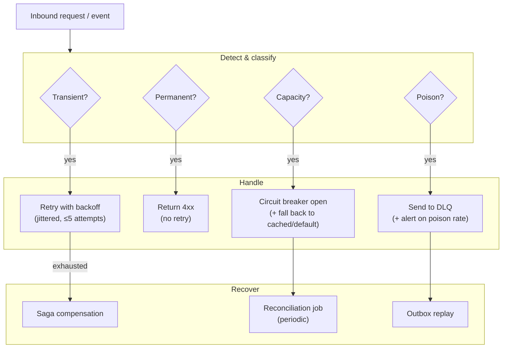

# Failure Handling

This document covers patterns and rules for handling failure in a
distributed system. Each service's `INTEGRATION.md` and
`WORKFLOWS.md` applies these to its specific flows. References to
absorbed capabilities (`ride-payment-integration-service`,
`driver-earnings-service`, etc.) are written as inline capability
labels under the surviving service per
[[trips-enjoy-service-consolidation-payment-centralization]].

## The Five Failure Categories

| Category | Description | Example |
|----------|-------------|---------|
| Transient | Will succeed on retry | Network blip, lock contention |
| Permanent | Will not succeed on retry | Validation error, 404, 409 |
| Capacity | Downstream is overloaded | 503 from upstream |
| Poison | Cannot be processed by this consumer | Malformed event, unhandled schema |
| Cascading | Failure of one component is propagating | Tight coupling, no circuit breaker |

Each category has a different handler.

## Timeouts

- Every outbound call has an explicit timeout.
- Defaults:
  - Gateway → service: 2s.
  - Service → service: 1s.
  - Service → DB: 30s (statement timeout).
  - Service → Kafka: 5s for the producer ack.
- Timeouts are enforced client-side, not just network-side.

## Retries

- **Bounded**: max attempts (default 3).
- **Exponential backoff with jitter**: e.g. 100ms, 400ms, 1.6s +
  ±20%.
- **Retryable status codes**: 408, 429, 500, 502, 503, 504.
- **Not retryable**: 400, 401, 403, 404, 409, 422.
- **Idempotency**: every retry sends the same `Idempotency-Key`.
- The client respects `Retry-After` from upstream when present.

## Circuit Breakers

- Every outbound call is wrapped in a circuit breaker.
- States: Closed (normal), Open (fast-fail), Half-Open (probe).
- Default: open after 5 consecutive failures or 50% failure rate
  over a 30s window; half-open after 30s with 1 probe request.
- When open, calls fail fast with `code: "CIRCUIT_OPEN"`.
- Each service exposes `circuit_breaker_state{downstream}` as a
  metric.

## Bulkheads

- Outbound calls are isolated into separate thread pools /
  connection pools per downstream.
- A slow downstream cannot exhaust the pool used for healthy
  downstreams.

## Idempotency

- Idempotency is required for every non-idempotent operation.
- For HTTP: `Idempotency-Key` header.
- For events: `event_id` deduplication in the consumer's inbox.
- For money: the operation's effect is keyed on
  `(payment_intent_id, action)` so a replay is a no-op.

## Transactional Outbox

Producers MUST use the outbox pattern:

1. In the same DB transaction that mutates state, also write to
   the `outbox` table.
2. A poller (or Debezium) reads the outbox and publishes to Kafka.
3. The poller marks rows as published after broker ack.
4. Failures are retried with backoff; permanent failures go to
   the outbox DLQ.

See [`EVENT_ARCHITECTURE.md`](EVENT_ARCHITECTURE.md) for the full
pattern.

## Inbox and Deduplication

Consumers MUST use the inbox pattern:

1. On receive, insert `event_id` into `inbox` (no-op on
   duplicate).
2. Process the event.
3. Update `processed_at` on success.

This is the consumer-side idempotency guarantee. The handler MUST
be safe to re-run.

## Saga Pattern

For multi-step cross-service workflows, the platform uses
**sagas**. Two flavors:

### Orchestrated

A dedicated **saga service / in-service saga state machine** owns
the state machine and tells each participant what to do via REST
or events. Example: `payment-service` (ride saga) orchestrates the
ride-payment saga inside the `payment-service` binary.

- Pro: clear visibility, easy to evolve.
- Con: orchestrator is a critical component.

### Choreographed

Each service reacts to events from the previous step. No central
orchestrator. Example: a simple "trip completed → email receipt"
flow where `notification-service` reacts to `trip.completed.v1`.

- Pro: no single point of failure.
- Con: harder to see the whole flow; compensations are implicit.

The platform uses **orchestrated sagas for financial flows** (per
[ADR-0010](adrs/0010-saga-pattern.md)) and **choreographed flows
for non-financial cross-service notifications**. For the 17
cross-cutting flows named by
[ADR-0018](adrs/0018-workflow-engine-conductor.md), Conductor's
`compensationSteps` primitive executes the same compensation
matrix below (see "External Engine Workflows" at the end).

## Compensation

Every saga has a defined compensation for each forward step:

| Forward step | Compensation |
|--------------|--------------|
| `payment.authorized` | `payment.void` (or refund if captured) |
| `payment.captured` | `payment.refund` |
| `wallet.credited` | `wallet.debit` |
| `wallet.held` | `wallet.release` |
| `food.order.accepted` | `food.order.cancelled` (with compensation policy) |
| `driver.assigned` | `driver.released` |
| `courier.assigned` | `courier.released` |
| `loyalty.points.burned` | `loyalty.points.returned` |
| `ledger.posted` | `ledger.reversal` (append-only reversal row, never UPDATE) |
| `trip.reward.granted` | `trip.reward.reversed` (Phase 7 Conductor flow) |

Compensations are **not** "undo everything." They are explicit
business actions that restore an acceptable state. For example,
"void an authorization" is the compensation for "authorize";
"refund" is the compensation for "capture." Reversal of any
append-only inviolable row (ledger postings, audit rows,
reporting fact rows) MUST be a new reversal row, never UPDATE /
DELETE — this mirrors the reversal rule from
[[accounting-four-layer-truth-model]].

## Dead-Letter Queues

Every topic has a paired `<topic>.dlq`. Messages are routed to
DLQ when:

- They cannot be deserialized.
- A handler raises an unhandled exception after N retries.
- A business rule fails validation consistently.

DLQ messages are inspected via tooling. Retention: 30 days.
Replay tooling: `replay-cli` (or the `admin-service` console's
"Replay DLQ" UI).

## Reconciliation Jobs

Scheduled jobs in `reporting-service` (and per-service for
specific checks) detect and repair drift:

- Wallet balance vs. sum of ledger postings.
- Food orders `delivered` without `food.payment.completed`.
- Trip `completed` without `ride.payment.completed`.
- Promotion redemptions counted twice.
- Stale `*.in_transit` deliveries not moving in N minutes.
- Configuration drift (a key in prod that doesn't exist in the
  registry).

Drift findings open a `support.ticket` and emit a
`reconciliation.drift.found.v1` event.

## Idempotency Example: Trip Completion + Payment + Driver Earning

Forward flow (orchestrated by `payment-service` ride saga inside
the `payment-service` binary):

1. `trip-service` marks trip `completed` and emits
   `trip.completed.v1`.
2. `payment-service` ride saga (orchestrator) consumes.
3. Orchestrator calls `payment-service.capture` with
   `Idempotency-Key: trip:<trip_id>:capture`.
4. On success, orchestrator emits `payment.captured.v1`
   (downstream of the provider) and the saga advances.
5. Orchestrator calls `payment-service` (driver earnings).accrue
   with `Idempotency-Key: trip:<trip_id>:earning`.
6. Orchestrator emits `ride.payment.completed.v1`.
7. `ledger-service` records the double-entry posting.

Compensation if step 3 fails (e.g. card declined):

1. Orchestrator calls `payment-service.void` (compensation) —
   but the authorization may have already failed; this is a
   no-op.
2. Orchestrator emits `ride.payment.failed.v1`.
3. `notification-service` informs the customer.
4. `admin-service` (support module) opens a ticket tagged
   `payment_failed`.
5. Manual resolution; or retry after the customer updates the
   payment method.

The saga tracks state in the `payment-service` database keyed by
`trip_id`. The saga is **idempotent**: replaying the same
`trip.completed.v1` re-enters the same saga state and produces the
same result.

## Idempotency Example: Promotion Redemption

Forward flow:

1. `food-order-service` (cart sub-aggregate) calls
   `pricing-service` (promotion sub-aggregate).redeem with
   `Idempotency-Key: cart:<cart_id>:promo:<code>`.
2. `pricing-service` (promotion) checks the `redemptions` table
   for the key.
3. If found, returns the prior result.
4. If not, validates the rule, inserts a redemption, returns
   success.

This prevents double-redemption even if `food-order-service`
(cart) retries.

## Anti-Patterns Explicitly Avoided

- Distributed ACID transactions between services.
- Retries without idempotency.
- Catching all exceptions and continuing ("swallowing the
  error").
- Catching all exceptions and 500ing without logging.
- Long-lived locks (database, Redis, Zookeeper) for
  synchronization.
- Polling where events would work.
- Coupling critical paths to a non-critical downstream without a
  circuit breaker.
- "Best-effort" event publishing (no outbox).
- "Best-effort" event consumption (no inbox).

## See also

- [`SERVICE_ISOLATION.md`](./SERVICE_ISOLATION.md) — **the
  playbook** for which combination of timeout / bulkhead / circuit
  / retry / fallback to use for each downstream class (CRITICAL /
  DEGRADABLE / BEST-EFFORT). Includes the platform dependency
  matrix and the 12 anti-patterns.
- [`DOWNSTREAM_ERROR_CATALOG.md`](./DOWNSTREAM_ERROR_CATALOG.md) —
  the canonical error-code catalog. When a downstream returns an
  error, this doc tells you whether to forward, translate,
  degrade, or reject.
- [`CONSISTENCY_STRATEGY.md`](./CONSISTENCY_STRATEGY.md) — where
  strong vs eventual consistency applies.
- [`OBSERVABILITY.md`](./OBSERVABILITY.md) — the metrics, traces,
  and logs that surface failures.
- [`../shared/CONVENTIONS.md` 1](../shared/CONVENTIONS.md) — the
  RFC 7807 error envelope every service emits.

## External Engine Workflows (Conductor)

Per [ADR-0018](adrs/0018-workflow-engine-conductor.md), the
platform adopts Netflix Conductor as a workflow engine for **17
cross-cutting workflows across 5 flow families** across **15
participating services**:

| Flow family | Workflows | Owner | Conductor wins because |
|---|---|---|---|
| Phase 7 — Guaranteed Rewards fan-out | `wf.phase7.reward_grant.v1`, `wf.phase7.reward_reversal.v1` (2) | `trip-service` | Multi-consumer fan-out > 6 (driver earnings, wallet, ledger, notification, audit, reporting) with strict ordering + per-step idempotency + reversal |
| Phase 7.5 — Make-a-Deal kernel | `wf.phase75.deal_rider.v1`, `wf.phase75.deal_driver.v1`, `wf.phase75.deal_food.v1` (3) | `trip-service` / `food-order-service` | TTL-driven timers (`deal.window.ttl_seconds`, `deal.bid.ttl_seconds`, `deal.max_counter_rounds`) |
| Refund orchestration | `wf.refund.{standard,partial,food_reject,cancellation,dispute,cod_failed}.v1` (6) | `payment-service` | N-step compensation ordering across 6 categories |
| Driver/Courier onboarding | `wf.onboarding.{driver,courier}.v1` (2) | `driver-service` / `courier-service` | Long-running (days–weeks) human-task workflows with SLA timers (KYC 24h, manual approval 24h, training 7d, vehicle inspection 3d) |
| Service-request | `wf.service_request.{access,change,service_onboarding,time_bounded_alias}.v1` (4) | `admin-service` | Operator-initiated self-service with formal HUMAN TASK approvals (platform.admin / platform.super_admin) |

The compensation matrix above is **executed** by Conductor's
`compensationSteps` block — Conductor does not replace the matrix;
it executes it. The per-flow compensation order is encoded in the
workflow JSON DSL and follows the same reverse-order convention.
Append-only rows (ledger, audit, reporting fact rows) get a
**reversal row**, never UPDATE/DELETE — mirrors the rule from
[[accounting-four-layer-truth-model]].

Conductor's first-class `compensationSteps` primitive is the
rationale for adopting it over the in-service saga pattern (per
[ADR-0010](adrs/0010-saga-pattern.md)) for these flows: the
in-service pattern requires hand-rolled rollback ordering per
flow, which scales linearly with the number of compensation
branches (refunds have 6 categories × distinct compensation
paths).

For all other workflows, the in-service saga pattern from
[ADR-0010](adrs/0010-saga-pattern.md) remains the default. In
particular, the `payment-service` ride-saga and food-saga stay on
the in-service pattern at 99.99% SLO.

The canonical workflow definitions live in
[`shared/CONDUCTOR_WORKFLOWS.md`](../shared/CONDUCTOR_WORKFLOWS.md);
the master task registry mirrors per-flow task IDs in
[`MASTER_TASK.md`](../MASTER_TASK.md) 7-9.
