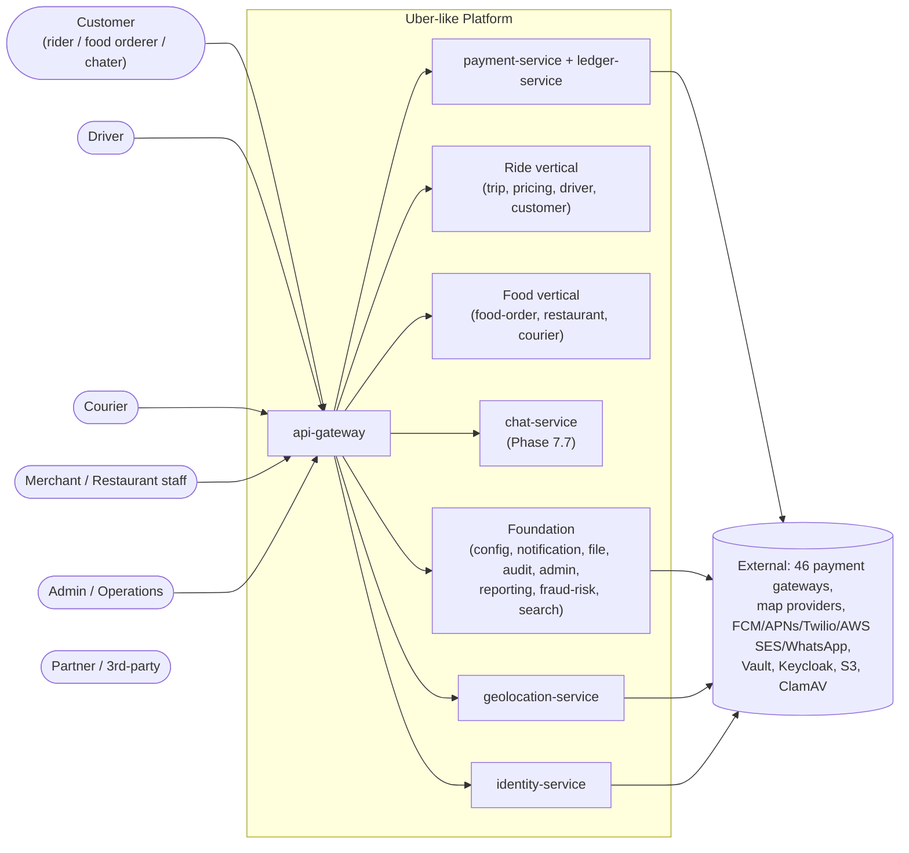
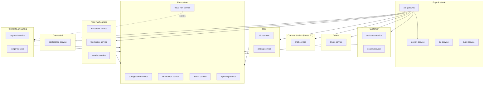

# High-Level Design (HLD)

> **Platform:** Uber-like ride-hailing + food-delivery + chat platform
> **Scope:** System-level architecture — the 30,000-foot view for engineers, operators, and stakeholders who need to understand *what* the platform is, *how* the parts compose, and *where* to find the details.
> **Format:** This document is a **navigational hub**. It links out to the existing authoritative docs in [`architecture/`](.) and [`shared/`](../shared/README.md). It does not duplicate content — when you need depth, follow the link.

---

## 1. What this platform is

A production-grade, configurable, microservices platform combining **ride-hailing**, **food delivery**, and shared platform capabilities, on top of one identity / payment / notification / configuration fabric.

- **Two consumer-facing products:** ride-hailing (driver/customer matching, trip lifecycle, dynamic pricing), food delivery / marketplace (merchant onboarding, menu, order lifecycle, courier dispatch).
- **One shared foundation:** identity (Keycloak), payments (46-gateway registry), notifications (multi-channel + WhatsApp), configuration (runtime-tunable), operations (admin, audit, reporting, fraud-risk, search).
- **One communication kernel (Phase 7.7):** `chat-service` — 1:1 in-app chat threads between the two participants of any service context (rider ↔ driver, customer ↔ restaurant, customer ↔ courier).

Read [`architecture/SYSTEM_OVERVIEW.md`](SYSTEM_OVERVIEW.md) for the plain-English summary, or [`architecture/ARCHITECTURE.md`](ARCHITECTURE.md) for the architectural style and non-negotiables.

## 2. Architectural style

| Dimension | Choice | ADR |
|-----------|--------|-----|
| Decomposition | **Microservices** (21 active services; 58 → 20 → 21 consolidation) | [ADR-0001](adrs/0001-microservices-architecture.md), [ADR-0017](adrs/0017-20-service-architecture.md) |
| Data | **PostgreSQL 19, one schema per service, no shared databases** | [ADR-0002](adrs/0002-postgres-per-service.md) |
| Identity | **Keycloak** as central identity platform (mirrored via `identity-service`) | [ADR-0003](adrs/0003-keycloak-for-identity.md) |
| Sync API | **REST** (HTTP/JSON; OpenAPI 3.x) | [ADR-0004](adrs/0004-rest-as-primary-api.md) |
| Async API | **Apache Kafka** (per-domain topics; event-sourced state transitions) | [ADR-0005](adrs/0005-kafka-as-event-broker.md) |
| Caching / sessions / rate-limit | **Redis** | [ADR-0006](adrs/0006-redis-for-cache-and-rate.md) |
| Geospatial | **PostGIS** inside PostgreSQL | [ADR-0007](adrs/0007-postgis-for-geospatial.md) |
| Edge | **API gateway** (Go/Envoy) terminates TLS, validates JWT, terminates WebSocket | [ADR-0008](adrs/0008-api-gateway.md) |
| Event publication | **Transactional outbox** per producer | [ADR-0009](adrs/0009-transactional-outbox.md) |
| Cross-service workflows | **Sagas** by default; **Netflix Conductor** for 17 named cross-cutting workflows across 5 flow families | [ADR-0010](adrs/0010-saga-pattern.md), [ADR-0018](adrs/0018-workflow-engine-conductor.md) |
| Observability | **OpenTelemetry** (traces, metrics, logs) | [ADR-0011](adrs/0011-opentelemetry-observability.md) |
| Orchestration | **Kubernetes** | [ADR-0012](adrs/0012-kubernetes-orchestration.md) |
| Financial ledger | **Double-entry ledger** for every money movement | [ADR-0013](adrs/0013-double-entry-ledger.md) |
| Configuration | **Externalized via `configuration-service`** (no env-only config) | [ADR-0014](adrs/0014-externalize-configuration.md) |
| IDs | **UUIDv7** for new identifiers (time-orderable) | [ADR-0015](adrs/0015-uuidv7-for-ids.md) |
| Edge request id | **Polymorphic** at the edge (X-Request-Id ↔ X-Correlation-Id alias) | [ADR-0019](adrs/0019-request-id-at-the-edge.md), [ADR-0020](adrs/0020-polymorphic-request-id.md) |

## 3. Top-level architecture

### 3.1 C4 System Context (read in [SYSTEM_OVERVIEW.md](SYSTEM_OVERVIEW.md))

### 3.2 Container view — bounded contexts

The 21 services partition into the bounded contexts defined in [`architecture/DOMAIN_MAP.md`](DOMAIN_MAP.md) and their relationships in [`architecture/CONTEXT_MAP.md`](CONTEXT_MAP.md). The full ownership / data / dependency matrix is in [`architecture/MICROSERVICES_MAP.md`](MICROSERVICES_MAP.md) and [`architecture/DATA_OWNERSHIP.md`](DATA_OWNERSHIP.md).

> **Channel Layer (the L0 in [`ARCHITECTURE.md`](ARCHITECTURE.md) Layered View).** Mobile apps, web apps, partner portals, and internal consoles all consume the platform's design system ([`shared/DESIGN_SYSTEM.md`](../shared/DESIGN_SYSTEM.md)). The design system is the **frontend sibling** of the backend's `platform-spring-boot-starter` shared library: visual + behavioral + i18n/RTL + accessibility (WCAG 2.2 AA) + theming.

## 4. Service catalog (21 services)

The canonical, per-row service catalog lives in [`services/README.md`](../services/README.md). Quick reference (one-liner per service):

| Service | One-liner | Tier | Tech |
|---------|-----------|------|------|
| [`api-gateway`](../services/api-gateway/README.md) | Single stateless north-south edge; JWT validation, rate limit, request transformation; WSS termination for `chat-service` | 1 | Go/Envoy |
| [`identity-service`](../services/identity-service/README.md) | Thin adapter over Keycloak; mirrors `sub` → stable `identity_id`; caches profile claims | 1 | Node/TS |
| [`file-service`](../services/file-service/README.md) | File/media storage abstraction; KYC, menu photos, vehicle photos, **chat attachments** (bytes only) | 1 | Go |
| [`audit-service`](../services/audit-service/README.md) | Immutable audit log of every audit-relevant event; strict-RBAC search API | 1 | Go |
| [`configuration-service`](../services/configuration-service/README.md) | Source of truth for business rules + flags; hosts `chat.*` keys | 0 | Kotlin/Spring |
| [`notification-service`](../services/notification-service/README.md) | Multi-channel messaging orchestrator; templates, preferences, delivery state, **offline push fallback for chat-service** | 2 | Kotlin/Spring |
| [`admin-service`](../services/admin-service/README.md) | Operations console + absorbed support module; opens support tickets on `chat.message.reported.v1` | 2 | Kotlin/Spring |
| [`reporting-service`](../services/reporting-service/README.md) | Read-model + dashboards + data-lake ingestion; consumes every `chat.*.v1` | 6 | Kotlin/Spring |
| [`fraud-risk-service`](../services/fraud-risk-service/README.md) | Real-time risk scoring; consumes `chat.message.reported.v1` as abuse signal | 2 | Python/FastAPI |
| [`customer-service`](../services/customer-service/README.md) | Source of truth for customer profile + cross-persona + addresses + loyalty account | 2 | Kotlin/Spring |
| [`search-service`](../services/search-service/README.md) | Search index coordination across verticals; absorbs search-review projection | 6 | Kotlin/Spring |
| [`driver-service`](../services/driver-service/README.md) | Source of truth for driver profile + KYC + online + location + match + incentives + vehicles | 2 | Kotlin/Spring |
| [`trip-service`](../services/trip-service/README.md) | Owns the trip aggregate + ride-request + scheduled + ride safety + ride history + trip reviews | 4 | Kotlin/Spring |
| [`pricing-service`](../services/pricing-service/README.md) | Pure computational engine for ride + order quotes; absorbs tax + promotions + loyalty rules | 3 | Kotlin/Spring |
| [`restaurant-service`](../services/restaurant-service/README.md) | Owns restaurant + merchant + branch + menu + inventory + staff | 3 | Kotlin/Spring |
| [`food-order-service`](../services/food-order-service/README.md) | Owns food order + cart + checkout + queue + food reviews | 5 | Kotlin/Spring |
| [`courier-service`](../services/courier-service/README.md) | Owns courier profile + dispatch + tracking + delivery aggregate | 2 | Kotlin/Spring |
| [`geolocation-service`](../services/geolocation-service/README.md) | Geocoding + ETA + routing + zones + cities; absorbs eta-routing + zones | 1 | Go |
| [`payment-service`](../services/payment-service/README.md) | Anti-corruption layer over 46 payment gateways; wallet + ride/food sagas + earnings + settlement + COD | 3 | Kotlin/Spring |
| [`ledger-service`](../services/ledger-service/README.md) | Platform's authoritative double-entry financial ledger | 1 | Node/TS |
| [`chat-service`](../services/chat-service/README.md) *(Phase 7.7)* | 1:1 in-app chat threads (rider↔driver, customer↔restaurant, customer↔courier); WebSocket fan-out via Redis Pub/Sub; sole writer of the `chat` schema | 1 | Go/chi + coder/websocket + pgx |

> **Note on tier numbering:** tiers are documented in [`architecture/MICROSERVICES_MAP.md`](MICROSERVICES_MAP.md); they're sequencing indicators (Tier 0 must exist before Tier 1, etc.), not deployment tier meanings. See [`services/README.md`](../services/README.md) for cross-cutting views (by data owner, by event producer, by tech profile, by workflow participation).

## 5. Cross-cutting concerns

| Concern | Canonical doc |
|---------|---------------|
| Security (AuthN/Z, secrets, PII, PCI) | [`architecture/SECURITY_ARCHITECTURE.md`](SECURITY_ARCHITECTURE.md) |
| Identity (Keycloak realms, clients, token flow) | [`architecture/KEYCLOAK_ARCHITECTURE.md`](KEYCLOAK_ARCHITECTURE.md) |
| Observability (logs, metrics, traces, audit) | [`architecture/OBSERVABILITY.md`](OBSERVABILITY.md) |
| Failure handling (timeouts, retries, breakers, outbox, sagas, DLQ) | [`architecture/FAILURE_HANDLING.md`](FAILURE_HANDLING.md) |
| Service isolation (per-class timeout/bulkhead/circuit/fallback) | [`architecture/SERVICE_ISOLATION.md`](SERVICE_ISOLATION.md) |
| Downstream error catalog (canonical error codes + propagation rules) | [`architecture/DOWNSTREAM_ERROR_CATALOG.md`](DOWNSTREAM_ERROR_CATALOG.md) |
| Consistency strategy (per-context strong vs eventual) | [`architecture/CONSISTENCY_STRATEGY.md`](CONSISTENCY_STRATEGY.md) |
| Configuration (hierarchy, override rules) | [`architecture/CONFIGURATION_ARCHITECTURE.md`](CONFIGURATION_ARCHITECTURE.md) |
| Deployment (Docker, Kubernetes, environments) | [`architecture/DEPLOYMENT_ARCHITECTURE.md`](DEPLOYMENT_ARCHITECTURE.md) |
| Platform baseline (PostgreSQL 19, Kafka, Keycloak, Redis, OTel, Vault) | [`shared/PLATFORM_BASELINE.md`](../shared/PLATFORM_BASELINE.md) |

## 6. Data architecture

- **One PostgreSQL 19 schema per service.** No cross-service FKs; cross-service references are UUID columns without DB FK ([`architecture/DATA_OWNERSHIP.md`](DATA_OWNERSHIP.md)).
- **PostGIS** inside PostgreSQL for geolocation-service zones/ETA/routing ([ADR-0007](adrs/0007-postgis-for-geospatial.md)).
- **Migrations:** Flyway / Liquibase per service; forward-only; deployed as separate jobs ([`architecture/DATABASE_ARCHITECTURE.md`](DATABASE_ARCHITECTURE.md)).
- **UUIDv7** for new identifiers (time-orderable) ([ADR-0015](adrs/0015-uuidv7-for-ids.md)).
- **Audit columns** (`created_at`, `updated_at`, `created_by`, `updated_by`) on every mutable table; soft delete via `deleted_at` where appropriate.
- **Outbox tables** for event publication per producer ([ADR-0009](adrs/0009-transactional-outbox.md)).
- **Inbox tables** for event consumers (idempotency by `event_id`).

## 7. Event architecture

- **Kafka per-domain topics** ([ADR-0005](adrs/0005-kafka-as-event-broker.md)). Topic naming: `<domain>.<entity>.<event>.v<N>` (e.g. `payment.attempted.v1`).
- **Event envelope** standardized — every payload wraps `event_id`, `occurred_at`, `aggregate_id`, `data`, `correlation_id`, `causation_id`. See [`architecture/EVENT_ARCHITECTURE.md`](EVENT_ARCHITECTURE.md).
- **Polymorphic `request_id`** at the edge ([ADR-0020](adrs/0020-polymorphic-request-id.md)) — one canonical id per business request, saga-keyed, propagated through payment-service, ledger-service, audit-service, reporting-service, notification-service, trip-service.
- **Partition key** = `aggregate_id` (preserves order per aggregate).
- **DLQ** per topic (`<topic>.dlq`).
- **Schema evolution**: additive changes stay in `v1`; breaking changes get `v2` and the old topic is drained before cutover.

## 8. API architecture

- **REST** primary ([ADR-0004](adrs/0004-rest-as-primary-api.md)). `/v1/<resource>` URI versioning; major breaking changes get `/v2`.
- **Error envelope** standardized — `code` (machine-readable), `message`, `correlationId`, `details[]`. See [`architecture/API_STANDARDS.md`](API_STANDARDS.md) + [`architecture/DOWNSTREAM_ERROR_CATALOG.md`](DOWNSTREAM_ERROR_CATALOG.md).
- **Idempotency-Key header** required on every state-changing endpoint.
- **Bearer JWT** (validated at the gateway); service-account tokens for service-to-service.
- **OpenAPI 3.x** per service published as part of CI.
- **WebSocket** for the chat kernel: `WSS://api.<region>.trips-enjoy.com/v1/chat/ws`, terminated at the gateway.

## 9. Identity & security

- **Keycloak** central identity ([ADR-0003](adrs/0003-keycloak-for-identity.md)) — one realm per persona (rider / driver / courier / merchant / admin / partner / service-account); brokers federate social/enterprise.
- **`identity-service`** is the thin adapter that mirrors `sub` → stable internal `identity_id` (UUIDv7).
- **RBAC** scopes per service: `<service>.admin` + cross-cutting scopes like `platform.super_admin`, `support.admin`. Super-admin presets enumerated by `admin-service` (1 × `platform.super_admin` + 20 × `<service>.admin`).
- **mTLS** between services inside the mesh; JWT at the gateway for external traffic.
- **Vault** for secrets (per-gateway credentials, OAuth client secrets, DB credentials). Mounted at startup; rotated quarterly.
- **PCI-DSS SAQ-A** scope for `payment-service` — gateway-hosted fields/SDK tokenization; the platform never touches PAN/CVV.

## 10. Deployment topology

- **Kubernetes** ([ADR-0012](adrs/0012-kubernetes-orchestration.md)). Per-region cluster; blue/green per release.
- **Multi-stage Dockerfiles** (see [`shared/OSS_DEPENDENCIES.md`](../shared/OSS_DEPENDENCIES.md) for OSS baseline; per-service skeleton manifest at `services/<svc>/SKELETON.{gradle.kts,go.mod,pyproject.toml}`).
- **HPA** on per-service primary metric (RPS for hot path; Kafka lag for ingest; p99 latency for SLO-bound).
- **Migrations** as separate jobs; forward-only.
- **Vault sidecar** for secret injection.

## 11. Non-functional requirements (per service)

Every service has these documented in its `SRS.md` 18:

| SLO class | Target | Examples |
|-----------|--------|----------|
| T0 | 99.99% | `api-gateway`, `identity-service`, `ledger-service` |
| T1 | 99.95% | `trip-service`, `pricing-service`, `payment-service` |
| T2 | 99.9% | Most business-core services |
| T3 | 99.5% | Search, reporting, ML |

Latency budgets by hot path are per-service and pinned in their `SRS.md` 16.

## 12. Phased rollout

The platform rolls out in **9 phases** ([`IMPLEMENTATION_PHASES.md`](../IMPLEMENTATION_PHASES.md)):

| Phase | Focus |
|-------|-------|
| 1 | Platform foundation (config, identity, geo, api-gateway, notification ACL, file, audit, ledger) |
| 2 | Core business & identity (customer, driver, courier, notification, admin, payment, fraud-risk, pricing) |
| 3 | Ride-hailing (trip, geo zones) |
| 4 | Food marketplace (restaurant, food-order, search) |
| 5 | Food delivery & financial (saga hardening) |
| 6 | Analytics & enhancements (reporting) |
| 7 | Cross-cutting — guaranteed rewards & rating-based pricing |
| 7.5 | Cross-cutting — Make-a-Deal kernel (`shared/DEAL_FEATURE.md`) |
| 7.7 | Cross-cutting — Communication Kernel (`chat-service`) |
| 8 | Operations hardening |

## 13. Where to go next

- **Plain-English overview** → [`architecture/SYSTEM_OVERVIEW.md`](SYSTEM_OVERVIEW.md)
- **Service catalog** → [`services/README.md`](../services/README.md)
- **Service catalog (table form)** → [`architecture/MICROSERVICES_MAP.md`](MICROSERVICES_MAP.md)
- **Bounded contexts + relationships** → [`architecture/DOMAIN_MAP.md`](DOMAIN_MAP.md), [`architecture/CONTEXT_MAP.md`](CONTEXT_MAP.md)
- **Source-of-truth matrix** → [`architecture/DATA_OWNERSHIP.md`](DATA_OWNERSHIP.md)
- **Integration matrix** → [`SERVICE_INTEGRATION_MATRIX.md`](../SERVICE_INTEGRATION_MATRIX.md)
- **ADRs** → [`architecture/ADR_INDEX.md`](ADR_INDEX.md)
- **Reading order (top-to-bottom tour)** → [`docs/README.md`](../README.md)
- **Platform baseline** → [`shared/PLATFORM_BASELINE.md`](../shared/PLATFORM_BASELINE.md)
- **OSS attribution** → [`shared/OSS_DEPENDENCIES.md`](../shared/OSS_DEPENDENCIES.md)
- **End-to-end workflows** → [`workflows/`](../workflows/RIDE_WORKFLOWS.md)
- **Implementation roadmap** → [`IMPLEMENTATION_PHASES.md`](../IMPLEMENTATION_PHASES.md), [`MASTER_PLAN.md`](../MASTER_PLAN.md)
- **Task-level detail** → [`MASTER_TASK.md`](../MASTER_TASK.md)
- **Component-level design (LLD)** → [`LLD.md`](LLD.md) *(companion to this document)*
- **Per-service documentation contract** → [`architecture/SERVICE_DOC_TEMPLATE.md`](SERVICE_DOC_TEMPLATE.md)
- **Validation report (risks + open questions)** → [`architecture/VALIDATION_REPORT.md`](VALIDATION_REPORT.md)

---

## 14. Source docs this HLD consolidates

This HLD is a navigational summary of the following authoritative docs (full content lives in each):

- [`architecture/SYSTEM_OVERVIEW.md`](SYSTEM_OVERVIEW.md)
- [`architecture/ARCHITECTURE.md`](ARCHITECTURE.md)
- [`architecture/MICROSERVICES_MAP.md`](MICROSERVICES_MAP.md)
- [`architecture/DOMAIN_MAP.md`](DOMAIN_MAP.md)
- [`architecture/CONTEXT_MAP.md`](CONTEXT_MAP.md)
- [`architecture/DATA_OWNERSHIP.md`](DATA_OWNERSHIP.md)
- [`architecture/CONSISTENCY_STRATEGY.md`](CONSISTENCY_STRATEGY.md)
- [`architecture/SERVICE_ISOLATION.md`](SERVICE_ISOLATION.md)
- [`architecture/EVENT_ARCHITECTURE.md`](EVENT_ARCHITECTURE.md)
- [`architecture/DATABASE_ARCHITECTURE.md`](DATABASE_ARCHITECTURE.md)
- [`architecture/CONFIGURATION_ARCHITECTURE.md`](CONFIGURATION_ARCHITECTURE.md)
- [`architecture/DEPLOYMENT_ARCHITECTURE.md`](DEPLOYMENT_ARCHITECTURE.md)
- [`architecture/OBSERVABILITY.md`](OBSERVABILITY.md)
- [`architecture/SECURITY_ARCHITECTURE.md`](SECURITY_ARCHITECTURE.md)
- [`architecture/FAILURE_HANDLING.md`](FAILURE_HANDLING.md)
- [`architecture/KEYCLOAK_ARCHITECTURE.md`](KEYCLOAK_ARCHITECTURE.md)
- [`architecture/API_STANDARDS.md`](API_STANDARDS.md)
- [`architecture/DOWNSTREAM_ERROR_CATALOG.md`](DOWNSTREAM_ERROR_CATALOG.md)
- [`architecture/SERVICE_DOC_TEMPLATE.md`](SERVICE_DOC_TEMPLATE.md)
- [`architecture/VALIDATION_REPORT.md`](VALIDATION_REPORT.md)
- [`architecture/ADR_INDEX.md`](ADR_INDEX.md) (20 ADRs)
- [`services/README.md`](../services/README.md) (service catalog)
- [`services/RECOMMENDATIONS.md`](../services/RECOMMENDATIONS.md) (per-service tech map)
- [`shared/PLATFORM_BASELINE.md`](../shared/PLATFORM_BASELINE.md)
- [`shared/OSS_DEPENDENCIES.md`](../shared/OSS_DEPENDENCIES.md)
- [`SERVICE_INTEGRATION_MATRIX.md`](../SERVICE_INTEGRATION_MATRIX.md)
- [`IMPLEMENTATION_PHASES.md`](../IMPLEMENTATION_PHASES.md)
- [`MASTER_PLAN.md`](../MASTER_PLAN.md)
- [`MASTER_TASK.md`](../MASTER_TASK.md)
- [`PLAN_INDEX.md`](../PLAN_INDEX.md)
- [`README.md`](../README.md)
- [`MIGRATION_HUB.md`](../MIGRATION_HUB.md)
- [`workflows/RIDE_WORKFLOWS.md`](../workflows/RIDE_WORKFLOWS.md)
- [`workflows/FOOD_ORDER_WORKFLOWS.md`](../workflows/FOOD_ORDER_WORKFLOWS.md)
- [`workflows/COURIER_WORKFLOWS.md`](../workflows/COURIER_WORKFLOWS.md)
- [`workflows/DRIVER_WORKFLOWS.md`](../workflows/DRIVER_WORKFLOWS.md)
- [`workflows/MERCHANT_WORKFLOWS.md`](../workflows/MERCHANT_WORKFLOWS.md)
- [`workflows/PAYMENT_WORKFLOWS.md`](../workflows/PAYMENT_WORKFLOWS.md)
- [`workflows/REFUND_WORKFLOWS.md`](../workflows/REFUND_WORKFLOWS.md)
- [`workflows/SAFETY_WORKFLOWS.md`](../workflows/SAFETY_WORKFLOWS.md)
- [`workflows/ACCOUNTING_WORKFLOWS.md`](../workflows/ACCOUNTING_WORKFLOWS.md)