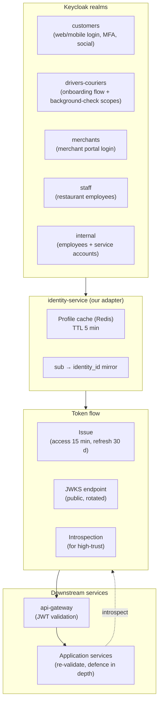

# Keycloak Architecture

Keycloak is the **central identity and access management** platform. It is
the single source of truth for credentials, MFA, sessions, and the issuance
of access tokens. Application services NEVER store passwords; they only
store a reference to the Keycloak user (`keycloak_user_id`).

## Why Keycloak

- Standards-based (OAuth 2.0, OIDC, SAML).
- Built-in MFA, social login, federation.
- Realm/role/group model fits our persona segmentation.
- Token introspection and JWKS endpoint.
- Operationally mature; high-availability deployment well-understood.

See ADR-0003.

## Realms

| Realm | Purpose | Notes |
|-------|---------|-------|
| `platform-customer` | End-user customers | MFA optional by default; required for high-value actions |
| `platform-driver` | Drivers | MFA required; OTP login via phone |
| `platform-courier` | Couriers | MFA required; OTP login via phone |
| `platform-staff` | Restaurant and merchant staff | MFA required; password + TOTP |
| `platform-internal` | Support, ops, finance, admin | MFA required; password + TOTP or WebAuthn |
| `platform-services` | Service-to-service machine accounts | Client credentials only; no human login |

Each realm has its own user federation, theme, MFA policy, password
policy, and token lifetime. Cross-realm operations are not exposed to
end users.

## Clients

Each microservice (and each public-facing channel) is a Keycloak **client**
in the appropriate realm.

| Client | Realm | Type | Purpose |
|--------|-------|------|---------|
| `web-customer` | `platform-customer` | public | Customer web app |
| `mobile-customer` | `platform-customer` | public | Customer mobile (PKCE) |
| `web-driver` | `platform-driver` | public | Driver web console |
| `mobile-driver` | `platform-driver` | public | Driver mobile (PKCE) |
| `web-courier` | `platform-courier` | public | Courier web console |
| `mobile-courier` | `platform-courier` | public | Courier mobile (PKCE) |
| `web-restaurant` | `platform-staff` | confidential | Restaurant operator console |
| `web-merchant` | `platform-staff` | confidential | Merchant operator console |
| `web-support` | `platform-internal` | confidential | Support agent console |
| `web-admin` | `platform-internal` | confidential | Admin / ops console |
| `<service-name>` (×N) | `platform-services` | confidential | Service-to-service (client credentials) |

Public clients use **PKCE** (Authorization Code with Proof Key for
Exchange Code). Confidential clients (server-side apps and services) use
**client credentials** with a secret rotated via Vault.

## Roles and Groups

### Realm roles (per realm)

`platform-customer`:
- `customer`
- `customer.suspended` (additive flag; user can't transact while held)

`platform-driver`:
- `driver`
- `driver.pending_review`
- `driver.suspended`
- `driver.admin` (city lead)

`platform-courier`:
- `courier`
- `courier.pending_review`
- `courier.suspended`
- `courier.admin`

`platform-staff`:
- `restaurant_staff`
- `restaurant_manager`
- `merchant_staff`
- `merchant_manager`

`platform-internal`:
- `support_agent_l1`
- `support_agent_l2`
- `support_agent_l3`
- `operations`
- `finance`
- `fraud_reviewer`
- `admin`
- `super_admin`

`platform-services`:
- `<service>.svc` (per service)

### Groups

Groups are used for **multi-tenant scoping** where applicable:

- `merchant/<merchant_id>/staff` — restaurant and merchant staff
  belong to their merchant's group subtree; the group membership is
  used to compute the `tenant_id` claim.
- `region/<region_id>/admin` — internal admin scoped to a region.

### Client roles (per client)

Each service client has roles matching its operational needs:
- `<service>.read`
- `<service>.write`
- `<service>.admin`

A service-to-service caller must have the relevant client role in the
target service's client.

## Scopes and Claims

### OIDC scopes (consent-based)

- `openid` — required.
- `profile` — name, locale, picture, etc.
- `email` — email + verified flag.
- `phone` — phone + verified flag.
- `address` — saved addresses.
- `offline_access` — refresh token issuance (driver/courier/restaurant
  apps where long sessions are needed; the refresh token has a separate
  rotation policy).

### Custom claims

In addition to standard OIDC claims, tokens carry:

| Claim | Type | Source | Example |
|-------|------|--------|---------|
| `kc_sub` | string | Keycloak `sub` | `c5a8…` |
| `user_type` | string | realm role | `customer` |
| `tenant_id` | string (optional) | group | `merchant:01H…` |
| `region` | string (optional) | realm attribute | `eu-west` |
| `device_id` | string (optional) | login | `dev_…` |
| `session_id` | string | Keycloak session | `sess_…` |
| `amr` | array | MFA methods used | `["pwd","otp"]` |
| `email_verified` | bool | Keycloak | `true` |
| `phone_verified` | bool | Keycloak | `true` |

`user_type` and `tenant_id` are mapped to HTTP headers at the gateway
(`X-User-Type`, `X-Tenant-Id`) so services don't need to parse JWTs.

## Token Flows

| Flow | Used by | Notes |
|------|---------|-------|
| Authorization Code + PKCE | Mobile and web customer/driver/courier/staff apps | Default for human users |
| Client Credentials | Service-to-service | Each service has its own client; secret in Vault |
| Resource Owner Password | **NOT USED.** | Disallowed platform-wide |
| Implicit | **NOT USED.** | Disallowed |
| Token Exchange | Service-to-service impersonation (e.g. admin acting on behalf of a customer) | Used in support-tool flows only; audited |
| Refresh Token Rotation | All human apps | Old refresh token is invalidated on each use; theft detection locks the session |

## Token Lifetimes

| Token type | Access | Refresh | Idle |
|------------|--------|---------|------|
| Customer | 15 min | 30 days (rotated) | 30 days |
| Driver (mobile) | 1 hour | 90 days (rotated) | 30 days |
| Courier (mobile) | 1 hour | 90 days (rotated) | 30 days |
| Staff (restaurant, merchant) | 30 min | 12 hours | 12 hours |
| Internal (support, admin) | 15 min | 8 hours | 8 hours |
| Service-to-service | 1 hour | n/a | n/a |

## Logout

- **RP-initiated logout** (OIDC `end_session_endpoint`) for all human
  clients.
- **Server-initiated logout** via Keycloak's admin API when:
  - User is suspended.
  - User is disabled.
  - Session is flagged suspicious by `fraud-risk-service`.
  - Theft is detected (refresh-token rotation conflict).
- On logout, the gateway's token blacklist (Redis) invalidates the
  access token until its natural expiry. The
  `identity.session.revoked.v1` event is emitted for downstream services.

## Account Suspension and Disable

| State | Effect | Path |
|-------|--------|------|
| `pending_review` | Cannot transact; can complete profile | Onboarding flow |
| `suspended` | Cannot login; tokens revoked; future sessions blocked | Admin action or fraud |
| `disabled` | Permanently disabled; cannot login | Compliance / legal hold |
| `deleted` | PII erased per GDPR; financial records retained per legal | User request or legal |

These states are reflected as:

- A `*.suspended.v1` / `*.disabled.v1` event consumed by every service
  that owns a profile for that user.
- A revocation in the gateway's token blacklist.
- A flag in the user's Keycloak attributes.

## MFA

| Persona | MFA required | Methods |
|---------|--------------|---------|
| Customer | Optional by default; required for high-value actions (large payment, account recovery) | TOTP, WebAuthn, SMS OTP |
| Driver | Required at first login | TOTP preferred; SMS OTP fallback |
| Courier | Required at first login | TOTP preferred; SMS OTP fallback |
| Restaurant/merchant staff | Required | TOTP |
| Support/ops/admin | Required | WebAuthn (preferred) or TOTP |
| Service accounts | n/a | n/a |

`fraud-risk-service` may force a step-up MFA on suspicious activity.

## Password Policy

- Minimum 12 characters, no maximum.
- Must contain at least 3 of 4 character classes.
- Cannot contain the user's email, phone, or name.
- Banned-password list (top 10k breached passwords; sourced from
  Have I Been Pwned).
- Rotated only on suspected compromise (no scheduled forced rotation).
- 5 wrong attempts → 15-minute lockout, escalating per failed batch.

## Social Login Readiness

Keycloak identity brokers are pre-wired for:

- Google
- Apple
- Facebook (legacy markets)
- WeChat (where required)

A customer may link multiple social identities to a single Keycloak
account via the `Account` console. The first linked identity is the
canonical `kc_sub`; subsequent links are federated identities with the
same `kc_sub`.

## Phone/OTP Authentication

- Driver and courier onboarding starts with **phone OTP only** (no
  password initially). After account creation, a password is set.
- Login for drivers/couriers allows password + TOTP **or** phone OTP.
- Phone OTP delivery uses `communication-gateway-service` (which
  delegates to a regional SMS provider); Keycloak's execution flow
  calls our custom authenticator that hits the gateway.
- Rate-limited: max 5 OTP requests per phone per hour; per-IP throttling
  at the gateway.

## Device/Session Management

- Each login creates a Keycloak session with a `device_id` claim.
- Users see and can revoke devices in the `Account` console.
- The `identity.session.revoked.v1` event is consumed by the
  `notification-service` (alert "new device login") and by
  `audit-service`.
- Maximum 5 concurrent sessions per user (configurable per realm).

## Admin Access

- Admins authenticate to `platform-internal` with WebAuthn or TOTP.
- Admin actions are performed through `admin-service` which is the
  only service authorized to call Keycloak's admin API.
- Every admin action emits `admin.action.performed.v1` with
  `actor_id`, `target_id`, `action`, `reason`, `before`, `after`.
- "Break-glass" admin access is logged with an elevated severity and
  pages the security on-call.

## Machine-to-Machine Authentication

- Each service has a client in `platform-services`.
- Secret is stored in Vault; rotated quarterly.
- Tokens are requested with `client_credentials` and cached by the
  caller for the access-token lifetime minus 60s.
- A short-lived access token (1 hour) is used; refresh tokens are
  not issued for `client_credentials`.
- Service identities follow the pattern `<service>.svc` and may be
  granted roles in other services' clients to authorize specific
  cross-service calls (e.g. `dispatch.svc` is granted
  `ride-request.read` in the `ride-request-service` client).

## Identity-Service's Role

`identity-service` is a thin adapter over Keycloak that:

1. Mirrors `kc_sub` → our internal `identity_id` (UUIDv7).
2. Caches user profile claims (name, email, phone) for low-latency
   reads, refreshed on `identity.user.updated.v1`.
3. Exposes `/v1/identities/{identity_id}` and
   `/v1/identities?kc_sub=...` to other services.
4. Issues logout on suspension/disable.
5. Provides a webhook-style introspection: services may call
   `/v1/identities/introspect` with a token to get the canonical
   identity claims (avoiding each service talking to Keycloak directly).

`identity-service` is **not** an authentication proxy. Authentication is
still done by the realm's clients; `identity-service` only normalizes
the model.

## Keycloak High-Availability

- Clustered Keycloak deployment, ≥ 3 nodes.
- Infinispan distributed cache for sessions and tokens.
- PostgreSQL external database (managed, with PITR).
- DNS round-robin or a load balancer with sticky sessions for the
  authorization endpoint.
- JWKS endpoint exposed via the same load balancer; the gateway caches
  the JWKS with TTL aligned to the access token lifetime.

## Audit

- All Keycloak admin events (login, logout, password change, role
  change) flow to the platform's `audit-service` via Keycloak's event
  listener SPI.
- These events are correlated with `identity.session.*.v1` events from
  `identity-service` to provide a complete session trail.