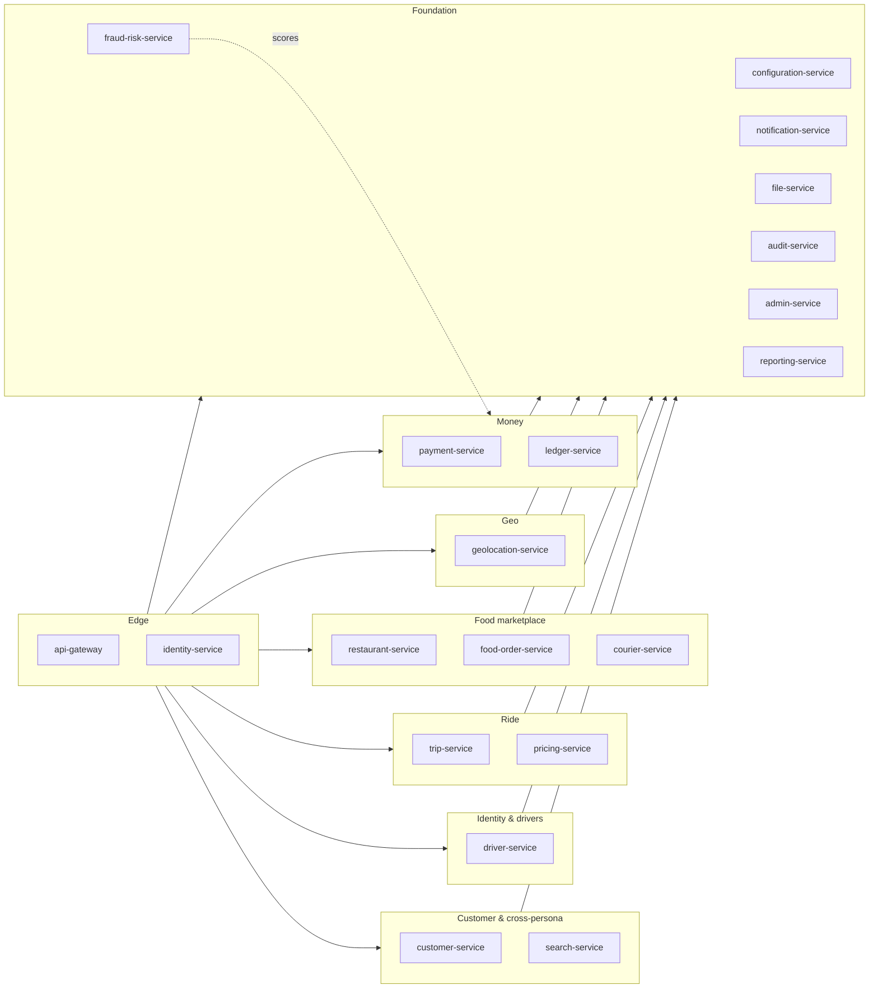

# Microservices Map

The full service catalog. Each row links to the per-service documentation
under `services/<service>/`. Ownership means **source of truth** for that
row's data.

> **Active services: 20.** The **38 removed services** are absorbed
> into the survivors per
> [ADR-0017](adrs/0017-20-service-architecture.md). See
> [`../MIGRATION_HUB.md`](../MIGRATION_HUB.md) for the per-capability
> mapping and the six-month compatibility window.

## Reading the Columns

- **Owns data**: the canonical entities this service stores.
- **DB schema**: PostgreSQL schema name (1:1 with the service).
- **Sync deps**: services this service calls over REST.
- **Async deps**: services whose events this service consumes.
- **Out events**: events this service publishes.
- **Independent deploy?**: yes — every row is independent by policy.
- **Criticality**: Tier-1 (revenue-critical, 99.95% SLO) /
  Tier-2 (important but degrades gracefully, 99.9%) /
  Tier-3 (supporting, 99.5%).

---

## 1. Edge & Stable Services

| Service | Owns data | DB schema | Criticality |
|---------|-----------|-----------|-------------|
| `api-gateway` | (stateless) | — | T1 |
| `identity-service` | Keycloak identity mapping | `identity` | T1 |
| `file-service` | file / media metadata | `file` | T2 |
| `audit-service` | immutable audit log | `audit` | T2 |

## 2. Foundation

| Service | Owns data | DB schema | Criticality |
|---------|-----------|-----------|-------------|
| `configuration-service` | configuration documents + feature flags | `configuration` | T1 |
| `notification-service` | templates + deliveries + immutable template-version snapshot chain + absorbed provider anti-corruption layer | `notification` | T2 |
| `admin-service` | admin user permissions + admin action log + absorbed **support** module (`support.admin` scope) | `admin` | T1 |
| `reporting-service` | materialised read models + exports + absorbed data-lake ingestion | `reporting` | T3 |
| `fraud-risk-service` | risk scores, device fingerprint cache, blocklists | `fraud_risk` | T1 |

## 3. Customer & Cross-Persona

| Service | Owns data | DB schema | Criticality |
|---------|-----------|-----------|-------------|
| `customer-service` | customer profile + KYC; cross-persona user profile; saved addresses; **loyalty account exposure** | `customer` | T1 |
| `search-service` | search index documents + absorbed search-review projection | `search` | T2 |

## 4. Identity & Drivers

| Service | Owns data | DB schema | Criticality |
|---------|-----------|-----------|-------------|
| `driver-service` | driver profile + KYC + online state + high-frequency location stream + match attempts + assignment ledger + quests / bonuses / guarantees + incentive accruals + **vehicles** | `driver` | T1 |

## 5. Ride

| Service | Owns data | DB schema | Criticality |
|---------|-----------|-----------|-------------|
| `trip-service` | trip aggregate + ride-request + scheduled-ride + ride-safety + ride-history + **trip-review projection** | `trip` | T1 |
| `pricing-service` | pricing engine + **tax rules** + **promotion rules** + **loyalty pricing rules** | `pricing` | T1 |

## 6. Food Marketplace

| Service | Owns data | DB schema | Criticality |
|---------|-----------|-----------|-------------|
| `restaurant-service` | **merchant** + restaurant + branches + menus + inventory + **staff** | `restaurant` | T1 |
| `food-order-service` | **cart** + **checkout** + food order + restaurant-side queue + **food-review projection** | `food_order` | T1 |
| `courier-service` | courier profile + dispatch + tracking + **delivery aggregate** | `courier` | T1 |

## 7. Geospatial

| Service | Owns data | DB schema | Criticality |
|---------|-----------|-----------|-------------|
| `geolocation-service` | geocode + reverse-geocode + ETA + routing + zones + cities | `geolocation` | T1 |

## 8. Financial

| Service | Owns data | DB schema | Criticality |
|---------|-----------|-----------|-------------|
| `payment-service` | payment intents + 46-gateway registry + customer wallet + ride / food sagas + driver / courier earnings + merchant payable / payouts / disputes + COD money | `payment` | T1 |
| `ledger-service` | double-entry ledger accounts and postings (immutable truth) | `ledger` | T1 |

---

## Service Count Summary

| Domain | Count |
|--------|-------|
| Edge & Stable | 4 |
| Foundation | 5 |
| Customer & Cross-Persona | 2 |
| Identity & Drivers | 1 |
| Ride | 2 |
| Food Marketplace | 3 |
| Geospatial | 1 |
| Financial | 2 |
| **Active total** | **20** |
| Removed (absorbed into survivors — see [ADR-0017](adrs/0017-20-service-architecture.md) and [`../MIGRATION_HUB.md`](../MIGRATION_HUB.md)) | 38 |

## Service Dependency Direction (Rule)

Dependencies MUST flow **downward in the layered view** in
[`ARCHITECTURE.md`](ARCHITECTURE.md). That is:

- Channel → Edge → Service → Data/Platform.
- A service can depend on a "lower" service (e.g. `trip-service` reads
  `driver-service`).
- A service MUST NOT depend on a "higher" service (e.g. `driver-service`
  MUST NOT call `trip-service`).
- Within the same layer, dependencies are allowed but discouraged when
  they create cycles. Where a cycle would otherwise form, the dependency
  is inverted via an event.

## Standards for Every Row

Every service's per-folder documentation MUST include:

- The service's responsibilities **and** what it explicitly does **not**
  own (to prevent overlap).
- API overview (REST endpoints).
- Events produced and consumed.
- The PostgreSQL schema name.
- The outbound calls (sync + async) and what failure modes are handled.
- The configuration keys it reads.
- Observability expectations.
- Deployment notes (replicas, scaling hints).

## Cross-cutting shared catalog (no service row)

The platform publishes a **shared `lookup_types` + `lookups`
catalog** that lives in [`../shared/LOOKUPS.md`](../shared/LOOKUPS.md).
It is not a service in the table above; every service in the table
above carries its own copy of the two-table pair in its own schema,
binds to the platform-wide `code` namespace, and consumes the
`platform.lookup.*.v1` event family. See
[`../shared/LOOKUPS.md`](../shared/LOOKUPS.md) for the contract and
[`../shared/README.md`](../shared/README.md) for adoption.

Services that have already declared ownership of a
`lookup_type_code` namespace MUST add a row to
[`../shared/LOOKUPS.md`](../shared/LOOKUPS.md) §7
"Cross-service references" pointing at the column they expose.
Services that have **not** yet adopted the catalog MUST list
`lookup-adoption` in their README §10.7 preset membership
(see [`../services/RECOMMENDATIONS.md`](../services/RECOMMENDATIONS.md)).

## Removed services (consolidated — see ADR-0017)

The 38 services consolidated into the 15 absorbing survivor services
are **not** listed above. Each removed service has been absorbed into
a survivor; the per-capability migration record is in
[`../MIGRATION_HUB.md`](../MIGRATION_HUB.md) and the per-service
"Removed predecessor capability" appendix inside the survivor's
docs. For at least six calendar months from 2026-08-05, every
removed-service event topic, REST path, and schema name continues
to resolve to the absorbing service.