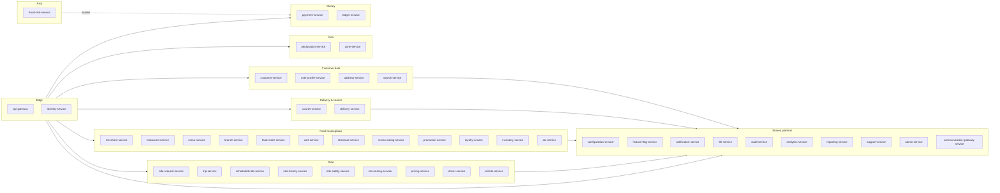

# Microservices Map

The full service catalog. Each row links to the per-service documentation
under `services/<service>/`. Ownership means **source of truth** for that
row's data.

> **Active services: 44.** The 14 removed services
> (`courier-dispatch`, `courier-tracking`, `courier-earnings`,
> `dispatch`, `driver-availability`, `driver-location`,
> `driver-incentive`, `driver-earnings`, `restaurant-order-mgmt`,
> `restaurant-staff`, `restaurant-settlement`,
> `food-payment-integration`, `ride-payment-integration`, `wallet`)
> are absorbed into the five survivor services. See
> [`../MIGRATION_HUB.md`](../MIGRATION_HUB.md) and
> [ADR-0016](adrs/0016-service-domain-consolidation.md).

## Reading the Columns

- **Owns data**: the canonical entities this service stores.
- **DB schema**: PostgreSQL schema name (1:1 with the service).
- **Sync deps**: services this service calls over REST.
- **Async deps**: services whose events this service consumes.
- **Out events**: events this service publishes.
- **Independent deploy?**: yes — every row is independent by policy.
- **Criticality**: Tier-1 (revenue-critical, 99.95% SLO) /
  Tier-2 (important but degrades gracefully, 99.9%) /
  Tier-3 (supporting, 99.5%).

---

## 1. Shared Platform — Identity & Profile

| Service | Owns data | DB schema | Sync deps | Async deps (consumes) | Out events | Criticality |
|---------|-----------|-----------|-----------|----------------------|------------|-------------|
| `api-gateway` | (none; stateless) | — | `identity-service`, every service | (none) | `audit.api.request.v1` | T1 |
| `identity-service` | `keycloak_user_id` mapping, token-issuance cache, blocked users | `identity` | Keycloak | `customer.created.v1`, `driver.created.v1`, `courier.created.v1`, `merchant.created.v1`, `restaurant.created.v1` | `identity.user.suspended.v1`, `identity.user.disabled.v1`, `identity.session.revoked.v1` | T1 |
| `user-profile-service` | Languages, notification preferences, device list, avatar ref | `user_profile` | `identity-service` | `identity.user.created.v1` | `user.profile.updated.v1` | T2 |
| `customer-service` | Customer profile, KYC tier, default payment method refs, lifetime value | `customer` | `identity-service`, `payment-service` (ref only) | `identity.user.created.v1`, `payment.method.saved.v1` | `customer.created.v1`, `customer.updated.v1`, `customer.suspended.v1` | T1 |
| `driver-service` | Driver profile, KYC, document expiry, eligibility per city, ratings; **online state, current shift, accepted ride types, current zone; high-frequency location stream (last-known + trail); match attempts + assignment ledger; quests / bonuses / surge guarantees / eligibility + incentive accruals** (per [ADR-0016](adrs/0016-service-domain-consolidation.md)) | `driver` | `identity-service`, `vehicle-service`, `geolocation-service` (city lookup), `customer-service`, `eta-routing-service`, `pricing-service` (read), `notification-service` | `vehicle.registered.v1`, `document.expiring.v1` (auto), `customer.created.v1`, `trip.completed.v1`, `ride.request.created.v1` | `driver.created.v1`, `driver.approved.v1`, `driver.suspended.v1`, `driver.document.expired.v1`, `driver.availability.online.v1`, `driver.availability.offline.v1`, `driver.availability.busy.v1`, `driver.location.updated.v1`, `dispatch.matched.v1`, `dispatch.no_driver.v1`, `dispatch.offer.expired.v1`, `driver.incentive.earned.v1` | T1 |
| `courier-service` | Courier profile, KYC, vehicle type, shift schedule; **high-frequency courier location stream; courier match attempts + assignment ledger** (per [ADR-0016](adrs/0016-service-domain-consolidation.md)) | `courier` | `identity-service`, `vehicle-service`, `branch-service`, `notification-service`, `eta-routing-service`, `geolocation-service` | `vehicle.registered.v1`, `food.order.ready.v1` (own producer), `configuration.updated.v1` | `courier.created.v1`, `courier.approved.v1`, `courier.suspended.v1`, `courier.shift.scheduled.v1`, `courier.location.updated.v1`, `delivery.courier.assigned.v1`, `delivery.dispatch.no_courier.v1`, `delivery.dispatch.offer.expired.v1`, `delivery.dispatch.reassigned.v1` | T1 |
| `vehicle-service` | Vehicles, plates, registration, insurance, inspection | `vehicle` | `identity-service` (owner) | — | `vehicle.registered.v1`, `vehicle.approved.v1`, `vehicle.insurance.expired.v1`, `vehicle.inspection.expired.v1` | T2 |
| `address-service` | Saved addresses (geocoded, normalized, tagged) | `address` | `geolocation-service` (geocode) | — | `address.created.v1`, `address.updated.v1`, `address.deleted.v1` | T2 |

## 2. Geospatial & Zones

| Service | Owns data | DB schema | Sync deps | Async deps (consumes) | Out events | Criticality |
|---------|-----------|-----------|-----------|----------------------|------------|-------------|
| `geolocation-service` | Geocode cache, ETA cache, route cache, last-known city | `geolocation` | Map provider | — | `geolocation.geocoded.v1`, `geolocation.eta.computed.v1` | T1 |
| `zone-service` | Cities, service zones, surge zones, restricted zones, zone hours | `zone` | `geolocation-service` (validation) | — | `zone.updated.v1`, `zone.surge.updated.v1` | T1 |

## 3. Pricing & Rules

| Service | Owns data | DB schema | Sync deps | Async deps (consumes) | Out events | Criticality |
|---------|-----------|-----------|-----------|----------------------|------------|-------------|
| `pricing-service` | (stateless engine; reads from `configuration-service`) | `pricing` (cache tables only) | `configuration-service`, `tax-service`, `promotion-service` | `configuration.updated.v1` | `pricing.quote.created.v1` | T1 |
| `promotion-service` | Coupons, campaigns, redemption rules, redemption history | `promotion` | `customer-service` (segment), `configuration-service` | `customer.segment.changed.v1` | `promotion.redeemed.v1`, `promotion.created.v1`, `promotion.disabled.v1` | T2 |
| `loyalty-service` | Points balance, tier, earn/burn history | `loyalty` | `customer-service`, `trip-service`, `food-order-service` (read ref) | `trip.completed.v1`, `food.order.completed.v1` | `loyalty.points.earned.v1`, `loyalty.points.burned.v1`, `loyalty.tier.changed.v1` | T3 |
| `tax-service` | Jurisdiction rules, product tax codes, exemptions (read-mostly) | `tax` | `configuration-service` | `configuration.updated.v1` | `tax.calculated.v1` | T2 |
| `review-rating-service` | Reviews (rides and food), aggregated ratings, replies | `review` | `customer-service`, `driver-service`, `courier-service`, `restaurant-service` (read ref) | `trip.completed.v1`, `food.order.delivered.v1` | `review.submitted.v1`, `review.aggregated.v1` | T3 |

## 4. Platform & Operations

| Service | Owns data | DB schema | Sync deps | Async deps (consumes) | Out events | Criticality |
|---------|-----------|-----------|-----------|----------------------|------------|-------------|
| `notification-service` | Notification templates (per channel: push, sms, email, in_app, whatsapp), preferences, delivery state, immutable template-history audit | `notification` | `communication-gateway-service` | `trip.completed.v1`, `food.order.placed.v1`, `payment.failed.v1`, `comms.whatsapp.template_status_update.v1`, … (many) | `notification.sent.v1`, `notification.delivered.v1`, `notification.read.v1`, `notification.failed.v1`, `notification.suppressed.v1`, `notification.template.published.v1` | T2 |
| `communication-gateway-service` | Provider credentials, provider health, send logs, plug-in provider capability matrix (zero-schema-change onboarding) | `comms_gateway` | SMS/Email/Push/WhatsApp providers (Twilio, Meta Cloud, 360dialog, Gupshup, …) | `notification.retry_requested.v1` (planned) | `comms.sms.sent.v1`, `comms.email.sent.v1`, `comms.push.sent.v1`, `comms.whatsapp.accepted.v1`, `comms.whatsapp.delivered.v1`, `comms.whatsapp.read.v1`, `comms.whatsapp.failed.v1`, `comms.whatsapp.template_status_update.v1` | T2 |
| `configuration-service` | Configuration documents (hierarchical, versioned) | `configuration` | (none) | — | `configuration.updated.v1` | T1 |
| `feature-flag-service` | Flag definitions, override rules, rollout percentages | `feature_flag` | (none) | — | `feature_flag.updated.v1` | T2 |
| `file-service` | File metadata, virus scan status, signed URL cache | `file` | Object store, virus scan provider | — | `file.uploaded.v1`, `file.scanned.v1`, `file.deleted.v1` | T2 |
| `search-service` | Search index documents (read model) | `search` (own OpenSearch index) | `restaurant-service`, `menu-service` | `restaurant.updated.v1`, `menu.updated.v1`, `merchant.updated.v1` | — | T2 |
| `audit-service` | Audit events (immutable, append-only) | `audit` | (none) | (subscribes to all `*.audit.*` topics) | — | T2 |
| `analytics-service` | Event ingestion to data warehouse | `analytics` | (none) | (subscribes to all topic streams) | — | T3 |
| `admin-service` | Admin user permissions (delegated to Keycloak roles), admin action log | `admin` | every service (admin endpoints) | every service's `*.audit.*` events | `admin.action.performed.v1` | T1 |
| `support-service` | Support tickets, conversations, attachments, escalations | `support` | `customer-service`, `driver-service`, `courier-service`, `payment-service` (read ref) | `payment.disputed.v1`, `customer.suspended.v1` | `support.ticket.opened.v1`, `support.ticket.resolved.v1` | T2 |
| `fraud-risk-service` | Risk scores, device fingerprint cache, blocklists | `fraud_risk` | `identity-service` (login events) | `identity.session.created.v1`, `payment.attempted.v1` | `fraud.risk.scored.v1`, `fraud.account.blocked.v1` | T1 |
| `reporting-service` | Materialized read models for dashboards and exports | `reporting` (own schema; replicas allowed) | every service (read APIs) | every service's domain events | — | T3 |

## 5. Ride-Hailing

| Service | Owns data | DB schema | Sync deps | Async deps (consumes) | Out events | Criticality |
|---------|-----------|-----------|-----------|----------------------|------------|-------------|
| `ride-request-service` | Ride requests (state: requested, matched, cancelled, expired) | `ride_request` | `customer-service`, `pricing-service`, `driver-service` (matching) | `customer.created.v1`, `dispatch.matched.v1` (from `driver-service`) | `ride.request.created.v1`, `ride.request.matched.v1`, `ride.request.cancelled.v1`, `ride.request.expired.v1` | T1 |
| `trip-service` | Trips (state: assigned, en_route_pickup, arrived, in_progress, completed, cancelled) | `trip` | `driver-service`, `courier-service` (read ref), `ride-request-service`, `eta-routing-service` | `ride.request.matched.v1`, `driver.location.updated.v1` (curated, from `driver-service`), `dispatch.arrived.v1` | `trip.started.v1`, `trip.arrived.v1`, `trip.completed.v1`, `trip.cancelled.v1` | T1 |
| `driver-service` | Driver profile + KYC; online state; high-frequency location stream; match attempts + assignment ledger; quests/bonuses/guarantees; incentive accruals | `driver` (consolidates `driver_availability`, `driver_location`, `dispatch`, `driver_incentive` schemas — see [ADR-0016](adrs/0016-service-domain-consolidation.md)) | `identity-service`, `vehicle-service`, `customer-service`, `eta-routing-service`, `pricing-service` (read), `notification-service` | `customer.created.v1`, `vehicle.registered.v1`, `document.expiring.v1` (auto), `trip.completed.v1` (incentive), `ride.request.created.v1` (match) | `driver.created.v1`, `driver.approved.v1`, `driver.suspended.v1`, `driver.document.expired.v1`, `driver.availability.online.v1`, `driver.availability.offline.v1`, `driver.availability.busy.v1`, `driver.location.updated.v1`, `dispatch.matched.v1`, `dispatch.no_driver.v1`, `dispatch.offer.expired.v1`, `driver.incentive.earned.v1` | T1 |
| `eta-routing-service` | (stateless adapter; cache) | `eta_routing` (cache) | Map provider | — | `eta.computed.v1`, `route.computed.v1` | T1 |
| `scheduled-ride-service` | Scheduled ride jobs, dispatch triggers | `scheduled_ride` | `ride-request-service` | — | `scheduled_ride.due.v1` | T2 |
| `ride-safety-service` | Trip safety state, emergency events, share-trip links | `ride_safety` | `trip-service`, `notification-service`, `geolocation-service` | `trip.started.v1`, `ride.safety.sos.v1` (self) | `ride.safety.sos.v1`, `ride.safety.share.v1`, `ride.safety.incident.v1` | T1 |
| `ride-history-service` | Read model: customer's/driver's/admin's view of past trips | `ride_history` (read replicas + own index) | `trip-service`, `payment-service`, `review-rating-service` | `trip.completed.v1`, `ride.payment.completed.v1`, `review.submitted.v1` | — | T2 |

## 6. Food Marketplace

| Service | Owns data | DB schema | Sync deps | Async deps (consumes) | Out events | Criticality |
|---------|-----------|-----------|-----------|----------------------|------------|-------------|
| `merchant-service` | Merchants (legal entity, tax info, payout) | `merchant` | `identity-service`, `payment-service` | — | `merchant.created.v1`, `merchant.approved.v1`, `merchant.suspended.v1`, `merchant.updated.v1` | T1 |
| `restaurant-service` | Restaurants (profile, status, type, cuisines); staff, role assignments, devices | `restaurant` (consolidates `restaurant_staff` schema — see [ADR-0016](adrs/0016-service-domain-consolidation.md)) | `merchant-service`, `geolocation-service`, `identity-service` | `merchant.approved.v1`, `restaurant.created.v1` | `restaurant.created.v1`, `restaurant.approved.v1`, `restaurant.online.v1`, `restaurant.offline.v1`, `restaurant.suspended.v1`, `staff.invited.v1`, `staff.activated.v1`, `staff.deactivated.v1` | T1 |
| `branch-service` | Branches (location, hours, prep capacity) | `branch` | `restaurant-service`, `geolocation-service`, `zone-service` | `restaurant.created.v1`, `zone.updated.v1` | `branch.created.v1`, `branch.updated.v1`, `branch.hours.changed.v1`, `branch.busy.v1` | T1 |
| `menu-service` | Categories, products, modifiers, add-ons, pricing | `menu` | `restaurant-service`, `tax-service`, `inventory-service` (read ref) | `restaurant.created.v1`, `inventory.item.86d.v1` | `menu.created.v1`, `menu.updated.v1`, `menu.item.price.changed.v1`, `menu.item.unavailable.v1` | T1 |
| `inventory-service` | Stock counts, time-bound availability, 86-list | `inventory` | `menu-service` | `menu.item.unavailable.v1` | `inventory.item.out_of_stock.v1`, `inventory.item.restocked.v1` | T2 |
| `cart-service` | Carts (items, modifiers, applied promos, totals) | `cart` | `customer-service`, `menu-service`, `pricing-service`, `promotion-service` | `menu.item.price.changed.v1`, `menu.item.unavailable.v1`, `restaurant.offline.v1` | `cart.created.v1`, `cart.updated.v1`, `cart.checked_out.v1`, `cart.abandoned.v1` | T2 |
| `checkout-service` | Checkout sessions (address, slot, payment method, final quote) | `checkout` | `cart-service`, `pricing-service`, `customer-service`, `address-service`, `payment-service` | `cart.updated.v1`, `pricing.quote.created.v1` | `checkout.completed.v1`, `checkout.failed.v1` | T1 |
| `food-order-service` | Food orders (state: placed, accepted, preparing, ready, picked_up, delivered, cancelled); restaurant-side queue, accept/reject timer, prep state | `food_order` (consolidates `restaurant_order_mgmt` schema — see [ADR-0016](adrs/0016-service-domain-consolidation.md)) | `restaurant-service`, `branch-service`, `customer-service`, `pricing-service` (read ref), `courier-service` (dispatch trigger) | `checkout.completed.v1`, `branch.busy.v1` | `food.order.placed.v1`, `food.order.accepted.v1`, `food.order.rejected.v1`, `food.order.preparing.v1`, `food.order.ready.v1`, `food.order.cancelled.v1` | T1 |

## 7. Food Delivery & Couriers

| Service | Owns data | DB schema | Sync deps | Async deps (consumes) | Out events | Criticality |
|---------|-----------|-----------|-----------|----------------------|------------|-------------|
| `courier-service` | Courier profile + KYC; high-frequency courier location stream; match attempts + assignment ledger; courier online flag (online/offline is the courier's online state) | `courier` (consolidates `courier_tracking`, `courier_dispatch` schemas — see [ADR-0016](adrs/0016-service-domain-consolidation.md)) | `identity-service`, `vehicle-service`, `branch-service`, `notification-service`, `eta-routing-service`, `geolocation-service` | `food.order.ready.v1` (own producer), `vehicle.registered.v1`, `configuration.updated.v1` | `courier.created.v1`, `courier.approved.v1`, `courier.suspended.v1`, `courier.shift.scheduled.v1`, `courier.location.updated.v1`, `delivery.courier.assigned.v1`, `delivery.dispatch.no_courier.v1`, `delivery.dispatch.offer.expired.v1`, `delivery.dispatch.reassigned.v1` | T1 |
| `delivery-service` | Delivery aggregate (state: assigned, en_route_pickup, arrived_pickup, picked_up, en_route_dropoff, delivered, failed) | `delivery` | `courier-service` (internal courier profile read), `branch-service`, `food-order-service` (read), `customer-service` (read) | `delivery.courier.assigned.v1` (from `courier-service`), `courier.location.updated.v1` (from `courier-service`) | `delivery.pickup.v1`, `delivery.in_transit.v1`, `delivery.completed.v1`, `delivery.failed.v1` | T1 |

## 8. Financial

| Service | Owns data | DB schema | Sync deps | Async deps (consumes) | Out events | Criticality |
|---------|-----------|-----------|-----------|----------------------|------------|-------------|
| `payment-service` | Payment intents; provider tokens; wallet balance + holds + top-ups; merchant payable + payout runs + disputes; driver earnings + withdrawals; courier earnings + withdrawals; ride payment saga; food payment saga; the 46-gateway registry | `payment` (consolidates `wallet`, `ride_payment_integration`, `food_payment_integration`, `driver_earnings`, `courier_earnings`, `restaurant_settlement` schemas — see [ADR-0016](adrs/0016-service-domain-consolidation.md)) | Payment provider (any of the 46 gateways), `ledger-service`, `merchant-service`, `trip-service`, `food-order-service`, `delivery-service`, `customer-service`, `courier-service`, `driver-service`, `trip-service` | `customer.suspended.v1`, `trip.completed.v1`, `delivery.completed.v1`, `payment.authorized.v1`, `payment.captured.v1`, `payment.failed.v1`, `payment.refund.completed.v1`, `trip.reward.granted.v1`, `trip.reward.reversed.v1`, `courier.incentive.earned.v1`, `driver.incentive.earned.v1` | `payment.attempted.v1`, `payment.authorized.v1`, `payment.captured.v1`, `payment.failed.v1`, `payment.refund.initiated.v1`, `payment.refund.completed.v1`, `wallet.credited.v1`, `wallet.debited.v1`, `wallet.held.v1`, `wallet.released.v1`, `driver.earning.accrued.v1`, `driver.withdrawal.requested.v1`, `driver.withdrawal.completed.v1`, `courier.earning.accrued.v1`, `courier.withdrawal.requested.v1`, `courier.withdrawal.completed.v1`, `ride.payment.completed.v1`, `ride.payment.failed.v1`, `food.payment.completed.v1`, `food.payment.failed.v1`, `merchant.settlement.created.v1`, `merchant.settlement.accrued.v1`, `merchant.payout.scheduled.v1`, `merchant.payout.completed.v1` | T1 |
| `ledger-service` | Double-entry ledger accounts and postings | `ledger` | (none — pure persistence of money facts) | every money-movement event | `ledger.posted.v1` | T1 |

---

## Service Count Summary

| Domain | Count |
|--------|-------|
| Edge | 1 |
| Identity & Profile | 8 |
| Geospatial & Zones | 2 |
| Pricing & Rules | 5 |
| Platform & Operations | 13 |
| Ride-Hailing | 7 |
| Food Marketplace | 8 |
| Food Delivery & Couriers | 2 |
| Financial | 2 |
| **Active total** | **44** |
| Removed (absorbed into survivors — see [ADR-0016](adrs/0016-service-domain-consolidation.md) and [`../MIGRATION_HUB.md`](../MIGRATION_HUB.md)) | 14 |

## Service Dependency Direction (Rule)

Dependencies MUST flow **downward in the layered view** in
[`ARCHITECTURE.md`](ARCHITECTURE.md). That is:

- Channel → Edge → Service → Data/Platform.
- A service can depend on a "lower" service (e.g. `trip-service` reads
  `driver-service`).
- A service MUST NOT depend on a "higher" service (e.g. `driver-service`
  MUST NOT call `trip-service`).
- Within the same layer, dependencies are allowed but discouraged when
  they create cycles. Where a cycle would otherwise form, the dependency
  is inverted via an event.

## Standards for Every Row

Every service's per-folder documentation MUST include:

- The service's responsibilities **and** what it explicitly does **not**
  own (to prevent overlap).
- API overview (REST endpoints).
- Events produced and consumed.
- The PostgreSQL schema name.
- The outbound calls (sync + async) and what failure modes are handled.
- The configuration keys it reads.
- Observability expectations.
- Deployment notes (replicas, scaling hints).

## Cross-cutting shared catalog (no service row)

The platform publishes a **shared `lookup_types` + `lookups`
catalog** that lives in [`../shared/LOOKUPS.md`](../shared/LOOKUPS.md).
It is not a service in the table above; every service in the table
above carries its own copy of the two-table pair in its own schema,
binds to the platform-wide `code` namespace, and consumes the
`platform.lookup.*.v1` event family. See
[`../shared/LOOKUPS.md`](../shared/LOOKUPS.md) for the contract and
[`../shared/README.md`](../shared/README.md) for adoption.

Services that have already declared ownership of a
`lookup_type_code` namespace MUST add a row to
[`../shared/LOOKUPS.md`](../shared/LOOKUPS.md) §7
"Cross-service references" pointing at the column they expose.
Services that have **not** yet adopted the catalog MUST list
`lookup-adoption` in their README §10.7 preset membership
(see [`../services/RECOMMENDATIONS.md`](../services/RECOMMENDATIONS.md)).

## Removed services (consolidated — see ADR-0016)

The 14 services consolidated into the 5 survivor services are
**not** listed above. Each removed service has been absorbed into
a survivor; the per-capability migration record is in
[`../MIGRATION_HUB.md`](../MIGRATION_HUB.md) and the per-service
"Removed predecessor capability" appendix inside the survivor's
docs. For at least six calendar months from 2026-08-05, every
removed-service event topic, REST path, and schema name continues
to resolve to the absorbing service.