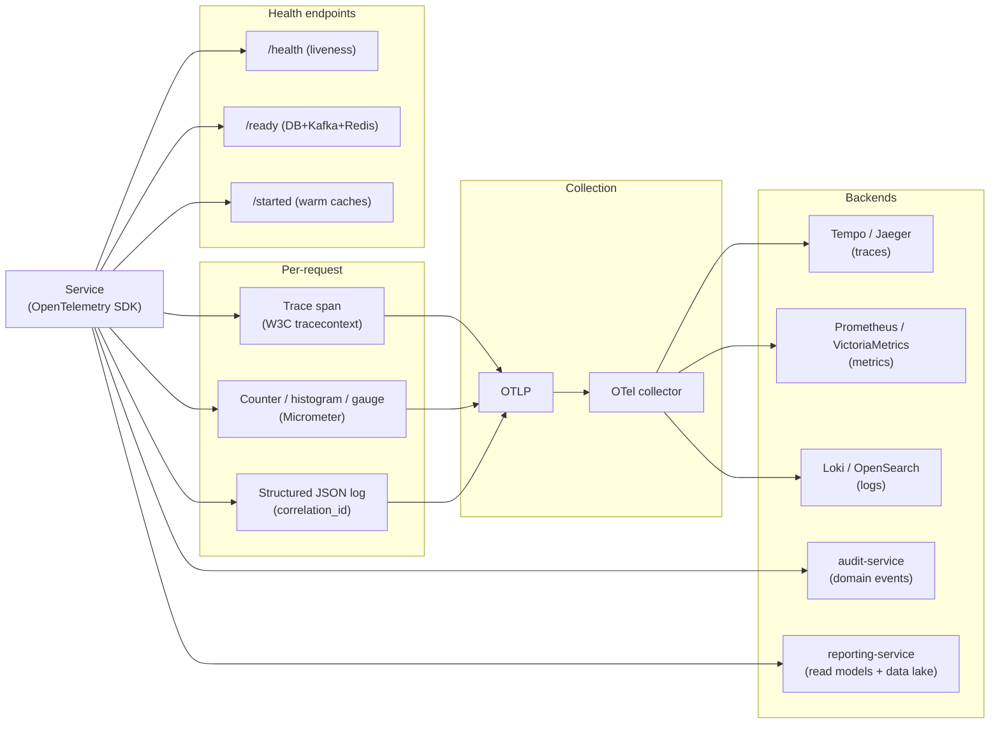

# Observability

Every service MUST be observable. The platform uses OpenTelemetry as the
common instrumentation layer.




## The Three Pillars + Audit + Business

| Pillar | Tool | Notes |
|--------|------|-------|
| Logs | Structured JSON to stdout → Fluent Bit → Loki / OpenSearch | `correlation_id`, `trace_id`, `user_id`, `service`, `version` on every line |
| Metrics | Prometheus format → Victoria Metrics | RED + USE + business KPIs |
| Traces | OpenTelemetry → Jaeger / Tempo | One root span per request; propagated through Kafka |
| Audit | Domain events → Kafka → `audit-service` | Immutable, append-only |
| Business | Kafka events → `reporting-service` (data lake) | Domain-specific metrics |

## Logging

### Format

JSON, one object per line. Standard fields:

```json
{
  "ts": "2026-07-29T10:42:11.183Z",
  "level": "info",
  "service": "trip-service",
  "version": "1.42.0",
  "env": "production",
  "region": "eu-west",
  "correlation_id": "01HZX9C7T0XK2P9F0V6E4B1MZA",
  "request_id": "01HZX9C8W6K0G3V2Y5N1Q4R7PB",
  "trace_id": "5e9c8e1f0b2a4d3e8f1a2b3c4d5e6f70",
  "user_id": "01HZX…",
  "user_type": "customer",
  "route": "POST /v1/trips",
  "latency_ms": 142,
  "status": 201,
  "msg": "trip created"
}
```

### Levels

- `debug` — verbose; off in production by default.
- `info` — normal operations; every state transition.
- `warn` — recoverable failures (retried, fallback used).
- `error` — failed operations; triggers alerting.
- `fatal` — service is exiting; the platform's incident response
  process kicks off.

### What to log

- Every API request (with route, status, latency, user_id).
- Every state transition on a key aggregate.
- Every external call (with target, latency, status).
- Every retry and circuit-breaker event.
- Every configuration reload.
- Every database migration step.

### What NOT to log

- PAN, CVV, full card numbers, bank account numbers, OTPs, passwords,
  refresh tokens, access tokens.
- Full PII in plain text; use a stable ID instead.
- Internal stack traces in production responses (only in logs).

## Metrics

### Per-service RED

For every service and every route:

- `http_requests_total{route, method, status}` — counter.
- `http_request_duration_seconds{route, method, status}` — histogram.
- `http_requests_in_flight` — gauge.

### Per-service USE

- `process_cpu_seconds_total`
- `process_resident_memory_bytes`
- `db_connections_in_use`
- `db_connections_idle`
- `kafka_consumer_lag{topic, partition}`
- `kafka_producer_record_send_total`

### Per-service business

Each service declares its own KPIs in `README.md` / `SRS.md`. Examples:

- `trip-service`: `trips_created_total`, `trips_completed_total`,
  `trips_cancelled_total{reason}`, `trip_match_seconds`.
- `driver-service` (dispatch sub-aggregate): `dispatch_match_seconds`,
  `dispatch_offer_expiration_total`, `dispatch_no_driver_total`.
- `pricing-service`: `pricing_quote_seconds`,
  `pricing_quote_cache_hit_ratio`.
- `payment-service`: `payments_authorized_total{method, currency}`,
  `payments_capture_seconds`, `payment_failure_rate`.
- `food-order-service`: `orders_placed_total`, `order_acceptance_seconds`,
  `order_prep_seconds`, `order_cancellation_rate{reason}`.

### SLOs

Each Tier-1 service declares at least:

- **Availability**: 99.95% over 30 days.
- **Latency**: P99 latency < 500ms for the dominant API path.
- **Error rate**: < 0.5% non-5xx / total for the dominant API path.

These SLOs drive alerts via the error-budget burn-rate policy.

## Tracing

- OpenTelemetry SDK auto-instruments HTTP, gRPC, DB drivers, Kafka
  producers and consumers.
- One root span per API request.
- Spans named `<verb> <route>` (e.g. `POST /v1/trips`).
- Each external call (downstream service, DB query, Kafka publish) is
  a child span.
- `traceparent` (W3C) is propagated through HTTP and Kafka headers.
- A trace sample is retained at 100% for errors and 10% for successes
  in production; 100% in staging.
- A trace is enriched with:
  - `service.version`
  - `deployment.environment`
  - `tenant_id` (if applicable)
  - `correlation_id` (the business correlation, not the OTel trace id)
  - `platform.request_id` (the business request id; equals the
    `correlation_id` and equals the `X-Request-Id` /
    `X-Correlation-Id` HTTP and Kafka headers — see
    [ADR-0019](adrs/0019-request-id-at-the-edge.md))

### Request id vs trace id

The platform has **two distinct observability ids**:

- **Request id** (a.k.a. correlation id) — the **business**
  correlation. Generated or accepted by the API gateway per
  [ADR-0019](adrs/0019-request-id-at-the-edge.md). Travels on the
  request as `X-Request-Id` (alias `X-Correlation-Id`) HTTP
  headers, as `X-Request-Id` (alias `X-Correlation-Id`) Kafka
  headers, as the `correlation_id` field of the event envelope,
  as the `requestId` MDC key on every log line, and as the
  `platform.request_id` attribute on the OTel root span. **Stable
  across retries.**
- **Trace id** — the OTel W3C `traceparent` (the first 16 bytes).
  Travels on the request as the `traceparent` HTTP header and as
  the `traceparent` Kafka header. Opens the trace UI. May change
  on retry if the client re-traces.

A single request has one request id and one trace id, but they
are not the same value. The request id is what ties a log line,
an audit event, a downstream call, and a Kafka message together;
the trace id is what opens the trace UI. A query for "everything
about request id `01HZX…`" surfaces the log line, the audit
event, the downstream calls, and (via the root span's
`platform.request_id` attribute) the trace.

## Health, Readiness, Liveness

Every service exposes:

- `GET /health` — basic liveness; always 200 if the process is up.
  No downstream calls.
- `GET /ready` — readiness; returns 200 only when the service can
  serve traffic. Checks: DB reachable, Kafka reachable, required
  configuration loaded, downstream dependencies' `/ready` pass.
- `GET /started` — startup probe; 200 once initial migrations and
  warmups have completed.

K8s probe configuration:

```yaml
livenessProbe:
  httpGet: { path: /health, port: 8080 }
  initialDelaySeconds: 10
  periodSeconds: 10
readinessProbe:
  httpGet: { path: /ready, port: 8080 }
  initialDelaySeconds: 5
  periodSeconds: 5
startupProbe:
  httpGet: { path: /started, port: 8080 }
  failureThreshold: 30
  periodSeconds: 5
```

## Alerting

Two kinds of alerts:

1. **SLO burn-rate** — multi-window, multi-burn-rate alerts. Page
   when the service is consuming its error budget too quickly.
2. **Anomaly** — for business KPIs (e.g. dispatch no-driver rate
   spikes 3x over baseline).

Each alert:

- Has a documented runbook link.
- Routes to the service's primary on-call.
- Auto-resolves when the condition clears.
- Has a test (alert firing can be exercised in staging).

## Audit

- Audit events are domain events with a stable schema.
- Persisted by `audit-service`, which subscribes to relevant topics
  and writes to its own append-only table.
- Immutable: no UPDATE / DELETE permitted on the audit schema.
- Retention: 7 years for financial, 1 year for others.
- Searchable via `admin-service` and ``admin-service` (support module)` with strict
  RBAC.

## Business Dashboards

`reporting-service` and ``reporting-service` (data lake)` produce:

- Operational dashboards (per service: RED + business KPIs).
- Product dashboards (rides per hour, orders per hour, conversion
  funnel).
- Financial dashboards (revenue, GMV, commission, refunds).
- Fraud dashboards (block rate, dispute rate).
- Executive dashboards (MAU, cities, growth).

## Service-Level Objectives (Defaults)

| Tier | Availability | P99 Latency (dominant path) | Error budget (30d) |
|------|--------------|----------------------------|--------------------|
| T1 | 99.95% | 500ms | ~22 min |
| T2 | 99.9% | 1s | ~44 min |
| T3 | 99.5% | 2s | ~3h 36m |

The dominant path for a service is documented in that service's
`SRS.md` / `README.md`.

## Synthetic Monitoring

- A small set of **canary requests** exercises critical paths
  end-to-end every minute, from multiple regions.
- If a canary fails, the on-call is paged even before users see the
  issue.
- Canary runs are owned by the platform team, not the service teams.

## OpenTelemetry Compatibility

All instrumentation MUST use the OpenTelemetry SDK. The platform
exports to:

- Traces: Jaeger or Tempo (configurable).
- Metrics: Prometheus-compatible (Victoria Metrics).
- Logs: shipped to Loki / OpenSearch depending on the deployment.

The `api-gateway` and every service publish a consistent set of
attributes (`service.name`, `service.version`,
`deployment.environment`, `region`).