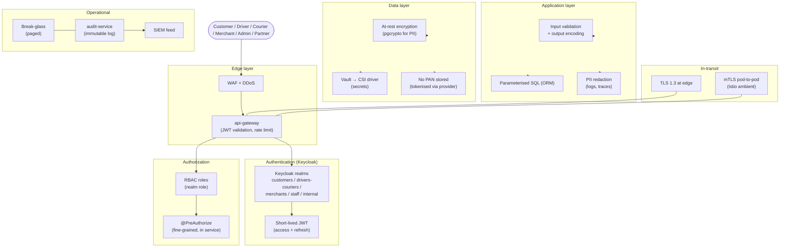

# Security Architecture

This document covers platform-wide security: authentication, authorization,
secrets, encryption, PII, PCI, audit, threat surface, and operational
practices.

## 1. Defense-in-Depth Layers

| Layer | Control |
|-------|---------|
| Network | TLS 1.3 at edge; mTLS in cluster; NetworkPolicy in K8s |
| Edge | WAF, DDoS protection, rate limiting, bot detection |
| AuthN | Keycloak (OIDC) with MFA; short-lived access tokens |
| AuthZ | RBAC + scopes at gateway; resource-level checks in services |
| Application | Input validation; output encoding; parameterized SQL via ORM |
| Data | Encryption at rest (disk + per-column where required); no PAN stored |
| Secrets | Externalized (Vault); rotated; never in source control |
| Observability | Audit logs; anomaly detection; SIEM feed |
| Operations | Least privilege; break-glass with paging; quarterly access review |

## 2. Authentication

See [`KEYCLOAK_ARCHITECTURE.md`](KEYCLOAK_ARCHITECTURE.md). All endpoints
require a valid JWT bearer token except public auth, health, and OpenAPI
docs. Tokens are validated at the gateway on every request.

## 3. Authorization

- **RBAC** at the gateway: required realm/client roles per route.
- **Scopes** at the service: required OAuth scopes per operation.
- **Resource ownership** at the service: every read/write checks that
  the actor owns the resource (or has an admin override).
- **Tenant isolation** for multi-tenant admin endpoints: every row is
  scoped by `tenant_id`; queries are filtered by `tenant_id` from the
  token.
- **Break-glass** admin override: requires a second admin's
  co-signature, emits a high-severity audit event, and pages security.

## 4. Service-to-Service Authentication

- Each service authenticates to other services with its
  `client_credentials` token from `platform-services`.
- mTLS in the cluster (Istio or Linkerd) provides peer identity at the
  network layer.
- Both layers are required (defense in depth).
- Tokens are cached for the access-token lifetime minus 60s.

## 5. Secrets

- Secrets are stored in **HashiCorp Vault** (or cloud equivalent).
- Each environment has its own Vault root token; no shared secrets
  across environments.
- Database credentials are dynamically issued per service.
- API keys (provider credentials for payment, SMS, etc.) are issued
  per environment per provider account.
- **No secrets in source control, ever.** Pre-commit hook enforces.
- **No secrets in env files in containers.** Mounted at runtime from
  Vault.
- Quarterly rotation: every secret has a `rotation_period` attribute.
  Vault auto-rotates where the downstream supports it; manual rotation
  with runbook for the rest.

## 6. Encryption

### In transit

- TLS 1.3 at the edge.
- HSTS with `max-age=31536000; includeSubDomains; preload`.
- mTLS between services in the cluster.
- Database connections encrypted (TLS).
- Redis connections encrypted.
- Kafka brokers accept TLS only.

### At rest

- Disk-level encryption for all data volumes (LUKS / cloud KMS).
- **Column-level encryption** for:
  - PII marked as `sensitive` (national ID, exact location trails
    beyond a retention window, KYC documents).
  - Provider tokens (key wrapped by a per-tenant KEK).
- **No PAN stored.** Card data lives only with the payment provider.
- KMS keys rotated annually; the key hierarchy follows the
  `KEK → DEK` pattern with envelope encryption.

## 7. Personally Identifiable Information (PII)

### Classification

| Class | Examples | Storage |
|-------|----------|---------|
| Public | Restaurant name, menu item name | Plain |
| Internal | Aggregate stats, internal IDs | Plain |
| Confidential | Email, phone, full address, KYC docs | Column-level encryption + access logs |
| Sensitive | National ID, biometric (if any), precise GPS trail beyond 24h | Column-level encryption, short retention, access logs |

### Handling rules

- PII access is logged at the service level for every read.
- Export of PII (admin tools, support tools) requires a reason code,
  recorded in audit.
- Right-to-erasure (GDPR) is implemented by:
  - PII columns are erased, with FK targets nulled.
  - Financial records retained per legal requirements but with
    identifying fields removed.
- Data minimization: services only store the PII they need; everything
  else is fetched on demand.

## 8. PCI-DSS

- **No PAN, CVV, or full track data** ever stored, processed, or
  transmitted by the platform.
- All card data is handled by the payment provider's hosted fields /
  SDK; the platform only receives a tokenized reference.
- The platform's PCI scope is reduced to SAQ-A (or equivalent) by
  using provider-hosted iframes / SDKs.
- Quarterly PCI scoping review.
- Annual PCI-DSS assessment by an external QSA.

## 9. Audit Logs

- **Audit events are first-class domain events**, persisted by
  `audit-service` (consumer) and immutable once written.
- Triggers for audit events:
  - Every admin action.
  - Every login, logout, MFA challenge, password change.
  - Every payment attempt, capture, refund, payout.
  - Every state transition on a high-value aggregate (Trip, FoodOrder,
    Payout, AccountSuspension).
  - Every PII access by an internal user.
  - Every configuration change.
- Audit log retention: ≥ 7 years for financial, ≥ 1 year for the rest.

## 10. Suspicious Activity and Fraud

- `fraud-risk-service` scores events in real time:
  - Login (device fingerprint, IP, geography, velocity).
  - Payment attempts (BIN, amount, device).
  - Dispatch (driver GPS vs. claimed location).
- Risk scores are emitted as `fraud.risk.scored.v1` and consumed by
  the originating service, which decides to allow, challenge, or block.
- Block actions emit `fraud.account.blocked.v1` and propagate to
  `identity-service` and the relevant profile service.

## 11. Brute-Force Protection

- At the gateway: per-IP and per-token request rate limits.
- At Keycloak: per-account failed login lockout with escalation.
- At the payment service: per-card velocity check.
- At the OTP endpoint: per-phone and per-IP rate limits.

## 12. API Rate Limiting

- Implemented at the gateway and at each service (defense in depth).
- Tokens: per-user, per-route, per-minute.
- Anon endpoints (search, restaurant discovery): per-IP, per-route.
- Admin endpoints: per-admin, per-route, with lower limits.
- Rate-limited responses include `Retry-After` and the standard
  `RateLimit-*` headers.

## 13. Token Validation

- Done at the gateway on every request.
- Services may re-validate the JWT if needed (e.g. when receiving
  requests outside the gateway, which should not happen in production
  but happens in tests).
- Revocation: the gateway keeps a Redis-cached revocation set (filled
  on `identity.session.revoked.v1` and on `customer.suspended.v1` etc.).
  Cache TTL: until the token's natural expiry.

## 14. Admin Security

- Admin realm: `platform-internal`. MFA mandatory.
- Admin actions go through `admin-service`. There is no direct
  database access in production.
- Every admin endpoint requires:
  - A valid access token with the right role.
  - A request signature for high-value actions.
  - An audit reason (`X-Audit-Reason`).
- "Super admin" actions are additionally gated by:
  - Time-of-day restriction (business hours only; off-hours requires
    super_admin co-sign).
  - IP allowlist.
  - Step-up MFA.
- **Granting or revoking `platform.super_admin`** (i.e. touching
  the `SUPER_ADMIN` preset via `admin-service` `POST/DELETE
  /v1/admin/identity/(grant|revoke)-super-admin`) is itself a
  super-admin action and inherits **all** of the gates above, with
  two additional strictures:
  - The co-signature is **never optional** — even on-hours, even
    when the actor holds `platform.super_admin`, the
    `X-Break-Glass-Cosigner` header MUST be present and reference a
    *different* admin holding `platform.super_admin`.
  - The caller's IP MUST be on the **super-admin IP allowlist**
    (`IP_ALLOWLIST_SUPER_ADMIN`), which is separate from the regular
    admin allowlist. Granting super-admin from a regular-admin IP is
    forbidden by design.
  - Every grant and every revoke pages security on-call via
    `notification-service` (consuming
    `admin.super_admin.granted.v1` / `admin.super_admin.revoked.v1`).
  - The actual Keycloak role-mappings calls are issued by
    `identity-service` (the platform's sole authorized Keycloak
    admin caller). `admin-service` MUST NOT call Keycloak directly.

## 15. Least Privilege

- Each service's database user has only the rights it needs:
  - Read/write on its own schemas.
  - No DDL except via migrations (separate migration user, rotated
    quarterly).
  - No cross-schema read/write.
- Each service's Keycloak client has only the roles it needs in other
  services' clients.
- Each provider integration has its own scoped API key.
  - For payment gateways specifically: each of the 46 gateways
    enumerated in
    [`services/payment-service/GATEWAYS.md`](../services/payment-service/GATEWAYS.md)
    has its own Vault path at
    `secret/payment-service/gateway/<gateway_id>/<env>` (one path
    per gateway per environment, per the convention in
    `payment-service/GATEWAYS.md` 7).

## 16. Tenant Isolation (where applicable)

- Multi-tenant admin endpoints (e.g. merchant operator console for a
  specific merchant) carry `tenant_id` in the token.
- Every query is filtered by `tenant_id`.
- A tenant boundary violation is a security event; any such finding
  pages the security on-call.

## 17. Network Policies (Kubernetes)

- Default-deny ingress and egress.
- Explicit allow for: gateway → service, service → its DB, service →
  Kafka, service → Keycloak, service → Redis, observability agent →
  service.
- No pod-to-pod traffic outside the allowed matrix.
- Egress restricted to known provider endpoints (payment, SMS, map).

## 18. Threat Modeling

The platform maintains a STRIDE-based threat model per service in each
service's `INTEGRATION.md` (under a "Threats" section). High-level
risks tracked centrally:

- **Spoofing**: mitigated by mTLS, JWT, MFA.
- **Tampering**: mitigated by TLS, request signing for high-value
  flows, immutable audit log.
- **Repudiation**: mitigated by audit events with correlation_id.
- **Information disclosure**: mitigated by encryption, PII handling
  rules, no PAN.
- **Denial of service**: mitigated by rate limits, autoscaling, K8s
  HPA, circuit breakers.
- **Elevation of privilege**: mitigated by RBAC, scopes, break-glass
  controls, periodic access reviews.

## 19. Vulnerability Management

- Container image scanning (Trivy) on every build.
- Dependency scanning (Snyk) on every build.
- Static analysis (Semgrep) on every PR.
- Quarterly penetration test by an external firm.
- Critical vulnerabilities patched within 7 days; high within 30 days.

## 20. Incident Response

- Severity matrix and runbooks in the `IR` repo (linked from
  `README.md`).
- 24/7 on-call rotation for security.
- Tabletop exercises twice a year.
- Customer-facing incident communication template and pre-cleared
  status page content.

## 21. Compliance

The platform is designed to be auditable against:

- **GDPR** (right to erasure, data portability, DPIA, RoPA).
- **PCI-DSS** (SAQ-A scope via provider-hosted fields).
- **SOC 2 Type II** (security, availability, confidentiality).
- **ISO 27001** (controls mapping in `IR/compliance/iso27001.md`).
- Regional: **PDPL** (Saudi/UAE), **NDMO** (KSA), **DPA** (UK), etc.,
  as required by deployment.

Compliance is enforced by:

- Technical controls (this document).
- Process controls (access reviews, change management, IR drills).
- Documentation (RoPA, DPIA, control matrix) maintained alongside
  this repository.

## Time-Bounded Aliases

Per [`shared/TIME_BOUNDED_ALIASES.md`](../shared/TIME_BOUNDED_ALIASES.md),
the platform supports **time-bounded SUPER_ADMIN aliases** for incident
response, cross-team coverage, and time-bounded operational tasks.
The alias is functionally identical to a permanent `SUPER_ADMIN`
grant for the duration of its TTL but is auto-revoked at `expires_at`
via the identity-service `identity.alias_revoke_job` (hourly).

**Key invariants:**

- Alias grants require the same break-glass gates as the permanent
  grant: MFA, signature, co-signer (different `platform.super_admin`),
  SUPER_ADMIN IP allowlist, Idempotency-Key.
- TTL bounds: 1 hour ≤ `ttl_seconds` ≤ 14 days.
- The 2-of-2 approval pattern (actor + co-signer) is auditable via
  `super_admin_grant.cosigner_id`.
- Every alias issuance and revocation emits an append-only row in
  `admin.super_admin_grant` (7-year retention per SOX).
- The co-signer must not be the actor (per
  `super_admin_grant.actor_id != super_admin_grant.cosigner_id`).

**API endpoints** (per [`admin-service/INTEGRATION.md`](../services/admin-service/INTEGRATION.md) 1.19):

- `POST /v1/admin/identity/grant-time-bounded-super-admin`
- `DELETE /v1/admin/identity/revoke-time-bounded-super-admin`
- `GET /v1/admin/identity/aliases/{user_id}`

**Conductor workflow**: `wf.service_request.time_bounded_alias.v1`
([`shared/CONDUCTOR_WORKFLOWS.md`](../shared/CONDUCTOR_WORKFLOWS.md) 3.5.4).

**Memory anchor**: `trips-enjoy-super-admin-preset-management (2026-08-05)`.
