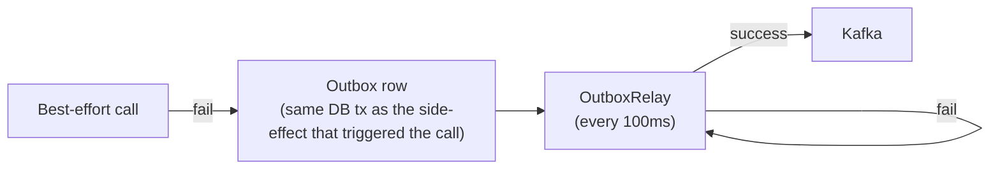

# Service Isolation

> The platform-wide playbook for **how every service behaves when a
> downstream service is down**. Read this before adding a new
> outbound call. The companion document is
> [`DOWNSTREAM_ERROR_CATALOG.md`](./DOWNSTREAM_ERROR_CATALOG.md) —
> every error code and how it propagates.

This doc is the **single source** for the isolation pattern. The
underlying primitives (timeouts, retries, circuit breakers,
bulkheads, sagas) live in
[`FAILURE_HANDLING.md`](./FAILURE_HANDLING.md) and
[`CONSISTENCY_STRATEGY.md`](./CONSISTENCY_STRATEGY.md). This doc
tells you **which combination to use for each downstream class**,
so that a single failing service cannot cascade into a
platform-wide outage. References to absorbed capabilities
(`driver-availability-service`, `courier-location-stream`, etc.)
are written as inline capability labels under the surviving
service per [[trips-enjoy-service-consolidation-payment-centralization]].

---

## 1. The Isolation Principle

> **A service may never fail because a downstream service is slow,
> unavailable, or returning errors. The downstream's problems must
> be contained at the boundary.**

The platform enforces this with five layers, applied in order on
every outbound call:

```mermaid
flowchart LR
  req["Inbound request"] --> t{"Timeout<br/>(≤ 1s)"}
  t -->|elapsed| b["Bulkhead<br/>(separate pool per downstream)"]
  b --> cb{"Circuit<br/>open?"}
  cb -->|yes| fb["Fallback<br/>(cache / default / reject)"]
  cb -->|no| call["Outbound call"]
  call -->|success| ok["Return 2xx"]
  call -->|retryable| r{"Retry?<br/>(≤ 3 attempts)"}
  r -->|yes| call
  r -->|no| fb
  call -->|non-retryable| prop["Propagate<br/>(DOWNSTREAM_ERROR_CATALOG.md)"]
```

| # | Layer | Purpose | Lives in |
|---|---|---|---|
| 1 | **Timeout** | Bound the time we wait | `FAILURE_HANDLING.md` Timeouts |
| 2 | **Bulkhead** | One slow downstream cannot starve the others | `FAILURE_HANDLING.md` Bulkheads + this doc 4 |
| 3 | **Circuit breaker** | Stop calling a known-bad downstream | `FAILURE_HANDLING.md` Circuit Breakers + this doc 3 |
| 4 | **Retry** | Recover from transient blips | `FAILURE_HANDLING.md` Retries + this doc 5 |
| 5 | **Fallback** | Produce a sensible response when downstream is down | This doc 6 |

These are **not optional** on any outbound call. Every service MUST
apply all five to every outbound call by default. Exemptions require
an ADR.

---

## 2. Downstream Dependency Classification

Every outbound call is classified by **how critical** the
downstream is to the user-visible request, and **how the service
should behave** when it fails.

### 2.1 Three classes

| Class | Meaning | When the downstream is down |
|---|---|---|
| **CRITICAL** | The user-visible request cannot succeed without it | The whole request fails (`503 DEPENDENCY_UNAVAILABLE`) |
| **DEGRADABLE** | The request can succeed with a worse-but-acceptable result | Serve cached / default / partial result; flag `degraded: true` in the response |
| **BEST-EFFORT** | The call is informational; failure is invisible | Swallow the error, log at WARN, do not fail the request |

### 2.2 The platform dependency matrix

| From → To | Class | Behavior on down | Fallback |
|---|---|---|---|
| `trip-service` → `pricing-service` | CRITICAL | 503 `DEPENDENCY_UNAVAILABLE` (no ride without a price) | none — the request fails |
| `trip-service` → `customer-service` | CRITICAL | 503 `CUSTOMER_NOT_VERIFIABLE` | none |
| `trip-service` → `geolocation-service` | DEGRADABLE | geocode from cached `pickup_address` only; flag `degraded: true` | cached last-known city |
| `trip-service` → `fraud-risk-service` | BEST-EFFORT | log WARN, allow the request | allow + flag for retrospective review |
| `trip-service` → `notification-service` | BEST-EFFORT | the request succeeds; customer is not notified | outbox queues the notification event for later |
| `trip-service` → `geolocation-service` (ETA/routing) | DEGRADABLE | use last-known ETA from cache | cached ETA |
| `trip-service` (safety) → `trip-service` (location stream) | BEST-EFFORT | trip continues; safety events queued | outbox queues `trip.safety.*` events |
| `driver-service` (dispatch) → `driver-service` (availability) | CRITICAL | 503 `NO_DRIVERS_AVAILABLE` | none |
| `driver-service` (dispatch) → `driver-service` (location) | DEGRADABLE | dispatch uses the last-known location from cache | cached location |
| `driver-service` (dispatch) → `fraud-risk-service` | BEST-EFFORT | log WARN, allow | allow |
| `payment-service` → `ledger-service` | CRITICAL (for capture) / DEGRADABLE (for read) | capture: 503; read: serve cached balance | none for capture; cached for read |
| `payment-service` → `fraud-risk-service` | BEST-EFFORT | log WARN, allow | allow |
| `payment-service` → `notification-service` | BEST-EFFORT | outbox queues the receipt | queued |
| `payment-service` → resolved gateway (any of the 46 in [`services/payment-service/GATEWAYS.md`](../services/payment-service/GATEWAYS.md)) | CRITICAL for `authorize`/`capture`; per-gateway isolation | per-gateway circuit opens at 5 consecutive 5xx/timeout in 30s; `authorize` fails 504 `DEPENDENCY_TIMEOUT` for that gateway only | per-gateway DEGRADABLE fallback to next-priority gateway in the same region per the registry |
| `payment-service` (wallet) → `ledger-service` | CRITICAL | 503 `LEDGER_UNAVAILABLE` — no wallet operation without the ledger | none |
| `payment-service` (wallet) → `fraud-risk-service` | BEST-EFFORT | log WARN, allow | allow |
| `ledger-service` → any | n/a | ledger-service is a leaf (no outbound service calls in the hot path) | — |
| `payment-service` (ride saga) → `payment-service` | CRITICAL | saga state machine records the failure; emits `payment.failed.v1` | retry with backoff per saga policy |
| `payment-service` (ride saga) → `payment-service` (driver earnings) | DEGRADABLE | saga continues; earning is queued for later accrual | outbox queues `driver.earning.accrued.v1` |
| `payment-service` (ride saga) → `notification-service` | BEST-EFFORT | outbox queues the receipt | queued |
| `trip-service` (history) ← `trip-service` | BEST-EFFORT | ride history is eventually consistent; queue the read | outbox queues `ride.history.read.v1` |
| `customer-service` (addresses) → `geolocation-service` | DEGRADABLE | serve the address as a free-text record; flag `unverified: true` | free-text-only address |
| `customer-service` (addresses) → `customer-service` (internal cache) | CRITICAL | 503 | none |
| `admin-service` (support module) → `customer-service` | DEGRADABLE | support agent sees a redacted profile | profile redaction |
| `admin-service` (support module) → `trip-service` (history) | DEGRADABLE | support agent sees "history unavailable" placeholder | placeholder |
| `admin-service` → `audit-service` | BEST-EFFORT | admin action proceeds; audit event is queued | outbox queues `audit.admin.*.v1` |
| `admin-service` → any | DEGRADABLE | admin console shows "downstream unavailable" banner | banner |
| `notification-service` (preserved provider adapters) → provider (Twilio/SendGrid/Firebase) | DEGRADABLE | message is queued with retry; circuit breaker per provider | retry queue |
| `courier-service` (dispatch) → `courier-service` (availability) | CRITICAL | 503 `NO_COURIERS_AVAILABLE` | none |
| `courier-service` (tracking) → `courier-service` (location stream, Kafka) | BEST-EFFORT | consumers queue; events eventually drained | consumer buffer |
| any → `configuration-service` | DEGRADABLE | serve the last-known cached config; flag `stale_config: true` | cached config |
| any → `configuration-service` (flags) | DEGRADABLE | treat the flag as off (fail-closed) | default = off |
| any → `identity-service` | CRITICAL | 503 `AUTH_UNAVAILABLE` (cannot validate JWT) | none |
| any → `audit-service` (direct, not via outbox) | BEST-EFFORT | drop the audit record, log ERROR, alert on drop rate | drop with alarm |
| any → `reporting-service` (data lake, via Kafka outbox) | BEST-EFFORT | outbox holds the event until Kafka recovers | outbox |

> **Rule of thumb**: if the downstream is on the **money path**
> (capture / authorize / settle / ledger), it is **CRITICAL**. If it
> is on the **experience path** (geocode / ETA / notification), it
> is **DEGRADABLE**. If it is **side-effect** (audit / analytics /
> notification of the result), it is **BEST-EFFORT**.

---

## 3. Circuit Breaker Policy

The platform's circuit-breaker policy is in
[`FAILURE_HANDLING.md` Circuit Breakers](./FAILURE_HANDLING.md#circuit-breakers).
This section adds the **per-class** configuration.

| Class | Open after | Cooldown | Half-open probes | Notes |
|---|---|---|---|---|
| CRITICAL | 5 consecutive failures OR ≥ 30% failure rate over 30 s | 30 s | 3 | A tripped CRITICAL circuit = 503 to caller. Page on first open. |
| DEGRADABLE | 5 consecutive failures OR ≥ 30% failure rate over 30 s | 60 s | 3 | A tripped DEGRADABLE circuit = degraded response with `degraded: true`. |
| BEST-EFFORT | 10 consecutive failures (higher tolerance — these calls are cheap) | 120 s | 5 | A tripped BEST-EFFORT circuit = silently drop. No caller-visible effect. |

The circuit-breaker state is **mirrored to memory only by default**
(no DB table). For services where the breaker is critical
(`payment-service`, `payment-service` (wallet), `ledger-service`),
the state is persisted so restarts don't re-trip a known-bad
downstream. See `provider_circuit_state` in
`geolocation-service/ERD.md` for the pattern; replicate for
payment/wallet/ledger.

---

## 4. Bulkhead Policy

The platform uses **per-downstream thread pools / connection
pools**. A slow downstream cannot starve the pool used for healthy
downstreams.

### 4.1 Default pool sizes (per replica)

| Class | Pool size (in-flight) | Queue | Timeout | Notes |
|---|---|---|---|---|
| CRITICAL | 100 | 200 | 1 s | Pool sized for peak RPS × P99 latency × 2 |
| DEGRADABLE | 50 | 100 | 1 s | Smaller pool — degraded calls are cheap to reject |
| BEST-EFFORT | 25 | 50 | 500 ms | Smallest pool — best-effort calls are cheap to drop |

When a pool is full, the call is **fast-failed** with
`code: "BULKHEAD_FULL"`. This is retried by the caller (see 5) or
surfaced as a `503` to the user.

### 4.2 Library support

- **Kotlin / Spring Boot**: `platform-spring-boot-bulkhead`
  exports a `BulkheadRegistry` bean; outbound calls are wrapped
  via the `@Bulkhead("payment-service")` annotation.
- **Go / net/http**: `internal/bulkhead` package — per-vendor pool
  of goroutine slots with a buffered channel as the queue.
- **Python / FastAPI**: `platform_fastapi_bulkhead` —
  `asyncio.Semaphore` per downstream; acquired with
  `asyncio.wait_for(..., timeout=...)`.

---

## 5. Retry Policy

Retries are **never free**. The platform retries are
**idempotency-keyed** (so a retry cannot double-charge) and
**bounded** (so a bad downstream cannot block forever).

### 5.1 Default retry policy

| Class | Max attempts | Backoff | Retryable statuses | Notes |
|---|---|---|---|---|
| CRITICAL | 3 | exponential, base 100 ms, ±20 % jitter | 408, 429, 500, 502, 503, 504, timeout | MUST carry `Idempotency-Key` on every attempt |
| DEGRADABLE | 2 | exponential, base 200 ms, ±20 % jitter | 408, 429, 502, 503, 504, timeout | NEVER retry 5xx from CRITICAL downstream (use the cached result) |
| BEST-EFFORT | 1 (no retry) | n/a | n/a | One shot; if it fails, swallow |

### 5.2 Retry rules

- **Idempotency**: every retry MUST carry the same
  `Idempotency-Key`.
- **`Retry-After`**: respect it when the downstream returns one.
- **No retry on 4xx** except 408 and 429.
- **Circuit-aware**: if the circuit is open, do **not** retry —
  fall back instead.
- **Bulkhead-aware**: if the pool is full, do **not** retry — fail
  fast with `BULKHEAD_FULL`.

---

## 6. Fallback Policy

The fallback is the **deterministic behavior** when timeout +
retries + circuit-open have all failed. Per class:

### 6.1 CRITICAL downstream → no fallback

The request fails with `503 DEPENDENCY_UNAVAILABLE` and the
catalog code for the specific downstream. The response MUST include
`downstream.service` and `downstream.code` so the caller can render
a useful message.

```json
{
  "code": "DEPENDENCY_UNAVAILABLE",
  "message": "We can't process your request right now. Please try again.",
  "correlationId": "01HZX9C7T0XK2P9F0V6E4B1MZA",
  "downstream": {
    "service": "payment-service",
    "code": "CIRCUIT_OPEN",
    "traceId": "8f4a9b2c1d0e3f5a6b7c8d9e0f1a2b3c"
  }
}
```

### 6.2 DEGRADABLE downstream → serve degraded result

The request succeeds (200/201) with a **degraded response** that
flags the limitation:

```json
{
  "id": "01HZX9C8W6K0G3V2Y5N1Q4R7PB",
  "state": "matched",
  "eta_seconds": 600,
  "degraded": {
    "fields": ["eta_seconds"],
    "reason": "geolocation-service (ETA/routing) circuit-open",
    "fallback": "last_known_eta"
  }
}
```

The `degraded` block lists every field whose value is from a
fallback. Clients MUST surface this to the user (e.g. "Estimated
time is based on historical data and may be less accurate right
now.").

### 6.3 BEST-EFFORT downstream → swallow + log

The call is silently dropped. A WARN-level log line is emitted
with the standard fields:

```json
{
  "level": "WARN",
  "message": "best-effort downstream call failed; suppressing",
  "downstream_service": "notification-service",
  "downstream_code": "CIRCUIT_OPEN",
  "traceId": "8f4a9b2c1d0e3f5a6b7c8d9e0f1a2b3c",
  "result": "suppressed"
}
```

If the side-effect is **durable** (the event MUST eventually
happen), it is queued via the **outbox pattern**, not retried
in-process:



The outbox is the durable retry queue for best-effort calls.

---

## 7. Configuration Knobs (per service, per downstream)

Each service declares its outbound calls in a single place — the
**downstream manifest** — and the shared library reads it to wire
up timeouts, bulkheads, circuits, and retries:

```yaml
# application.yml (Kotlin/Spring Boot)
platform:
  outbounds:
    pricing-service:
      class: critical
      timeout_ms: 800
      bulkhead:
        pool_size: 100
        queue_size: 200
      circuit:
        failure_threshold: 5
        failure_rate_threshold: 0.30
        window_seconds: 30
        cooldown_seconds: 30
        half_open_probes: 3
      retry:
        max_attempts: 3
        base_backoff_ms: 100
        jitter_pct: 20
      retryable_statuses: [408, 429, 500, 502, 503, 504]
    notification-service:
      class: best-effort
      timeout_ms: 500
      bulkhead:
        pool_size: 25
        queue_size: 50
      circuit:
        failure_threshold: 10
        cooldown_seconds: 120
        half_open_probes: 5
      retry:
        max_attempts: 1
      outbox_topic: notification.send.requested.v1
    fraud-risk-service:
      class: best-effort
      timeout_ms: 300
      bulkhead:
        pool_size: 25
        queue_size: 50
      circuit:
        failure_threshold: 10
        cooldown_seconds: 120
        half_open_probes: 5
      retry:
        max_attempts: 1
```

For Go services, the equivalent is
`internal/outbounds/manifest.yaml` loaded at startup.

---

## 8. Health & Readiness

Every service's `/health` (liveness) endpoint returns 200 if the
process is up. The `/ready` (readiness) endpoint reflects **the
service's ability to serve traffic** given its downstreams:

| `/ready` body | Meaning |
|---|---|
| `200 {"status": "ready"}` | Process is up AND no CRITICAL downstream has an open circuit AND DB/Kafka are reachable |
| `200 {"status": "degraded", "degraded_downstreams": ["geolocation-service (ETA/routing)"]}` | Process is up, but one or more DEGRADABLE downstreams are circuit-open; the service can still serve traffic, possibly with reduced quality |
| `503 {"status": "unready", "open_circuits": ["payment-service"]}` | Process is up, but a CRITICAL downstream's circuit is open; the service cannot serve its full contract. Kubernetes should remove the pod from the load balancer. |

This is the signal that lets the platform's horizontal-pod
autoscaler and the rollout strategy drain traffic from a service
that has lost a critical downstream.

---

## 9. Observability

For every outbound call, emit:

| Metric | Labels | Type |
|---|---|---|
| `outbound_call_total` | `service`, `downstream`, `class`, `result` | counter |
| `outbound_call_duration_seconds` | `service`, `downstream`, `class`, `result` | histogram |
| `outbound_circuit_state` | `service`, `downstream`, `state` | gauge (0=closed, 1=half-open, 2=open) |
| `outbound_bulkhead_in_use` | `service`, `downstream` | gauge |
| `outbound_bulkhead_rejected_total` | `service`, `downstream`, `reason` | counter |
| `outbound_fallback_activations_total` | `service`, `downstream`, `fallback_kind` | counter (e.g. `cached`, `default`, `queued`, `rejected`) |

Plus a `downstream` block in every error response (see
[`DOWNSTREAM_ERROR_CATALOG.md`](./DOWNSTREAM_ERROR_CATALOG.md)) so
log/trace search by `downstream.service = "payment-service"`
returns every error this service emitted because of
payment-service.

---

## 10. Incident Runbook

### 10.1 "Service X is down — what do I do?"

For the service you operate:

1. Check your service's `/ready` endpoint. If `open_circuits` lists
   X, the circuit is open and you are already shedding traffic.
2. Check your dashboards:
   - `outbound_circuit_state{downstream="X"}` should be 2 (open).
   - `outbound_call_total{downstream="X",result="error"}` will be
     elevated.
   - `outbound_fallback_activations_total{downstream="X"}` will
     spike.
3. Check whether your service is **page-able**:
   - CRITICAL downstream open for > 5 min → page on-call.
   - DEGRADABLE downstream open for > 15 min → warn on dashboard.
   - BEST-EFFORT downstream open for > 60 min → outbox lag alert.
4. Communicate: post in `#inc-<X>-down` and pin a status to
   `status.service.<your-service>.degraded = true`.

### 10.2 "I depend on X — should I be worried?"

Look up X in the [dependency matrix](#22-the-platform-dependency-matrix):

- CRITICAL row for X → your service will return 503s. Page.
- DEGRADABLE row for X → your service will return `degraded: true`
  responses. Monitor customer-impact metrics.
- BEST-EFFORT row for X → your service is unaffected at request
  time; monitor outbox lag.

### 10.3 "I want to take X down for maintenance"

1. Pre-announce in `#platform-changes` 24 h ahead (or 1 h for
   Tier-3).
2. For each consumer of X, the consumer should:
   - (Optional) PATCH the consumer's `provider_config` /
     `configuration-service` to set `class = "best-effort"` for X,
     so the consumer sheds traffic before X goes down.
   - OR set the circuit-breaker's `failure_threshold` to 1 and
     `cooldown_seconds` to a long value, so the circuit opens
     immediately and stays open.
3. After maintenance, revert the consumer's config and let the
   circuit close naturally via half-open probes.

---

## 11. The 12 Service-Down Anti-Patterns

| # | Anti-pattern | Why it fails | What to do |
|---|---|---|---|
| 1 | "I trust the downstream" — no timeout | One slow downstream blocks all your threads | Always set a timeout |
| 2 | "I'll retry forever" | A bad downstream blocks your request forever | Bounded retries (≤ 3) |
| 3 | "I'll catch the exception and continue" | The user gets a 200 with broken data | Either propagate the error or fall back explicitly |
| 4 | "I share a thread pool across downstreams" | One slow downstream starves the others | Bulkhead per downstream |
| 5 | "I'll retry without idempotency" | The downstream gets the request twice and charges the customer twice | Idempotency-Key on every retried call |
| 6 | "I'll degrade silently" | The user thinks the system works but it doesn't | Include `degraded: true` in the response |
| 7 | "I'll mark the circuit closed manually" | You forgot; the next request re-trips it | Let the circuit manage itself |
| 8 | "I'll bypass the circuit for this one call" | The bypass is the call that brings you down | No bypass |
| 9 | "I'll make the circuit breaker state a global flag" | One replica's view diverges; load-balancing amplifies | Per-replica circuit state; expose metric; alert on aggregate |
| 10 | "I'll log the error and ignore" | The error vanishes; nobody notices | The error must reach the caller OR the outbox OR a metric |
| 11 | "I'll translate the downstream's error to my own code" | The caller can't tell what actually happened | Include the downstream's `code` in the `downstream` block |
| 12 | "I'll write the audit event directly to the DB" | If the DB is down too, the audit is lost | Audit goes through the outbox, like every event |

---

## 12. Related

- [`DOWNSTREAM_ERROR_CATALOG.md`](./DOWNSTREAM_ERROR_CATALOG.md) —
  every error code, HTTP status mapping, propagation rules.
- [`FAILURE_HANDLING.md`](./FAILURE_HANDLING.md) — the underlying
  primitives (timeout, retry, circuit, bulkhead, saga, outbox,
  DLQ).
- [`CONSISTENCY_STRATEGY.md`](./CONSISTENCY_STRATEGY.md) — where
  strong vs eventual consistency applies, and how sagas handle
  cross-service failures.
- [`OBSERVABILITY.md`](./OBSERVABILITY.md) — the metrics, traces,
  and logs emitted on every failure.
- [`../shared/PLATFORM_BASELINE.md`](../shared/PLATFORM_BASELINE.md)
  — the platform-wide baseline (PostgreSQL 19, Kafka, Keycloak,
  etc.) that this isolation pattern sits on top of.
- [`../shared/CONVENTIONS.md` 1](../shared/CONVENTIONS.md) — the
  RFC 7807 error envelope every service emits.


## External Engine Dependencies (Conductor)

Per [ADR-0018](adrs/0018-workflow-engine-conductor.md), the
following participating services add a **Conductor engine**
dependency in addition to their existing service-to-service
dependencies (15 services across the 17 named workflows). The
classification of each Conductor dependency is:

| Edge | Class | Notes |
|------|-------|-------|
| `payment-service` → `conductor-server` | **DEGRADABLE** | The 6 `wf.refund.*.v1` workflows buffer work in the Conductor task queue; if Conductor is unreachable for > 5 minutes, refunds queue at the Kafka signal layer and resume on recovery (per [`shared/CONDUCTOR_WORKFLOWS.md` 8](../shared/CONDUCTOR_WORKFLOWS.md)). |
| `trip-service` → `conductor-server` | **DEGRADABLE** | Phase 7 reward grant/reversal events queue at the trip-service outbox; Conductor replays from Kafka on recovery. |
| `driver-service` / `courier-service` → `conductor-server` | **DEGRADABLE** | `wf.onboarding.{driver,courier}.v1` workflows persist in Conductor state; service continues running with queued events. |
| `ledger-service` → `conductor-server` | **CRITICAL** | `ledger_service_*_posting` tasks run inside Conductor workflows; circuit breaker + 5-layer isolation (per `FAILURE_HANDLING.md` 3) applies. |
| `notification-service` → `conductor-server` | **BEST-EFFORT** | Notification templates are non-blocking side-effects; outbox queues retry. |
| `audit-service` → `conductor-server` | **DEGRADABLE** | Audit rows are append-only; queued events drain on recovery. |
| `admin-service` → `conductor-server` | **DEGRADABLE** | `wf.service_request.*.v1` workflows; operator-initiated, queued events drain on recovery. |
| `identity-service` → `conductor-server` | **DEGRADABLE** | `wf.onboarding.*.v1` KYC workers + `wf.service_request.{access,time_bounded_alias}.v1` role_grant workers; queued events drain on recovery. |
| `fraud-risk-service` → `conductor-server` | **BEST-EFFORT** | Risk-score workers for onboarding + review workers for service_request.access; outbox queues retry. |

The Conductor engine itself is **CRITICAL** infrastructure — it
runs as a 3-node Raft consensus StatefulSet with PostgreSQL 19
(shared cluster) for workflow state. It inherits the platform
baseline per
[`PLATFORM_BASELINE.md`](../shared/PLATFORM_BASELINE.md) 1.

The chaos test per
[ADR-0018 "Confirmation"](adrs/0018-workflow-engine-conductor.md)
asserts no event loss when Conductor is unavailable for > 5
minutes.

## Related architecture docs

- [`SYSTEM_OVERVIEW.md`](SYSTEM_OVERVIEW.md) — plain-English platform summary
- [`MICROSERVICES_MAP.md`](MICROSERVICES_MAP.md) — service catalog
- [`DATA_OWNERSHIP.md`](DATA_OWNERSHIP.md) — source-of-truth matrix
- [`EVENT_ARCHITECTURE.md`](EVENT_ARCHITECTURE.md) — event catalog and delivery semantics
- [`ADR_INDEX.md`](ADR_INDEX.md) — architecture decision records
