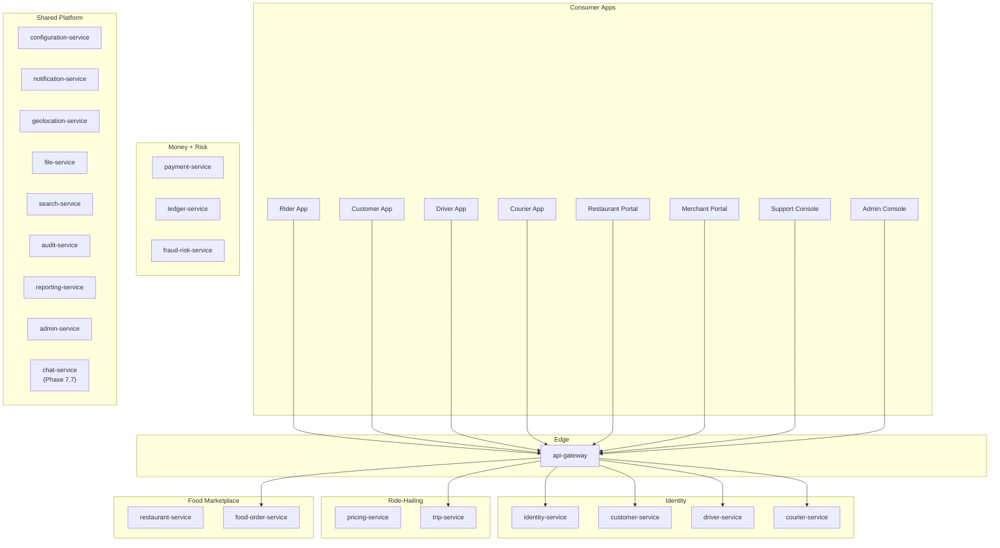
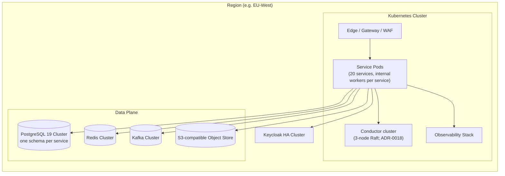

# System Overview

## What This Platform Is

A **multi-tenant, multi-country, configurable** digital marketplace
platform that runs two consumer products on one shared foundation:

1. **Ride-hailing** — on-demand and scheduled rides with driver
   matching, live tracking, dynamic pricing, and post-trip payment.
2. **Food delivery & marketplace** — merchant/restaurant onboarding,
   menu management, order placement, courier dispatch, and delivery
   tracking.

The platform serves these actors:

- **Customers** — book rides, order food, pay, rate, contact support.
- **Drivers** — go online, accept rides, complete trips, earn,
  withdraw.
- **Couriers** — go online, accept deliveries, complete them, earn,
  withdraw.
- **Restaurant owners / staff** — manage menu, hours, orders,
  settlements.
- **Merchant owners / staff** — manage branches, finance, reporting.
- **Support agents** — handle tickets, disputes, refunds, account
  issues (via `admin-service` support module).
- **Operations / finance / admin** — configure rules, review fraud,
  run reports.
- **Internal systems** — service-to-service, batch jobs,
  reconciliation.

## Service Catalog (21 Active)

The platform is decomposed into **21 bounded-context microservices**
per [ADR-0017](adrs/0017-20-service-architecture.md) plus the
Phase 7.7 cross-cutting `chat-service` addendum. The previous
58-service target was consolidated and the 38 absorbed suites are
deleted per [[trips-enjoy-service-consolidation-payment-centralization]];
see [`../MIGRATION_HUB.md`](../MIGRATION_HUB.md) for the per-capability
mapping.

| # | Service | Tier | Bounded context |
|---|---------|------|-----------------|
| 1 | `api-gateway` | T1 | Edge (also terminates `wss://…/v1/chat/ws`) |
| 2 | `identity-service` | T1 | Identity (Keycloak bridge) |
| 3 | `customer-service` | T1 | Customer / cross-persona profile / addresses / loyalty account |
| 4 | `driver-service` | T1 | Driver / vehicle / availability / location / dispatch / incentive / deals |
| 5 | `trip-service` | T1 | Ride request, trip, scheduled, safety, history, trip reviews, Phase 7/7.5 |
| 6 | `pricing-service` | T1 | Pricing engine, tax, promotion, loyalty pricing, geo overrides |
| 7 | `restaurant-service` | T1 | Merchant / restaurant / branch / menu / inventory / staff |
| 8 | `food-order-service` | T1 | Cart / checkout / food order / queue / food reviews |
| 9 | `courier-service` | T1 | Courier / KYC / location / matching / deals / pickup / delivery / proof |
| 10 | `payment-service` | T1 | Operational money — intents / wallet / ride + food sagas / earnings / settlement / COD |
| 11 | `ledger-service` | T1 | Double-entry journal (immutable) |
| 12 | `geolocation-service` | T1 | Geocode / ETA / routing / zones |
| 13 | `notification-service` | T2 | Templates / immutable snapshot chain / provider adapters / **chat offline push** |
| 14 | `configuration-service` | T1 | Config / flags / kill switches / lookup administration |
| 15 | `search-service` | T2 | Cross-domain search / discovery projections (admin-only chat index) |
| 16 | `fraud-risk-service` | T1 | Risk scoring / advising payment / **chat abuse signal** |
| 17 | `admin-service` | T1 | Management plane / SUPER_ADMIN preset / support case module / **chat moderation escalation** |
| 18 | `reporting-service` | T3 | Read models / data lake / exports / **chat analytics + retention sweep** |
| 19 | `file-service` | T2 | Storage driver boundary / **chat attachments** |
| 20 | `audit-service` | T2 | Immutable audit chain / **chat audit** |
| 21 | **`chat-service`** *(Phase 7.7)* | T1 | **In-app real-time 1:1 chat (rider ↔ driver, customer ↔ restaurant, customer ↔ courier)** |

Locked (content-unchanged from prior approval): `identity-service`,
`file-service`, `audit-service`. The full per-row ownership table is in
[`MICROSERVICES_MAP.md`](MICROSERVICES_MAP.md); the source-of-truth
matrix is in [`DATA_OWNERSHIP.md`](DATA_OWNERSHIP.md).

## Internal Scaling Model

A survivor is one bounded-context product/public identity but may ship
**independently scalable internal Kubernetes workers** from the same
versioned release. Separate HPA/worker deployments are kept for:

- `driver-service` location / matching workers
- `courier-service` location / matching workers
- `notification-service` per-channel workers
- `reporting-service` consumer / export workers
- `payment-service` saga / payout / reconciliation / webhook workers
- `geolocation-service` routing / ETA workers
- `chat-service` WebSocket fan-out replicas + offline-delivery dispatcher
  *(Phase 7.7)*

This preserves hot-path and Kafka-lag scaling without restoring
obsolete public services. See
[`DEPLOYMENT_ARCHITECTURE.md`](DEPLOYMENT_ARCHITECTURE.md).

## Business Capabilities (Bounded Contexts)

## How the Two Products Share Infrastructure

| Capability | Ride | Food | Shared Service |
|------------|------|------|----------------|
| Identity & login | ✅ | ✅ | `identity-service`, `customer-service` (profile) |
| Payments | ✅ | ✅ | `payment-service` |
| Wallet | ✅ | ✅ | `payment-service` (wallet) |
| Pricing engine | ✅ | ✅ | `pricing-service` |
| Promotions | ✅ | ✅ | `pricing-service` (promotion) |
| Loyalty rules | ✅ | ✅ | `pricing-service` (loyalty pricing); `customer-service` (account) |
| Tax | ✅ | ✅ | `pricing-service` (tax) |
| Notifications | ✅ | ✅ | `notification-service` (provider adapters preserved; also chat offline push) |
| **In-app chat** (rider ↔ driver, customer ↔ restaurant, customer ↔ courier) | ✅ | ✅ | **`chat-service`** *(Phase 7.7)* |
| Search | ✅ | ✅ | `search-service` |
| Reviews | ✅ | ✅ | `trip-service` (trip reviews), `food-order-service` (food reviews), `search-service` (discovery projections) |
| Fraud / risk | ✅ | ✅ | `fraud-risk-service` |
| Configuration | ✅ | ✅ | `configuration-service` |
| Feature flags | ✅ | ✅ | `configuration-service` (flags) |
| Reporting | ✅ | ✅ | `reporting-service`, data lake |
| Geolocation | ✅ | ✅ | `geolocation-service` (zones absorbed) |
| Couriers | — | ✅ | `courier-service` (dispatch / tracking / delivery) |
| Drivers | ✅ | — | `driver-service` (availability / location / dispatch / incentives / vehicles) |
| Trip lifecycle | ✅ | — | `trip-service` (ride request / trip / history / safety / scheduled / rewards) |
| Order lifecycle | — | ✅ | `food-order-service` (cart / checkout / order / queue) |

## Deployment Topology (Logical)

## Non-Negotiable Architectural Principles

1. **Database per service.** No two services share a business
   database. Cross-service references are UUIDs without database FKs.
2. **APIs and events are integration boundaries.** A service never
   writes directly into another service's tables.
3. **Keycloak is the identity authority.** Domain services store only
   the `keycloak_user_id` and the domain-specific profile they need.
4. **Financial operations are idempotent and auditable.** All money
   movement goes through `payment-service` → `payment-service` (wallet)
   → `ledger-service`. Money is conserved via the double-entry ledger
   ([[accounting-four-layer-truth-model]]).
5. **Configuration is externalized.** Fares, fees, taxes, zones, ride
   types, and feature flags are config, not code.
6. **Events are versioned.** `domain.entity.event.vN` with
   backward-compatible payload evolution. Major breaking changes emit
   a new event in parallel; consumers migrate, then deprecate the old
   event.
7. **Strong consistency inside one service, eventual consistency
   across services.** A single PostgreSQL transaction enforces
   internal invariants. Cross-service invariants are enforced by
   sagas, outbox, and reconciliation.
8. **Every workflow has a failure path documented.** Compensation
   actions are explicit, not "we'll figure it out."
9. **Two workflow patterns side-by-side.** In-service saga (ADR-0010)
   for most flows; Netflix Conductor (ADR-0018) for the 17
   cross-cutting workflows across 5 flow families
   ([[trips-enjoy-conductor-workflow-engine-adoption]]).
10. **Observability is built in.** Structured logs, metrics,
    distributed traces, audit events, correlation IDs across all
    services.
11. **Historical transactions are immutable.** Price snapshots, tax
    snapshots, and rule snapshots are stored with the order/trip to
    keep the past reproducible when configuration changes.
12. **Append, never renumber.** Every cross-cutting addition is
    appended to the existing section / phase slots
    ([[trips-enjoy-docs-append-not-renumber]]).

## Key Trade-offs Already Made

- **PostgreSQL 19 per service, not per service-type.** This rules
  out the cheapest possible data layer in exchange for autonomous
  deploys and bounded blast radius. See
  [ADR-0002](adrs/0002-postgres-per-service.md).
- **Kafka over RabbitMQ as the default event broker.** Throughput,
  retention, partitioning, replay. RabbitMQ is acceptable for
  command-queue workloads that don't need replay. See
  [ADR-0005](adrs/0005-kafka-as-event-broker.md).
- **REST as the synchronous API, not gRPC or GraphQL.** Operability
  and tooling maturity. gRPC is acceptable for service-internal
  high-fanout traffic if a measured need appears. See
  [ADR-0004](adrs/0004-rest-as-primary-api.md).
- **Outbox + Saga for distributed coordination, not 2PC.** Pragmatic
  for cloud-native deployment. Conductor (ADR-0018) executes
  `compensationSteps` for the four named cross-cutting flows;
  in-service saga (ADR-0010) remains the default everywhere else.
- **Keycloak for identity, not a homegrown solution.** Standards,
  MFA, social, federation. See
  [ADR-0003](adrs/0003-keycloak-for-identity.md).
- **No shared business database — even read replicas are owned by
  the writer service.** Read models are replicated via
  `reporting-service` or per-service read stores. See
  [ADR-0002](adrs/0002-postgres-per-service.md).
- **Two-tier workflow orchestration.** In-service saga for default;
  external engine (Conductor) for flows whose compensation graph
  exceeds the in-service pattern's sweet spot
  ([[trips-enjoy-conductor-workflow-engine-adoption]]).
