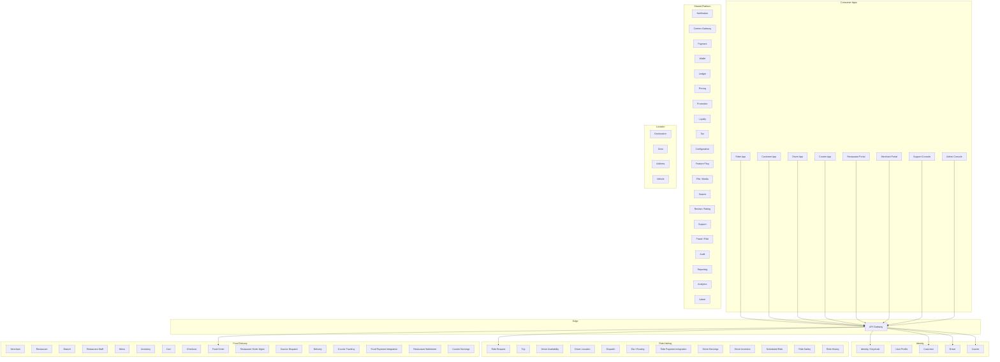
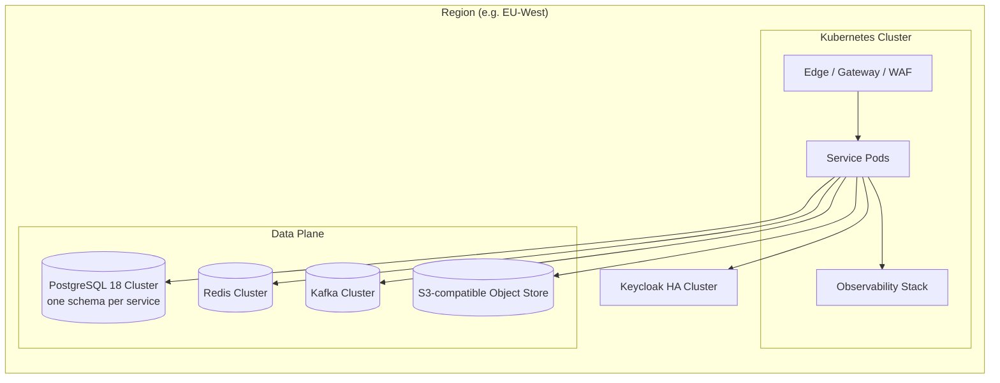

# System Overview

## What This Platform Is

A **multi-tenant, multi-country, configurable** digital marketplace platform
that runs two consumer products on one shared foundation:

1. **Ride-hailing** — on-demand and scheduled rides with driver matching,
   live tracking, dynamic pricing, and post-trip payment.
2. **Food delivery & marketplace** — merchant/restaurant onboarding, menu
   management, order placement, courier dispatch, and delivery tracking.

The platform serves these actors:

- **Customers** — book rides, order food, pay, rate, contact support.
- **Drivers** — go online, accept rides, complete trips, earn, withdraw.
- **Couriers** — go online, accept deliveries, complete them, earn, withdraw.
- **Restaurant owners / staff** — manage menu, hours, orders, settlements.
- **Merchant owners / staff** — manage branches, finance, reporting.
- **Support agents** — handle tickets, disputes, refunds, account issues.
- **Operations / finance / admin** — configure rules, review fraud, run reports.
- **Internal systems** — service-to-service, batch jobs, reconciliation.

## Business Capabilities (Bounded Contexts)

## How the Two Products Share Infrastructure

| Capability | Ride | Food | Shared Service |
|------------|------|------|----------------|
| Identity & login | ✅ | ✅ | `identity-service`, ``customer-service` (cross-persona profile)` |
| Payments | ✅ | ✅ | `payment-service` |
| Wallet | ✅ | ✅ | ``payment-service` (wallet)` |
| Pricing engine | ✅ | ✅ | `pricing-service` |
| Promotions | ✅ | ✅ | ``pricing-service` (promotion)` |
| Loyalty | ✅ | ✅ | ``pricing-service` (loyalty rules) / `customer-service` (account)` |
| Tax | ✅ | ✅ | ``pricing-service` (tax)` |
| Notifications | ✅ | ✅ | `notification-service` + ``notification-service` (provider ACL)` |
| Search | ✅ | ✅ | `search-service` |
| Reviews | ✅ | ✅ | ``trip-service` / `food-order-service` / `search-service` (review projections)` |
| Fraud / risk | ✅ | ✅ | `fraud-risk-service` |
| Configuration | ✅ | ✅ | `configuration-service` |
| Feature flags | ✅ | ✅ | ``configuration-service` (flags)` |
| Reporting | ✅ | ✅ | `reporting-service`, ``reporting-service` (data lake)` |
| Geolocation | ✅ | ✅ | `geolocation-service`, ``geolocation-service` (zones)` |
| Couriers | — | ✅ | `courier-service`, ``courier-service` (dispatch)`, ``courier-service` (tracking)`, ``payment-service` (courier earnings)` |
| Drivers | ✅ | — | `driver-service`, ``driver-service` (availability)`, ``driver-service` (location)`, ``payment-service` (driver earnings)`, ``driver-service` (dispatch)` |
| Trip lifecycle | ✅ | — | ``trip-service` (ride-request)`, `trip-service`, ``trip-service` (history)` |
| Order lifecycle | — | ✅ | `food-order-service`, ``food-order-service` (queue)`, ``courier-service` (delivery)` |

## Deployment Topology (Logical)

## Non-Negotiable Architectural Principles

1. **Database per service.** No two services share a business database.
   Cross-service references are UUIDs without database FKs.
2. **APIs and events are integration boundaries.** A service never writes
   directly into another service's tables.
3. **Keycloak is the identity authority.** Domain services store only the
   `keycloak_user_id` and the domain-specific profile they need.
4. **Financial operations are idempotent and auditable.** All money movement
   goes through `payment-service` → ``payment-service` (wallet)` → `ledger-service`.
5. **Configuration is externalized.** Fares, fees, taxes, zones, ride types,
   and feature flags are config, not code.
6. **Events are versioned.** `domain.entity.event.vN` with backward-compatible
   payload evolution. Major breaking changes emit a new event in parallel;
   consumers migrate, then deprecate the old event.
7. **Strong consistency inside one service, eventual consistency across
   services.** A single PostgreSQL transaction enforces internal invariants.
   Cross-service invariants are enforced by sagas, outbox, and reconciliation.
8. **Every workflow has a failure path documented.** Compensation actions are
   explicit, not "we'll figure it out."
9. **Observability is built in.** Structured logs, metrics, distributed traces,
   audit events, correlation IDs across all services.
10. **Historical transactions are immutable.** Price snapshots, tax snapshots,
    and rule snapshots are stored with the order/trip to keep the past
    reproducible when configuration changes.

## Key Trade-offs Already Made

- **PostgreSQL 18 per service, not per service-type.** This rules out the
  cheapest possible data layer in exchange for autonomous deploys and
  bounded blast radius. See ADR-0002.
- **Kafka over RabbitMQ as the default event broker.** Throughput, retention,
  partitioning, replay. RabbitMQ is acceptable for command-queue workloads
  that don't need replay. See ADR-0005.
- **REST as the synchronous API, not gRPC or GraphQL.** Operability and
  tooling maturity. gRPC is acceptable for service-internal high-fanout
  traffic if a measured need appears. See ADR-0004.
- **Outbox + Saga for distributed coordination, not 2PC.** Pragmatic for
  cloud-native deployment. See ADR-0010.
- **Keycloak for identity, not a homegrown solution.** Standards, MFA, social,
  federation. See ADR-0003.
- **No shared business database — even read replicas are owned by the
  writer service.** Read models are replicated via `reporting-service` or
  per-service read stores. See ADR-0002.
