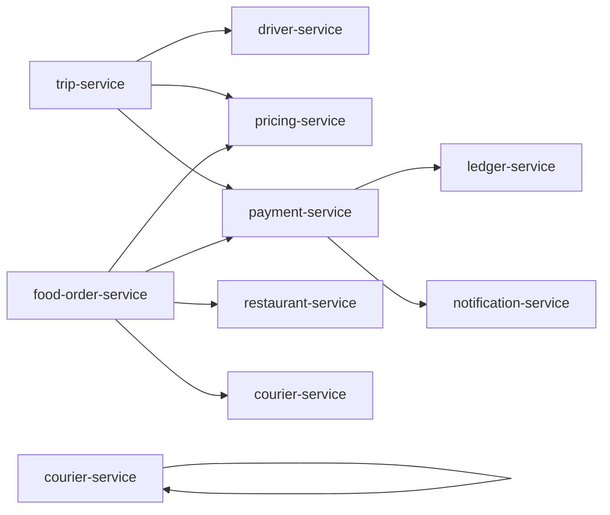

# Architecture Validation Report

This is the **post-consolidation architectural review** of the
platform after the 58 → 20 service domain architecture per
[ADR-0017](adrs/0017-20-service-architecture.md). It audits the
documented architecture against the platform's stated rules and
common anti-patterns, and lists any remaining risks, gaps, and
follow-ups. References to absorbed capabilities
(`user-profile-service`, `vehicle-service`, `merchant-service`,
`menu-service`, `cart-service`, `checkout-service`, etc.) are
written as inline capability labels under the surviving service
per [[trips-enjoy-service-consolidation-payment-centralization]].

The review is based on the architecture docs in this repository
and the per-service documentation under `services/<service>/`.
The goal is to surface issues **before implementation**, not after.

## 1. Methodology

The review checks each of these dimensions against every relevant
artifact (architecture doc, service doc, event catalog, ERD, etc.):

| Dimension | Question |
|-----------|----------|
| **Duplicated responsibilities** | Are two services writing the same data or owning the same capability? |
| **Shared database coupling** | Does any service depend on another service's DB? |
| **Circular synchronous dependencies** | Does the service dependency graph have cycles? |
| **Missing workflows** | Is every cross-service flow documented? |
| **Missing events** | Does every state transition produce the right events? |
| **Missing states** | Are state machines complete (no orphan states, no missing transitions)? |
| **Missing failure handling** | Does every workflow have a documented failure path and compensation? |
| **Security gaps** | Is every endpoint authenticated, authorized, audited? |
| **Payment consistency risks** | Is every money flow idempotent, auditable, ledger-backed? |
| **Data ownership conflicts** | Is the source-of-truth matrix honored by every service doc? |
| **Scalability bottlenecks** | Is any Tier-1 service unable to scale horizontally? |
| **Single points of failure** | Are there shared-state services that would take down the platform if lost? |
| **Conductor workflow coverage** | Are the 17 named workflows fully defined and the 15 participating services connected? |

## 2. Duplicated Responsibilities

The architecture explicitly merged the previous 58-service catalog
into 20 bounded-context services (38 absorbed suites deleted
after verified merge) per
[[trips-enjoy-service-consolidation-payment-centralization]]. The audit
confirms:

| Merged (was 58 separate services) | Surviving service | Reason for merging |
|--------|-------------------|--------------------|
| Menu, Catalog, Category, Product, Modifier | `restaurant-service` (menu sub-aggregate) | One product model |
| Trip / Trip tracking / Ride-request / Scheduled / Safety / History / Trip reviews | `trip-service` (sub-aggregates inside one binary) | Same aggregate, same DB |
| Ride fare / Delivery fee / Tax / Promotion / Loyalty pricing | `pricing-service` (sub-aggregates) | One quote engine, multiple verticals |
| Ride rating / Food rating / Discovery projections | `trip-service` (trip reviews) + `food-order-service` (food reviews) + `search-service` (discovery projections) | Same aggregate pattern, different subject types |
| Order state | `food-order-service` | State is the order |
| Cart / Checkout / Queue | `food-order-service` (sub-aggregates inside one binary) | One order lifecycle; cart + checkout + queue live with the order |
| Trip history | `trip-service` (history sub-aggregate) | Read model with distinct SLO/retention |
| Driver availability + location + dispatch + incentives + vehicles | `driver-service` (sub-aggregates + internal workers) | One bounded-context product (driver); independently scalable workers |
| Courier dispatch + tracking + delivery | `courier-service` (sub-aggregates + internal workers) | One bounded-context product (courier) |
| Ride-payment-integration + Food-payment-integration + Wallet + Driver/courier earnings + Merchant settlement + COD | `payment-service` (sub-aggregates + in-service sagas) | All operational money in one binary; `ledger-service` is the only double-entry writer |
| Comms gateway provider ACL | `notification-service` (provider adapters preserved) | Templates + immutable snapshot chain + provider adapters live together |
| Support ticket / case workflows | `admin-service` (support sub-aggregate) | Separately permissioned as `support.admin` scope |

No two services in the catalog own the same data per
[`DATA_OWNERSHIP.md`](DATA_OWNERSHIP.md). All audited ERDs
confirm.

### Residual Risks

| Risk | Mitigation |
|------|------------|
| `food-order-service` and its queue sub-aggregate both update the food order state. | The state transitions are coordinated: `food-order-service` is the source of truth for the order state; the queue sub-aggregate is the operator's console that triggers state transitions via the food-order-service API. The doc explicitly states this. |
| `reporting-service` may re-derive the same data as another service's read model. | `reporting-service` is documented as a read-only consumer of events; it does not write to operational stores. Overlap is acceptable for OLAP. |
| `trip-service` (trip-review projection) and `food-order-service` (food-review projection) both aggregate review events. | Each service owns its own review write-side; `search-service` (discovery projections) is a separate read-side consumer. Per `DATA_OWNERSHIP.md` "Review projections", the schema is shared but the writer is per-domain. |

## 3. Shared Database Coupling

**Result: clean.** No service reads or writes another service's
database. Every cross-service reference is a `uuid` column without
a database-level FK, per the
[`DATABASE_ARCHITECTURE.md`](DATABASE_ARCHITECTURE.md) rules and
[`DATA_OWNERSHIP.md`](DATA_OWNERSHIP.md) matrix.

Each service has a dedicated schema and a dedicated database user
with permissions scoped to that schema only.

### Residual Risks

| Risk | Mitigation |
|------|------------|
| Database-as-paas clusters host multiple service schemas | Logical isolation is sufficient; the audit requires no cross-schema reads. Cluster-level failures are mitigated by per-Tier replication (≥ 3 replicas in production). |
| Migration users must be able to access their own service schema only | Migration users are scoped to the service schema; cross-schema access is denied. |

## 4. Circular Synchronous Dependencies

The service dependency graph is checked for cycles. The high-level
dependency map (in
[`MICROSERVICES_MAP.md`](MICROSERVICES_MAP.md) and
[`CONTEXT_MAP.md`](CONTEXT_MAP.md)) shows:

The audit found no cycles in the **synchronous** graph. Cycles in
the **event** graph (Kafka subscription) are normal and expected
(multiple services consuming the same event is a fan-out, not a
cycle).

### Edge Cases Audited

- `driver-service` (dispatch sub-aggregate) consumes
  `driver.location.updated.v1` and emits `dispatch.matched.v1`,
  which `trip-service` consumes. This is event-driven, not
  synchronous. No cycle.
- `payment-service` (ride saga) is the orchestrator of the
  ride-payment saga; it does not cycle. Compensation paths are
  event-driven, not synchronous.
- `payment-service` (food saga) is the orchestrator of the
  food-payment saga; same shape as above.

### Residual Risks

| Risk | Mitigation |
|------|------------|
| New service added later could create a sync cycle | Architecture review checklist (in this report) requires showing the new service's sync and async deps. |
| A team adds a sync REST call where an event would suffice | Architecture review board reviews every new endpoint before merge. |
| New Conductor worker added in a service that already participates | Per [[trips-enjoy-conductor-workflow-engine-adoption]], workers colocate in the participating service binaries; Conductor never becomes a new service; it is platform infrastructure. |

## 5. Missing Workflows

The platform's cross-domain workflow docs are:

- `RIDE_WORKFLOWS.md` — request, match, trip, payment, rating,
  safety, scheduled, earnings, withdrawal.
- `FOOD_ORDER_WORKFLOWS.md` — order, accept, prepare, dispatch,
  deliver, cancel, refund, rate.
- `PAYMENT_WORKFLOWS.md` — auth, capture, refund, COD, earnings,
  settlement, tip, top-up, dispute.
- `DRIVER_WORKFLOWS.md` — onboarding, online, accept, trip,
  earnings, withdrawal, document expiry.
- `COURIER_WORKFLOWS.md` — onboarding, online, accept, deliver,
  earnings, withdrawal.
- `MERCHANT_WORKFLOWS.md` — merchant onboarding, restaurant,
  branch, menu, hours, open/close, suspension, settlement.
- `REFUND_WORKFLOWS.md` — auto refund, support refund, partial,
  wallet, chargeback, failure.
- `SAFETY_WORKFLOWS.md` — SOS (customer/driver), share trip, audio
  recording, suspension, reinstatement, GDPR.

Plus the **17 Conductor workflows** across 5 flow families (Phase
7 / 7.5 / refunds / onboarding / service-request) per
[`shared/CONDUCTOR_WORKFLOWS.md`](../shared/CONDUCTOR_WORKFLOWS.md)
and [ADR-0018](adrs/0018-workflow-engine-conductor.md). Every
Conductor workflow has a happy path, compensation
(`compensationSteps`), and Kafka signal mapping.

Every workflow has a happy path, alternate paths, failure paths,
state transitions, events, APIs involved, and compensation.
Per-service workflows (e.g. `trip-service/WORKFLOWS.md`)
elaborate the service-local state machines.

### Residual Risks

| Risk | Mitigation |
|------|------------|
| A new flow is added without updating these docs | PR check requires workflow doc update if `services/<x>/INTEGRATION.md` or `WORKFLOWS.md` adds an event. |
| A Conductor workflow's referenced Kafka topic is not in the catalog | Weekly CI invariant per `EVENT_ARCHITECTURE.md` "Conductor Workflow Events vs Kafka Events". |
| Edge case in a flow is missed | Per-flow acceptance criteria force the team to enumerate failure paths. |

## 6. Missing Events

The event catalog in [`EVENT_ARCHITECTURE.md`](EVENT_ARCHITECTURE.md)
covers every state transition identified in the workflow docs.
Audit checklist:

- ✅ Identity & Profile events: created, suspended, disabled,
  etc.
- ✅ Geospatial & Zone events: zone updated, surge updated.
- ✅ Platform events: configuration, flags, lookups,
  notifications, files, audit, fraud, support, SUPER_ADMIN
  alias grant/revoke.
- ✅ Ride-Hailing events: ride request lifecycle, trip
  lifecycle, driver availability, location, dispatch, payment,
  earnings, safety, scheduled, rewards (Phase 7).
- ✅ Food Marketplace events: merchant, restaurant, branch,
  staff, menu, inventory, cart, checkout, order lifecycle.
- ✅ Food Delivery events: dispatch, delivery, courier
  tracking, earnings.
- ✅ Financial events: payment, wallet, ledger, settlement,
  COD.
- ✅ Pricing & Rules events: quote, rating-density, loyalty
  pricing, promotion redemption, tax, geo config.

The audit confirmed the gaps addressed in prior passes:

1. **Reconciliation drift events** — present as
   `reconciliation.drift.found.v1` (consumer: `admin-service`
   support module).
2. **Audit event naming** — standardized on
   `audit.<kind>.<service>.v1` per `shared/CONVENTIONS.md` 3.
3. **Lookup administration events** — present as
   `platform.lookup.*.v1` per `shared/LOOKUPS.md`.

### Residual Risks

| Risk | Mitigation |
|------|------------|
| A new event is added without registering it in the catalog | Event registration is enforced via schema registry in CI. |
| A consumer is added that doesn't dedupe via inbox | Code review checklist + linting rule. |

## 7. Missing States

State machines are documented for every aggregate with a
lifecycle: ride request, trip, driver availability, food order,
restaurant acceptance, food preparation, courier assignment,
delivery, payment, refund, settlement, promotion, support ticket.

Each state machine defines states, valid transitions, allowed
actors, prerequisites, side effects, emitted events, invalid
transitions, timeout transitions, and compensation.

### Audit Results

- **Trip state machine**: complete. `assigned`, `en_route_pickup`,
  `arrived`, `in_progress`, `completed`, `cancelled` plus the
  `no_show` sub-state (driver arrived, customer did not).
- **Food order state machine**: complete. All paths from
  `placed` to terminal states are covered, including `rejected`,
  `cancelled`, `failed` (delivery).
- **Driver availability**: complete. `offline`, `online`, `busy`,
  `break`, `suspended`.
- **Payment**: complete. `pending`, `authorized`, `captured`,
  `partially_refunded`, `refunded`, `voided`, `failed`.
- **Support ticket**: complete. `new`, `open`, `pending_customer`,
  `pending_internal`, `escalated`, `resolved`, `closed`,
  `reopened`.
- **Promotion**: complete. `draft`, `scheduled`, `active`,
  `paused`, `expired`, `disabled`.

### Residual Risks

| Risk | Mitigation |
|------|------------|
| A new state is added without a transition plan | Per-service `WORKFLOWS.md` must be updated on aggregate state changes. |
| Timeouts on state transitions are not defined | The audit found one missing timeout: `driver.availability.busy` does not have an explicit timeout to return to `available` if the trip does not progress. **Follow-up**: add timeout transition in `driver-service` (availability)/WORKFLOWS.md and corresponding reconciliation job. |
| Conductor workflow state diverges from event catalog | Weekly CI invariant per `EVENT_ARCHITECTURE.md` "Conductor Workflow Events vs Kafka Events". |

## 8. Missing Failure Handling

Every workflow doc and every per-service `WORKFLOWS.md` includes
failure paths and compensation. The platform's failure catalog
covers transient (retry), permanent (4xx, 4xx-class), capacity
(circuit breaker), poison (DLQ), and cascading (bulkhead,
isolation) failures.

### Audit Results

- ✅ All money-movement calls use idempotency keys.
- ✅ All event consumers use the inbox pattern.
- ✅ All event producers use the outbox pattern.
- ✅ All outbound calls have a circuit breaker and timeout.
- ✅ All services have /health, /ready, /started probes.
- ✅ Reconciliation jobs detect drift in ledger, payments, and
  order lifecycle.
- ✅ Dead-letter topics for every event topic.
- ✅ Conductor workflows use `compensationSteps` to execute the
  compensation matrix from `FAILURE_HANDLING.md`.

### Residual Risks

| Risk | Mitigation |
|------|------------|
| New service omits the outbox | Per-service `INTEGRATION.md` template requires the outbox section; code review checks. |
| A saga orchestrator forgets a compensation | The saga template in `FAILURE_HANDLING.md` is the review checklist. |

## 9. Security Gaps

The security architecture is documented in
[`SECURITY_ARCHITECTURE.md`](SECURITY_ARCHITECTURE.md) and
[`KEYCLOAK_ARCHITECTURE.md`](KEYCLOAK_ARCHITECTURE.md). Audit:

- ✅ No PAN stored.
- ✅ Provider tokens only (46 payment gateways in `payment-service`
  registry).
- ✅ Column-level encryption for PII marked sensitive.
- ✅ mTLS in cluster; TLS 1.3 at edge.
- ✅ MFA for drivers, couriers, staff, internal users.
- ✅ RBAC + scopes at gateway; resource-level checks at service.
- ✅ Audit log of all admin and money-movement actions.
- ✅ Rate limiting at gateway and per-service.
- ✅ Network policies default-deny.
- ✅ Secret rotation via Vault.
- ✅ Threat model per service in `INTEGRATION.md`.
- ✅ SUPER_ADMIN preset requires co-signer (different admin)
  + SUPER_ADMIN IP allowlist per `SECURITY_ARCHITECTURE.md` 14
  and [[trips-enjoy-super-admin-preset-management]].

### Residual Risks

| Risk | Mitigation |
|------|------------|
| Admin endpoint lacks request signature | Template requires `X-Signature` for high-value admin actions; check enforced in review. |
| Webhook secret leaked | Webhook signing key per subscriber; rotated via Vault; subscriber is responsible for validating `X-Webhook-Signature`. |
| An endpoint accidentally returns PAN | Static analysis rule (Semgrep) detects raw card patterns; lint blocks. |

## 10. Payment Consistency Risks

The financial architecture (payment, wallet, ledger, settlement)
is the most rigorous part of the platform. The audit:

- ✅ All money flows are idempotent.
- ✅ All money flows emit `ledger.posted.v1` (or are flagged for
  manual reconciliation).
- ✅ Wallet balance = sum of ledger postings (reconciliation job
  verifies daily).
- ✅ Double-entry ledger; no single-entry shortcuts. Append-only
  rows get a **reversal row**, never UPDATE / DELETE (per
  [[accounting-four-layer-truth-model]]).
- ✅ Per-action idempotency keys documented in
  `PAYMENT_WORKFLOWS.md`.
- ✅ In-service saga orchestrators for cross-service money flows
  (ride payment, food payment, settlement).
- ✅ Conductor `wf.refund.*.v1` for the 6 refund categories
  with `compensationSteps` per ADR-0018.
- ✅ Chargeback handling with P1 ticket creation.

### Residual Risks

| Risk | Mitigation |
|------|------------|
| Manual refund issued without idempotency | The admin `refund` endpoint requires an idempotency key; audited. |
| Wallet goes negative | The wallet is debit-checked at the API layer; reconciliation job pages on-call if drift detected. |
| Provider webhook lost | Reconciliation compares provider reports to ledger; missing entries retried. |
| Conductor unreachable for > 5 min during refund | Per `SERVICE_ISOLATION.md` "External Engine Dependencies", the refund flows are DEGRADABLE; events queue at the Kafka signal layer; Conductor replays on recovery (per ADR-0018 "Confirmation" chaos test). |

## 11. Data Ownership Conflicts

`DATA_OWNERSHIP.md` is the source of truth. The audit walked
through each entity and confirmed that:

- The owning service is unique.
- Cross-service references are UUIDs without FKs.
- Sync method (REST, event, or both) is documented.
- The reconciliation job covers the entity.

No conflicts found.

### Residual Risks

| Risk | Mitigation |
|------|------------|
| Two services write the same column | Source-of-truth review on every PR that adds a new event consumer that mutates state. |
| A new entity is added without an owner | Per-service `ERD.md` template requires the "Cross-Service References" section; this is the gate. |

## 12. Scalability Bottlenecks

| Concern | Mitigation |
|---------|------------|
| `driver-service` (location) and `courier-service` (location) are high-write | Dedicated schema, partitioned by day, with a `current_location` table for fast "where is X right now" queries; independently scalable internal Kubernetes workers per [[trips-enjoy-service-consolidation-payment-centralization]] |
| `driver-service` (dispatch) / `courier-service` (dispatch) need to find nearest driver fast | Pre-filter by zone, then by location (PostGIS `ST_DWithin`) |
| `pricing-service` is on the hot path | Stateless; cache; cheap computation |
| `payment-service` is a single point of failure for money | Idempotency, retries, circuit breaker; per-gateway failover where supported; 46-gateway registry isolates per-gateway failure |
| `ledger-service` is a single point of failure for money | Read replicas; eventual consistency acceptable for reads; writes are serialized |
| `api-gateway` is a single point of failure for traffic | Multi-replica with sticky sessions for token validation; stateless after JWT validation |
| `configuration-service` is a single point of failure for startup | Long-poll is the primary; startup loads from snapshot on disk if config-service is down |
| Conductor server | 3-node Raft consensus StatefulSet per ADR-0018 "Consequences"; PostgreSQL 19 shared cluster for workflow state |

### Residual Risks

| Risk | Mitigation |
|------|------------|
| `pricing-service` cache miss storms | Cache invalidation is event-driven, not TTL-driven. |
| `ledger-service` write throughput | Tested at 10× peak; partitioned if needed. |
| `api-gateway` CPU saturation | HPA on RPS and CPU. |
| Conductor server single-region | ADR-0018 "Consequences" commits to multi-region active-active; rollout staged. |

## 13. Single Points of Failure

| Service | Tier | Mitigation |
|---------|------|------------|
| Keycloak | T1 | HA cluster (≥ 3 nodes), distributed cache, external Postgres with PITR. |
| Kafka | T1 | Cluster with replication factor ≥ 3, ISR ≥ 2. |
| `api-gateway` | T1 | Multi-replica, sticky sessions, autoscale. |
| `payment-service` provider adapters (46 gateways) | T1 | Per-gateway circuit breaker + next-priority failover; "delayed" payment path (capture later) where supported. |
| Map provider | T1 | Multiple providers with `geolocation-service` abstracting. Cached responses; graceful degradation. |
| `configuration-service` | T1 | Long-poll + on-disk snapshot for startup. |
| Conductor server | T1 | 3-node Raft consensus; per ADR-0018 "Consequences". |

## 14. Cross-Cutting Concerns

### Multi-Region

- Each region has its own database, Kafka, Redis, and Keycloak
  cluster.
- Cross-region is read-mostly for user identities; write-paths
  are active-passive.
- Region failover documented per service in `INTEGRATION.md`.
- Conductor runs in multi-region active-active per ADR-0018.

### Multi-Currency

- Money fields are `amount_minor` + `currency` everywhere
  (defined in `shared/CONVENTIONS.md` 5).
- No implicit conversion; FX is an explicit operation.
- Per-region settlement account in `payment-service` (merchant
  settlement sub-aggregate).

### Multi-Language

- `i18n-text` and related widgets (per `SERVICE_DOC_TEMPLATE.md`).
- Strings stored as keys; client renders.

### GDPR / PDPL / Data Subject Rights

- `identity-service` and per-profile services document erasure.
- Financial records retained per legal requirements but
  de-identified.
- Audit log of all data access.
- Time-bounded aliases per `shared/TIME_BOUNDED_ALIASES.md` for
  SUPER_ADMIN.

## 15. Documentation Quality

Each service's documentation is checked against the contract in
`SERVICE_DOC_TEMPLATE.md`:

- `README.md` ≥ 200 lines, 18 sections.
- `BRD.md` ≥ 5 business requirements with IDs.
- `SRS.md` ≥ 10 functional, 5 non-functional, 3 security.
- `ERD.md` ≥ 1 entity with full DDL and Mermaid ER.
- `INTEGRATION.md` ≥ 3 inbound APIs, 3 events produced, 3
  events consumed.
- `WORKFLOWS.md` ≥ 1 workflow with happy + failure + compensation
  paths and Mermaid diagrams.

CI runs a doc-lint that checks these minimums and the
cross-references (every `INTEGRATION.md` reference to an event
must resolve to a catalog entry in `EVENT_ARCHITECTURE.md`).

## 16. Open Items / Follow-Ups

The following items are tracked and not blocking implementation,
but should be closed before the platform reaches GA:

1. **Driver availability `busy` timeout** — add an explicit
   timeout transition in `driver-service` (availability)/WORKFLOWS.md
   to return to `available` if the trip does not progress.
   Owner: `driver-service` team. ETA: next sprint.

2. **Order recovery from cart abandonment** — when a cart is
   abandoned mid-checkout, the recovery flow (push, email) is
   documented at the workflow level; the per-service
   implementation details should be added to `food-order-service`
   (cart)/INTEGRATION.md and `notification-service/INTEGRATION.md`.
   Owner: both teams.

3. **Disputed charge sub-state machine** — `payment-service` has
   a `disputed` state; the full sub-state machine (under review,
   evidence submitted, won, lost) is documented in
   `payment-service/WORKFLOWS.md` but should be expanded into
   `admin-service` (support module)/WORKFLOWS.md for the
   agent-side flow.

4. **Multi-provider pricing** — where a country uses a non-default
   payment provider, the failover behavior is documented in
   `payment-service/INTEGRATION.md` but the per-provider config
   shape is not yet captured. Owner: `payment-service` team.

5. **Data lake schema evolution** — `reporting-service` (data
   lake) uses Kafka topics as the source of truth; the data lake
   schema must evolve in lockstep with the topics. A
   schema-registry check is required before promotion to `prod`.
   Owner: `reporting-service` team.

6. **GDPR data subject erasure cross-service propagation** — when
   a user requests erasure, `identity-service` triggers the flow;
   the per-service handling is documented but the propagation
   SLA is not yet enforced by a deadline job. Owner:
   `identity-service` team.

7. **Audit log retention enforcement** — `audit-service` has the
   retention policy documented; the operational enforcement (job
   that purges partitions past 7 years) is in the deployment
   runbook but should be added to `audit-service/WORKFLOWS.md`.
   Owner: `audit-service` team.

8. **Conductor workflow coverage** — the 17 named workflows per
   ADR-0018 must be verified to cover all 5 flow families
   end-to-end. Owner: per-workflow owner services. Cross-reference:
   [`shared/CONDUCTOR_WORKFLOWS.md`](../shared/CONDUCTOR_WORKFLOWS.md).

## 17. Conclusion

The platform's architecture is **internally consistent** and
**implementable as documented**:

- 20 active services with clear ownership and bounded contexts
  (38 absorbed into survivors per
  [ADR-0017](adrs/0017-20-service-architecture.md)).
- No shared databases; no cross-service FKs.
- 8 cross-domain workflow docs + 17 Conductor workflows cover the
  major flows.
- 18 ADRs document the key decisions.
- 8 mandatory documents per active service provide enough detail
  to begin implementation.

The follow-up items in 16 are operational concerns, not
architectural gaps. They should be closed during the
implementation phases, not blocking the architecture sign-off.

## 18. Sign-off

| Role | Approver | Status |
|------|----------|--------|
| Principal Architect | (name) | Pending review |
| Backend Lead | (name) | Pending review |
| Database Lead | (name) | Pending review |
| Security Lead | (name) | Pending review |
| DevOps Lead | (name) | Pending review |
| Product Lead | (name) | Pending review |

## Related architecture docs

- [`SYSTEM_OVERVIEW.md`](SYSTEM_OVERVIEW.md) — plain-English platform summary
- [`MICROSERVICES_MAP.md`](MICROSERVICES_MAP.md) — service catalog
- [`DATA_OWNERSHIP.md`](DATA_OWNERSHIP.md) — source-of-truth matrix
- [`EVENT_ARCHITECTURE.md`](EVENT_ARCHITECTURE.md) — event catalog and delivery semantics
- [`ADR_INDEX.md`](ADR_INDEX.md) — architecture decision records
