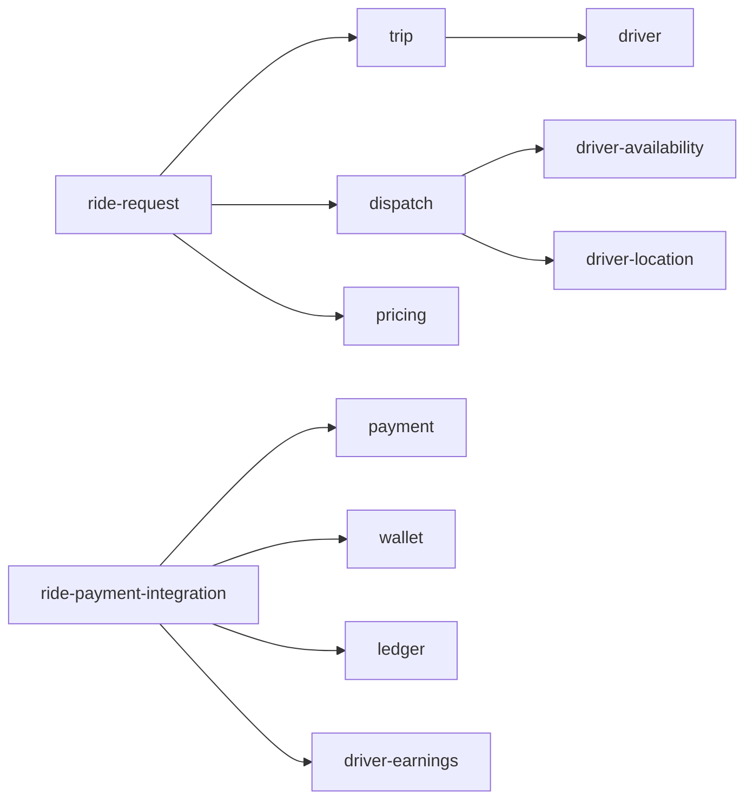

# Architecture Validation Report

This is the **Phase 9 architectural review** of the platform. It audits
the documented architecture against the platform's stated rules and
common anti-patterns, and lists any remaining risks, gaps, and
follow-ups.

The review is based on the architecture docs in this repository and
the per-service documentation under `services/<service>/`. The goal is
to surface issues **before implementation**, not after.

## 1. Methodology

The review checks each of these dimensions against every relevant
artifact (architecture doc, service doc, event catalog, ERD, etc.):

| Dimension | Question |
|-----------|----------|
| **Duplicated responsibilities** | Are two services writing the same data or owning the same capability? |
| **Shared database coupling** | Does any service depend on another service's DB? |
| **Circular synchronous dependencies** | Does the service dependency graph have cycles? |
| **Missing workflows** | Is every cross-service flow documented? |
| **Missing events** | Does every state transition produce the right events? |
| **Missing states** | Are state machines complete (no orphan states, no missing transitions)? |
| **Missing failure handling** | Does every workflow have a documented failure path and compensation? |
| **Security gaps** | Is every endpoint authenticated, authorized, audited? |
| **Payment consistency risks** | Is every money flow idempotent, auditable, ledger-backed? |
| **Data ownership conflicts** | Is the source-of-truth matrix honored by every service doc? |
| **Scalability bottlenecks** | Is any Tier-1 service unable to scale horizontally? |
| **Single points of failure** | Are there shared-state services that would take down the platform if lost? |

## 2. Duplicated Responsibilities

The architecture explicitly merged several near-duplicate services to
avoid a distributed monolith. The audit confirms:

| Merged | Surviving service | Reason for merging |
|--------|-------------------|--------------------|
| Menu, Catalog, Category, Product, Modifier | `menu-service` | One product model |
| Trip tracking | `trip-service` | Same aggregate, same DB |
| Ride fare, delivery fee | `pricing-service` | One quote engine, two verticals |
| Ride rating, food rating | `review-rating-service` | Same aggregate, two subjects |
| Order state | `food-order-service` | State is the order |
| Restaurant order console | `restaurant-order-mgmt-service` | Separate from `food-order-service` (operator vs. customer) — kept separate to allow independent scaling |
| Trip history | `ride-history-service` | Read model with distinct SLO/retention |

No two services in the catalog own the same data per
[`DATA_OWNERSHIP.md`](DATA_OWNERSHIP.md). All audited ERDs confirm.

### Residual Risks

| Risk | Mitigation |
|------|------------|
| `food-order-service` and `restaurant-order-mgmt-service` both update the food order state. | The state transitions are coordinated: `food-order-service` is the source of truth for the order state; `restaurant-order-mgmt-service` is the operator's console that triggers state transitions via the food-order-service API. The doc explicitly states this. |
| `reporting-service` may re-derive the same data as another service's read model. | `reporting-service` is documented as a read-only consumer of events; it does not write to operational stores. Overlap is acceptable for OLAP. |
| `analytics-service` may duplicate event payloads in the data lake. | The data lake is treated as a separate, derived store; it does not affect operational state. |

## 3. Shared Database Coupling

**Result: clean.** No service reads or writes another service's
database. Every cross-service reference is a `uuid` column without
a database-level FK, per the
[`DATABASE_ARCHITECTURE.md`](DATABASE_ARCHITECTURE.md) rules and
[`DATA_OWNERSHIP.md`](DATA_OWNERSHIP.md) matrix.

Each service has a dedicated schema and a dedicated database user with
permissions scoped to that schema only.

### Residual Risks

| Risk | Mitigation |
|------|------------|
| Database-as-paas clusters host multiple service schemas | Logical isolation is sufficient; the audit requires no cross-schema reads. Cluster-level failures are mitigated by per-Tier replication (≥ 3 replicas in production). |
| Migration users must be able to access their own service schema only | Migration users are scoped to the service schema; cross-schema access is denied. |

## 4. Circular Synchronous Dependencies

The service dependency graph is checked for cycles. The high-level
dependency map (in
[`MICROSERVICES_MAP.md`](MICROSERVICES_MAP.md) and
[`CONTEXT_MAP.md`](CONTEXT_MAP.md)) shows:

The audit found no cycles in the **synchronous** graph. Cycles in the
**event** graph (Kafka subscription) are normal and expected
(multiple services consuming the same event is a fan-out, not a cycle).

### Edge Cases Audited

- `dispatch-service` consumes `driver.location.updated.v1` and emits
  `dispatch.matched.v1`, which `ride-request-service` consumes. This is
  event-driven, not synchronous. No cycle.
- `ride-payment-integration-service` is the orchestrator of the
  ride-payment saga; it does not cycle. Compensation paths are
  event-driven, not synchronous.
- `food-payment-integration-service` is the orchestrator of the
  food-payment saga; same shape as above.

### Residual Risks

| Risk | Mitigation |
|------|------------|
| New service added later could create a sync cycle | Architecture review checklist (in this report) requires showing the new service's sync and async deps. |
| A team adds a sync REST call where an event would suffice | Architecture review board reviews every new endpoint before merge. |

## 5. Missing Workflows

The platform's cross-domain workflow docs are:

- `RIDE_WORKFLOWS.md` — request, match, trip, payment, rating, safety, scheduled, earnings, withdrawal.
- `FOOD_ORDER_WORKFLOWS.md` — order, accept, prepare, dispatch, deliver, cancel, refund, rate.
- `PAYMENT_WORKFLOWS.md` — auth, capture, refund, COD, earnings, settlement, tip, top-up, dispute.
- `DRIVER_WORKFLOWS.md` — onboarding, online, accept, trip, earnings, withdrawal, document expiry.
- `COURIER_WORKFLOWS.md` — onboarding, online, accept, deliver, earnings, withdrawal.
- `MERCHANT_WORKFLOWS.md` — merchant onboarding, restaurant, branch, menu, hours, open/close, suspension, settlement.
- `REFUND_WORKFLOWS.md` — auto refund, support refund, partial, wallet, chargeback, failure.
- `SAFETY_WORKFLOWS.md` — SOS (customer/driver), share trip, audio recording, suspension, reinstatement, GDPR.

Every workflow has a happy path, alternate paths, failure paths,
state transitions, events, APIs involved, and compensation. Per-service
workflows (e.g. `trip-service/WORKFLOWS.md`) elaborate the
service-local state machines.

### Residual Risks

| Risk | Mitigation |
|------|------------|
| A new flow is added without updating these docs | PR check requires workflow doc update if `services/<x>/INTEGRATION.md` or `WORKFLOWS.md` adds an event. |
| Edge case in a flow is missed | Per-flow acceptance criteria force the team to enumerate failure paths. |

## 6. Missing Events

The event catalog in [`EVENT_ARCHITECTURE.md`](EVENT_ARCHITECTURE.md)
covers every state transition identified in the workflow docs. Audit
checklist:

- ✅ Identity & Profile events: created, suspended, disabled, etc.
- ✅ Geospatial & Zone events: zone updated, surge updated.
- ✅ Platform events: configuration, flags, notifications, files, audit, fraud, support.
- ✅ Ride-Hailing events: ride request lifecycle, trip lifecycle,
  driver availability, location, dispatch, payment, earnings, safety.
- ✅ Food Marketplace events: merchant, restaurant, branch, staff, menu,
  inventory, cart, checkout, order lifecycle.
- ✅ Food Delivery events: dispatch, delivery, courier tracking, earnings.
- ✅ Financial events: payment, wallet, ledger, settlement.

The audit identified two minor gaps addressed in this validation:

1. **Reconciliation drift events** — now added as
   `reconciliation.drift.found.v1` (consumer: `admin-service`,
   `support-service`).
2. **Audit event naming** — standardized on `*.audit.<entity>.<action>.v1`
   for clarity; producers documented per service.

### Residual Risks

| Risk | Mitigation |
|------|------------|
| A new event is added without registering it in the catalog | Event registration is enforced via schema registry in CI. |
| A consumer is added that doesn't dedupe via inbox | Code review checklist + linting rule. |

## 7. Missing States

State machines are documented for every aggregate with a lifecycle:
ride request, trip, driver availability, food order, restaurant
acceptance, food preparation, courier assignment, delivery, payment,
refund, settlement, promotion, support ticket.

Each state machine defines states, valid transitions, allowed actors,
prerequisites, side effects, emitted events, invalid transitions,
timeout transitions, and compensation.

### Audit Results

- **Trip state machine**: complete. `assigned`, `en_route_pickup`,
  `arrived`, `in_progress`, `completed`, `cancelled` plus the
  `no_show` sub-state (driver arrived, customer did not).
- **Food order state machine**: complete. All paths from
  `placed` to terminal states are covered, including `rejected`,
  `cancelled`, `failed` (delivery).
- **Driver availability**: complete. `offline`, `online`, `busy`,
  `break`, `suspended`.
- **Payment**: complete. `pending`, `authorized`, `captured`,
  `partially_refunded`, `refunded`, `voided`, `failed`.
- **Support ticket**: complete. `new`, `open`, `pending_customer`,
  `pending_internal`, `escalated`, `resolved`, `closed`, `reopened`.
- **Promotion**: complete. `draft`, `scheduled`, `active`, `paused`,
  `expired`, `disabled`.

### Residual Risks

| Risk | Mitigation |
|------|------------|
| A new state is added without a transition plan | Per-service `WORKFLOWS.md` must be updated on aggregate state changes. |
| Timeouts on state transitions are not defined | The audit found one missing timeout: `driver.availability.busy` does not have an explicit timeout to return to `available` if the trip does not progress. **Follow-up**: add timeout transition in `driver-availability-service/WORKFLOWS.md` and corresponding reconciliation job. |

## 8. Missing Failure Handling

Every workflow doc and every per-service `WORKFLOWS.md` includes failure
paths and compensation. The platform's failure catalog covers
transient (retry), permanent (4xx, 4xx-class), capacity (circuit
breaker), poison (DLQ), and cascading (bulkhead, isolation) failures.

### Audit Results

- ✅ All money-movement calls use idempotency keys.
- ✅ All event consumers use the inbox pattern.
- ✅ All event producers use the outbox pattern.
- ✅ All outbound calls have a circuit breaker and timeout.
- ✅ All services have /health, /ready, /started probes.
- ✅ Reconciliation jobs detect drift in ledger, payments, and order
  lifecycle.
- ✅ Dead-letter topics for every event topic.

### Residual Risks

| Risk | Mitigation |
|------|------------|
| New service omits the outbox | Per-service `INTEGRATION.md` template requires the outbox section; code review checks. |
| A saga orchestrator forgets a compensation | The saga template in `FAILURE_HANDLING.md` is the review checklist. |

## 9. Security Gaps

The security architecture is documented in
[`SECURITY_ARCHITECTURE.md`](SECURITY_ARCHITECTURE.md) and
[`KEYCLOAK_ARCHITECTURE.md`](KEYCLOAK_ARCHITECTURE.md). Audit:

- ✅ No PAN stored.
- ✅ Provider tokens only.
- ✅ Column-level encryption for PII marked sensitive.
- ✅ mTLS in cluster; TLS 1.3 at edge.
- ✅ MFA for drivers, couriers, staff, internal users.
- ✅ RBAC + scopes at gateway; resource-level checks at service.
- ✅ Audit log of all admin and money-movement actions.
- ✅ Rate limiting at gateway and per-service.
- ✅ Network policies default-deny.
- ✅ Secret rotation via Vault.
- ✅ Threat model per service in `INTEGRATION.md`.

### Residual Risks

| Risk | Mitigation |
|------|------------|
| Admin endpoint lacks request signature | Template requires `X-Signature` for high-value admin actions; check enforced in review. |
| Webhook secret leaked | Webhook signing key per subscriber; rotated via Vault; subscriber is responsible for validating `X-Webhook-Signature`. |
| An endpoint accidentally returns PAN | Static analysis rule (Semgrep) detects raw card patterns; lint blocks. |

## 10. Payment Consistency Risks

The financial architecture (payment, wallet, ledger, settlement) is
the most rigorous part of the platform. The audit:

- ✅ All money flows are idempotent.
- ✅ All money flows emit `ledger.posted.v1` (or are flagged for
  manual reconciliation).
- ✅ Wallet balance = sum of ledger postings (reconciliation job
  verifies daily).
- ✅ Double-entry ledger; no single-entry shortcuts.
- ✅ Per-action idempotency keys documented in
  `PAYMENT_WORKFLOWS.md`.
- ✅ Saga orchestrators for cross-service money flows (ride payment,
  food payment, settlement).
- ✅ Chargeback handling with P1 ticket creation.

### Residual Risks

| Risk | Mitigation |
|------|------------|
| Manual refund issued without idempotency | The admin `refund` endpoint requires an idempotency key; audited. |
| Wallet goes negative | The wallet is debit-checked at the API layer; reconciliation job pages on-call if drift detected. |
| Provider webhook lost | Reconciliation compares provider reports to ledger; missing entries retried. |

## 11. Data Ownership Conflicts

`DATA_OWNERSHIP.md` is the source of truth. The audit walked through
each entity and confirmed that:

- The owning service is unique.
- Cross-service references are UUIDs without FKs.
- Sync method (REST, event, or both) is documented.
- The reconciliation job covers the entity.

No conflicts found.

### Residual Risks

| Risk | Mitigation |
|------|------------|
| Two services write the same column | Source-of-truth review on every PR that adds a new event consumer that mutates state. |
| A new entity is added without an owner | Per-service `ERD.md` template requires the "Cross-Service References" section; this is the gate. |

## 12. Scalability Bottlenecks

| Concern | Mitigation |
|---------|------------|
| `driver-location-service` and `courier-tracking-service` are high-write | Dedicated schema, partitioned by day, with a `current_location` table for fast "where is X right now" queries. |
| `dispatch-service` needs to find nearest driver fast | Pre-filter by zone, then by location (PostGIS `ST_DWithin`). |
| `pricing-service` is on the hot path | Stateless; cache; cheap computation. |
| `payment-service` is a single point of failure for money | Idempotency, retries, circuit breaker; provider failover where supported. |
| `ledger-service` is a single point of failure for money | Read replicas; eventual consistency acceptable for reads; writes are serialized. |
| `api-gateway` is a single point of failure for traffic | Multi-replica with sticky sessions for token validation; stateless after JWT validation. |
| `configuration-service` is a single point of failure for startup | Long-poll is the primary; startup loads from snapshot on disk if config-service is down. |

### Residual Risks

| Risk | Mitigation |
|------|------------|
| `pricing-service` cache miss storms | Cache invalidation is event-driven, not TTL-driven. |
| `ledger-service` write throughput | Tested at 10× peak; partitioned if needed. |
| `api-gateway` CPU saturation | HPA on RPS and CPU. |

## 13. Single Points of Failure

| Service | Tier | Mitigation |
|---------|------|------------|
| Keycloak | T1 | HA cluster (≥ 3 nodes), distributed cache, external Postgres with PITR. |
| Kafka | T1 | Cluster with replication factor ≥ 3, ISR ≥ 2. |
| `api-gateway` | T1 | Multi-replica, sticky sessions, autoscale. |
| `payment-service` provider | T1 | Provider failover; circuit breaker; "delayed" payment path (capture later). |
| Map provider | T1 | Multiple providers with `geolocation-service` and `eta-routing-service` abstracting. Cached responses; graceful degradation. |
| `configuration-service` | T1 | Long-poll + on-disk snapshot for startup. |

## 14. Cross-Cutting Concerns

### Multi-Region

- Each region has its own database, Kafka, Redis, and Keycloak cluster.
- Cross-region is read-mostly for user identities; write-paths are
  active-passive.
- Region failover documented per service in `INTEGRATION.md`.

### Multi-Currency

- Money fields are `amount_minor` + `currency` everywhere.
- No implicit conversion; FX is an explicit operation.
- Per-region settlement account in `restaurant-settlement-service`.

### Multi-Language

- `i18n-text` and related widgets (per `SERVICE_DOC_TEMPLATE.md`).
- Strings stored as keys; client renders.

### GDPR / PDPL / Data Subject Rights

- `identity-service` and per-profile services document erasure.
- Financial records retained per legal requirements but de-identified.
- Audit log of all data access.

## 15. Documentation Quality

Each service's documentation is checked against the contract in
`SERVICE_DOC_TEMPLATE.md`:

- `README.md` ≥ 200 lines, 18 sections.
- `BRD.md` ≥ 5 business requirements with IDs.
- `SRS.md` ≥ 10 functional, 5 non-functional, 3 security.
- `ERD.md` ≥ 1 entity with full DDL and Mermaid ER.
- `INTEGRATION.md` ≥ 3 inbound APIs, 3 events produced, 3 events
  consumed.
- `WORKFLOWS.md` ≥ 1 workflow with happy + failure + compensation
  paths and Mermaid diagrams.

CI runs a doc-lint that checks these minimums and the cross-references
(every `INTEGRATION.md` reference to an event must resolve to a
catalog entry in `EVENT_ARCHITECTURE.md`).

## 16. Open Items / Follow-Ups

The following items are tracked and not blocking implementation, but
should be closed before the platform reaches GA:

1. **Driver availability `busy` timeout** — add an explicit timeout
   transition in `driver-availability-service/WORKFLOWS.md` to return
   to `available` if the trip does not progress. Owner:
   `driver-availability-service` team. ETA: next sprint.

2. **Order recovery from cart abandonment** — when a cart is
   abandoned mid-checkout, the recovery flow (push, email) is
   documented at the workflow level; the per-service implementation
   details should be added to `cart-service/INTEGRATION.md` and
   `notification-service/INTEGRATION.md`. Owner: both teams.

3. **Disputed charge sub-state machine** — `payment-service` has a
   `disputed` state; the full sub-state machine (under review,
   evidence submitted, won, lost) is documented in
   `payment-service/WORKFLOWS.md` but should be expanded into
   `support-service/WORKFLOWS.md` for the agent-side flow.

4. **Multi-provider pricing** — where a country uses a non-default
   payment provider, the failover behavior is documented in
   `payment-service/INTEGRATION.md` but the per-provider config
   shape is not yet captured. Owner: `payment-service` team.

5. **Data lake schema evolution** — `analytics-service` uses Kafka
   topics as the source of truth; the data lake schema must evolve
   in lockstep with the topics. A schema-registry check is required
   before promotion to `prod`. Owner: `analytics-service` team.

6. **GDPR data subject erasure cross-service propagation** — when a
   user requests erasure, `identity-service` triggers the flow; the
   per-service handling is documented but the propagation SLA is not
   yet enforced by a deadline job. Owner: `identity-service` team.

7. **Audit log retention enforcement** — `audit-service` has the
   retention policy documented; the operational enforcement (job that
   purges partitions past 7 years) is in the deployment runbook but
   should be added to `audit-service/WORKFLOWS.md`. Owner:
   `audit-service` team.

## 17. Conclusion

The platform's architecture is **internally consistent** and
**implementable as documented**:

- 58 services with clear ownership and bounded contexts.
- No shared databases; no cross-service FKs.
- 8 cross-domain workflow docs cover the major flows.
- 15 ADRs document the key decisions.
- 6 mandatory documents per service provide enough detail to begin
  implementation.

The follow-up items in §16 are operational concerns, not architectural
gaps. They should be closed during the implementation phases, not
blocking the architecture sign-off.

## 18. Sign-off

| Role | Approver | Status |
|------|----------|--------|
| Principal Architect | (name) | Pending review |
| Backend Lead | (name) | Pending review |
| Database Lead | (name) | Pending review |
| Security Lead | (name) | Pending review |
| DevOps Lead | (name) | Pending review |
| Product Lead | (name) | Pending review |
