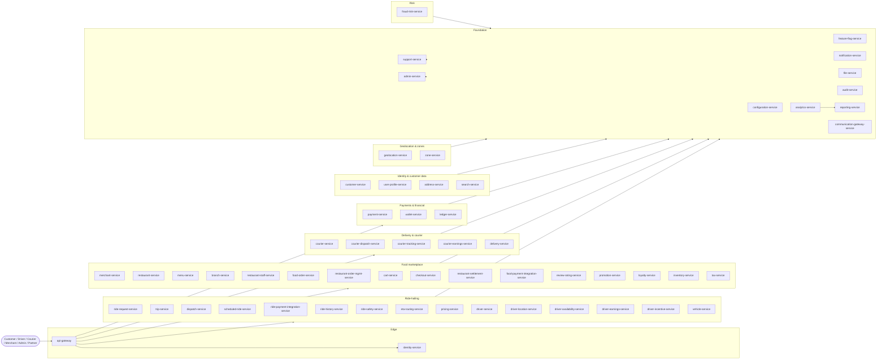

# Service Catalog

> The catalog of all **58 services** in the platform. Each service has a
> `README.md`, `BRD.md`, `SRS.md`, `ERD.md`, `INTEGRATION.md`,
> `WORKFLOWS.md`, and `TECH.md` under its directory.
>
> See [`RECOMMENDATIONS.md`](./RECOMMENDATIONS.md) for the technology map
> (language + framework + key libraries) and the platform-wide baseline in
> [`../shared/PLATFORM_BASELINE.md`](../shared/PLATFORM_BASELINE.md) for
> the shared infrastructure (PostgreSQL 18, Kafka, Keycloak, etc.) that
> every service inherits.
>
> **Super-admin permission to access all services** is managed by
> [`admin-service`](./admin-service/README.md) through the
> `SUPER_ADMIN` permission preset (1 × `platform.super_admin` + 58 ×
> `<service>.admin` scopes). The preset is enumerable at
> `GET /v1/admin/presets`, the 58-service catalog with each service's
> preset membership is at `GET /v1/admin/services`, and grant / revoke
> are `POST/DELETE /v1/admin/identity/(grant|revoke)-super-admin`.
> Both grant and revoke require break-glass co-signature (per
> `SECURITY_ARCHITECTURE.md` §14). See
> [`admin-service/INTEGRATION.md`](./admin-service/INTEGRATION.md) §1.12–§1.16.

## How to read this catalog

- **Grouped by bounded context** — the same grouping as
  [`../architecture/DOMAIN_MAP.md`](../architecture/DOMAIN_MAP.md).
- **One-line summary per service** — taken from that service's README §1
  (Purpose). Click through for the full contract.
- **Cross-cutting views** at the bottom: by data owner, by event producer,
  by tech profile.

---

## Platform overview

---

## Edge & shared platform (12 services)

These services are consumed by **every other service** or sit on the
platform boundary. They form the "operating system" the domain services
run on.

- **[`api-gateway`](./api-gateway/README.md)** — single stateless north-south edge for every external client; JWT validation, rate limiting, request transformation.
- **[`identity-service`](./identity-service/README.md)** — thin adapter over Keycloak; mirrors `sub` → stable internal `identity_id`; caches profile claims.
- **[`configuration-service`](./configuration-service/README.md)** — source of truth for business rules and numerical values (fares, fees, taxes, zones, ride types, eligibility).
- **[`feature-flag-service`](./feature-flag-service/README.md)** — source of truth for feature flags (boolean, multivariate, % rollout, segment-targeted, time-windowed).
- **[`notification-service`](./notification-service/README.md)** — user-visible messaging orchestrator (push, SMS, email, in-app, **WhatsApp structured**); templates, preferences, delivery state, immutable template-history audit chain, Mermaid rendering demo + a 80-entry JSON seed catalog across 5 channels × 2 locales (`seeds/templates.v1.json`). See also [`WHATSAPP_TEMPLATES.md`](./notification-service/WHATSAPP_TEMPLATES.md), [`TEMPLATE_HISTORY.md`](./notification-service/TEMPLATE_HISTORY.md), [`MESSAGE_HISTORY.md`](./notification-service/MESSAGE_HISTORY.md).
- **[`file-service`](./file-service/README.md)** — file/media storage abstraction; KYC, menu photos, vehicle photos, support attachments.
- **[`audit-service`](./audit-service/README.md)** — immutable audit log of every audit-relevant event with strict-RBAC search API.
- **[`analytics-service`](./analytics-service/README.md)** — event ingestion pipeline for the data lake; consumes every domain event with PII handling.
- **[`reporting-service`](./reporting-service/README.md)** — read model + dashboard service; materialises domain events into queryable views; exports to CSV / Parquet.
- **[`admin-service`](./admin-service/README.md)** — operations console web UI for support, finance, ops, security; **CRUD producer for `pricing.geo_config.updated.v1` via `/v1/admin/pricing/geo-config[...]`** (per-location and OD-pair pricing overrides, with rollback requiring break-glass and writing a new history row per the reversal rule on `ledger.postings`).
- **[`support-service`](./support-service/README.md)** — support ticket and investigation authority; owns ticket lifecycle and conversations.
- **[`communication-gateway-service`](./communication-gateway-service/README.md)** — anti-corruption layer in front of external messaging providers (SMS / email / push / **WhatsApp**); plug-in provider model with capability matrix in [`WHATSAPP_PROVIDER_CONTRACT.md`](./communication-gateway-service/WHATSAPP_PROVIDER_CONTRACT.md) (zero-schema-change onboarding for Meta Cloud, 360dialog, Twilio WhatsApp, MessageBird WhatsApp, Gupshup, and future plug-ins).

## Ride-hailing (15 services)

The complete ride flow: search → request → match → pickup → trip → drop-off →
payment → earnings → review → history.

- **[`ride-request-service`](./ride-request-service/README.md)** — owns the ride booking aggregate: requested → matched → cancelled | expired.
- **[`trip-service`](./trip-service/README.md)** — owns the trip aggregate from driver acceptance through completion; authoritative record of where/when; **evaluates guaranteed rewards at `state=completed` (per-trip + hourly + daily floor for driver, per-trip credit for user) and emits `trip.reward.granted.v1` / `trip.reward.reversed.v1`**.
- **[`dispatch-service`](./dispatch-service/README.md)** — owns the match attempt: which driver gets which ride offer, in what order, with what fairness.
- **[`scheduled-ride-service`](./scheduled-ride-service/README.md)** — owns scheduled (future-dated) ride jobs; materialises them into live requests at the right time.
- **[`ride-payment-integration-service`](./ride-payment-integration-service/README.md)** — ride payment saga orchestrator: `trip.completed.v1` → captured payment + driver earning + ledger entry.
- **[`ride-history-service`](./ride-history-service/README.md)** — denormalised read model of trips, payments, reviews; optimised for fast reads.
- **[`ride-safety-service`](./ride-safety-service/README.md)** — trip safety state and emergency response (SOS, share-trip, audio recording, incident reports).
- **[`eta-routing-service`](./eta-routing-service/README.md)** — stateless adapter over the map provider; ETAs, route polylines, distance, alternatives.
- **[`pricing-service`](./pricing-service/README.md)** — pure computational engine for ride and order price quotes; **rating-density surge-pressure, frequent-rider loyalty discount, and per-location / OD-pair overrides sourced from `admin-service` (`pricing.geo_config.updated.v1`); cross-border trips produce both `tax_origin` and `tax_destination` lines**.
- **[`driver-service`](./driver-service/README.md)** — source of truth for the driver profile.
- **[`driver-location-service`](./driver-location-service/README.md)** — high-frequency driver location stream (current point + short recent trail).
- **[`driver-availability-service`](./driver-availability-service/README.md)** — driver's online state: available / busy, in which zone, for which ride types.
- **[`driver-earnings-service`](./driver-earnings-service/README.md)** — driver earnings ledger and withdrawal flow; **consumes `trip.reward.granted.v1` as `type=guaranteed_topup` and `trip.reward.reversed.v1` as `type=correction`; exposes `GET /v1/drivers/{id}/period-eligible-earnings?window=hourly|daily` for `trip-service`**.
- **[`driver-incentive-service`](./driver-incentive-service/README.md)** — quests, bonuses, surge guarantees; eligibility rules.
- **[`vehicle-service`](./vehicle-service/README.md)** — vehicles owned by drivers/couriers; registration, insurance, inspection.

## Food marketplace (15 services)

The complete marketplace: merchant onboarding → menu → cart → checkout →
order → kitchen → dispatch → courier → delivery → review → settlement.

- **[`merchant-service`](./merchant-service/README.md)** — canonical owner of the merchant aggregate (legal entity).
- **[`restaurant-service`](./restaurant-service/README.md)** — canonical owner of the restaurant aggregate (operational brand).
- **[`menu-service`](./menu-service/README.md)** — canonical owner of the menu aggregate (categories, products, modifiers, add-ons).
- **[`branch-service`](./branch-service/README.md)** — canonical owner of the branch aggregate (physical location of a restaurant).
- **[`restaurant-staff-service`](./restaurant-staff-service/README.md)** — restaurant staff aggregate (users operating a restaurant or branch).
- **[`food-order-service`](./food-order-service/README.md)** — canonical owner of the food order aggregate (cart + config snapshot + line items + state).
- **[`restaurant-order-mgmt-service`](./restaurant-order-mgmt-service/README.md)** — restaurant-side order queue; accept/reject timer, prep state (`preparing`, `ready`).
- **[`cart-service`](./cart-service/README.md)** — canonical owner of the shopping cart aggregate.
- **[`checkout-service`](./checkout-service/README.md)** — canonical owner of the checkout session aggregate (pre-payment state).
- **[`restaurant-settlement-service`](./restaurant-settlement-service/README.md)** — source of truth for what the platform owes a restaurant; payout run.
- **[`food-payment-integration-service`](./food-payment-integration-service/README.md)** — food payment saga orchestrator: authorize → capture → courier earn → restaurant payout.
- **[`review-rating-service`](./review-rating-service/README.md)** — post-trip / post-order reviews; aggregated ratings per driver / courier / restaurant.
- **[`promotion-service`](./promotion-service/README.md)** — coupons, campaigns, redemption rules.
- **[`loyalty-service`](./loyalty-service/README.md)** — customer points balances, tiers, earn/burn rules.
- **[`inventory-service`](./inventory-service/README.md)** — per-product stock counts, time-bound availability, 86-list.
- **[`tax-service`](./tax-service/README.md)** — tax calculation engine; jurisdiction rules, exemptions, net amount.

## Delivery & courier (5 services)

The last-mile delivery side: dispatch a courier, track them, deliver, pay them.

- **[`courier-service`](./courier-service/README.md)** — source of truth for the courier profile.
- **[`courier-dispatch-service`](./courier-dispatch-service/README.md)** — matches `ready` orders to couriers.
- **[`courier-tracking-service`](./courier-tracking-service/README.md)** — high-frequency courier location stream.
- **[`courier-earnings-service`](./courier-earnings-service/README.md)** — courier earnings ledger and withdrawals.
- **[`delivery-service`](./delivery-service/README.md)** — delivery aggregate: courier-assigned → delivered | failed.

## Identity & customer data (4 services)

The cross-persona user data layer.

- **[`customer-service`](./customer-service/README.md)** — source of truth for the customer profile.
- **[`user-profile-service`](./user-profile-service/README.md)** — common cross-persona user data (display name, avatar, locale, notifications prefs).
- **[`address-service`](./address-service/README.md)** — saved addresses (ride pickup, food delivery) with geocoded + normalised data.
- **[`search-service`](./search-service/README.md)** — search index coordination authority across multiple verticals (restaurants, menu items, support tickets).

## Geolocation & zones (2 services)

Spatial primitives used by ride, food, dispatch, and safety.

- **[`geolocation-service`](./geolocation-service/README.md)** — stateless adapter over an external map provider (geocode, reverse-geocode, place autocomplete).
- **[`zone-service`](./zone-service/README.md)** — geospatial zoning authority (cities, service zones, surge zones, restricted zones).

## Payments & financial (3 services)

Money movement: capture, hold, settle, ledger.

- **[`payment-service`](./payment-service/README.md)** — anti-corruption layer over payment provider; tokens (never raw PAN), intents, attempts, refunds, voids.
- **[`wallet-service`](./wallet-service/README.md)** — source of truth for customer wallet balance; ACID-strong; **consumes `trip.reward.granted.v1` for the user-side per-trip credit (when `trip.reward.user.kind = wallet_credit`) and `trip.reward.reversed.v1` for the corresponding debit; chart-of-account `2100_customer_credit_liability`**.
- **[`ledger-service`](./ledger-service/README.md)** — platform's authoritative double-entry financial ledger.

## Safety & risk (1 service)

- **[`fraud-risk-service`](./fraud-risk-service/README.md)** — real-time risk scoring and fraud detection; scores logins, payment attempts, dispatch attempts, GPS anomalies.

---

## Cross-cutting views

### By data ownership (source of truth)

The full source-of-truth matrix lives in
[`../architecture/DATA_OWNERSHIP.md`](../architecture/DATA_OWNERSHIP.md).
The single owners in this catalog:

| Entity | Owner service |
|---|---|
| Customer profile | `customer-service` |
| Driver profile | `driver-service` |
| Courier profile | `courier-service` |
| Merchant / Restaurant / Branch / Menu / Staff | `merchant-service`, `restaurant-service`, `branch-service`, `menu-service`, `restaurant-staff-service` |
| Ride request | `ride-request-service` |
| Trip | `trip-service` |
| Dispatch / Match | `dispatch-service`, `courier-dispatch-service` |
| Delivery | `delivery-service` |
| Payment intent | `payment-service` |
| Wallet balance | `wallet-service` |
| Ledger entries | `ledger-service` |
| Earnings | `driver-earnings-service`, `courier-earnings-service`, `restaurant-settlement-service` |
| Configuration values | `configuration-service` |
| Feature flags | `feature-flag-service` |
| Audit log | `audit-service` |
| Saved addresses | `address-service` |
| Notifications | `notification-service` |
| Search index | `search-service` |
| Reviews & ratings | `review-rating-service` |
| Promotions | `promotion-service` |
| Loyalty | `loyalty-service` |
| Inventory | `inventory-service` |
| Vehicle records | `vehicle-service` |
| Zone geometry | `zone-service` |
| Risk score | `fraud-risk-service` |

### By technology profile (see also `RECOMMENDATIONS.md`)

| Profile | Services |
|---|---|
| **Edge / hot path** (Go) | `api-gateway`, `geolocation-service`, `driver-location-service`, `courier-tracking-service`, `eta-routing-service`, `configuration-service`, `feature-flag-service`, `communication-gateway-service`, `analytics-service`, `notification-service` |
| **Business core** (Kotlin + Spring Boot 4) | Most domain services (ride, food, customer, driver, courier, identity, audit, support, admin) |
| **Financial / correctness** (Kotlin + Spring Boot 4 + `BigDecimal` + jOOQ) | `payment-service`, `wallet-service`, `ledger-service`, `pricing-service`, `tax-service`, `driver-earnings-service`, `courier-earnings-service`, `restaurant-settlement-service`, `restaurant-order-mgmt-service`, `food-payment-integration-service`, `ride-payment-integration-service` |
| **Math / scoring / ML** (Python + FastAPI) | `fraud-risk-service`, `dispatch-service`, `courier-dispatch-service`, `reporting-service` |
| **Streaming / event ingest** (Kotlin Spring Kafka or Go `segmentio/kafka-go`) | `analytics-service`, `audit-service` |

For the full per-service table with language, framework, image, replicas,
HPA signal, and p99 target, see [`RECOMMENDATIONS.md` §2](./RECOMMENDATIONS.md).

### By workflow participation

| Workflow doc | Services participating |
|---|---|
| [`../workflows/RIDE_WORKFLOWS.md`](../workflows/RIDE_WORKFLOWS.md) | ride-request-service, trip-service, dispatch-service, pricing-service, eta-routing-service, driver-availability-service, driver-location-service, ride-payment-integration-service, ride-history-service, ride-safety-service |
| [`../workflows/FOOD_ORDER_WORKFLOWS.md`](../workflows/FOOD_ORDER_WORKFLOWS.md) | cart-service, checkout-service, food-order-service, restaurant-order-mgmt-service, menu-service, inventory-service, pricing-service, tax-service, coupon/promotion-service, courier-dispatch-service, delivery-service, food-payment-integration-service |
| [`../workflows/PAYMENT_WORKFLOWS.md`](../workflows/PAYMENT_WORKFLOWS.md) | payment-service, wallet-service, ledger-service, ride-payment-integration-service, food-payment-integration-service, fraud-risk-service |
| [`../workflows/DRIVER_WORKFLOWS.md`](../workflows/DRIVER_WORKFLOWS.md) | driver-service, driver-availability-service, driver-location-service, vehicle-service, driver-earnings-service, driver-incentive-service |
| [`../workflows/COURIER_WORKFLOWS.md`](../workflows/COURIER_WORKFLOWS.md) | courier-service, courier-dispatch-service, courier-tracking-service, courier-earnings-service, delivery-service |
| [`../workflows/MERCHANT_WORKFLOWS.md`](../workflows/MERCHANT_WORKFLOWS.md) | merchant-service, restaurant-service, branch-service, menu-service, restaurant-staff-service, restaurant-settlement-service |
| [`../workflows/REFUND_WORKFLOWS.md`](../workflows/REFUND_WORKFLOWS.md) | payment-service, ledger-service, wallet-service, ride-payment-integration-service, food-payment-integration-service, customer-service, support-service |
| [`../workflows/SAFETY_WORKFLOWS.md`](../workflows/SAFETY_WORKFLOWS.md) | ride-safety-service, fraud-risk-service, customer-service, notification-service, communication-gateway-service, support-service |

---

## See also

- [`../README.md`](../README.md) — top-level platform documentation reading order
- [`../main.md`](../../main.md) — top-level platform specification
- [`./RECOMMENDATIONS.md`](./RECOMMENDATIONS.md) — language/framework recommendation per service
- [`../shared/PLATFORM_BASELINE.md`](../shared/PLATFORM_BASELINE.md) — single source for PostgreSQL 18, Kafka, Keycloak, etc.
- [`../shared/OSS_DEPENDENCIES.md`](../shared/OSS_DEPENDENCIES.md) — **open-source dependencies & license attribution** (platform-wide OSS projects + per-language OSS libraries with SPDX IDs; per-service bundle index; license compatibility matrix)
- [`../architecture/SYSTEM_OVERVIEW.md`](../architecture/SYSTEM_OVERVIEW.md) — plain-English summary of the platform
- [`../architecture/MICROSERVICES_MAP.md`](../architecture/MICROSERVICES_MAP.md) — service catalog with ownership, data, dependencies (table form)
- [`../architecture/DOMAIN_MAP.md`](../architecture/DOMAIN_MAP.md) — bounded contexts and how they map to services
- [`../architecture/CONTEXT_MAP.md`](../architecture/CONTEXT_MAP.md) — context relationships (customer/supplier, conformist, etc.)
- [`../architecture/DATA_OWNERSHIP.md`](../architecture/DATA_OWNERSHIP.md) — full source-of-truth matrix
- [`../architecture/EVENT_ARCHITECTURE.md`](../architecture/EVENT_ARCHITECTURE.md) — event catalog and delivery semantics
- [`../architecture/SERVICE_DOC_TEMPLATE.md`](../architecture/SERVICE_DOC_TEMPLATE.md) — the contract every service in this catalog follows
- [`../architecture/SERVICE_ISOLATION.md`](../architecture/SERVICE_ISOLATION.md) — **how every service behaves when a downstream is down** (timeout / bulkhead / circuit / retry / fallback, by class: CRITICAL / DEGRADABLE / BEST-EFFORT)
- [`../architecture/DOWNSTREAM_ERROR_CATALOG.md`](../architecture/DOWNSTREAM_ERROR_CATALOG.md) — **canonical error-code catalog + propagation rules** (the `downstream` block, forward/translate/degrade/reject)