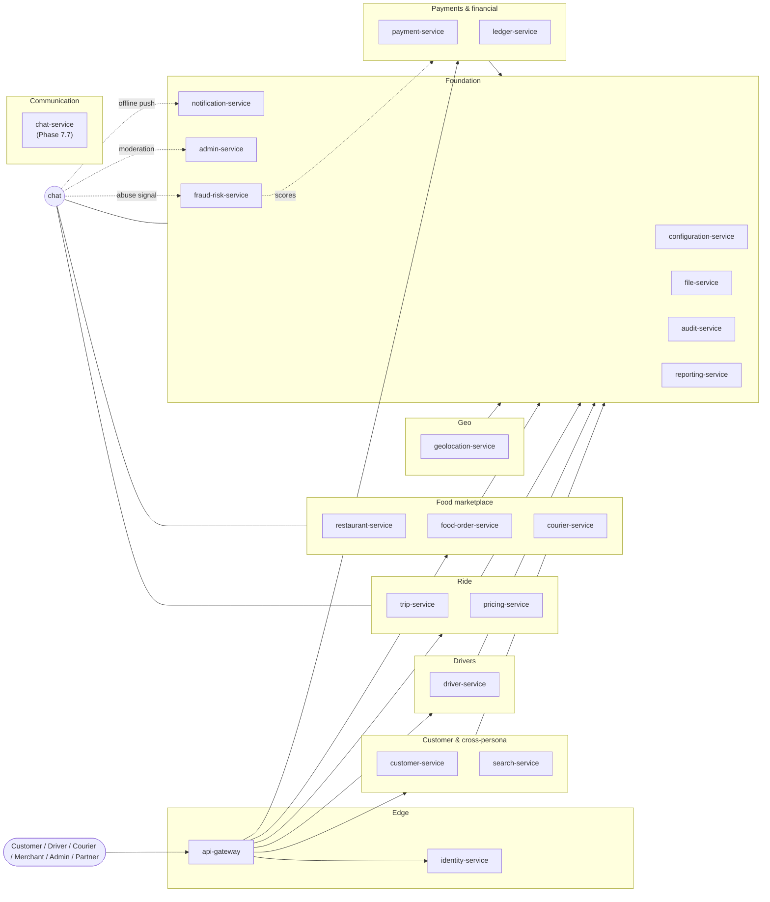

# Service Catalog

> The catalog of all **21 active services** in the platform. Each
> service has a `README.md`, `BRD.md`, `SRS.md`, `ERD.md`,
> `INTEGRATION.md`, `WORKFLOWS.md`, and `TECH.md` under its
> directory. (`chat-service` ships an additional `PLAN.md` for
> its Phase 7.7 cross-cutting rollout.)
>
> **38 services were consolidated** into 15 absorbing survivors on
> 2026-08-05 per
> [ADR-0017](../architecture/adrs/0017-20-service-architecture.md).
> The removed services (`address-service`, `analytics-service`,
> `branch-service`, `cart-service`, `checkout-service`,
> `communication-gateway-service`, `courier-dispatch-service`,
> `courier-earnings-service`, `courier-tracking-service`,
> `delivery-service`, `dispatch-service`,
> `driver-availability-service`, `driver-earnings-service`,
> `driver-incentive-service`, `driver-location-service`,
> `eta-routing-service`, `feature-flag-service`,
> `food-payment-integration-service`, `inventory-service`,
> `loyalty-service`, `menu-service`, `merchant-service`,
> `promotion-service`, `restaurant-order-mgmt-service`,
> `restaurant-settlement-service`, `restaurant-staff-service`,
> `review-rating-service`, `ride-history-service`,
> `ride-payment-integration-service`, `ride-request-service`,
> `ride-safety-service`, `scheduled-ride-service`,
> `support-service`, `tax-service`, `user-profile-service`,
> `vehicle-service`, `wallet-service`, `zone-service`) have been
> absorbed into the 15 absorbing survivors listed in
> [`../MIGRATION_HUB.md`](../MIGRATION_HUB.md). See the hub for the
> per-capability migration record and the six-month compatibility
> window policy.
>
> See [`RECOMMENDATIONS.md`](./RECOMMENDATIONS.md) for the technology map
> (language + framework + key libraries) and the platform-wide baseline in
> [`../shared/PLATFORM_BASELINE.md`](../shared/PLATFORM_BASELINE.md) for
> the shared infrastructure (PostgreSQL 19, Kafka, Keycloak, etc.) that
> every service inherits.
>
> **Super-admin permission to access all services** is managed by
> [`admin-service`](./admin-service/README.md) through the
> `SUPER_ADMIN` permission preset (1 × `platform.super_admin` + 20 ×
> `<service>.admin` scopes). The preset is enumerable at
> `GET /v1/admin/presets`, the 20-service catalog with each service's
> preset membership is at `GET /v1/admin/services`, and grant / revoke
> are `POST/DELETE /v1/admin/identity/(grant|revoke)-super-admin`.
> Both grant and revoke require break-glass co-signature (per
> `SECURITY_ARCHITECTURE.md` 14). See
> [`admin-service/INTEGRATION.md`](./admin-service/INTEGRATION.md) 1.12–1.16.

## How to read this catalog

- **Grouped by bounded context** — the same grouping as
  [`../architecture/DOMAIN_MAP.md`](../architecture/DOMAIN_MAP.md).
- **One-line summary per service** — taken from that service's README 1
  (Purpose). Click through for the full contract.
- **Cross-cutting views** at the bottom: by data owner, by event producer,
  by tech profile.

---

## Platform overview



---

## Edge & stable (4 services)

- **[`api-gateway`](./api-gateway/README.md)** — single stateless north-south edge for every external client; JWT validation, rate limiting, request transformation. Also terminates `WSS://api.<region>.uber.io/v1/chat/ws` for the chat-service.
- **[`identity-service`](./identity-service/README.md)** — thin adapter over Keycloak; mirrors `sub` → stable internal `identity_id`; caches profile claims.
- **[`file-service`](./file-service/README.md)** — file/media storage abstraction; KYC, menu photos, vehicle photos, **chat attachments** (bytes only; metadata lives in `chat-service`).
- **[`audit-service`](./audit-service/README.md)** — immutable audit log of every audit-relevant event with strict-RBAC search API.

## Foundation (5 services)

- **[`configuration-service`](./configuration-service/README.md)** — source of truth for business rules and numerical values; absorbed feature flags. Hosts `chat.*` keys (rate limits, retention, profanity list, allowed origins, allowed MIME).
- **[`notification-service`](./notification-service/README.md)** — user-visible messaging orchestrator (push, SMS, email, in-app, WhatsApp); templates, preferences, delivery state, immutable template-history audit chain, absorbed provider anti-corruption layer. **Also the offline push fallback for chat-service** (consumer of `chat.message.offline_delivery_required.v1`).
- **[`admin-service`](./admin-service/README.md)** — operations console web UI; absorbs **support** as a separately permissioned module (`support.admin` scope); CRUD producer for `pricing.geo_config.updated.v1` via `/v1/admin/pricing/geo-config[...]`. **Also opens the support ticket when chat reports fire** (consumer of `chat.message.reported.v1`).
- **[`reporting-service`](./reporting-service/README.md)** — read model + dashboard service; materialises domain events into queryable views; exports to CSV / Parquet; absorbs data-lake ingestion. Consumes every `chat.*.v1` for analytics + retention sweeps.
- **[`fraud-risk-service`](./fraud-risk-service/README.md)** — real-time risk scoring and fraud detection. **Consumes `chat.message.reported.v1` as an abuse signal feature** (per [`./chat-service/INTEGRATION.md`](./chat-service/INTEGRATION.md) 3.6).

## Communication (1 service)

- **[`chat-service`](./chat-service/README.md)** *(Phase 7.7 — cross-cutting)* — owns in-app, real-time, 1:1 chat threads between the two participants of a service context (rider ↔ driver during a trip; customer ↔ restaurant during food prep; customer ↔ courier during delivery). Thread persistence, message history, attachments, read state, typing indicators, moderation (report / hide / remove / mute / ban), WebSocket fan-out via Redis Pub/Sub, offline push fallback through `notification-service`. The service is the only writer of the `chat` schema.

## Customer & cross-persona (2 services)

- **[`customer-service`](./customer-service/README.md)** — source of truth for the customer profile + cross-persona user data + saved addresses; exposes the **loyalty account**.
- **[`search-service`](./search-service/README.md)** — search index coordination authority across multiple verticals; absorbs the search-review projection.

## Drivers (1 service)

- **[`driver-service`](./driver-service/README.md)** — source of truth for the driver profile + KYC; absorbs online state, high-frequency location stream, match attempts + assignment ledger, quests / bonuses / guarantees / incentive accruals, and **vehicles**.

## Ride (2 services)

- **[`trip-service`](./trip-service/README.md)** — owns the trip aggregate, the ride booking aggregate, scheduled rides, ride safety, ride history, and the **trip-review projection**; evaluates guaranteed rewards at `state=completed`.
- **[`pricing-service`](./pricing-service/README.md)** — pure computational engine for ride and order price quotes; absorbs **tax rules**, **promotion rules**, and the **loyalty pricing rules**; per-location / OD-pair overrides; cross-border tax handling. **Every ride type is priced dynamically** — the catalog keys (`economy` / `vip` / `xl` / `comfort` / `assist`) are stable, but the per-quote `base_fare` / `per_km` / `per_min` / `surge` are composed each time via a `dynamic_multiplier` (see [`../shared/TYPE_CATALOG.md` 3 + 8.7](../shared/TYPE_CATALOG.md#3-ride-types)). Platform commission is `0.20 × gross + 1 {currency}` and **all discounts are 100% platform-borne** (canonical in [`../shared/TYPE_CATALOG.md` 8.7](../shared/TYPE_CATALOG.md#87-platform-margin-doctrine--20--1currency--dynamic-multiplier)).

## Food marketplace (3 services)

- **[`restaurant-service`](./restaurant-service/README.md)** — owns the restaurant aggregate plus absorbed **merchant**, **branch**, **menu**, **inventory**, and **staff** capabilities.
- **[`food-order-service`](./food-order-service/README.md)** — owns the food order aggregate plus absorbed **cart**, **checkout**, **restaurant-side queue**, and the **food-review projection**.
- **[`courier-service`](./courier-service/README.md)** — owns the courier profile plus absorbed dispatch, tracking, and **delivery aggregate**.

## Geospatial (1 service)

- **[`geolocation-service`](./geolocation-service/README.md)** — geocoding + ETA + routing + zones + cities; absorbs **eta-routing** and **zone** capabilities.

## Payments & financial (2 services)

- **[`payment-service`](./payment-service/README.md)** — anti-corruption layer over payment providers; tokens (never raw PAN); intents, attempts, refunds, voids; absorbs **ride-payment-integration**, **food-payment-integration**, **wallet**, **driver-earnings**, **courier-earnings**, **restaurant-settlement** (incl. COD money); the **46-gateway registry** is the single source of truth. Driver payout is calculated on **`gross_fare`** under the locked platform-margin doctrine — never on the customer-facing `net_fare`. See the [Platform margin doctrine](#platform-margin-doctrine--20--1currency--all-discounts-platform-borne) section below.
- **[`ledger-service`](./ledger-service/README.md)** — platform's authoritative double-entry financial ledger (unchanged). Under the locked platform-margin doctrine, discount lines (`6310_promotion_discount`, the proposed `6311_loyalty_discount`) post as **platform-borne expenses**, not as revenue-reducers, and never as a contra to `driver_payable`. See the [Platform margin doctrine](#platform-margin-doctrine--20--1currency--all-discounts-platform-borne) section below.

---

## Platform margin doctrine — "20% + 1{currency}" + all-discounts-platform-borne

> **Locked 2026-08-07, pending ADR ratification.** Canonical reference:
> [`../shared/TYPE_CATALOG.md` 8.7](../shared/TYPE_CATALOG.md#87-platform-margin-doctrine--20--1currency--dynamic-multiplier).
> Cross-linked from [`../workflows/ACCOUNTING_WORKFLOWS.md`](../workflows/ACCOUNTING_WORKFLOWS.md)
> ("Doctrine clarification" block) and from [`./pricing-service/README.md` 13](./pricing-service/README.md).

Two rules land together and apply to **every** ride on the platform,
across all ride types, segments, and promotions.

### Rule 1 — Dynamic per-quote multiplier (replaces "static" catalog values)

The brand labels in
[`TYPE_CATALOG.md` 3.1](../shared/TYPE_CATALOG.md#31-catalog)
(`economy` / `vip` / `xl` / `comfort` / `assist`) are **catalog keys**, not
fixed numeric values. Each quote computes:

```
effective_base_fare = pricing.base_fare  × dynamic_multiplier
effective_per_km    = pricing.per_km     × dynamic_multiplier
effective_per_min   = pricing.per_min    × dynamic_multiplier
effective_surge     = pricing.surge      × dynamic_multiplier
```

`dynamic_multiplier` is composed per quote from the `rule_bindings`
overrides, `rating_density` window, `loyalty.*` rules, `od_corridor`
surcharge, and any validated `promotion_code`. Two back-to-back quotes
with the same `ride_type` may therefore resolve to different effective
base/km/min values — this is by design.

### Rule 2 — Platform margin and discount ownership

For every ride:

| Side | What they see | What they receive |
|---|---|---|
| **Customer** | `net_fare` (gross − Σdiscounts) | pays `gross − Σdiscounts` |
| **Driver** | `gross_fare` (no discount reduction) | receives earnings calculated on `gross_fare` exactly as if no discount had been applied |
| **Platform** | the gap | keeps `0.20 × gross_fare + 1 {currency}` commission, and absorbs every cent of every discount as a **cost** |

**Platform commission** = `0.20 × gross_fare + 1 {currency}`. The flat
`{currency}` surcharge is declared per-currency in
`pricing.commission.flat_minor.{currency}` (e.g. `100` minor = 1.00 SAR
for `currency = SAR`). The percentage applies to **gross**, not net — this
is locked via `pricing.commission.base = gross`.

**All discounts are 100% platform-borne.** Loyalty, promotion,
geo-override, surge-capped, OD-corridor, customer-segment-driven, manual
override — every cent comes from the platform's pocket, not the driver's.
Discount lines become **platform expense** (P&L debit), not
revenue-reducer. Locked via `pricing.discount_bearer = platform`.

**Tax** is forwarded as `tax_rate × net_fare`, unchanged from prior
treatment.

### Worked example (100 SAR gross, 13.04 SAR discount, 15% VAT)

| Party | Amount (SAR) |
|---|---|
| Customer pays (`gross − Σdiscounts`) | 86.96 |
| Driver receives (`gross`) | **100.00** |
| Platform keeps — commission (`0.20 × 100 + 1`) | +21.00 |
| Platform absorbs — discount | −13.04 |
| Platform forwards — tax (`0.15 × 86.96`) | 13.04 (passthrough) |
| **Platform net P&L on this ride** | **+7.96** |

### Configuration keys (immutable until ADR flips)

| Key | Purpose | Locked value |
|---|---|---|
| `pricing.commission.pct` | the `0.20` in the formula | `0.20` |
| `pricing.commission.flat_minor.{currency}` | the `+ 1 {currency}` flat surcharge | per-currency, default `{currency: 100}` minor |
| `pricing.commission.base` | whether the percentage applies to `gross` or `net` | **`gross`** (locked) |
| `pricing.discount_bearer` | who absorbs discounts | **`platform`** (locked) |

Flipping `pricing.commission.base` or `pricing.discount_bearer` is a
**breaking change** to the platform's financial contract and requires an
ADR (canonical via
[`../architecture/adrs/0001-microservices-architecture.md`](../architecture/adrs/0001-microservices-architecture.md)),
re-posting open `ledger.postings` rows, and updates to
[`../architecture/SYSTEM_OVERVIEW.md`](../architecture/SYSTEM_OVERVIEW.md)
and [`../workflows/ACCOUNTING_WORKFLOWS.md`](../workflows/ACCOUNTING_WORKFLOWS.md).
Until then, treat both keys as **immutable**.

### Out of scope of this doctrine

Driver-side incentives (quest rewards, guaranteed top-up via
`6302_guaranteed_minimum`) are unaffected — those remain
`driver_payable` credits.

---

## Cross-cutting views

### By data ownership (source of truth)

The full source-of-truth matrix lives in
[`../architecture/DATA_OWNERSHIP.md`](../architecture/DATA_OWNERSHIP.md).
The single owners in this catalog:

| Entity | Owner service |
|---|---|
| Customer profile + cross-persona + addresses + loyalty account | `customer-service` |
| Driver profile + online state + location stream + match attempts + vehicles + incentives | `driver-service` |
| Trip + ride-request + scheduled-ride + ride-safety + ride-history + trip reviews | `trip-service` |
| Courier profile + dispatch + tracking + delivery | `courier-service` |
| Merchant + restaurant + branch + menu + inventory + staff | `restaurant-service` |
| Food order + cart + checkout + queue + food reviews | `food-order-service` |
| Configuration values + feature flags | `configuration-service` |
| Notification templates + deliveries + provider ACL | `notification-service` |
| **Chat threads, messages, attachments, read state, moderation reports, blocks** *(Phase 7.7)* | **`chat-service`** |
| Payment intents + wallet + sagas + earnings + settlement + COD | `payment-service` |
| Double-entry ledger | `ledger-service` |
| Search index + search reviews | `search-service` |
| Admin permissions + admin action log + support | `admin-service` |
| Reporting read models + analytics | `reporting-service` |
| Fraud scores + blocklists | `fraud-risk-service` |
| Audit log | `audit-service` |
| File / media metadata | `file-service` |
| Keycloak identity | `identity-service` |
| Zone geometry + ETA + routes + geocode | `geolocation-service` |
| Pricing engine + tax + promotions + loyalty rules | `pricing-service` |

### By technology profile (see also `RECOMMENDATIONS.md`)

| Profile | Services |
|---|---|
| **Edge / hot path** (Go) | `api-gateway`, `geolocation-service`, `configuration-service`, `notification-service`, **`chat-service`** *(Phase 7.7)* |
| **Business core** (Kotlin + Spring Boot 4) | Most domain services (`customer-service`, `driver-service`, `trip-service`, `restaurant-service`, `food-order-service`, `courier-service`, `identity-service`, `audit-service`, `admin-service`) |
| **Financial / correctness** (Kotlin + Spring Boot 4 + `BigDecimal` + jOOQ) | `payment-service`, `ledger-service`, `pricing-service` |
| **Math / scoring / ML** (Python + FastAPI) | `fraud-risk-service` |
| **Streaming / event ingest** (Kotlin Spring Kafka or Go `segmentio/kafka-go`) | `reporting-service`, `audit-service` |

For the full per-service table with language, framework, image, replicas,
HPA signal, and p99 target, see [`RECOMMENDATIONS.md` 2](./RECOMMENDATIONS.md).

### By workflow participation

| Workflow doc | Services participating |
|---|---|
| [`../workflows/RIDE_WORKFLOWS.md`](../workflows/RIDE_WORKFLOWS.md) | `trip-service`, `pricing-service`, `customer-service`, `driver-service`, `payment-service`, `notification-service`, **`chat-service`** *(rider ↔ driver)* |
| [`../workflows/FOOD_ORDER_WORKFLOWS.md`](../workflows/FOOD_ORDER_WORKFLOWS.md) | `food-order-service`, `restaurant-service`, `courier-service`, `customer-service`, `pricing-service`, `payment-service`, `notification-service`, **`chat-service`** *(customer ↔ restaurant, customer ↔ courier)* |
| [`../workflows/PAYMENT_WORKFLOWS.md`](../workflows/PAYMENT_WORKFLOWS.md) | `payment-service`, `ledger-service`, `pricing-service`, `fraud-risk-service` |
| [`../workflows/DRIVER_WORKFLOWS.md`](../workflows/DRIVER_WORKFLOWS.md) | `driver-service`, `payment-service`, `notification-service` |
| [`../workflows/COURIER_WORKFLOWS.md`](../workflows/COURIER_WORKFLOWS.md) | `courier-service`, `payment-service`, `notification-service`, **`chat-service`** *(customer ↔ courier)* |
| [`../workflows/MERCHANT_WORKFLOWS.md`](../workflows/MERCHANT_WORKFLOWS.md) | `restaurant-service`, `payment-service`, `notification-service` |
| [`../workflows/REFUND_WORKFLOWS.md`](../workflows/REFUND_WORKFLOWS.md) | `payment-service`, `ledger-service`, `customer-service`, `admin-service` |
| [`../workflows/SAFETY_WORKFLOWS.md`](../workflows/SAFETY_WORKFLOWS.md) | `trip-service`, `fraud-risk-service`, `customer-service`, `notification-service`, `admin-service`, **`chat-service`** *(SOS + report escalation)* |
| [`../workflows/ACCOUNTING_WORKFLOWS.md`](../workflows/ACCOUNTING_WORKFLOWS.md) | `payment-service`, `ledger-service`, `pricing-service`, `reporting-service`, `admin-service` |

---

## See also

- [`../README.md`](../README.md) — top-level platform documentation reading order
- [`../main.md`](../../main.md) — top-level platform specification
- [`./RECOMMENDATIONS.md`](./RECOMMENDATIONS.md) — language/framework recommendation per service
- [`../shared/PLATFORM_BASELINE.md`](../shared/PLATFORM_BASELINE.md) — single source for PostgreSQL 19, Kafka, Keycloak, etc.
- [`../shared/TYPE_CATALOG.md`](../shared/TYPE_CATALOG.md) — **platform-wide type vocabulary** — ride types (Enjoy Economy / VIP / XL / Comfort / Assist), courier vehicle types, food delivery types, customer and merchant segments; brand label → catalog key → CHECK → `pricing-service.rule_bindings` mapping. Also documents the locked platform-margin doctrine (8.7 — dynamic per-quote multiplier + 20% + 1{currency} + all discounts 100% platform-borne).
- [`../shared/OSS_DEPENDENCIES.md`](../shared/OSS_DEPENDENCIES.md) — **open-source dependencies & license attribution** (platform-wide OSS projects + per-language OSS libraries with SPDX IDs; per-service bundle index; license compatibility matrix)
- [`../architecture/SYSTEM_OVERVIEW.md`](../architecture/SYSTEM_OVERVIEW.md) — plain-English summary of the platform
- [`../architecture/MICROSERVICES_MAP.md`](../architecture/MICROSERVICES_MAP.md) — service catalog with ownership, data, dependencies (table form)
- [`../MIGRATION_HUB.md`](../MIGRATION_HUB.md) — the 38-to-20 migration hub (removed → survivor mapping, six-month compatibility window)
- [`../architecture/DOMAIN_MAP.md`](../architecture/DOMAIN_MAP.md) — bounded contexts and how they map to services
- [`../architecture/CONTEXT_MAP.md`](../architecture/CONTEXT_MAP.md) — context relationships (customer/supplier, conformist, etc.)
- [`../architecture/DATA_OWNERSHIP.md`](../architecture/DATA_OWNERSHIP.md) — full source-of-truth matrix
- [`../architecture/EVENT_ARCHITECTURE.md`](../architecture/EVENT_ARCHITECTURE.md) — event catalog and delivery semantics
- [`../architecture/SERVICE_DOC_TEMPLATE.md`](../architecture/SERVICE_DOC_TEMPLATE.md) — the contract every service in this catalog follows
- [`../architecture/SERVICE_ISOLATION.md`](../architecture/SERVICE_ISOLATION.md) — **how every service behaves when a downstream is down** (timeout / bulkhead / circuit / retry / fallback, by class: CRITICAL / DEGRADABLE / BEST-EFFORT)
- [`../architecture/DOWNSTREAM_ERROR_CATALOG.md`](../architecture/DOWNSTREAM_ERROR_CATALOG.md) — **canonical error-code catalog + propagation rules** (the `downstream` block, forward/translate/degrade/reject)