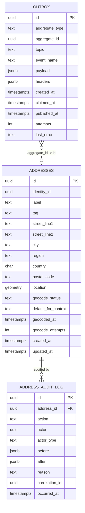

# address-service — Entity-Relationship Diagram

## 1. Database

- **Engine**: PostgreSQL 18 with **PostGIS**
  extension.
- **Schema**: `address`.
- **Migrations**: `services/address-service/migrations/`
  (versioned, forward-only, golang-migrate). The
  first migration enables the PostGIS extension:
  `CREATE EXTENSION IF NOT EXISTS postgis;`.

## 2. Cross-Service References

| Column | Type | Refers to | Source of truth |
|--------|------|-----------|------------------|
| `identity_id` (in `addresses`) | UUID | `Identity` in `identity-service` | `identity-service` |

Stored as a UUID column WITHOUT database FKs.

## 3. Entities

### `addresses`

The platform's saved address. One row per address.

#### Columns

| Column | Type | Constraints | Notes |
|--------|------|-------------|-------|
| `id` | UUID | PK | UUIDv7 |
| `identity_id` | UUID | NOT NULL | cross-service ref |
| `label` | TEXT | NULL | user-friendly label (e.g. "Mom's house") |
| `tag` | TEXT | NOT NULL DEFAULT 'other' | `home` / `work` / `gym` / `other` |
| `street_line1` | TEXT | NOT NULL (PII, column-level encrypted) | |
| `street_line2` | TEXT | NULL (PII, column-level encrypted) | apt, suite, etc. |
| `city` | TEXT | NOT NULL (PII, column-level encrypted) | |
| `region` | TEXT | NULL | state / province |
| `country` | CHAR(2) | NOT NULL | ISO 3166-1 alpha-2 |
| `postal_code` | TEXT | NULL (PII, column-level encrypted) | |
| `location` | `geometry(Point, 4326)` | NULL | PostGIS point |
| `geocode_status` | TEXT | NOT NULL DEFAULT 'pending' | `pending` / `success` / `failed` |
| `geocode_provider` | TEXT | NULL | `geolocation-service` |
| `geocoded_at` | TIMESTAMPTZ | NULL | when last geocoded |
| `geocode_attempts` | INT | NOT NULL DEFAULT 0 | retry counter |
| `default_for_context` | TEXT | NULL | `ride_pickup` / `food_delivery` / NULL |
| `row_version` | BIGINT | NOT NULL DEFAULT 1 | optimistic-lock |
| `created_at` | TIMESTAMPTZ | NOT NULL DEFAULT now() | audit |
| `updated_at` | TIMESTAMPTZ | NOT NULL DEFAULT now() | audit |
| `created_by` | UUID | NOT NULL | identity |
| `updated_by` | UUID | NOT NULL | identity |
| `deleted_at` | TIMESTAMPTZ | NULL | soft delete |

#### Indexes

- PK on `id`.
- Index on `identity_id` (partial, `WHERE deleted_at IS NULL`).
- UNIQUE on `(identity_id, default_for_context)`
  (partial, `WHERE deleted_at IS NULL AND default_for_context IS NOT NULL`).
- GIST index on `location` for spatial queries
  (e.g. "is this address in a service zone?").
- Index on `geocode_status` (partial, `WHERE geocode_status = 'pending'`).

#### Constraints

- CHECK: `tag IN ('home', 'work', 'gym', 'other')`.
- CHECK: `geocode_status IN ('pending', 'success', 'failed')`.
- CHECK: `country ~ '^[A-Z]{2}$'`.
- CHECK: `default_for_context IS NULL OR default_for_context IN ('ride_pickup', 'food_delivery', ...)` (validated against `address.default_contexts` at the application layer).

### `address_audit_log`

Append-only audit of every state change. Immutable.

#### Columns

| Column | Type | Constraints | Notes |
|--------|------|-------------|-------|
| `id` | UUID | PK | UUIDv7 |
| `address_id` | UUID | NOT NULL | FK to `addresses.id` |
| `action` | TEXT | NOT NULL | `create` / `update` / `delete` / `erase` / `geocode` / `set_default` / `unset_default` |
| `actor` | UUID | NULL | actor's identity_id |
| `actor_type` | TEXT | NOT NULL | `user` / `admin` / `service` / `system` |
| `before` | JSONB | NULL | snapshot before |
| `after` | JSONB | NULL | snapshot after |
| `reason` | TEXT | NULL | reason code |
| `correlation_id` | UUID | NULL | request correlation id |
| `occurred_at` | TIMESTAMPTZ | NOT NULL DEFAULT now() | when the action happened |

#### Constraints

- No `UPDATE` or `DELETE`.
- Retention 7 years.

### `outbox`

Outbox table for the outbox pattern. Same shape as
`identity-service.outbox`.

## 4. Mermaid ER Diagram



## 5. DDL Sketch

```sql
CREATE EXTENSION IF NOT EXISTS postgis;

CREATE SCHEMA IF NOT EXISTS address;

CREATE TABLE address.addresses (
    id UUID PRIMARY KEY,
    identity_id UUID NOT NULL,
    label TEXT,
    tag TEXT NOT NULL DEFAULT 'other',
    street_line1 TEXT NOT NULL,
    street_line2 TEXT,
    city TEXT NOT NULL,
    region TEXT,
    country CHAR(2) NOT NULL,
    postal_code TEXT,
    location geometry(Point, 4326),
    geocode_status TEXT NOT NULL DEFAULT 'pending',
    geocode_provider TEXT,
    geocoded_at TIMESTAMPTZ,
    geocode_attempts INT NOT NULL DEFAULT 0,
    default_for_context TEXT,
    row_version BIGINT NOT NULL DEFAULT 1,
    created_at TIMESTAMPTZ NOT NULL DEFAULT now(),
    updated_at TIMESTAMPTZ NOT NULL DEFAULT now(),
    created_by UUID NOT NULL,
    updated_by UUID NOT NULL,
    deleted_at TIMESTAMPTZ,
    CONSTRAINT addresses_tag_check
        CHECK (tag IN ('home','work','gym','other')),
    CONSTRAINT addresses_geocode_status_check
        CHECK (geocode_status IN ('pending','success','failed')),
    CONSTRAINT addresses_country_check
        CHECK (country ~ '^[A-Z]{2}$')
);

CREATE INDEX addresses_identity_id_idx
    ON address.addresses (identity_id)
    WHERE deleted_at IS NULL;

CREATE UNIQUE INDEX addresses_default_uniq
    ON address.addresses (identity_id, default_for_context)
    WHERE deleted_at IS NULL AND default_for_context IS NOT NULL;

CREATE INDEX addresses_location_gist
    ON address.addresses
    USING GIST (location);

CREATE INDEX addresses_geocode_status_idx
    ON address.addresses (geocode_status)
    WHERE geocode_status = 'pending';

CREATE TABLE address.address_audit_log (
    id UUID PRIMARY KEY,
    address_id UUID NOT NULL REFERENCES address.addresses(id),
    action TEXT NOT NULL,
    actor UUID,
    actor_type TEXT NOT NULL,
    before JSONB,
    after JSONB,
    reason TEXT,
    correlation_id UUID,
    occurred_at TIMESTAMPTZ NOT NULL DEFAULT now()
);

CREATE TRIGGER address_audit_log_no_update
    BEFORE UPDATE OR DELETE ON address.address_audit_log
    FOR EACH STATEMENT EXECUTE FUNCTION raise_exception();

CREATE TABLE address.outbox (
    id UUID PRIMARY KEY,
    aggregate_type TEXT NOT NULL,
    aggregate_id UUID NOT NULL,
    topic TEXT NOT NULL,
    event_name TEXT NOT NULL,
    payload JSONB NOT NULL,
    headers JSONB NOT NULL DEFAULT '{}'::jsonb,
    created_at TIMESTAMPTZ NOT NULL DEFAULT now(),
    claimed_at TIMESTAMPTZ,
    published_at TIMESTAMPTZ,
    attempts INT NOT NULL DEFAULT 0,
    last_error TEXT
);

CREATE INDEX outbox_unpublished_idx
    ON address.outbox (created_at)
    WHERE published_at IS NULL;

CREATE INDEX outbox_aggregate_id_idx
    ON address.outbox (aggregate_id);
```

## 6. Audit Columns

Every mutable table has `created_at`, `updated_at`,
`created_by`, `updated_by`. The `addresses` table
also has `row_version` for optimistic locking.

## 7. Soft Delete

- The `addresses` table uses soft delete
  (`deleted_at`).
- Manual delete (`DELETE /v1/addresses/{id}`) sets
  `deleted_at`.
- GDPR erasure sets `deleted_at`, anonymizes PII,
  and emits `address.deleted.v1` with
  `reason='gdpr'`.

## 8. JSONB Usage

- `address_audit_log.before` / `after` — snapshots.
- `outbox.payload` / `outbox.headers` — event
  envelope.

## 9. Partitioning

No table is partitioned; their volume does not
warrant it.

## 10. Data Retention

| Table | Retention | Purged by |
|-------|-----------|-----------|
| `addresses` | until erasure + 7 years (tombstone) | background job |
| `address_audit_log` | 7 years (audit) | background job |
| `outbox` | 24 h after `published_at` | background job |

## 11. Migration Considerations

- Adding a new country: add it to
  `address.supported_countries` in configuration;
  the validation reads from config.
- Renaming a tag: deprecated alias stored alongside;
  old code path reads the alias; new code reads the
  new value. Drop after a deprecation window.
- The PostGIS extension is required; the first
  migration enables it. Subsequent migrations MUST
  NOT drop the extension.
- The GIST index on `location` is created with
  the table; if a future migration adds a
  spatial query that needs additional index
  tuning, add the index then.
- Cross-service references (`identity_id`) are
  added as nullable columns; the back-channel
  consumer populates them.

---

## See also

### Sibling docs for this service

- [`README.md`](./README.md) — purpose, bounded context, responsibilities
- [`BRD.md`](./BRD.md) — business requirements
- [`SRS.md`](./SRS.md) — functional + non-functional requirements
- [`ERD.md`](./ERD.md) — data model (entities, relationships)
- [`INTEGRATION.md`](./INTEGRATION.md) — inter-service contracts (APIs, events, sagas)
- [`WORKFLOWS.md`](./WORKFLOWS.md) — operational workflows (happy paths, failure modes)
- [`TECH.md`](./TECH.md) — technology profile (runtime, libraries, data layer, admin endpoints, RBAC)

### Platform-wide

- [`../../shared/README.md`](../../shared/README.md) — `platform-spring-boot-starter` shared library (the single source of cross-cutting code for all Spring Boot services in the platform)
- [`../RECOMMENDATIONS.md`](../RECOMMENDATIONS.md) — platform-wide technology map (language, framework, version baseline, admin/RBAC pattern)
- [`../../README.md`](../../README.md) — services overview (the catalog of all 58 services)
- [`../../../main.md`](../../../main.md) — top-level platform specification (architecture, Keycloak, PostgreSQL 18, messaging, observability baseline)

