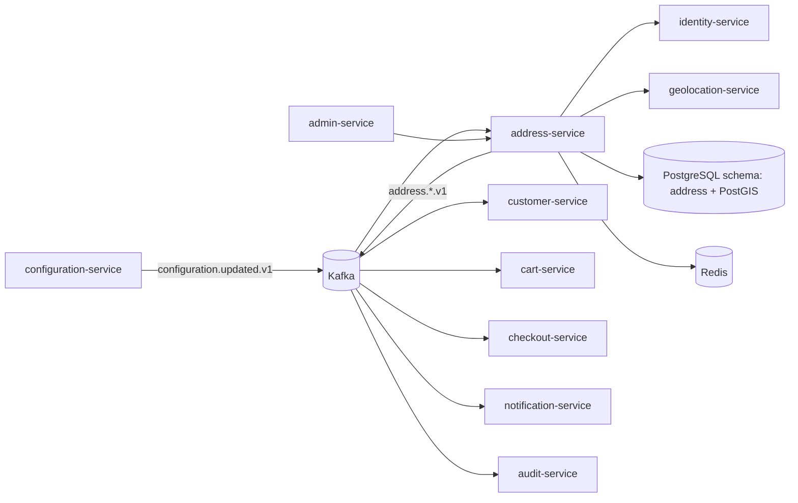
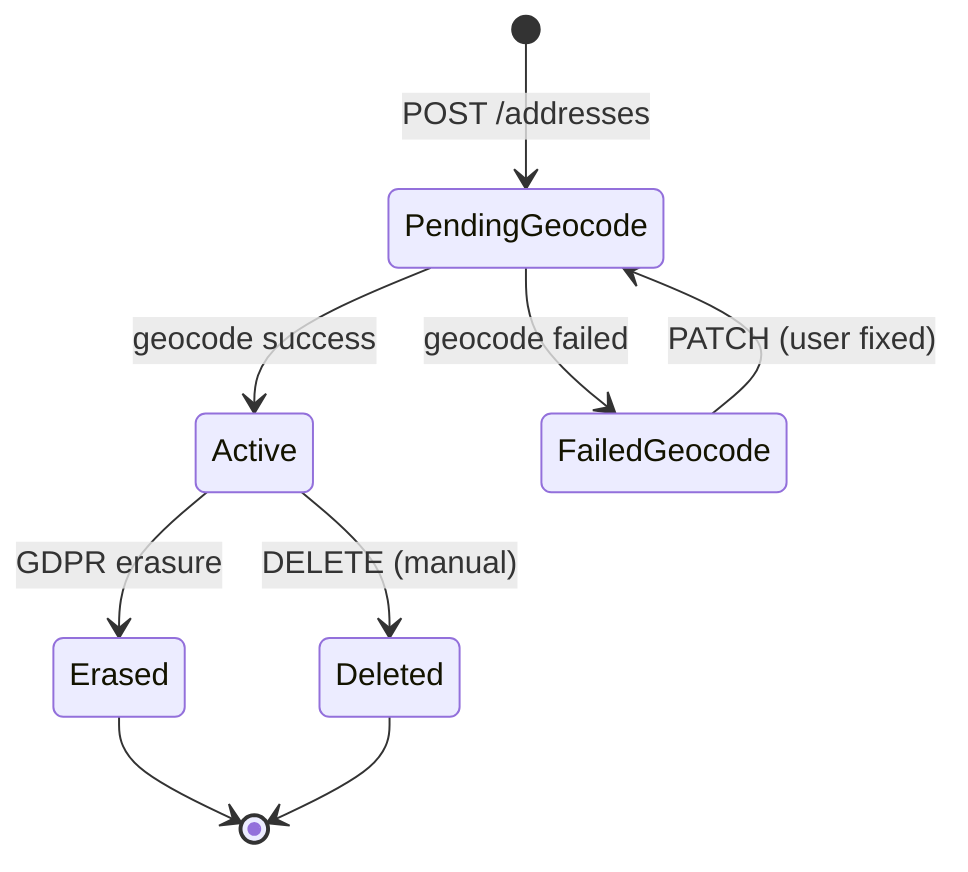

# address-service — Software Requirements Specification

## 1. Introduction

This document specifies the software behavior, contracts,
and non-functional requirements of the `address-service`.
The service is the platform's source of truth for saved
addresses — geocoded, normalized, tagged, with
per-context defaults.

## 2. Scope

**In scope:**

- Address save / update / delete.
- Geocoding via `geolocation-service`.
- Tag and per-context default.
- GDPR right-to-erasure.
- Event emission (`address.*.v1`).

**Out of scope:**

- Persona profiles.
- Trip / delivery records.
- Geocoding engine internals (owned by
  `geolocation-service`).

## 3. System Context

## 4. Actors

- **User (any persona)** (human) — manage their
  addresses.
- **Internal admin** (human) — GDPR erasure.
- **Downstream services** (system) — read default
  addresses.

## 5. Functional Requirements

| ID | Requirement | Priority |
|----|-------------|----------|
| FR--001 | Provide `GET /v1/addresses/{address_id}` returning the address. | MUST |
| FR--002 | Provide `POST /v1/addresses` to create (geocodes). | MUST |
| FR--003 | Provide `PATCH /v1/addresses/{address_id}` to update (re-geocodes). | MUST |
| FR--004 | Provide `DELETE /v1/addresses/{address_id}` to soft-delete. | MUST |
| FR--005 | Provide `GET /v1/addresses?identity_id={id}` to list. | MUST |
| FR--006 | Provide `PUT /v1/addresses/{address_id}/default` to set default for a context. | MUST |
| FR--007 | Provide `DELETE /v1/addresses/{address_id}/default` to unset. | MUST |
| FR--008 | Provide `GET /v1/addresses/{address_id}/geocode` to trigger re-geocode. | MUST |
| FR--009 | Provide `POST /v1/addresses/{address_id}/erase` (admin, GDPR). | MUST |
| FR--010 | Consume `configuration.updated.v1`. | MUST |
| FR--011 | Emit `address.created.v1`. | MUST |
| FR--012 | Emit `address.updated.v1`. | MUST |
| FR--013 | Emit `address.deleted.v1`. | MUST |
| FR--014 | Emit `address.geocoded.v1` on successful geocode. | MUST |
| FR--015 | All writes use the outbox pattern. | MUST |
| FR--016 | All non-idempotent POSTs require `Idempotency-Key`. | MUST |
| FR--017 | Backfill job retries failed geocodes. | MUST |

## 6. Non-Functional Requirements

| ID | Category | Requirement | Target |
|----|----------|-------------|--------|
| NFR--001 | availability | monthly uptime | 99.9% |
| NFR--002 | performance | P99 read latency | ≤ 30 ms |
| NFR--003 | performance | P99 geocode latency | ≤ 2 s |
| NFR--004 | scalability | concurrent reads per replica | ≥ 2,000 |
| NFR--005 | scalability | horizontal scale | 2 → 20 replicas per region |
| NFR--006 | maintainability | MTTR | ≤ 15 min median |
| NFR--007 | reliability | outbox publish lag P99 | ≤ 5 s |
| NFR--008 | reliability | event loss | 0 |
| NFR--009 | compliance | GDPR erasure SLA | 100% within 24 h expedited |

## 7. API Requirements

All endpoints follow `architecture/API_STANDARDS.md`.
Full contract in `INTEGRATION.md`.

## 8. Data Requirements

| ID | Requirement | Notes |
|----|-------------|-------|
| DATA--001 | The service MUST own the `address` schema. | One writer. |
| DATA--002 | Primary keys MUST be UUIDv7. | Time-ordered. |
| DATA--003 | The `identity_id` cross-service reference MUST be a UUID column WITHOUT database FK. | Consistency strategy. |
| DATA--004 | PII columns (`street_line1`, `street_line2`, `city`, `postal_code`) MUST be column-level encrypted. | Envelope encryption. |
| DATA--005 | The `location` column MUST be PostGIS `geometry(Point, 4326)`. | Geospatial. |
| DATA--006 | Audit columns MUST be present on every mutable table. | Standard. |
| DATA--007 | Soft delete (`deleted_at`) MUST be used. | GDPR. |
| DATA--008 | The `outbox` table MUST be present and used. | At-least-once. |

(Full schema in `ERD.md`.)

## 9. Validation Rules

- A `street_line1` is required.
- A `country` MUST be in
  `address.supported_countries`.
- A `geocode_status` MUST be in `('pending',
  'success', 'failed')`.
- The number of addresses per user MUST NOT
  exceed `address.max_per_user`.
- A `default_for_context` MUST be in
  `address.default_contexts`.

## 10. State Transitions

## 11. Authorization Requirements

- All endpoints require a JWT bearer token.
- Self-service endpoints require `X-User-Id ==
  identity_id` of the address; otherwise 403.
- Cross-user reads (e.g. customer-service rendering
  a default address) require `address.read.any`
  scope.
- Admin endpoints require `address.admin` realm
  role on `platform-internal`.

## 12. Configuration Requirements

Listed in `README.md` §13.

## 13. Error Handling

| Condition | Response |
|-----------|----------|
| Unknown `address_id` | 404 `NOT_FOUND` |
| Address limit reached | 409 `ADDRESS_LIMIT_REACHED` |
| Country not supported | 400 `VALIDATION_FAILED` |
| `geolocation-service` unreachable | 202 (accepted, geocode deferred) |
| `Idempotency-Key` reused with different body | 422 `IDEMPOTENCY_KEY_REUSED` |
| Geocode failed (final) | 422 `GEOCODE_FAILED` with `warnings[]` |

## 14. Concurrency Requirements

- The `addresses` row has an optimistic-lock version
  (`row_version`).
- The outbox poller is single-writer per replica via
  a Postgres advisory lock.
- The backfill job is single-writer per replica.

## 15. Idempotency Requirements

- All non-idempotent POSTs require `Idempotency-Key`.

## 16. Performance

- **Dominant path**: address read by `address_id`
  (PK index hit) → return row. P99 ≤ 30 ms.
- Hot DB query: `SELECT * FROM address.addresses
  WHERE id = $1`.
- Cache: Redis address hot-cache TTL 600 s.

## 17. Scalability

- **Horizontal**: stateless beyond PostgreSQL +
  Redis + Kafka.
- **Vertical**: 500m vCPU / 512 MiB default.
- **HPA**: CPU 60% target; custom metric
  `address_lookups_per_second` (target 2k/replica).

## 18. Availability

- **SLO**: 99.9% per 30d.
- **Error budget**: ~44 min / 30d.

## 19. Security

| ID | Requirement | Notes |
|----|-------------|-------|
| SEC--001 | All endpoints require a JWT bearer token. | Self or service. |
| SEC--002 | Self-service endpoints enforce `X-User-Id == identity_id`. | Gateway-injected header. |
| SEC--003 | PII columns are column-level encrypted. | Envelope encryption. |
| SEC--004 | No PII is logged in production. | Defense in depth. |
| SEC--005 | GDPR erasure preserves `address_id`. | Soft delete + tombstone. |
| SEC--006 | mTLS in cluster. | Network-layer identity. |

## 20. Privacy

- Stored PII: `street_line1`, `street_line2`,
  `city`, `postal_code` (column-level encrypted).
- Retention: until erasure + 7 years for the
  `address_id` tombstone; trip / delivery records
  retain the `address_id` reference but their PII
  fields are redacted by the owning service.
- Erasure: `POST /v1/addresses/{id}/erase`
  anonymizes PII; `address_id` preserved.
- Logs do not contain PII in production.

## 21. Auditability

- Every state change writes a row to
  `address.address_audit_log` (append-only) AND
  emits the corresponding `address.*.v1` event.
- Retention 7 years.

## 22. Observability

- **Logs**: JSON to stdout; fields listed in
  `README.md` §15.
- **Metrics**: RED per endpoint + business metrics
  listed in `README.md` §15.
- **Traces**: OpenTelemetry. Sample 100% on errors,
  10% on success.
- **Alerts**: SLO burn-rate; geocode failure rate;
  backfill lag.

## 23. Maintainability

- **Code style**: TypeScript (ESLint + Prettier).
- **Test coverage**: ≥ 85% overall, 100% on
  geocode retry, default setting, erasure paths.

## 24. Disaster Recovery

- **RPO**: ≤ 5 min (WAL streaming + 7-day PITR).
- **RTO**: ≤ 30 min (warm standby).

## 25. Acceptance Criteria

- A `POST /v1/addresses` creates a row and emits
  `address.created.v1` within 1 second.
- A successful geocode updates the `location`
  column and sets `geocode_status='success'`.
- A failed geocode sets `geocode_status='failed'`
  and the user is prompted to fix.
- A `PUT /v1/addresses/{id}/default` sets the
  default for the context and emits
  `address.updated.v1`.
- A `DELETE /v1/addresses/{id}` soft-deletes the
  row and emits `address.deleted.v1`.
- A `POST /v1/addresses/{id}/erase` (admin) anonymizes
  the row and emits `address.deleted.v1` with
  `reason='gdpr'`.
- The address count per user is enforced.
- The backfill job retries failed geocodes.

---

## See also

### Sibling docs for this service

- [`README.md`](./README.md) — purpose, bounded context, responsibilities
- [`BRD.md`](./BRD.md) — business requirements
- [`SRS.md`](./SRS.md) — functional + non-functional requirements
- [`ERD.md`](./ERD.md) — data model (entities, relationships)
- [`INTEGRATION.md`](./INTEGRATION.md) — inter-service contracts (APIs, events, sagas)
- [`WORKFLOWS.md`](./WORKFLOWS.md) — operational workflows (happy paths, failure modes)
- [`TECH.md`](./TECH.md) — technology profile (runtime, libraries, data layer, admin endpoints, RBAC)

### Platform-wide

- [`../../shared/README.md`](../../shared/README.md) — `platform-spring-boot-starter` shared library (the single source of cross-cutting code for all Spring Boot services in the platform)
- [`../RECOMMENDATIONS.md`](../RECOMMENDATIONS.md) — platform-wide technology map (language, framework, version baseline, admin/RBAC pattern)
- [`../../README.md`](../../README.md) — services overview (the catalog of all 58 services)
- [`../../../main.md`](../../../main.md) — top-level platform specification (architecture, Keycloak, PostgreSQL 18, messaging, observability baseline)

