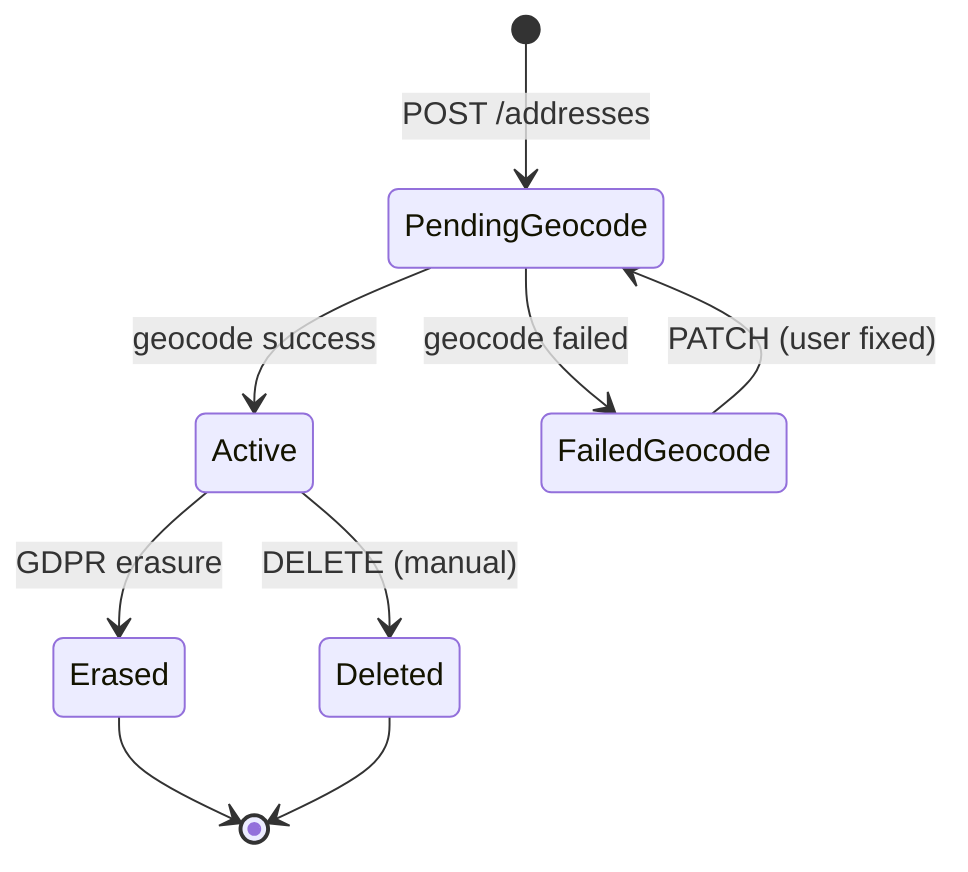
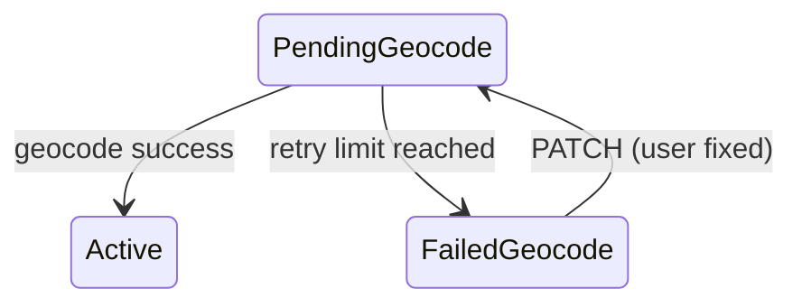

# address-service — Workflows

## 1. Address Save

### 1.1 Objective

A user saves a new address. The service creates a row,
emits `address.created.v1`, and triggers geocoding via
`geolocation-service`.

### 1.2 Initiating Actor

A user calls `POST /v1/addresses` with a free-form
address (street, city, country, etc.).

### 1.3 Participating Services

- `address-service` (this service).
- `geolocation-service` (geocoding).
- `customer-service`, `cart-service`,
  `checkout-service` (consumers of
  `address.created.v1` for cache invalidation).
- `notification-service`.
- `audit-service`.

### 1.4 Prerequisites

- The user is authenticated.
- The country is in `address.supported_countries`.
- The user is below `address.max_per_user`.

### 1.5 Happy Path

```mermaid
sequenceDiagram
    participant U as User
    participant ASV as address-service
    participant GEO as geolocation-service
    participant DB as PostgreSQL (address)
    participant OB as Outbox
    participant T as Kafka (address.created)
    participant CS as customer-service
    participant AUD as audit-service

    U->>ASV: POST /v1/addresses { street_line1, city, country, ... }
    ASV->>DB: BEGIN; INSERT INTO address.addresses (..., geocode_status='pending'); INSERT INTO address_audit_log; INSERT INTO outbox; COMMIT
    ASV-->>U: 201 Created { geocode_status: "pending" }
    OB->>T: produce address.created.v1
    T->>CS: consume -> invalidate cache
    T->>AUD: consume
    ASV->>GEO: POST /v1/geocode { ... }
    GEO-->>ASV: { lat, lng, normalized_address }
    ASV->>DB: BEGIN; UPDATE addresses SET location=..., geocode_status='success', geocoded_at=now(); INSERT INTO outbox; COMMIT
    OB->>T: produce address.geocoded.v1
    T->>CS: consume -> update cache
```

### 1.6 Alternate Paths

- **`geolocation-service` unreachable**: the service
  accepts the address but marks it
  `geocode_status='pending'`; the backfill job
  retries every 10 minutes. The user can also
  trigger a manual re-geocode via
  `GET /v1/addresses/{id}/geocode`.
- **Geocoding returns no result**: the row is
  marked `geocode_status='failed'`; the user is
  prompted to fix the address.
- **Address limit reached**: 409
  `ADDRESS_LIMIT_REACHED`.
- **Country not supported**: 400
  `VALIDATION_FAILED`.

### 1.7 Failure Paths

- **DB write fails**: the action is not performed;
  the user retries.
- **Outbox publish fails**: the poller retries.

### 1.8 Business Rules

- A `street_line1` is required.
- A `country` MUST be in
  `address.supported_countries`.
- The number of addresses per user MUST NOT
  exceed `address.max_per_user`.
- A successful geocode updates the `location`
  column and sets `geocode_status='success'`.

### 1.9 State Transitions



### 1.10 Events

| Event | Direction | When |
|-------|-----------|------|
| `address.created.v1` | produced | on creation |
| `address.geocoded.v1` | produced | on successful geocode |

### 1.11 APIs Involved

| API | Direction | When |
|-----|-----------|------|
| `POST /v1/addresses` | inbound | on creation |
| `POST /v1/geocode` (geolocation-service) | outbound | on geocode |
| Kafka publish | outbound (outbox) | on creation + geocode |

### 1.12 Compensation / Rollback

A failed geocode leaves the row in
`geocode_status='failed'`; the user can PATCH to
trigger a retry. A manual DELETE soft-deletes the
row.

### 1.13 Final State

- The `addresses` row is `Active` (geocoded
  successfully) or `FailedGeocode` (geocoding
  failed).
- The events are on the topic.

## 2. Default Address per Context

### 2.1 Objective

A user sets an address as the default for a context
(e.g. `ride_pickup` or `food_delivery`); the
dependent services see the new default within 10
seconds (P99).

### 2.2 Initiating Actor

A user calls
`PUT /v1/addresses/{address_id}/default` with a
`context`.

### 2.3 Participating Services

- `address-service` (this service).
- `customer-service` (consumer of
  `address.updated.v1`; uses the default for
  ride / order UX).
- `cart-service`, `checkout-service` (consumers
  for `food_delivery`).

### 2.4 Prerequisites

- The `addresses` row exists.
- The user is the owner of the address.
- The `context` is in `address.default_contexts`.

### 2.5 Happy Path

```mermaid
sequenceDiagram
    participant U as User
    participant ASV as address-service
    participant DB as PostgreSQL (address)
    participant OB as Outbox
    participant T as Kafka (address.updated)
    participant CS as customer-service

    U->>ASV: PUT /v1/addresses/{id}/default { context: "ride_pickup" }
    ASV->>DB: BEGIN; UPDATE previous default (if any) SET default_for_context=NULL; UPDATE this address SET default_for_context='ride_pickup', row_version=row_version+1; INSERT INTO address_audit_log; INSERT INTO outbox; COMMIT
    ASV-->>U: 200 OK
    OB->>T: produce address.updated.v1 (changed_fields: [default_for_context])
    T->>CS: consume -> update default for ride_pickup
```

### 2.6 Alternate Paths

- **Unset default**: the user calls
  `DELETE /v1/addresses/{id}/default`; the row
  is updated with `default_for_context=NULL`.
- **Replace default**: the user sets a new
  address as the default; the previous default is
  unset in the same transaction.

### 2.7 Failure Paths

- **Context invalid**: 400 `VALIDATION_FAILED`.
- **Already has a default for this context**: 409
  `CONFLICT` (the same context can't have two
  defaults; the unique index enforces this).

### 2.8 Business Rules

- An address has at most one `default_for_context`
  per user per context.
- The change MUST propagate to dependent services
  within 10 seconds (P99).

### 2.9 State Transitions

None (the `default_for_context` is a single value).

### 2.10 Events

| Event | Direction | When |
|-------|-----------|------|
| `address.updated.v1` | produced | on default change |

### 2.11 APIs Involved

| API | Direction | When |
|-----|-----------|------|
| `PUT /v1/addresses/{id}/default` | inbound | per change |
| Kafka publish | outbound (outbox) | per change |

### 2.12 Compensation / Rollback

Unsetting the default reverts the change.

### 2.13 Final State

- The `addresses.default_for_context` is updated.
- `address.updated.v1` is on the topic.
- The dependent services have the new default.

## 3. Geocoding Retry

### 3.1 Objective

A row in `geocode_status='pending'` is re-geocoded
by the backfill job, or by a user-triggered
`GET /v1/addresses/{id}/geocode`.

### 3.2 Initiating Actor

A backfill job (cron) or a user-initiated
`GET /v1/addresses/{id}/geocode`.

### 3.3 Participating Services

- `address-service` (this service; backfill job).
- `geolocation-service`.

### 3.4 Prerequisites

- The row has `geocode_status='pending'`.
- `geocode_attempts <
  address.geocode.retry_attempts`.

### 3.5 Happy Path

```mermaid
sequenceDiagram
    participant JOB as Backfill job
    participant DB as PostgreSQL (address)
    participant GEO as geolocation-service
    participant OB as Outbox
    participant T as Kafka (address.geocoded)

    JOB->>DB: SELECT * FROM address.addresses WHERE geocode_status='pending' AND geocode_attempts < retry_attempts AND deleted_at IS NULL LIMIT 100
    loop for each address
        JOB->>GEO: POST /v1/geocode { ... }
        alt success
            GEO-->>JOB: { lat, lng, ... }
            JOB->>DB: BEGIN; UPDATE addresses SET location=..., geocode_status='success', geocoded_at=now(), geocode_attempts=geocode_attempts+1; INSERT INTO outbox; COMMIT
            OB->>T: produce address.geocoded.v1
        else failure
            GEO-->>JOB: { error }
            JOB->>DB: UPDATE addresses SET geocode_attempts=geocode_attempts+1
            alt geocode_attempts >= retry_attempts
                JOB->>DB: UPDATE addresses SET geocode_status='failed'
            end
        end
    end
```

### 3.6 Alternate Paths

- **User-triggered retry**: same flow, with
  `actor=identity_id`.

### 3.7 Failure Paths

- **`geolocation-service` unreachable**: the
  `geocode_attempts` is incremented; the row stays
  `geocode_status='pending'` for the next backfill
  run.
- **Retry limit reached**: the row is marked
  `geocode_status='failed'`.

### 3.8 Business Rules

- The backfill job retries at most
  `address.geocode.retry_attempts` times.
- The backfill runs every 10 minutes.
- A successful retry updates the `location` and
  emits `address.geocoded.v1`.

### 3.9 State Transitions



### 3.10 Events

| Event | Direction | When |
|-------|-----------|------|
| `address.geocoded.v1` | produced | on success |

### 3.11 APIs Involved

| API | Direction | When |
|-----|-----------|------|
| `POST /v1/geocode` (geolocation-service) | outbound | per retry |
| Kafka publish | outbound (outbox) | on success |

### 3.12 Compensation / Rollback

None; the next backfill run will retry.

### 3.13 Final State

- The row is `Active` (geocoded) or `FailedGeocode`
  (retry limit reached).
- The event is on the topic (on success).

## 4. GDPR Right-to-Erasure

### 4.1 Objective

Anonymize the `addresses` row; emit
`address.deleted.v1` with `reason='gdpr'`;
preserve the `address_id` for referential
integrity (trip / delivery records retain the
`address_id` reference but their PII fields are
redacted by the owning service).

### 4.2 Initiating Actor

`admin-service` calls
`POST /v1/addresses/{address_id}/erase` on behalf
of a compliance officer or a user self-service
flow.

### 4.3 Participating Services

- `admin-service` (caller).
- `address-service` (this service).
- Kafka (`address.deleted.v1`).
- `customer-service`, `cart-service`,
  `checkout-service`, `audit-service`,
  `analytics-service` (consumers).

### 4.4 Prerequisites

- The `addresses` row exists.
- The compliance officer has `address.admin` or
  `super_admin` realm role.

### 4.5 Happy Path

```mermaid
sequenceDiagram
    participant ADM as admin-service
    participant ASV as address-service
    participant DB as PostgreSQL (address)
    participant OB as Outbox
    participant T as Kafka (address.deleted)
    participant AUD as audit-service
    participant TR as trip-service
    participant DLV as delivery-service

    ADM->>ASV: POST /v1/addresses/{id}/erase { legal_basis: "user_request" }
    ASV->>DB: BEGIN; UPDATE addresses SET label='REDACTED', street_line1='REDACTED', street_line2=NULL, city='REDACTED', region=NULL, postal_code=NULL, location=NULL, default_for_context=NULL, geocode_status='failed', deleted_at=now(); INSERT INTO address_audit_log; INSERT INTO outbox; COMMIT
    ASV-->>ADM: 200 OK
    OB->>T: produce address.deleted.v1 (reason: gdpr)
    T->>AUD: consume
    T->>TR: consume -> trip records retain address_id, redacts PII
    T->>DLV: consume -> delivery records retain address_id, redacts PII
```

### 4.6 Alternate Paths

- **Erasure with active trip / delivery records**:
  the service performs the erasure but populates
  `warnings[]` in the response.

### 4.7 Failure Paths

- **DB write fails**: the action is not performed;
  the admin retries.
- **Outbox publish fails**: the poller retries.

### 4.8 Business Rules

- The `address_id` is preserved.
- All PII columns are set to `REDACTED` / NULL.
- The `location` is set to NULL.
- The `deleted_at` is set; the row is a tombstone.
- `address.deleted.v1` is emitted exactly once
  (idempotency on `Idempotency-Key`).
- The audit log retains the erasure entry
  indefinitely.

### 4.9 State Transitions

```mermaid
stateDiagram-v2
    [*] --> PendingGeocode
    PendingGeocode --> Erased: POST /erase
    Active --> Erased: POST /erase
    FailedGeocode --> Erased: POST /erase
    Erased --> [*]
    Erased -.->|re-activation NOT allowed| Erased
```

### 4.10 Events

| Event | Direction | When |
|-------|-----------|------|
| `address.deleted.v1` | produced | on erasure (reason=gdpr) |

### 4.11 APIs Involved

| API | Direction | When |
|-----|-----------|------|
| `POST /v1/addresses/{id}/erase` | inbound | per erasure |
| Kafka publish | outbound (outbox) | per erasure |

### 4.12 Compensation / Rollback

None. Erasure is irreversible.

### 4.13 Final State

- The `addresses` row is a tombstone with PII
  redacted.
- `address.deleted.v1` is on the topic.
- The dependent services have anonymized their PII
  but retain the `address_id` reference.
- The audit log has the erasure entry.

---

## See also

### Sibling docs for this service

- [`README.md`](./README.md) — purpose, bounded context, responsibilities
- [`BRD.md`](./BRD.md) — business requirements
- [`SRS.md`](./SRS.md) — functional + non-functional requirements
- [`ERD.md`](./ERD.md) — data model (entities, relationships)
- [`INTEGRATION.md`](./INTEGRATION.md) — inter-service contracts (APIs, events, sagas)
- [`WORKFLOWS.md`](./WORKFLOWS.md) — operational workflows (happy paths, failure modes)
- [`TECH.md`](./TECH.md) — technology profile (runtime, libraries, data layer, admin endpoints, RBAC)

### Platform-wide

- [`../../shared/README.md`](../../shared/README.md) — `platform-spring-boot-starter` shared library (the single source of cross-cutting code for all Spring Boot services in the platform)
- [`../RECOMMENDATIONS.md`](../RECOMMENDATIONS.md) — platform-wide technology map (language, framework, version baseline, admin/RBAC pattern)
- [`../../README.md`](../../README.md) — services overview (the catalog of all 58 services)
- [`../../../main.md`](../../../main.md) — top-level platform specification (architecture, Keycloak, PostgreSQL 18, messaging, observability baseline)

