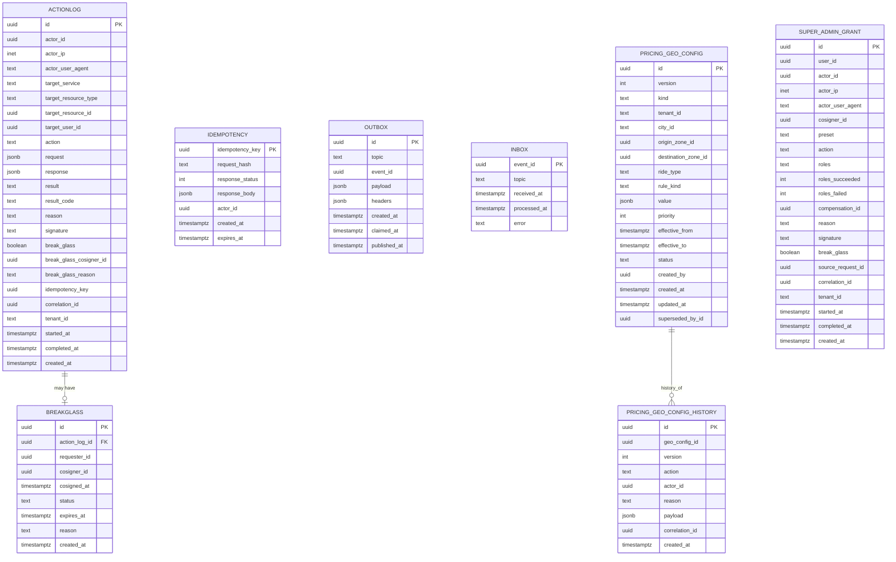

# Admin Service — Entity-Relationship Diagram

## 1. Database

- Engine: PostgreSQL 19
- Schema: `admin` (owned exclusively by this service)
- Migrations: `services/admin-service/migrations/`

## 2. Cross-Service References

| Column | Type | Refers to | Source of truth |
|--------|------|-----------|------------------|
| `action_log.actor_id` | UUID | admin's `Identity.id` | `identity-service` |
| `action_log.target_user_id` | UUID | `Customer.id` / `Driver.id` / etc. | respective service |
| `action_log.target_resource_id` | UUID | target resource | target service |
| `break_glass.cosigner_id` | UUID | admin's `Identity.id` | `identity-service` |
| `super_admin_grant.user_id` | UUID | the operator receiving the `SUPER_ADMIN` preset | `identity-service` |
| `super_admin_grant.actor_id` | UUID | the granting admin's `Identity.id` | `identity-service` |
| `super_admin_grant.cosigner_id` | UUID | the break-glass co-signer's `Identity.id` | `identity-service` |

No DB FKs.

## 3. Entities

### `ActionLog`

Immutable log of every action.

#### Columns

| Column | Type | Constraints | Notes |
|--------|------|-------------|-------|
| `id` | UUID | PK | UUIDv7 |
| `actor_id` | UUID | NOT NULL | admin who performed the action |
| `actor_ip` | INET | NULL | |
| `actor_user_agent` | TEXT | NULL | |
| `target_service` | TEXT | NOT NULL | e.g. `payment-service` |
| `target_resource_type` | TEXT | NOT NULL | e.g. `payment_intent` |
| `target_resource_id` | UUID | NULL | |
| `target_user_id` | UUID | NULL | the affected user |
| `action` | TEXT | NOT NULL | e.g. `refund` |
| `request` | JSONB | NOT NULL | the request body |
| `response` | JSONB | NULL | the response body |
| `result` | TEXT | NOT NULL | `success` / `failed` |
| `result_code` | TEXT | NULL | HTTP status / error code |
| `reason` | TEXT | NOT NULL | operator's reason |
| `signature` | TEXT | NULL | HMAC-SHA256 for high-value |
| `break_glass` | BOOLEAN | NOT NULL DEFAULT false | |
| `break_glass_cosigner_id` | UUID | NULL | |
| `break_glass_reason` | TEXT | NULL | |
| `idempotency_key` | UUID | NULL | |
| `correlation_id` | UUID | NOT NULL | |
| `tenant_id` | TEXT | NOT NULL DEFAULT 'global' | |
| `started_at` | TIMESTAMPTZ | NOT NULL DEFAULT now() | |
| `completed_at` | TIMESTAMPTZ | NULL | |
| `created_at` | TIMESTAMPTZ | NOT NULL DEFAULT now() | partition key |

#### Indexes

- PK on `id`
- Index on `(actor_id, created_at DESC)`
- Index on `(target_service, action, created_at DESC)`
- Index on `(target_user_id, created_at DESC)` (when not null)
- Index on `(target_resource_type, target_resource_id, created_at DESC)`
- Index on `correlation_id`
- Index on `created_at` (partition key)

#### Constraints

- CHECK: `length(reason) BETWEEN 8 AND 512`
- CHECK: `result IN ('success','failed')`
- **No UPDATE / DELETE on this table** (revoked grants).

### `BreakGlass`

A separate table for break-glass requests (so the co-sign can be
tracked separately).

#### Columns

| Column | Type | Constraints | Notes |
|--------|------|-------------|-------|
| `id` | UUID | PK | UUIDv7 |
| `action_log_id` | UUID | NOT NULL, UNIQUE | the action it co-signed |
| `requester_id` | UUID | NOT NULL | who requested break-glass |
| `cosigner_id` | UUID | NULL | who co-signed (must differ) |
| `cosigned_at` | TIMESTAMPTZ | NULL | |
| `status` | TEXT | NOT NULL | `pending` / `approved` / `denied` / `expired` |
| `expires_at` | TIMESTAMPTZ | NOT NULL | |
| `reason` | TEXT | NOT NULL | |
| `created_at` | TIMESTAMPTZ | NOT NULL DEFAULT now() | |

#### Indexes

- PK on `id`
- UNIQUE on `action_log_id`
- Index on `(status, expires_at)`

#### Constraints

- CHECK: `requester_id <> cosigner_id`
- CHECK: `status IN ('pending','approved','denied','expired')`

### `Idempotency`

Same shape.

### `Outbox`

Same shape.

### `Inbox`

Same shape.

### `SuperAdminGrant`

Append-only log of every `SUPER_ADMIN` preset grant and revoke. One
row per `POST /v1/admin/identity/grant-super-admin` (or revoke)
call — the underlying 21 per-role grants live in
`identity-service`'s `role_assignment_history` table
(see [`identity-service/ERD.md`](../identity-service/ERD.md) 3.7).
The two are joined by `source_request_id` so a single operator
action can be reconstructed end-to-end.

#### Columns

| Column | Type | Constraints | Notes |
|--------|------|-------------|-------|
| `id` | UUID | PK | UUIDv7 |
| `user_id` | UUID | NOT NULL | the operator receiving the preset |
| `actor_id` | UUID | NOT NULL | the granting admin (the caller of admin-service) |
| `actor_ip` | INET | NULL | |
| `actor_user_agent` | TEXT | NULL | |
| `cosigner_id` | UUID | NOT NULL | the break-glass co-signer (must differ from `actor_id`) |
| `preset` | TEXT | NOT NULL DEFAULT `'SUPER_ADMIN'` | reserved for future presets; currently the only value |
| `action` | TEXT | NOT NULL | `grant` / `revoke` |
| `roles` | TEXT[] | NOT NULL | the list of realm roles touched by this call (21 entries for `SUPER_ADMIN`: 1 × `platform.super_admin` + 20 × `<service>.admin`; post-ADR-0017 consolidation) |
| `expires_at` | TIMESTAMPTZ NULL | When the time-bounded alias expires (NULL = permanent grant); see [`shared/TIME_BOUNDED_ALIASES.md`](../../shared/TIME_BOUNDED_ALIASES.md) |
| `roles_succeeded` | INT | NOT NULL | count of roles the fan-out successfully reached identity-service for |
| `roles_failed` | INT | NOT NULL DEFAULT 0 | count of roles whose fan-out call failed (compensating revoke attempted) |
| `compensation_id` | UUID | NULL | self-FK on the compensating revoke row when `roles_failed > 0` |
| `reason` | TEXT | NOT NULL | operator's reason |
| `signature` | TEXT | NOT NULL | HMAC-SHA256 over body + timestamp (always required for preset grants) |
| `break_glass` | BOOLEAN | NOT NULL DEFAULT true | always true for `SUPER_ADMIN` preset grants (mirrors identity-service CHECK) |
| `source_request_id` | UUID | NOT NULL, UNIQUE | groups the 21 per-role `role_assignment_history` rows in identity-service |
| `correlation_id` | UUID | NOT NULL | end-to-end |
| `tenant_id` | TEXT | NOT NULL DEFAULT `'global'` | |
| `started_at` | TIMESTAMPTZ | NOT NULL DEFAULT now() | |
| `completed_at` | TIMESTAMPTZ | NULL | when the fan-out finished (success or compensating rollback) |
| `created_at` | TIMESTAMPTZ | NOT NULL DEFAULT now() | partition key |

#### Indexes

- PK on `id`
- UNIQUE on `source_request_id`
- Index on `(user_id, created_at DESC)`
- Index on `(actor_id, created_at DESC)`
- Index on `(action, created_at DESC)`
- Index on `(tenant_id, created_at DESC)` WHERE tenant_id <> 'global'
- Index on `created_at` (partition key)

#### Constraints

- CHECK: `action IN ('grant','revoke')`.
- CHECK: `preset = 'SUPER_ADMIN'` (reserved for future presets; CHECK enforces single preset for now).
- CHECK: `length(reason) BETWEEN 8 AND 512`.
- CHECK: `actor_id <> cosigner_id`.
- CHECK: `roles_succeeded + roles_failed = array_length(roles, 1)`.
- CHECK: `break_glass = true`.
- **No UPDATE / DELETE on this table** (revoked grants).

### `PricingGeoConfig`

Per-location / OD-pair pricing override owned by this service but
consumed by `pricing-service` via the `pricing.geo_config.updated.v1`
event. Append-only with version + history (mirrors the
version/rollback pattern in `configuration-service` per
`architecture/CONFIGURATION_ARCHITECTURE.md`).

#### Columns

| Column | Type | Constraints | Notes |
|--------|------|-------------|-------|
| `id` | UUID | PK | UUIDv7 |
| `version` | INT | NOT NULL | monotonic per logical binding |
| `kind` | TEXT | NOT NULL | `LOCATION_OVERRIDE` / `OD_CORRIDOR` |
| `tenant_id` | TEXT | NOT NULL DEFAULT `'global'` | |
| `city_id` | TEXT | NULL | |
| `origin_zone_id` | UUID | NULL | for OD-pair records |
| `destination_zone_id` | UUID | NULL | for OD-pair records |
| `ride_type` | TEXT | NULL | nullable for global |
| `rule_kind` | TEXT | NOT NULL | same CHECK as `pricing.rule_bindings.rule_kind` |
| `value` | JSONB | NOT NULL | structured payload per `rule_kind` |
| `priority` | INT | NOT NULL DEFAULT 100 | lower wins on equal scope |
| `effective_from` | TIMESTAMPTZ | NOT NULL | required |
| `effective_to` | TIMESTAMPTZ | NULL | soft-disable sets this to `now()` |
| `status` | TEXT | NOT NULL | `ACTIVE` / `RETIRED` |
| `created_by` | UUID | NOT NULL | admin actor |
| `created_at` | TIMESTAMPTZ | NOT NULL DEFAULT now() | |
| `updated_at` | TIMESTAMPTZ | NOT NULL DEFAULT now() | |
| `superseded_by_id` | UUID | NULL | self-FK on rollback |

#### Constraints

- CHECK: `kind IN ('LOCATION_OVERRIDE','OD_CORRIDOR')`
- CHECK: `rule_kind IN ('base_fare_override','per_km_override','per_min_override','surge_pressure','loyalty_discount','min_fare_override','od_corridor')`
- CHECK: `status IN ('ACTIVE','RETIRED')`
- CHECK: `effective_to IS NULL OR effective_to > effective_from`
- An OD-pair record MUST have both `origin_zone_id` and
  `destination_zone_id` non-null.
- Ambiguous priority/scope combinations are rejected at the API
  layer before persistence (admin validation guard).

### `PricingGeoConfigHistory`

Immutable append-only audit of every CRUD on `PricingGeoConfig`.
Mirrors the reversal rule from the accounting four-layer truth
model — UPDATE / DELETE forbidden.

#### Columns

| Column | Type | Constraints | Notes |
|--------|------|-------------|-------|
| `id` | UUID | PK | UUIDv7 |
| `geo_config_id` | UUID | NOT NULL | refs `PricingGeoConfig.id` |
| `version` | INT | NOT NULL | matches the binding's version at action time |
| `action` | TEXT | NOT NULL | `create` / `update` / `disable` / `rollback` |
| `actor_id` | UUID | NOT NULL | admin actor |
| `reason` | TEXT | NOT NULL | free text ≥ 8 chars |
| `payload` | JSONB | NOT NULL | full snapshot at this version |
| `correlation_id` | UUID | NOT NULL | end-to-end |
| `created_at` | TIMESTAMPTZ | NOT NULL DEFAULT now() | |

#### Constraints

- CHECK: `action IN ('create','update','disable','rollback')`
- CHECK: `length(reason) >= 8`
- REVOKE UPDATE, DELETE on this table.

## 4. Mermaid ER Diagram



## 5. DDL Sketch

```sql
CREATE SCHEMA IF NOT EXISTS admin;

CREATE TABLE admin.action_log (
    id UUID PRIMARY KEY,
    actor_id UUID NOT NULL,
    actor_ip INET,
    actor_user_agent TEXT,
    target_service TEXT NOT NULL,
    target_resource_type TEXT NOT NULL,
    target_resource_id UUID,
    target_user_id UUID,
    action TEXT NOT NULL,
    request JSONB NOT NULL,
    response JSONB,
    result TEXT NOT NULL
        CHECK (result IN ('success','failed')),
    result_code TEXT,
    reason TEXT NOT NULL
        CHECK (length(reason) BETWEEN 8 AND 512),
    signature TEXT,
    break_glass BOOLEAN NOT NULL DEFAULT false,
    break_glass_cosigner_id UUID,
    break_glass_reason TEXT,
    idempotency_key UUID,
    correlation_id UUID NOT NULL,
    tenant_id TEXT NOT NULL DEFAULT 'global',
    started_at TIMESTAMPTZ NOT NULL DEFAULT now(),
    completed_at TIMESTAMPTZ,
    created_at TIMESTAMPTZ NOT NULL DEFAULT now()
) PARTITION BY RANGE (created_at);

-- Idempotent pre-creation; safe to rerun as part of the maintenance job.
CREATE TABLE IF NOT EXISTS admin.action_log_2026_07
    PARTITION OF admin.action_log
    FOR VALUES FROM ('2026-07-01 00:00:00+00') TO ('2026-08-01 00:00:00+00');

CREATE INDEX idx_action_log_actor
    ON admin.action_log (actor_id, created_at DESC);
CREATE INDEX idx_action_log_target_service
    ON admin.action_log (target_service, action, created_at DESC);
CREATE INDEX idx_action_log_target_user
    ON admin.action_log (target_user_id, created_at DESC)
    WHERE target_user_id IS NOT NULL;
CREATE INDEX idx_action_log_target_resource
    ON admin.action_log (target_resource_type, target_resource_id, created_at DESC);
CREATE INDEX idx_action_log_correlation
    ON admin.action_log (correlation_id);

-- append-only: revoke UPDATE/DELETE
REVOKE UPDATE, DELETE ON admin.action_log FROM admin_app;

CREATE TABLE admin.break_glass (
    id UUID PRIMARY KEY,
    action_log_id UUID NOT NULL UNIQUE,
    requester_id UUID NOT NULL,
    cosigner_id UUID,
    cosigned_at TIMESTAMPTZ,
    status TEXT NOT NULL
        CHECK (status IN ('pending','approved','denied','expired')),
    expires_at TIMESTAMPTZ NOT NULL,
    reason TEXT NOT NULL,
    created_at TIMESTAMPTZ NOT NULL DEFAULT now(),
    CHECK (requester_id <> cosigner_id)
);

CREATE INDEX idx_break_glass_status
    ON admin.break_glass (status, expires_at);

CREATE TABLE admin.idempotency (
    idempotency_key UUID PRIMARY KEY,
    request_hash TEXT NOT NULL,
    response_status INT NOT NULL,
    response_body JSONB NOT NULL,
    actor_id UUID NOT NULL,
    created_at TIMESTAMPTZ NOT NULL DEFAULT now(),
    expires_at TIMESTAMPTZ NOT NULL
);

CREATE TABLE admin.outbox (
    id UUID PRIMARY KEY,
    topic TEXT NOT NULL,
    event_id UUID NOT NULL,
    payload JSONB NOT NULL,
    headers JSONB,
    created_at TIMESTAMPTZ NOT NULL DEFAULT now(),
    claimed_at TIMESTAMPTZ,
    published_at TIMESTAMPTZ
);

CREATE TABLE admin.inbox (
    event_id UUID PRIMARY KEY,
    topic TEXT NOT NULL,
    received_at TIMESTAMPTZ NOT NULL DEFAULT now(),
    processed_at TIMESTAMPTZ,
    error TEXT
);

-- Pricing geo-config: append-only with version + history. Mirror of
-- pricing.rule_bindings in pricing-service; admin-service is the
-- producer; pricing-service is the consumer via
-- pricing.geo_config.updated.v1 (see INTEGRATION.md 3.x). REVERSAL
-- rule mirrors the four-layer truth model: rollback creates a new
-- history row + a new head, never UPDATE/DELETE.
CREATE TABLE admin.pricing_geo_config (
    id UUID PRIMARY KEY,
    version INT NOT NULL,
    kind TEXT NOT NULL CHECK (kind IN ('LOCATION_OVERRIDE','OD_CORRIDOR')),
    tenant_id TEXT NOT NULL DEFAULT 'global',
    city_id TEXT,
    origin_zone_id UUID,
    destination_zone_id UUID,
    ride_type TEXT,
    rule_kind TEXT NOT NULL CHECK (rule_kind IN (
        'base_fare_override','per_km_override','per_min_override',
        'surge_pressure','loyalty_discount','min_fare_override','od_corridor'
    )),
    value JSONB NOT NULL,
    priority INT NOT NULL DEFAULT 100,
    effective_from TIMESTAMPTZ NOT NULL,
    effective_to TIMESTAMPTZ,
    status TEXT NOT NULL CHECK (status IN ('ACTIVE','RETIRED')),
    created_by UUID NOT NULL,
    created_at TIMESTAMPTZ NOT NULL DEFAULT now(),
    updated_at TIMESTAMPTZ NOT NULL DEFAULT now(),
    superseded_by_id UUID
);
CREATE INDEX idx_pricing_geo_config_lookup
    ON admin.pricing_geo_config (kind, status, effective_from);

CREATE TABLE admin.pricing_geo_config_history (
    id UUID PRIMARY KEY,
    geo_config_id UUID NOT NULL,
    version INT NOT NULL,
    action TEXT NOT NULL CHECK (action IN ('create','update','disable','rollback')),
    actor_id UUID NOT NULL,
    reason TEXT NOT NULL CHECK (char_length(reason) >= 8),
    payload JSONB NOT NULL,
    correlation_id UUID NOT NULL,
    created_at TIMESTAMPTZ NOT NULL DEFAULT now()
);
CREATE INDEX idx_pricing_geo_config_history_binding
    ON admin.pricing_geo_config_history (geo_config_id, version);
REVOKE UPDATE, DELETE ON admin.pricing_geo_config_history FROM admin_app;

-- Super-admin grant: one row per POST/DELETE
-- /v1/admin/identity/(grant|revoke)-super-admin call. The
-- 59 per-role grants are tracked in identity-service's
-- role_assignment_history (see identity-service/ERD.md 3.7)
-- joined on source_request_id.
CREATE TABLE admin.super_admin_grant (
    id UUID PRIMARY KEY,
    user_id UUID NOT NULL,
    actor_id UUID NOT NULL,
    actor_ip INET,
    actor_user_agent TEXT,
    cosigner_id UUID NOT NULL,
    preset TEXT NOT NULL DEFAULT 'SUPER_ADMIN'
        CHECK (preset = 'SUPER_ADMIN'),
    action TEXT NOT NULL
        CHECK (action IN ('grant','revoke')),
    roles TEXT[] NOT NULL,
    roles_succeeded INT NOT NULL,
    roles_failed INT NOT NULL DEFAULT 0,
    compensation_id UUID,
    reason TEXT NOT NULL
        CHECK (length(reason) BETWEEN 8 AND 512),
    signature TEXT NOT NULL,
    break_glass BOOLEAN NOT NULL DEFAULT true,
    source_request_id UUID NOT NULL UNIQUE,
    correlation_id UUID NOT NULL,
    tenant_id TEXT NOT NULL DEFAULT 'global',
    started_at TIMESTAMPTZ NOT NULL DEFAULT now(),
    completed_at TIMESTAMPTZ,
    created_at TIMESTAMPTZ NOT NULL DEFAULT now(),
    CHECK (actor_id <> cosigner_id),
    CHECK (roles_succeeded + roles_failed = array_length(roles, 1))
) PARTITION BY RANGE (created_at);

-- Idempotent pre-creation; safe to rerun as part of the maintenance job.
CREATE TABLE IF NOT EXISTS admin.super_admin_grant_2026_08
    PARTITION OF admin.super_admin_grant
    FOR VALUES FROM ('2026-08-01 00:00:00+00') TO ('2026-09-01 00:00:00+00');

CREATE UNIQUE INDEX idx_super_admin_grant_source_request_id
    ON admin.super_admin_grant (source_request_id);
CREATE INDEX idx_super_admin_grant_user
    ON admin.super_admin_grant (user_id, created_at DESC);
CREATE INDEX idx_super_admin_grant_actor
    ON admin.super_admin_grant (actor_id, created_at DESC);
CREATE INDEX idx_super_admin_grant_action
    ON admin.super_admin_grant (action, created_at DESC);
CREATE INDEX idx_super_admin_grant_tenant
    ON admin.super_admin_grant (tenant_id, created_at DESC)
    WHERE tenant_id <> 'global';

REVOKE UPDATE, DELETE ON admin.super_admin_grant FROM admin_app;
```

## 6. Audit Columns

`action_log`, `break_glass`, and `super_admin_grant` are
append-only; they have no `updated_at` / `updated_by`.

## 7. Soft Delete

n/a (append-only).

## 8. JSONB Usage

| Table.Column | What is stored | Justification |
|--------------|----------------|---------------|
| `action_log.request` | the request body | audit |
| `action_log.response` | the response body | audit |
| `outbox.payload` | event payload | per topic |
| `pricing_geo_config.value` | structured per `rule_kind` (e.g. `{base_fare_minor, multiplier, expiry_hours}`) | schema-validated per kind |
| `pricing_geo_config_history.payload` | full snapshot of the binding at this version | audit / rollback |
| `super_admin_grant.roles` | the 59 realm roles the preset touches | row-shaped; the array is bounded and fixed for `SUPER_ADMIN`; join key into `identity-service.role_assignment_history` via `source_request_id` |

## 9. Partitioning

- `action_log` partitioned by month.
- `super_admin_grant` partitioned by month (same maintenance
  pattern as `action_log`; one row per operator action, the
  per-role fan-out lives in identity-service).

## 10. Data Retention

| Table | Retention | Purged by |
|-------|-----------|-----------|
| `action_log` | 7 years | monthly archival job |
| `break_glass` | 7 years | monthly archival job |
| `idempotency` | 24 hours | daily purge job |
| `outbox` | 24 hours after `published_at` | hourly purge job |
| `inbox` | 7 days | daily purge job |
| `pricing_geo_config` | 7 years (financial record) | never (soft-disable sets `effective_to` and `status='RETIRED'`) |
| `pricing_geo_config_history` | 7 years (financial record) | never (append-only with REVOKE DELETE) |
| `super_admin_grant` | 7 years (financial/audit record) | never (append-only with REVOKE DELETE; partitions archived then dropped) |

## 11. Migration Considerations

- The `action_log` table is the audit trail; it is append-only.
- The `break_glass` table is a separate workflow with its own
  status; the action is allowed to proceed only when
  `status='approved'`.
- The append-only constraint is enforced at the database grant
  level.
- `pricing_geo_config` and `pricing_geo_config_history` are added as
  new tables; no destructive ALTER on existing rows. The
  `effective_to` is the only status-toggle mechanism — UPDATE /
  DELETE on the history table is forbidden via `REVOKE` (mirrors
  the reversal rule from the accounting four-layer truth model).
- `super_admin_grant` is added as a new table; no destructive
  ALTER on existing rows. The 59-row fan-out per grant is
  reconstructed end-to-end by joining
  `admin.super_admin_grant.source_request_id` to
  `identity-service.identity.role_assignment_history.source_request_id`.
  The migration must deploy BEFORE the first
  `POST /v1/admin/identity/grant-super-admin` call is enabled in
  production (otherwise the compensating-revoke path has no
  per-grant row to attach to).

---

## See also

### Sibling docs for this service

- [`README.md`](./README.md) — purpose, bounded context, responsibilities
- [`BRD.md`](./BRD.md) — business requirements
- [`SRS.md`](./SRS.md) — functional + non-functional requirements
- [`ERD.md`](./ERD.md) — data model (entities, relationships)
- [`INTEGRATION.md`](./INTEGRATION.md) — inter-service contracts (APIs, events, sagas)
- [`WORKFLOWS.md`](./WORKFLOWS.md) — operational workflows (happy paths, failure modes)
- [`TECH.md`](./TECH.md) — technology profile (runtime, libraries, data layer, admin endpoints, RBAC)

### Platform-wide

- [`../../shared/README.md`](../../shared/README.md) — `platform-spring-boot-starter` shared library (the single source of cross-cutting code for all Spring Boot services in the platform)
- [`../RECOMMENDATIONS.md`](../RECOMMENDATIONS.md) — platform-wide technology map (language, framework, version baseline, admin/RBAC pattern)
- [`../../README.md`](../../README.md) — services overview (the catalog of all 20 services)
- [`../../../main.md`](../../../main.md) — top-level platform specification (architecture, Keycloak, PostgreSQL 19, messaging, observability baseline)

## Related docs

- [`../../architecture/DATA_OWNERSHIP.md`](../../architecture/DATA_OWNERSHIP.md) — full source-of-truth matrix
- [`../../architecture/SERVICE_ISOLATION.md`](../../architecture/SERVICE_ISOLATION.md) — how this service handles a downstream outage
- [`../../architecture/DATABASE_ARCHITECTURE.md`](../../architecture/DATABASE_ARCHITECTURE.md) — PostgreSQL-per-service rules
- [`../../architecture/CONSISTENCY_STRATEGY.md`](../../architecture/CONSISTENCY_STRATEGY.md) — strong vs eventual consistency per context

