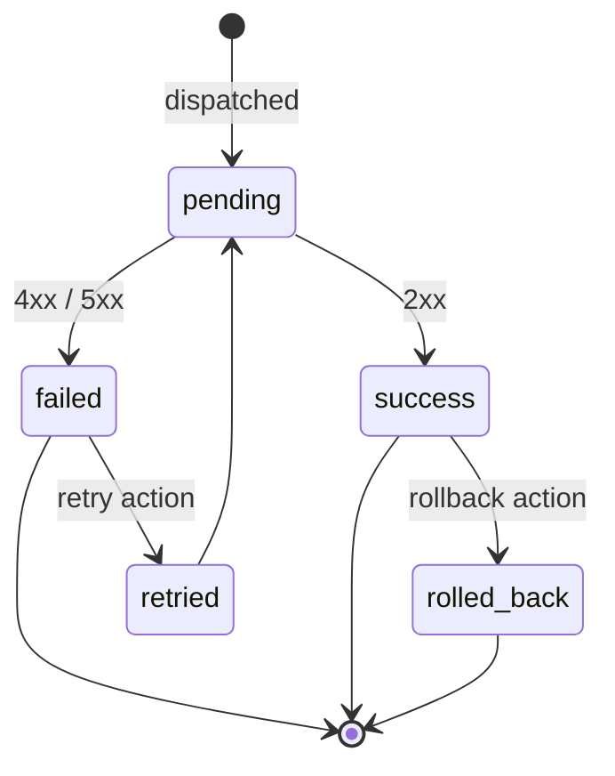

# Admin Service — Software Requirements Specification

## 1. Introduction

This SRS specifies the behavior, performance, and operational
requirements of `admin-service`. It inherits the platform-wide
standards in `docs/architecture/API_STANDARDS.md`,
`docs/architecture/EVENT_ARCHITECTURE.md`, and
`docs/architecture/SECURITY_ARCHITECTURE.md`.

## 2. Scope

In scope:

- The action dispatch API.
- The web UI.
- RBAC enforcement.
- Request signing.
- Break-glass.
- Action log.

Out of scope:

- Target service data.
- Identity / auth (Keycloak).
- Immutable audit log (owned by `audit-service`).

## 3. System Context

```mermaid
flowchart LR
    OP[Operator] -- UI --> ADM[admin-service]
    OP -- API --> ADM
    ADM -- call target service --> T1[trip-service]
    ADM -- call target service --> T2[payment-service]
    ADM -- call target service --> T3[configuration-service]
    ADM -- POST /v1/zones/exists --> ZS[zone-service]
    ZS -- 200 ok / 404 --> ADM
    ADM -- publish --> K[Kafka]
    K -- consume --> AUD[audit-service]
    K -. pricing.geo_config.updated.v1 .-> PRC[pricing-service]
    PRC -. pricing.geo_overrides.matched.v1 .-> ANA[analytics-service]
    ID[identity-service] -.validates.-> ADM
    KC[Keycloak] -- OIDC --> ADM
    S3[(S3)] -- nightly export --> ADM
```

## 4. Actors

- Operator (admin) — human.
- Super admin — human.
- Security on-call — human.
- Compliance auditor — human.
- Target service — system.

## 5. Functional Requirements

| ID | Requirement | Priority |
|----|-------------|----------|
| FR--001 | The service MUST expose `POST /v1/admin/{service}/{action}` to dispatch an action. | MUST |
| FR--002 | The service MUST enforce RBAC + per-action scopes from the JWT. | MUST |
| FR--003 | The service MUST require `X-Audit-Reason` on every mutation. | MUST |
| FR--004 | The service MUST enforce request signing for high-value actions. | MUST |
| FR--005 | The service MUST support break-glass with a second admin's co-signature. | MUST |
| FR--006 | The service MUST emit `admin.action.performed.v1` for every action. | MUST |
| FR--007 | The service MUST persist every action in `admin.action_log` with `actor_id` and `reason`. | MUST |
| FR--008 | The service MUST provide `GET /v1/admin/actions` for search. | MUST |
| FR--009 | The service MUST provide `GET /v1/admin/actions/{id}` for detail. | MUST |
| FR--010 | The service MUST enforce time-of-day restriction for super-admin off-hours. | MUST |
| FR--011 | The service MUST enforce IP allowlist for super-admin. | MUST |
| FR--012 | The service MUST require step-up MFA for super-admin. | MUST |
| FR--013 | The service MUST support per-tenant RBAC. | MUST |
| FR--014 | The service MUST support a "preview impact" view in the UI. | SHOULD |
| FR--015 | The service MUST support "reason" templates in the UI. | SHOULD |
| FR--016 | The service MUST support a "rollback" action for any mutation. | MUST |
| FR--017 | The service MUST support a "suspend" / "reinstate" action for any user. | MUST |
| FR--018 | The service MUST support a "manual refund" action. | MUST |
| FR--019 | The service MUST support a "payout schedule change" action. | MUST |
| FR--020 | The service MUST support a "configuration rollback" action. | MUST |
| FR--021 | The service MUST support a "feature flag kill switch" action. | MUST |
| FR--022 | The service MUST export daily action log to S3. | SHOULD |
| FR--023 | The service MUST expose CRUD endpoints at `/v1/admin/pricing/geo-config[...]` (create / read / patch / disable / rollback / list); only the `pricing.admin` scope may create / update / disable / rollback; the list endpoint exposes a filter by `kind` and `status`. | MUST |
| FR--024 | The service MUST validate every origin and destination `zone_id` in an OD-pair record by calling `zone-service POST /v1/zones/exists` for each side before persisting; rejection on missing zone is 422 `ZONE_UNKNOWN`. | MUST |
| FR--025 | On every successful create / update / disable / rollback on `/v1/admin/pricing/geo-config[...]`, the service MUST emit `pricing.geo_config.updated.v1` (partition key `geo_config_id`) carrying the new state — published via the local outbox in the same transaction as the row write. | MUST |
| FR--026 | A rollback (`POST /v1/admin/pricing/geo-config/{id}/rollback`) MUST require break-glass; the action emits the event and persists a new row in `pricing.rule_bindings_history` pointing at the prior version (never UPDATE/DELETE). | MUST |
| FR--027 | The service MUST refuse ambiguous priority / scope combinations (two bindings at equal scope and priority that would create a tie at quote time) at admin validation time with 422 `GEO_OVERRIDE_AMBIGUOUS`. | MUST |
| FR--028 | The `POST /v1/admin/pricing/geo-config` and `PATCH .../{id}` endpoints MUST carry a required `effective_from` (RFC3339 UTC) and an optional `effective_to`; overlap-checking runs at admin validation time. | MUST |
| FR--029 | The geo-config list endpoint MUST return records paginated by `created_at DESC` with the standard platform cursor (`page_size` ≤ 100, `next_cursor`); records with `effective_to` in the past are returned only when `status=RETIRED` is filtered. | MUST |
| FR--030 | The service MUST expose `GET /v1/admin/services` returning the 58-service catalog with each service's accepted admin scopes (per its `TECH.md` §10.1) and `SUPER_ADMIN` preset membership (per §10.7). The catalog is the source of truth for the preset's role list. | MUST |
| FR--031 | The service MUST expose `GET /v1/admin/presets` returning the available permission presets (currently exactly `SUPER_ADMIN` = `platform.super_admin` + 58 `<service>.admin` scopes). | MUST |
| FR--032 | The service MUST expose `POST /v1/admin/identity/grant-super-admin` to grant the `SUPER_ADMIN` preset to a Keycloak user. The endpoint MUST require `platform.super_admin`, `X-Audit-Reason` ≥ 8 chars, HMAC `X-Signature`, `X-Break-Glass-Cosigner`, step-up MFA, and an `Idempotency-Key`. The endpoint MUST be on the super-admin IP allowlist (separate from the regular admin allowlist). Off-hours actions MUST require a co-signer. | MUST |
| FR--033 | The service MUST expose `DELETE /v1/admin/identity/revoke-super-admin` to revoke the `SUPER_ADMIN` preset from a Keycloak user. Same gates as FR--032. | MUST |
| FR--034 | On a successful grant or revoke the service MUST write one row to `admin.super_admin_grant` (append-only) and emit `admin.super_admin.granted.v1` or `admin.super_admin.revoked.v1`. On partial fan-out failure (some of the 59 per-role grants fail) the service MUST perform compensating revokes for the roles that did succeed and emit a compensating event carrying the same `source_request_id`. security on-call MUST be paged on every grant and revoke. | MUST |
| FR--035 | The service MUST expose `GET /v1/admin/identity/permissions/{user_id}` listing a user's current roles + computed `presets[]` (forwarding to `identity-service GET /admin/v1/identities/{id}/roles`). | MUST |
| FR--036 | The grant endpoint MUST support a `tenant_id` field on the request body; when the value differs from the actor's tenant, the endpoint MUST return 403 `TENANT_MISMATCH` (no cross-tenant super-admin grants). | MUST |

## 6. Non-Functional Requirements

| ID | Category | Requirement | Target |
|----|----------|-------------|--------|
| NFR--001 | performance | P99 dispatch latency | < 1s |
| NFR--002 | availability | uptime | 99.95% over 30d |
| NFR--003 | scalability | concurrent actions per pod | 200 |
| NFR--004 | durability | zero data loss on regional outage | RPO 5m, RTO 30m |
| NFR--005 | observability | 100% requests have trace and log | enforced in CI |
| NFR--006 | auditability | 100% writes attributed | enforced in DB |
| NFR--007 | signature coverage | 100% of high-value actions signed | enforced in service |

## 7. API Requirements

- Versioned URIs.
- Bearer JWT.
- `Idempotency-Key` required for mutations.
- `X-Audit-Reason` required.
- `X-Signature` required for high-value actions.
- Errors in the standard envelope.
- OpenAPI 3.1 at `/openapi.json`.

## 8. Data Requirements

| ID | Requirement | Notes |
|----|-------------|-------|
| DATA--001 | Primary keys UUIDv7. | |
| DATA--002 | `action_log` is append-only. | |
| DATA--003 | Cross-service references are UUID columns without DB FKs. | Rule |
| DATA--004 | Time is RFC3339 UTC. | |
| DATA--005 | `action_log` partitioned by month. | Retention. |
| DATA--006 | `admin.pricing_geo_config` is the CRUD table for per-location / OD-pair pricing overrides; columns include `id UUIDv7`, `kind` (`LOCATION_OVERRIDE` / `OD_CORRIDOR`), `tenant_id TEXT`, `city_id TEXT NULL`, `origin_zone_id UUID NULL`, `destination_zone_id UUID NULL`, `ride_type TEXT NULL`, `rule_kind TEXT CHECK (...)`, `value JSONB`, `priority INT`, `effective_from/effective_to`, `status` (`ACTIVE` / `RETIRED`), `created_at/created_by/updated_at/updated_by`, `version INT`, `superseded_by_id UUID NULL`. | |
| DATA--007 | `admin.pricing_geo_config_history` is the immutable audit history; every action (`create`/`update`/`disable`/`rollback`) writes a new row carrying `payload JSONB`, `actor_id`, `reason`, `correlation_id`. | mirrors `ledger.postings` reversal rule |
| DATA--008 | Cross-service references (`zone_id`, `geo_config_id`, `tenant_id`) are stored as UUID / TEXT columns without DB FKs. | Rule |

## 9. Validation Rules

- A reason MUST be 8–512 characters.
- A signature MUST be valid HMAC-SHA256 over the body.
- A break-glass co-sign MUST be from a different admin.
- A super-admin action outside business hours MUST have a
  co-signature.

## 10. State Transitions

The action itself has no state; the relevant state is the action
log:



## 11. Authorization Requirements

- Per-action RBAC (e.g. `payment.refund` for a manual refund).
- `admin.read` for action log reads.
- `admin.super` for super-admin actions.
- `admin.break_glass` for co-signing.
- `admin.super_admin.grant` for `POST /v1/admin/identity/grant-super-admin` (must be combined with `platform.super_admin`; the JWT role is the enforcement; the scope is the audit-log label).
- `admin.super_admin.revoke` for `DELETE /v1/admin/identity/revoke-super-admin` (same shape as grant).

## 12. Configuration Requirements

- `BREAK_GLASS_REQUIRED` (env; default false).
- `TIME_OF_DAY_RESTRICTION` (env; default `09:00-18:00 UTC`).
- `IP_ALLOWLIST` (env; default empty).
- `MFA_REQUIRED` (env; default true).

## 13. Error Handling

| Error | Response |
|-------|----------|
| Missing reason | 400 `AUDIT_REASON_REQUIRED` |
| Invalid signature | 403 `SIGNATURE_INVALID` |
| Break-glass required | 403 `BREAK_GLASS_REQUIRED` |
| Off-hours super-admin without break-glass | 403 `OFF_HOURS_RESTRICTED` |
| IP not in allowlist | 403 `IP_NOT_ALLOWED` |
| MFA required | 403 `MFA_REQUIRED` |
| Idempotency-Key reuse | 422 `IDEMPOTENCY_KEY_REUSED` |
| Co-signer missing or equal to actor on super-admin grant/revoke | 403 `CO_SIGNER_REQUIRED` |
| User already has the `SUPER_ADMIN` preset | 409 `SUPER_ADMIN_ALREADY_GRANTED` |
| User does not have the `SUPER_ADMIN` preset | 404 `SUPER_ADMIN_NOT_GRANTED` |
| Preset not in the catalog | 422 `BUNDLE_MISMATCH` |
| Cross-tenant super-admin grant | 403 `TENANT_MISMATCH` |

## 14. Concurrency Requirements

- An action is serialized at the row level on
  `(target_service, target_resource_id, action)` to prevent races.

## 15. Idempotency Requirements

- Every mutation requires `Idempotency-Key`.
- The service stores the key in `admin.idempotency` for 24 hours.

## 16. Performance

- Dominant path: action dispatch (a single round-trip to the target
  service).
- P50/P95/P99: 100ms / 500ms / 1s.

## 17. Scalability

- Horizontal scaling: HPA on CPU.
- Vertical scaling: 2 vCPU / 4 GiB production.

## 18. Availability

- SLO: 99.95% over 30 days.
- Error budget: ~22 minutes per 30 days.
- Maintenance window: Sundays 04:00–06:00 UTC.

## 19. Security

| ID | Requirement | Notes |
|----|-------------|-------|
| SEC--001 | All requests JWT-validated. | Standard |
| SEC--002 | High-value actions require `X-Signature`. | HMAC-SHA256. |
| SEC--003 | Mutations require `X-Audit-Reason`. | |
| SEC--004 | Super-admin off-hours require break-glass. | |
| SEC--005 | Super-admin requires step-up MFA + IP allowlist. | |
| SEC--006 | DB user has rights only on the `admin` schema. | Least privilege. |
| SEC--007 | Action log is append-only. | No UPDATE / DELETE. |
| SEC--008 | Co-signature MUST be from a different admin. | |
| SEC--009 | Geo-config CRUD: only the `pricing.admin` role may create / update / disable / rollback; the rollback endpoint additionally requires break-glass co-signature; the request MUST carry `X-Audit-Reason` ≥ 8 chars; the `value` JSONB MUST not contain any city or zone UUID that fails the `zone-service` existence check. | |
| SEC--010 | Super-admin grant (`POST /v1/admin/identity/grant-super-admin`) MUST require the caller's IP to be on the **super-admin** IP allowlist (separate from the regular admin allowlist) and MUST require a step-up MFA claim in the request. | |
| SEC--011 | Super-admin grant MUST require a valid HMAC-SHA256 `X-Signature` over `body + timestamp`; the signing key is fetched from Vault per `SECURITY_ARCHITECTURE.md` §14. | |
| SEC--012 | Super-admin grant MUST require a break-glass co-signer whose `identity_id` differs from the actor's; the co-signer MUST hold `platform.super_admin`. Off-hours the co-signer is mandatory even when the actor holds the role. | |
| SEC--013 | Super-admin grant MUST page security on-call on every successful grant (and revoke). The page is emitted via `notification-service` consuming `admin.super_admin.granted.v1` / `admin.super_admin.revoked.v1`. | |

## 20. Privacy

- PII stored: actor id (UUID), target user id (UUID).
- Retention: 7 years for the action log.
- Erasure: tenant offboarding deactivates admins; the action log
  retains a redacted row.

## 21. Auditability

- Every action emits `admin.action.performed.v1` AND a row in
  `admin.action_log`.
- `audit-service` consumes the events.

## 22. Observability

- Logs: JSON to stdout; standard fields + `actor_id`, `action`,
  `target_service`, `target_resource_id`, `result`.
- Metrics:
  - `http_requests_total{route, method, status}` (RED)
  - `http_request_duration_seconds{route, method, status}` (RED)
  - `admin_actions_total{service, action, result}`
  - `admin_break_glass_total{service, action}`
- Traces: OpenTelemetry.
- Alerts:
  - SLO burn rate.
  - Break-glass rate spike.
  - High-value action without signature (should be 0).

## 23. Maintainability

- Code style: TypeScript ESLint config.
- Test coverage: ≥ 85%.
- Documentation: this folder; OpenAPI 3.1 at `/openapi.json`.

## 24. Disaster Recovery

- RPO: 5 minutes.
- RTO: 30 minutes.

## 25. Acceptance Criteria

- 99.95% action dispatch availability for 30 days in production.
- 100% of actions attributed to a user with a reason.
- 100% of high-value actions signed.
- 100% of super-admin off-hours actions co-signed.
- The action log is searchable by actor / service / target / time.
- **Geo-config (FR--023..FR--029):** every CRUD on
  `/v1/admin/pricing/geo-config[...]` succeeds only with the
  `pricing.admin` scope and emits exactly one
  `pricing.geo_config.updated.v1` (partition key `geo_config_id`)
  per action. The rollback endpoint requires break-glass; the OD-pair
  endpoints require zone validation. Ambiguous priority / scope
  combinations are rejected at validation time.
- **All 29 functional requirements (FR--001..FR--029)** are
  implemented; the §25 list above is the acceptance contract every
  release must satisfy.

---

## See also

### Sibling docs for this service

- [`README.md`](./README.md) — purpose, bounded context, responsibilities
- [`BRD.md`](./BRD.md) — business requirements
- [`SRS.md`](./SRS.md) — functional + non-functional requirements
- [`ERD.md`](./ERD.md) — data model (entities, relationships)
- [`INTEGRATION.md`](./INTEGRATION.md) — inter-service contracts (APIs, events, sagas)
- [`WORKFLOWS.md`](./WORKFLOWS.md) — operational workflows (happy paths, failure modes)
- [`TECH.md`](./TECH.md) — technology profile (runtime, libraries, data layer, admin endpoints, RBAC)

### Platform-wide

- [`../../shared/README.md`](../../shared/README.md) — `platform-spring-boot-starter` shared library (the single source of cross-cutting code for all Spring Boot services in the platform)
- [`../RECOMMENDATIONS.md`](../RECOMMENDATIONS.md) — platform-wide technology map (language, framework, version baseline, admin/RBAC pattern)
- [`../../README.md`](../../README.md) — services overview (the catalog of all 58 services)
- [`../../../main.md`](../../../main.md) — top-level platform specification (architecture, Keycloak, PostgreSQL 18, messaging, observability baseline)

