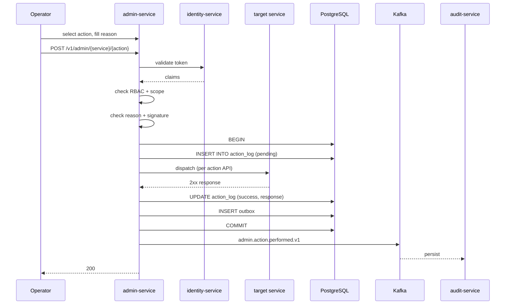
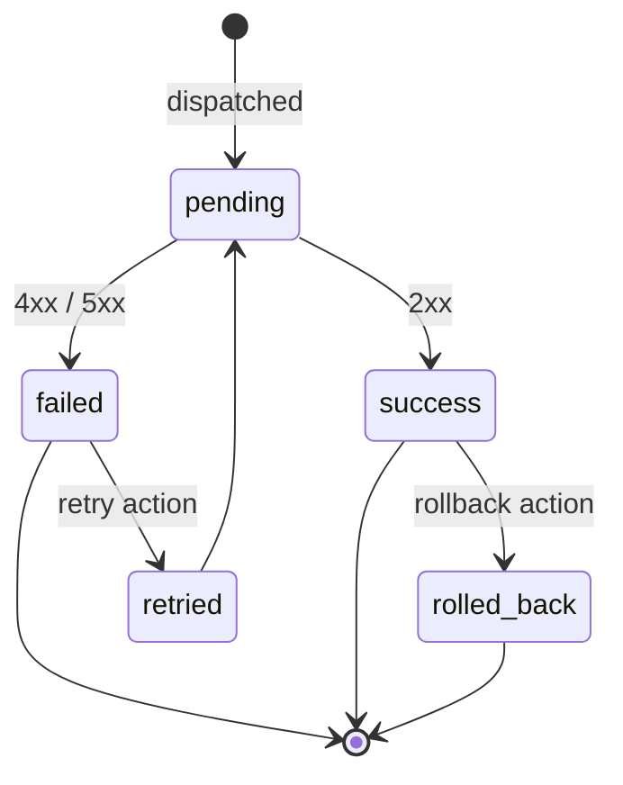
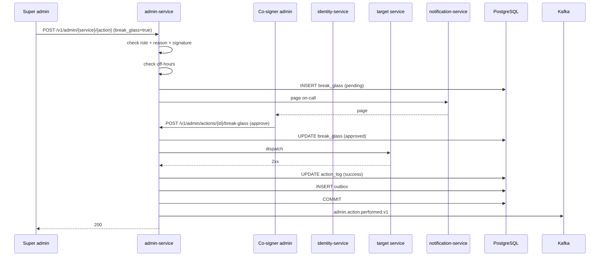
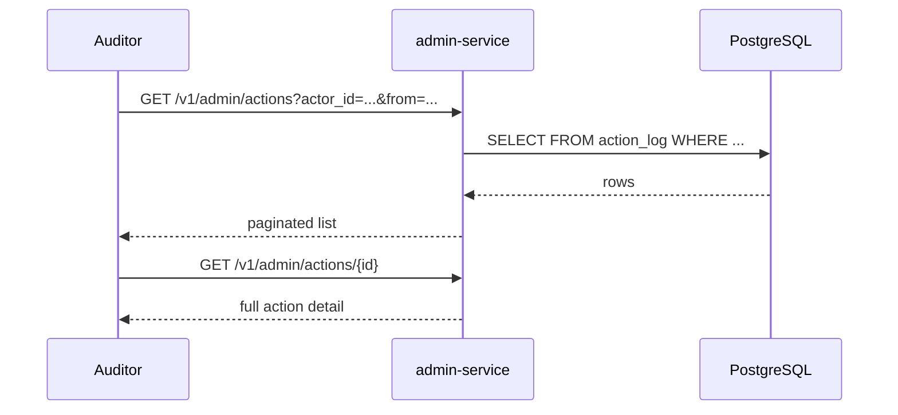
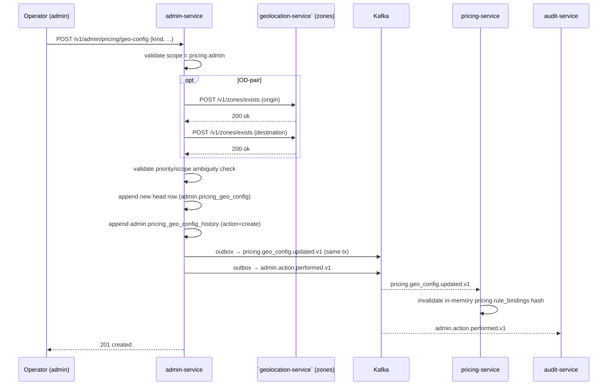

# Admin Service — Workflows

## 1. Operator Performs an Action

### 1.1 Objective

An operator performs a high-value mutation through the admin
console, with full attribution, signed request, and audit log.

### 1.2 Initiating Actor

Operator (admin) via the admin console.

### 1.3 Participating Services

- `admin-service` (this service)
- `identity-service` (token validation)
- Target service (e.g. `payment-service`, `configuration-service`)
- `audit-service` (consumer of `admin.action.performed.v1`)
- Kafka

### 1.4 Prerequisites

- The operator holds the per-action RBAC role.
- The operator provides `X-Audit-Reason`.
- For high-value actions: a valid `X-Signature`.
- For super-admin off-hours: a break-glass co-signature.

### 1.5 Happy Path



State machine for an action:



### 1.6 Alternate Paths

- **High-value action**: requires `X-Signature`; missing → 403
  `SIGNATURE_INVALID`.
- **Super-admin off-hours**: requires break-glass; missing → 403
  `BREAK_GLASS_REQUIRED` or `OFF_HOURS_RESTRICTED`.
- **Idempotent replay**: returns the prior result; no new event.

### 1.7 Failure Paths

| Failure | Handling |
|---------|----------|
| Missing reason | 400 `AUDIT_REASON_REQUIRED` |
| Invalid signature | 403 `SIGNATURE_INVALID` |
| RBAC missing | 403 `FORBIDDEN` |
| Target service 5xx | action logged as `failed`; operator retries |
| Target service 4xx | action logged as `failed`; operator surfaces to user |
| Outbox poller fails | retry with backoff; DLQ after 3 attempts |

### 1.8 Business Rules

- Every action MUST be attributed to an admin.
- Every action MUST carry a reason.
- High-value actions MUST be signed.
- Super-admin off-hours MUST be co-signed.

### 1.9 State Transitions

See state machine in §1.5.

### 1.10 Events

| Event | Direction | When |
|-------|-----------|------|
| `admin.action.performed.v1` | produced | every action |

### 1.11 APIs Involved

| API | Direction | When |
|-----|-----------|------|
| `POST /v1/admin/{service}/{action}` | inbound | dispatch |
| per target service API | outbound | mutation |

### 1.12 Compensation / Rollback

A "rollback" action (e.g. `payment-service.reverse_refund`) is
itself an action; the audit log records both.

### 1.13 Final State

The action is in `action_log`; the target service state is updated;
the event is published; `audit-service` persists.

## 2. Super Admin Performs a Break-Glass Action

### 2.1 Objective

A super admin performs a high-value action off-hours, with a
co-signature from a second admin.

### 2.2 Initiating Actor

Super admin + second admin (co-signer).

### 2.3 Participating Services

- `admin-service`
- `identity-service`
- Target service
- `notification-service` (page on-call)
- `audit-service`

### 2.4 Prerequisites

- The super admin holds the per-action role.
- The super admin is off-hours or the action is in a high-value
  category.
- A second admin is available to co-sign.
- Step-up MFA is satisfied.
- IP is in the allowlist.

### 2.5 Happy Path



### 2.6 Alternate Paths

- **Co-signer denies**: `decision='denied'`; the action is not
  dispatched; the audit log records the denial.
- **Break-glass expires**: no co-sign within the window; the
  request is rejected.

### 2.7 Failure Paths

| Failure | Handling |
|---------|----------|
| Co-signer is the same as requester | 403 `BREAK_GLASS_SAME_USER` |
| Co-signer denies | action not dispatched |
| Break-glass expires | action rejected |

### 2.8 Business Rules

- The co-signer MUST differ from the requester.
- The break-glass request MUST expire (default 1 hour).
- A denied break-glass is itself audited.

### 2.9 State Transitions

`pending` → `approved` or `denied` or `expired`; the action is
dispatched only on `approved`.

### 2.10 Events

| Event | Direction | When |
|-------|-----------|------|
| `admin.action.performed.v1` | produced | every action |

### 2.11 APIs Involved

| API | Direction | When |
|-----|-----------|------|
| `POST /v1/admin/{service}/{action}` | inbound | dispatch |
| `POST /v1/admin/actions/{id}/break-glass` | inbound | co-sign |

### 2.12 Compensation / Rollback

A rollback action is itself an action; the audit log records both.

### 2.13 Final State

The action is in `action_log`; `break_glass` is `approved`; the
event is published; `audit-service` persists.

## 3. Compliance Audits the Action Log

### 3.1 Objective

A compliance auditor searches the action log by actor, service,
target, or time.

### 3.2 Initiating Actor

Compliance auditor (human).

### 3.3 Participating Services

- `admin-service`

### 3.4 Prerequisites

- The auditor holds `admin.read`.

### 3.5 Happy Path



### 3.6 Alternate Paths

- **Filter by result**: `?result=failed` returns failed actions.
- **Filter by break-glass**: `?break_glass=true` returns
  break-glass actions.

### 3.7 Failure Paths

| Failure | Handling |
|---------|----------|
| Insufficient role | 403 `FORBIDDEN` |

### 3.8 Business Rules

- The action log is append-only; UPDATE / DELETE is rejected at the
  database grant level.

### 3.9 State Transitions

n/a (read-only).

### 3.10 Events

n/a (no event on read).

### 3.11 APIs Involved

| API | Direction | When |
|-----|-----------|------|
| `GET /v1/admin/actions` | inbound | search |
| `GET /v1/admin/actions/{id}` | inbound | detail |

### 3.12 Compensation / Rollback

n/a (read-only).

### 3.13 Final State

The auditor has the action list; the audit trail is complete.

---

## 4. Operator Edits a Pricing Geo Override

### 4.1 Objective

An operator with the `pricing.admin` scope creates, updates, disables,
or rolls back a per-location / OD-pair pricing override through
`/v1/admin/pricing/geo-config[...]`. The action emits
`pricing.geo_config.updated.v1` for `pricing-service` to refresh its
in-memory hash, and is recorded in `action_log` + `action.performed.v1`
for audit.

### 4.2 Initiating Actor

Operator (admin) via the admin console — the form is the
"pricing / overrides" page; the rollback button requires a
break-glass co-sign.

### 4.3 Participating Services

- `admin-service` (this service)
- ``geolocation-service` (zones)` (validation of the origin/destination zones for
  OD-pair records)
- `pricing-service` (consumes `pricing.geo_config.updated.v1` to
  refresh its in-memory `pricing.rule_bindings` hash)
- `audit-service` (immutable history via `audit.admin.admin.v1`)

### 4.4 Prerequisites

- The operator's JWT carries the `pricing.admin` role.
- For OD-pair records: the operator knows the `origin_zone_id` and
  `destination_zone_id` (they're selected from a dropdown populated
  by ``geolocation-service` (zones)`).
- For a rollback: a break-glass co-sign is captured from a
  different admin via the standard break-glass flow.

### 4.5 Happy Path



### 4.6 Alternate Paths

- **Update (PATCH)**: similar to create; the head's `version` increments
  by 1; the prior payload is preserved in `pricing_geo_config_history`.
- **Disable (`POST .../{id}/disable`)**: sets `effective_to = now()`
  and `status = RETIRED`; downstream `pricing-service` removes the
  binding from its hash (a new event with `status = RETIRED`).
- **Rollback (`POST .../{id}/rollback`)**:
  - The operator submits `to_version` + reason.
  - The break-glass flow collects a co-sign from a different admin.
  - The head's payload is overwritten with a NEW id + a NEW head row
    that copies the target version's `value`; the prior head is
    pushed into `pricing_geo_config_history` with `action = rollback`.
  - The event carries `previous_version` and the new head id.
  - **No UPDATE/DELETE on the prior head** — the reversal rule from
    the accounting four-layer truth model applies.

### 4.7 Failure Paths

| Failure | Handling |
|---------|----------|
| ``geolocation-service` (zones)` unreachable for OD-pair record | retry; 503 `DEPENDENCY_UNAVAILABLE` after retry; no outbox row |
| `Idempotency-Key` reused with different body | 422 `IDEMPOTENCY_KEY_REUSED` |
| Priority/scope ambiguous with existing records | 422 `GEO_OVERRIDE_AMBIGUOUS` (rejection message names the conflicting record id) |
| `effective_to < effective_from` | 422 `EFFECTIVE_WINDOW_INVALID` |
| Break-glass not satisfied (rollback only) | 403 `BREAK_GLASS_REQUIRED` |
| Outbox publish failure | retry with backoff; DLQ after 3; admin alerts |
| Operator lacks `pricing.admin` | 403 `FORBIDDEN` |

### 4.8 Business Rules

- A geo-config record is **never UPDATE/DELETE'd** — version bumps
  and rollbacks are always new rows. Mirrors the reversal rule from
  the four-layer truth model and the matching
  `pricing.rule_bindings_history` table.
- An ambiguous priority/scope combination is rejected at admin
  validation time; the operator UI shows the conflicting record's
  id and version in the error message.
- The `value` JSONB's structure is validated per `rule_kind` at
  persistence time (e.g. `od_corridor` requires a
  `multiplier_adjustment` number in `[0.5, 1.5]`).
- The `priority` integer is "lower wins" — for tie-break within an
  equal scope, priority 100 is the default; values in
  `[1, 1000]` are accepted.

### 4.9 Final State

`admin.pricing_geo_config` carries the new head; a row is appended
to `admin.pricing_geo_config_history`; outbox has published
`pricing.geo_config.updated.v1` (partition key = new head id) and
`admin.action.performed.v1`. `pricing-service` has refreshed its
in-memory hash on the next quote; `audit-service` has the immutable
record. The operator sees the new record in the list view within
100ms.

---

## 5. Operator Grants / Revokes the `SUPER_ADMIN` Preset

**Why this exists.** The platform has a `platform.super_admin`
realm role that grants access to all 58 services' admin surfaces.
The role is the source of truth for enforcement; the `SUPER_ADMIN`
preset is the management surface — a single bundle the operator UI
can grant or revoke atomically (1 × `platform.super_admin` + 58 ×
`<service>.admin`). Granting or revoking it is the highest-value
mutation the admin console performs, so it inherits every gate
listed in `SECURITY_ARCHITECTURE.md` §14 (time-of-day, IP allowlist,
MFA, signature, co-signer, audit) and pages security on every call.

### 5.1 Happy path (on-hours, all gates pass)

1. An operator (already holding `platform.super_admin`) opens the
   service catalog at `GET /v1/admin/services` and sees the 58
   services listed with their accepted admin scopes and their
   `SUPER_ADMIN` preset membership (`admin-service` §1.12).
2. The operator opens the grant dialog. The UI calls
   `GET /v1/admin/presets` and renders the 59-role list with a
   confirmation step (`admin-service` §1.13).
3. The operator submits:

   ```http
   POST /v1/admin/identity/grant-super-admin
   Authorization: Bearer <jwt with platform.super_admin + step-up MFA claim>
   X-Audit-Reason: ops-onboarding-#1234 — promoting bob@example.com to super admin for Q3 launch
   X-Signature: t=1722940800,v1=<hmac>
   X-Break-Glass-Cosigner: <uuid of a different admin with platform.super_admin>
   Idempotency-Key: 01HAA...
   Content-Type: application/json

   {
     "user_id": "01HZX…",
     "preset": "SUPER_ADMIN",
     "reason": "ops-onboarding-#1234",
     "tenant_id": "global"
   }
   ```

4. `admin-service` validates, in order:
   - JWT has `platform.super_admin` → otherwise 403 `FORBIDDEN`.
   - Caller IP is on `IP_ALLOWLIST_SUPER_ADMIN` → otherwise 403 `IP_NOT_ALLOWED`.
   - `mfa_step_up` claim present → otherwise 403 `MFA_REQUIRED`.
   - `X-Signature` HMAC verifies against Vault-stored key → otherwise 403 `SIGNATURE_INVALID`.
   - `X-Break-Glass-Cosigner` differs from actor and holds `platform.super_admin` → otherwise 403 `CO_SIGNER_REQUIRED`.
   - Current time is inside `TIME_OF_DAY_RESTRICTION` → otherwise 403 `OFF_HOURS_RESTRICTED` (and outside hours the co-signer is mandatory, which is already enforced above).
   - `tenant_id` matches the actor's tenant → otherwise 403 `TENANT_MISMATCH`.
   - `Idempotency-Key` is fresh → otherwise 422 `IDEMPOTENCY_KEY_REUSED`.
5. `admin-service` writes one row to `admin.super_admin_grant`
   (`action = 'grant'`, `break_glass = true`, `cosigner_id` set,
   `source_request_id` set, `roles` array of 59 entries,
   `started_at = now()`, `completed_at = NULL`).
6. `admin-service` fans out 59 calls to
   `identity-service POST /admin/v1/identities/{user_id}/roles/{role}`
   (1 × `platform.super_admin` + 58 × `<service>.admin`).
7. For each successful call, `identity-service` writes a row to
   `identity.role_assignment_history` (with the same
   `source_request_id`) and emits `identity.role.granted.v1`.
8. When all 59 succeed, `admin-service`:
   - Updates the `super_admin_grant` row with
     `roles_succeeded = 59`, `roles_failed = 0`, `completed_at = now()`.
   - Emits `admin.super_admin.granted.v1`.
   - Returns `200` with the response body from `admin-service/INTEGRATION.md` §1.14.
9. `notification-service` consumes `admin.super_admin.granted.v1`
   and pages security on-call (per `SEC--013`).

### 5.2 Partial-fan-out failure (one or more of the 59 calls fail)

1. `admin-service` performs the 59 fan-out calls in a bounded
   loop with circuit breaker per `identity-service`.
2. If `roles_failed > 0` after the loop, `admin-service`:
   - Writes a compensating `super_admin_grant` row with
     `action = 'revoke'`, `roles = <list of roles that did succeed>`,
     `compensation_id = <id of the failed grant>`,
     `roles_failed = 0`, `roles_succeeded = <compensated count>`.
   - Calls `identity-service DELETE /admin/v1/identities/{user_id}/roles/{role}`
     for each role that succeeded (best-effort; compensating failures
     are themselves logged and re-tried by a janitor).
   - Emits `admin.super_admin.revoked.v1` with
     `source_request_id` set to the **same** value as the failed
     grant (so audit can reconstruct the compensating pair).
   - Marks the original grant row `roles_failed` and
     `compensation_id` and returns `503 DEPENDENCY_UNAVAILABLE`.
3. The original `source_request_id` ties together the failed grant
   row, the compensating revoke row, the partial per-role
   `identity.role.granted.v1` events, and the per-role compensating
   `identity.role.revoked.v1` events.

### 5.3 Revoke

`DELETE /v1/admin/identity/revoke-super-admin` follows the same
shape as 5.1 / 5.2 with `action = 'revoke'`. The 59-role list is
derived from the preset catalog (not from a "what does this user
have" query) so the revoke is deterministic even if the user's
actual role set has drifted.

### 5.4 Failure-path error codes

| Failure | Response |
|---|---|
| Missing reason / signature / co-signer / MFA / Idempotency-Key | 400 `VALIDATION_FAILED` |
| Caller lacks `platform.super_admin` | 403 `FORBIDDEN` |
| Caller IP not on super-admin allowlist | 403 `IP_NOT_ALLOWED` |
| Step-up MFA claim missing | 403 `MFA_REQUIRED` |
| HMAC `X-Signature` invalid | 403 `SIGNATURE_INVALID` |
| `X-Break-Glass-Cosigner` missing, equal to actor, or lacks role | 403 `CO_SIGNER_REQUIRED` |
| Outside `TIME_OF_DAY_RESTRICTION` | 403 `OFF_HOURS_RESTRICTED` |
| `tenant_id` ≠ actor tenant | 403 `TENANT_MISMATCH` |
| User already has the preset | 409 `SUPER_ADMIN_ALREADY_GRANTED` |
| `preset` not in `GET /v1/admin/presets` | 422 `BUNDLE_MISMATCH` |
| `identity-service` unreachable mid-fan-out | 503 `DEPENDENCY_UNAVAILABLE` (compensating revoke begins; partial state surfaced in 5.2) |
| Revoke: user does not have the preset | 404 `SUPER_ADMIN_NOT_GRANTED` |

### 5.5 Off-hours (co-signer still required)

The break-glass co-signer is **never** optional for a `SUPER_ADMIN`
preset grant/revoke — even on-hours, even when the actor holds
`platform.super_admin`. The co-signer MUST be a different admin
holding `platform.super_admin`. The co-signer's `identity_id` is
recorded in `super_admin_grant.cosigner_id` and emitted on
`admin.super_admin.granted.v1` for the audit trail.

---

## See also

### Sibling docs for this service

- [`README.md`](./README.md) — purpose, bounded context, responsibilities
- [`BRD.md`](./BRD.md) — business requirements
- [`SRS.md`](./SRS.md) — functional + non-functional requirements
- [`ERD.md`](./ERD.md) — data model (entities, relationships)
- [`INTEGRATION.md`](./INTEGRATION.md) — inter-service contracts (APIs, events, sagas)
- [`WORKFLOWS.md`](./WORKFLOWS.md) — operational workflows (happy paths, failure modes)
- [`TECH.md`](./TECH.md) — technology profile (runtime, libraries, data layer, admin endpoints, RBAC)

### Platform-wide

- [`../../shared/README.md`](../../shared/README.md) — `platform-spring-boot-starter` shared library (the single source of cross-cutting code for all Spring Boot services in the platform)
- [`../RECOMMENDATIONS.md`](../RECOMMENDATIONS.md) — platform-wide technology map (language, framework, version baseline, admin/RBAC pattern)
- [`../../README.md`](../../README.md) — services overview (the catalog of all 58 services)
- [`../../../main.md`](../../../main.md) — top-level platform specification (architecture, Keycloak, PostgreSQL 18, messaging, observability baseline)

