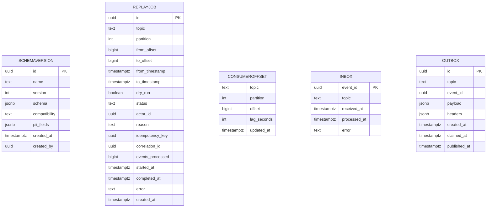

# Analytics Service — Entity-Relationship Diagram

## 1. Database

- Engine: PostgreSQL 18
- Schema: `analytics` (control plane only; no domain data)
- Migrations: `services/analytics-service/migrations/`

## 2. Cross-Service References

| Column | Type | Refers to | Source of truth |
|--------|------|-----------|------------------|
| `replay_job.topic` | TEXT | Kafka topic | n/a |
| `replay_job.partition` | INT | Kafka partition | n/a |

No DB FKs (no domain data).

## 3. Entities

### `SchemaVersion`

A version of an event schema, synced from the schema registry.

#### Columns

| Column | Type | Constraints | Notes |
|--------|------|-------------|-------|
| `id` | UUID | PK | UUIDv7 |
| `name` | TEXT | NOT NULL | e.g. `trip.completed.v1` |
| `version` | INT | NOT NULL | monotonic per name |
| `schema` | JSONB | NOT NULL | the schema definition |
| `compatibility` | TEXT | NOT NULL | `forward` / `backward` / `full` |
| `pii_fields` | JSONB | NOT NULL DEFAULT '[]' | list of PII field paths |
| `created_at` | TIMESTAMPTZ | NOT NULL DEFAULT now() | |
| `created_by` | UUID | NULL | admin who registered |

#### Indexes

- PK on `id`
- UNIQUE on `(name, version)`
- Index on `name`

#### Constraints

- CHECK: `compatibility IN ('forward','backward','full')`

### `ReplayJob`

A replay (backfill) job.

#### Columns

| Column | Type | Constraints | Notes |
|--------|------|-------------|-------|
| `id` | UUID | PK | UUIDv7 |
| `topic` | TEXT | NOT NULL | |
| `partition` | INT | NULL | null = all partitions |
| `from_offset` | BIGINT | NOT NULL | |
| `to_offset` | BIGINT | NULL | null = latest |
| `from_timestamp` | TIMESTAMPTZ | NULL | |
| `to_timestamp` | TIMESTAMPTZ | NULL | |
| `dry_run` | BOOLEAN | NOT NULL DEFAULT false | |
| `status` | TEXT | NOT NULL | `pending` / `running` / `succeeded` / `failed` |
| `actor_id` | UUID | NOT NULL | |
| `reason` | TEXT | NOT NULL | |
| `idempotency_key` | UUID | NULL | |
| `correlation_id` | UUID | NOT NULL | |
| `events_processed` | BIGINT | NULL | |
| `started_at` | TIMESTAMPTZ | NULL | |
| `completed_at` | TIMESTAMPTZ | NULL | |
| `error` | TEXT | NULL | |
| `created_at` | TIMESTAMPTZ | NOT NULL DEFAULT now() | partition key |

#### Indexes

- PK on `id`
- UNIQUE on `(topic, idempotency_key) WHERE idempotency_key IS NOT NULL`
- Index on `(status, created_at DESC)`

#### Constraints

- CHECK: `status IN ('pending','running','succeeded','failed')`
- CHECK: `(from_offset IS NULL) <> (from_timestamp IS NULL)` — at
  most one of the two is set.

### `ConsumerOffset`

The last committed offset per topic / partition.

#### Columns

| Column | Type | Constraints | Notes |
|--------|------|-------------|-------|
| `topic` | TEXT | NOT NULL | |
| `partition` | INT | NOT NULL | |
| `offset` | BIGINT | NOT NULL | |
| `lag_seconds` | INT | NULL | |
| `updated_at` | TIMESTAMPTZ | NOT NULL DEFAULT now() | |

#### Indexes

- PK on `(topic, partition)`

### `Inbox`

Same shape.

### `Outbox`

Same shape.

## 4. Mermaid ER Diagram



## 5. DDL Sketch

```sql
CREATE SCHEMA IF NOT EXISTS analytics;

CREATE TABLE analytics.schema_versions (
    id UUID PRIMARY KEY,
    name TEXT NOT NULL,
    version INT NOT NULL,
    schema JSONB NOT NULL,
    compatibility TEXT NOT NULL
        CHECK (compatibility IN ('forward','backward','full')),
    pii_fields JSONB NOT NULL DEFAULT '[]',
    created_at TIMESTAMPTZ NOT NULL DEFAULT now(),
    created_by UUID,
    UNIQUE (name, version)
);

CREATE INDEX idx_schema_versions_name
    ON analytics.schema_versions (name);

CREATE TABLE analytics.replay_jobs (
    id UUID NOT NULL,
    topic TEXT NOT NULL,
    partition INT,
    from_offset BIGINT,
    to_offset BIGINT,
    from_timestamp TIMESTAMPTZ,
    to_timestamp TIMESTAMPTZ,
    dry_run BOOLEAN NOT NULL DEFAULT false,
    status TEXT NOT NULL
        CHECK (status IN ('pending','running','succeeded','failed')),
    actor_id UUID NOT NULL,
    reason TEXT NOT NULL,
    idempotency_key UUID,
    correlation_id UUID NOT NULL,
    events_processed BIGINT,
    started_at TIMESTAMPTZ,
    completed_at TIMESTAMPTZ,
    error TEXT,
    created_at TIMESTAMPTZ NOT NULL DEFAULT now(),
    CHECK ((from_offset IS NULL) <> (from_timestamp IS NULL)),
    PRIMARY KEY (id, created_at)
) PARTITION BY RANGE (created_at);

CREATE TABLE IF NOT EXISTS analytics.replay_jobs_2026_07
    PARTITION OF analytics.replay_jobs
    FOR VALUES FROM ('2026-07-01 00:00:00+00') TO ('2026-08-01 00:00:00+00');

-- Verify IF NOT EXISTS did not hide a wrong parent or range.
DO $$
DECLARE
    v_parent   REGCLASS := 'analytics.replay_jobs'::REGCLASS;
    v_child    REGCLASS := 'analytics.replay_jobs_2026_07'::REGCLASS;
    v_expected TSTZRANGE := tstzrange('2026-07-01 00:00:00+00',
                                      '2026-08-01 00:00:00+00',
                                      '[)');
BEGIN
    IF (SELECT inhparent FROM pg_inherits WHERE inhrelid = v_child)
       IS DISTINCT FROM v_parent THEN
        RAISE EXCEPTION 'partition % is not attached to %',
            v_child::text, v_parent::text;
    END IF;
    IF NOT (SELECT relpartbound FROM pg_class WHERE oid = v_child)
              = v_expected THEN
        RAISE EXCEPTION 'partition % has unexpected bounds', v_child::text;
    END IF;
END $$;

CREATE UNIQUE INDEX idx_replay_idem
    ON analytics.replay_jobs (topic, idempotency_key)
    WHERE idempotency_key IS NOT NULL;
CREATE INDEX idx_replay_status
    ON analytics.replay_jobs (status, created_at DESC);

CREATE TABLE analytics.consumer_offsets (
    topic TEXT NOT NULL,
    partition INT NOT NULL,
    offset BIGINT NOT NULL,
    lag_seconds INT,
    updated_at TIMESTAMPTZ NOT NULL DEFAULT now(),
    PRIMARY KEY (topic, partition)
);

CREATE TABLE analytics.inbox (
    event_id UUID PRIMARY KEY,
    topic TEXT NOT NULL,
    received_at TIMESTAMPTZ NOT NULL DEFAULT now(),
    processed_at TIMESTAMPTZ,
    error TEXT
);

CREATE TABLE analytics.outbox (
    id UUID PRIMARY KEY,
    topic TEXT NOT NULL,
    event_id UUID NOT NULL,
    payload JSONB NOT NULL,
    headers JSONB,
    created_at TIMESTAMPTZ NOT NULL DEFAULT now(),
    claimed_at TIMESTAMPTZ,
    published_at TIMESTAMPTZ
);
```

## 6. Audit Columns

Schemas have `created_at`, `created_by`. Replay jobs have
`created_at`, `started_at`, `completed_at`, `actor_id`.

## 7. Soft Delete

n/a.

## 8. JSONB Usage

| Table.Column | What is stored | Justification |
|--------------|----------------|---------------|
| `schema_versions.schema` | the schema definition | flexible |
| `schema_versions.pii_fields` | list of PII field paths | flexible |
| `outbox.payload` | event payload | per topic |

## 9. Partitioning

- `replay_jobs` partitioned by month.


See [`DATABASE_ARCHITECTURE.md` §"Table Partitioning — Canonical Template"](../../architecture/DATABASE_ARCHITECTURE.md) for the idempotent `CREATE TABLE IF NOT EXISTS … PARTITION OF …` pattern, naming convention, and the service-owned maintenance-job contract (advisory lock, verification, retention/mixed-retention handling).

## 10. Data Retention

| Table | Retention | Purged by |
|-------|-----------|-----------|
| `schema_versions` | indefinitely | n/a |
| `replay_jobs` | 1 year | monthly purge |
| `consumer_offsets` | until next commit | overwritten |
| `inbox` | 7 days | daily purge |
| `outbox` | 24 hours after `published_at` | hourly purge |

## 11. Migration Considerations

- The control plane is small; new entities are added incrementally.
- A schema change is registered via the schema registry, not via a
  DB migration; the DB row is a cache.
- The `replay_jobs` table is partitioned; new partitions are
  created monthly by the migration runner.

---

## See also

### Sibling docs for this service

- [`README.md`](./README.md) — purpose, bounded context, responsibilities
- [`BRD.md`](./BRD.md) — business requirements
- [`SRS.md`](./SRS.md) — functional + non-functional requirements
- [`ERD.md`](./ERD.md) — data model (entities, relationships)
- [`INTEGRATION.md`](./INTEGRATION.md) — inter-service contracts (APIs, events, sagas)
- [`WORKFLOWS.md`](./WORKFLOWS.md) — operational workflows (happy paths, failure modes)
- [`TECH.md`](./TECH.md) — technology profile (runtime, libraries, data layer, admin endpoints, RBAC)

### Platform-wide

- [`../../shared/README.md`](../../shared/README.md) — `platform-spring-boot-starter` shared library (the single source of cross-cutting code for all Spring Boot services in the platform)
- [`../RECOMMENDATIONS.md`](../RECOMMENDATIONS.md) — platform-wide technology map (language, framework, version baseline, admin/RBAC pattern)
- [`../../README.md`](../../README.md) — services overview (the catalog of all 58 services)
- [`../../../main.md`](../../../main.md) — top-level platform specification (architecture, Keycloak, PostgreSQL 18, messaging, observability baseline)

