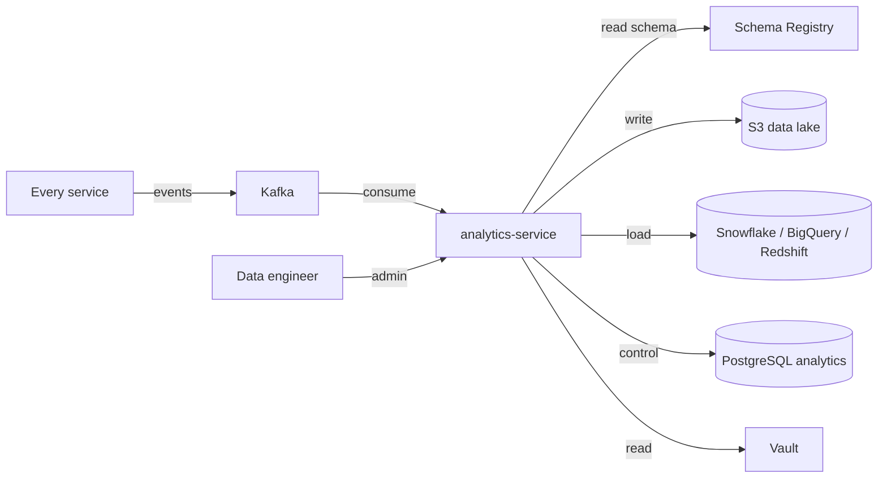
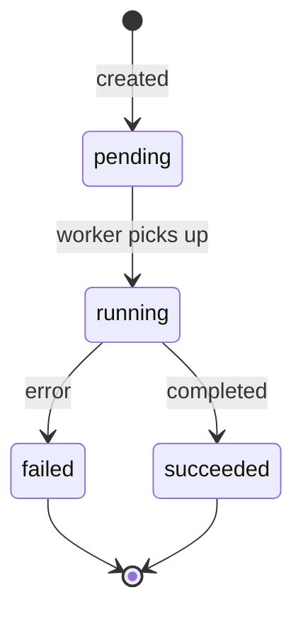

# Analytics Service — Software Requirements Specification

## 1. Introduction

This SRS specifies the behavior, performance, and operational
requirements of `analytics-service`. It inherits the platform-wide
standards in `docs/architecture/API_STANDARDS.md`,
`docs/architecture/EVENT_ARCHITECTURE.md`, and
`docs/architecture/SECURITY_ARCHITECTURE.md`.

## 2. Scope

In scope:

- Kafka consumer for every event.
- Schema registry integration.
- Schema evolution.
- PII handling.
- Data lake landing.
- OLAP warehouse load.
- Replay.

Out of scope:

- The OLAP warehouse itself.
- Operational dashboards.
- The audit log.

## 3. System Context

## 4. Actors

- Data / BI team — human.
- Data engineer — human.
- Security on-call — human.
- Every service (event) — system.

## 5. Functional Requirements

| ID | Requirement | Priority |
|----|-------------|----------|
| FR--001 | The service MUST consume every domain event. | MUST |
| FR--002 | The service MUST apply schema evolution rules. | MUST |
| FR--003 | The service MUST handle PII consistently. | MUST |
| FR--004 | The service MUST land in the data lake within 5 minutes. | MUST |
| FR--005 | The service MUST load to the OLAP warehouse within 1 hour. | MUST |
| FR--006 | The service MUST support replay (backfill). | MUST |
| FR--007 | The service MUST track consumer lag. | MUST |
| FR--008 | The service MUST integrate with the schema registry. | MUST |
| FR--009 | The service MUST support per-tenant PII handling. | MUST |
| FR--010 | The service MUST support a "dry-run" mode for replays. | SHOULD |
| FR--011 | The service MUST support a "schema compatibility check" endpoint. | MUST |
| FR--012 | The service MUST route poison events to DLQ. | MUST |
| FR--013 | The service MUST support a "rebuild" command for a topic. | MUST |
| FR--014 | The service MUST support per-tenant redaction of PII. | MUST |
| FR--015 | The service MUST support a "consumer offset" view. | MUST |
| FR--016 | The service MUST support a "lag" view per topic. | MUST |
| FR--017 | The service MUST support an "alert" on lag > 5 min. | MUST |
| FR--018 | The service MUST support a "throughput" metric. | MUST |
| FR--019 | The service MUST support a "schema" listing endpoint. | MUST |
| FR--020 | The service MUST support a "schema versions" endpoint. | MUST |

## 6. Non-Functional Requirements

| ID | Category | Requirement | Target |
|----|----------|-------------|--------|
| NFR--001 | performance | consumer throughput | 50k events/s |
| NFR--002 | performance | P99 end-to-end lag | < 5min |
| NFR--003 | availability | uptime | 99.5% over 30d |
| NFR--004 | scalability | horizontal scaling | HPA on consumer lag |
| NFR--005 | durability | zero data loss on regional outage | RPO 5m, RTO 30m |
| NFR--006 | observability | 100% requests have trace and log | enforced in CI |
| NFR--007 | freshness | median lag | < 1min |
| NFR--008 | idempotency | idempotent landing | enforced in code |

## 7. API Requirements

- Versioned URIs.
- Bearer JWT.
- `Idempotency-Key` for replays.
- Errors in the standard envelope.
- OpenAPI 3.1 at `/openapi.json`.

## 8. Data Requirements

| ID | Requirement | Notes |
|----|-------------|-------|
| DATA--001 | Control plane only; no domain data in the DB. | |
| DATA--002 | Replay jobs partitioned by month. | Retention. |
| DATA--003 | Time is RFC3339 UTC. | |
| DATA--004 | Cross-service references are UUID columns without DB FKs. | Rule |

## 9. Validation Rules

- A schema change MUST be forward-compatible (new field with
  default).
- A schema change MUST be backward-compatible (no removed fields
  without deprecation).
- A PII field MUST be declared in the schema.

## 10. State Transitions

## 11. Authorization Requirements

- `analytics.read` for read endpoints.
- `analytics.admin` for replay and schema management.

## 12. Configuration Requirements

- `PII_HASH_SALT` (env; KMS-wrapped).
- `OLAP_KIND` (env; `snowflake` / `bigquery` / `redshift`).
- `LAG_ALERT_SECONDS` (env; default 300).

## 13. Error Handling

| Error | Response |
|-------|----------|
| Schema incompatible | 422 `SCHEMA_INCOMPATIBLE` |
| Replay in progress | 409 `REPLAY_IN_PROGRESS` |
| Lag exceeded | 503 `LAG_EXCEEDED` |
| Lake write failure | retry with backoff; alert |

## 14. Concurrency Requirements

- A replay is serialized at the row level on `(topic, partition,
  range)`.

## 15. Idempotency Requirements

- The consumer uses an offset (no duplicates in normal operation).
- `POST /v1/replays` requires `Idempotency-Key`.

## 16. Performance

- Dominant path: event consumption + landing.
- P50/P95/P99 lag: 1s / 30s / 5min.

## 17. Scalability

- Horizontal scaling: HPA on consumer lag.
- Vertical scaling: 2 vCPU / 4 GiB production.

## 18. Availability

- SLO: 99.5% over 30 days.
- Error budget: ~3h 36m per 30 days.
- Maintenance window: Sundays 04:00–06:00 UTC.

## 19. Security

| ID | Requirement | Notes |
|----|-------------|-------|
| SEC--001 | All requests JWT-validated. | Standard |
| SEC--002 | PII tokenized before landing. | HMAC-SHA256. |
| SEC--003 | Salt in Vault; rotated quarterly. | |
| SEC--004 | Read access logged. | |
| SEC--005 | DB user has rights only on the `analytics` schema. | Least privilege. |
| SEC--006 | Schema change requires `analytics.admin`. | |

## 20. Privacy

- PII stored: tokenized form in the lake; raw PII is NOT stored.
- Retention: 2 years for the lake.
- Erasure: per-service; the lake is recomputable.

## 21. Auditability

- Every replay is logged with `actor_id` and `reason`.
- Every schema change is logged.

## 22. Observability

- Logs: JSON to stdout; standard fields.
- Metrics:
  - `http_requests_total{route, method, status}` (RED)
  - `http_request_duration_seconds{route, method, status}` (RED)
  - `analytics_consumer_lag{topic, partition}`
  - `analytics_datalake_writes_total{topic}`
  - `analytics_olap_loads_total{table}`
  - `analytics_throughput{topic}`
- Traces: OpenTelemetry.
- Alerts:
  - Lag > 5 min.
  - Lake write failure.
  - OLAP load failure.

## 23. Maintainability

- Code style: Python (PEP 8).
- Test coverage: ≥ 85%.
- Documentation: this folder; OpenAPI 3.1 at `/openapi.json`.

## 24. Disaster Recovery

- RPO: 5 minutes (consumer lag).
- RTO: 30 minutes.
- The lake is the source of truth; the OLAP warehouse is
  recomputable.

## 25. Acceptance Criteria

- 99.5% consumer availability for 30 days in production.
- Lag < 5 min in steady state.
- 100% of PII is tokenized before landing.
- A schema change is validated before deployment.
- A replay backfills the lake and OLAP correctly.

---

## See also

### Sibling docs for this service

- [`README.md`](./README.md) — purpose, bounded context, responsibilities
- [`BRD.md`](./BRD.md) — business requirements
- [`SRS.md`](./SRS.md) — functional + non-functional requirements
- [`ERD.md`](./ERD.md) — data model (entities, relationships)
- [`INTEGRATION.md`](./INTEGRATION.md) — inter-service contracts (APIs, events, sagas)
- [`WORKFLOWS.md`](./WORKFLOWS.md) — operational workflows (happy paths, failure modes)
- [`TECH.md`](./TECH.md) — technology profile (runtime, libraries, data layer, admin endpoints, RBAC)

### Platform-wide

- [`../../shared/README.md`](../../shared/README.md) — `platform-spring-boot-starter` shared library (the single source of cross-cutting code for all Spring Boot services in the platform)
- [`../RECOMMENDATIONS.md`](../RECOMMENDATIONS.md) — platform-wide technology map (language, framework, version baseline, admin/RBAC pattern)
- [`../../README.md`](../../README.md) — services overview (the catalog of all 58 services)
- [`../../../main.md`](../../../main.md) — top-level platform specification (architecture, Keycloak, PostgreSQL 18, messaging, observability baseline)

