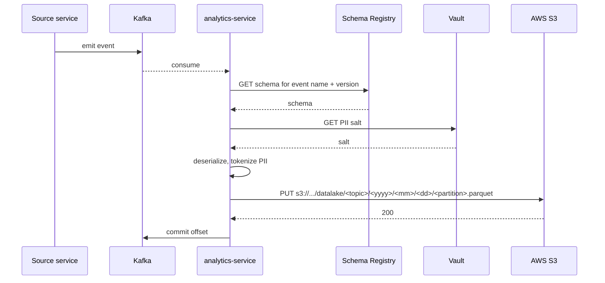
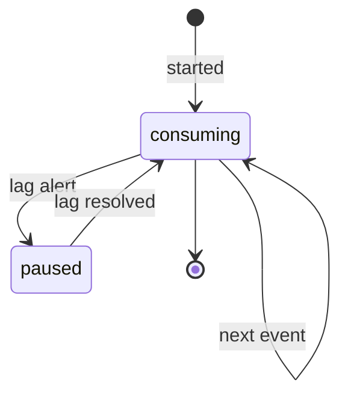
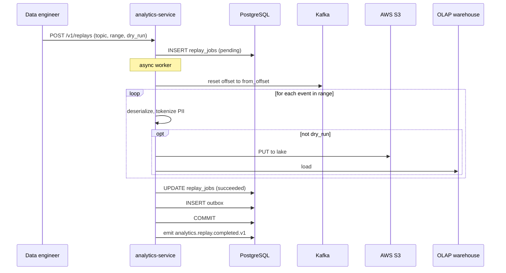
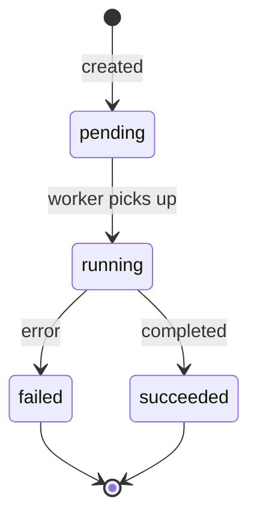
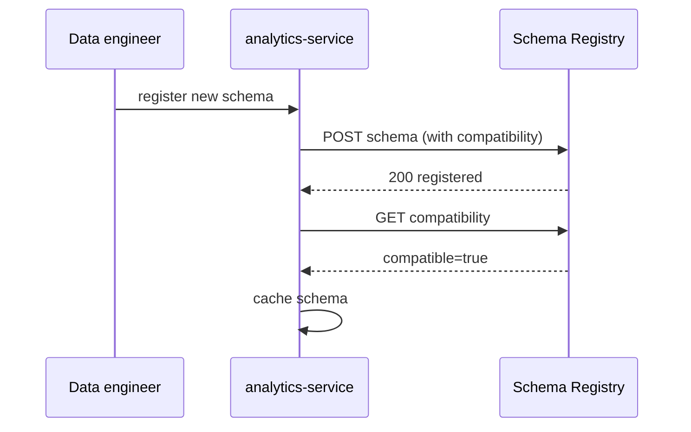
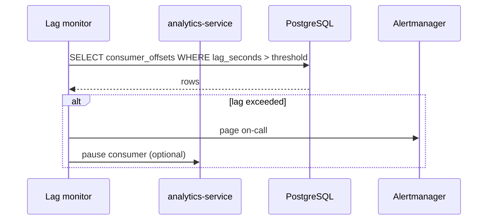

# Analytics Service — Workflows

## 1. Consume an Event and Land in the Lake

### 1.1 Objective

Consume a domain event, apply schema evolution, tokenize PII, and
land the row in the data lake within 5 minutes of production.

### 1.2 Initiating Actor

Source service (system) via Kafka.

### 1.3 Participating Services

- Source service (producer)
- Kafka
- `analytics-service` (this service)
- Schema registry
- AWS S3 (data lake)
- Vault (PII salt)

### 1.4 Prerequisites

- The schema for the event is registered.
- The PII fields are declared in the schema.

### 1.5 Happy Path



State machine for a consumer:



### 1.6 Alternate Paths

- **Schema not registered**: DLQ; alert.
- **PII salt unavailable**: pause; alert.
- **Lake write failure**: retry with backoff; DLQ after 3 attempts.

### 1.7 Failure Paths

| Failure | Handling |
|---------|----------|
| Schema not registered | DLQ; alert |
| PII salt unavailable | pause; alert |
| Lake write failure | retry; DLQ after 3 attempts |
| Deserialize failure | DLQ |

### 1.8 Business Rules

- PII is tokenized (HMAC-SHA256) before landing.
- The lake is partitioned by date.
- The schema is fetched from the registry; a local cache is updated
  on schema change.

### 1.9 State Transitions

The consumer moves through `consuming` → `paused` (on lag) →
`consuming` (on lag resolved).

### 1.10 Events

n/a (consumer only).

### 1.11 APIs Involved

n/a.

### 1.12 Compensation / Rollback

A failed landing is retried; on permanent failure, the event is
DLQ'd.

### 1.13 Final State

The event is in the data lake with PII tokenized; the offset is
committed.

## 2. Replay (Backfill)

### 2.1 Objective

Backfill the data lake and OLAP warehouse for a topic / partition
range, idempotently.

### 2.2 Initiating Actor

Data engineer (admin).

### 2.3 Participating Services

- `analytics-service`
- Kafka
- Schema registry
- AWS S3
- OLAP warehouse

### 2.4 Prerequisites

- The data engineer holds `analytics.admin`.
- The data engineer provides `X-Audit-Reason`.

### 2.5 Happy Path



State machine for a `ReplayJob`:



### 2.6 Alternate Paths

- **Dry run**: the worker iterates but does NOT write to the lake
  or OLAP.
- **Idempotent replay**: same key + same body returns the prior
  job.

### 2.7 Failure Paths

| Failure | Handling |
|---------|----------|
| Source service unavailable | retry; alert |
| Lake write failure | retry; alert |
| OLAP load failure | retry; alert |

### 2.8 Business Rules

- A replay is idempotent (the same offset produces the same row).
- A dry run is a no-op on the lake / OLAP.

### 2.9 State Transitions

See state machine in §2.5.

### 2.10 Events

| Event | Direction | When |
|-------|-----------|------|
| `analytics.replay.completed.v1` | produced | replay success |

### 2.11 APIs Involved

| API | Direction | When |
|-----|-----------|------|
| `POST /v1/replays` | inbound | start |
| `GET /v1/replays/{id}` | inbound | status |

### 2.12 Compensation / Rollback

A failed replay can be retried (a new job).

### 2.13 Final State

The lake and OLAP are backfilled; the job is `succeeded`; the
event is emitted.

## 3. Schema Evolution

### 3.1 Objective

Register a new schema version with compatibility check.

### 3.2 Initiating Actor

Data engineer (admin) or producer service (CI).

### 3.3 Participating Services

- `analytics-service`
- Schema registry

### 3.4 Prerequisites

- The new schema is forward-compatible (new fields with defaults)
  or backward-compatible (no removed fields).
- The PII fields are declared.

### 3.5 Happy Path



### 3.6 Alternate Paths

- **Incompatible schema**: 422 `SCHEMA_INCOMPATIBLE`; the schema is
  NOT registered.

### 3.7 Failure Paths

| Failure | Handling |
|---------|----------|
| Incompatible | 422 |
| Registry unavailable | 503 `CIRCUIT_OPEN` |

### 3.8 Business Rules

- A schema change is forward-compatible if a new field has a
  default.
- A schema change is backward-compatible if a removed field is
  unused.

### 3.9 State Transitions

n/a.

### 3.10 Events

n/a (the schema change is registered in the schema registry).

### 3.11 APIs Involved

| API | Direction | When |
|-----|-----------|------|
| `POST /v1/schemas` | inbound | register |

### 3.12 Compensation / Rollback

An incompatible schema is rejected; no compensation.

### 3.13 Final State

The schema is registered; the cache is updated; the next event is
deserialized with the new schema.

## 4. Lag Alert

### 4.1 Objective

Alert when consumer lag exceeds the threshold.

### 4.2 Initiating Actor

The lag monitor (system).

### 4.3 Participating Services

- `analytics-service`
- Alerting system (Prometheus + Alertmanager)

### 4.4 Prerequisites

- The lag threshold is configured.

### 4.5 Happy Path



### 4.6 Alternate Paths

- **Lag resolved**: the alert auto-resolves.

### 4.7 Failure Paths

| Failure | Handling |
|---------|----------|
| Alert delivery failure | retry |

### 4.8 Business Rules

- A lag > 5 min triggers a warning.
- A lag > 15 min triggers a critical alert.

### 4.9 State Transitions

The consumer moves from `consuming` → `paused` (on critical lag) →
`consuming` (on lag resolved).

### 4.10 Events

n/a (the alert is a metric).

### 4.11 APIs Involved

| API | Direction | When |
|-----|-----------|------|
| `GET /v1/consumer/lag` | inbound | lag view |

### 4.12 Compensation / Rollback

n/a.

### 4.13 Final State

The on-call is paged; the consumer is paused (optional); the alert
auto-resolves when the lag drops.

---

## 99. `Monthly Partition Maintenance`

### 99.1 Objective

Idempotently pre-create the next 12 months for partitioned tables in `analytics`. The drop half is handled by the per-service retention job.

### 99.2 Initiating Actor

A scheduled job runs daily at `02:00 UTC`. Leader-elected via `pg_try_advisory_xact_lock(hashtext('analytics.partition'), hashtext('monthly'))`.

### 99.3 Happy Path

```mermaid
sequenceDiagram
    participant JOB as Partition job
    participant PG as PostgreSQL
    JOB->>PG: pg_try_advisory_xact_lock('analytics.monthly')
    alt lock acquired
        loop for each missing month in next 12
            JOB->>PG: CREATE TABLE IF NOT EXISTS analytics.<table>_YYYY_MM PARTITION OF analytics.<table>
            JOB->>PG: verify (pg_inherits, relpartbound)
        end
        JOB->>PG: assert now() in existing child
    else lock NOT acquired
        Note over JOB: another instance is running; exit cleanly
    end
```

### 99.4 Failure Paths

| Failure | Handling |
|---------|----------|
| Lock contention | exit 0 |
| DDL fails | retry 3× with backoff (1 s / 4 s / 16 s); page on-call |
| Today's child missing | critical alert; INSERTs would fail |

### 99.5 Business Rules

- Pre-create next 12 complete future months.
- Every child is created with `CREATE TABLE IF NOT EXISTS … PARTITION OF …` so the job is safe to run twice in the same window.
- A verification step (`pg_inherits` parent + `relpartbound` range) runs after every `CREATE TABLE IF NOT EXISTS` because `IF NOT EXISTS` only guards the name, not the bounds.
- Optionally emit `audit.partition.maintained.v1` on success.

---

## See also

### Sibling docs for this service

- [`README.md`](./README.md) — purpose, bounded context, responsibilities
- [`BRD.md`](./BRD.md) — business requirements
- [`SRS.md`](./SRS.md) — functional + non-functional requirements
- [`ERD.md`](./ERD.md) — data model (entities, relationships)
- [`INTEGRATION.md`](./INTEGRATION.md) — inter-service contracts (APIs, events, sagas)
- [`WORKFLOWS.md`](./WORKFLOWS.md) — operational workflows (happy paths, failure modes)
- [`TECH.md`](./TECH.md) — technology profile (runtime, libraries, data layer, admin endpoints, RBAC)

### Platform-wide

- [`../../shared/README.md`](../../shared/README.md) — `platform-spring-boot-starter` shared library (the single source of cross-cutting code for all Spring Boot services in the platform)
- [`../RECOMMENDATIONS.md`](../RECOMMENDATIONS.md) — platform-wide technology map (language, framework, version baseline, admin/RBAC pattern)
- [`../../README.md`](../../README.md) — services overview (the catalog of all 58 services)
- [`../../../main.md`](../../../main.md) — top-level platform specification (architecture, Keycloak, PostgreSQL 18, messaging, observability baseline)

