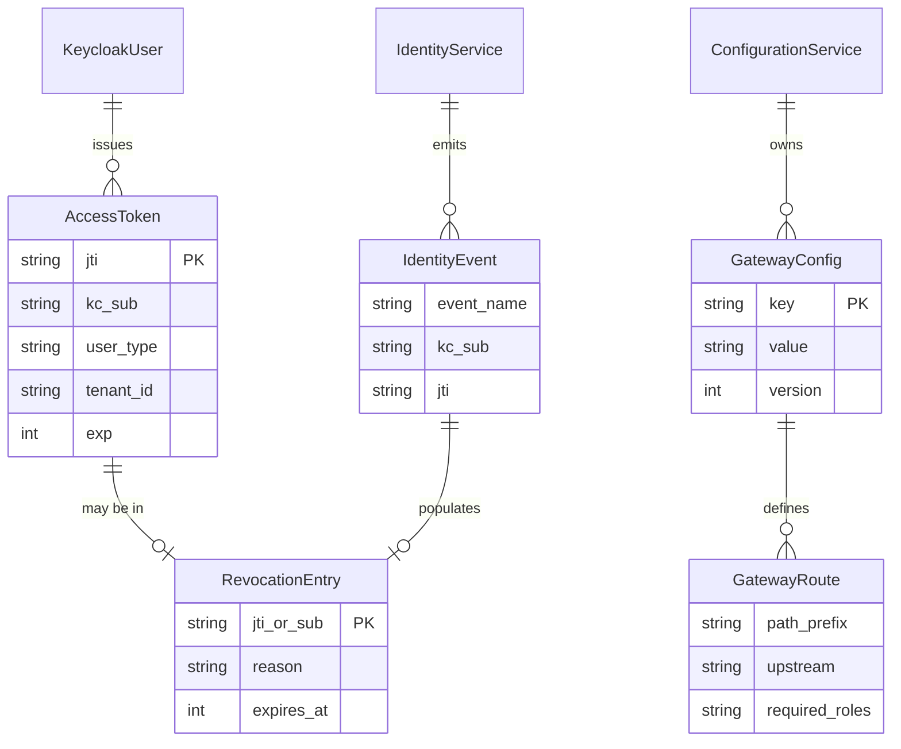

# api-gateway — Entity-Relationship Diagram

## 1. Database

- **Engine**: not applicable.
- **Schema**: **none**. The `api-gateway` service is stateless. It
  owns no PostgreSQL database, no tables, and no migrations. This
  document exists to make the "no schema" contract explicit and to
  document the cross-service references the gateway holds in
  Redis (and the events it produces and consumes).

## 2. Cross-Service References

The gateway holds no cross-service IDs in a database. It does
hold short-lived references in Redis keyed by opaque tokens
issued by Keycloak. These are NOT cross-service foreign keys; they
are revocation-list entries.

| Reference | Type | Refers to | Source of truth | Lifetime |
|-----------|------|-----------|------------------|----------|
| `jti` (in Redis revoked-jti set) | string (JWT id) | A specific access token issued by Keycloak | Keycloak | ≤ access-token remaining lifetime (TTL on Redis key) |
| `kc_sub` (in Redis suspended-sub set) | string (Keycloak sub) | A Keycloak user | Keycloak | 30 days, refreshed on `identity.user.suspended.v1` |
| `kc_sub` (in Redis disabled-sub set) | string (Keycloak sub) | A Keycloak user | Keycloak | 30 days, refreshed on `identity.user.disabled.v1` |
| JWKS cache | Redis string | Keycloak JWKS document | Keycloak | aligned to `gateway.jwt.jwks_refresh_seconds` (default 300 s) |
| Rate-limit counters | Redis string (`gateway:rl:<route>:<key>:<window>`) | n/a (counter) | local | window length (e.g. 60 s) |

No database foreign keys are created to or from these
references; they are application-level lookups in a shared
Redis cluster. The platform's data ownership rules still hold:
Keycloak is the only writer of the canonical user identity, and
the gateway never persists a copy.


## 1.5. Stateless Architecture Note

The `api-gateway` is **stateless** by design — it owns
no PostgreSQL database and no service-owned schema.
There are therefore no `CREATE TABLE` statements in
this document. The gateway's only persistent state is
held in shared infrastructure:

- **Redis** (shared cluster): the JWT revocation
  set (`gateway:revoked:jti:*`, `gateway:revoked:sub:*`),
  the rate-limit counters (`gateway:rl:*`), the
  JWKS cache (`gateway:jwks:*`). All keys are
  prefixed with `gateway:` to maintain the
  platform's namespace isolation.
- **Kafka** (shared cluster): the gateway is a
  consumer of `identity.*.v1` and
  `configuration.updated.v1`, and a producer of
  `audit.api.request.v1`,
  `gateway.config.reloaded.v1`,
  `gateway.rate_limit.exceeded.v1`, and
  `gateway.circuit_breaker.opened.v1`. No gateway
  schema is created in Kafka; the topics are owned
  by the platform.

The conceptual diagram in 4 (`Mermaid ER Diagram`)
shows the gateway's *references* to upstream services
(their entities), not tables owned by the gateway.
The "DDL Sketch" in 5 shows the Redis keyspace
layout, not relational DDL.

If a future change adds persistent state to the
gateway, it MUST be done in a separate service
(rather than adding a schema to the gateway), to
preserve the platform's "edge is stateless" rule.

## 3. Entities

The gateway has **no service-owned entities**. For completeness,
the conceptual entities the gateway reads (but does not own) are
listed below. They are owned by other services.

### `KeycloakUser` (not owned; reference only)

- Owner: Keycloak (and the `identity-service` adapter).
- The gateway reads `sub`, `user_type`, `roles`, `scopes`,
  `tenant_id`, `email_verified`, `phone_verified` from the JWT
  claims; it never queries Keycloak directly for user attributes
  at request time.

### `Configuration` (not owned; reference only)

- Owner: `configuration-service`.
- The gateway reads `gateway.*` keys from
  `configuration-service` and consumes `configuration.updated.v1`
  to hot-reload.

### `Identity` (not owned; reference only)

- Owner: `identity-service`.
- The gateway consumes `identity.*.v1` events to maintain its
  revocation and suspension sets. It does not call
  `identity-service`'s read API on the request path.

## 4. Mermaid ER Diagram

The gateway owns no entities, so the standard `erDiagram` is
replaced with a diagram of the gateway's *concepts* and the
upstream sources it references.



(`KeycloakUser`, `AccessToken`, `IdentityService`, `IdentityEvent`,
`ConfigurationService`, `GatewayConfig` are owned by other
services. The gateway reads them; it owns nothing on the left.)

## 5. DDL Sketch

The gateway has **no DDL**. The "DDL" of the gateway is the
Redis keyspace, which is created lazily on first write and
expiry-managed by Redis TTLs.

```text
# Revocation set (per jti; TTL = remaining token lifetime)
SET gateway:revoked:jti:<jti> 1 EX <ttl_seconds>

# Suspended-sub set (TTL 30 days, refreshed on event)
SET gateway:revoked:sub:<kc_sub> "suspended" EX 2592000

# Disabled-sub set (TTL 30 days, refreshed on event)
SET gateway:revoked:sub:<kc_sub> "disabled" EX 2592000

# JWKS cache (TTL = jwks_refresh_seconds)
SET gateway:jwks:<realm> <jwks_json> EX 300

# Rate-limit counter (TTL = window length)
INCR gateway:rl:<route_id>:<principal>:<window_floor>
EXPIRE gateway:rl:<route_id>:<principal>:<window_floor> <window_seconds>
```

The platform's Redis operators manage the cluster; no
schema-migration tooling touches the gateway.

## 6. Audit Columns

Not applicable (no tables).

## 7. Soft Delete

Not applicable.

## 8. JSONB Usage

Not applicable.

## 9. Partitioning

Not applicable.

## 10. Data Retention

| Data | Retention | Purged by |
|------|-----------|-----------|
| `gateway:revoked:jti:*` | ≤ access-token remaining lifetime | Redis TTL |
| `gateway:revoked:sub:*` (suspended) | 30 days, refreshed on event | Redis TTL; refreshed by event |
| `gateway:revoked:sub:*` (disabled) | 30 days, refreshed on event | Redis TTL; refreshed by event |
| `gateway:jwks:*` | aligned to JWKS refresh interval (default 300 s) | Redis TTL |
| `gateway:rl:*` | aligned to rate-limit window | Redis TTL |
| `audit.api.request.v1` events on Kafka | 7 years (financial-relevant) | Kafka retention policy |
| Gateway stdout logs | 30 days hot, 1 year cold | Platform log retention |
| Gateway traces | 14 days | Platform trace retention |

## 11. Migration Considerations

There are no migrations. New configuration is delivered via
`configuration.updated.v1` and hot-reloaded in-process. Schema
changes to downstream services do not affect the gateway
schema-wise; they only affect the aggregated OpenAPI document at
`/openapi.json`, which is regenerated on a CI job that runs on
every downstream service release.

If a future version of the gateway needed persistent state
(for example, a per-tenant rate-limit override store), the
process would be:

1. Add a new service-owned schema in a *new* service (e.g.
   `rate-limit-service`); the gateway would call it.
2. Do not add a schema to the gateway.

The platform's "one service = one schema" rule and the
"stateless edge" rule are preserved.

---

## See also

### Sibling docs for this service

- [`README.md`](./README.md) — purpose, bounded context, responsibilities
- [`BRD.md`](./BRD.md) — business requirements
- [`SRS.md`](./SRS.md) — functional + non-functional requirements
- [`ERD.md`](./ERD.md) — data model (entities, relationships)
- [`INTEGRATION.md`](./INTEGRATION.md) — inter-service contracts (APIs, events, sagas)
- [`WORKFLOWS.md`](./WORKFLOWS.md) — operational workflows (happy paths, failure modes)
- [`TECH.md`](./TECH.md) — technology profile (runtime, libraries, data layer, admin endpoints, RBAC)

### Platform-wide

- [`../../shared/README.md`](../../shared/README.md) — `platform-spring-boot-starter` shared library (the single source of cross-cutting code for all Spring Boot services in the platform)
- [`../RECOMMENDATIONS.md`](../RECOMMENDATIONS.md) — platform-wide technology map (language, framework, version baseline, admin/RBAC pattern)
- [`../../README.md`](../../README.md) — services overview (the catalog of all 20 services)
- [`../../../main.md`](../../../main.md) — top-level platform specification (architecture, Keycloak, PostgreSQL 19, messaging, observability baseline)

## Related docs

- [`../../architecture/DATA_OWNERSHIP.md`](../../architecture/DATA_OWNERSHIP.md) — full source-of-truth matrix
- [`../../architecture/SERVICE_ISOLATION.md`](../../architecture/SERVICE_ISOLATION.md) — how this service handles a downstream outage
- [`../../architecture/DATABASE_ARCHITECTURE.md`](../../architecture/DATABASE_ARCHITECTURE.md) — PostgreSQL-per-service rules
- [`../../architecture/CONSISTENCY_STRATEGY.md`](../../architecture/CONSISTENCY_STRATEGY.md) — strong vs eventual consistency per context

