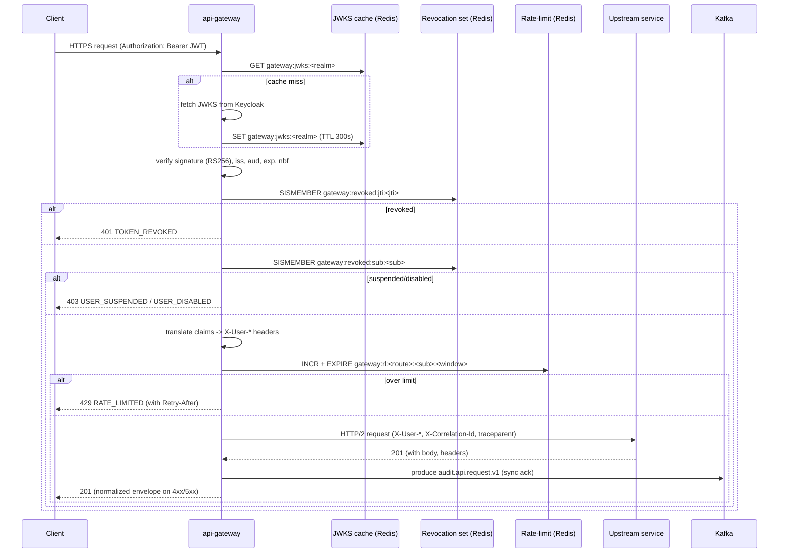
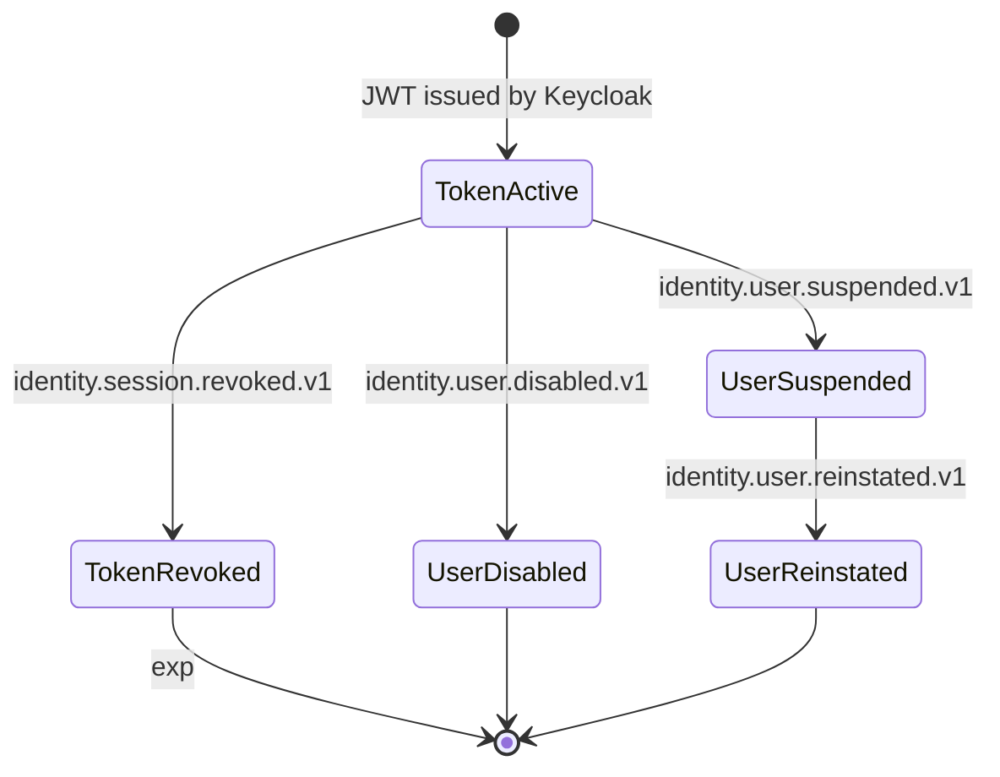
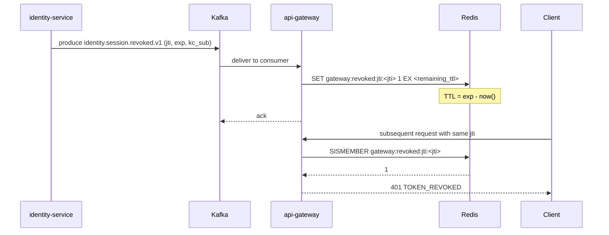
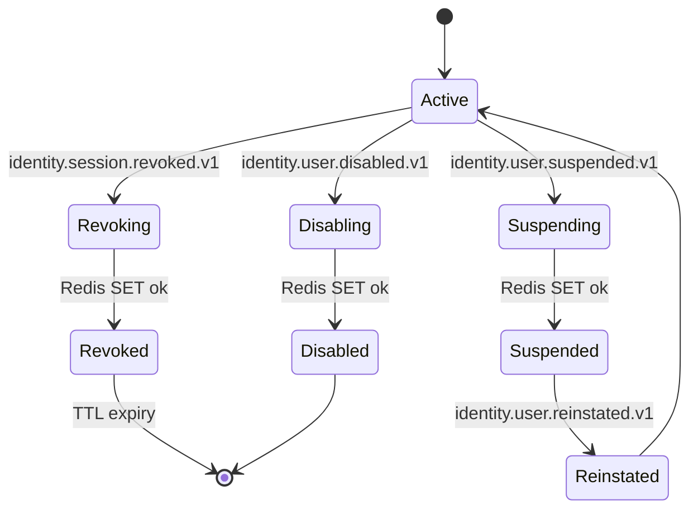
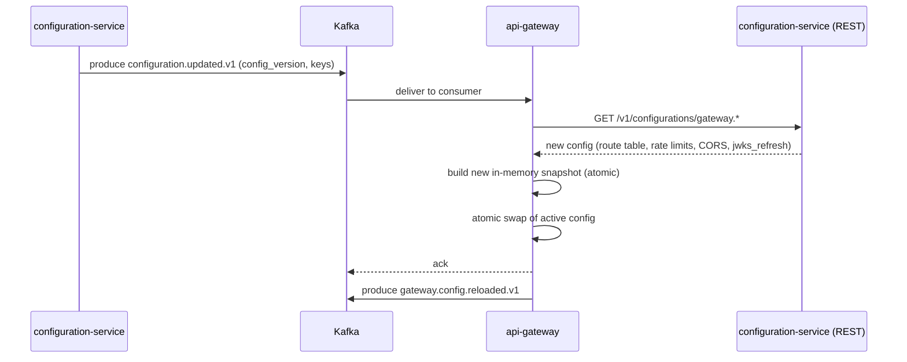
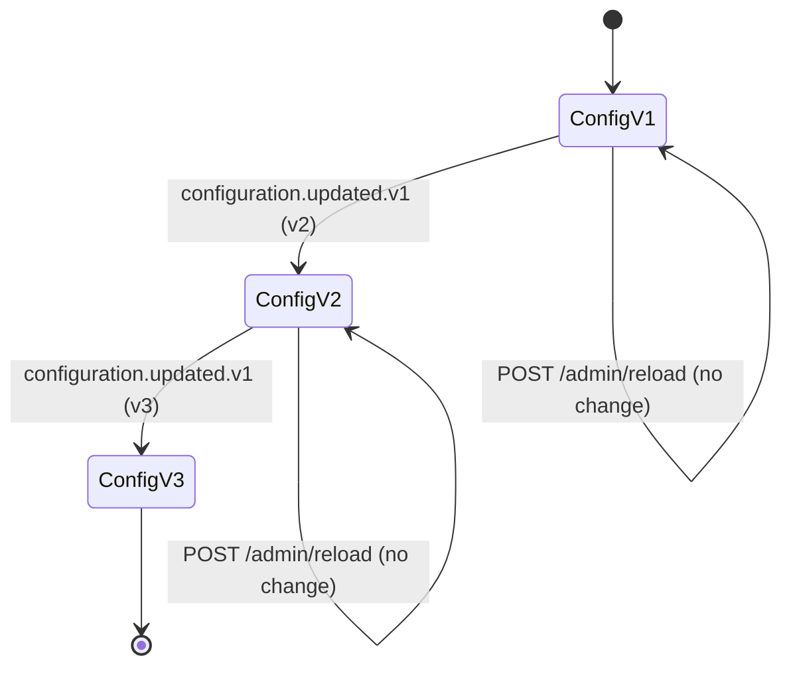
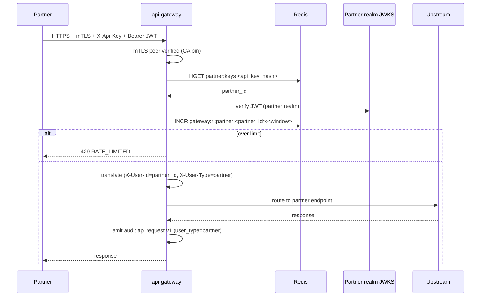
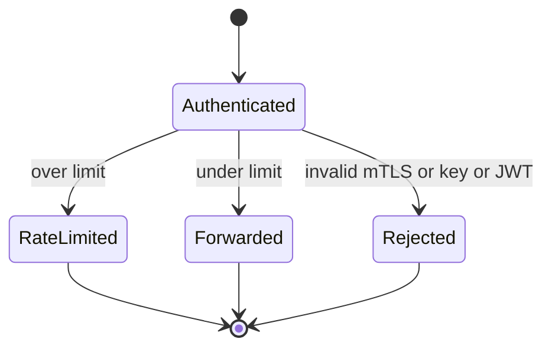

# api-gateway — Workflows

## 1. Authenticated Request Flow (Happy Path)

### 1.1 Objective

Accept an inbound HTTPS request, validate the JWT, translate
claims to headers, apply the rate limit, route to the correct
upstream, emit the audit event, and return the response. The
P99 total edge overhead is ≤ 50 ms.

### 1.2 Initiating Actor

A client (mobile, web, partner, service-to-service) sends a
request to the gateway with `Authorization: Bearer <jwt>`.

### 1.3 Participating Services

- `api-gateway` (this service).
- Keycloak (JWKS provider; offline).
- `identity-service` (introspection, offline; cache-miss path).
- The matched downstream service (e.g. ``trip-service` (ride-request)`).
- Redis (revocation set, rate-limit counters, JWKS cache).
- Kafka (audit topic).
- `audit-service` and ``reporting-service` (data lake)` (consumers of the audit
  topic).

### 1.4 Prerequisites

- The gateway replica is started; the in-process route table
  and rate-limit config are loaded; the JWKS cache is warm.
- Redis is reachable; the revocation set is populated from
  consumed events.
- The downstream service's `/ready` is 200.

### 1.5 Happy Path

### 1.6 Alternate Paths

- **Anonymous public endpoint** (e.g. `GET /v1/restaurants` for
  discovery): no JWT required, but a per-IP rate limit is
  applied; the audit event uses `user_id: "anonymous"` and
  `user_type: "anonymous"`.
- **Partner B2B endpoint**: mTLS terminate, partner API key
  check, partner-realm JWT validation; per-partner rate limit
  tier.
- **Service-to-service**: `client_credentials` JWT; the
  `azp` becomes `X-User-Id`, `X-User-Type: "service"`. The
  audit event records `user_type: "service"`.

### 1.7 Failure Paths

- **JWKS fetch fails** (Keycloak unreachable on cache miss):
  the gateway fails closed with `503 SERVICE_UNAVAILABLE`
  and emits an `error` log with `reason: "jwks_unavailable"`.
  The SLO burn-rate alert fires.
- **Redis unreachable**: the gateway fails closed for the
  revocation set (security) and 503s the request with
  `code: "REVOCATION_UNAVAILABLE"`. Rate-limit is allowed
  to degrade to in-process token bucket for ≤ 5 s.
- **Kafka audit emission fails** (after 3 retries):
  the gateway returns the upstream response to the client
  anyway (the audit is best-effort but still paged) and
  emits a `warn` log; the DLQ accumulates for replay.
- **Upstream 5xx**: translated to
  `502 DEPENDENCY_UPSTREAM_FAILURE` with the standard
  envelope. If the circuit is open, returns
  `503 CIRCUIT_OPEN`.
- **Body too large**: rejected with `413 PAYLOAD_TOO_LARGE`
  before any upstream call.

### 1.8 Business Rules

- Every authenticated request produces exactly one
  `audit.api.request.v1` event.
- A token in the revocation set is rejected regardless of
  signature validity.
- A `sub` in the suspended-sub or disabled-sub set is
  rejected regardless of token validity.
- A rate-limited request is never forwarded upstream.
- An audit emission failure does not block the response to
  the client; the failure is logged and alerted.

### 1.9 State Transitions

The gateway is stateless beyond Redis. The only persistent
state transitions are:

### 1.10 Events

| Event | Direction | When |
|-------|-----------|------|
| `audit.api.request.v1` | produced | on every authenticated request |
| `gateway.config.reloaded.v1` | produced | on successful hot-reload |
| `identity.session.revoked.v1` | consumed | to write `jti` to Redis |
| `identity.user.suspended.v1` | consumed | to write `sub` to Redis |
| `identity.user.disabled.v1` | consumed | to write `sub` to Redis |
| `configuration.updated.v1` | consumed | to hot-reload in-process config |

### 1.11 APIs Involved

| API | Direction | When |
|-----|-----------|------|
| Keycloak JWKS | outbound | on cache miss |
| Redis `SISMEMBER`, `INCR`, `EXPIRE` | outbound | per request |
| Downstream service `/v1/...` | outbound | per request |
| Kafka `audit.api.request` | outbound (publish) | per authenticated request |
| `/v1/...` | inbound | per request |

### 1.12 Compensation / Rollback

The gateway has no state to roll back; an upstream call's
failure is the downstream service's problem. The gateway's
own compensation:

- If the audit publish fails after retries, the request is
  not retried (the client already received the response).
  The failed event lands in `audit.api.request.dlq` for
  replay.
- If a `configuration.updated.v1` reload fails, the
  previous in-memory config is retained; the failed reload
  is logged at `error`.

### 1.13 Final State

- The client has received a response.
- An `audit.api.request.v1` event is on the audit topic
  (or in the DLQ if Kafka was unreachable).
- The Redis revocation set, rate-limit counters, and JWKS
  cache reflect the request's impact.
- The downstream service holds whatever state its own
  business logic dictates (e.g. a created ride request).

## 2. Token Revocation Fan-Out

### 2.1 Objective

Ensure that a `jti` (or `sub`) present in an
`identity.*.v1` event is rejected at the edge within 5
seconds (P99) of the event.

### 2.2 Initiating Actor

`identity-service` emits `identity.session.revoked.v1` (or
`identity.user.suspended.v1` / `identity.user.disabled.v1`)
on the identity topic.

### 2.3 Participating Services

- `identity-service` (producer).
- Kafka (transport).
- `api-gateway` (consumer of the event, writer to Redis).
- Redis (revocation set).
- All downstream services (subsequent requests through the
  gateway observe the revocation).

### 2.4 Prerequisites

- The `api-gateway` Kafka consumer for the identity topic is
  running and assigned partitions.
- Redis is reachable.

### 2.5 Happy Path

### 2.6 Alternate Paths

- **Suspended user**: instead of `jti`, the event carries
  `kc_sub`. The gateway writes
  `gateway:revoked:sub:<kc_sub>` with TTL 30 days, refreshed
  on repeated events.
- **Disabled user**: same as suspended, with value
  `disabled` taking precedence.

### 2.7 Failure Paths

- **Redis write fails**: the consumer retries 3 times with
  backoff; on failure, the message lands in the DLQ. The
  on-call alert fires. The revocation is not yet enforced
  at the edge.
- **Consumer crash mid-batch**: Kafka redelivers the message
  on rebalance. The Redis `SET` is idempotent, so the
  redelivery is a no-op.

### 2.8 Business Rules

- The `jti` MUST be in the revocation set before any
  request with that `jti` is forwarded.
- The revocation set entry MUST be evicted at or before
  the token's natural `exp` (no orphaned entries).
- A `sub` in the suspended set MUST be rejected even if
  the `jti` is fresh.

### 2.9 State Transitions

### 2.10 Events

| Event | Direction | When |
|-------|-----------|------|
| `identity.session.revoked.v1` | consumed | drives `jti` revocation |
| `identity.user.suspended.v1` | consumed | drives `sub` suspension |
| `identity.user.disabled.v1` | consumed | drives `sub` disable |
| `audit.api.request.v1` | produced (later) | for the request that was rejected |

### 2.11 APIs Involved

| API | Direction | When |
|-----|-----------|------|
| Kafka consumer | inbound | per revocation event |
| Redis `SET` | outbound | per event |
| `/v1/...` | inbound | subsequent request rejected |

### 2.12 Compensation / Rollback

There is no compensation: once revoked, the entry stays
until TTL. A "re-instated" event re-enables the user
(removes the `sub` entry), but a fresh token MUST be
issued by the client (the old `jti` stays revoked).

### 2.13 Final State

- The revoked `jti` (or `sub`) is in the Redis revocation
  set with a TTL.
- The next request with that `jti` (or from that `sub`) is
  rejected at the edge.

## 3. Configuration Hot Reload

### 3.1 Objective

Apply a change to the route table, rate limits, CORS, or
JWKS refresh interval without dropping any in-flight
requests, and without a restart.

### 3.2 Initiating Actor

`configuration-service` emits `configuration.updated.v1` on
the configuration topic, or an operator triggers
`POST /admin/reload` on the internal admin port.

### 3.3 Participating Services

- `configuration-service` (producer).
- Kafka (transport).
- `api-gateway` (consumer; in-process config swap).

### 3.4 Prerequisites

- The gateway's Kafka consumer for `configuration.updated.v1`
  is running.
- The new configuration is in `configuration-service`.

### 3.5 Happy Path

### 3.6 Alternate Paths

- **Internal admin reload**: an operator with the SRE
  client certificate calls `POST /admin/reload` with a list
  of `config_keys`. The gateway reads those keys and
  swaps the config in-process.

### 3.7 Failure Paths

- **Configuration read fails** (configuration-service
  unreachable): the consumer retries 3 times; on failure,
  the message lands in the DLQ. The active config is
  retained.
- **Atomic swap fails** (e.g. inconsistent route table):
  the swap is aborted, the active config is retained,
  and an `error` log is emitted with the inconsistency
  details.

### 3.8 Business Rules

- The active config MUST be a consistent snapshot at every
  instant; partial reloads are forbidden.
- A reload with a `config_version` not greater than the
  current one is a no-op.

### 3.9 State Transitions

### 3.10 Events

| Event | Direction | When |
|-------|-----------|------|
| `configuration.updated.v1` | consumed | drives reload |
| `gateway.config.reloaded.v1` | produced | on successful reload |

### 3.11 APIs Involved

| API | Direction | When |
|-----|-----------|------|
| `configuration-service` `/v1/configurations/...` | outbound | per reload |
| `POST /admin/reload` | inbound (internal) | per operator action |

### 3.12 Compensation / Rollback

If a new config is detected to be bad (e.g. an operator
pushes an invalid route table), the previous config is
retained. The SRE can roll forward by pushing a corrected
config or roll back by triggering a reload of a known-good
key set via `POST /admin/reload` with a `config_version`
parameter.

### 3.13 Final State

- The gateway's in-process config is the new snapshot.
- `gateway.config.reloaded.v1` is on the platform config
  topic.
- The next request is routed with the new config.
- No in-flight requests were dropped.

## 4. Partner B2B Request (Alternate Authentication)

### 4.1 Objective

Accept an authenticated partner B2B request with mTLS at the
network layer and a per-partner API key + partner-realm JWT
at the application layer; apply a per-partner rate limit;
route to the partner-facing endpoint.

### 4.2 Initiating Actor

A partner integration sends an HTTPS request with mTLS, an
`X-Api-Key` header, and `Authorization: Bearer <partner-jwt>`.

### 4.3 Participating Services

- `api-gateway` (this service).
- Keycloak (partner-realm JWKS).
- Partner API key store (Redis hash; per-partner).
- The downstream service hosting the partner endpoint.

### 4.4 Prerequisites

- The partner is onboarded; the partner-realm JWKS is
  cached; the partner's API key hash is in Redis.

### 4.5 Happy Path

### 4.6 Alternate Paths

- **API key missing or invalid**: `401 UNAUTHENTICATED` with
  `code: "PARTNER_API_KEY_INVALID"`.
- **Partner JWT expired**: `401 UNAUTHENTICATED` with
  `code: "TOKEN_EXPIRED"`.

### 4.7 Failure Paths

- **Partner-realm JWKS unreachable**: fail closed; emit
  an `error` log; alert.
- **API key store unreachable**: fail closed; alert.

### 4.8 Business Rules

- A partner MUST have a valid mTLS cert and a valid
  partner-realm JWT and a valid API key.
- A partner's per-minute rate limit is set in
  `configuration-service` under `gateway.partners.<id>.rate_limit`.

### 4.9 State Transitions

### 4.10 Events

| Event | Direction | When |
|-------|-----------|------|
| `audit.api.request.v1` | produced | per partner request (with `user_type: "partner"`) |

### 4.11 APIs Involved

| API | Direction | When |
|-----|-----------|------|
| Keycloak partner-realm JWKS | outbound | on cache miss |
| Redis HGET (API key) | outbound | per request |
| Redis INCR (partner RL) | outbound | per request |
| Downstream service | outbound | per request |

### 4.12 Compensation / Rollback

Not applicable. A partner request is stateless at the edge.

### 4.13 Final State

- The partner request is routed and audited, or rejected
  with the standard error envelope.
- The partner's rate-limit counter is incremented.

---

## See also

### Sibling docs for this service

- [`README.md`](./README.md) — purpose, bounded context, responsibilities
- [`BRD.md`](./BRD.md) — business requirements
- [`SRS.md`](./SRS.md) — functional + non-functional requirements
- [`ERD.md`](./ERD.md) — data model (entities, relationships)
- [`INTEGRATION.md`](./INTEGRATION.md) — inter-service contracts (APIs, events, sagas)
- [`WORKFLOWS.md`](./WORKFLOWS.md) — operational workflows (happy paths, failure modes)
- [`TECH.md`](./TECH.md) — technology profile (runtime, libraries, data layer, admin endpoints, RBAC)

### Platform-wide

- [`../../shared/README.md`](../../shared/README.md) — `platform-spring-boot-starter` shared library (the single source of cross-cutting code for all Spring Boot services in the platform)
- [`../RECOMMENDATIONS.md`](../RECOMMENDATIONS.md) — platform-wide technology map (language, framework, version baseline, admin/RBAC pattern)
- [`../../README.md`](../../README.md) — services overview (the catalog of all 58 services)
- [`../../../main.md`](../../../main.md) — top-level platform specification (architecture, Keycloak, PostgreSQL 18, messaging, observability baseline)

