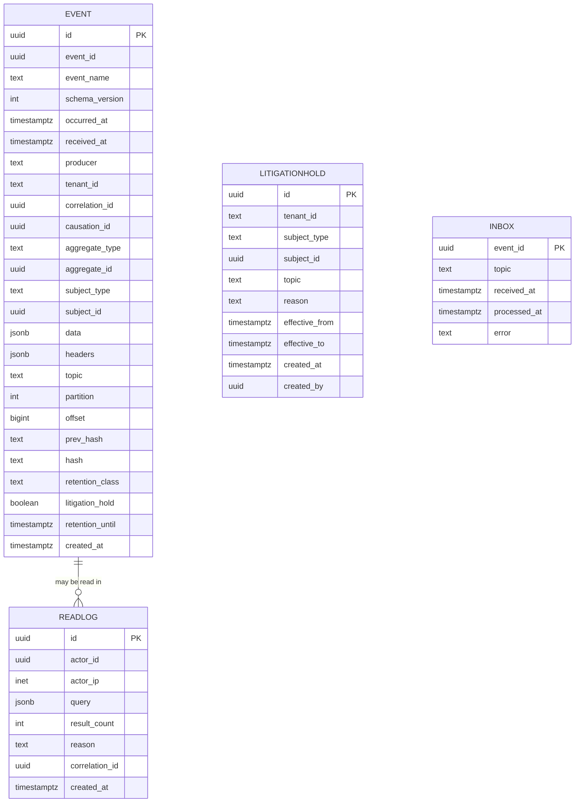

# Audit Service — Entity-Relationship Diagram

## 1. Database

- Engine: PostgreSQL 18
- Schema: `audit` (owned exclusively by this service)
- Migrations: `services/audit-service/migrations/`

## 2. Cross-Service References

| Column | Type | Refers to | Source of truth |
|--------|------|-----------|------------------|
| `event.aggregate_id` | UUID | the aggregate that produced the event | n/a |
| `event.correlation_id` | UUID | the correlation id from the source | n/a |
| `event.tenant_id` | TEXT | tenant | n/a |
| `event.subject_id` (denormalized) | UUID | the user the event is about | respective service |
| `read_log.actor_id` | UUID | admin's `Identity.id` | `identity-service` |

No DB FKs.

## 3. Entities

### `Event`

The audit log. Append-only.

#### Columns

| Column | Type | Constraints | Notes |
|--------|------|-------------|-------|
| `id` | UUID | PK | UUIDv7 |
| `event_id` | UUID | NOT NULL UNIQUE | the source event's id |
| `event_name` | TEXT | NOT NULL | e.g. `trip.completed.v1` |
| `schema_version` | INT | NOT NULL | |
| `occurred_at` | TIMESTAMPTZ | NOT NULL | |
| `received_at` | TIMESTAMPTZ | NOT NULL DEFAULT now() | |
| `producer` | TEXT | NOT NULL | |
| `tenant_id` | TEXT | NOT NULL | |
| `correlation_id` | UUID | NOT NULL | |
| `causation_id` | UUID | NULL | |
| `aggregate_type` | TEXT | NOT NULL | |
| `aggregate_id` | UUID | NULL | |
| `subject_type` | TEXT | NULL | denormalized for search |
| `subject_id` | UUID | NULL | denormalized for search |
| `data` | JSONB | NOT NULL | the source payload |
| `headers` | JSONB | NULL | Kafka headers |
| `topic` | TEXT | NOT NULL | |
| `partition` | INT | NOT NULL | |
| `offset` | BIGINT | NOT NULL | |
| `prev_hash` | TEXT | NULL | previous row's hash |
| `hash` | TEXT | NOT NULL | sha256(prev_hash \|\| canonical(event)) |
| `retention_class` | TEXT | NOT NULL | `financial` / `default` |
| `litigation_hold` | BOOLEAN | NOT NULL DEFAULT false | |
| `retention_until` | TIMESTAMPTZ | NULL | computed at ingest |
| `created_at` | TIMESTAMPTZ | NOT NULL DEFAULT now() | partition key |

#### Indexes

- PK on `id`
- UNIQUE on `event_id`
- Index on `(topic, partition, offset)`
- Index on `(tenant_id, occurred_at DESC)`
- Index on `(subject_type, subject_id, occurred_at DESC)`
- Index on `(correlation_id)`
- Index on `(retention_class, retention_until)`
- Index on `litigation_hold` WHERE `litigation_hold = true`

#### Constraints

- CHECK: `retention_class IN ('financial','default')`
- **No UPDATE / DELETE on this table** (revoked grants).

### `ReadLog`

Append-only log of every read access.

#### Columns

| Column | Type | Constraints | Notes |
|--------|------|-------------|-------|
| `id` | UUID | PK | UUIDv7 |
| `actor_id` | UUID | NOT NULL | admin who read |
| `actor_ip` | INET | NULL | |
| `query` | JSONB | NOT NULL | the search query |
| `result_count` | INT | NOT NULL | how many events returned |
| `reason` | TEXT | NOT NULL | why they searched |
| `correlation_id` | UUID | NOT NULL | |
| `created_at` | TIMESTAMPTZ | NOT NULL DEFAULT now() | partition key |

#### Indexes

- PK on `id`
- Index on `(actor_id, created_at DESC)`

#### Constraints

- **No UPDATE / DELETE on this table**.

### `LitigationHold`

Append-only registry of litigation holds.

#### Columns

| Column | Type | Constraints | Notes |
|--------|------|-------------|-------|
| `id` | UUID | PK | UUIDv7 |
| `tenant_id` | TEXT | NULL | when set, applies to the tenant |
| `subject_type` | TEXT | NULL | when set, applies to the subject |
| `subject_id` | UUID | NULL | |
| `topic` | TEXT | NULL | when set, applies to the topic |
| `reason` | TEXT | NOT NULL | |
| `effective_from` | TIMESTAMPTZ | NOT NULL | |
| `effective_to` | TIMESTAMPTZ | NULL | null = indefinite |
| `created_at` | TIMESTAMPTZ | NOT NULL DEFAULT now() | |
| `created_by` | UUID | NOT NULL | |

#### Indexes

- PK on `id`
- Index on `(tenant_id, effective_from)`
- Index on `(subject_type, subject_id, effective_from)`

#### Constraints

- **No UPDATE / DELETE on this table** (use a new row to extend).

### `Inbox`

Same shape.

## 4. Mermaid ER Diagram



## 5. DDL Sketch

```sql
CREATE SCHEMA IF NOT EXISTS audit;

CREATE TABLE audit.events (
    id UUID NOT NULL,
    event_id UUID NOT NULL,
    event_name TEXT NOT NULL,
    schema_version INT NOT NULL,
    occurred_at TIMESTAMPTZ NOT NULL,
    received_at TIMESTAMPTZ NOT NULL DEFAULT now(),
    producer TEXT NOT NULL,
    tenant_id TEXT NOT NULL,
    correlation_id UUID NOT NULL,
    causation_id UUID,
    aggregate_type TEXT NOT NULL,
    aggregate_id UUID,
    subject_type TEXT,
    subject_id UUID,
    data JSONB NOT NULL,
    headers JSONB,
    topic TEXT NOT NULL,
    partition INT NOT NULL,
    offset BIGINT NOT NULL,
    prev_hash TEXT,
    hash TEXT NOT NULL,
    retention_class TEXT NOT NULL
        CHECK (retention_class IN ('financial','default')),
    litigation_hold BOOLEAN NOT NULL DEFAULT false,
    retention_until TIMESTAMPTZ,
    created_at TIMESTAMPTZ NOT NULL DEFAULT now(),
    PRIMARY KEY (id, created_at),
    UNIQUE (event_id, created_at)
) PARTITION BY RANGE (created_at);

CREATE INDEX idx_events_topic_partition_offset
    ON audit.events (topic, partition, offset);
CREATE INDEX idx_events_tenant_occurred
    ON audit.events (tenant_id, occurred_at DESC);
CREATE INDEX idx_events_subject
    ON audit.events (subject_type, subject_id, occurred_at DESC);
CREATE INDEX idx_events_correlation
    ON audit.events (correlation_id);
CREATE INDEX idx_events_retention
    ON audit.events (retention_class, retention_until);
CREATE INDEX idx_events_litigation
    ON audit.events (litigation_hold)
    WHERE litigation_hold = true;

-- append-only
REVOKE UPDATE, DELETE ON audit.events FROM audit_app;

CREATE TABLE IF NOT EXISTS audit.events_2026_07
    PARTITION OF audit.events
    FOR VALUES FROM ('2026-07-01 00:00:00+00') TO ('2026-08-01 00:00:00+00');

CREATE TABLE audit.read_log (
    id UUID NOT NULL,
    actor_id UUID NOT NULL,
    actor_ip INET,
    query JSONB NOT NULL,
    result_count INT NOT NULL,
    reason TEXT NOT NULL,
    correlation_id UUID NOT NULL,
    created_at TIMESTAMPTZ NOT NULL DEFAULT now(),
    PRIMARY KEY (id, created_at)
) PARTITION BY RANGE (created_at);
CREATE INDEX idx_read_log_actor
    ON audit.read_log (actor_id, created_at DESC);
REVOKE UPDATE, DELETE ON audit.read_log FROM audit_app;

-- Idempotent pre-creation; rerun is safe.
CREATE TABLE IF NOT EXISTS audit.read_log_2026_07
    PARTITION OF audit.read_log
    FOR VALUES FROM ('2026-07-01 00:00:00+00') TO ('2026-08-01 00:00:00+00');

CREATE TABLE audit.litigation_hold (
    id UUID PRIMARY KEY,
    tenant_id TEXT,
    subject_type TEXT,
    subject_id UUID,
    topic TEXT,
    reason TEXT NOT NULL,
    effective_from TIMESTAMPTZ NOT NULL,
    effective_to TIMESTAMPTZ,
    created_at TIMESTAMPTZ NOT NULL DEFAULT now(),
    created_by UUID NOT NULL
);

CREATE INDEX idx_litigation_tenant
    ON audit.litigation_hold (tenant_id, effective_from);
CREATE INDEX idx_litigation_subject
    ON audit.litigation_hold (subject_type, subject_id, effective_from);

CREATE TABLE audit.inbox (
    event_id UUID PRIMARY KEY,
    topic TEXT NOT NULL,
    received_at TIMESTAMPTZ NOT NULL DEFAULT now(),
    processed_at TIMESTAMPTZ,
    error TEXT
);
```

## 6. Audit Columns

`events`, `read_log` are append-only; they have no `updated_at` /
`updated_by`.

## 7. Soft Delete

n/a (append-only).

## 8. JSONB Usage

| Table.Column | What is stored | Justification |
|--------------|----------------|---------------|
| `events.data` | the source event payload | full audit |
| `events.headers` | Kafka headers | trace context |
| `read_log.query` | the search query | audit the auditors |

## 9. Partitioning

- `events` partitioned by month on `created_at`.
- `read_log` partitioned by month on `created_at`.
- `litigation_hold` and `inbox` are **not** partitioned (small,
  identity-keyed tables).
- **Mixed retention** (`events` has both `retention_class='financial'`
  with 7-year retention and `retention_class='default'` with 1-year
  retention): the parent is `RANGE` on `created_at`; rows of
  different retention classes live in the same monthly child.
  The maintenance job **must not** drop a child whose upper bound is
  still inside the financial retention window even if all rows in
  it are `default`. Implementation: before drop, the job runs
  `SELECT 1 FROM audit.events WHERE created_at >= :lower AND
  created_at < :upper AND retention_class = 'financial' LIMIT 1` —
  if any row exists, skip the drop. See
  [`DATABASE_ARCHITECTURE.md` "Table Partitioning — Canonical
  Template"](../../architecture/DATABASE_ARCHITECTURE.md) 8
  Mixed retention.
- Child partitions are created with
  `CREATE TABLE IF NOT EXISTS … PARTITION OF … FOR VALUES FROM
  ('YYYY-MM-01 00:00:00+00') TO ('YYYY-(MM+1)-01 00:00:00+00')`
  followed by a `pg_inherits` + bounds verification step. See the
  same template 5.
- Pre-create horizon: next 12 complete months (monthly cadence).
- Maintenance owner: this service (`audit-service`); scheduled job
  runs daily at `02:00 UTC` (see WORKFLOWS "Monthly Partition
  Maintenance").

## 10. Data Retention

| Table | Retention | Purged by |
|-------|-----------|-----------|
| `events` (financial) | 7 years | monthly purge job (skips litigation hold) |
| `events` (default) | 1 year | monthly purge job |
| `read_log` | 7 years | monthly archival job |
| `litigation_hold` | indefinitely | n/a |
| `inbox` | 7 days | daily purge job |

## 11. Migration Considerations

- The `events` table is append-only; the migration runner MUST NOT
  attempt to UPDATE or DELETE on it.
- The hash chain is a sequence; a reorg (e.g. a missed event) is
  detected by the daily verification job and alerts.
- The `litigation_hold` table is append-only; an extension is a
  new row with a later `effective_from`.

---

## See also

### Sibling docs for this service

- [`README.md`](./README.md) — purpose, bounded context, responsibilities
- [`BRD.md`](./BRD.md) — business requirements
- [`SRS.md`](./SRS.md) — functional + non-functional requirements
- [`ERD.md`](./ERD.md) — data model (entities, relationships)
- [`INTEGRATION.md`](./INTEGRATION.md) — inter-service contracts (APIs, events, sagas)
- [`WORKFLOWS.md`](./WORKFLOWS.md) — operational workflows (happy paths, failure modes)
- [`TECH.md`](./TECH.md) — technology profile (runtime, libraries, data layer, admin endpoints, RBAC)

### Platform-wide

- [`../../shared/README.md`](../../shared/README.md) — `platform-spring-boot-starter` shared library (the single source of cross-cutting code for all Spring Boot services in the platform)
- [`../RECOMMENDATIONS.md`](../RECOMMENDATIONS.md) — platform-wide technology map (language, framework, version baseline, admin/RBAC pattern)
- [`../../README.md`](../../README.md) — services overview (the catalog of all 20 services)
- [`../../../main.md`](../../../main.md) — top-level platform specification (architecture, Keycloak, PostgreSQL 18, messaging, observability baseline)

