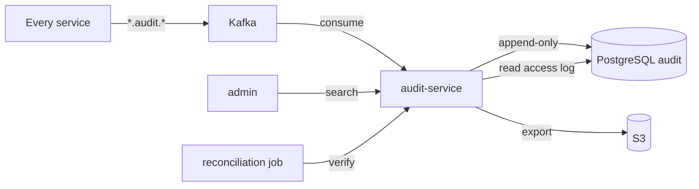

# Audit Service — Software Requirements Specification

## 1. Introduction

This SRS specifies the behavior, performance, and operational
requirements of `audit-service`. It inherits the platform-wide
standards in `docs/architecture/API_STANDARDS.md`,
`docs/architecture/EVENT_ARCHITECTURE.md`, and
`docs/architecture/SECURITY_ARCHITECTURE.md`.

## 2. Scope

In scope:

- Subscription to audit-relevant events.
- Append-only persistence with cryptographic immutability.
- Strict-RBAC search API.
- Retention policy enforcement.
- Daily export to S3.

Out of scope:

- Business event production.
- Action dispatch.
- Right-to-erasure (per-service).

## 3. System Context

## 4. Actors

- Admin (compliance / security) — human.
- External auditor — human.
- Reconciliation job — system.
- Every service — system (producer of consumed events).

## 5. Functional Requirements

| ID | Requirement | Priority |
|----|-------------|----------|
| FR--001 | The service MUST consume every `*.audit.*` topic. | MUST |
| FR--002 | The service MUST persist every event in `audit.events` in the same DB transaction. | MUST |
| FR--003 | The service MUST maintain a cryptographic hash chain. | MUST |
| FR--004 | The service MUST reject UPDATE / DELETE on the audit schema. | MUST |
| FR--005 | The service MUST expose `POST /v1/audit/search`. | MUST |
| FR--006 | The service MUST expose `GET /v1/audit/events/{id}`. | MUST |
| FR--007 | The service MUST expose `GET /v1/audit/verify/{id}`. | MUST |
| FR--008 | The service MUST support a "litigation hold" flag. | MUST |
| FR--009 | The service MUST support per-tenant isolation. | MUST |
| FR--010 | The service MUST export the audit log to S3 daily. | MUST |
| FR--011 | The service MUST log every read access in `audit.read_log`. | MUST |
| FR--012 | The service MUST enforce retention: 7y for financial, 1y for others. | MUST |
| FR--013 | The service MUST support a "verify event" endpoint (event id + hash). | MUST |
| FR--014 | The service MUST support a "verify hash chain" job (daily). | MUST |
| FR--015 | The service MUST support a "consumer lag" metric. | MUST |
| FR--016 | The service MUST route poison events to DLQ. | MUST |
| FR--017 | The service MUST support a "purge" job (daily, with litigation hold check). | MUST |
| FR--018 | The service MUST support a "tenant_offboarded" hook (no events for that tenant are accepted). | MUST |
| FR--019 | The service MUST support "subject search" (find all events for a user). | MUST |
| FR--020 | The service MUST support "correlation_id" search. | MUST |

## 6. Non-Functional Requirements

| ID | Category | Requirement | Target |
|----|----------|-------------|--------|
| NFR--001 | performance | P99 search latency | < 1s |
| NFR--002 | performance | consumer throughput | 10k events/s |
| NFR--003 | availability | uptime | 99.9% over 30d |
| NFR--004 | scalability | horizontal scaling | HPA on consumer lag |
| NFR--005 | durability | zero data loss on regional outage | RPO 5m, RTO 30m |
| NFR--006 | observability | 100% requests have trace and log | enforced in CI |
| NFR--007 | freshness | median consumer lag | < 2s |
| NFR--008 | hash chain integrity | 100% | daily verification |

## 7. API Requirements

- Versioned URIs.
- Bearer JWT.
- Errors in the standard envelope.
- OpenAPI 3.1 at `/openapi.json`.

## 8. Data Requirements

| ID | Requirement | Notes |
|----|-------------|-------|
| DATA--001 | Primary keys UUIDv7. | |
| DATA--002 | `events` is append-only. | |
| DATA--003 | `events` partitioned by month. | Retention. |
| DATA--004 | Cross-service references are UUID columns without DB FKs. | Rule |
| DATA--005 | Time is RFC3339 UTC. | |
| DATA--006 | `read_log` is append-only. | |
| DATA--007 | `subject_search` indexed by `(subject_type, subject_id)`. | |

## 9. Validation Rules

- A `reason` for a read is required.
- A `query` for a search is required.
- A `tenant_id` is required.

## 10. State Transitions

n/a (append-only).

## 11. Authorization Requirements

- `audit.read` for search.
- `audit.admin` for litigation hold and purge.
- Read access is itself audited in `audit.read_log`.

## 12. Configuration Requirements

- `RETENTION_FINANCIAL_YEARS` (env; default 7).
- `RETENTION_DEFAULT_YEARS` (env; default 1).
- `HASH_ALGO` (env; default `sha256`).
- `EXPORT_CRON` (env; default `0 3 * * *`).

## 13. Error Handling

| Error | Response |
|-------|----------|
| Insufficient role | 403 `FORBIDDEN` |
| Invalid query | 400 `VALIDATION_FAILED` |
| Hash mismatch (verify) | 422 `HASH_MISMATCH` |
| Event not found | 404 `EVENT_NOT_FOUND` |

## 14. Concurrency Requirements

- The hash chain is serialized at the row level
  (`SELECT ... FOR UPDATE` on the latest row).
- Two simultaneous ingests MUST be ordered by the chain.

## 15. Idempotency Requirements

- The consumer uses an inbox on `event_id`; duplicate events are
  no-ops.

## 16. Performance

- Dominant path: Kafka consumer.
- P50/P95/P99 ingest: 1ms / 5ms / 20ms.
- Search P99: < 1s.

## 17. Scalability

- Horizontal scaling: HPA on consumer lag.
- Vertical scaling: 2 vCPU / 4 GiB production.

## 18. Availability

- SLO: 99.9% over 30 days.
- Error budget: ~44 minutes per 30 days.
- Maintenance window: Sundays 04:00–06:00 UTC.

## 19. Security

| ID | Requirement | Notes |
|----|-------------|-------|
| SEC--001 | All requests JWT-validated. | Standard |
| SEC--002 | Strict RBAC: `audit.read` for compliance, `audit.admin` for security. | |
| SEC--003 | Every read access is logged. | |
| SEC--004 | UPDATE / DELETE is rejected at the DB level. | |
| SEC--005 | DB user has rights only on the `audit` schema. | Least privilege. |
| SEC--006 | Column-level encryption for sensitive fields. | |
| SEC--007 | PII is masked in non-admin reads. | |

## 20. Privacy

- PII stored: as in the source event.
- Retention: 7y financial, 1y default; litigation hold overrides.
- Erasure: per-service (the audit log retains the event; sensitive
  fields may be redacted in non-admin reads).

## 21. Auditability

- The audit log is the source of truth.
- Read access is logged in `audit.read_log`.

## 22. Observability

- Logs: JSON to stdout; standard fields.
- Metrics:
  - `http_requests_total{route, method, status}` (RED)
  - `http_request_duration_seconds{route, method, status}` (RED)
  - `audit_events_ingested_total{topic}`
  - `audit_consumer_lag{topic, partition}`
  - `audit_export_seconds`
  - `audit_hash_chain_status`
- Traces: OpenTelemetry.
- Alerts:
  - SLO burn rate.
  - Consumer lag > 30s.
  - Hash chain mismatch (critical).
  - Export failure.

## 23. Maintainability

- Code style: Go.
- Test coverage: ≥ 90%.
- Documentation: this folder; OpenAPI 3.1 at `/openapi.json`.

## 24. Disaster Recovery

- RPO: 5 minutes.
- RTO: 30 minutes.
- Backups: nightly logical + continuous WAL; 7-year retention.

## 25. Acceptance Criteria

- 99.9% consumer availability for 30 days in production.
- 100% of audit-relevant events persisted within 5 seconds.
- Hash chain integrity 100% (daily verification).
- UPDATE / DELETE is rejected at the DB level.
- Read access is logged 100%.
- Export success rate 100%.

---

## See also

### Sibling docs for this service

- [`README.md`](./README.md) — purpose, bounded context, responsibilities
- [`BRD.md`](./BRD.md) — business requirements
- [`SRS.md`](./SRS.md) — functional + non-functional requirements
- [`ERD.md`](./ERD.md) — data model (entities, relationships)
- [`INTEGRATION.md`](./INTEGRATION.md) — inter-service contracts (APIs, events, sagas)
- [`WORKFLOWS.md`](./WORKFLOWS.md) — operational workflows (happy paths, failure modes)
- [`TECH.md`](./TECH.md) — technology profile (runtime, libraries, data layer, admin endpoints, RBAC)

### Platform-wide

- [`../../shared/README.md`](../../shared/README.md) — `platform-spring-boot-starter` shared library (the single source of cross-cutting code for all Spring Boot services in the platform)
- [`../RECOMMENDATIONS.md`](../RECOMMENDATIONS.md) — platform-wide technology map (language, framework, version baseline, admin/RBAC pattern)
- [`../../README.md`](../../README.md) — services overview (the catalog of all 20 services)
- [`../../../main.md`](../../../main.md) — top-level platform specification (architecture, Keycloak, PostgreSQL 18, messaging, observability baseline)

