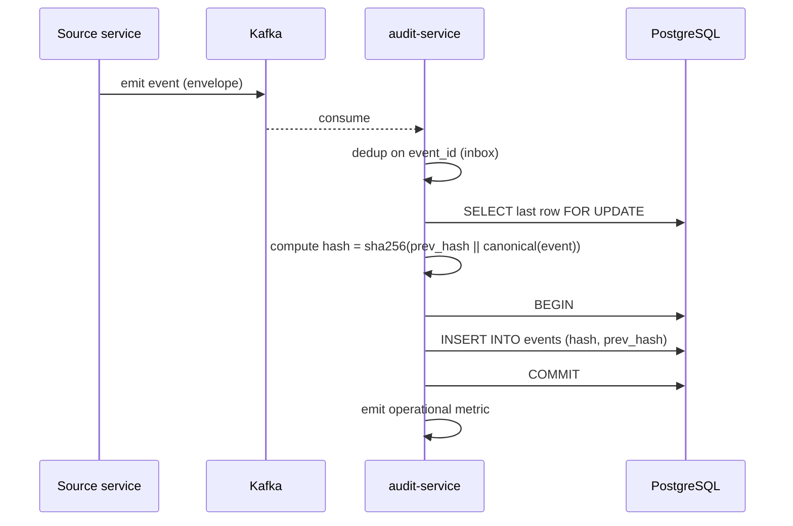
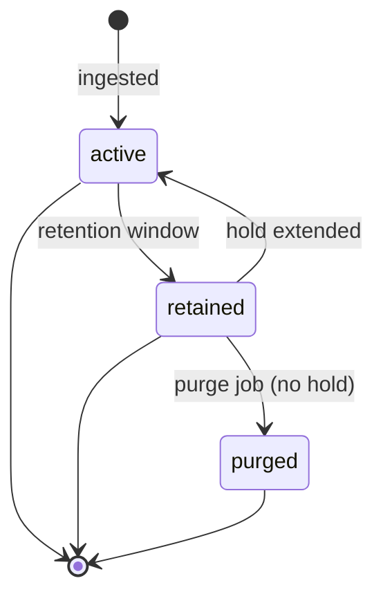
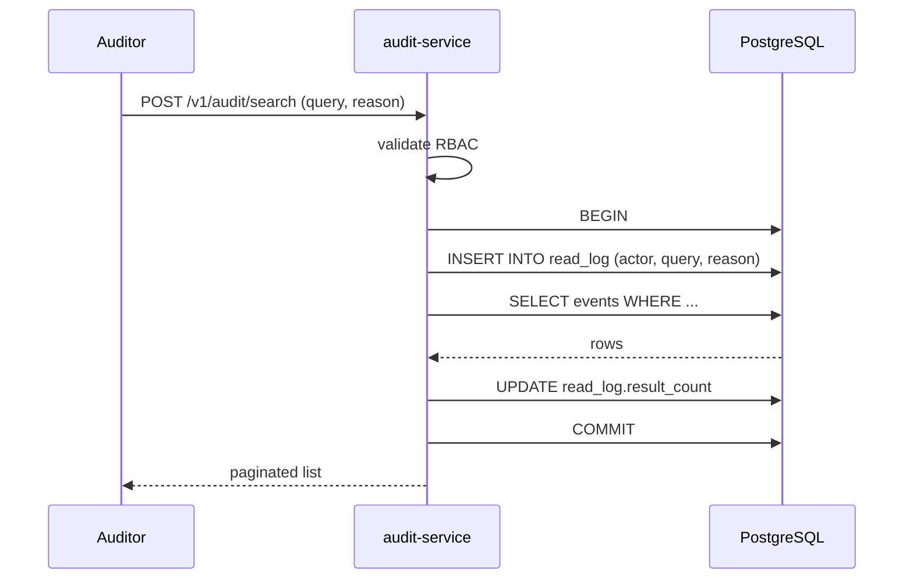
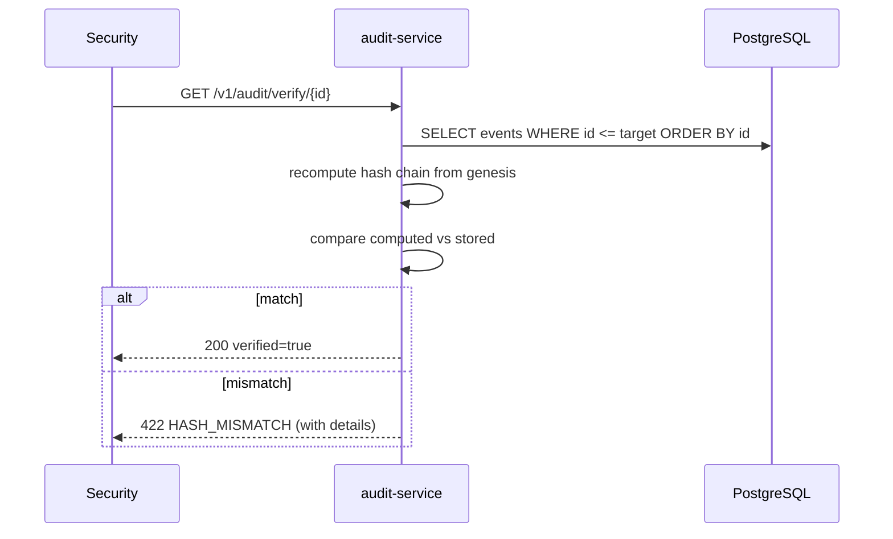
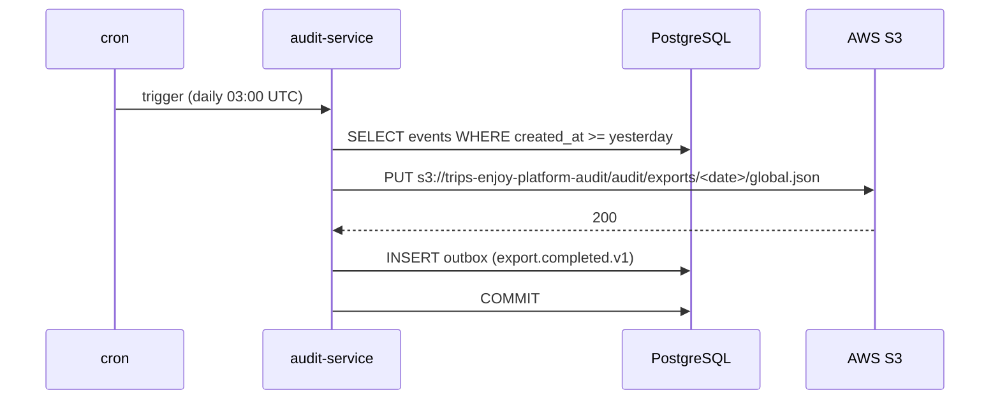
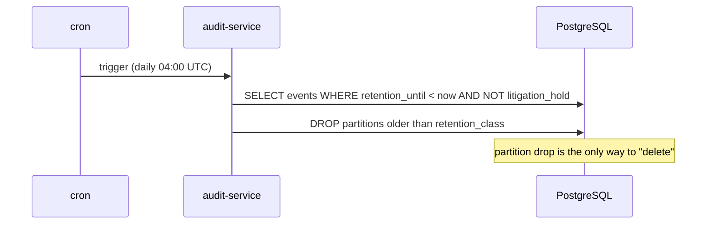

# Audit Service — Workflows

## 1. Consume an Audit-Relevant Event

### 1.1 Objective

Persist every audit-relevant event in an immutable, hash-chained
table, within 5 seconds of production.

### 1.2 Initiating Actor

Every service (system) via Kafka.

### 1.3 Participating Services

- Source service (producer)
- Kafka
- `audit-service` (this service)
- `audit.events` table

### 1.4 Prerequisites

- The source service emits the event with the standard envelope.
- The topic is in the service's consumer list.

### 1.5 Happy Path



State machine for the hash chain:



### 1.6 Alternate Paths

- **Duplicate event** (inbox hit): no-op.
- **Poison event** (deserialize failure): DLQ.
- **DB unavailable**: the consumer retries; the event is NOT
  acknowledged until persisted.

### 1.7 Failure Paths

| Failure | Handling |
|---------|----------|
| Deserialize failure | DLQ |
| DB unavailable | retry with backoff; DLQ after 3 attempts |
| Hash chain mismatch (during compute) | critical alert; investigate |

### 1.8 Business Rules

- Every event is persisted in the same DB transaction that updates
  the hash chain.
- The hash is `sha256(prev_hash || canonical(event))` where
  `canonical` is a stable JSON serialization.

### 1.9 State Transitions

n/a (append-only).

### 1.10 Events

n/a (the service is consumer-only; it does not produce business
events).

### 1.11 APIs Involved

n/a (no inbound API on this path).

### 1.12 Compensation / Rollback

n/a (append-only).

### 1.13 Final State

The event is in `audit.events` with the correct hash; the chain is
extended.

## 2. Search the Audit Log

### 2.1 Objective

A compliance auditor searches the log by topic, subject, time, or
correlation id.

### 2.2 Initiating Actor

Compliance auditor / security on-call.

### 2.3 Participating Services

- `audit-service`

### 2.4 Prerequisites

- The auditor holds `audit.read`.
- The auditor provides a `reason`.

### 2.5 Happy Path



### 2.6 Alternate Paths

- **Insufficient role**: 403 `FORBIDDEN`.
- **No results**: empty list.

### 2.7 Failure Paths

| Failure | Handling |
|---------|----------|
| Insufficient role | 403 `FORBIDDEN` |
| Invalid query | 400 `VALIDATION_FAILED` |
| DB unavailable | 503 `CIRCUIT_OPEN` |

### 2.8 Business Rules

- Every read access is logged in `audit.read_log`.
- PII is masked in non-admin reads.

### 2.9 State Transitions

n/a (read-only).

### 2.10 Events

n/a (no event on read).

### 2.11 APIs Involved

| API | Direction | When |
|-----|-----------|------|
| `POST /v1/audit/search` | inbound | search |

### 2.12 Compensation / Rollback

n/a (read-only).

### 2.13 Final State

The auditor has the result list; the read is logged.

## 3. Verify the Hash Chain

### 3.1 Objective

Verify the integrity of the hash chain (e.g. after a suspected
tamper or a routine daily check).

### 3.2 Initiating Actor

Security on-call (ad-hoc) or the daily verification job.

### 3.3 Participating Services

- `audit-service`

### 3.4 Prerequisites

- The caller holds `audit.admin`.

### 3.5 Happy Path



### 3.6 Alternate Paths

- **Mismatch**: 422 `HASH_MISMATCH`; the response includes the row
  id and the expected vs actual hash.

### 3.7 Failure Paths

| Failure | Handling |
|---------|----------|
| DB unavailable | 503 `CIRCUIT_OPEN` |
| Mismatch detected | 422 + alert (security) |

### 3.8 Business Rules

- The verification is a recompute from the genesis row; any
  mismatch indicates tampering.

### 3.9 State Transitions

n/a (read-only).

### 3.10 Events

n/a (no event on read; but the daily job emits a metric).

### 3.11 APIs Involved

| API | Direction | When |
|-----|-----------|------|
| `GET /v1/audit/verify/{id}` | inbound | verify |

### 3.12 Compensation / Rollback

On mismatch, an incident is opened; the chain is not repaired (the
tamper is preserved as evidence).

### 3.13 Final State

The verification result is returned; on mismatch, a critical alert
pages security.

## 4. Daily Export to S3

### 4.1 Objective

Export the audit log to S3 for offline analysis by external
auditors.

### 4.2 Initiating Actor

The daily cron job.

### 4.3 Participating Services

- `audit-service`
- AWS S3

### 4.4 Prerequisites

- The cron schedule is configured.

### 4.5 Happy Path



### 4.6 Alternate Paths

- **Export failure**: retry with backoff; alert after 3 attempts.

### 4.7 Failure Paths

| Failure | Handling |
|---------|----------|
| S3 unavailable | retry with backoff; alert |
| DB unavailable | retry; alert |

### 4.8 Business Rules

- The export is partitioned by date.
- The export is a snapshot; it is not updated.

### 4.9 State Transitions

n/a.

### 4.10 Events

| Event | Direction | When |
|-------|-----------|------|
| `audit.export.completed.v1` | produced | export success |

### 4.11 APIs Involved

| API | Direction | When |
|-----|-----------|------|
| AWS S3 PUT | outbound | export |

### 4.12 Compensation / Rollback

A failed export is retried; the success event is only emitted on
success.

### 4.13 Final State

The S3 object is written; the success event is emitted; the
external auditor can fetch the export.

## 5. Daily Purge

### 5.1 Objective

Purge events past their retention window (7y for financial, 1y for
default), respecting litigation hold.

### 5.2 Initiating Actor

The daily cron job.

### 5.3 Participating Services

- `audit-service`

### 5.4 Prerequisites

- The retention window is configured.

### 5.5 Happy Path



### 5.6 Alternate Paths

- **Litigation hold**: the partition is NOT dropped.
- **New retention class**: a new partition is created with the new
  retention.

### 5.7 Failure Paths

| Failure | Handling |
|---------|----------|
| DB unavailable | retry; alert |
| DROP partition failure | alert; investigate |

### 5.8 Business Rules

- A partition drop is the only way to "delete" from the audit log;
  no row-level DELETE.
- A litigation hold prevents the drop for the affected events.

### 5.9 State Transitions

n/a (partition drop is atomic).

### 5.10 Events

n/a (operational metric only).

### 5.11 APIs Involved

n/a.

### 5.12 Compensation / Rollback

A dropped partition cannot be restored; the S3 export is the
backup.

### 5.13 Final State

The expired partitions are dropped; the active partitions remain;
the S3 export retains a snapshot.

## 6. `Monthly Partition Maintenance`

### 6.1 Objective

Idempotently pre-create the next 12 monthly child partitions for
`audit.events` and `audit.read_log` so an INSERT at any time lands
in an existing child. The drop half is handled by §5 above; this
section covers the create-half and the catalog verification.

### 6.2 Initiating Actor

A scheduled job runs daily at `02:00 UTC`. Leader-elected via
`pg_try_advisory_xact_lock(hashtext('audit.partition'),
hashtext('monthly'))`.

### 6.3 Participating Services

- `audit-service` (this service, owner)
- `configuration-service` reads `partition_precreate_months=12`
  (override per env)

### 6.4 Prerequisites

- Parent tables `audit.events` and `audit.read_log` are
  range-partitioned by month on `created_at`.
- The retention-class check (see ERD §9) is in place; the job
  refuses to drop a child that still has any `financial`-class
  row.

### 6.5 Happy Path

```mermaid
sequenceDiagram
    participant JOB as Partition job
    participant PG as PostgreSQL
    JOB->>PG: pg_try_advisory_xact_lock('audit.monthly')
    alt lock acquired
        loop for each missing month in next 12
            JOB->>PG: CREATE TABLE IF NOT EXISTS audit.events_YYYY_MM PARTITION OF audit.events
            JOB->>PG: CREATE TABLE IF NOT EXISTS audit.read_log_YYYY_MM PARTITION OF audit.read_log
            JOB->>PG: verify (pg_inherits, relpartbound)
        end
        JOB->>PG: assert now() in existing child for events + read_log
    else lock NOT acquired
        Note over JOB: another instance is running; exit cleanly
    end
```

### 6.6 Alternate Paths

- **Today's child missing**: critical alert fires; INSERTs would
  fail. The job retries once before paging on-call.

### 6.7 Failure Paths

| Failure | Handling |
|---------|----------|
| Advisory lock contention | another instance is doing the same work; exit 0 |
| `CREATE TABLE IF NOT EXISTS` fails | retry 3× with backoff (1 s / 4 s / 16 s); on persistent failure, page on-call |
| Verification step finds wrong bounds | DO block raises; alert + page |

### 6.8 Business Rules

- Pre-create 12 complete future months.
- Every child is created with `CREATE TABLE IF NOT EXISTS` so the
  job is safe to run twice in the same window.
- A verification step (`pg_inherits` parent + `relpartbound`
  range) runs after every `CREATE TABLE IF NOT EXISTS` because
  `IF NOT EXISTS` only guards the name, not the bounds.
- The job emits `audit.partition.maintained.v1` on success with
  `{schema: 'audit', created: N, dropped: M}`.

### 6.9 Final State

- `audit.events` and `audit.read_log` have 12 future monthly
  children and ≥ 1 current month child.
- The advisory lock is released.

---

## See also

### Sibling docs for this service

- [`README.md`](./README.md) — purpose, bounded context, responsibilities
- [`BRD.md`](./BRD.md) — business requirements
- [`SRS.md`](./SRS.md) — functional + non-functional requirements
- [`ERD.md`](./ERD.md) — data model (entities, relationships)
- [`INTEGRATION.md`](./INTEGRATION.md) — inter-service contracts (APIs, events, sagas)
- [`WORKFLOWS.md`](./WORKFLOWS.md) — operational workflows (happy paths, failure modes)
- [`TECH.md`](./TECH.md) — technology profile (runtime, libraries, data layer, admin endpoints, RBAC)

### Platform-wide

- [`../../shared/README.md`](../../shared/README.md) — `platform-spring-boot-starter` shared library (the single source of cross-cutting code for all Spring Boot services in the platform)
- [`../RECOMMENDATIONS.md`](../RECOMMENDATIONS.md) — platform-wide technology map (language, framework, version baseline, admin/RBAC pattern)
- [`../../README.md`](../../README.md) — services overview (the catalog of all 58 services)
- [`../../../main.md`](../../../main.md) — top-level platform specification (architecture, Keycloak, PostgreSQL 18, messaging, observability baseline)

