# branch-service — Entity-Relationship Diagram

## 1. Database

- Engine: **PostgreSQL 18** with **PostGIS** extension.
- Schema: `branch` (owned exclusively by this service).
- Migrations: `services/branch-service/prisma/migrations/`.

## 2. Cross-Service References

| Column | Type | Refers to | Source of truth |
|--------|------|-----------|------------------|
| `branches.restaurant_id` | UUID | Restaurant | `restaurant-service` |
| `branches.photo_file_id` | UUID | file metadata | `file-service` |
| `branches.zone_id` | UUID | zone | `zone-service` |
| `branches.closure_actor_kc_sub` | UUID | Keycloak user | `identity-service` |

All cross-service references are stored as columns **without**
database-level foreign keys. Referential integrity is enforced at
the application layer.

## 3. Entities

### `branches`

A physical location of a restaurant.

#### Columns

| Column | Type | Constraints | Notes |
|--------|------|-------------|-------|
| `id` | UUID | PK | UUIDv7 |
| `restaurant_id` | UUID | NOT NULL | cross-service ref |
| `name` | TEXT | NOT NULL CHECK (length(name) BETWEEN 1 AND 120) | public name |
| `slug` | TEXT | NOT NULL UNIQUE | URL-safe handle |
| `address_line1` | TEXT | NOT NULL | structured |
| `address_line2` | TEXT | NULL | |
| `city` | TEXT | NOT NULL | |
| `region` | TEXT | NULL | state / province |
| `postal_code` | TEXT | NOT NULL | |
| `country` | CHAR(2) | NOT NULL CHECK (country ~ '^[A-Z]{2}$') | ISO-3166-1 |
| `location` | geometry(Point, 4326) | NOT NULL | geocoded point |
| `timezone` | TEXT | NOT NULL | IANA |
| `phone` | TEXT | NULL | E.164 |
| `email` | TEXT | NULL | public contact |
| `photo_file_id` | UUID | NULL | cross-service ref |
| `zone_id` | UUID | NULL | cross-service ref |
| `state` | TEXT | NOT NULL DEFAULT 'open' CHECK in (...) | lifecycle |
| `busy` | BOOLEAN | NOT NULL DEFAULT false | soft signal |
| `busy_at` | TIMESTAMPTZ | NULL | when busy was set |
| `busy_actor_kc_sub` | UUID | NULL | who set busy |
| `prep_capacity` | INTEGER | NOT NULL CHECK (prep_capacity >= 0) | max concurrent orders |
| `state_reason_code` | TEXT | NULL | reason for last transition |
| `state_actor_kc_sub` | UUID | NULL | who made the last transition |
| `state_changed_at` | TIMESTAMPTZ | NULL | when the last transition happened |
| `created_at` | TIMESTAMPTZ | NOT NULL DEFAULT now() | audit |
| `updated_at` | TIMESTAMPTZ | NOT NULL DEFAULT now() | audit |
| `created_by` | UUID | NOT NULL | identity |
| `updated_by` | UUID | NOT NULL | identity |
| `deleted_at` | TIMESTAMPTZ | NULL | soft delete |

#### Indexes

- PK on `id`.
- UNIQUE on `slug`.
- Index on `(restaurant_id) WHERE deleted_at IS NULL`.
- Index on `(state)`.
- GIST on `location` for nearest-branch queries.
- Partial index on `(state) WHERE state = 'open' AND deleted_at IS
  NULL`.

#### Constraints

- CHECK: `state IN ('open','temporarily_closed','closed')`.
- CHECK: `timezone ~ '^[A-Za-z]+/[A-Za-z_]+$'` (loose IANA
  pattern).

### `branch_hours`

Weekly opening hours, one row per day of week.

#### Columns

| Column | Type | Constraints | Notes |
|--------|------|-------------|-------|
| `id` | UUID | PK | UUIDv7 |
| `branch_id` | UUID | NOT NULL, FK to `branches.id` | |
| `day_of_week` | SMALLINT | NOT NULL CHECK (day_of_week BETWEEN 1 AND 7) | 1=Mon, 7=Sun |
| `is_closed` | BOOLEAN | NOT NULL DEFAULT false | if true, ignore open/close |
| `open_time` | TIME | NULL | local time |
| `close_time` | TIME | NULL | local time |
| `created_at` | TIMESTAMPTZ | NOT NULL DEFAULT now() | |
| `updated_at` | TIMESTAMPTZ | NOT NULL DEFAULT now() | |

#### Indexes

- PK on `id`.
- UNIQUE on `(branch_id, day_of_week)`.
- CHECK: `close_time > open_time OR is_closed = true`.

### `branch_special_hours`

Holidays and one-off schedule overrides.

#### Columns

| Column | Type | Constraints | Notes |
|--------|------|-------------|-------|
| `id` | UUID | PK | UUIDv7 |
| `branch_id` | UUID | NOT NULL, FK to `branches.id` | |
| `date` | DATE | NOT NULL | local date |
| `is_closed` | BOOLEAN | NOT NULL DEFAULT false | |
| `open_time` | TIME | NULL | local time |
| `close_time` | TIME | NULL | local time |
| `reason` | TEXT | NULL | e.g. "Christmas" |
| `created_at` | TIMESTAMPTZ | NOT NULL DEFAULT now() | |
| `updated_at` | TIMESTAMPTZ | NOT NULL DEFAULT now() | |

#### Indexes

- PK on `id`.
- UNIQUE on `(branch_id, date)`.

### `branch_temporary_closures`

Operator-set closures (e.g. equipment failure, staff shortage).

#### Columns

| Column | Type | Constraints | Notes |
|--------|------|-------------|-------|
| `id` | UUID | PK | UUIDv7 |
| `branch_id` | UUID | NOT NULL, FK to `branches.id` | |
| `start_at` | TIMESTAMPTZ | NOT NULL | when the closure starts |
| `end_at` | TIMESTAMPTZ | NOT NULL | when the closure ends |
| `reason_code` | TEXT | NOT NULL | e.g. `equipment`, `staff`, `parent_suspended`, `out_of_zone` |
| `reason_text` | TEXT | NULL | human text |
| `actor_kc_sub` | UUID | NULL | who set it (null for system) |
| `cleared_at` | TIMESTAMPTZ | NULL | if manually cleared before end |
| `created_at` | TIMESTAMPTZ | NOT NULL DEFAULT now() | |

#### Indexes

- PK on `id`.
- Index on `(branch_id, end_at)`.
- Partial index on `(end_at) WHERE cleared_at IS NULL` —
  auto-clear job hot path.
- CHECK: `end_at > start_at`.

### `branch_audit_log`

Append-only audit log of admin actions and cascade events.

#### Columns

| Column | Type | Constraints | Notes |
|--------|------|-------------|-------|
| `id` | UUID | PK | UUIDv7 |
| `branch_id` | UUID | NOT NULL, FK to `branches.id` | |
| `action` | TEXT | NOT NULL CHECK in (...) | `close`,`open`,`temp_closure_set`,`temp_closure_clear`,`busy_set`,`busy_clear`,`hours_set`,`special_hours_set`,`special_hours_remove`,`parent_suspend_cascade`,`parent_close_cascade`,`zone_drift_closure` |
| `actor_kc_sub` | UUID | NULL | null for system |
| `actor_type` | TEXT | NOT NULL CHECK in (...) | `admin`,`owner`,`ops`,`staff`,`system` |
| `reason_code` | TEXT | NULL | required for admin/cascade |
| `reason_text` | TEXT | NULL | optional |
| `from_state` | TEXT | NULL | |
| `to_state` | TEXT | NULL | |
| `signature_id` | UUID | NULL | request signature |
| `correlation_id` | UUID | NOT NULL | trace |
| `occurred_at` | TIMESTAMPTZ | NOT NULL DEFAULT now() | |

#### Indexes

- PK on `id`.
- Index on `(branch_id, occurred_at DESC)`.
- Index on `(actor_kc_sub, occurred_at DESC)` where not null.

### `outbox`

Transactional outbox for events. See `EVENT_ARCHITECTURE.md`.

#### Columns

| Column | Type | Constraints | Notes |
|--------|------|-------------|-------|
| `id` | UUID | PK | UUIDv7 |
| `aggregate_type` | TEXT | NOT NULL | `Branch` |
| `aggregate_id` | UUID | NOT NULL | partition key |
| `event_name` | TEXT | NOT NULL | `branch.*.v1` |
| `event_id` | UUID | NOT NULL UNIQUE | dedup |
| `payload` | JSONB | NOT NULL | envelope |
| `headers` | JSONB | NOT NULL DEFAULT '{}' | Kafka headers |
| `created_at` | TIMESTAMPTZ | NOT NULL DEFAULT now() | |
| `claimed_at` | TIMESTAMPTZ | NULL | poller-set |
| `published_at` | TIMESTAMPTZ | NULL | poller-set |

#### Indexes

- PK on `id`.
- Index on `(published_at NULLS FIRST, created_at)`.

### `inbox`

Consumer-side dedup. See `EVENT_ARCHITECTURE.md`.

#### Columns

| Column | Type | Constraints | Notes |
|--------|------|-------------|-------|
| `event_id` | UUID | PK | |
| `consumer` | TEXT | NOT NULL | |
| `received_at` | TIMESTAMPTZ | NOT NULL DEFAULT now() | |
| `processed_at` | TIMESTAMPTZ | NULL | |
| `error` | TEXT | NULL | |

## 4. Mermaid ER Diagram

```mermaid
erDiagram
    BRANCHES ||--o{ BRANCH_HOURS : weekly
    BRANCHES ||--o{ BRANCH_SPECIAL_HOURS : overrides
    BRANCHES ||--o{ BRANCH_TEMPORARY_CLOSURES : closure_windows
    BRANCHES ||--o{ BRANCH_AUDIT_LOG : audited_by

    BRANCHES {
        uuid id PK
        uuid restaurant_id
        text name
        text slug UK
        text country
        geometry location
        text timezone
        text state
        bool busy
        int prep_capacity
        timestamptz created_at
        timestamptz deleted_at
    }
    BRANCH_HOURS {
        uuid id PK
        uuid branch_id FK
        smallint day_of_week UK
        bool is_closed
        time open_time
        time close_time
    }
    BRANCH_SPECIAL_HOURS {
        uuid id PK
        uuid branch_id FK
        date date UK
        bool is_closed
        time open_time
        time close_time
        text reason
    }
    BRANCH_TEMPORARY_CLOSURES {
        uuid id PK
        uuid branch_id FK
        timestamptz start_at
        timestamptz end_at
        text reason_code
        timestamptz cleared_at
    }
    BRANCH_AUDIT_LOG {
        uuid id PK
        uuid branch_id FK
        text action
        text actor_type
        uuid actor_kc_sub
        text reason_code
        timestamptz occurred_at
    }
```



## 5. DDL Sketch

```sql
CREATE EXTENSION IF NOT EXISTS postgis;

CREATE SCHEMA IF NOT EXISTS branch;

CREATE TABLE branch.branches (
    id UUID PRIMARY KEY,
    restaurant_id UUID NOT NULL,
    name TEXT NOT NULL CHECK (length(name) BETWEEN 1 AND 120),
    slug TEXT NOT NULL UNIQUE
        CHECK (slug ~ '^[a-z0-9](?:[a-z0-9-]{1,38}[a-z0-9])?$'),
    address_line1 TEXT NOT NULL,
    address_line2 TEXT,
    city TEXT NOT NULL,
    region TEXT,
    postal_code TEXT NOT NULL,
    country CHAR(2) NOT NULL CHECK (country ~ '^[A-Z]{2}$'),
    location geometry(Point, 4326) NOT NULL,
    timezone TEXT NOT NULL
        CHECK (timezone ~ '^[A-Za-z]+/[A-Za-z_]+$'),
    phone TEXT,
    email TEXT,
    photo_file_id UUID,
    zone_id UUID,
    state TEXT NOT NULL DEFAULT 'open' CHECK (state IN
        ('open','temporarily_closed','closed')),
    busy BOOLEAN NOT NULL DEFAULT false,
    busy_at TIMESTAMPTZ,
    busy_actor_kc_sub UUID,
    prep_capacity INTEGER NOT NULL CHECK (prep_capacity >= 0),
    state_reason_code TEXT,
    state_actor_kc_sub UUID,
    state_changed_at TIMESTAMPTZ,
    created_at TIMESTAMPTZ NOT NULL DEFAULT now(),
    updated_at TIMESTAMPTZ NOT NULL DEFAULT now(),
    created_by UUID NOT NULL,
    updated_by UUID NOT NULL,
    deleted_at TIMESTAMPTZ
);

CREATE INDEX branches_restaurant_idx
    ON branch.branches (restaurant_id)
    WHERE deleted_at IS NULL;

CREATE INDEX branches_state_idx
    ON branch.branches (state);

CREATE INDEX branches_open_idx
    ON branch.branches (state)
    WHERE state = 'open' AND deleted_at IS NULL;

CREATE INDEX branches_location_gist
    ON branch.branches USING GIST (location);

CREATE TABLE branch.branch_hours (
    id UUID PRIMARY KEY,
    branch_id UUID NOT NULL REFERENCES branch.branches(id),
    day_of_week SMALLINT NOT NULL
        CHECK (day_of_week BETWEEN 1 AND 7),
    is_closed BOOLEAN NOT NULL DEFAULT false,
    open_time TIME,
    close_time TIME,
    created_at TIMESTAMPTZ NOT NULL DEFAULT now(),
    updated_at TIMESTAMPTZ NOT NULL DEFAULT now(),
    UNIQUE (branch_id, day_of_week),
    CHECK (is_closed = true OR (open_time IS NOT NULL AND close_time IS NOT NULL
        AND close_time > open_time))
);

CREATE TABLE branch.branch_special_hours (
    id UUID PRIMARY KEY,
    branch_id UUID NOT NULL REFERENCES branch.branches(id),
    date DATE NOT NULL,
    is_closed BOOLEAN NOT NULL DEFAULT false,
    open_time TIME,
    close_time TIME,
    reason TEXT,
    created_at TIMESTAMPTZ NOT NULL DEFAULT now(),
    updated_at TIMESTAMPTZ NOT NULL DEFAULT now(),
    UNIQUE (branch_id, date)
);

CREATE TABLE branch.branch_temporary_closures (
    id UUID PRIMARY KEY,
    branch_id UUID NOT NULL REFERENCES branch.branches(id),
    start_at TIMESTAMPTZ NOT NULL,
    end_at TIMESTAMPTZ NOT NULL,
    reason_code TEXT NOT NULL,
    reason_text TEXT,
    actor_kc_sub UUID,
    cleared_at TIMESTAMPTZ,
    created_at TIMESTAMPTZ NOT NULL DEFAULT now(),
    CHECK (end_at > start_at)
);

CREATE INDEX branch_temp_closures_branch_idx
    ON branch.branch_temporary_closures (branch_id, end_at);

CREATE INDEX branch_temp_closures_pending_idx
    ON branch.branch_temporary_closures (end_at)
    WHERE cleared_at IS NULL;

CREATE TABLE branch.branch_audit_log (
    id UUID PRIMARY KEY,
    branch_id UUID NOT NULL REFERENCES branch.branches(id),
    action TEXT NOT NULL CHECK (action IN
        ('close','open','temp_closure_set','temp_closure_clear',
         'busy_set','busy_clear','hours_set',
         'special_hours_set','special_hours_remove',
         'parent_suspend_cascade','parent_close_cascade',
         'zone_drift_closure')),
    actor_kc_sub UUID,
    actor_type TEXT NOT NULL CHECK (actor_type IN
        ('admin','owner','ops','staff','system')),
    reason_code TEXT,
    reason_text TEXT,
    from_state TEXT,
    to_state TEXT,
    signature_id UUID,
    correlation_id UUID NOT NULL,
    occurred_at TIMESTAMPTZ NOT NULL DEFAULT now()
);

CREATE INDEX branch_audit_log_branch_idx
    ON branch.branch_audit_log (branch_id, occurred_at DESC);

CREATE TABLE branch.outbox (
    id UUID PRIMARY KEY,
    aggregate_type TEXT NOT NULL,
    aggregate_id UUID NOT NULL,
    event_name TEXT NOT NULL,
    event_id UUID NOT NULL UNIQUE,
    payload JSONB NOT NULL,
    headers JSONB NOT NULL DEFAULT '{}'::jsonb,
    created_at TIMESTAMPTZ NOT NULL DEFAULT now(),
    claimed_at TIMESTAMPTZ,
    published_at TIMESTAMPTZ
);

CREATE INDEX outbox_pending_idx
    ON branch.outbox (published_at NULLS FIRST, created_at);

CREATE TABLE branch.inbox (
    event_id UUID PRIMARY KEY,
    consumer TEXT NOT NULL,
    received_at TIMESTAMPTZ NOT NULL DEFAULT now(),
    processed_at TIMESTAMPTZ,
    error TEXT
);
```

## 6. Audit Columns

`branches` has `created_at`, `updated_at`, `created_by`,
`updated_by`, `deleted_at`. `branch_hours`,
`branch_special_hours`, `branch_temporary_closures` have
`created_at`/`updated_at`. `branch_audit_log` is append-only.

## 7. Soft Delete

Yes on `branches`. Reads include `WHERE deleted_at IS NULL`.

## 8. JSONB Usage

`outbox.payload` and `outbox.headers` for the event envelope.
`branch_temporary_closures` and `branch_audit_log` are fully
structured. No other JSONB in this service.

## 9. Partitioning

No partitioning. Branch volume is in the tens of thousands per
country, not millions per day. The `branch_temporary_closures`
table is pruned by a job (closures older than 90 days are
deleted).

## 10. Data Retention

| Table | Retention | Purged by |
|-------|-----------|-----------|
| `branches` | 7 years (financial) | soft delete on `close`; hard delete after 7 years |
| `branch_hours` | with branch | hard delete with branch |
| `branch_special_hours` | with branch | hard delete with branch |
| `branch_temporary_closures` | 90 days | scheduled job |
| `branch_audit_log` | 7 years | hard delete with branch |
| `outbox` | 24 h after `published_at` | scheduled job |
| `inbox` | 30 days | scheduled job |

## 11. Migration Considerations

- Adding a new `state` value: forward-only migration; update the
  state machine; ensure consumers handle the new state.
- Adding a new temporary-closure `reason_code`: enum change; no
  schema change.
- The PostGIS extension must be enabled in the database before
  applying the migration; the init container in deployment does
  this.
- The `location` GIST index is created after the `location`
  column; backfill must be done before creating the index in
  production.
- The auto-clear job for `branch_temporary_closures` is part of
  the service's scheduled jobs; it runs every 5 minutes and
  clears closures whose `end_at` is in the past.

---

## See also

### Sibling docs for this service

- [`README.md`](./README.md) — purpose, bounded context, responsibilities
- [`BRD.md`](./BRD.md) — business requirements
- [`SRS.md`](./SRS.md) — functional + non-functional requirements
- [`ERD.md`](./ERD.md) — data model (entities, relationships)
- [`INTEGRATION.md`](./INTEGRATION.md) — inter-service contracts (APIs, events, sagas)
- [`WORKFLOWS.md`](./WORKFLOWS.md) — operational workflows (happy paths, failure modes)
- [`TECH.md`](./TECH.md) — technology profile (runtime, libraries, data layer, admin endpoints, RBAC)

### Platform-wide

- [`../../shared/README.md`](../../shared/README.md) — `platform-spring-boot-starter` shared library (the single source of cross-cutting code for all Spring Boot services in the platform)
- [`../RECOMMENDATIONS.md`](../RECOMMENDATIONS.md) — platform-wide technology map (language, framework, version baseline, admin/RBAC pattern)
- [`../../README.md`](../../README.md) — services overview (the catalog of all 58 services)
- [`../../../main.md`](../../../main.md) — top-level platform specification (architecture, Keycloak, PostgreSQL 18, messaging, observability baseline)

