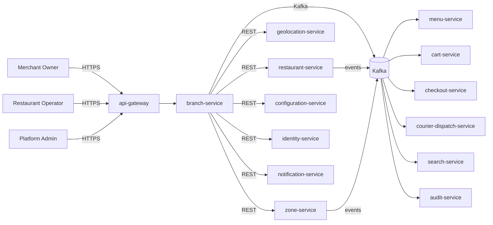

# branch-service — Software Requirements Specification

## 1. Introduction

This SRS specifies the software behavior of `branch-service`. It
covers functional requirements, non-functional requirements, data
requirements, API contract summaries, validation, state
transitions, authorization, idempotency, performance,
availability, security, and disaster recovery. The service is the
source of truth for the `Branch` aggregate.

## 2. Scope

In scope:

- Branch CRUD (create, read, update, soft delete).
- Address, geocoded point, weekly hours, special hours, prep
  capacity, busy state, temporary closure.
- Cascade handling from parent restaurant events.
- Zone drift auto-closure.

Out of scope:

- Restaurant brand, menu, staff (owned by sibling services).
- Orders and prep state (owned by `food-order-service` and
  `restaurant-order-mgmt-service`).
- Courier assignment (owned by `courier-dispatch-service`).
- Geocoding raw data (owned by `geolocation-service`).

## 3. System Context

## 4. Actors

- **Merchant Owner (human)** — Keycloak subject with role
  `merchant_owner`.
- **Merchant Ops (human)** — Keycloak subject with role
  `merchant_ops`.
- **Restaurant Operator (human)** — Keycloak subject with role
  `restaurant_staff`.
- **Platform Admin (human)** — full access.
- **`restaurant-service` (system)** — parent; cascade events.
- **`geolocation-service` (system)** — geocoding.
- **`zone-service` (system)** — zone validation; zone drift.
- **`menu-service` (system)** — read.
- **`cart-service` / `checkout-service` (system)** — read
  open/closed.
- **`courier-dispatch-service` (system)** — read open, busy, temp
  closure.
- **`audit-service` (system)** — receives audit events.

## 5. Functional Requirements

| ID | Requirement | Priority |
|----|-------------|----------|
| FR--001 | The service MUST accept a `POST /v1/branches` with `restaurant_id`, `name`, `address`, `timezone`, `hours`, `prep_capacity`. | MUST |
| FR--002 | The service MUST verify the parent restaurant is `approved` via `restaurant-service`. | MUST |
| FR--003 | The service MUST geocode the address via `geolocation-service` and store the normalized point. | MUST |
| FR--004 | The service MUST verify the branch is within a serving zone via `zone-service`. | MUST |
| FR--005 | The service MUST support `PUT /v1/branches/{id}/hours` to set weekly hours. | MUST |
| FR--006 | The service MUST support `POST /v1/branches/{id}/special-hours` to add a special date / holiday. | MUST |
| FR--007 | The service MUST support `DELETE /v1/branches/{id}/special-hours/{sid}` to remove a special date. | MUST |
| FR--008 | The service MUST support `POST /v1/branches/{id}/busy` to mark busy. | MUST |
| FR--009 | The service MUST support `DELETE /v1/branches/{id}/busy` to clear busy. | MUST |
| FR--010 | The service MUST support `POST /v1/branches/{id}/temporary-closure` to set a closure window. | MUST |
| FR--011 | The service MUST support `DELETE /v1/branches/{id}/temporary-closure` to clear a closure. | MUST |
| FR--012 | The service MUST auto-clear temporary closures after the end time (scheduled job). | MUST |
| FR--013 | The service MUST support `POST /v1/branches/{id}/close` (admin only) to permanently close the branch. | MUST |
| FR--014 | The service MUST support `POST /v1/branches/{id}/open` (admin only) to re-open a previously closed branch (if not terminal). | SHOULD |
| FR--015 | The service MUST support `PATCH /v1/branches/{id}` for profile fields. | MUST |
| FR--016 | The service MUST expose `GET /v1/branches/{id}/open` (cached, P99 < 30 ms). | MUST |
| FR--017 | The service MUST expose `GET /v1/branches/{id}/busy` (cached, P99 < 30 ms). | MUST |
| FR--018 | The service MUST support cursor pagination on `GET /v1/branches` with filters. | MUST |
| FR--019 | The service MUST cascade parent restaurant `suspended` to all non-terminal branches as temporary closures with reason `parent_suspended`. | MUST |
| FR--020 | The service MUST cascade parent restaurant `closed` to all non-terminal branches as permanent closures. | MUST |
| FR--021 | The service MUST auto-temporarily-close a branch that falls out of a serving zone (`zone.updated.v1`). | MUST |
| FR--022 | The service MUST publish a `branch.*.v1` event for every state change. | MUST |
| FR--023 | The service MUST reject any write on a `closed` branch with 410 `BRANCH_CLOSED`. | MUST |
| FR--024 | The service MUST emit `admin.audit.branch.*` events for every admin action. | MUST |

## 6. Non-Functional Requirements

| ID | Category | Requirement | Target |
|----|----------|-------------|--------|
| NFR--001 | performance | P99 `GET /v1/branches/{id}/open` | < 30 ms (cache hit) |
| NFR--002 | performance | P99 `GET /v1/branches/{id}` | < 150 ms |
| NFR--003 | performance | P99 `POST /v1/branches` | < 1 s (excluding geocode) |
| NFR--004 | availability | service uptime | 99.95% over 30 days |
| NFR--005 | scalability | `open` / `busy` lookups | ≥ 20,000 RPS via Redis |
| NFR--006 | scalability | concurrent writes | ≥ 200 RPS sustained, 1,000 RPS burst |
| NFR--007 | maintainability | MTTR for P1 | < 30 min |
| NFR--008 | data-integrity | zero event loss | outbox + 24 h ack |
| NFR--009 | latency | geocode P99 | < 3 s; circuit-open if > 5 s |
| NFR--010 | observability | every state change queryable in audit | 100% |

## 7. API Requirements

REST API under `/v1/branches[...]` per
[`API_STANDARDS.md`](../../architecture/API_STANDARDS.md). All
write endpoints require an `Idempotency-Key` header. Cursor
pagination by default. OpenAPI 3.1 spec at `/openapi.json`.

(Full contracts in `INTEGRATION.md`.)

## 8. Data Requirements

| ID | Requirement | Notes |
|----|-------------|-------|
| DATA--001 | Branches are uniquely identified by `id UUIDv7`. | primary key |
| DATA--002 | Every mutable table has `created_at`, `updated_at`, `created_by`, `updated_by`, `deleted_at`. | audit |
| DATA--003 | `state` is a CHECK-constrained enum. | lifecycle |
| DATA--004 | `restaurant_id` is a UUID column with no DB FK. | cross-service ref |
| DATA--005 | `address` is structured (street, city, region, postal_code, country). | structured |
| DATA--006 | `location` is a PostGIS `geometry(Point, 4326)` column with a GIST index. | geo |
| DATA--007 | Weekly hours are stored in `branch_hours` (one row per day of week). | normalized |
| DATA--008 | Special hours are stored in `branch_special_hours`. | normalized |
| DATA--009 | Temporary closures are stored in `branch_temporary_closures`. | normalized |
| DATA--010 | `prep_capacity` is a non-negative integer. | input |
| DATA--011 | `busy` is a boolean; `busy_at`, `busy_actor_kc_sub` recorded. | audit |

(Full schema in `ERD.md`.)

## 9. Validation Rules

- `name` — 1..120 chars.
- `address.country` — ISO-3166-1 alpha-2.
- `address.postal_code` — country-appropriate regex from
  `configuration-service`.
- `timezone` — IANA, e.g. `Europe/Amsterdam`.
- `prep_capacity` — int in `[0, branch.prep_capacity.max]`.
- `hours[].day` — `mon|tue|wed|thu|fri|sat|sun`.
- `hours[].open` / `close` — `HH:MM` in the branch timezone;
  `close > open` (a closure is a separate "closed" row, not an
  overnight).
- `special_hours[].date` — ISO date; the entry is either an
  override of the regular hours or a closure.
- `temporary_closure[].end` — must be after `start`.

## 10. State Transitions

| From | To | Trigger |
|------|----|---------|
| `open` | `temporarily_closed` | `POST /temporary-closure` (operator) |
| `open` | `temporarily_closed` | cascade (parent suspended) |
| `open` | `temporarily_closed` | zone drift |
| `temporarily_closed` | `open` | `DELETE /temporary-closure` (operator) |
| `temporarily_closed` | `open` | scheduled job after end time |
| `temporarily_closed` | `open` | cascade re-instatement |
| `open` | `closed` | admin `POST /close` |
| `open` | `closed` | cascade (parent closed) |
| `temporarily_closed` | `closed` | admin `POST /close` |
| `temporarily_closed` | `closed` | cascade (parent closed) |
| `closed` | — | terminal |

State transitions are described in detail in `WORKFLOWS.md`.

## 11. Authorization Requirements

- `merchant_owner` of the parent restaurant may create branches,
  update profile, set hours, and clear temporary closures.
- `merchant_ops` may update profile and set hours.
- `restaurant_staff` may toggle busy, set temporary closure,
  and clear temporary closure; read-only on hours.
- `platform_admin` has full access and may permanently close.
- Cascade handlers act as the system actor; the source of truth
  is the originating event.

## 12. Configuration Requirements

- `branch.default_hours` — object<day, open, close>.
- `branch.prep_capacity.default` — int.
- `branch.prep_capacity.max` — int.
- `branch.busy.threshold_orders` — int.
- `branch.hours.timezone.default` — IANA string.
- `branch.cascade.suspend_to_temp_closure` — bool.
- `branch.api.rate_limit_per_user` — int.

## 13. Error Handling

| Error | Response |
|-------|----------|
| Body validation failure | 400 `VALIDATION_FAILED` with `details[]` |
| Missing/invalid JWT | 401 `UNAUTHENTICATED` |
| Insufficient role | 403 `FORBIDDEN` |
| Parent restaurant not approved | 409 `RESTAURANT_NOT_APPROVED` |
| Parent restaurant suspended | 409 `RESTAURANT_SUSPENDED` |
| Geocode failure | 422 `GEOCODE_FAILED` |
| Outside zone | 422 `OUT_OF_ZONE` |
| Illegal state transition | 409 `STATE_INVALID` |
| Write on `closed` | 410 `BRANCH_CLOSED` |
| Idempotency key reused | 422 `IDEMPOTENCY_KEY_REUSED` |
| Rate limited | 429 `RATE_LIMITED` |
| Downstream (restaurant, geolocation, zone) timeout | 503 `DEPENDENCY_TIMEOUT` |
| Circuit open | 503 `CIRCUIT_OPEN` |
| Other | 500 `INTERNAL_ERROR` |

## 14. Concurrency Requirements

- Two concurrent `busy` toggles MUST be serialized via row-level
  lock; the second one receives 409 `STATE_INVALID` if the first
  changed the state.
- Two concurrent `temporary-closure` calls MUST be serialized.
- Cascade handlers MUST be idempotent via inbox dedup.

## 15. Idempotency Requirements

- All write endpoints require `Idempotency-Key`.
- All state transitions use the outbox pattern with `event_id`
  dedup on the consumer side.

## 16. Performance

- Dominant path: `GET /v1/branches/{id}/open`. P50 < 5 ms
  (cache hit), P99 < 30 ms.
- `GET /v1/branches/{id}`: P50 < 30 ms, P99 < 150 ms.
- `POST /v1/branches`: P50 < 500 ms, P99 < 1 s (excluding
  geocode).

## 17. Scalability

- Horizontal: HPA on CPU > 60% and
  `http_requests_in_flight > 500/replica`; max 12.
- Vertical: up to 4 CPU / 8 GiB.
- DB: 1 primary + 1 read replica in each region.
- Cache: Redis cluster, key `branch:open:{id}` TTL 30 s, key
  `branch:busy:{id}` TTL 15 s.

## 18. Availability

- SLO: 99.95% over 30 days.
- Error budget: ~22 min / 30 days.
- Maintenance: Sunday 04:00–06:00 UTC.

## 19. Security

| ID | Requirement | Notes |
|----|-------------|-------|
| SEC--001 | All endpoints require a valid JWT; service-to-service uses `client_credentials`. | gateway enforced |
| SEC--002 | Admin actions require `X-Audit-Reason` and HMAC-SHA256 signature. | `API_STANDARDS.md` §14 |
| SEC--003 | `close` requires a second admin's co-signature (break-glass). | `SECURITY_ARCHITECTURE.md` §3 |
| SEC--004 | Resource-level ownership checks. | `branch.restaurant.merchant.owner_kc_sub == sub` |
| SEC--005 | All cross-service calls use mTLS + `client_credentials` JWT. | defense in depth |
| SEC--006 | Secrets only in Vault. | pre-commit enforced |
| SEC--007 | Rate limiting at gateway and service. | `API_STANDARDS.md` §12 |
| SEC--008 | No PII beyond the operator's Keycloak subject. | minimal |
| SEC--009 | Admin actions emit `admin.audit.branch.*` events. | `audit-service` |
| SEC--010 | The service stores no card data; PCI scope is none. | SAQ-A |

## 20. Privacy

- PII stored: minimal. The address is public (customers need it).
  The operator Keycloak subject is held as `created_by` for
  audit; classified `internal`.
- Retention: 7 years (soft delete on `close`).
- Erasure: not applicable (no merchant PII).

## 21. Auditability

- Every state transition emits a `branch.*.v1` event.
- Every admin action emits an `admin.audit.branch.*` event.
- Audit retention: 7 years.

## 22. Observability

- Logs: JSON to stdout with `correlation_id`, `trace_id`,
  `branch_id`, `restaurant_id`, `state`, `from_state`, `to_state`,
  `actor`, `reason_code`.
- Metrics:
  - RED: standard.
  - Business: `branches_created_total{country}`,
    `branches_open_total`,
    `branches_busy_total`,
    `branches_temporary_closure_total{reason}`,
    `branch_hours_change_total`,
    `branch_geocode_seconds`,
    `branch_open_lookups_total{cache_hit}`,
    `branch_zone_drift_total`.
- Traces: OpenTelemetry.
- Alerts: SLO burn rate, outbox lag, hours propagation lag,
  geocode circuit open.

## 23. Maintainability

- TypeScript strict, ESLint, Prettier.
- Coverage: ≥ 85% lines.
- Documentation: this folder.

## 24. Disaster Recovery

- RPO: 5 min (PITR 30 days for Tier-1).
- RTO: 30 min.
- Quarterly restore drill.

## 25. Acceptance Criteria

- AC-1: A merchant can create a branch in < 15 min.
- AC-2: The branch's open status is reflected in cart and
  checkout within 30 s of an hours change.
- AC-3: A busy toggle is reflected in dispatch within 10 s.
- AC-4: A temporary closure blocks checkouts.
- AC-5: A permanent closure is terminal.
- AC-6: A suspended restaurant's branches are all temporarily
  closed within 30 s.
- AC-7: A closed restaurant's branches are all permanently
  closed.
- AC-8: A branch outside a serving zone is auto-temporarily
  closed within 5 min of the zone change.
- AC-9: All admin actions are recorded with reason and actor.
- AC-10: The service meets its 99.95% SLO.

---

## See also

### Sibling docs for this service

- [`README.md`](./README.md) — purpose, bounded context, responsibilities
- [`BRD.md`](./BRD.md) — business requirements
- [`SRS.md`](./SRS.md) — functional + non-functional requirements
- [`ERD.md`](./ERD.md) — data model (entities, relationships)
- [`INTEGRATION.md`](./INTEGRATION.md) — inter-service contracts (APIs, events, sagas)
- [`WORKFLOWS.md`](./WORKFLOWS.md) — operational workflows (happy paths, failure modes)
- [`TECH.md`](./TECH.md) — technology profile (runtime, libraries, data layer, admin endpoints, RBAC)

### Platform-wide

- [`../../shared/README.md`](../../shared/README.md) — `platform-spring-boot-starter` shared library (the single source of cross-cutting code for all Spring Boot services in the platform)
- [`../RECOMMENDATIONS.md`](../RECOMMENDATIONS.md) — platform-wide technology map (language, framework, version baseline, admin/RBAC pattern)
- [`../../README.md`](../../README.md) — services overview (the catalog of all 58 services)
- [`../../../main.md`](../../../main.md) — top-level platform specification (architecture, Keycloak, PostgreSQL 18, messaging, observability baseline)

